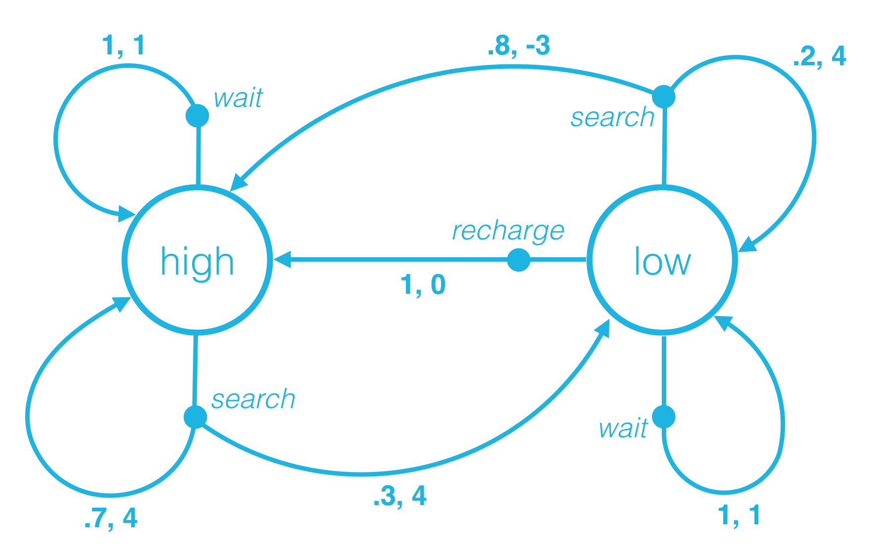

# S-1: Foundations and Classical Methods in Reinforcement Learning

# C-1: Foundations of Reinforcement Learning

1. Reinforcement Learning Fundamentals

    - The RL Framework and Core Components
    - Agent-Environment Interaction
    - Real-World Applications of RL
    - Reward Signals and Design Principles

2. Mathematical Foundations

    - Returns and Discounting
    - State and Action Value Functions
    - Policies and Optimal Behavior
    - The Bellman Equations

3. Markov Decision Processes
    - The Markov Property
    - MDP Formalization
    - One-Step Dynamics
    - Episodic vs Continuing Tasks

---

#### Reinforcement Learning Fundamentals

##### Deep Learning Learning Paradigms

Most deep learning applications fall into the supervised learning category, but there are important distinctions to
make:

**Supervised Deep Learning (Most Common):**

- **Classification**: CNNs for image recognition, transformers for text classification
- **Regression**: Neural networks predicting continuous values
- **Sequence-to-sequence**: Machine translation, speech recognition
- **Object detection**: YOLO, R-CNN architectures

**Unsupervised Deep Learning:**

- **Autoencoders**: Learn compressed representations by reconstructing input data
- **Variational Autoencoders (VAEs)**: Generate new data similar to training distribution
- **Generative Adversarial Networks (GANs)**: Two networks competing to generate realistic data
- **Self-organizing maps**: Neural networks for dimensionality reduction
- **Deep clustering**: Neural networks that learn to group similar data points

**Self-Supervised Learning (Emerging Paradigm):** This has become increasingly important and blurs the line between
supervised and unsupervised:

- **Masked language modeling**: BERT learns by predicting masked words
- **Contrastive learning**: Learning representations by comparing similar/dissimilar examples
- **Next frame prediction**: Video models learning by predicting future frames
- **Rotation prediction**: Learning visual features by predicting image rotations

**Semi-Supervised Deep Learning:**

- Combines small amounts of labeled data with large amounts of unlabeled data
- **Pseudo-labeling**: Using confident predictions on unlabeled data as training labels
- **Consistency regularization**: Ensuring similar outputs for perturbed versions of the same input

**Deep Reinforcement Learning:**

- **Deep Q-Networks (DQN)**: Using neural networks to approximate Q-functions
- **Policy Gradient Methods**: Neural networks directly learning policies
- **Actor-Critic**: Combining value function and policy learning with deep networks

The landscape has evolved significantly. While supervised learning dominated early deep learning success stories
(ImageNet, machine translation), unsupervised and self-supervised methods have become crucial for learning from vast
amounts of unlabeled data, particularly in natural language processing where models like GPT and BERT learn rich
representations without explicit labels for downstream tasks.

##### The RL Framework and Core Components

Reinforcement learning (RL) represents a distinctive machine learning paradigm fundamentally different from supervised
or unsupervised approaches. While supervised learning trains on labeled examples and unsupervised learning identifies
patterns in unlabeled data, reinforcement learning focuses on how agents should act in an environment to maximize
cumulative rewards.

This learning paradigm draws inspiration from behavioral psychology, particularly the concept of operant conditioning,
where behavior is shaped through rewards and punishments. The central question in reinforcement learning is: "How should
an agent behave in an environment to maximize its cumulative reward?”

  
Figure: Agent-Environment interaction in reinforcement learning
 

The core components of the reinforcement learning framework include:

**1. Agent**: The decision-making entity that interacts with and learns from the environment. The agent implements a
learning algorithm that enables it to improve its behavior over time based on experience.

**2. Environment**: The external system with which the agent interacts. The environment presents states to the agent,
receives its actions, and provides feedback in the form of rewards. The environment may represent a physical system
(e.g., a robot's surroundings), a simulation (e.g., a game), or an abstract system (e.g., a financial market).

**3. State** $(S_t)$: A representation of the current situation within the environment at time $t$. The state
encapsulates all relevant information needed for decision-making. States can be:

- Fully or partially observable
- Discrete (finite set of distinct states) or continuous (infinite, smoothly varying states)
- Low-dimensional (few variables) or high-dimensional (many variables)

**4. Action** $(A_t)$: The set of possible decisions the agent can make. Like states, actions can be discrete (e.g.,
move left/right/up/down) or continuous (e.g., applying specific torques to robot joints). The set of available actions
may depend on the current state.

**5. Reward** $(R_t)$: The feedback signal that indicates the immediate value of the current state-action transition.
The reward is a scalar value that guides the learning process—higher values indicate more desirable outcomes. The reward
function is the formal specification of the agent's goal.

**6. Policy** $(\pi)$: The agent's strategy for selecting actions based on perceived states. A policy maps states to
actions (or probability distributions over actions). It can be deterministic ($\pi(s) = a$) or stochastic
($\pi(a|s) = P(A_t = a | S_t = s)$).

**7. Value Function**: An estimation of the expected cumulative future reward from a given state or state-action pair.
Value functions help agents evaluate the long-term desirability of states and actions beyond immediate rewards.

**8. Model**: A representation of the agent's understanding of the environment dynamics—how states transition and
rewards are generated. Not all RL approaches require a model (model-free methods), while others leverage models for
planning (model-based methods).

This diagram shows the key relationships:

- The **Agent-Environment Loop**: Agent takes actions, environment responds with new states and rewards
- The **Policy** guides action selection based on current state
- **Value Functions** estimate long-term desirability of states/actions
- The **Learning Algorithm** updates the agent's knowledge from experience
- The **Model** (optional) represents the agent's understanding of environment dynamics
- **Experience Tuples** capture the fundamental data used for learning

The cyclical nature emphasizes how reinforcement learning is an ongoing process where the agent continuously interacts
with the environment, receives feedback, and improves its decision-making strategy over time.

The reinforcement learning process follows a cyclical pattern:

- The agent observes the current state $S_t$ of the environment.
- Based on this state, the agent selects an action $A_t$ according to its policy.
- The environment responds by transitioning to a new state $S_{t+1}$ and providing a reward $R_{t+1}$.
- The agent updates its knowledge (policy and/or value functions) based on this experience.
- The process repeats, with the agent continuously refining its behavior to maximize long-term reward.

This framework encompasses a wide range of algorithms and applications, from simple tabular methods suitable for small,
discrete environments to sophisticated deep reinforcement learning approaches capable of mastering complex games and
controlling robotic systems in continuous, high-dimensional spaces.

##### Agent-Environment Interaction

The interaction between the agent and environment constitutes the foundation of the reinforcement learning paradigm.
This interaction is sequential and continuous, forming what we call the agent-environment loop—a fundamental process
that generates the experiences from which learning occurs.

In formal terms, at each discrete time step $t$, the following sequence occurs:

- The agent receives a representation of the environment's state $S_t \in \mathcal{S}$, where $\mathcal{S}$ represents
  the complete set of possible states.
- Based on this state, the agent selects an action $A_t \in \mathcal{A}(S_t)$, where $\mathcal{A}(S_t)$ represents the
  set of actions available in state $S_t$.
- As a consequence of this action, the environment transitions to a new state $S_{t+1}$ according to its dynamics and
  generates a reward $R_{t+1}$.
- The agent receives the new state $S_{t+1}$ and reward $R_{t+1}$, which it uses to update its policy or value
  estimates.

This interaction generates a trajectory or history that can be represented as a sequence:

- **Tuple notation**: $(S_0, A_0, R_1, S_1, A_1, R_2, S_2, A_2, \ldots)$
- **Subscript emphasis**: $S_0^{}, A_0^{}, R_1^{}, S_1^{}, A_1^{}, R_2^{}, \ldots$
- **Vector notation**: $\tau = [S_0, A_0, R_1, S_1, A_1, R_2, \ldots]$

A crucial aspect of this interaction is the timing of events. The reward $R_{t+1}$ is the consequence of the action
$A_t$ taken in state $S_t$. It is received alongside the next state $S_{t+1}$. This temporal relationship is essential
for understanding the credit assignment problem in RL—determining which actions in a sequence were responsible for which
rewards.

Several important characteristics of this interaction merit further discussion:

**1. Temporal Nature**: Unlike supervised learning, where training examples can be treated independently, RL involves a
sequence of dependent decisions. Current actions affect not only immediate rewards but also future states and,
consequently, future opportunities for rewards.

**2. Delayed Feedback**: The effects of an action might not be immediately apparent. A chess move might seem neutral at
first but prove decisive many moves later. This delay between action and consequence creates challenges for learning.

**3. Non-stationarity**: As the agent learns and its policy changes, the distribution of states it encounters also
changes. This non-stationarity distinguishes RL from many other machine learning paradigms where training data is
assumed to be independently and identically distributed.

**4. Exploration-Exploitation Dilemma**: The agent must balance two competing objectives:

- **Exploitation**: Using current knowledge to maximize immediate reward
- **Exploration**: Gathering more information that might lead to better rewards in the future

This fundamental tension has no perfect solution and requires careful management strategies.

The agent-environment boundary is conceptual rather than physical. For example, in a robot learning to walk, the motors
and mechanical components might be considered part of the agent, while the external physical world constitutes the
environment. However, the boundary could be drawn differently depending on the problem formulation.

A distinctive feature of reinforcement learning is that the agent must learn from its own experiences—it does not have
access to labeled examples of correct behavior as in supervised learning. Instead, it must explore the environment,
observe the consequences of its actions, and adapt its behavior accordingly. This self-guided learning process makes RL
particularly powerful for problems where optimal behavior is difficult to demonstrate but success can be measured.

##### Real-World Applications of RL

Reinforcement learning has demonstrated remarkable success across diverse domains, showcasing its versatility and
potential for solving complex sequential decision-making problems. Understanding these applications provides insight
into the capabilities and limitations of RL approaches.

**Game Playing**

Games provide well-defined environments with clear rules and objectives, making them ideal testbeds for reinforcement
learning algorithms:

- **Classic Board Games**: RL has achieved superhuman performance in games long considered the pinnacle of human
  strategic thinking:
    - **Chess**: DeepMind's AlphaZero mastered chess through self-play without human knowledge beyond the rules,
      developing novel strategies and defeating world-champion programs.
    - **Go**: AlphaGo and its successors overcame what many considered AI's greatest challenge by defeating world
      champions in a game with more possible positions than atoms in the universe.
    - **Backgammon**: TD-Gammon pioneered the use of temporal difference learning for board games in the early 1990s.
- **Video Games**: RL agents have achieved remarkable results in complex video games:
    - **Atari Games**: Deep Q-Networks (DQN) learned to play multiple Atari games at superhuman levels directly from
      pixel inputs.
    - **StarCraft II**: AlphaStar mastered this complex real-time strategy game, which requires managing economy,
      technology, and combat simultaneously.
    - **Dota 2**: OpenAI Five defeated professional teams in a game requiring teamwork and long-term planning.

These game environments allow researchers to test and improve algorithms in controlled settings before applying them to
more complex real-world problems.

**Robotics and Control**

Reinforcement learning offers a powerful framework for developing robotic systems that can learn complex behaviors
through interaction:

- **Manipulation Tasks**: RL enables robots to learn dexterous manipulation skills such as:
    - Grasping objects of various shapes and textures
    - In-hand manipulation of objects
    - Tool use and assembly tasks
- **Locomotion**: RL has been used to develop walking, running, and jumping behaviors for legged robots that can adapt
  to various terrains and disturbances.
- **Autonomous Vehicles**: RL contributes to decision-making systems for autonomous navigation in complex environments:
    - Lane changing and merging in traffic
    - Navigation through construction zones
    - Adapting to adverse weather conditions

The ability to learn from trial and error makes RL particularly valuable for robotics problems where explicit
programming is impractical due to the complexity of the task or environment.

**Healthcare Applications**

Reinforcement learning offers promising approaches to personalized medicine and clinical decision support:

- **Treatment Optimization**: RL can help optimize treatment strategies for chronic conditions:
    - Determining optimal dosing schedules for patients with diabetes
    - Personalizing treatment plans for cancer patients
    - Managing sedation in intensive care units
- **Clinical Trials**: Adaptive trial designs use RL principles to allocate patients to treatments dynamically based on
  observed outcomes.
- **Medical Imaging**: RL methods improve medical image acquisition and analysis:
    - Optimizing MRI scan parameters to reduce scan time while maintaining quality
    - Automated diagnosis from medical images with efficient region scanning

These applications require careful consideration of safety constraints and interpretability requirements.

**Resource Management**

RL excels at optimizing complex systems with many interacting components:

- **Data Center Management**: Google reduced cooling energy in their data centers by 40% using RL to optimize cooling
  systems based on hundreds of sensors and actuators.
- **Power Grid Management**: RL approaches help integrate renewable energy sources and manage demand response in modern
  power grids.
- **Network Routing**: RL algorithms adaptively route network traffic to minimize congestion and maximize throughput in
  telecommunications networks.
- **Computing Resource Allocation**: RL optimizes the allocation of computational resources in cloud computing
  environments.

**Financial Applications**

The financial sector has adopted RL for various applications:

- **Algorithmic Trading**: RL strategies can adapt to changing market conditions and learn complex patterns in market
  data.
- **Portfolio Management**: RL helps optimize asset allocation across multiple investment options while balancing risk
  and return.
- **Risk Management**: RL models identify and respond to emerging risks in complex financial systems.
- **Market Making**: RL optimizes bid-ask spreads and inventory management for market makers.

**Recommendation Systems**

Modern digital platforms use RL to optimize user experience:

- **Content Recommendation**: Services like Netflix and YouTube use RL to recommend videos that maximize long-term user
  engagement.
- **E-commerce Recommendations**: Online retailers employ RL to suggest products based on browsing history and purchase
  patterns.
- **Advertisement Placement**: RL optimizes ad selection and placement to maximize click-through rates and conversion.

These applications demonstrate that RL is particularly effective in domains with the following characteristics:

- Sequential decision-making problems
- Clear reward signals (or constructible reward functions)
- Environments that are too complex to model explicitly
- Problems where exploration can be safely conducted
- Tasks that benefit from continuous improvement through experience

As algorithms improve and computational resources expand, we can expect reinforcement learning to address increasingly
complex real-world challenges across even more diverse domains.

##### Reward Signals and Design Principles

The reward signal constitutes the fundamental mechanism through which we communicate the objective of a reinforcement
learning problem to an agent. It defines what we want the agent to achieve, not how to achieve it. The design of
appropriate reward functions is perhaps the most crucial aspect of formulating a reinforcement learning problem, as it
directly shapes the behavior the agent will learn.

**Reward Function Formalization**

A reward function maps state-action-next state triplets to a scalar value:

$$
R(s, a, s') = \mathbb{E}[R_{t+1} | S_t=s, A_t=a, S_{t+1}=s']
$$

This value represents the expected immediate reward for transitioning from state $s$ to state $s'$ after taking action
$a$. In many cases, the reward function is simplified to depend only on the state and action $R(s, a)$, or even just the
state $R(s)$.

###### Expected Reward Function Notation

This equation defines the **expected immediate reward** for a specific state transition:

$$R(s, a, s') = \mathbb{E}[R_{t+1} | S_t=s, A_t=a, S_{t+1}=s']$$

**Breaking down the components:**

**Left side: $R(s, a, s')$**

- This is a **deterministic function** that outputs a single expected value
- Takes three inputs: current state $s$, action $a$, and next state $s'$
- Represents the **average reward** you can expect for this specific transition

**Right side: $\mathbb{E}[R_{t+1} | S_t=s, A_t=a, S_{t+1}=s']$**

- $\mathbb{E}[\cdot]$ is the expectation operator (expected value)
- $R_{t+1}$ is the **random variable** representing the actual reward received at time $t+1$
- The vertical bar $|$ means "given that" or "conditional on"
- The condition specifies the exact transition: from state $s$, taking action $a$, ending up in state $s'$

**Why is this expectation needed?**

Even for the same state-action-next state triplet $(s, a, s')$, the actual reward $R_{t+1}$ might vary due to:

1. **Stochastic reward functions**: The environment might give slightly different rewards for the same transition
2. **Measurement noise**: Sensor readings might introduce variability
3. **Environmental randomness**: External factors might affect the reward

**Concrete Example:**

Consider a robot picking up objects:

- $s$: Robot at position A, object present
- $a$: Attempt to grasp object
- $s'$: Robot at position A, object grasped

The actual reward $R_{t+1}$ might be:

- +10 if grasp is perfect
- +8 if grasp is slightly off-center
- +6 if grasp is successful but awkward

So $R(s, a, s') = \mathbb{E}[R_{t+1}] = 0.4 \times 10 + 0.4 \times 8 + 0.2 \times 6 = 8.4$

**Relationship to other reward notations:**

- $R(s, a)$: Expected reward depends only on state and action (averaged over all possible next states)
- $R(s)$: Expected reward depends only on state (averaged over all possible actions and next states)
- $R(s, a, s')$: Most specific form, conditioning on the exact transition

This notation provides the mathematical foundation for computing value functions and is essential for algorithms that
need to estimate expected returns from specific state transitions.

  
Figure: Reward function decomposition for robot locomotion
 

**Temporal Characteristics of Rewards**

Unlike supervised learning, where feedback is immediate and direct, rewards in RL may exhibit various temporal
characteristics:

1. **Immediate Rewards**: Feedback provided directly after each action (e.g., points scored in a game).
2. **Delayed Rewards**: Feedback that comes only after a sequence of actions (e.g., winning or losing a chess game).
3. **Sparse Rewards**: Significant rewards that occur infrequently (e.g., reaching a goal state).
4. **Dense Rewards**: Frequent feedback provided throughout the learning process (e.g., distance-based rewards in
   navigation).

The temporal distribution of rewards creates the credit assignment problem: determining which actions in a sequence
contributed to an eventual reward. Methods like temporal difference learning and eligibility traces help address this
challenge.

###### Detailed Analysis of the Robot Locomotion Reward Function

The equation shown in the diagram represents a carefully crafted reward function for training a bipedal robot to walk
effectively. Let me break down each component:

**Mathematical Decomposition:**

$$
r = \min(v_x, v_{max}) - 0.005(v_y^2 + v_z^2) - 0.05y^2 - 0.02||u||^2 + 0.02
$$

**Term-by-Term Analysis:**

1. **$\min(v_x, v_{max})$ - Forward Velocity Reward**
    - Encourages the robot to move forward in the x-direction
    - Uses $\min$ function to cap the reward at $v_{max}$, preventing the robot from moving too fast
    - This promotes steady, controlled forward motion rather than reckless speed
    - Linear reward up to the maximum desired velocity
2. **$-0.005(v_y^2 + v_z^2)$ - Lateral and Vertical Motion Penalty**
    - Penalizes sideways motion ($v_y$) and vertical motion ($v_z$)
    - Squared terms create increasingly harsh penalties for larger deviations
    - The coefficient 0.005 is relatively small, allowing some natural sway during walking
    - Encourages straight-line locomotion without excessive bouncing or swaying
3. **$-0.05y^2$ - Center Path Deviation Penalty**
    - Penalizes deviation from the center line of the walking path
    - Quadratic penalty becomes more severe as the robot strays further from center
    - Coefficient 0.05 is larger than the velocity penalty, indicating path-following is important
    - Maintains straight-line walking behavior
4. **$-0.02||u||^2$ - Energy Efficiency Term**
    - $||u||^2$ represents the squared magnitude of control inputs (torques applied to joints)
    - Penalizes high energy consumption, encouraging efficient movement
    - Promotes smooth, natural gaits rather than jerky, high-energy movements
    - Helps prevent actuator saturation and reduces wear on mechanical components
5. **$+0.02$ - Survival Bonus**
    - Small constant positive reward for each time step the robot remains upright
    - Encourages the robot to avoid falling or entering terminal states
    - Provides baseline positive reinforcement even when other objectives aren't perfectly met

**Design Philosophy:**

This reward function exemplifies several key principles of reward engineering:

**Multi-Objective Optimization:** The function balances competing objectives:

- Speed vs. stability (forward velocity vs. lateral motion control)
- Performance vs. efficiency (forward progress vs. energy consumption)
- Task completion vs. constraint satisfaction (reaching goals vs. staying on path)

**Shaped Rewards:** Rather than providing reward only upon task completion, this function provides continuous feedback
that guides learning toward desired behaviors throughout the trajectory.

**Coefficient Tuning:** The relative magnitudes of coefficients (0.005, 0.05, 0.02) reflect the designer's priorities:

- Path deviation is penalized most heavily (0.05)
- Energy consumption has moderate penalty (0.02)
- Lateral motion has the smallest penalty (0.005), allowing natural walking dynamics

**Quadratic vs. Linear Terms:**

- Quadratic penalties ($v_y^2$, $v_z^2$, $y^2$, $||u||^2$) create smooth gradients that become steeper away from the
  desired behavior
- Linear reward ($v_x$ up to $v_{max}$) provides consistent encouragement for forward motion

**Potential Issues and Considerations:**

1. **Reward Hacking:** The robot might find unexpected ways to maximize this function without achieving desired walking
   behavior
2. **Local Optima:** The quadratic terms might create local optima that prevent discovery of optimal gaits
3. **Hyperparameter Sensitivity:** The specific coefficients may require extensive tuning for different robot
   morphologies
4. **Generalization:** This reward function is specific to straight-line walking and wouldn't generalize to turning or
   complex navigation

This reward function demonstrates sophisticated reward engineering that combines multiple behavioral objectives into a
single scalar signal, enabling the robot to learn complex locomotion behaviors through reinforcement learning while
satisfying multiple constraints and objectives simultaneously.

This function elegantly combines multiple objectives:

1. $\min(v_x, v_{max})$: Encourages forward velocity up to a maximum speed
2. $-0.005(v_y^2 + v_z^2)$: Penalizes sideways and vertical motion
3. $-0.05y^2$: Penalizes deviation from the center path
4. $-0.02||u||^2$: Minimizes energy consumption through torque minimization
5. $+0.02$: Provides a small bonus for remaining upright

Each term addresses a specific aspect of the desired behavior, creating a balanced overall objective that, when
optimized, results in efficient, stable walking.

**Reward Design Challenges**

Several common challenges arise in reward function design:

1. **Reward Hacking**: Agents often find unexpected ways to maximize reward without achieving the designer's intent. For
   example, if a cleaning robot is rewarded for not seeing dirt, it might learn to close its cameras or avoid rooms
   altogether.
2. **Misspecification**: The reward function may not accurately capture what we truly value. For instance, rewarding a
   chess agent solely for capturing pieces might lead to reckless play rather than winning the game.
3. **Reward Sparsity**: When significant rewards occur rarely, learning becomes extremely difficult. Navigation tasks
   where reward is given only upon reaching the goal suffer from this problem.
4. **Competing Objectives**: Multiple goals may conflict with each other, creating confusion for the learning agent. A
   self-driving car balancing safety (drive slowly) with efficiency (reach destination quickly) exemplifies this
   challenge.
5. **Reward Scale**: The magnitude of rewards affects learning dynamics; improper scaling can lead to unstable learning
   or misplaced emphasis on certain aspects of behavior.

**Effective Reward Design Principles**

To address these challenges, several principles guide effective reward design:

1. **Alignment with True Objectives**: Ensure the reward genuinely represents what you want the agent to accomplish, not
   a proxy that can be exploited.
2. **Simplicity**: When possible, use simple reward functions that are less prone to misspecification and exploitation.
   The reward function should be the simplest one that correctly captures the task.
3. **Careful Shaping**: If using reward shaping (providing intermediate rewards to guide learning), ensure shaped
   rewards don't introduce behaviors that conflict with the original goal. Potential-based shaping provides theoretical
   guarantees of policy invariance.
4. **Robustness to Exploitation**: Anticipate how agents might exploit the reward function and design safeguards against
   unintended behaviors.
5. **Curriculum Design**: Consider starting with simpler tasks and gradually increasing difficulty, adjusting rewards
   accordingly to facilitate learning of complex behaviors.
6. **Normalization**: Keep reward scales consistent across different aspects of the task to prevent overemphasis on
   certain behaviors due merely to their larger reward magnitude.

**Intrinsic Motivation**

Beyond task-specific rewards, RL agents can benefit from intrinsic motivation—rewards generated by the agent itself:

- **Curiosity**: Rewarding exploration of uncertain states or states where prediction error is high
- **Novelty**: Encouraging visiting rarely-seen states
- **Empowerment**: Rewarding actions that increase the agent's control over future states

These intrinsic rewards can help agents explore effectively in sparse-reward environments, facilitating the discovery of
valuable behaviors that might otherwise be unlikely to be found through random exploration.

Understanding and applying these principles for reward signal design is essential for developing effective reinforcement
learning systems that achieve their intended goals while avoiding unintended consequences. The reward function serves as
the fundamental interface between human designers and learning agents, making its careful design perhaps the most
important aspect of applying reinforcement learning to real-world problems.

#### Mathematical Foundations

##### Returns and Discounting

In reinforcement learning, an agent's objective is to maximize the expected cumulative reward over time, not merely
immediate rewards. This cumulative measure, called the **return**, provides a formal definition of the agent's long-term
goal and forms the mathematical basis for defining value functions and optimal policies.

##### Mathematical Definition of Returns

The concept of return defines what an agent seeks to maximize over time. Different formulations suit different types of
problems and mathematical requirements. The return at time $t$, denoted $G_t$, represents the sum of rewards received
from that point forward. Depending on the nature of the task, returns can be formulated in several ways:

**1. Finite-Horizon Undiscounted Return**

$$
G_t = R_{t+1} + R_{t+2} + R_{t+3} + \ldots + R_T
$$

**Detailed Analysis:**

This equation represents the **total cumulative reward** from time step $t$ until the episode terminates at time $T$.
Each component means:

- $G_t$: The return starting from time $t$
- $R_{t+1}$: Immediate reward received after taking action at time $t$
- $R_{t+2}, R_{t+3}, \ldots$: Subsequent rewards until episode end
- $T$: Final time step of the episode (terminal state reached)

**Mathematical Properties:**

- All rewards are weighted equally (no discounting)
- The sum is guaranteed to be finite since episodes terminate
- Order matters: earlier vs. later rewards have equal importance
- Total episode length affects the magnitude of returns

**Policy Optimization Objective:**

$$
J(\pi) = \mathbb{E}_{\pi}[G_0] = \mathbb{E}_{\pi}[R_1 + R_2 + \ldots + R_T]
$$

**Breaking down this objective:**

- $J(\pi)$: Performance measure for policy $\pi$
- $\mathbb{E}_{\pi}[\cdot]$: Expected value when following policy $\pi$
- $G_0$: Return from the initial state of an episode
- The expectation accounts for stochasticity in state transitions, rewards, and policy actions

**When to use:** Games with clear endings, navigation tasks with goal states, any episodic task where all time steps are
equally important.

**2. Infinite-Horizon Discounted Return**

$$
G_t = R_{t+1} + \gamma R_{t+2} + \gamma^2 R_{t+3} + \ldots = \sum_{k=0}^{\infty} \gamma^k R_{t+k+1}
$$

**Detailed Mathematical Analysis:**

This formulation introduces the discount factor $\gamma \in [0,1]$ to handle infinite horizons:

- $\gamma^0 = 1$: Immediate reward $R_{t+1}$ has full weight
- $\gamma^1 = \gamma$: Next reward $R_{t+2}$ is discounted by factor $\gamma$
- $\gamma^2$: Reward two steps ahead is discounted by $\gamma^2$
- $\gamma^k$: Reward $k$ steps ahead is discounted by $\gamma^k$

**Convergence Analysis:** For bounded rewards $|R_t| \leq R_{max}$, the infinite sum converges:

$$
|G_t| \leq \sum_{k=0}^{\infty} \gamma^k R_{max} = \frac{R_{max}}{1-\gamma}
$$

This geometric series converges when $\gamma < 1$, ensuring finite returns.

**Policy Optimization Objective:**

$$
J(\pi) = \mathbb{E}_{\pi}[G_0] = \mathbb{E}_{\pi}\left[\sum_{k=0}^{\infty} \gamma^k R_{k+1}\right]
$$

**Discount Factor Interpretation:**

- $\gamma = 0$: Agent only cares about immediate rewards (completely myopic)
- $\gamma = 0.9$: Reward 10 steps away worth $0.9^{10} \approx 0.35$ of immediate reward
- $\gamma = 0.99$: Reward 100 steps away worth $0.99^{100} \approx 0.37$ of immediate reward
- $\gamma \to 1$: Agent values future rewards nearly as much as immediate ones

**Economic Interpretation:** $\gamma$ can represent interest rates, uncertainty about the future, or probability of
process termination.

**3. Average Reward Formulation**

$$
J(\pi) = \lim_{h\rightarrow\infty} \frac{1}{h}\mathbb{E}_{\pi}\left[\sum_{t=1}^{h} R_t\right]
$$

**Mathematical Decomposition:**

This formulation focuses on **long-term average performance**:

- $\sum_{t=1}^{h} R_t$: Total reward accumulated over $h$ time steps
- $\frac{1}{h}$: Averaging over the time horizon
- $\lim_{h\rightarrow\infty}$: Taking the limit as time approaches infinity
- $\mathbb{E}_{\pi}[\cdot]$: Expected value under policy $\pi$

**Alternative Notation:**

$$
J(\pi) = \lim_{h\rightarrow\infty} \frac{1}{h} \sum_{t=1}^{h} \mathbb{E}_{\pi}[R_t]
$$

**Key Properties:**

- Scale-invariant: Adding a constant to all rewards doesn't change optimal policy
- No discounting required for mathematical convergence
- Focuses on steady-state behavior rather than transient performance
- Optimal policies maximize the rate of reward accumulation

**Relationship Between Formulations:**

The three formulations are related through limiting processes:

1. **Episodic to Discounted:** As episodes get longer and $\gamma \to 1$, discounted returns approach undiscounted
   episodic returns

2. **Discounted to Average:** Under certain conditions:

$$
\lim_{\gamma \to 1} (1-\gamma) J_{\text{discounted}}(\pi) = J_{\text{average}}(\pi)
$$

3. **Mathematical Equivalence:** For ergodic systems, maximizing average reward is equivalent to maximizing discounted
   reward as $\gamma \to 1$

**Practical Considerations:**

- **Finite-horizon**: Simple to compute, suitable for games and goal-directed tasks
- **Discounted**: Most common in practice, handles continuing tasks, tunable via $\gamma$
- **Average reward**: Theoretically elegant, but can be more difficult to optimize in practice

Each formulation represents a different mathematical approach to the fundamental question: "How should we measure the
cumulative value of a sequence of rewards?" The choice depends on the problem structure, mathematical requirements, and
practical considerations of the specific application domain.

**The Discount Factor: Theoretical and Practical Significance**

The discount factor $\gamma$ serves multiple crucial purposes in reinforcement learning:

**1. Mathematical Convergence**: For continuing tasks in environments with non-zero rewards, an undiscounted sum could
be infinite, making comparisons between policies meaningless. With $\gamma < 1$, the infinite sum converges to a finite
value (provided rewards are bounded), enabling meaningful policy comparison. For a bounded reward $|R_t| \leq R_{max}$,
the discounted return is bounded by:

$$
|G_t| \leq \sum_{k=0}^{\infty} \gamma^k R_{max} = \frac{R_{max}}{1-\gamma}
$$

**2. Uncertainty Representation**: Future rewards are inherently more uncertain than immediate ones due to:

- Stochasticity in the environment
- Imperfect models of the environment
- Potential changes in the environment

Discounting captures this increasing uncertainty about the future.

**3. Economic Motivation**: In economics, immediate rewards are typically valued more highly than delayed rewards of the
same magnitude—a principle known as temporal discounting. The discount factor can be interpreted as $(1-\gamma)$ being
the probability that the process terminates at each step, or as a continuous discount rate $r$ where $\gamma = e^{-r}$.

**4. Computational Practicality**: Limiting the effective planning horizon makes the learning problem more tractable.
With $\gamma = 0.9$, rewards 10 steps away are discounted by about 35%, and rewards 50 steps away by over 99%.

**Recursive Formulation of Returns**

A key property of the discounted return is its recursive structure:

$$
G_t = R_{t+1} + \gamma G_{t+1}
$$

This recursive relationship forms the foundation for many reinforcement learning algorithms, particularly those based on
dynamic programming and temporal difference learning. It allows value functions to be updated incrementally based on
subsequent estimates, leading to efficient learning algorithms.

**Effects of Different Discount Factors**

The choice of discount factor profoundly influences the agent's behavior:

- **$\gamma = 0$**: The agent is completely myopic, considering only immediate rewards. It would choose actions purely
  for their immediate consequences, ignoring any long-term effects.
- **$\gamma = 0.5$**: Rewards 5 steps in the future are weighted at approximately 3% of their nominal value. The agent
  is still quite short-sighted but considers some future consequences.
- **$\gamma = 0.9$**: Rewards 10 steps in the future retain about 35% of their value. The agent has moderate foresight,
  balancing immediate and future rewards.
- **$\gamma = 0.99$**: Rewards 100 steps in the future still retain about 37% of their value. The agent is quite
  far-sighted, valuing distant rewards significantly.
- **$\gamma = 1$**: The agent values all rewards equally regardless of temporal distance. This is only appropriate for
  episodic tasks with a finite horizon, as it can lead to infinite returns in continuing tasks.

**Mathematical Example: Geometric Series in Returns**

For a continuing task with constant reward $r$ per step, the return with discount factor $\gamma < 1$ is:

$$
G_0 = r + \gamma r + \gamma^2 r + ... = r \sum_{k=0}^{\infty} \gamma^k = \frac{r}{1-\gamma}
$$

This demonstrates how discounting converts an infinite sum to a finite value using the convergence of geometric series.

**Practical Implications for Algorithm Design**

The choice of return formulation directly impacts algorithm design:

1. For episodic tasks with guaranteed termination, $\gamma = 1$ can be used, simplifying the learning process.
2. For continuing tasks or episodic tasks with potentially very long episodes, $\gamma < 1$ is necessary, typically in
   the range [0.9, 0.99].
3. The precision required in estimating value functions increases as $\gamma$ approaches 1, as small errors compound
   over longer effective horizons.
4. Higher discount factors typically require more samples and longer training times to achieve stable learning.

Understanding returns and discounting provides the mathematical foundation for defining what we want RL agents to
optimize, which is essential for developing effective learning algorithms. The choice of return formulation and discount
factor represents a crucial design decision that significantly influences the behavior and learning dynamics of
reinforcement learning agents.

##### State and Action Value Functions

Value functions form the theoretical cornerstone of many reinforcement learning algorithms by providing a principled way
to evaluate states and actions based on their expected long-term returns. These functions translate the immediate reward
signal into estimates of long-term value, enabling agents to make decisions that optimize cumulative future rewards.

###### Mathematical Foundations of Value Functions

Value functions provide the theoretical backbone for evaluating the long-term worth of states and actions in
reinforcement learning. They transform the complex problem of sequential decision-making into function estimation.

**State-Value Function: Mathematical Decomposition**

$$
V_\pi(s) = \mathbb{E}_\pi[G_t | S_t = s] = \mathbb{E}_\pi\left[\sum_{k=0}^{\infty} \gamma^k R_{t+k+1} | S_t = s\right]
$$

**Breaking down the mathematical components:**

**Left side: $V_\pi(s)$**

- $V$: Denotes this is a value function
- $\pi$: Subscript indicating this value is specific to policy $\pi$
- $s$: The input state for which we're computing the value
- Output: A scalar representing the expected cumulative reward

**Right side expectation: $\mathbb{E}_\pi[G_t | S_t = s]$**

- $\mathbb{E}_\pi[\cdot]$: Expected value operator when following policy $\pi$
- $G_t$: The return (cumulative discounted reward) starting from time $t$
- $|$: Conditional notation meaning "given that"
- $S_t = s$: We condition on being in state $s$ at time $t$

**Expanded form: $\mathbb{E}_\pi\left[\sum_{k=0}^{\infty} \gamma^k R_{t+k+1} | S_t = s\right]$**

This expansion reveals the temporal structure:

- $k=0$: Immediate reward $R_{t+1}$ with weight $\gamma^0 = 1$
- $k=1$: Next reward $R_{t+2}$ with weight $\gamma^1 = \gamma$
- $k=2$: Reward two steps ahead $R_{t+3}$ with weight $\gamma^2$
- And so on infinitely...

###### Policy-Specific Value Functions

Think of a value function like asking "How good is this situation for me?" But the answer completely depends on **what
strategy you plan to use** going forward.

**Real-world analogy:**

Imagine you're standing at a crossroads in a new city, and you want to know "How valuable is this location?"

**If you're following a "tourist strategy":**

- You plan to take photos, visit museums, try local food
- This crossroads might be very valuable because it's near attractions
- Value of this location = 9/10

**If you're following a "business strategy":**

- You plan to find offices, attend meetings, network professionally
- The same crossroads might be less valuable if it's far from the business district
- Value of this location = 4/10

**The location didn't change - only your strategy changed, which completely changed how valuable that location is to
you.**

###### State and Policy Relationship

In reinforcement learning terminology:

- **Location/situation = State** ($s$)
- **Strategy = Policy** ($\pi$)
- **How valuable the location is = Value function** ($V_\pi(s)$)

The **state** represents the current situation or location that remains constant. However, the **value of that state**
changes completely depending on which **policy** (strategy) is being followed.

In the crossroads example:

- **State**: Standing at the crossroads
- **Policy 1**: Tourist strategy → **Value**: 9/10
- **Policy 2**: Business strategy → **Value**: 4/10

This demonstrates that the same state can have completely different values depending on the policy being followed. The
physical location (state) remains unchanged, but its strategic value varies based on the intended course of action.

This is why value functions are written as $V_\pi(s)$ with the π subscript - it specifies "the value of state $s$ when
following policy $\pi$." Without the π subscript, the value would be ambiguous because we wouldn't know which strategy
is being assumed. The policy subscript makes it explicit that this value assessment depends entirely on the specific
behavioral strategy being followed.

**Another example - video game:**

You're playing a strategy game and you're in a "forest" location.

**Aggressive player strategy:**

- Always attack enemies, rush toward goals
- Forest location value = low (no enemies to fight here)

**Defensive player strategy:**

- Hide, build defenses, gather resources slowly
- Forest location value = high (safe place to collect wood)

**Stealth player strategy:**

- Sneak around, avoid confrontation
- Forest location value = medium (good cover but not much progress toward goal)

Same forest, three completely different values depending on how you plan to play.

**The key insight:**

A value function with subscript π is saying "This is how good this situation is **IF** you follow strategy π." Change
the strategy, and you get a completely different answer about how good that same situation is.

That's why we need the subscript - to be clear about which strategy we're assuming when we evaluate how good a situation
is.

The subscript $\pi$ in $V_\pi(s)$ indicates that this value function is **policy-dependent** - it represents the
expected return specifically when following policy $\pi$.

**Why this matters mathematically:**

Different policies lead to different value functions for the same state. Consider state $s$ with two available actions:

**Policy A ($\pi_A$):** Always chooses action "left" **Policy B ($\pi_B$):** Always chooses action "right"

The same state $s$ will have different values:

- $V_{\pi_A}(s)$ = expected return when following policy A from state $s$
- $V_{\pi_B}(s)$ = expected return when following policy B from state $s$

These could be completely different numbers!

**Mathematical dependency:**

$$
V_\pi(s) = \sum_{a} \pi(a|s) \sum_{s',r} p(s',r|s,a)[r + \gamma V_\pi(s')]
$$

The policy $\pi(a|s)$ directly appears in this equation, showing how the value function depends on:

1. **Action selection probabilities**: $\pi(a|s)$ determines which actions are chosen
2. **Future behavior**: The $V_\pi(s')$ terms assume the agent continues following $\pi$

**Concrete example:**

State: "Robot at intersection"

- **Cautious policy ($\pi_{\text{cautious}}$)**: 90% probability go straight, 10% turn
    - $V_{\pi_{\text{cautious}}}(\text{intersection}) = 8.5$ (safe but slow progress)
- **Aggressive policy ($\pi_{\text{aggressive}}$)**: 20% probability go straight, 80% turn
    - $V_{\pi_{\text{aggressive}}}(\text{intersection}) = 6.2$ (faster but riskier)

**Key insight:** The value of being in a state fundamentally depends on what you plan to do afterward. The subscript
$\pi$ makes this dependency explicit in the notation.

**Special case - Optimal value function:**

When we write $V_*(s)$, the asterisk indicates the **optimal** value function:

$$
V_*(s) = \max_\pi V_\pi(s)
$$

This represents the highest possible expected return achievable from state $s$ under any policy.

The policy subscript is crucial because it reminds us that value functions are not inherent properties of states, but
rather depend entirely on the behavioral strategy being followed.

**What the expectation captures:**

1. **Policy stochasticity**: If $\pi(a|s)$ is probabilistic, we average over action choices
2. **Environment stochasticity**: We average over possible state transitions $P(s'|s,a)$
3. **Reward stochasticity**: We average over possible reward outcomes

**Mathematical interpretation:**

Starting in state $s$, if we follow policy $\pi$ forever, what cumulative discounted reward can we expect on average?

**Action-Value Function: Mathematical Decomposition**

$$
Q_\pi(s,a) = \mathbb{E}_\pi[G_t | S_t = s, A_t = a] = \mathbb{E}_\pi\left[\sum_{k=0}^{\infty} \gamma^k R_{t+k+1} | S_t = s, A_t = a\right]
$$

**Key differences from state-value function:**

**Input specification: $Q_\pi(s,a)$**

- Takes both state $s$ AND action $a$ as inputs
- More specific than $V_\pi(s)$ since it fixes the first action

**Conditioning: $S_t = s, A_t = a$**

- We specify both the current state AND the action taken at time $t$
- After time $t$, the agent follows policy $\pi$ for all subsequent decisions

**Expanded interpretation:**

$$
Q_\pi(s,a) = \mathbb{E}\left[R_{t+1} + \gamma R_{t+2} + \gamma^2 R_{t+3} + \ldots | S_t = s, A_t = a, \text{then follow } \pi\right]
$$

**Step-by-step process:**

1. Start in state $s$ at time $t$
2. Take the specific action $a$ (not chosen by policy $\pi$)
3. Receive immediate reward $R_{t+1}$
4. Move to next state $S_{t+1}$
5. From $S_{t+1}$ onward, follow policy $\pi$ for all subsequent actions

**Mathematical Relationship Between Value Functions**

The state-value and action-value functions are connected through the policy:

$$
V_\pi(s) = \sum_{a \in \mathcal{A}(s)} \pi(a|s) Q_\pi(s,a)
$$

**Mathematical explanation:**

- $\pi(a|s)$: Probability of taking action $a$ in state $s$ under policy $\pi$
- $Q_\pi(s,a)$: Value of taking that specific action
- The sum: Weighted average of all possible action values

This equation shows that the state value is the expected action value when actions are chosen according to the policy.

**Reverse relationship:**

$$
Q_\pi(s,a) = \mathbb{E}[R_{t+1} + \gamma V_\pi(S_{t+1}) | S_t = s, A_t = a]
$$

This decomposes the action value into:

1. **Immediate reward**: $R_{t+1}$
2. **Future value**: $\gamma V_\pi(S_{t+1})$ (discounted value of next state)

**Practical Interpretation:**

**State-value function answers:** "If I find myself in state $s$ and follow my current strategy $\pi$, what long-term
reward can I expect?"

**Action-value function answers:** "If I'm in state $s$ and I force myself to take action $a$ (regardless of what my
policy says), then follow my policy $\pi$ afterward, what long-term reward can I expect?"

###### Action-Value Function: Override and Follow Pattern

The action-value function evaluates what happens when you **override your normal strategy for one decision**, then
return to your usual approach.

**Restaurant Example:**

You're at a restaurant entrance with your usual dining strategy:

**Your normal policy (healthy eating strategy):**

- Always choose salads
- Avoid desserts
- Drink water

**Current situation (state):** Standing at restaurant entrance

**Action-value function question:** "What if I force myself to order the chocolate cake (override my policy), but then
return to my healthy eating strategy for all future meals?"

**Step-by-step process:**

1. **Override moment:** You force yourself to order chocolate cake (action $a$), even though your healthy policy would
   choose salad
2. **Return to policy:** For all subsequent meals today, tomorrow, and beyond, you follow your normal healthy eating
   strategy
3. **Total evaluation:** The action-value considers both the immediate pleasure/consequences of the cake AND the
   long-term benefits of returning to healthy eating afterward

**Why this matters:**

**State-value function asks:** "How good is being at this restaurant if I follow my healthy eating policy?"

- Answer: Pretty good, I'll feel healthy and energetic

**Action-value function asks:** "How good is being at this restaurant if I force myself to eat cake once, then return to
healthy eating?"

- Answer: Slightly worse overall because of the sugar crash, but not terrible since I return to good habits

**Video Game Example:**

You're playing a stealth game at a castle entrance.

**Your normal policy (stealth strategy):** Always sneak, avoid guards, stay hidden

**Action-value evaluation:** "What if I force myself to run loudly through the front gate (action $a$), but then return
to my stealth strategy afterward?"

1. **Override:** You noisily run through the front gate (not what your stealth policy would do)
2. **Follow policy:** For the rest of the level, you sneak around quietly as usual
3. **Evaluation:** This action-value would be low because the initial noise alerts guards, making subsequent sneaking
   much harder

**Key insight:** Action-value functions help you evaluate "what if" scenarios where you consider deviating from your
normal strategy just once, while still planning to return to your usual approach afterward.

###### Practical Benefits of Action-Value Functions

Action-value functions are actually **fundamental** to many successful RL implementations. Here's why they're so useful:

**1. Model-Free Action Selection**

**State-value function problem:** To choose the best action, you need to know what happens next:

- You must know all possible next states
- You must know transition probabilities
- You must know rewards for each transition
- This requires a **model** of the environment

**Action-value function solution:** Direct action selection without a model:

- Just pick the action with highest Q-value: $\arg\max_a Q(s,a)$
- No need to know environment dynamics
- Works even when environment is unknown or complex

**2. Real-World Algorithm Success**

**Deep Q-Networks (DQN)** - the breakthrough that got AI to play Atari games:

- Uses Q-functions, not V-functions
- Learned to play 49 different games without knowing the rules
- Same algorithm worked across completely different games

**AlphaGo and chess engines:**

- Use action-value estimates to evaluate moves
- Compare "how good is move A vs move B" directly

**3. Exploration Benefits**

Action-value functions help with the exploration problem:

- You can compare values of different actions in the same state
- Identify which actions are worth trying vs clearly bad
- Enable smart exploration strategies (like epsilon-greedy or UCB)

**4. Learning Efficiency**

**Temporal Difference Learning (Q-learning):**

- Updates action-values from experience: $(s, a, r, s')$
- No need to wait for episode completion
- Learns continuously from each interaction

**5. Practical Implementation Advantages**

- **Robotics:** Robot can evaluate "should I grasp with left hand or right hand?" without simulating full environment
- **Game AI:** Chess engine evaluates move quality directly
- **Autonomous vehicles:** Compare "change lanes" vs "stay in lane" without predicting entire traffic scenario
- **Recommendation systems:** Compare values of different recommendations directly

**Real example - Robot navigation:** Instead of modeling the entire environment to plan paths, the robot just asks "At
this intersection, should I go left, right, or straight?" and picks the action with highest Q-value. Much simpler and
more practical than building detailed world models.

Action-value functions are so useful that Q-learning is one of the most widely used RL algorithms in practice. They
solve the key problem of making decisions without requiring complex environment models.

**Computational significance:**

- $V_\pi(s)$ requires knowing the policy and environment model for action selection
- $Q_\pi(s,a)$ enables direct action selection via $\arg\max_a Q_\pi(s,a)$ without needing a model

These mathematical formulations provide the foundation for most reinforcement learning algorithms, enabling agents to
learn which states and actions lead to high cumulative rewards over time.

  
Figure: Comparison of state-value and action-value representations
 

**Mathematical Relationship Between Value Functions**

These two value functions are intimately related through the policy $\pi$:

$$
V_\pi(s) = \sum_{a \in \mathcal{A}(s)} \pi(a|s) Q_\pi(s,a)
$$

This equation shows that the value of a state under policy $\pi$ is the expected value of taking actions according to
$\pi$ in that state. It represents the policy-weighted average of the action values.

Conversely, we can express the action-value function in terms of the state-value function:

$$
Q_\pi(s,a) = R(s,a) + \gamma \sum_{s' \in \mathcal{S}} P(s'|s,a) V_\pi(s')
$$

Where $R(s,a)$ is the expected immediate reward and $P(s'|s,a)$ is the transition probability to state $s'$ after taking
action $a$ in state $s$. This equation decomposes the action value into the immediate reward plus the discounted
expected value of the next state.

###### Optimal Value Functions: The Mathematical Pinnacle

Optimal value functions represent the **theoretical upper bound** of performance achievable in a Markov Decision
Process. They answer the fundamental question: "What is the best possible expected return from any state or state-action
pair?"

**Mathematical Definition of Optimal Value Functions**

$$
\begin{align}
&V_*(s) = \max_\pi V_\pi(s) = \max_a Q_*(s,a) \\
&Q_*(s,a) = \max_\pi Q_\pi(s,a) = \mathbb{E}[R_{t+1} + \gamma \max_{a'} Q_*(S_{t+1},a') | S_t = s, A_t = a]
\end{align}
$$

**Breaking Down the Optimal State-Value Function:**

$$
V_*(s) = \max_\pi V_\pi(s)
$$

- **$V_*(s)$**: The optimal value of state $s$ (asterisk denotes optimality)
- **$\max_\pi$**: Maximum over all possible policies $\pi$
- **$V_\pi(s)$**: Value of state $s$ under policy $\pi$

**Conceptual meaning:** Among all possible strategies (policies) you could follow, $V_*(s)$ tells you the highest
expected return you could possibly achieve starting from state $s$.

**Alternative formulation:** $V_*(s) = \max_a Q_*(s,a)$

This equivalence shows that the optimal state value equals the value of taking the best action in that state. The
optimal policy simply chooses the action that maximizes the action-value function.

**Breaking Down the Optimal Action-Value Function:**

$$
Q_*(s,a) = \max_\pi Q_\pi(s,a)
$$

- **$Q_*(s,a)$**: The optimal value of taking action $a$ in state $s$
- **$\max_\pi$**: Maximum over all possible policies
- **$Q_\pi(s,a)$**: Value of action $a$ in state $s$ under policy $\pi$

**Bellman Optimality Equation for Q-functions:**

$$
Q_*(s,a) = \mathbb{E}[R_{t+1} + \gamma \max_{a'} Q_*(S_{t+1},a') | S_t = s, A_t = a]
$$

**Mathematical decomposition:**

- **$\mathbb{E}[\cdot]$**: Expected value over stochastic transitions and rewards
- **$R_{t+1}$**: Immediate reward from taking action $a$ in state $s$
- **$\gamma$**: Discount factor weighting future rewards
- **$\max_{a'} Q_*(S_{t+1},a')$**: Best possible action value in the next state
- **$S_{t+1}$**: Next state (random variable depending on environment dynamics)

**Recursive structure explanation:** The optimal value of taking action $a$ in state $s$ equals the expected immediate
reward plus the discounted value of acting optimally in whatever state you end up in next. This creates a recursive
relationship where optimal values depend on other optimal values.

**Bellman Optimality Principle**

The Bellman optimality equations embody Bellman's Principle of Optimality:

_"An optimal policy has the property that whatever the initial state and initial decision are, the remaining decisions
must constitute an optimal policy with regard to the state resulting from the first decision."_

**Mathematical consequence:** If you know $Q_*(s,a)$ for all state-action pairs, you can construct an optimal policy:

$$
\pi_*(s) = \arg\max_a Q_*(s,a)
$$

This policy is **guaranteed** to achieve the optimal expected return from every state.

**Theoretical Vector Space Representation**

**State-Value Function as Vector:**

$V_\pi$ can be represented as a vector in $\mathbb{R}^{|\mathcal{S}|}$:

$$
V_\pi = \begin{bmatrix} V_\pi(s_1) \\ V_\pi(s_2) \\ \vdots \\ V_\pi(s_{|\mathcal{S}|}) \end{bmatrix}
$$

**Mathematical properties:**

- **Dimension**: One component per state in the state space
- **Order**: Components correspond to states in some fixed ordering
- **Operations**: Vector addition, scalar multiplication, and norms are well-defined

**Action-Value Function as Vector:**

$Q_\pi$ can be represented as a vector in $\mathbb{R}^{|\mathcal{S}| \times |\mathcal{A}|}$:

$$
Q_\pi = \begin{bmatrix} Q_\pi(s_1,a_1) \\ Q_\pi(s_1,a_2) \\ \vdots \\ Q_\pi(s_{|\mathcal{S}|},a_{|\mathcal{A}|}) \end{bmatrix}
$$

**Mathematical properties:**

- **Dimension**: One component per state-action pair
- **Size**: $|\mathcal{S}| \times |\mathcal{A}|$ total components
- **Ordering**: Lexicographic ordering of $(s,a)$ pairs

**Convergence Analysis via Vector Representation**

This vector representation enables powerful mathematical analysis:

**Contraction Mapping Property:**

The Bellman optimality operator $T^*$ defined by:

$$
(T^* V)(s) = \max_a \sum_{s',r} p(s',r|s,a)[r + \gamma V(s')]
$$

satisfies the contraction property:

$$
\|T^* V - T^* U\|_\infty \leq \gamma \|V - U\|_\infty
$$

where $\|\cdot\|_\infty$ is the supremum norm.

**Convergence guarantee:** Repeated application of $T^*$ to any initial value function converges to $V_*$ at rate
$\gamma$.

**Fixed Point Theory:**

The optimal value functions are the unique fixed points of their respective Bellman operators:

- $V_* = T^* V_*$
- $Q_* = T^* Q_*$

**Practical Implications**

**Algorithm Design:** The vector representation provides the foundation for:

- **Value Iteration**: $V_{k+1} = T^* V_k$
- **Policy Iteration**: Alternating policy evaluation and improvement
- **Linear Programming**: Formulating MDP solution as optimization problem

**Computational Complexity:** For finite MDPs:

- Computing $V_*$ requires solving a system with $|\mathcal{S}|$ variables
- Computing $Q_*$ requires solving a system with $|\mathcal{S}| \times |\mathcal{A}|$ variables

**Approximation Theory:** When exact computation is infeasible, the vector representation guides function approximation
approaches using linear algebra principles.

The optimal value functions represent the theoretical ideal that reinforcement learning algorithms strive to
approximate. Understanding their mathematical structure provides the foundation for algorithm design and convergence
analysis in both exact and approximate solution methods.

**Practical Representations of Value Functions**

In practice, value functions can be represented in several ways, depending on the size and structure of the state and
action spaces:

1. **Tabular Representation**: For small, discrete state spaces, value functions can be stored as tables with one entry
   per state or state-action pair. This approach provides exact representation but becomes infeasible as the state space
   grows.

2. **Linear Function Approximation**: For larger spaces, value functions can be approximated as a linear combination of
   features:

$$
V_\pi(s) \approx \hat{V}(s,\mathbf{w}) = \sum_{i=1}^{n} w_i \phi_i(s) = \mathbf{w}^T \boldsymbol{\phi}(s)
$$

Where $\boldsymbol{\phi}(s)$ is a feature vector and $\mathbf{w}$ is a weight vector. This approach generalizes across
states and requires fewer parameters than tabular methods.

3. **Non-linear Function Approximation**: For complex or continuous spaces, non-linear approximators like neural
   networks can represent value functions:

$$
V_\pi(s) \approx \hat{V}(s,\boldsymbol{\theta})
$$

Where $\boldsymbol{\theta}$ represents the parameters of the neural network. Deep reinforcement learning leverages this
approach to handle high-dimensional state spaces.

**Comparative Analysis of Value Functions**

| Aspect                 | State-Value Function (V)            | Action-Value Function (Q)               |
| ---------------------- | ----------------------------------- | --------------------------------------- |
| Input                  | State only                          | State-action pair                       |
| Output                 | Expected return from state          | Expected return from state-action       |
| Usage                  | Better for policy evaluation        | Better for action selection             |
| Information            | Requires model for action selection | Can select actions directly             |
| Application            | Often used in model-based methods   | Often used in model-free methods        |
| Storage                | Requires storage for \|S\| values   | Requires storage for \|S\|×\|A\| values |
| Function Approximation | Typically requires fewer parameters | Requires more parameters to approximate |

**Mathematical Properties of Value Functions**

Value functions exhibit several important mathematical properties:

**1. Contraction Mapping**: The Bellman operator is a contraction mapping in the supremum norm, guaranteeing convergence
of iterative methods under certain conditions:

$$
||T(V) - T(V')|| \leq \gamma ||V - V'||
$$

Where $T$ is the Bellman operator.

**2. Fixed Point Solution**: The true value functions are the fixed points of their respective Bellman operators:

$$
V_\pi = T^\pi V_\pi \quad \text{and} \quad V_* = T^* V_*
$$

**3. Policy Improvement Guarantee**: For any sub-optimal policy $\pi$, the greedy policy $\pi'$ with respect to $V_\pi$
improves the value function:

$$
V_{\pi'}(s) \geq V_\pi(s) \quad \forall s \in \mathcal{S}
$$

These properties provide the theoretical foundation for algorithms like policy iteration, value iteration, and their
approximate versions.

Value functions transform the complex problem of sequential decision-making into one of function estimation and
maximization. By learning accurate value functions, agents can make decisions that optimize long-term cumulative reward,
even in environments with delayed feedback and complex dynamics. Understanding the mathematical properties and
representations of value functions is therefore essential for developing effective reinforcement learning algorithms.

##### Policies: Strategies for Decision Making

A policy constitutes the core of an agent's decision-making framework—it defines the mapping from states to actions that
determines the agent's behavior. In the context of reinforcement learning, the policy represents the solution to the
sequential decision problem and the ultimate output of the learning process.

**Mathematical Formulation of Policies**

Policies come in two primary forms:

**1. Deterministic Policy**: A deterministic policy $\pi$ maps each state to a single action:

$$
\pi: \mathcal{S} \rightarrow \mathcal{A}
$$

$$
\pi(s) = a
$$

This represents a definitive strategy where the agent always selects the same action in a given state.

**2. Stochastic Policy**: A stochastic policy maps each state to a probability distribution over actions:

$$
\pi: \mathcal{S} \times \mathcal{A} \rightarrow [0,1]
$$

$$
\pi(a|s) = P(A_t = a | S_t = s)
$$

Where $\sum_{a \in \mathcal{A}(s)} \pi(a|s) = 1$ for all states $s$.

Stochastic policies offer several advantages over deterministic ones, including:

- Better exploration during learning
- Robustness to partial observability
- Optimality in certain adversarial environments
- Smoother behavior in continuous action spaces

  
Figure: Optimal policy and value function in the game of Blackjack
 

**The Exploration-Exploitation Dilemma**

A fundamental challenge in reinforcement learning is balancing:

- **Exploitation**: Selecting actions that maximize reward based on current knowledge
- **Exploration**: Selecting actions to improve knowledge about the environment

This dilemma is often addressed through specially designed policies:

###### Exploration-Exploitation Strategies in Reinforcement Learning

The exploration-exploitation dilemma represents one of the most fundamental challenges in reinforcement learning. These
three policies offer different mathematical approaches to balance learning new information against using current
knowledge.

**1. ε-greedy Policy: The "Mostly Stick, Sometimes Switch" Strategy**

**Real-world analogy - Coffee shop selection:**

You've tried several coffee shops and know which one makes the best coffee. Most days, you go to your favorite
(exploitation), but sometimes you randomly try a different shop (exploration).

**How it works:**

- 90% of the time: Go to your favorite coffee shop (exploitation)
- 10% of the time: Pick a random coffee shop from all available options (exploration)

**Mathematical behavior:** The ε-greedy policy always gives your favorite action the highest probability, but
distributes some probability equally among all actions for exploration.

**Strengths:** Simple and reliable - you mostly get good coffee while occasionally discovering new places.

**Weaknesses:** When exploring, you might waste time at terrible coffee shops instead of trying promising ones.

$$
\pi(a|s) = \begin{cases} 1 - \varepsilon + \frac{\varepsilon}{|\mathcal{A}(s)|}, & \text{if } a = \arg\max_{a'} Q(s,a') \\ \frac{\varepsilon}{|\mathcal{A}(s)|}, & \text{otherwise} \end{cases}
$$

**Mathematical Decomposition:**

**For the greedy action** ($a = \arg\max_{a'} Q(s,a')$):

- **Base probability**: $1 - \varepsilon$ (exploitation component)
- **Random selection probability**: $\frac{\varepsilon}{|\mathcal{A}(s)|}$ (exploration component)
- **Total probability**: $1 - \varepsilon + \frac{\varepsilon}{|\mathcal{A}(s)|}$

**For all other actions:**

- **Probability**: $\frac{\varepsilon}{|\mathcal{A}(s)|}$ (pure exploration)

**Verification that probabilities sum to 1:**

$$
\left(1 - \varepsilon + \frac{\varepsilon}{|\mathcal{A}(s)|}\right) + (|\mathcal{A}(s)| - 1) \cdot \frac{\varepsilon}{|\mathcal{A}(s)|} = 1
$$

**Conceptual Interpretation:**

- **$\varepsilon = 0$**: Pure exploitation (always choose best-known action)
- **$\varepsilon = 1$**: Pure exploration (completely random action selection)
- **$0 < \varepsilon < 1$**: Balanced approach favoring exploitation

**Practical advantage:** Simple to implement and understand, with clear control over exploration intensity.

**2. Softmax Policy: Boltzmann Distribution Approach**

**Real-world analogy - Restaurant selection with Smart Exploration Strategy:**

Instead of randomly picking restaurants when exploring, you're more likely to try places that seem promising based on
what you know.

**How it works:**

- Your top restaurant gets picked most often
- Your second-best gets picked sometimes
- Terrible restaurants almost never get picked
- But there's still a chance for any restaurant

**Mathematical behavior:** The softmax policy assigns probabilities based on how good each option seems. Better options
get exponentially higher chances of being selected.

**Temperature control example:**

- **Hot temperature (high exploration):** "I'm feeling adventurous, I'll try various restaurants"
- **Cold temperature (low exploration):** "I'm being picky, mostly sticking to my favorites"

**Strengths:** Intelligent exploration - you're more likely to discover good new restaurants rather than wasting time at
bad ones.

**Weaknesses:** Might miss hidden gems that seem unpromising at first.

$$
\pi(a|s) = \frac{e^{Q(s,a)/\tau}}{\sum_{a' \in \mathcal{A}(s)} e^{Q(s,a')/\tau}}
$$

**Mathematical Components:**

**Numerator**: $e^{Q(s,a)/\tau}$

- **$Q(s,a)$**: Estimated value of action $a$ in state $s$
- **$\tau$**: Temperature parameter controlling randomness
- **Exponential function**: Amplifies differences between action values

**Denominator**: $\sum_{a' \in \mathcal{A}(s)} e^{Q(s,a')/\tau}$

- **Normalization term**: Ensures probabilities sum to 1
- **Sum over all actions**: Creates proper probability distribution

**Temperature Parameter Effects:**

**High temperature** ($\tau \gg 0$):

$$
\lim_{\tau \to \infty} \pi(a|s) = \frac{1}{|\mathcal{A}(s)|}
$$

All actions approach equal probability (uniform random exploration).

**Low temperature** ($\tau \to 0^+$):

$$
\lim_{\tau \to 0^+} \pi(a|s) = \begin{cases} 1 & \text{if } a = \arg\max_{a'} Q(s,a') \\ 0 & \text{otherwise} \end{cases}
$$

The policy becomes deterministic, always selecting the action with highest value.

**Mathematical Properties:**

- **Differentiability**: Smooth gradients enable policy gradient methods
- **Value-proportional**: Higher-valued actions get exponentially higher probabilities
- **Monotonicity**: If $Q(s,a_1) > Q(s,a_2)$, then $\pi(a_1|s) > \pi(a_2|s)$

**Intelligent exploration advantage:** Unlike ε-greedy, softmax explores preferentially toward promising actions rather
than uniformly random exploration.

**3. Upper Confidence Bound (UCB): The "Optimistic Experimenter" Strategy**

**Real-world analogy - Trying new gym classes:**

You keep track of how much you enjoyed different fitness classes. When choosing what to try next, you consider both how
good each class seemed AND how much you still don't know about it.

**How it works:**

- Classes you loved get high consideration (exploitation)
- Classes you've barely tried get a "curiosity bonus" (exploration)
- Classes you've tried many times and disliked get low consideration

**Mathematical behavior:** UCB adds an "optimism bonus" to actions you haven't tried much. The bonus says "this might be
really good - I just don't know yet!"

**Real example:**

- **Yoga class:** Tried 10 times, average enjoyment = 8/10. Low curiosity bonus.
- **Boxing class:** Tried 2 times, average enjoyment = 6/10. High curiosity bonus because you don't know much about it
  yet.
- **Spin class:** Tried 15 times, average enjoyment = 4/10. Very low total score.

UCB might pick boxing because "6 + big curiosity bonus" could beat "8 + small curiosity bonus."

**Strengths:** Systematic exploration that gets more confident over time. Naturally reduces exploration as you learn
more.

**Weaknesses:** Requires keeping track of how often you've tried each option.

**Key Differences in Approach:**

**ε-greedy:** "Most of the time I'll do what I know is best, but sometimes I'll just roll dice and try something
random."

**Softmax:** "I'll choose based on how good things seem, but I'll still give worse options a small chance."

**UCB:** "I'll be optimistic about things I haven't tried much, but realistic about things I know well."

**When to use each:**

- **ε-greedy:** When you want something simple and don't mind occasionally wasting time on bad options
- **Softmax:** When you want smarter exploration that favors promising options
- **UCB:** When you can keep track of your experience and want theoretically optimal exploration

Each strategy represents a different philosophy for balancing "should I stick with what I know works?" versus "should I
try something new to see if it's even better?"

$$
\pi(s) = \arg\max_a \left( Q(s,a) + c \sqrt{\frac{\ln(t)}{N(s,a)}} \right)
$$

**Mathematical Decomposition:**

**Exploitation term**: $Q(s,a)$

- Current estimate of action value
- Encourages selection of actions with high estimated returns

**Exploration bonus**: $c \sqrt{\frac{\ln(t)}{N(s,a)}}$

- **$c$**: Exploration parameter controlling bonus magnitude
- **$\ln(t)$**: Logarithm of total time steps (grows slowly)
- **$N(s,a)$**: Count of times action $a$ selected in state $s$
- **Square root**: Provides diminishing exploration bonus

**Confidence interval interpretation:** The exploration bonus can be viewed as an upper confidence bound on the true
action value. The UCB policy selects the action with the highest optimistic estimate.

**Mathematical behavior:**

- **Frequently selected actions**: Small $\frac{\ln(t)}{N(s,a)}$, small exploration bonus
- **Rarely selected actions**: Large $\frac{\ln(t)}{N(s,a)}$, large exploration bonus
- **As $t \to \infty$**: Eventually all actions get selected enough times that exploration bonuses become small

**Theoretical guarantee:** UCB achieves logarithmic regret bounds in multi-armed bandit problems, meaning the cumulative
difference from optimal performance grows slowly over time.

**"Optimism in the face of uncertainty" principle:** When uncertain about an action's value, assume it might be better
than current estimates. This systematic optimism drives exploration toward potentially valuable but under-explored
actions.

**Comparative Analysis of Exploration Strategies:**

| Strategy | Exploration Type      | Computational Cost | Theoretical Guarantees   | Tuning Difficulty    |
| -------- | --------------------- | ------------------ | ------------------------ | -------------------- |
| ε-greedy | Uniform random        | Low                | Simple bounds            | Easy (one parameter) |
| Softmax  | Value-proportional    | Low                | Policy gradient friendly | Medium (temperature) |
| UCB      | Optimistic/Systematic | Medium             | Regret bounds            | Medium (c parameter) |

**Practical considerations:**

- **ε-greedy**: Best for simple problems with limited computational resources
- **Softmax**: Preferred when using policy gradient algorithms or when smooth exploration is needed
- **UCB**: Optimal for problems where systematic exploration pays off and counts can be maintained

Each strategy represents a different mathematical philosophy for balancing the fundamental trade-off between exploiting
current knowledge and exploring to improve that knowledge. The choice depends on the specific problem structure,
computational constraints, and theoretical requirements of the application.

**Policy Evaluation and Improvement**

The process of learning in RL often involves two interleaved steps:

**1. Policy Evaluation**: Computing the value function for the current policy:

Given $\pi$, find $V_\pi$ such that:

$$
V_\pi(s) = \sum_{a \in \mathcal{A}(s)} \pi(a|s) \left( R(s,a) + \gamma \sum_{s' \in \mathcal{S}} P(s'|s,a) V_\pi(s') \right)
$$

This system of linear equations can be solved directly for small MDPs or iteratively approximated for larger ones.

**2. Policy Improvement**: Updating the policy to be greedy with respect to the current value function:

$$
\pi'(s) = \arg\max_a \left( R(s,a) + \gamma \sum_{s' \in \mathcal{S}} P(s'|s,a) V_\pi(s') \right)
$$

Or equivalently, using the action-value function:

$$
\pi'(s) = \arg\max_a Q_\pi(s,a)
$$

The Policy Improvement Theorem guarantees that this new policy is at least as good as, and typically better than, the
previous policy:

$$
V_{\pi'}(s) \geq V_\pi(s) \quad \forall s \in \mathcal{S}
$$

This inequality becomes strict for at least one state unless the policy is already optimal.

These two steps form the foundation of policy iteration, a fundamental algorithm in dynamic programming approaches to
reinforcement learning.

**Optimal Policy**

An optimal policy, denoted $\pi_*$, maximizes the expected return from all states:

$$
\pi_* = \arg\max_\pi V_\pi(s), \quad \forall s \in \mathcal{S}
$$

For any MDP, there exists at least one deterministic optimal policy, though multiple optimal policies may exist. These
optimal policies all share the same optimal value functions $V_*$ and $Q_*$.

If we know the optimal action-value function $Q_*$, we can directly derive an optimal deterministic policy:

$$
\pi_*(s) = \arg\max_a Q_*(s,a)
$$

This policy will provably attain the maximum possible expected return in the MDP.

**Policy Parametrization**

In many practical applications, especially those with large or continuous state spaces, policies are parametrized using
function approximators:

$$
\pi_\theta(a|s) = P(a|s,\theta)
$$

Where $\theta$ is a parameter vector that defines the policy. Common parametrizations include:

**1. Linear Parametrization**:

$$
\pi_\theta(a|s) = \frac{e^{\theta^T \phi(s,a)}}{\sum_{a' \in \mathcal{A}(s)} e^{\theta^T \phi(s,a')}}
$$

Where $\phi(s,a)$ is a feature vector for state-action pairs.

**2. Neural Network Parametrization**:

$$
\pi_\theta(a|s) = f_\theta(s,a)
$$

Where $f_\theta$ is a neural network with parameters $\theta$ that outputs action probabilities or deterministic
actions.

**Policy Gradient Methods**

Instead of learning value functions and deriving policies from them, policy gradient methods directly optimize
parameterized policies:

$$
\theta_{t+1} = \theta_t + \alpha \nabla_\theta J(\theta_t)
$$

Where $J(\theta) = \mathbb{E}*{\pi*\theta}[G_0]$ is the expected return and $\nabla_\theta J(\theta)$ is the gradient of
the expected return with respect to the policy parameters.

The policy gradient theorem provides a fundamental result for calculating this gradient:

$$
\nabla_\theta J(\theta) = \mathbb{E}*{\pi*\theta} \left[ \nabla_\theta \ln \pi_\theta(A_t|S_t) G_t \right]
$$

This approach offers several advantages:

- It works naturally with continuous action spaces
- It can learn stochastic policies
- It can converge to a locally optimal policy with fewer samples than value-based methods in some problems

**Constrained Policies**

In practical applications, we often need to add constraints to policies for safety, resource limits, or other
considerations. Constrained RL formulates this as:

$$
\max_\pi \mathbb{E}_\pi[G_0] \quad \text{subject to} \quad \mathbb{E}_\pi[C_i] \leq d_i, \quad i = 1,2,...,m
$$

Where $C_i$ are constraint functions and $d_i$ are threshold values. Methods like Constrained Policy Optimization (CPO)
and Lagrangian approaches solve these constrained optimization problems.

**Convergence and Optimality Guarantees**

Under appropriate conditions, policy-based methods offer various theoretical guarantees:

1. **Policy Iteration**: Converges to an optimal policy in finite iterations for finite MDPs
2. **Policy Gradient**: Converges to a locally optimal policy under standard stochastic approximation conditions
3. **Natural Policy Gradient**: Follows the steepest ascent direction in the policy space under the Fisher information
   metric, potentially leading to more efficient learning

Policies form the core of an agent's decision-making process in reinforcement learning. Understanding their properties,
how to represent them, and how to optimize them is essential for developing effective RL solutions across a wide range
of applications, from robotics and game playing to resource management and personalized recommendations.

##### The Bellman Equations: Recursive Relationships

The Bellman equations, named after mathematician Richard Bellman, constitute the foundational recursive relationships
that characterize value functions in reinforcement learning. These equations express the relationship between the value
of a state (or state-action pair) and the values of successor states, capturing the essential temporal structure of
sequential decision processes.

**Bellman Expectation Equations**

For a given policy $\pi$, the Bellman expectation equations describe how the value functions for that policy relate to
themselves recursively:

**1. For State Values**:

$$
V_\pi(s) = \sum_{a \in \mathcal{A}(s)} \pi(a|s) \sum_{s' \in \mathcal{S}} P(s'|s,a) \left[ R(s,a,s') + \gamma V_\pi(s') \right]
$$

This equation can be decomposed to understand its components:

- $\pi(a|s)$ is the probability of taking action $a$ in state $s$ under policy $\pi$
- $P(s'|s,a)$ is the probability of transitioning to state $s'$ after taking action $a$ in state $s$
- $R(s,a,s')$ is the expected immediate reward for that transition
- $\gamma V_\pi(s')$ is the discounted value of the next state

In essence, this equation states: "The value of a state is the expected immediate reward plus the expected discounted
value of the next state, given that we follow policy $\pi$."

**2. For Action Values**:

$$
Q_\pi(s,a) = \sum_{s' \in \mathcal{S}} P(s'|s,a) \left[ R(s,a,s') + \gamma \sum_{a' \in \mathcal{A}(s')} \pi(a'|s') Q_\pi(s',a') \right]
$$

This equation states: "The value of taking action $a$ in state $s$ is the expected immediate reward plus the expected
discounted value of taking actions according to policy $\pi$ in the next state."

The Bellman expectation equations can be expressed more compactly using the Bellman expectation operator $T^\pi$:

$$
V_\pi = T^\pi V_\pi \quad \text{and} \quad Q_\pi = T^\pi Q_\pi
$$

This formulation highlights that the true value functions are fixed points of their respective Bellman operators.

**Bellman Optimality Equations**

The Bellman optimality equations describe the recursive relationships for the optimal value functions:

**1. For Optimal State Values**:

$$
V_*(s) = \max_{a \in \mathcal{A}(s)} \sum_{s' \in \mathcal{S}} P(s'|s,a) \left[ R(s,a,s') + \gamma V_*(s') \right]
$$

This equation states that the optimal value of a state is the expected return of taking the best action in that state.

**2. For Optimal Action Values**:

$$
Q_*(s,a) = \sum_{s' \in \mathcal{S}} P(s'|s,a) \left[ R(s,a,s') + \gamma \max_{a' \in \mathcal{A}(s')} Q_*(s',a') \right]
$$

This equation states that the optimal value of a state-action pair is the expected immediate reward plus the expected
discounted value of the next state's best action.

The Bellman optimality equations can be expressed using the Bellman optimality operator $T^*$:

$$
V_* = T^* V_* \quad \text{and} \quad Q_* = T^* Q_*
$$

Importantly, these equations are nonlinear due to the max operation, making them more challenging to solve than the
expectation equations.

**Mathematical Properties of Bellman Operators**

The Bellman operators possess several important mathematical properties:

**1. Contraction Mapping**: Both $T^\pi$ and $T^*$ are contraction mappings in the supremum norm:

$$
|T^\pi V - T^\pi U|*\infty \leq \gamma |V - U|*\infty \quad \text{and} \quad |T^* V - T^* U|*\infty \leq \gamma |V - U|*\infty
$$

Where $|V|_\infty = \max_s |V(s)|$.

This property ensures that repeatedly applying these operators to any initial value function will eventually converge to
the true value function, with a convergence rate determined by $\gamma$.

**2. Monotonicity**: If $V \leq U$ (pointwise), then $T^\pi V \leq T^\pi U$ and $T^* V \leq T^* U$.

This property ensures that value iteration maintains proper ordering of value estimates throughout the iterative
process.

**3. Unique Fixed Point**: Due to the contraction mapping property, both operators have unique fixed points
(respectively $V_\pi$ and $V_*$), guaranteeing a unique solution to the Bellman equations.

**Solving Bellman Equations**

Several approaches exist for solving the Bellman equations:

**1. Direct Solution**: For small MDPs with known dynamics, the Bellman expectation equations form a system of linear
equations that can be solved directly:

    $$(I - \gamma P^\pi) V_\pi = R^\pi$$

    Where $P^\pi$ is the state transition matrix under policy $\pi$, and $R^\pi$ is the expected reward vector.

**2. Iterative Solution**: Methods like value iteration repeatedly apply the Bellman operator to converge to the
solution:

$$
V_{k+1} = T^* V_k
$$

This approach converges at a geometric rate:

$$
|V_k - V_*|\*\infty \leq \gamma^k |V_0 - V**|_\infty
$$

**3. Sampling-Based Approximation**: When the model (transition probabilities and rewards) is unknown, methods like
Q-learning use sample transitions to approximate the solution:

$$
Q(s,a) \leftarrow Q(s,a) + \alpha \left[ R + \gamma \max_{a'} Q(s',a') - Q(s,a) \right]
$$

Where $\alpha$ is a learning rate and $(s,a,r,s')$ is a sampled transition.

**4. Function Approximation**: For large or continuous state spaces, parametrized functions approximate value functions:

$$
V_\theta(s) \approx V_\pi(s) \quad \text{or} \quad Q_\theta(s,a) \approx Q_\pi(s,a)
$$

Where $\theta$ is a parameter vector optimized to minimize approximation error.

**Bellman Error and Residual**

The quality of an approximate value function can be assessed using Bellman error:

$$
\delta_V(s) = \left| V(s) - \left( \sum_{a} \pi(a|s) \sum_{s'} P(s'|s,a) \left[ R(s,a,s') + \gamma V(s') \right] \right) \right|
$$

The mean squared Bellman error is often used as an optimization objective:

$$
MSBE = \mathbb{E}_\mu \left[ \delta_V(s)^2 \right]
$$

Where $\mu$ is a state distribution.

**The Role of Bellman Equations in RL Algorithms**

The Bellman equations underpin various reinforcement learning algorithms:

**1. Dynamic Programming**: Methods like policy iteration and value iteration directly leverage the Bellman equations to
compute optimal policies when the model is known.

**2. Temporal Difference Learning**: Algorithms like TD(0), SARSA, and Q-learning use sampled experiences to approximate
solutions to the Bellman equations without requiring a model.

**3. Function Approximation Methods**: Deep Q-Networks (DQN) and other deep RL approaches minimize various forms of
Bellman error to learn approximate value functions.

**4. Policy Gradient Methods**: While these methods optimize policies directly, they often utilize value functions that
satisfy Bellman-like equations as baselines or critics.

The Bellman equations provide more than just a mathematical formulation; they offer insight into the structure of
sequential decision problems and guide the development of efficient algorithms for solving them. Understanding these
equations and their properties is fundamental to mastering reinforcement learning theory and practice.

#### Markov Decision Processes: The Formal Framework

##### The Markov Property: Why History Matters (or Doesn't)

The Markov property represents a fundamental assumption in reinforcement learning that enables mathematical tractability
while still capturing the essential dynamics of many real-world sequential decision problems. This property defines a
specific constraint on how the future depends on the past, with profound implications for algorithm design and
theoretical analysis.

**Formal Definition of the Markov Property**

A state $S_t$ is said to have the Markov property if and only if:

$$
P(S_{t+1} | S_t, A_t, S_{t-1}, A_{t-1}, ..., S_0, A_0) = P(S_{t+1} | S_t, A_t)
$$

In other words, the future state $S_{t+1}$ depends only on the current state $S_t$ and action $A_t$, not on the history
of states and actions that preceded them. The current state encapsulates all relevant information from the history that
is necessary for predicting the future.

Similarly, for the reward signal:

$$
P(R_{t+1} | S_t, A_t, S_{t-1}, A_{t-1}, ..., S_0, A_0) = P(R_{t+1} | S_t, A_t)
$$

**Information-Theoretic Interpretation**

From an information-theoretic perspective, a Markovian state serves as a sufficient statistic for the history. This
means that:

$$
I(S_{t+1}; H_t | S_t, A_t) = 0
$$

Where $I$ denotes mutual information and $H_t = {S_0, A_0, ..., S_{t-1}, A_{t-1}}$ represents the history up to time
$t$. This equation indicates that, conditioned on the current state and action, the history provides no additional
information about the next state.

**Implications of the Markov Property**

**1. State Sufficiency**: The current state provides sufficient statistics for the future. Once we know the current
state, the history becomes irrelevant for predicting the future. This dramatically simplifies the decision-making
problem, as the agent need only consider the current state rather than the entire history.

**2. Memoryless System**: The system has no "memory" beyond what is captured in the state. This does not mean that
history is unimportant, but rather that all relevant historical information must be encoded in the state representation.

**3. Transition Independence**: Each state transition depends only on the most recent state and action, not on how the
system arrived at that state. This enables us to model transitions using simple conditional probabilities $P(s'|s,a)$.

**4. Representation Efficiency**: Markovian states allow for compact representations of environment dynamics, as we need
only specify one-step transition probabilities rather than conditional distributions over entire sequences.

**5. Policy Simplification**: Optimal policies for Markovian systems need only map states to actions, not entire
histories to actions, significantly reducing the policy search space.

**Example: Markovian vs. Non-Markovian States**

Consider a robot navigating a corridor with the goal of reaching a specific room:

- **Non-Markovian State**: If the state only includes the robot's current position (e.g., "Corridor A"), it lacks the
  Markov property. Knowing the robot is in "Corridor A" is insufficient to predict its next location if the corridors
  form a loop and the robot's movement depends on its direction.
- **Markovian State**: If the state includes both position and orientation (e.g., "Corridor A, facing north"), it
  possesses the Markov property. This state contains sufficient information to predict the next state given an action,
  regardless of how the robot arrived at this state-orientation combination.

**Handling Non-Markovian Environments**

In practice, many real-world problems do not naturally present Markovian states. Several approaches address this
challenge:

**1. State Augmentation**: Including additional information in the state to make it Markovian. For example:

- Adding velocity to position for physical systems
- Including derivatives of sensor readings
- Incorporating time-of-day information for time-dependent problems

**2. History-Based State Construction**: Explicitly incorporating history into the state representation:

- Using the last $n$ observations: $S_t = (O_t, O_{t-1}, ..., O_{t-n+1})$
- Using eligibility traces to maintain a decaying memory of past events

**3. State Inference**: For partially observable environments, maintaining a belief state (probability distribution over
possible states) based on observation history.

**4. Recurrent Neural Networks**: Using architectures with internal memory (e.g., LSTM, GRU) to implicitly learn
temporal dependencies and construct Markovian representations from sequences of observations.

**5. Predictive State Representations**: Representing state as predictions of future observations, which can capture the
information needed for Markovian dynamics.

**The Markov Property and Value Functions**

The Markov property is essential for the definition of value functions in reinforcement learning. For a state to have a
well-defined value, independent of history, it must be Markovian. The value function equations assume that future
rewards depend only on the current state and subsequent actions, not on the history of states and actions.

The Bellman equations, which form the basis for many RL algorithms, rely explicitly on the Markov property:

$$
V_\pi(s) = \sum_{a} \pi(a|s) \sum_{s',r} p(s',r|s,a) [r + \gamma V_\pi(s')]
$$

This recursive definition only holds if the future (represented by $s'$ and $r$) depends solely on the current state $s$
and action $a$.

**Theoretical Impacts on Algorithm Design**

The Markov property influences algorithm design in several ways:

**1. Convergence Guarantees**: Many RL algorithms, including TD learning and Q-learning, have theoretical convergence
guarantees only for Markovian environments.

**2. Sample Efficiency**: In Markovian environments, experiences can be treated as independent samples from the
transition distribution, enabling more efficient learning.

**3. Bootstrapping**: The technique of using value estimates to update other value estimates (bootstrapping) relies on
the Markov property to ensure consistency.

**4. Planning Horizon**: For Markovian problems, planning algorithms need only consider future trajectories from the
current state, not conditioning on how that state was reached.

The Markov property provides the mathematical foundation for modeling sequential decision processes as Markov Decision
Processes (MDPs), enabling the development of efficient algorithms with strong theoretical guarantees. Understanding
this property is essential for designing appropriate state representations and selecting suitable RL algorithms for a
given problem domain.

##### MDP Formalization: Structuring Sequential Decision Problems

A Markov Decision Process (MDP) provides a rigorous mathematical framework for modeling sequential decision-making
problems where outcomes are partly random and partly under the control of a decision-maker. MDPs formalize the
interaction between an agent and its environment, serving as the theoretical foundation for most reinforcement learning
algorithms.

**The MDP Quintuple: Formal Definition**

An MDP is defined as a 5-tuple $(S, A, P, R, \gamma)$ where:

**1. State Space $S$**: The set of all possible states the environment can be in. The state space may be:

- **Finite**: Contains a countable number of states (e.g., positions on a game board)
- **Infinite**: Contains an uncountable number of states (e.g., continuous physical systems)
- **Discrete**: States are distinct and separate (e.g., discrete grid cells)
- **Continuous**: States vary continuously (e.g., joint angles of a robot arm)

The state at time $t$ is denoted $S_t \in S$.

**2. Action Space $A$**: The set of all possible actions available to the agent. Like the state space, this can be
finite or infinite, discrete or continuous. The action at time $t$ is denoted $A_t \in A(S_t)$, where $A(s)$ represents
the set of actions available in state $s$.

**3. Transition Function $P$**: Defines the dynamics of the environment as a conditional probability distribution:

$$
P(s'|s,a) = Pr(S_{t+1}=s'|S_t=s, A_t=a)
$$

This function specifies the probability of transitioning to state $s'$ after taking action $a$ in state $s$. It captures
the underlying dynamics of the environment, including any stochasticity.

**4. Reward Function $R$**: Defines the immediate reward received after transitions:

$$
R(s,a,s') = \mathbb{E}[R_{t+1}|S_t=s, A_t=a, S_{t+1}=s']
$$

This function specifies the expected immediate reward when transitioning from state $s$ to state $s'$ after taking
action $a$. Sometimes simplified as $R(s,a)$ when the reward depends only on the current state and action.

**5. Discount Factor $\gamma$**: A value in $[0,1]$ that determines the present value of future rewards. It balances
immediate versus future rewards and ensures that the infinite sum of rewards remains finite in continuing tasks.

**Mathematical Properties of MDPs**

The MDP framework relies on several important mathematical properties:

**1. Markov Property**: As discussed in the previous section, the state transitions satisfy:

$$
P(S_{t+1}=s'|S_t=s, A_t=a, S_{t-1}, A_{t-1}, ...) = P(S_{t+1}=s'|S_t=s, A_t=a)
$$

This property allows the process to be modeled using just the current state and action, without requiring the entire
history.

**2. Stationarity**: The transition and reward functions do not change over time. For all $t$:

$$
P(S_{t+1}=s'|S_t=s, A_t=a) = P(S_{t'+1}=s'|S_{t'}=s, A_{t'}=a)
$$

$$
R(S_t=s, A_t=a, S_{t+1}=s') = R(S_{t'}=s, A_{t'}=a, S_{t'+1}=s')
$$

This property ensures that the environment dynamics remain consistent, allowing for coherent learning and planning.

**3. Completeness**: The state space $S$ contains all possible states of the environment, and the action space $A(s)$
contains all possible actions in each state.

**Types of MDPs**

MDPs can be categorized based on several characteristics:

**1. Finite vs. Infinite MDPs**: In finite MDPs, both the state and action spaces are finite. Most theoretical
guarantees in RL apply specifically to finite MDPs. Infinite MDPs (with continuous states or actions) typically require
function approximation techniques.

**2. Deterministic vs. Stochastic MDPs**: In deterministic MDPs, the transition function maps each state-action pair to
exactly one next state: $P(s'|s,a) \in {0,1}$. In stochastic MDPs, transitions have probability distributions over next
states.

**3. Episodic vs. Continuing MDPs**: Episodic MDPs model tasks that terminate in certain states, while continuing MDPs
model tasks that proceed indefinitely without termination.

**4. Fully vs. Partially Observable MDPs**: In fully observable MDPs, the agent can directly observe the true state of
the environment. Partially Observable MDPs (POMDPs) extend MDPs to situations where the agent cannot directly observe
the true state but must infer it from observations.

**The Objective in MDPs**

The goal in an MDP is to find an optimal policy $\pi^*$ that maximizes the expected cumulative reward. The objective
function, often called the value function, can be formulated in several ways:

**1. Finite-Horizon Undiscounted Return**: For episodic tasks with a fixed time horizon $T$:

$$
J(\pi) = \mathbb{E}_\pi\left[\sum*{t=0}^{T-1} R_{t+1}\right]
$$

**2. Infinite-Horizon Discounted Return**: For continuing tasks or when prioritizing near-term rewards:

$$
J(\pi) = \mathbb{E}_\pi\left[\sum*{t=0}^{\infty} \gamma^t R_{t+1}\right]
$$

**3. Average Reward**: Alternative formulation focusing on the long-term average reward per time step:

$$
J(\pi) = \lim_{T\to\infty} \frac{1}{T}\mathbb{E}_\pi\left[\sum*{t=0}^{T-1} R_{t+1}\right]
$$

**Optimal Solutions to MDPs**

Finding an optimal policy involves computing the optimal value functions:

**1. Optimal State-Value Function**:

$$
V^*(s) = \max_\pi V^\pi(s) \text{ for all } s \in S
$$

**2. Optimal Action-Value Function**:

$$
Q^*(s,a) = \max_\pi Q^\pi(s,a) \text{ for all } s \in S, a \in A
$$

Once we know $Q^*$, the optimal deterministic policy can be derived as:

$$
\pi^*(s) = \arg\max_a Q^*(s,a)
$$

For finite MDPs, it can be proven that there always exists at least one deterministic optimal policy.

**Solving MDPs: Major Approaches**

MDPs can be solved using various approaches, depending on whether the model (transition and reward functions) is known:

**1. Dynamic Programming**: When the model is known, methods like value iteration and policy iteration can find the
optimal policy:

- **Value Iteration**: Iteratively computes the optimal value function:

$$
V_{k+1}(s) = \max_a \sum_{s'} P(s'|s,a)[R(s,a,s') + \gamma V_k(s')]
$$

- **Policy Iteration**: Alternates between policy evaluation and policy improvement:

Evaluation:

$$
V^{\pi_k}(s) = \sum_a \pi_k(a|s) \sum_{s'} P(s'|s,a)[R(s,a,s') + \gamma V^{\pi_k}(s')]
$$

Improvement:

$$
\pi_{k+1}(s) = \arg\max_a \sum_{s'} P(s'|s,a)[R(s,a,s') + \gamma V^{\pi_k}(s')]
$$

The algorithm converges to $\pi^*$ in a finite number of iterations for finite MDPs.

**2. Model-Free Methods**: When the model is unknown, methods like Q-learning or SARSA learn from experience:

- **Q-learning**: Updates Q-values based on observed transitions:

$$
Q(s,a) \leftarrow Q(s,a) + \alpha [R + \gamma \max_{a'} Q(s',a') - Q(s,a)]
$$

This algorithm converges to $Q^*$ under appropriate conditions, without requiring a model.

- **SARSA**: Updates Q-values using the next action actually taken:

$$
Q(s,a) \leftarrow Q(s,a) + \alpha [R + \gamma Q(s',a') - Q(s,a)]
$$

This algorithm learns the action-value function for the policy being followed (on-policy learning).

**3. Model-Based RL**: Learns a model of the environment from experience, then uses planning algorithms to find an
optimal policy:

- Estimate $\hat{P}(s'|s,a)$ and $\hat{R}(s,a,s')$ from observed transitions
- Apply dynamic programming methods to the estimate

The MDP formalization provides a rigorous mathematical foundation for reinforcement learning. It allows us to precisely
define the problem, analyze solution properties, and develop algorithms with theoretical guarantees. Understanding MDPs
is essential for mastering the fundamental principles of reinforcement learning and applying them effectively to
real-world problems.

##### One-Step Dynamics: How Actions Change States

One-step dynamics define how the environment responds to the agent's actions at each time step. These dynamics
constitute the core of the Markov Decision Process (MDP) framework and describe the immediate consequences of actions in
terms of state transitions and rewards.

**Probability Distributions of Transitions**

The one-step dynamics of an MDP are fully specified by the joint probability distribution:

$$
p(s', r | s, a) = Pr(S_{t+1}=s', R_{t+1}=r | S_t=s, A_t=a)
$$

This distribution captures both the next state and the immediate reward resulting from taking action $a$ in state $s$.
It represents the complete specification of the environment's immediate response to the agent's actions.

  
Figure: One-step dynamics for robot battery states with different actions
 

From this fundamental distribution, we can derive several important quantities:

**1. State-Transition Probabilities**:

$$
p(s' | s, a) = Pr(S_{t+1}=s' | S_t=s, A_t=a) = \sum_r p(s', r | s, a)
$$

This gives the probability of transitioning to state $s'$ after taking action $a$ in state $s$, regardless of the reward
received.

**2. Expected Immediate Rewards**:

$$
r(s, a) = \mathbb{E}[R_{t+1} | S_t=s, A_t=a] = \sum_{s', r} r \cdot p(s', r | s, a)
$$

This gives the expected immediate reward for taking action $a$ in state $s$, averaging over all possible next states.

**3. Expected Rewards for State-Action-Next-State**:

$$
r(s, a, s') = \mathbb{E}[R_{t+1} | S_t=s, A_t=a, S_{t+1}=s'] = \sum_r r \cdot \frac{p(s', r | s, a)}{p(s' | s, a)}
$$

This gives the expected reward when a specific transition from $s$ to $s'$ occurs after taking action $a$.

**The Markov Property in One-Step Dynamics**

The one-step dynamics embody the Markov property by depending only on the current state and action, not on the history
of states and actions. This property is expressed mathematically as:

$$
p(s', r | s, a, s_{t-1}, a_{t-1}, ..., s_0, a_0) = p(s', r | s, a)
$$

This independence from history is what allows us to specify the environment's dynamics concisely using one-step
transition probabilities rather than distributions over entire trajectories.

**Example: Robot Battery Management**

To illustrate one-step dynamics, consider a robot with two battery states: "high" and "low". The robot can perform three
actions: "wait," "search," and "recharge." The one-step dynamics might be represented as follows:

For the "high" battery state:

- Action "wait":
    - 90% chance to remain in "high" state with reward +1
    - 10% chance to transition to "low" state with reward +1
- Action "search":
    - 70% chance to remain in "high" state with reward +4
    - 30% chance to transition to "low" state with reward +4

For the "low" battery state:

- Action "wait":
    - 100% chance to remain in "low" state with reward +1
- Action "search":
    - 20% chance to remain in "low" state with reward +2
    - 80% chance to drain completely and end episode with reward -3
- Action "recharge":
    - 100% chance to transition to "high" state with reward 0

These dynamics fully specify how the environment responds to each action in each state, which is essential for planning
and learning optimal policies.

**Representing One-Step Dynamics**

For finite MDPs, one-step dynamics can be represented in various ways:

**1. Tabular Representation**: A table with entries for each $(s, a, s', r)$ combination, specifying the probability
$p(s', r | s, a)$.

**2. Transition Matrices**: For each action $a$, a matrix $P^a$ where the entry in row $s$ and column $s'$ gives the
probability $p(s' | s, a)$.

**3. Reward Matrices**: Similar matrices specifying expected rewards for each transition.

For large or continuous state spaces, more compact representations are necessary:

**1. Factored Representations**: The state is decomposed into variables, and transitions for each variable depend only
on a subset of other variables.

**2. Dynamic Bayesian Networks**: Graphical models that capture conditional dependencies in state transitions.

**3. Parametric Models**: Mathematical functions with parameters that determine transition probabilities and rewards.

**Deterministic vs. Stochastic Dynamics**

One-step dynamics can be characterized as deterministic or stochastic:

**1. Deterministic Dynamics**: Each state-action pair leads to exactly one next state and reward:

$$
s_{t+1} = f(s_t, a_t) \text{ and } r_{t+1} = R(s_t, a_t, s_{t+1})
$$

For example, in a chess game, each move leads to a deterministic next board position.

**2. Stochastic Dynamics**: State transitions and rewards have probability distributions:

$$
p(s_{t+1}, r_{t+1} | s_t, a_t)
$$

For example, in backgammon, the roll of dice introduces randomness into state transitions.

Most real-world problems involve stochastic dynamics due to inherent randomness, incomplete state information, or
simplified modeling.

**Mathematical Properties of One-Step Dynamics**

One-step dynamics satisfy several important mathematical properties:

**1. Normalization**: For any state-action pair $(s, a)$, the probabilities of all possible outcomes must sum to 1:

$$
\sum_{s', r} p(s', r | s, a) = 1
$$

**2. Non-negativity**: All probabilities are non-negative:

$$
p(s', r | s, a) \geq 0 \text{ for all } s, a, s', r
$$

**3. Conditional Independence**: Given the current state and action, the next state and reward are conditionally
independent of all previous states and actions.

**Engineering One-Step Dynamics**

In designed systems or simulations, one-step dynamics can be engineered to have desirable properties:

**1. Ergodicity**: Ensuring that any state can be reached from any other state under some policy, which facilitates
exploration and learning.

**2. Safety Constraints**: Designing dynamics to avoid catastrophic states or transitions.

**3. Curriculum Structure**: Creating dynamics that gradually increase in complexity as the agent improves.

**4. Reward Shaping**: Modifying the reward function to guide learning without changing the optimal policy.

Understanding one-step dynamics is crucial for developing and analyzing reinforcement learning algorithms. They form the
foundation for both model-based approaches (which directly use these dynamics for planning) and model-free approaches
(which implicitly learn these dynamics through experience). The specification of one-step dynamics fully defines the
environment's behavior, making it the essential bridge between the agent's actions and their consequences.

##### Task Types: Episodic vs Continuing Problems

Reinforcement learning tasks can be categorized into two fundamental types based on their temporal structure: episodic
tasks and continuing tasks. This distinction has important implications for problem formulation, algorithm design, and
evaluation metrics.

**Episodic Tasks: Problems with Natural Endpoints**

Episodic tasks are characterized by experiences that divide naturally into sequences with definite endpoints, called
episodes. Each episode terminates in a special state called a terminal state, after which the environment is reset to an
initial state to begin a new episode.

**Key Characteristics of Episodic Tasks:**

**1. Terminal States**: Episodes conclude when the agent reaches a terminal state, which might represent:

- Task completion (reaching a goal)
- Task failure (violating a constraint)
- A predefined limit (maximum number of steps)

**2. Finite Horizon**: There is a natural end to the interaction sequence, either due to the environment dynamics or
imposed constraints.

**3. Episode Reset**: After reaching a terminal state, the environment is reset to an initial state, which may be fixed
or sampled from a distribution.

**4. Cumulative Return**: The return in episodic tasks is calculated as the finite sum of rewards within an episode:

$$
G_t = R_{t+1} + R_{t+2} + ... + R_T
$$

Where $T$ is the time step at which the terminal state is reached. Note that discounting ($\gamma < 1$) may still be
used in episodic tasks, though it's not required for mathematical convergence.

**Examples of Episodic Tasks:**

- Games with clear endings (chess, Go, video game levels)
- Navigation tasks with goal locations
- Assembly tasks with completion criteria
- Trading simulations with fixed time horizons
- Academic examinations with a fixed set of questions

**Mathematical Formulation of Episodic MDPs:**

An episodic MDP introduces the concept of a terminal state set $\mathcal{S}*{\text{terminal}} \subset \mathcal{S}$. When
the agent enters any state $s \in \mathcal{S}*{\text{terminal}}$, the episode ends. The transition dynamics may be
modified to reflect this structure:

$$
P(s'|s,a) = \begin{cases} P_{\text{original}}(s'|s,a) & \text{if } s \notin \mathcal{S}*{\text{terminal}} \ P*{\text{reset}}(s') & \text{if } s \in \mathcal{S}_{\text{terminal}} \end{cases}
$$

Where $P_{\text{reset}}(s')$ is the probability distribution over initial states for the next episode.

**Continuing Tasks: Problems Without Natural Endpoints**

Continuing tasks represent ongoing processes that have no natural terminal states and theoretically continue
indefinitely. These tasks model scenarios where the agent must make decisions over an extended or infinite time horizon.

**Key Characteristics of Continuing Tasks:**

**1. No Terminal States**: The agent-environment interaction continues without end, or at least without pre-defined
ending conditions.

**2. Infinite Horizon**: The sequence of states, actions, and rewards is unbounded, requiring mathematical techniques to
handle infinite sums.

**3. Discounted Return**: To ensure the return is finite and well-defined, we typically use discounting:

$$
G_t = R_{t+1} + \gamma R_{t+2} + \gamma^2 R_{t+3} + ... = \sum_{k=0}^{\infty} \gamma^k R_{t+k+1}
$$

Where $\gamma \in [0,1)$ is the discount factor. This geometric discounting ensures that the infinite sum converges to a
finite value, provided rewards are bounded.

**4. Alternative Formulation**: Instead of discounting, continuing tasks can be evaluated based on the long-term average
reward:

$$
\overline{R} = \lim_{n\to\infty} \frac{1}{n} \sum_{t=1}^{n} \mathbb{E}[R_t]
$$

This approach focuses on the steady-state performance rather than the cumulative discounted reward.

**Examples of Continuing Tasks:**

- Process control in manufacturing
- Power grid management
- Stock portfolio management
- Autonomous driving in operational settings
- Ongoing recommendation systems
- Climate control systems

  
Figure: Summary comparison of episodic vs continuing tasks
 

**Practical Considerations and Implementation Techniques**

**1. Hybrid Approaches:**

Some problems can be formulated as either episodic or continuing, depending on the specific goals and constraints:

- A robot navigation task could be treated as episodic with explicit goals or continuing with ongoing operation
- Customer interaction systems might be viewed as episodic (per customer session) or continuing (across all customers)
- Financial trading can be framed as episodic (daily trading periods) or continuing (ongoing portfolio management)

The choice between these formulations affects the learning objectives and algorithm selection.

**2. Artificially Episodic Tasks:**

Continuing tasks are sometimes approximated as episodic by imposing artificial episode boundaries:

- Dividing a continuous process into fixed-length segments
- Introducing periodic resets for experimental purposes
- Using a sliding window of recent experience

This approach can simplify algorithm implementation but may introduce biases in learning.

**3. Discount Factor Selection:**

The choice of discount factor $\gamma$ has different implications for episodic and continuing tasks:

- In episodic tasks with guaranteed termination, $\gamma$ can be set to 1 if the focus is on total undiscounted return
- In continuing tasks, $\gamma < 1$ is necessary for mathematical convergence
- Values closer to 1 make the agent more far-sighted, while values closer to 0 make it more myopic
- Typical values in practice range from 0.9 to 0.99, depending on the time scale of the problem

**4. Algorithm Applicability:**

Different algorithms may be better suited to either episodic or continuing tasks:

- Monte Carlo methods require episodic tasks since they update based on complete returns
- Temporal Difference methods can handle both episodic and continuing tasks
- Average-reward methods are specifically designed for continuing tasks

**5. Evaluation Metrics:**

Performance metrics differ between episodic and continuing tasks:

- Episodic: Success rate, episode length, total return per episode
- Continuing: Average reward per time step, discounted return from current state

**Theoretical Connections and Equivalences**

Interestingly, there are theoretical connections between episodic and continuing formulations:

**1. Continuing to Episodic Transformation**: Any continuing task can be transformed into an episodic task by
introducing artificial termination with a small probability at each step. If this probability is $1-\gamma$, the
expected return in the transformed episodic task equals the discounted return in the original continuing task.

**2. Episodic to Continuing Transformation**: Episodic tasks can be viewed as continuing tasks where certain states
(terminal states) transition to initial states with probability 1, effectively resetting the environment.

Understanding whether a problem is episodic or continuing is a fundamental step in formulating it within the
reinforcement learning framework. This categorization guides choices about return calculation, algorithm selection, and
evaluation procedures. Both formulations have their strengths and are valuable tools in the reinforcement learning
toolkit, applicable to different types of real-world problems.

Through careful consideration of the episodic or continuing nature of a task, reinforcement learning practitioners can
develop more effective solutions that properly account for the temporal structure of the problem at hand.
