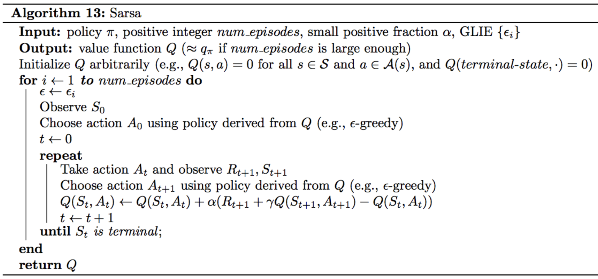

# C-2: Classical RL Methods

1. Dynamic Programming Approaches

    - Policy Evaluation and Improvement
    - Value Iteration
    - Limitations of Model-Based Methods

2. Monte Carlo Methods

    - Exploring Policy Space
    - First-Visit and Every-Visit MC
    - MC Prediction and Control
    - Exploration vs Exploitation

3. Temporal Difference Learning
    - TD(0) and Bootstrapping
    - SARSA: On-Policy TD Control
    - Q-Learning: Off-Policy TD Control
    - Expected SARSA

#### Dynamic Programming Approaches

### Policy Evaluation and Improvement

Dynamic Programming (DP) approaches in reinforcement learning leverage the Bellman equations to iteratively compute
optimal policies when the MDP model is fully known. Two fundamental procedures in DP are policy evaluation and policy
improvement, which form the backbone of policy iteration algorithms.

#### Policy Evaluation

Policy evaluation computes the state-value function $V_\pi$ for a given policy $\pi$. This process answers the question:
"How good is this policy?"

The iterative policy evaluation algorithm works as follows:

1. Initialize $V(s)$ arbitrarily for all states $s \in \mathcal{S}$, except for terminal states where $V(terminal) = 0$

2. Repeat until convergence:

    For each $s \in \mathcal{S}$: $$V(s) \leftarrow \sum_a \pi(a|s) \sum_{s',r} p(s',r|s,a)[r + \gamma V(s')]$$

This algorithm applies the Bellman expectation equation as an update rule, repeatedly sweeping through the state space
and updating value estimates. Each iteration brings the value function closer to the true value function $V_\pi$.

The convergence criterion is typically a small threshold on the maximum change in value estimates:
$$\max_s |V_{k+1}(s) - V_k(s)| < \theta$$

#### Policy Improvement

Policy improvement uses the evaluated value function to find a better policy. It answers the question: "How can we
improve this policy based on what we know about its value?"

For each state $s$, policy improvement selects actions that maximize the expected return:

$$\pi'(s) = \arg\max_a \sum_{s',r} p(s',r|s,a)[r + \gamma V_\pi(s')]$$

This creates a new policy $\pi'$ that is guaranteed to be as good as or better than $\pi$. We can express this
improvement guarantee mathematically:

$$V_{\pi'}(s) \geq V_\pi(s) \text{ for all } s \in \mathcal{S}$$

#### The Policy Improvement Theorem

The policy improvement theorem states that if we have two deterministic policies $\pi$ and $\pi'$ such that:

$$Q_\pi(s, \pi'(s)) \geq V_\pi(s) \text{ for all } s \in \mathcal{S}$$

Then the new policy $\pi'$ is guaranteed to be at least as good as $\pi$:

$$V_{\pi'}(s) \geq V_\pi(s) \text{ for all } s \in \mathcal{S}$$

This theorem provides the theoretical foundation for policy improvement methods.

#### Policy Iteration

Policy iteration combines evaluation and improvement in an iterative process:

1. **Initialization**: Start with an arbitrary policy $\pi_0$
2. **Policy Evaluation**: Compute $V_{\pi_i}(s)$ for all states
3. **Policy Improvement**: Generate a new policy $\pi_{i+1}$ by being greedy with respect to $V_{\pi_i}$
4. **Repeat** steps 2-3 until the policy stabilizes

The algorithm converges to the optimal policy $\pi^*$ and optimal value function $V^*$ in a finite number of iterations
for finite MDPs.

#### Practical Considerations

1. **Computational Efficiency**: Full policy evaluation can be computationally expensive. In practice, policy evaluation
   is often truncated after a few iterations (partial evaluation).
2. **In-Place Updates**: Many implementations use in-place updates where new value estimates immediately replace old
   ones, which can accelerate convergence.
3. **Asynchronous Updates**: Instead of sweeping through all states systematically, asynchronous DP methods update
   states in an arbitrary order, allowing for more flexibility.
4. **Prioritized Sweeping**: States can be prioritized based on the expected magnitude of their updates, focusing
   computational resources where they are most needed.

The policy evaluation and improvement process forms the core of dynamic programming approaches in reinforcement
learning. Understanding these procedures provides insight into how optimal policies can be systematically discovered
when the environment model is available.

### Value Iteration

Value iteration is an efficient dynamic programming algorithm that combines aspects of policy evaluation and policy
improvement into a single update operation. It directly computes the optimal value function without explicitly
maintaining a policy.

#### The Value Iteration Algorithm

Value iteration works by iteratively applying the Bellman optimality equation:

1. Initialize $V(s)$ arbitrarily for all states $s \in \mathcal{S}$, except terminal states where $V(terminal) = 0$

2. Repeat until convergence:

    For each $s \in \mathcal{S}$: $$V(s) \leftarrow \max_a \sum_{s',r} p(s',r|s,a)[r + \gamma V(s')]$$

3. Once $V$ approximates $V^*$, extract the optimal policy:
   $$\pi^*(s) = \arg\max_a \sum_{s',r} p(s',r|s,a)[r + \gamma V(s')]$$

#### Comparison with Policy Iteration

Value iteration can be viewed as a truncated version of policy iteration where the policy evaluation step consists of
just a single sweep. The key differences are:

1. **Combined Update**: Value iteration combines evaluation and improvement in a single step.
2. **Implicit Policy**: No explicit policy is maintained during value iteration; it's only extracted at the end.
3. **Convergence Rate**: Value iteration typically requires more iterations than policy iteration but each iteration is
   computationally simpler.
4. **Memory Efficiency**: Value iteration only needs to store the value function, not a policy.

#### Convergence Properties

Value iteration converges to the optimal value function $V^*$ under the following conditions:

1. The MDP has finite states and actions.
2. $\gamma < 1$ for continuing tasks or all policies lead to a terminal state for episodic tasks.

The convergence rate is influenced by the discount factor $\gamma$; larger values lead to slower convergence as the
algorithm must account for rewards further into the future.

The error bound after $k$ iterations is: $$||V_k - V^*||_\infty \leq \frac{\gamma^k}{1-\gamma}||V_0 - V^*||_\infty$$

#### Optimality Guarantees

Once value iteration converges to $V^*$ (or a close approximation), the derived greedy policy is guaranteed to be
optimal. This is because:

$$\pi^*(s) = \arg\max_a \sum_{s',r} p(s',r|s,a)[r + \gamma V^*(s')]$$

is equivalent to:

$$\pi^*(s) = \arg\max_a Q^*(s,a)$$

which is the definition of an optimal policy.

#### Practical Implementations

1. **Gauss-Seidel Value Iteration**: Updates values in-place, using the most recent values for each state immediately.
2. **Synchronous Value Iteration**: Updates all states based on the previous iteration's values, then swaps the arrays.
3. **Prioritized Sweeping**: Focuses updates on states with potentially large changes in value.
4. **Real-Time Dynamic Programming (RTDP)**: Updates only states that are relevant to the task at hand.
5. **Termination Conditions**: Common stopping criteria include:
    - Maximum value change below threshold: $\max_s |V_{k+1}(s) - V_k(s)| < \theta$
    - Value function converges to Bellman residual:
      $\max_s |V(s) - \max_a \sum_{s',r} p(s',r|s,a)[r + \gamma V(s')]| < \theta$
    - Fixed number of iterations

Value iteration is one of the cornerstone algorithms in dynamic programming for reinforcement learning. Its simplicity
and effectiveness make it a standard approach for solving MDPs when the model is known. Understanding value iteration
provides insight into how optimal policies can be computed efficiently using the Bellman optimality principle.

### Limitations of Model-Based Methods

While dynamic programming approaches like policy iteration and value iteration provide elegant solutions to
reinforcement learning problems, they come with significant limitations that restrict their practical applicability.
Understanding these limitations is crucial for choosing appropriate algorithms for real-world problems.

#### Requirement of Complete Environment Model

The most fundamental limitation of model-based methods is their requirement for a complete and accurate model of the
environment. Specifically, they need:

1. **Transition Probabilities**: $p(s'|s,a)$ for all state-action pairs.
2. **Reward Function**: $r(s,a,s')$ for all state-action-next-state triplets.

In most real-world applications, this information is not readily available and must be:

- Designed by domain experts (costly and error-prone)
- Learned from data (introducing additional complexity and potential errors)
- Approximated through simulators (which may not perfectly match reality)

#### Computational Complexity

Dynamic programming methods face significant computational challenges:

1. **Curse of Dimensionality**: The computational complexity grows exponentially with the number of state variables.
    - For a problem with $n$ binary state variables, there are $2^n$ possible states.
    - Each sweep through the state space becomes prohibitively expensive as $n$ increases.
2. **Memory Requirements**: Storing value functions for large state spaces requires substantial memory.
    - A tabular representation of $V(s)$ needs an entry for each state.
    - For continuous or high-dimensional state spaces, this becomes infeasible.
3. **Update Complexity**: Each update requires evaluating all possible next states and their probabilities.
    - For states with many possible transitions, this can be computationally intensive.
    - The branching factor of the MDP directly impacts computation time.

#### Limited Applicability to Large State Spaces

Even with approximation techniques, model-based methods struggle with large state spaces:

1. **Tabular Representation Limitations**: Exact dynamic programming requires a table entry for each state, which is
   impractical for large or continuous state spaces.
2. **Generalization Challenges**: Standard DP does not naturally generalize from observed states to similar but unseen
   states.
3. **Planning Horizon**: Complete planning becomes intractable as the planning horizon increases due to the exponential
   growth in possible future trajectories.

#### Adaptation to Changing Environments

Model-based methods face challenges in dynamic environments:

1. **Model Staleness**: When the environment dynamics change, the entire model must be updated.
2. **Recomputation Cost**: After model updates, value functions often need to be recomputed from scratch.
3. **Adaptation Lag**: The time required to update the model and recompute optimal policies can cause performance
   degradation during adaptation periods.

#### Handling Model Uncertainty

Pure dynamic programming approaches assume the model is correct and do not naturally handle uncertainty:

1. **No Exploration Mechanisms**: DP assumes the model is correct and does not actively explore to improve the model.
2. **Sensitivity to Model Errors**: Small errors in the transition or reward model can lead to significantly suboptimal
   policies.
3. **No Uncertainty Representation**: Standard DP does not maintain confidence levels or uncertainty estimates about
   model parameters.

#### Alternative Approaches

To address these limitations, researchers have developed alternative approaches:

1. **Model-Free Methods**: Methods like Q-learning and SARSA learn directly from experience without requiring a model.
2. **Approximate Dynamic Programming**: Uses function approximation to handle large state spaces.
3. **Sample-Based Planning**: Methods like Monte Carlo Tree Search use sampling to plan without explicitly representing
   the entire model.
4. **Hybrid Approaches**: Combine model-based and model-free techniques to leverage the strengths of both.
5. **Bayesian Reinforcement Learning**: Explicitly represents uncertainty in the model and balances exploration with
   exploitation.

Understanding the limitations of model-based methods helps practitioners choose appropriate algorithms for their
specific problems and motivates the development of more scalable and flexible approaches to reinforcement learning.

#### Monte Carlo Methods

##### Exploring Policy Space

Monte Carlo (MC) methods represent a fundamentally different approach to solving reinforcement learning problems
compared to dynamic programming. Instead of assuming complete knowledge of the environment, Monte Carlo methods learn
directly from experience through sampling complete episodes and averaging returns. This exploration-based approach
offers significant advantages in many practical scenarios.

##### Principles of Monte Carlo Exploration

Monte Carlo methods operate on a simple yet powerful principle: estimate the value of each state (or state-action pair)
by averaging the returns observed after visiting that state in many episodes. This approach:

1. **Requires no prior knowledge** of environment dynamics
2. **Learns directly from actual experience** or simulated episodes
3. **Focuses on sampled trajectories** rather than the full probability distribution

#### Exploring Starts

The "exploring starts" technique ensures that all state-action pairs have a non-zero probability of being selected as
the start of an episode. This approach:

1. Initializes episodes from different state-action pairs
2. Ensures all possible experiences are eventually sampled
3. Guarantees exploration of the entire policy space

While theoretically sound, exploring starts is often impractical in real environments where we cannot arbitrarily
initialize the system to any state-action pair.

#### Stochastic Policies for Exploration

A more practical approach to exploration involves using stochastic policies:

1. **ε-greedy Policies**: With probability ε, choose a random action; otherwise, choose the greedy action.

    $$\pi(a|s) = \begin{cases} 1-\varepsilon+\frac{\varepsilon}{|A(s)|} & \text{if } a = \arg\max_{a'} Q(s,a') \ \frac{\varepsilon}{|A(s)|} & \text{otherwise} \end{cases}$$

2. **Softmax Policies**: Select actions with probabilities proportional to their estimated values.

    $$\pi(a|s) = \frac{e^{Q(s,a)/\tau}}{\sum_{a'} e^{Q(s,a')/\tau}}$$

    where τ is a "temperature" parameter controlling the randomness.

#### On-Policy vs. Off-Policy Exploration

Monte Carlo methods can explore policy space using two distinct approaches:

1. **On-Policy Methods**: Learn the value of the policy being followed during data collection.
    - More stable and straightforward
    - Potentially slower to converge to optimal policy
    - Example: Monte Carlo with ε-greedy policy
2. **Off-Policy Methods**: Learn the value of a target policy different from the behavior policy used for data
   collection.
    - More efficient use of exploratory behavior
    - Can learn optimal policy while following exploratory policy
    - More complex due to importance sampling requirements
    - Example: Off-policy Monte Carlo with weighted importance sampling

#### Greedy in the Limit with Infinite Exploration (GLIE)

To ensure convergence to the optimal policy, GLIE conditions require:

1. All state-action pairs are visited infinitely often as the number of episodes approaches infinity
2. The policy converges to a greedy policy in the limit

This can be achieved by gradually reducing ε in an ε-greedy policy: $$\varepsilon_i = \frac{1}{i}$$ where i is the
episode number.

#### Strategic Exploration Techniques

Beyond basic random exploration, more sophisticated strategies include:

1. **Optimistic Initialization**: Initialize value estimates optimistically to encourage exploration of less-visited
   states and actions.
2. **Count-Based Exploration**: Provide intrinsic rewards for visiting less-frequently encountered states.
3. **Uncertainty-Based Exploration**: Direct exploration toward states where value estimates have high uncertainty.
4. **Curiosity-Driven Exploration**: Generate intrinsic rewards based on the agent's ability to predict state
   transitions.

Monte Carlo methods excel at exploring policy space without requiring prior knowledge of the environment. By sampling
complete trajectories and averaging returns, they provide a model-free approach to reinforcement learning that is
particularly effective for episodic tasks with manageable state spaces. The stochastic nature of these methods naturally
balances exploration and exploitation, making them robust in many practical applications.

### First-Visit and Every-Visit MC

Monte Carlo methods estimate value functions by averaging returns from actual or simulated episodes. Two primary
variants exist: first-visit MC and every-visit MC. These approaches differ in how they handle multiple occurrences of a
state or state-action pair within a single episode.

#### First-Visit Monte Carlo

In first-visit MC, only the first occurrence of a state (or state-action pair) in an episode is considered when
computing average returns.

**Algorithm for First-Visit MC Prediction (State-Value Estimation):**

1. Initialize:
    - $V(s)$ arbitrarily for all states
    - Returns(s) as an empty list for each state
2. For each episode:
    - Generate an episode: $S_0, A_0, R_1, S_1, ..., S_{T-1}, A_{T-1}, R_T, S_T$
    - $G \leftarrow 0$
    - For $t = T-1, T-2, ..., 0$:
        - $G \leftarrow \gamma G + R_{t+1}$
        - If $S_t$ appears for the first time at time step $t$:
            - Append $G$ to Returns($S_t$)
            - $V(S_t) \leftarrow$ average(Returns($S_t$))

This approach ensures that returns for each state are statistically independent, which simplifies the theoretical
analysis.

  
Figure: First-Visit GLIE Monte Carlo Control algorithm
 

#### Every-Visit Monte Carlo

In every-visit MC, every occurrence of a state (or state-action pair) in an episode is considered when computing average
returns.

**Algorithm for Every-Visit MC Prediction (State-Value Estimation):**

1. Initialize:
    - $V(s)$ arbitrarily for all states
    - Returns(s) as an empty list for each state
2. For each episode:
    - Generate an episode: $S_0, A_0, R_1, S_1, ..., S_{T-1}, A_{T-1}, R_T, S_T$
    - $G \leftarrow 0$
    - For $t = T-1, T-2, ..., 0$:
        - $G \leftarrow \gamma G + R_{t+1}$
        - Append $G$ to Returns($S_t$)
        - $V(S_t) \leftarrow$ average(Returns($S_t$))

Every-visit MC uses more samples per episode, potentially accelerating learning in the early stages.

#### Comparative Analysis

**Theoretical Properties:**

1. **Convergence**: Both methods converge to the true value function as the number of episodes approaches infinity, but
   with different properties:
    - First-visit MC produces unbiased estimates
    - Every-visit MC produces biased estimates that converge asymptotically
2. **Statistical Independence**: Samples in first-visit MC are more likely to be independent, which can be advantageous
   for theoretical analysis.

**Practical Considerations:**

1. **Sample Efficiency**: Every-visit MC uses more samples per episode, which can be beneficial with limited data.
2. **Computation**: Every-visit MC requires more updates per episode.
3. **Memory Requirements**: Both methods require storing returns for each state or state-action pair.
4. **Early Performance**: Every-visit MC often performs better in early learning due to using more samples.
5. **Long-Term Performance**: First-visit MC often performs better in the long run due to using more independent
   samples.

#### Action-Value Estimation

Both methods can be extended to estimate action values ($Q(s,a)$) rather than state values:

**For First-Visit MC:**

- Track the first occurrence of each state-action pair in an episode
- Update $Q(s,a)$ based on the return following that first occurrence

**For Every-Visit MC:**

- Update $Q(s,a)$ based on the return following every occurrence of the state-action pair

#### Incremental Implementation

For efficiency, both methods can be implemented incrementally to avoid storing all returns:

$$V(S_t) \leftarrow V(S_t) + \frac{1}{N(S_t)}[G_t - V(S_t)]$$

Where $N(S_t)$ is the count of visits (first visits for first-visit MC, all visits for every-visit MC) to state $S_t$.

First-visit and every-visit MC methods offer different trade-offs in terms of bias, variance, and sample efficiency. The
choice between them depends on the specific application, with first-visit MC being more commonly used due to its
unbiased estimates and stronger theoretical guarantees.

### MC Prediction and Control

Monte Carlo (MC) methods in reinforcement learning solve two fundamental problems: prediction (policy evaluation) and
control (finding the optimal policy). These methods learn directly from complete episodes of experience without
requiring a model of the environment's dynamics.

#### Monte Carlo Prediction

MC prediction estimates the value function of a given policy by averaging returns observed from real or simulated
episodes. The process works as follows:

1. **Episode Generation**: Generate episodes following the policy $\pi$ to be evaluated.
2. **Return Calculation**: For each state $s$ visited in an episode, calculate the return $G_t$ (the sum of discounted
   rewards) from that time step onward.
3. **Value Estimation**: Estimate the value function $V_\pi(s)$ as the average of returns observed after visiting state
   $s$.

In practice, this is often implemented incrementally:

$$V(s) \leftarrow V(s) + \alpha[G_t - V(s)]$$

where $\alpha$ is a step-size parameter (learning rate).

The same approach can be applied to estimate action-value functions $Q_\pi(s,a)$ by averaging returns following
state-action pairs.

#### Monte Carlo Control

MC control aims to find the optimal policy through iterative policy evaluation and improvement. The general approach
follows:

1. **Policy Evaluation**: Estimate the action-value function $Q_\pi$ for the current policy $\pi$ using MC prediction.

2. **Policy Improvement**: Improve the policy based on the estimated action-value function, typically by making it
   greedy with respect to $Q_\pi$:

    $$\pi'(s) = \arg\max_a Q_\pi(s,a)$$

3. **Iteration**: Alternate between evaluation and improvement until convergence.

#### On-Policy Monte Carlo Control

On-policy methods evaluate and improve the same policy that is used to generate episodes. To ensure adequate
exploration, we use ε-greedy policies:

1. Initialize arbitrarily $Q(s,a)$ for all $s \in \mathcal{S}, a \in \mathcal{A}(s)$, and $\pi$ to an initial policy
   (e.g., ε-greedy with respect to $Q$)
2. Repeat forever:
    - Generate an episode using $\pi$
    - For each state-action pair $(s,a)$ in the episode:
        - Calculate the return $G$ following the first occurrence of $(s,a)$
        - Update $Q(s,a)$ toward $G$: $Q(s,a) \leftarrow Q(s,a) + \alpha[G - Q(s,a)]$
    - Improve policy: $\pi \leftarrow$ ε-greedy with respect to $Q$

This approach guarantees convergence to the optimal policy under GLIE conditions (Greedy in the Limit with Infinite
Exploration).

#### Off-Policy Monte Carlo Control

Off-policy methods evaluate and improve a target policy different from the behavior policy used to generate episodes.
This approach:

1. Uses a behavior policy $b$ that ensures exploration (e.g., ε-greedy)
2. Learns about a target policy $\pi$ (typically the greedy policy)
3. Corrects for the distribution mismatch using importance sampling

The importance sampling ratio for a trajectory is:

$$\rho_{t:T-1} = \prod_{k=t}^{T-1} \frac{\pi(A_k|S_k)}{b(A_k|S_k)}$$

And the off-policy update is:

$$Q(S_t,A_t) \leftarrow Q(S_t,A_t) + \alpha[\rho_{t:T-1}G_t - Q(S_t,A_t)]$$

#### Incremental Monte Carlo Updates

In practice, we often use incremental updates to avoid storing all returns:

1. **Running Average**: $Q(s,a) \leftarrow Q(s,a) + \frac{1}{N(s,a)}[G - Q(s,a)]$
2. **Constant-α**: $Q(s,a) \leftarrow Q(s,a) + \alpha[G - Q(s,a)]$ where $\alpha \in (0,1]$ is fixed

The constant-α approach adapts more quickly to non-stationary environments and gives more weight to recent experiences.

#### Advantages of Monte Carlo Methods

1. **Learn from actual experience** without requiring a model
2. **Can learn optimal behavior** through direct experience
3. **Can learn from simulated experience** (important for planning)
4. **Computationally efficient** for episodic tasks
5. **Low bias** because they learn from complete returns
6. **Not affected by Markov property violations** as they only care about returns, not transitions

#### Limitations

1. **Require complete episodes** before learning, not suitable for continuing tasks
2. **High variance** in return estimates, especially with long episodes
3. **Slow learning** due to waiting for episode completion
4. **Sample inefficiency** compared to bootstrapping methods

Monte Carlo prediction and control offer model-free approaches to reinforcement learning that learn directly from
experience. By averaging returns from complete episodes, these methods provide powerful tools for solving episodic tasks
without requiring knowledge of environment dynamics.

### Exploration vs Exploitation

The exploration-exploitation dilemma is one of the fundamental challenges in reinforcement learning. It represents the
agent's need to balance two competing objectives: gathering new information about the environment (exploration) and
maximizing reward based on current knowledge (exploitation).

#### Understanding the Dilemma

At each decision point, the agent faces a choice:

1. **Exploitation**: Choose actions that are currently believed to yield the highest rewards based on past experience.
    - **Advantages**: Maximizes immediate expected reward
    - **Disadvantages**: May miss better long-term strategies due to incomplete information
2. **Exploration**: Choose actions that might not be optimal according to current estimates, but which provide valuable
   information.
    - **Advantages**: Discovers potentially better policies, avoids local optima
    - **Disadvantages**: Sacrifices immediate reward, may waste time exploring irrelevant areas

#### The Importance of Balance

A purely exploitative agent will likely get stuck in suboptimal policies, while a purely exploratory agent will fail to
capitalize on what it has learned. Finding the right balance is critical:

- **Too little exploration**: The agent may converge prematurely to a suboptimal policy
- **Too much exploration**: The agent may waste resources testing suboptimal actions unnecessarily
- **Optimal balance**: Depends on factors like problem complexity, time horizon, and prior knowledge

#### Exploration Strategies in Monte Carlo Methods

Monte Carlo methods typically employ the following exploration strategies:

1. **ε-greedy Policies**: With probability ε, select a random action; otherwise, select the greedy action.

    $$\pi(a|s) = \begin{cases} 1 - \varepsilon + \frac{\va$$\pi(a|s) = \begin{cases} 1 - \varepsilon +
    \frac{\varepsilon}{|A(s)|}, & \text{if } a = \arg\max\_{a'} Q(s,a') \ \frac{\varepsilon}{|A(s)|}, & \text{otherwise}
    \end{cases}$$

    1. **Decaying ε-greedy**: Reduce the value of ε over time to transition from exploration to exploitation.

        $$\varepsilon_t = \frac{\varepsilon_0}{t} \text{ or } \varepsilon_t = \varepsilon_0 \cdot \gamma^t$$

    2. **Softmax Policies**: Select actions with probabilities proportional to their estimated values.

        $$\pi(a|s) = \frac{e^{Q(s,a)/\tau}}{\sum_{a'} e^{Q(s,a')/\tau}}$$

        Where τ is a temperature parameter controlling randomness.

    3. **Optimistic Initialization**: Initialize action-value estimates optimistically to encourage early exploration.

    4. **Upper Confidence Bound (UCB)**: Select actions based on both their estimated value and their uncertainty.

        $$a_t = \arg\max_a \left[ Q(s_t,a) + c\sqrt{\frac{\ln t}{N(s_t,a)}} \right]$$

        Where $N(s_t,a)$ is the number of times action $a$ has been selected in state $s_t$, and $c$ controls the
        exploration weight.

    #### Greedy in the Limit with Infinite Exploration (GLIE)

    For Monte Carlo methods to converge to optimal policies, exploration strategies must satisfy the GLIE conditions:

    1. All state-action pairs must be visited infinitely often as the number of episodes approaches infinity.
    2. The policy must converge to a greedy policy with respect to the current action-value function in the limit.

    In practice, this is often achieved by decreasing ε in an ε-greedy policy according to a schedule:
    $$\varepsilon_i = \frac{1}{i}$$ where $i$ is the episode number.

    #### Theoretical vs. Practical Approaches

    While theory suggests decreasing ε to zero to guarantee convergence, practical implementations often:

    1. Start with a high ε (e.g., 1.0) to encourage exploration
    2. Gradually decrease ε to a small positive value (e.g., 0.1 or 0.01) rather than zero
    3. Maintain this minimal exploration to allow adaptation to changing environments

    This approach balances theoretical guarantees with practical needs for continued adaptation.

    #### Example: Exploration Impact in Blackjack

    Consider a Monte Carlo agent learning to play blackjack:

    - **Pure exploitation (ε = 0)**: The agent quickly converges to a policy based on its initial experiences, but may
      miss optimal strategies for rarely encountered states.
    - **Balanced approach (ε = 0.1)**: The agent occasionally tries non-greedy actions, potentially discovering that
      hitting on 16 against a dealer's 10 is better than the initially estimated best action of standing.
    - **Heavy exploration (ε = 0.5)**: The agent frequently tries different actions, leading to slower convergence but
      potentially better long-term performance.

    The exploration-exploitation dilemma represents a fundamental trade-off in reinforcement learning. Monte Carlo
    methods handle this trade-off through various exploration strategies, with ε-greedy policies being the most common
    due to their simplicity and effectiveness. The right balance depends on the specific problem, with the goal of
    satisfying GLIE conditions to ensure convergence to optimal policies.

    ## 3. Temporal Difference Learning

    ### TD(0) and Bootstrapping

    Temporal Difference (TD) learning represents a significant advancement in reinforcement learning, combining elements
    of Monte Carlo (MC) methods and dynamic programming (DP). The most basic TD method, TD(0), introduces the powerful
    concept of bootstrapping—learning value estimates based on other estimates rather than waiting for complete returns.

    #### The Core Idea of TD Learning

    TD methods learn directly from experience like Monte Carlo methods, but unlike MC, they update estimates based on
    partial episodes by bootstrapping from their own estimates of future states' values. This approach offers several
    advantages:

    1. **Learn online, during episodes** rather than waiting for their completion
    2. **Update estimates incrementally** after each time step
    3. **Leverage immediate rewards and next state value estimates** to improve current state values

    #### TD(0) Prediction Algorithm

    TD(0) is the simplest TD algorithm for policy evaluation. For estimating the state-value function $V_\pi$:

    1. Initialize $V(s)$ arbitrarily for all states, except $V(terminal) = 0$
    2. For each episode:
        - Initialize state $S$
        - For each step of the episode:
            - Take action $A$ according to policy $\pi(·|S)$
            - Observe reward $R$ and next state $S'$
            - Update $V(S)$: $V(S) \leftarrow V(S) + \alpha[R + \gamma V(S') - V(S)]$
            - $S \leftarrow S'$
        - Until $S$ is terminal

    The key update rule, $V(S) \leftarrow V(S) + \alpha[R + \gamma V(S') - V(S)]$, illustrates the core of TD learning:

    - $R + \gamma V(S')$ is the TD target
    - $R + \gamma V(S') - V(S)$ is the TD error
    - $\alpha$ is the learning rate

    #### Understanding Bootstrapping

    Bootstrapping refers to updating value estimates based on other estimates rather than complete returns. This concept
    is central to TD learning:

    1. **In Monte Carlo methods**: Updates are based on actual returns $G_t$ (no bootstrapping)
       $$V(S_t) \leftarrow V(S_t) + \alpha[G_t - V(S_t)]$$
    2. **In TD(0)**: Updates are based on the immediate reward plus the discounted estimated value of the next state
       (bootstrapping) $$V(S_t) \leftarrow V(S_t) + \alpha[R_{t+1} + \gamma V(S_{t+1}) - V(S_t)]$$

    Bootstrapping creates a form of learning where predictions are based on other predictions—a recursive process that
    propagates information backward through states.

    #### TD Error and Learning Signal

    The TD error $\delta_t = R_{t+1} + \gamma V(S_{t+1}) - V(S_t)$ serves as the fundamental learning signal in TD
    methods:

    1. **Positive TD error**: The current state's value is underestimated; increase it
    2. **Negative TD error**: The current state's value is overestimated; decrease it
    3. **Zero TD error**: The current estimate satisfies the Bellman equation; no change needed

    The TD error represents the difference between the current estimate and a more informed estimate that incorporates
    new information.

    #### Bias-Variance Trade-off

    TD methods occupy a middle ground in the bias-variance trade-off:

    1. **Monte Carlo methods**: Unbiased but high variance due to using complete returns
    2. **Dynamic Programming**: Biased due to bootstrapping but zero variance when model is known
    3. **TD methods**: Some bias due to bootstrapping but lower variance than MC

    This trade-off is often advantageous in practice, leading to faster convergence in many applications.

    #### Convergence Properties

    TD(0) converges to the true value function $V_\pi$ under the following conditions:

    1. The step sizes $\alpha$ follow a schedule where $\sum_{t=1}^{\infty} \alpha_t = \infty$ and
       $\sum_{t=1}^{\infty} \alpha_t^2 < \infty$
    2. All states are visited infinitely often

    In practice, a constant step size is often used for non-stationary environments, sacrificing guaranteed convergence
    for better tracking of changes.

    #### TD(0) for Action-Value Estimation

    TD(0) can be extended to estimate action-values by using the update rule:

    $$Q(S_t,A_t) \leftarrow Q(S_t,A_t) + \alpha[R_{t+1} + \gamma Q(S_{t+1},A_{t+1}) - Q(S_t,A_t)]$$

    This forms the basis for SARSA, which we'll discuss in the next section.

    TD(0) and bootstrapping represent foundational concepts in reinforcement learning. By learning from immediate
    rewards and estimated future values, TD methods offer a powerful middle ground between Monte Carlo and dynamic
    programming approaches. This combination of learning from experience while bootstrapping has proven effective across
    a wide range of reinforcement learning applications.

    ### SARSA: On-Policy TD Control

    SARSA (State-Action-Reward-State-Action) is an on-policy temporal difference control algorithm that estimates
    action-value functions and learns optimal policies through direct interaction with the environment. The name SARSA
    reflects the quintuple of events (St, At, Rt+1, St+1, At+1) used in the learning update.

    #### SARSA Algorithm

    The SARSA algorithm follows these steps:

    
  
Figure: SARSA algorithm pseudocode
 

    1. Initialize Q(s,a) arbitrarily for all states s and actions a
    2. For each episode:
        - Initialize state S
        - Choose action A from S using policy derived from Q (e.g., ε-greedy)
        - For each step of the episode:
            - Take action A, observe reward R and next state S'
            - Choose next action A' from S' using policy derived from Q
            - Update Q(S,A): Q(S,A) ← Q(S,A) + α[R + γQ(S',A') - Q(S,A)]
            - S ← S', A ← A'
        - Until S is terminal

    The core update rule is:

    $$Q(S_t,A_t) \leftarrow Q(S_t,A_t) + \alpha[R_{t+1} + \gamma Q(S_{t+1},A_{t+1}) - Q(S_t,A_t)]$$

    This update uses the actual next action A' selected by the current policy, making SARSA an on-policy algorithm.

    #### On-Policy Learning Characteristics

    SARSA is classified as an on-policy method because:

    1. **Policy Consistency**: It learns the value of the same policy that is used to select actions
    2. **Action Selection**: The next action A' used in the update is selected according to the current policy
    3. **Policy Improvement**: The policy typically improves gradually as Q-values improve

    This on-policy nature makes SARSA more conservative than off-policy methods like Q-learning, as it accounts for the
    exploratory behavior of the policy in its value estimates.

    #### Exploration Strategy in SARSA

    SARSA typically uses ε-greedy exploration:

    1. With probability 1-ε, select the action with highest Q-value (exploitation)
    2. With probability ε, select a random action (exploration)

    The policy gradually becomes more greedy as learning progresses by reducing ε over time, satisfying the Greedy in
    the Limit with Infinite Exploration (GLIE) conditions:

    1. All state-action pairs are visited infinitely often
    2. The policy converges to greedy in the limit

    A common schedule for ε is: $\varepsilon_i = \frac{1}{i}$ where i is the episode number.

    #### Expected SARSA Variant

    Expected SARSA is a variant that uses the expected value of the next state-action pair rather than a sample:

    $$Q(S_t,A_t) \leftarrow Q(S_t,A_t) + \alpha[R_{t+1} + \gamma \sum_{a} \pi(a|S_{t+1})Q(S_{t+1},a) - Q(S_t,A_t)]$$

    This reduces variance in the updates while maintaining the on-policy nature of the algorithm.

    #### Convergence Properties

    SARSA converges to the optimal policy and action-value function under the following conditions:

    1. The state-action space is finite
    2. All state-action pairs are visited infinitely often (exploration)
    3. The policy converges to greedy in the limit (GLIE conditions)
    4. The learning rate α satisfies the Robbins-Monro conditions

    Under these conditions, SARSA converges with probability 1 to the optimal action-value function.

    #### Cliff Walking Example

    A classic example demonstrating SARSA's behavior is the Cliff Walking problem:

    - Grid world with a cliff along one edge
    - Agent must navigate from start to goal without falling off the cliff
    - Falling off results in large negative reward and reset to start
    - Each step incurs small negative reward

    In this environment:

    - SARSA learns a safer path further from the cliff edge
    - Q-learning (off-policy) learns the optimal but riskier path along the cliff
    - This difference occurs because SARSA accounts for the exploration policy in its value estimates

    #### Advantages of SARSA

    1. **Safety**: More conservative in risky environments due to accounting for exploratory actions
    2. **Stability**: Less prone to oscillations during learning
    3. **Direct Experience**: Learns from the actual experience trajectory
    4. **Simplicity**: Straightforward implementation and intuitive update rule

    #### Limitations

    1. **Efficiency**: May be less sample-efficient than off-policy methods
    2. **Exploration Dependence**: Value estimates are tied to the specific exploration strategy
    3. **Optimality**: May converge to sub-optimal policies if exploration doesn't decrease appropriately

    SARSA provides an effective on-policy control algorithm that combines the advantages of TD learning with policy
    improvement. By updating based on actual action selections, it offers a conservative approach to reinforcement
    learning that works well in many practical applications, especially those with potentially costly exploratory
    actions.

    ### Q-Learning: Off-Policy TD Control

    Q-learning, also known as Sarsamax, is a groundbreaking off-policy temporal difference control algorithm that
    directly learns the optimal action-value function without requiring a model of the environment. Its ability to learn
    about the optimal policy while following an exploratory policy has made it one of the most widely used reinforcement
    learning algorithms.

    #### The Q-Learning Algorithm

    Q-learning follows these steps:

    1. Initialize Q(s,a) arbitrarily for all states s and actions a
    2. For each episode:
        - Initialize state S
        - For each step of the episode:
            - Choose action A from S using policy derived from Q (e.g., ε-greedy)
            - Take action A, observe reward R and next state S'
            - Update Q(S,A): Q(S,A) ← Q(S,A) + α[R + γ maxa Q(S',a) - Q(S,A)]
            - S ← S'
        - Until S is terminal

    The core update rule is:

    $$Q(S_t,A_t) \leftarrow Q(S_t,A_t) + \alpha[R_{t+1} + \gamma \max_{a} Q(S_{t+1},a) - Q(S_t,A_t)]$$

    This update uses the maximum Q-value for the next state, regardless of which action might actually be taken next.

    #### Off-Policy Learning Characteristics

    Q-learning is classified as an off-policy method because:

    1. **Policy Separation**: It learns about the optimal (greedy) policy while following a different, exploratory
       behavior policy
    2. **Action Selection**: The max operation in the update rule corresponds to the greedy policy, not the actual next
       action taken
    3. **Direct Optimization**: It directly approximates the optimal action-value function Q\*

    This off-policy nature allows Q-learning to learn optimal behavior while still exploring, creating a more aggressive
    learning approach compared to SARSA.

    #### The Bellman Optimality Equation Connection

    Q-learning directly implements a sample-based approximation of the Bellman optimality equation:

    $$Q^*(s,a) = \mathbb{E}[R_{t+1} + \gamma \max_{a'} Q^*(S_{t+1},a') | S_t = s, A_t = a]$$

    By using the maximum Q-value for the next state, Q-learning bootstraps from what it believes to be the optimal
    future action, regardless of the action actually taken by the exploratory policy.

    #### Exploration Strategies

    Like SARSA, Q-learning typically uses ε-greedy exploration:

    1. With probability 1-ε, select the action with highest Q-value
    2. With probability ε, select a random action

    However, because Q-learning is off-policy, its convergence is less dependent on how ε is annealed. It will converge
    to the optimal policy as long as all state-action pairs are visited infinitely often.

    #### Convergence Properties

    Q-learning converges to the optimal action-value function Q\* under the following conditions:

    1. Finite MDP (finite states and actions)
    2. Sufficient exploration (all state-action pairs visited infinitely often)
    3. Learning rate α satisfies the Robbins-Monro conditions:
        - $\sum_{t=1}^{\infty} \alpha_t = \infty$
        - $\sum_{t=1}^{\infty} \alpha_t^2 < \infty$

    In practice, a small constant learning rate is often used, which may not strictly guarantee convergence but works
    well for tracking non-stationary environments.

    #### Q-Learning vs. SARSA Comparison

    Key differences between Q-learning and SARSA:

    1. **Update Target**:
        - Q-learning: Uses max Q-value of next state (optimistic)
        - SARSA: Uses Q-value of actually selected next action (realistic)
    2. **Learning Focus**:
        - Q-learning: Learns optimal policy regardless of exploration
        - SARSA: Learns policy that accounts for exploration costs
    3. **Behavior in Risky Environments**:
        - Q-learning: May learn policies that are optimal but risky during exploration
        - SARSA: Tends to learn safer policies that account for exploratory moves
    4. **Convergence Speed**:
        - Q-learning: Often converges faster to optimal values in simple environments
        - SARSA: May require more careful tuning of exploration schedule

    #### Double Q-Learning Extension

    A notable extension is Double Q-learning, which addresses Q-learning's tendency to overestimate action values:

    1. Maintain two Q-functions: Q1 and Q2
    2. For each update, randomly update either Q1 or Q2
    3. When updating Q1, use Q2 to determine the best action:
       $$Q_1(S_t,A_t) \leftarrow Q_1(S_t,A_t) + \alpha[R_{t+1} + \gamma Q_2(S_{t+1},\arg\max_a Q_1(S_{t+1},a)) - Q_1(S_t,A_t)]$$

    This decoupling reduces the positive bias in Q-value estimates.

    #### Advantages of Q-Learning

    1. **Direct Optimization**: Learns optimal policy regardless of exploration strategy
    2. **Simplicity**: Conceptually straightforward and easy to implement
    3. **Flexibility**: Works with any exploratory policy that ensures sufficient state-action visits
    4. **Foundational**: Forms the basis for many advanced algorithms (DQN, Double Q-learning, etc.)

    #### Limitations

    1. **Maximization Bias**: Tends to overestimate action values due to the max operation
    2. **Sample Efficiency**: Can be sample-inefficient in large state spaces
    3. **Function Approximation Challenges**: May diverge when used with function approximation
    4. **Exploratory Risk**: May learn policies that are risky during exploration

    Q-learning's ability to learn optimal policies while exploring has made it one of the most influential algorithms in
    reinforcement learning. Its directness and theoretical guarantees, combined with its practical effectiveness, have
    established it as a cornerstone of modern reinforcement learning approaches.

    ### Expected SARSA

    Expected SARSA is a sophisticated temporal difference control algorithm that combines elements of both SARSA and
    Q-learning. By using the expected value of the next state-action pair rather than a sample, it offers reduced
    variance while maintaining flexibility in its policy approach.

    #### The Expected SARSA Algorithm

    Expected SARSA follows these steps:

    1. Initialize Q(s,a) arbitrarily for all states s and actions a
    2. For each episode:
        - Initialize state S
        - Choose action A from S using policy derived from Q (e.g., ε-greedy)
        - For each step of the episode:
            - Take action A, observe reward R and next state S'
            - Update Q(S,A): Q(S,A) ← Q(S,A) + α[R + γ Σa' π(a'|S')Q(S',a') - Q(S,A)]
            - Choose next action A' from S' using policy derived from Q
            - S ← S', A ← A'
        - Until S is terminal

    The core update rule is:

    $$Q(S_t,A_t) \leftarrow Q(S_t,A_t) + \alpha[R_{t+1} + \gamma \sum_{a'} \pi(a'|S_{t+1})Q(S_{t+1},a') - Q(S_t,A_t)]$$

    Where π(a'|S') represents the probability of selecting action a' in state S' according to the current policy.

    #### Key Characteristics

    Expected SARSA has several distinctive characteristics:

    1. **Expected Value Calculation**: Instead of using a single sample Q(S',A') or the maximum maxa'
       Q(S',a'), it uses the expected value under the current policy.
    2. **Policy Flexibility**: Can function as either on-policy or off-policy depending on the target policy used in the
       expectation calculation.
    3. **Variance Reduction**: By using expected values rather than samples, it reduces update variance compared to
       SARSA.
    4. **Computational Cost**: Requires calculating a weighted average over all possible next actions, which is more
       computationally intensive than SARSA or Q-learning.

    #### Policy Variations

    Expected SARSA can be implemented with different policies for the expectation calculation:

    1. **On-Policy Expected SARSA**: Uses the same policy for action selection and expectation calculation (e.g.,
       ε-greedy) $$\sum_{a'} \pi_{\text{ε-greedy}}(a'|S_{t+1})Q(S_{t+1},a')$$
    2. **Off-Policy Expected SARSA**: Uses a different policy for expectation calculation than for action selection
       $$\sum_{a'} \pi_{\text{target}}(a'|S_{t+1})Q(S_{t+1},a')$$
    3. **Expected SARSA as Q-Learning**: If the target policy is greedy, Expected SARSA becomes equivalent to Q-learning
       $$\sum_{a'} \pi_{\text{greedy}}(a'|S_{t+1})Q(S_{t+1},a') = \max_{a'} Q(S_{t+1},a')$$

    #### ε-Greedy Implementation

    For the common case of ε-greedy policies, the expected value calculation becomes:

    $$\sum_{a'} \pi(a'|S_{t+1})Q(S_{t+1},a') = (1-\varepsilon)\max_{a'} Q(S_{t+1},a') + \varepsilon \sum_{a'} \frac{1}{|A(S_{t+1})|} Q(S_{t+1},a')$$

    This formula shows how Expected SARSA smoothly interpolates between the greedy action's value and the average value
    of all actions.

    #### Theoretical Advantages

    Expected SARSA offers several theoretical advantages:

    1. **Unification**: It generalizes both SARSA and Q-learning as special cases.
    2. **Reduced Variance**: By using expected values rather than samples, it reduces the variance in updates without
       introducing additional bias.
    3. **Convergence Properties**: Like SARSA and Q-learning, Expected SARSA converges to the optimal policy under
       standard conditions, but often does so more reliably due to lower variance.
    4. **Continuous Action Spaces**: The expected value approach extends more naturally to continuous action spaces
       where computing an exact maximum is challenging.

    #### Practical Considerations

    When implementing Expected SARSA, consider:

    1. **Computational Overhead**: The expectation calculation increases computational cost, especially with large
       action spaces.
    2. **Policy Representation**: The policy must be explicitly represented to calculate expected values.
    3. **Learning Rate Selection**: Due to lower variance, Expected SARSA often benefits from slightly higher learning
       rates than SARSA.
    4. **Hyperparameter Sensitivity**: The algorithm is generally less sensitive to hyperparameter choices due to its
       more stable updates.

    #### Empirical Performance

    Research has shown that Expected SARSA often outperforms both SARSA and Q-learning, particularly in:

    1. **Stochastic Environments**: Where the reduced variance is especially beneficial
    2. **Safety-Critical Domains**: Where exploration risks need to be accounted for
    3. **Non-Stationary Settings**: Where stable updates lead to better tracking
    4. **Problems with Significant Randomness**: Where sample-based methods suffer from high variance

    Expected SARSA represents an elegant advancement in temporal difference learning, combining the best aspects of
    SARSA and Q-learning while mitigating their weaknesses. By using expected values to reduce variance without
    introducing bias, it offers a more stable and often more efficient approach to reinforcement learning control.
