# S-1: Foundations and Classical Methods in Reinforcement Learning

# C-2: Classical RL Methods

1. Dynamic Programming Approaches

   - Policy Evaluation and Improvement
   - Value Iteration
   - Limitations of Model-Based Methods

2. Monte Carlo Methods

   - Exploring Policy Space
   - First-Visit and Every-Visit MC
   - MC Prediction and Control
   - Exploration vs Exploitation

3. Temporal Difference Learning
   - TD(0) and Bootstrapping
   - SARSA: On-Policy TD Control
   - Q-Learning: Off-Policy TD Control
   - Expected SARSA

----

#### Dynamic Programming Approaches

##### Policy Evaluation and Improvement

Dynamic Programming (DP) provides a collection of algorithmic techniques for solving reinforcement learning problems by
leveraging the Bellman equations when a complete model of the environment is available. The core of dynamic programming
approaches consists of two fundamental procedures: policy evaluation and policy improvement, which together form the
foundation of policy iteration algorithms.

**Policy Evaluation**

Policy evaluation, also called prediction, computes the state-value function $V_\pi$ for a given policy $\pi$. This
process systematically determines how good it is to follow a particular policy by calculating the expected return from
each state.

The iterative policy evaluation algorithm proceeds as follows:

1. Initialize the value function: $V(s) \leftarrow 0$ for all states $s \in \mathcal{S}$, except for terminal states
   where $V(terminal) = 0$
2. Repeat until convergence:
    - For each state $s \in \mathcal{S}$: $$V(s) \leftarrow \sum_a \pi(a|s) \sum_{s',r} p(s',r|s,a)[r + \gamma V(s')]$$

This update rule directly applies the Bellman expectation equation. At each iteration, we sweep through the entire state
space, updating the value estimates for each state based on:

- The policy's action selection probabilities $\pi(a|s)$
- The environment's transition dynamics $p(s',r|s,a)$
- The current estimates of successor state values $V(s')$

The algorithm terminates when the value function converges, typically determined by:
$$\max_s |V_{k+1}(s) - V_k(s)| < \theta$$ where $\theta$ is a small threshold value.

**Example: Grid World Policy Evaluation**

Consider a 4×4 grid world where the agent can move in four directions. For a uniform random policy (25% probability for
each action in each state), the iteration proceeds as follows:

- Initial values: $V_0(s) = 0$ for all states
- First sweep: Each state's value is updated based on immediate rewards and discounted values of adjacent states
- Subsequent sweeps: Values propagate through the grid as information about rewards flows backward from terminal states
- After sufficient iterations: $V_\pi(s)$ accurately reflects the expected return from each state under the random
  policy

**Policy Improvement**

Policy improvement uses the evaluated value function to create a better policy. The fundamental question addressed is:
"How can we improve this policy based on what we know about its value?"

The policy improvement theorem provides the theoretical foundation. It states that if we have:
$$Q_\pi(s, \pi'(s)) \geq V_\pi(s) \text{ for all } s \in \mathcal{S}$$ then the new policy $\pi'$ is guaranteed to be at
least as good as, and typically better than, the original policy:
$$V_{\pi'}(s) \geq V_\pi(s) \text{ for all } s \in \mathcal{S}$$

This leads to a natural policy improvement step that creates a greedy policy with respect to the current value function:

$$\pi'(s) = \arg\max_a \sum_{s',r} p(s',r|s,a)[r + \gamma V_\pi(s')]$$

Or equivalently, using action-values: $$\pi'(s) = \arg\max_a Q_\pi(s,a)$$

This improvement step will either:

1. Create a strictly better policy, or
2. Verify that the current policy is already optimal (if no improvement is found)

**Policy Iteration**

Policy iteration combines evaluation and improvement in an iterative process:

1. **Initialization**: Start with an arbitrary policy $\pi_0$
2. **Policy Evaluation**: Compute $V_{\pi_i}$ for all states
3. **Policy Improvement**: Generate $\pi_{i+1}$ by acting greedily with respect to $V_{\pi_i}$
4. **Convergence Check**: If $\pi_{i+1} = \pi_i$, terminate with $\pi^* = \pi_i$; otherwise return to step 2

For finite MDPs, policy iteration converges to the optimal policy and value function in a finite number of iterations.
This is because:

- There are only a finite number of possible deterministic policies
- Each policy improvement step either improves the policy or confirms optimality
- The sequence of policies must eventually terminate at an optimal policy

**Practical Implementation Considerations**

Several techniques enhance the efficiency of policy iteration:

1. **Partial Policy Evaluation**: Rather than running evaluation to convergence, perform a fixed number of sweeps before
   policy improvement

2. **In-Place Updates**: Update value estimates in place, using the most recent values immediately:

    ```
    For each s ∈ S:
      v ← 0
      For each a ∈ A(s):
        For each s',r with p(s',r|s,a) > 0:
          v ← v + π(a|s)p(s',r|s,a)[r + γV(s')]
      V(s) ← v
    ```

3. **Asynchronous Updates**: Update states in an arbitrary order, allowing some states to be updated more frequently
   than others:

    ```
    Select a state s
    v ← 0
    For each a ∈ A(s):
      For each s',r with p(s',r|s,a) > 0:
        v ← v + π(a|s)p(s',r|s,a)[r + γV(s')]
    V(s) ← v
    ```

4. **Prioritized Sweeping**: Focus computational resources on states with potentially large Bellman errors:

    ```
    Maintain a priority queue of states
    Update highest-priority state s
    Update priorities of states that can reach s in one step
    ```

Policy evaluation and improvement form the theoretical and algorithmic core of dynamic programming approaches to
reinforcement learning. When the environment model is available, these procedures provide a systematic method for
discovering optimal policies through iterative refinement.

##### Value Iteration

Value iteration represents an elegant and efficient dynamic programming algorithm that combines aspects of policy
evaluation and policy improvement into a single update operation. Instead of maintaining and improving an explicit
policy through separate evaluation and improvement steps, value iteration directly computes the optimal value function,
from which the optimal policy can be derived.

**The Value Iteration Algorithm**

Value iteration applies the Bellman optimality operator in a sequence of sweeps through the state space:

1. Initialize $V(s)$ arbitrarily for all states $s \in \mathcal{S}$, except for terminal states where $V(terminal) = 0$
2. Repeat until convergence:
    - For each state $s \in \mathcal{S}$: $$V(s) \leftarrow \max_a \sum_{s',r} p(s',r|s,a)[r + \gamma V(s')]$$
3. Once $V$ closely approximates $V^*$, extract the optimal policy:
   $$\pi^*(s) = \arg\max_a \sum_{s',r} p(s',r|s,a)[r + \gamma V(s')]$$

The core update rule combines a simplified policy improvement step (the $\max_a$ operation) with a one-step policy
evaluation. This update directly implements the Bellman optimality equation, which characterizes the optimal value
function $V^*$.

**Theoretical Basis**

Value iteration can be understood as applying the Bellman optimality operator $T^*$ repeatedly:

$$T^* V(s) = \max_a \sum_{s',r} p(s',r|s,a)[r + \gamma V(s')]$$

The Bellman optimality operator has two critical properties:

1. It is a contraction mapping in the supremum norm with factor $\gamma$:
   $$|T^* V - T^* U|*\infty \leq \gamma |V - U|*\infty$$
2. The optimal value function $V^*$ is the unique fixed point of this operator: $$T^* V^* = V^*$$

These properties guarantee that repeated application of $T^*$ will converge to $V^*$ regardless of the initial value
function, with a convergence rate determined by $\gamma$.

**Comparison with Policy Iteration**

Value iteration differs from policy iteration in several key aspects:

1. **Computational Efficiency**:
    - Policy iteration requires multiple sweeps through the state space for each policy evaluation phase
    - Value iteration performs a single sweep per iteration, making each iteration less computationally intensive
2. **Update Structure**:
    - Policy iteration alternates between complete policy evaluation and policy improvement
    - Value iteration combines partial policy evaluation (one sweep) with policy improvement in each update
3. **Policy Representation**:
    - Policy iteration explicitly maintains a policy that improves with each iteration
    - Value iteration implicitly improves a policy with each update but only extracts it at the end
4. **Convergence Characteristics**:
    - Policy iteration typically requires fewer iterations but more computation per iteration
    - Value iteration requires more iterations but less computation per iteration

**Example: Solving a Simple MDP**

Consider a simple grid world with rewards of -1 for each move, +10 for reaching a goal state, and -10 for falling into a
pit. Starting with all zeros for non-terminal states:

- **Iteration 1**: States adjacent to the goal acquire positive values; states adjacent to pits acquire negative values
- **Iteration 2**: These values propagate one step further through the grid
- **Subsequent iterations**: Information about rewards continues to propagate through the state space
- **Convergence**: After sufficient iterations, $V(s)$ closely approximates $V^*(s)$ for all states

Once value iteration converges, the optimal policy can be extracted by selecting actions that maximize the expected next
state value:

$$\pi^*(s) = \arg\max_a \sum_{s',r} p(s',r|s,a)[r + \gamma V^*(s')]$$

**Optimality Guarantees and Convergence Analysis**

The error in the value function after $k$ iterations is bounded by:

$$|V_k - V^*|_\infty \leq \frac{\gamma^k}{1-\gamma}|V_0 - V^*|_\infty$$

This bound shows that convergence is faster with smaller $\gamma$ values, as distant rewards have less influence on
current state values.

A practical stopping criterion is:

$$\max_s |V_{k+1}(s) - V_k(s)| < \frac{\epsilon(1-\gamma)}{2\gamma}$$

This ensures that the resulting policy is within $\epsilon$ of the optimal policy.

**Implementation Variants**

Several variants of value iteration enhance performance for specific applications:

1. **Gauss-Seidel Value Iteration**: Updates values in-place, using the most recent values immediately:

    ```
    For each s ∈ S:
      V(s) ← max_a Σ p(s',r|s,a)[r + γV(s')]
    ```

2. **Asynchronous Value Iteration**: Updates states in an arbitrary order, potentially focusing on important states:

    ```
    Select a state s
    V(s) ← max_a Σ p(s',r|s,a)[r + γV(s')]
    ```

3. **Prioritized Sweeping**: Updates states with the largest potential Bellman errors first:

    ```
    Maintain a priority queue based on |V_new(s) - V_old(s)|
    Update highest-priority state
    ```

4. **Real-Time Dynamic Programming (RTDP)**: Focuses updates on states likely to be visited when following the current
   greedy policy:

    ```
    Generate sample trajectories using the current greedy policy
    Update states encountered in these trajectories
    ```

Value iteration stands as one of the foundational algorithms in reinforcement learning, providing an elegant and
efficient approach to solving MDPs when the model is known. By directly computing the optimal value function through
repeated application of the Bellman optimality operator, it circumvents the need for separate policy evaluation and
improvement steps, offering a streamlined solution method with strong theoretical guarantees.

##### Limitations of Model-Based Methods

While dynamic programming approaches like policy iteration and value iteration provide elegant and theoretically sound
solutions to reinforcement learning problems, they come with significant limitations that restrict their practical
applicability. Understanding these limitations is crucial for selecting appropriate algorithms for real-world problems
and appreciating the motivations behind model-free reinforcement learning methods.

**Complete Model Requirement**

The most fundamental limitation of model-based methods is their requirement for a complete and accurate model of the
environment. Specifically, they need:

1. **Transition Probabilities**: $p(s'|s,a)$ for all state-action pairs, representing the probability of transitioning
   to state $s'$ after taking action $a$ in state $s$.
2. **Reward Function**: $r(s,a,s')$ for all state-action-next-state triplets, representing the expected reward received
   when transitioning from $s$ to $s'$ via action $a$.

In practical applications, obtaining this complete model presents several challenges:

- **Acquisition Difficulty**: For many real-world problems, accurately specifying transition probabilities is extremely
  difficult or impossible.
- **Domain Expertise Requirement**: Creating accurate models typically requires significant domain expertise and careful
  system identification.
- **Model Error Sensitivity**: Even small errors in the model can lead to significantly suboptimal policies when using
  dynamic programming.

**Example: Robot Navigation** Consider a robot navigating through an office building. A complete model would require:

- Probabilities of successful movement for each action in each location
- Probabilities of different sensor readings in each state
- Expected battery consumption for each movement
- Interaction effects with dynamic elements (e.g., people, doors)

Accurately specifying all these probabilities is prohibitively difficult, making pure model-based approaches
impractical.

**Computational Complexity Challenges**

Dynamic programming methods face severe computational challenges as problem size increases:

1. **Curse of Dimensionality**: The computational complexity grows exponentially with the number of state variables.
    - **State Space Explosion**: For a problem with $n$ binary state variables, there are $2^n$ possible states.
    - **Tabular Representation Limitations**: Each sweep through the state space requires updates for all states, which
      becomes infeasible as the state space grows.
2. **Memory Requirements**: Storing value functions for large state spaces demands substantial memory.
    - A 2D grid world of size 100×100 has 10,000 states, manageable for basic tabular methods
    - Adding just a few dimensions (e.g., orientation, velocity, object positions) can expand this to millions of states
    - Real-world problems often have continuous state spaces with infinite states
3. **Update Complexity**: Each dynamic programming update requires evaluating all possible next states and their
   probabilities.
    - For states with many possible transitions, this becomes computationally intensive
    - The branching factor of the MDP directly impacts computation time

**Example: Autonomous Driving** For autonomous driving, relevant state variables include:

- Position, orientation, and velocity of the vehicle (continuous)
- Positions and velocities of other vehicles (numerous, continuous)
- Road conditions, traffic signals, and lane markings
- Weather conditions affecting visibility and traction

The resulting state space is astronomical, making exact dynamic programming methods computationally intractable.

**Adaptation to Changing Environments**

Model-based methods struggle with dynamic environments:

1. **Model Staleness**: When environment dynamics change, the entire model must be updated, which can be:
    - Computationally expensive
    - Difficult to detect without external validation
    - Potentially requiring extensive retraining or recalibration
2. **Recomputation Cost**: After model updates, value functions typically need to be recomputed from scratch or
   significantly revised.
3. **Adaptation Lag**: The time required to update the model and recompute optimal policies can cause performance
   degradation during adaptation periods.

**Handling Model Uncertainty**

Traditional dynamic programming approaches assume the model is correct and do not naturally handle uncertainty:

1. **No Exploration Mechanisms**: DP assumes the model is correct and does not actively explore to improve it.
2. **Sensitivity to Model Errors**: Small errors in transition or reward models can lead to significantly suboptimal
   policies.
3. **Deterministic Focus**: Classic DP methods are designed for deterministic or stochastic environments with known
   probability distributions, not for environments with unknown or uncertain dynamics.

**Alternative Approaches**

To address these limitations, several alternative approaches have been developed:

1. **Model-Free Methods**: Methods like Q-learning and SARSA learn directly from experience without requiring a model:
    - Eliminate the need for prior knowledge of transition probabilities and rewards
    - Learn through direct interaction with the environment
    - Scale more gracefully to certain large problems
    - Examples include Monte Carlo methods and temporal difference learning
2. **Approximate Dynamic Programming**: Uses function approximation to handle large state spaces:
    - Represents value functions using parametric forms (linear functions, neural networks)
    - Generalizes across similar states
    - Significantly reduces memory requirements
    - Examples include fitted value iteration and approximate policy iteration
3. **Sample-Based Planning**: Methods like Monte Carlo Tree Search use sampling to plan without explicitly representing
   the entire model:
    - Focus computational resources on relevant parts of the state space
    - Scale to larger problems by avoiding exhaustive computation
    - Combine the strengths of model-based planning with sampling efficiency
    - Examples include AlphaGo and POMCP (Partially Observable Monte Carlo Planning)
4. **Model Learning**: Reinforcement learning approaches that learn a model from experience:
    - Build approximate models through interaction
    - Update models continuously as more data becomes available
    - Use model-based planning with the learned model
    - Examples include Dyna-Q and model-based reinforcement learning
5. **Bayesian Reinforcement Learning**: Explicitly represents uncertainty in the model and balances exploration with
   exploitation:
    - Maintains a probability distribution over possible models
    - Naturally encourages exploration of uncertain regions
    - Makes decisions that account for model uncertainty
    - Examples include Bayes-Adaptive MDPs and Thompson Sampling

Understanding the limitations of pure model-based methods highlights why reinforcement learning has evolved beyond
simple dynamic programming approaches. By developing algorithms that can learn from experience, handle uncertainty, and
scale to large problems, the field has created solutions that can address real-world challenges beyond the reach of
traditional dynamic programming.

#### Monte Carlo Methods

##### Exploring Policy Space

Monte Carlo (MC) methods represent a fundamentally different approach to solving reinforcement learning problems
compared to dynamic programming. Rather than assuming complete knowledge of the environment model, Monte Carlo methods
learn directly from experience through sampling complete episodes and averaging returns. This sampling-based approach
offers a powerful alternative for problems where a complete model is unavailable or impractical to specify.

**The Fundamental Principle of Monte Carlo Methods**

At their core, Monte Carlo methods estimate the value of each state (or state-action pair) by averaging the actual
returns observed after visiting that state in many complete episodes. This approach:

1. **Requires no prior model**: No knowledge of transition probabilities or reward functions is needed
2. **Learns from complete episodes**: Only applicable to episodic tasks with well-defined termination
3. **Uses averaging of actual returns**: Estimates converge to true expectations as sample size increases

The fundamental Monte Carlo update for state values is:

$$V(s) \leftarrow V(s) + \alpha[G - V(s)]$$

Where:

- $G$ is the actual return observed from state $s$ to the end of the episode
- $\alpha$ is a step-size parameter (learning rate)

**Exploring Starts: A Theoretical Approach**

One theoretical approach to ensuring adequate exploration is the "exploring starts" technique:

1. Initialize episodes from randomly selected state-action pairs
2. Ensure every state-action pair has a non-zero probability of being selected as a starting point
3. Follow the current policy thereafter

This approach guarantees that all state-action pairs are eventually visited, ensuring the exploration necessary for
convergence to optimal policies.

**Example**: In a card game like blackjack, exploring starts would mean beginning episodes with different player hands
and dealer up-cards, rather than always starting with cards dealt from a shuffled deck.

While theoretically sound, exploring starts is often impractical in real environments for several reasons:

- Cannot arbitrarily initialize the environment to any state-action pair
- Real systems may have physical constraints on initialization
- Some states may only be reachable through specific sequences of actions

**Stochastic Policies for Practical Exploration**

A more practical approach to exploration involves using stochastic policies that naturally visit different state-action
pairs:

1. **ε-greedy Policies**: Mix exploitation with random exploration:

    $$\pi(a|s) = \begin{cases} 1 - \varepsilon + \frac{\varepsilon}{|\mathcal{A}(s)|}, & \text{if } a = \arg\max_{a'} Q(s,a') \ \frac{\varepsilon}{|\mathcal{A}(s)|}, & \text{otherwise} \end{cases}$$

    With probability $1-\varepsilon$, select the action with highest estimated value, and with probability
    $\varepsilon$, select a random action.

2. **Softmax Policies**: Select actions with probabilities proportional to their estimated values:

    $$\pi(a|s) = \frac{e^{Q(s,a)/\tau}}{\sum_{a'} e^{Q(s,a')/\tau}}$$

    The temperature parameter $\tau$ controls exploration:

    - Higher $\tau$: More uniform action selection (more exploration)
    - Lower $\tau$: More deterministic selection of high-value actions (more exploitation)

**On-Policy vs. Off-Policy Exploration**

Monte Carlo methods can explore policy space using two distinct approaches:

1. **On-Policy Methods**: Learn the value of the policy being used for action selection
    - The same policy is used for both behavior (action selection) and learning
    - Policy gradually improves through small, incremental changes
    - More stable but potentially slower to converge
    - Example: Monte Carlo with ε-greedy policy improvement
2. **Off-Policy Methods**: Learn the value of a target policy different from the behavior policy
    - Behavior policy (more exploratory) generates actions
    - Target policy (often more deterministic) is being evaluated and improved
    - More efficient use of exploratory actions but more complex to implement
    - Requires importance sampling to correct for the distribution mismatch
    - Example: Off-policy Monte Carlo with weighted importance sampling

**Greedy in the Limit with Infinite Exploration (GLIE)**

For Monte Carlo methods to converge to optimal policies, exploration strategies need to satisfy GLIE conditions:

1. All state-action pairs are visited infinitely often in the limit
2. The policy converges to a greedy policy in the limit

A common approach is to use an ε-greedy policy where ε decreases with time:

$$\varepsilon_i = \frac{1}{i}$$

Where $i$ is the episode number. This ensures:

- Extensive exploration in early episodes when knowledge is limited
- Gradual transition to exploitation as knowledge improves
- Convergence to the optimal deterministic policy in the limit

<div align="center">  <p style="color: #555;">Figure: First-Visit GLIE Monte Carlo Control algorithm</p> </div>

**Strategic Exploration Techniques**

Beyond basic random exploration, more sophisticated strategies can enhance exploration efficiency:

1. **Optimistic Initialization**: Initialize value estimates optimistically (higher than likely true values)

    - Encourages exploration of less-visited states and actions
    - Actions must be tried several times before their estimates fall to realistic levels
    - Automatically balances exploration and exploitation
    - Example: Initialize all Q-values to +10 in an environment with typical rewards of -1 to +1

2. **Count-Based Exploration**: Provide intrinsic rewards for visiting less-frequent states

    $$R_{\text{intrinsic}}(s,a) = \frac{\beta}{\sqrt{N(s,a)}}$$

    Where $N(s,a)$ is the count of visits to state-action pair $(s,a)$ and $\beta$ is a scaling parameter.

3. **Uncertainty-Based Exploration**: Direct exploration toward uncertain value estimates

    - Maintain confidence intervals or variance estimates for each state-action value
    - Prefer actions with higher uncertainty
    - Upper Confidence Bound (UCB) selection: $a = \arg\max_a \left(Q(s,a) + c\sqrt{\frac{\ln t}{N(s,a)}}\right)$

4. **Curiosity-Driven Exploration**: Generate intrinsic rewards based on prediction errors

    - Learn a model to predict state transitions
    - Reward visits to states where the model makes large prediction errors
    - Encourage exploration of poorly understood regions of the environment

**Example: Policy Space Exploration in Grid World**

Consider a simple grid world navigation task:

1. **Early exploration (high ε)**:
    - Agent tries many different paths, including suboptimal ones
    - Builds rough estimates of state values throughout the grid
    - Discovers multiple potential routes to the goal
2. **Middle episodes (moderate ε)**:
    - More frequently selects actions along promising paths
    - Refines value estimates for commonly visited states
    - Begins to prefer shorter paths to the goal
3. **Late episodes (low ε)**:
    - Exploits accumulated knowledge, following optimal path most of the time
    - Occasionally explores to verify no better paths exist
    - Value estimates converge to their true values

Monte Carlo methods excel at exploring policy space without requiring prior knowledge of the environment. By sampling
complete trajectories and averaging returns, they provide a model-free approach to reinforcement learning that is
particularly effective for episodic tasks with manageable state spaces. The stochastic nature of these methods naturally
balances exploration and exploitation, making them robust in many practical applications where a model is unavailable or
difficult to specify.

##### First-Visit and Every-Visit MC

Monte Carlo methods estimate value functions by averaging returns from actual or simulated episodes. Two principal
variants exist for implementing this approach: first-visit MC and every-visit MC. These methods differ in how they
handle multiple occurrences of a state or state-action pair within a single episode, leading to different statistical
properties and practical considerations.

**First-Visit Monte Carlo**

In first-visit MC, only the first occurrence of a state (or state-action pair) in an episode is considered when
computing average returns. This approach follows these steps:

**Algorithm for First-Visit MC Prediction (State-Value Estimation):**

1. Initialize:
    - $V(s)$ arbitrarily for all states
    - Returns(s) as an empty list for each state
2. For each episode:
    - Generate an episode: $S_0, A_0, R_1, S_1, ..., S_{T-1}, A_{T-1}, R_T, S_T$
    - $G \leftarrow 0$
    - For $t = T-1, T-2, ..., 0$:
        - $G \leftarrow \gamma G + R_{t+1}$ (accumulate return by working backward)
        - If $S_t$ appears for the first time at time step $t$:
            - Append $G$ to Returns($S_t$)
            - $V(S_t) \leftarrow$ average(Returns($S_t$))

This approach ensures that returns for each state are statistically independent, which simplifies theoretical analysis
and provides unbiased estimates of the true value function.

**Example**: In a maze navigation task, if the agent visits a particular junction three times during an episode,
first-visit MC would only consider the return following the first visit when updating that junction's value.

**Every-Visit Monte Carlo**

In every-visit MC, every occurrence of a state (or state-action pair) in an episode is considered when computing average
returns:

**Algorithm for Every-Visit MC Prediction (State-Value Estimation):**

1. Initialize:
    - $V(s)$ arbitrarily for all states
    - Returns(s) as an empty list for each state
2. For each episode:
    - Generate an episode: $S_0, A_0, R_1, S_1, ..., S_{T-1}, A_{T-1}, R_T, S_T$
    - $G \leftarrow 0$
    - For $t = T-1, T-2, ..., 0$:
        - $G \leftarrow \gamma G + R_{t+1}$ (accumulate return by working backward)
        - Append $G$ to Returns($S_t$)
        - $V(S_t) \leftarrow$ average(Returns($S_t$))

Every-visit MC uses more samples per episode, potentially accelerating learning in the early stages, but introduces
statistical dependencies between samples.

**Example**: In the same maze navigation task, every-visit MC would update the junction's value three times in a single
episode, once for each visit, using the return following each respective visit.

**Comparative Analysis**

**Theoretical Properties:**

1. **Convergence**: Both methods converge to the true value function as the number of episodes approaches infinity, but
   with different properties:

    - First-visit MC produces unbiased estimates from the beginning
    - Every-visit MC initially produces biased estimates that become asymptotically unbiased with sufficient samples

    For first-visit MC, each return sample is an independent estimate of the expected return, leading directly to
    unbiased estimation. For every-visit MC, returns following different visits to the same state within an episode are
    correlated, initially creating bias.

2. **Statistical Independence**: Samples in first-visit MC are more likely to be independent, which simplifies
   theoretical analysis and can lead to more stable learning.

3. **Sample Efficiency**: Every-visit MC generally collects more samples per episode, which can be advantageous when
   experiences are costly or limited.

**Practical Considerations:**

1. **Early Learning Speed**: Every-visit MC often shows faster initial learning due to using more samples per episode,
   particularly in environments where certain states are visited frequently.
2. **Computation**: Every-visit MC requires more updates per episode, increasing computational overhead.
3. **Memory Requirements**: Both methods traditionally require storing returns for each state or state-action pair,
   though incremental implementations can mitigate this.
4. **Long-Term Performance**: First-visit MC often performs better in the long run due to using more statistically
   independent samples.
5. **State Revisitation**: The relative performance depends significantly on how often states are revisited within
   episodes:
    - In environments with few state revisits, the methods perform similarly
    - In environments with many revisits, the differences become more pronounced

**Extending to Action-Value Estimation**

Both methods can be extended to estimate action values ($Q(s,a)$) rather than state values:

**For First-Visit MC:**

- Track the first occurrence of each state-action pair in an episode
- Update $Q(s,a)$ based on the return following that first occurrence

**For Every-Visit MC:**

- Update $Q(s,a)$ based on the return following every occurrence of the state-action pair

This extension enables direct policy improvement by selecting actions that maximize the estimated Q-values.

**Incremental Implementation**

For efficiency, both methods can be implemented incrementally to avoid storing all returns:

$$V(S_t) \leftarrow V(S_t) + \frac{1}{N(S_t)}[G_t - V(S_t)]$$

Where $N(S_t)$ is the count of visits (first visits for first-visit MC, all visits for every-visit MC) to state $S_t$.

This can be further simplified with a constant step-size parameter:

$$V(S_t) \leftarrow V(S_t) + \alpha[G_t - V(S_t)]$$

Where $\alpha \in (0,1]$ controls the weight given to recent returns versus older estimates.

**Example: Blackjack Value Estimation**

In the game of blackjack, consider estimating the value of standing with a player sum of 15 against a dealer showing a
10:

- **First-visit MC**: Only the first occurrence in each episode would contribute to the value estimate
- **Every-visit MC**: If the player encounters this situation multiple times in an episode (e.g., after splitting
  pairs), each occurrence would contribute

First-visit and every-visit MC methods offer different approaches to estimating value functions from experience. The
choice between them depends on the specific application, with first-visit MC providing unbiased estimates with stronger
theoretical guarantees, and every-visit MC potentially offering faster initial learning through more efficient use of
experience data.

##### MC Prediction and Control

Monte Carlo (MC) methods address two fundamental problems in reinforcement learning: prediction (estimating the value
function for a given policy) and control (finding the optimal policy). These methods learn directly from complete
episodes of experience without requiring a model of the environment, making them particularly valuable for complex
environments where accurate models are difficult to obtain.

**Monte Carlo Prediction (Policy Evaluation)**

Monte Carlo prediction estimates the value function of a given policy by averaging returns observed from real or
simulated episodes. The fundamental process consists of:

1. **Episode Generation**: Generate episodes by following the policy $\pi$ being evaluated.
2. **Return Calculation**: For each state $s$ visited in an episode, calculate the return $G_t$ (the sum of discounted
   rewards) from that time step onward.
3. **Value Estimation**: Estimate the value function $V_\pi(s)$ by averaging the returns observed after visiting state
   $s$.

**Implementation Approaches**:

1. **Batch Averaging**: $$V(s) = \frac{\sum_{i=1}^{N(s)} G_i(s)}{N(s)}$$

    Where $N(s)$ is the number of visits to state $s$, and $G_i(s)$ is the return following the $i$-th visit.

2. **Incremental Updating**: $$V(s) \leftarrow V(s) + \alpha[G_t - V(s)]$$

    Where $\alpha$ is a step-size parameter (learning rate) that controls how quickly new information replaces old
    estimates.

The same approach extends to action-value estimation by calculating $Q_\pi(s,a)$ as the average of returns following
state-action pairs rather than states alone.

**Example: Blackjack Policy Evaluation**

Consider evaluating a policy for the game of blackjack:

1. Play thousands of blackjack hands following a fixed policy (e.g., "hit on 16 or less, stand on 17 or more")
2. Record the player's sum, dealer's showing card, and whether the player has a usable ace in each state
3. Track the return (win: +1, lose: -1, draw: 0) from each state
4. Average these returns to estimate state values under the policy

The resulting value function would indicate the player's expected return from each state when following the given
policy.

**Monte Carlo Control**

Monte Carlo control aims to find the optimal policy through iterative policy evaluation and improvement. The general
approach follows:

1. **Policy Evaluation**: Estimate the action-value function $Q_\pi$ for the current policy $\pi$ using MC prediction.
2. **Policy Improvement**: Improve the policy based on the estimated action-value function, typically by making it
   greedy with respect to $Q_\pi$: $$\pi'(s) = \arg\max_a Q_\pi(s,a)$$
3. **Iteration**: Alternate between evaluation and improvement until convergence.

Monte Carlo control comes in two main variants: on-policy and off-policy methods.

**On-Policy Monte Carlo Control**

On-policy methods evaluate and improve the same policy that is used to generate episodes. To ensure adequate
exploration, these methods typically use ε-greedy policies:

<div align="center">  <p style="color: #555;">Figure: First-Visit GLIE Monte Carlo Control algorithm</p> </div>

The algorithm proceeds as follows:

1. Initialize $Q(s,a)$ arbitrarily for all state-action pairs, and set $\pi$ to an initial policy (e.g., ε-greedy with
   respect to $Q$).
2. Repeat for each episode:
    - Generate an episode using $\pi$
    - For each state-action pair $(s,a)$ in the episode:
        - Calculate the return $G$ following the first occurrence of $(s,a)$
        - Update $Q(s,a)$ toward $G$: $Q(s,a) \leftarrow Q(s,a) + \alpha[G - Q(s,a)]$
    - Improve policy: $\pi \leftarrow$ ε-greedy with respect to $Q$

For convergence to the optimal policy, ε-greedy policies typically follow a GLIE (Greedy in the Limit with Infinite
Exploration) schedule, where ε decreases over time: $$\varepsilon_i = \frac{1}{i}$$

Where $i$ is the episode number.

**Off-Policy Monte Carlo Control**

Off-policy methods evaluate and improve a target policy different from the behavior policy used to generate episodes:

1. Use a behavior policy $b$ (e.g., ε-greedy with fixed ε) that ensures exploration
2. Learn about a target policy $\pi$ (typically the greedy policy with respect to current $Q$ values)
3. Correct for the distribution mismatch using importance sampling

The importance sampling ratio for a trajectory is: $$\rho_{t:T-1} = \prod_{k=t}^{T-1} \frac{\pi(A_k|S_k)}{b(A_k|S_k)}$$

This ratio adjusts the update to account for the difference in action probabilities under the two policies. The
off-policy update becomes: $$Q(S_t,A_t) \leftarrow Q(S_t,A_t) + \alpha[\rho_{t:T-1}G_t - Q(S_t,A_t)]$$

**Weighted Importance Sampling**

A common variant uses weighted importance sampling to reduce variance:
$$Q(S_t,A_t) \leftarrow \frac{\sum_{i=1}^{N(S_t,A_t)} \rho_i G_i}{\sum_{i=1}^{N(S_t,A_t)} \rho_i}$$

Where $\rho_i$ is the importance sampling ratio for the $i$-th visit to $(S_t,A_t)$.

**Incremental Implementation**

In practice, both on-policy and off-policy methods often use incremental updates:

**Running Average**: $$Q(s,a) \leftarrow Q(s,a) + \frac{1}{N(s,a)}[G - Q(s,a)]$$

**Constant-α**: $$Q(s,a) \leftarrow Q(s,a) + \alpha[G - Q(s,a)]$$

Where $\alpha \in (0,1]$ is fixed.

The constant-α approach adapts more quickly to non-stationary environments and gives more weight to recent experiences.

**Example: Learning to Play Blackjack**

Consider learning an optimal blackjack strategy:

1. Initialize action values arbitrarily for all states (e.g., player sums, dealer showing cards, usable aces)
2. For each episode:
    - Play a hand of blackjack using the current ε-greedy policy
    - For each state-action pair encountered:
        - Update its Q-value based on the final outcome of the hand
    - Update the policy to be ε-greedy with respect to the new Q-values
3. After sufficient episodes, the policy converges to near-optimal play

**Advantages of Monte Carlo Methods**

1. **Model-Free Learning**: Learn from actual experience without requiring a model of the environment
2. **Low Bias**: Learn from complete returns without bootstrapping from estimated values
3. **Focus on Visited States**: Computational effort concentrates on states actually encountered
4. **Handling Non-Markovian Environments**: Effectiveness doesn't depend on the Markov property
5. **Simple Implementation**: Conceptually straightforward and easy to implement

**Limitations**

1. **Episodic Tasks Only**: Require complete episodes, not suitable for continuing tasks
2. **High Variance**: Return estimates have high variance, especially with long episodes
3. **Delayed Learning**: Must wait for episode completion before updating values
4. **Sample Inefficiency**: Don't use information from state transitions within episodes

Monte Carlo prediction and control offer powerful model-free approaches to reinforcement learning that learn directly
from experience. By averaging returns from complete episodes, these methods provide effective tools for solving episodic
tasks without requiring knowledge of environment dynamics, making them particularly valuable for complex real-world
problems where accurate models are unavailable.

##### Exploration vs Exploitation

The exploration-exploitation dilemma represents one of the fundamental challenges in reinforcement learning. It captures
the tension between gathering new information about the environment (exploration) and maximizing reward based on current
knowledge (exploitation). Balancing these competing objectives is critical for effective learning and optimal
performance.

**Conceptualizing the Dilemma**

At each decision point, the agent faces a choice:

1. **Exploitation**: Select actions that are currently believed to yield the highest rewards based on existing
   knowledge.
    - **Advantages**: Maximizes immediate expected reward; utilizes learned information
    - **Disadvantages**: May miss better strategies due to incomplete information; can get stuck in local optima
2. **Exploration**: Select actions that might not be optimal according to current estimates but provide valuable
   information.
    - **Advantages**: Discovers potentially better policies; avoids premature convergence to suboptimal solutions
    - **Disadvantages**: Sacrifices immediate reward; may waste resources on irrelevant actions

**The Importance of Balance**

Finding the appropriate balance between exploration and exploitation is critical:

- **Too little exploration**: The agent may converge prematurely to a suboptimal policy, never discovering better
  alternatives.

    **Example**: In a maze with multiple paths to the goal, an agent that exploits too early might always follow the
    first decent path it finds, never discovering a significantly shorter route.

- **Too much exploration**: The agent may waste resources testing suboptimal actions repeatedly, failing to capitalize
  on what it has already learned.

    **Example**: An agent that continues random exploration despite having found an excellent policy will perform poorly
    due to frequently selecting inferior actions.

- **Optimal balance**: Depends on factors like:

    - Problem complexity and structure
    - Available time horizon (total number of episodes or steps)
    - Prior knowledge about the environment
    - Cost of exploration (how much reward is sacrificed)

**Exploration Strategies in Monte Carlo Methods**

Monte Carlo methods employ several strategies to address the exploration-exploitation dilemma:

1. **ε-greedy Policies**: The most common approach due to its simplicity and effectiveness.

    With probability 1-ε, select the greedy action (exploitation): $$a = \arg\max_a Q(s,a)$$

    With probability ε, select a random action (exploration): $$a \sim \text{Uniform}(\mathcal{A}(s))$$

    Formally, the action selection probability is:
    $$\pi(a|s) = \begin{cases} 1 - \varepsilon + \frac{\varepsilon}{|\mathcal{A}(s)|}, & \text{if } a = \arg\max_{a'} Q(s,a') \ \frac{\varepsilon}{|\mathcal{A}(s)|}, & \text{otherwise} \end{cases}$$

2. **Decaying ε-greedy**: Reduce the exploration rate over time to transition from exploration to exploitation.

    $$\varepsilon_t = \frac{\varepsilon_0}{t} \text{ or } \varepsilon_t = \varepsilon_0 \cdot \gamma^t$$

    Where $t$ is the episode number or time step, $\varepsilon_0$ is the initial exploration rate, and $\gamma$ is a
    decay factor.

    This approach allows for extensive exploration early in learning when uncertainty is high, gradually shifting toward
    exploitation as knowledge improves.

3. **Softmax Policies**: Select actions with probabilities proportional to their estimated values.

    $$\pi(a|s) = \frac{e^{Q(s,a)/\tau}}{\sum_{a'} e^{Q(s,a')/\tau}}$$

    The temperature parameter $\tau$ controls the degree of exploration:

    - High temperature: Actions selected with nearly equal probability (more exploration)
    - Low temperature: Higher-valued actions selected with much higher probability (more exploitation)
    - As $\tau \rightarrow 0$, softmax approaches greedy selection

    Unlike ε-greedy, softmax policies explore intelligently by favoring more promising actions over clearly inferior
    ones.

4. **Optimistic Initialization**: Initialize action-value estimates optimistically to encourage early exploration.

    - Set initial Q-values higher than the likely true values
    - Actions must be tried multiple times before their estimates decrease to realistic levels
    - Naturally balances exploration and exploitation without explicit random action selection

    This approach frontloads exploration, as the agent is initially optimistic about untried actions.

5. **Upper Confidence Bound (UCB)**: Select actions based on both their estimated value and their uncertainty.

    $$a_t = \arg\max_a \left[ Q(s_t,a) + c\sqrt{\frac{\ln t}{N(s_t,a)}} \right]$$

    Where:

    - $N(s_t,a)$ is the number of times action $a$ has been selected in state $s_t$
    - $c$ controls the weight given to exploration
    - $\ln t$ represents increasing confidence as more total actions are taken

    The UCB algorithm systematically balances exploration and exploitation by adding an exploration bonus that decreases
    with the number of times an action has been tried.

**Greedy in the Limit with Infinite Exploration (GLIE)**

For Monte Carlo methods to converge to optimal policies, exploration strategies should satisfy the GLIE conditions:

1. All state-action pairs must be visited infinitely often as the number of episodes approaches infinity.
2. The policy must converge to a greedy policy with respect to the current action-value function in the limit.

A common approach to satisfying these conditions is using an ε-greedy policy where ε decreases according to:
$$\varepsilon_i = \frac{1}{i}$$

Where $i$ is the episode number. This ensures:

- Sufficient early exploration when uncertainty is high
- Gradual reduction in exploration as knowledge improves
- Convergence to the optimal deterministic policy in the limit

**Practical Implementations vs. Theoretical Guarantees**

While theory suggests decreasing ε to zero to guarantee convergence to optimal policies, practical implementations often
diverge from this approach:

1. **Practical ε Schedules**:
    - Start with a high ε (e.g., 1.0 or 0.5) to encourage thorough initial exploration
    - Decrease ε gradually to a small positive value (e.g., 0.1 or 0.01) rather than to zero
    - Maintain this minimal exploration to allow adaptation to potential changes in the environment
2. **Adaptive Exploration**:
    - Increase exploration in states with high uncertainty or inconsistent rewards
    - Decrease exploration in well-understood regions of the state space
    - Adjust exploration based on observed learning progress

**Example: Exploration Impact in Grid World Navigation**

Consider a Monte Carlo agent learning to navigate a grid world with multiple paths to a goal:

1. **Initial exploration (high ε = 0.8)**:
    - Agent tries many different paths, including clearly suboptimal ones
    - Discovers multiple routes to the goal, including a rare shortcut
    - Value estimates are rough but cover much of the state space
2. **Mid-learning (moderate ε = 0.3)**:
    - Agent follows promising paths more frequently
    - Refines value estimates for common states
    - Exploration occasionally leads to trying alternative routes
3. **Late learning (low ε = 0.05)**:
    - Agent exploits the discovered shortcut most of the time
    - Rare exploration verifies no better paths exist
    - Performance stabilizes near optimal
4. **Fixed low ε**:
    - Maintains minimal exploration indefinitely
    - Allows adaptation if the environment changes (e.g., if the shortcut is blocked)
    - Sacrifices a small amount of optimal performance for robustness

**Balance in Different Reinforcement Learning Methods**

Different RL methods handle the exploration-exploitation dilemma in characteristic ways:

1. **Monte Carlo**: Explicitly implements exploration through policy (e.g., ε-greedy, softmax) and typically requires
   GLIE conditions for convergence.
2. **Temporal Difference**: Similar to Monte Carlo but can adapt more quickly due to bootstrapping, potentially
   requiring less exploration.
3. **Off-Policy Methods**: Can learn about optimal policy while following exploratory behavior policy, separating
   exploration from target policy optimization.

The exploration-exploitation dilemma represents a fundamental trade-off in reinforcement learning. Monte Carlo methods
handle this trade-off through various exploration strategies, with ε-greedy policies being the most common due to their
simplicity and effectiveness. The right balance depends on the specific problem, with the goal of satisfying GLIE
conditions to ensure convergence to optimal policies while maintaining practical performance during learning.

#### Temporal Difference Learning

##### TD(0) and Bootstrapping

Temporal Difference (TD) learning represents a fundamental breakthrough in reinforcement learning, creating a bridge
between Monte Carlo methods and dynamic programming. TD(0), the simplest TD algorithm, introduces the powerful concept
of bootstrapping—using estimated returns of future states to update the values of current states, rather than waiting
for complete episodes to finish.

**The Core Principle of TD Learning**

TD methods learn directly from experience like Monte Carlo methods, but instead of waiting for the end of an episode to
determine the actual return, TD methods update estimates based on other learned estimates—a process called
bootstrapping.

The fundamental TD learning principle can be expressed as:

"Learn a guess from a guess"

This principle allows TD methods to:

1. Learn online during episodes (not just at their conclusion)
2. Update estimates incrementally after each step
3. Converge to accurate estimates through repeated refinement

**The TD(0) Algorithm for Prediction**

TD(0) is the simplest temporal difference algorithm for estimating state-values:

1. Initialize $V(s)$ arbitrarily for all states, except $V(terminal) = 0$
2. For each episode:
    - Initialize state $S$
    - For each step of the episode:
        - Take action $A$ according to policy $\pi(·|S)$
        - Observe reward $R$ and next state $S'$
        - Update $V(S)$: $V(S) \leftarrow V(S) + \alpha[R + \gamma V(S') - V(S)]$
        - $S \leftarrow S'$
    - Until $S$ is terminal

The key update rule, $V(S) \leftarrow V(S) + \alpha[R + \gamma V(S') - V(S)]$, encapsulates the essence of TD learning:

- $R + \gamma V(S')$ is the TD target—an estimate of the expected return
- $R + \gamma V(S') - V(S)$ is the TD error—the difference between the current estimate and the updated estimate
- $\alpha$ is the learning rate that controls how quickly estimates change

**Understanding Bootstrapping**

Bootstrapping refers to updating estimates based on other estimates rather than actual complete returns. This concept is
central to TD learning and distinguishes it from Monte Carlo methods:

1. **Monte Carlo Update (No Bootstrapping)**: $$V(S_t) \leftarrow V(S_t) + \alpha[G_t - V(S_t)]$$

    Where $G_t$ is the actual return observed from state $S_t$ to the end of the episode. Monte Carlo methods must wait
    until the episode ends to perform updates.

2. **TD(0) Update (Bootstrapping)**: $$V(S_t) \leftarrow V(S_t) + \alpha[R_{t+1} + \gamma V(S_{t+1}) - V(S_t)]$$

    The TD target $R_{t+1} + \gamma V(S_{t+1})$ is based on a single observed reward and the current estimate of the
    next state's value. Updates can be performed immediately after observing the next state.

Bootstrapping creates a form of learning where predictions are updated based on other predictions—a recursive process
that propagates information backward through sequences of states, similar to dynamic programming but without requiring a
complete model.

**The TD Error as a Learning Signal**

The TD error $\delta_t = R_{t+1} + \gamma V(S_{t+1}) - V(S_t)$ serves as the fundamental learning signal in TD methods:

1. **Positive TD error**: Indicates the current state's value is underestimated; the update increases it
2. **Negative TD error**: Indicates the current state's value is overestimated; the update decreases it
3. **Zero TD error**: Indicates the current estimate satisfies the Bellman equation; no change needed

**Example**: In a grid world navigation task:

- Agent moves from state A to B, receiving a reward of -1
- If $V(A) = -10$ and $V(B) = -5$ with $\gamma = 0.9$
- TD error = $-1 + 0.9 \times (-5) - (-10) = -1 - 4.5 + 10 = 4.5$
- This positive error indicates $V(A)$ should be increased, as the next state and reward suggest it's better than
  currently estimated

**The Bias-Variance Trade-off**

TD methods occupy a middle ground in the bias-variance trade-off between Monte Carlo and dynamic programming:

1. **Monte Carlo methods**:
    - No bias (when using first-visit MC)
    - High variance due to randomness in complete episode returns
    - Slower convergence due to high variance
2. **Dynamic Programming**:
    - Biased when using approximate or incomplete models
    - Zero variance when the model is completely known
    - Computationally expensive for large state spaces
3. **TD methods**:
    - Some bias due to bootstrapping from estimated values
    - Lower variance than MC due to using single-step transitions
    - Typically faster convergence in practice
    - No model required

This trade-off is often advantageous in practice, leading to faster convergence compared to Monte Carlo methods,
especially in long episodes where the variance of returns is high.

**Formal Convergence Properties**

TD(0) converges to the true value function $V_\pi$ under the following conditions:

1. The step sizes $\alpha$ follow a schedule where $\sum_{t=1}^{\infty} \alpha_t = \infty$ and
   $\sum_{t=1}^{\infty} \alpha_t^2 < \infty$
2. All states are visited infinitely often

In practice, a constant step size is often used for non-stationary environments, sacrificing guaranteed convergence for
better tracking of changes.

**TD(0) for Action-Value Estimation**

TD(0) can be extended to estimate action-values ($Q$-values) by using the update rule:

$$Q(S_t,A_t) \leftarrow Q(S_t,A_t) + \alpha[R_{t+1} + \gamma Q(S_{t+1},A_{t+1}) - Q(S_t,A_t)]$$

This forms the basis for SARSA, an on-policy TD control algorithm.

**Advantages of TD Learning**

1. **Online Learning**: Updates estimates at each step, not just at episode end
2. **Handles Continuing Tasks**: Can learn without episode boundaries
3. **Lower Variance**: Typically converges faster than Monte Carlo methods
4. **Model-Free**: Learns directly from experience without environment model
5. **Efficient Use of Experience**: Each transition contributes to learning immediately

**Limitations**

1. **Bootstrapping Bias**: Using estimated values introduces bias
2. **Function Approximation Challenges**: May diverge with function approximation if not carefully designed
3. **Requires Markov Property**: More sensitive to violations of the Markov property than Monte Carlo methods

TD learning, particularly TD(0), represents a breakthrough in reinforcement learning by combining the model-free
learning of Monte Carlo methods with the bootstrapping efficiency of dynamic programming. By learning from immediate
rewards and estimated future values, TD methods offer a powerful approach that has proven effective across a wide range
of reinforcement learning applications.

##### SARSA: On-Policy TD Control

SARSA (State-Action-Reward-State-Action) is an on-policy temporal difference control algorithm that learns action-value
functions and determines optimal policies through direct interaction with the environment. The name SARSA reflects the
quintuple of events $(S_t, A_t, R_{t+1}, S_{t+1}, A_{t+1})$ used in the algorithm's core update rule.

**The SARSA Algorithm**

SARSA extends TD(0) prediction to control by learning action-values and improving policies simultaneously:

<div align="center">  <p style="color: #555;">Figure: SARSA algorithm pseudocode</p> </div>

The algorithm proceeds as follows:

1. Initialize Q(s,a) arbitrarily for all states s and actions a
2. For each episode:
    - Initialize state S
    - Choose action A from S using policy derived from Q (e.g., ε-greedy)
    - For each step of the episode:
        - Take action A, observe reward R and next state S'
        - Choose next action A' from S' using policy derived from Q
        - Update Q(S,A): Q(S,A) ← Q(S,A) + α[R + γQ(S',A') - Q(S,A)]
        - S ← S', A ← A'
    - Until S is terminal

The core update rule is:

$$Q(S_t,A_t) \leftarrow Q(S_t,A_t) + \alpha[R_{t+1} + \gamma Q(S_{t+1},A_{t+1}) - Q(S_t,A_t)]$$

This update bootstraps from the actual next action A' selected by the current policy, making SARSA an on-policy
algorithm that learns about the same policy it uses to make decisions.

**On-Policy Learning Characteristics**

SARSA is classified as an on-policy method because:

1. **Policy Consistency**: It learns the value of the same policy that it uses to select actions during learning.
2. **Action Selection**: The next action A' used in the update is selected according to the current policy.
3. **Policy Improvement**: The policy gradually improves as Q-values improve, typically through ε-greedy selection.

This on-policy nature makes SARSA more conservative than off-policy methods like Q-learning, as it accounts for the
exploratory behavior of the policy in its value estimates.

**Mathematical Interpretation**

SARSA approximates the action-value Bellman equation for the current policy $\pi$:

$$Q_\pi(s,a) = \mathbb{E}*\pi[R*{t+1} + \gamma Q_\pi(S_{t+1},A_{t+1}) | S_t = s, A_t = a]$$

The Q-value update using sample transitions serves as a stochastic approximation to this expectation.

**Exploration Strategy**

SARSA typically uses ε-greedy exploration:

1. With probability 1-ε, select the action with highest Q-value (exploitation): $$a = \arg\max_a Q(s,a)$$
2. With probability ε, select a random action (exploration): $$a \sim \text{Uniform}(\mathcal{A}(s))$$

To satisfy the Greedy in the Limit with Infinite Exploration (GLIE) conditions, ε is typically annealed over time:
$$\varepsilon_i = \frac{1}{i}$$

Where i is the episode number. This ensures:

- Extensive exploration in early episodes
- Gradual shift toward exploitation as learning progresses
- Convergence to optimal deterministic policy in the limit

**Control Flow and Bootstrapping**

SARSA's control flow involves:

1. **Action Selection**: Choose actions using the current policy (typically ε-greedy)
2. **Experience Collection**: Observe rewards and next states
3. **Bootstrapping**: Update Q-values using the current estimate of next state-action values
4. **Policy Improvement**: Implicit improvement as Q-values become more accurate

Bootstrapping allows SARSA to learn during episodes rather than waiting for completion, making it more efficient than
Monte Carlo methods and applicable to continuing tasks.

**The Cliff Walking Example**

A classic example demonstrating SARSA's behavior is the Cliff Walking problem:

- Grid world with a cliff along one edge
- Agent must navigate from start to goal without falling off the cliff
- Falling off results in large negative reward (-100) and a reset to the start
- Each step incurs small negative reward (-1)

In this environment:

- SARSA learns a safer path further from the cliff edge
- Q-learning (off-policy) learns the optimal but riskier path along the cliff
- This difference occurs because SARSA accounts for the exploration policy in its value estimates
- If the agent occasionally explores randomly (ε > 0), paths near the cliff have higher risk of catastrophic failure

**Example: SARSA Learning in Grid Navigation**

Consider an agent learning to navigate a grid with obstacles:

1. **Initial Exploration**:
    - Agent starts with high ε (e.g., 0.3)
    - Takes many exploratory actions, building initial Q-value estimates
    - Discovers multiple potential paths to the goal
2. **Mid-Learning**:
    - As Q-values improve, the agent follows promising paths more frequently
    - Exploration rate gradually decreases (e.g., ε = 0.1)
    - Q-values for commonly taken actions converge toward their true values
3. **Late Learning**:
    - With low exploration (e.g., ε = 0.01), the agent mostly follows its learned policy
    - Rare exploratory actions help verify no better alternatives exist
    - The policy converges to a near-optimal solution that accounts for exploration risk

**Convergence Properties**

SARSA converges to the optimal policy and action-value function under the following conditions:

1. The state-action space is finite
2. All state-action pairs are visited infinitely often (exploration)
3. The policy converges to greedy in the limit (GLIE conditions)
4. The learning rate α satisfies the Robbins-Monro conditions:
    - $\sum_{t=1}^{\infty} \alpha_t = \infty$
    - $\sum_{t=1}^{\infty} \alpha_t^2 < \infty$

In practice, a small constant learning rate is often used, which sacrifices theoretical convergence guarantees for
better performance in non-stationary environments.

**Practical Implementations and Extensions**

Several variations of SARSA enhance its performance in practice:

1. **SARSA with Eligibility Traces (SARSA(λ))**: Extends updates to multiple previous states based on eligibility
   traces, balancing between TD(0) and Monte Carlo methods.
2. **Double SARSA**: Maintains two sets of Q-values to reduce maximization bias, similar to Double Q-learning.
3. **Expected SARSA**: Uses the expected value of the next state-action pair rather than a sample, reducing variance in
   updates (discussed in a later section).

**Advantages of SARSA**

1. **Safety**: More conservative in risky environments due to accounting for exploratory actions
2. **Stability**: Less prone to oscillations during learning
3. **Direct Experience**: Learns from the actual experience trajectory
4. **Simplicity**: Straightforward implementation and intuitive update rule
5. **Online Learning**: Updates values during episodes, not just after completion

**Limitations**

1. **Efficiency**: May be less sample-efficient than off-policy methods
2. **Exploration Dependence**: Value estimates are tied to the specific exploration strategy
3. **Policy Constraints**: Improvements in the policy are constrained by the current policy, potentially leading to
   slower convergence to optimal policies

SARSA provides an effective on-policy control algorithm that combines the advantages of TD learning with policy
improvement. By updating based on actual action selections, it offers a conservative approach to reinforcement learning
that works well in many practical applications, especially those with potentially costly exploratory actions or where
safety considerations are important.

##### Q-Learning: Off-Policy TD Control

Q-learning, also known as Sarsamax, represents a landmark off-policy temporal difference control algorithm that directly
learns the optimal action-value function without requiring a model of the environment. Its ability to learn optimal
policies while following exploratory behavior has made it one of the most widely used and influential reinforcement
learning algorithms.

**The Q-Learning Algorithm**

Q-learning follows these steps:

1. Initialize Q(s,a) arbitrarily for all states s and actions a
2. For each episode:
    - Initialize state S
    - For each step of the episode:
        - Choose action A from S using policy derived from Q (e.g., ε-greedy)
        - Take action A, observe reward R and next state S'
        - Update Q(S,A): Q(S,A) ← Q(S,A) + α[R + γ max<sub>a</sub> Q(S',a) - Q(S,A)]
        - S ← S'
    - Until S is terminal

The core update rule is:

$$Q(S_t,A_t) \leftarrow Q(S_t,A_t) + \alpha[R_{t+1} + \gamma \max_{a} Q(S_{t+1},a) - Q(S_t,A_t)]$$

This update uses the maximum Q-value for the next state, regardless of which action might actually be taken next,
creating a fundamental difference from SARSA.

**Off-Policy Learning Characteristics**

Q-learning is classified as an off-policy method because:

1. **Policy Separation**: It learns about the optimal (greedy) policy while following a different, exploratory behavior
   policy.
2. **Action Selection**: The max operation in the update rule corresponds to the greedy policy, not the actual next
   action taken.
3. **Direct Optimization**: It directly approximates the optimal action-value function Q\* without going through a
   series of gradually improving policies.

This off-policy nature allows Q-learning to learn optimal behavior while still exploring, creating a more aggressive
approach compared to SARSA.

**Mathematical Foundation**

Q-learning directly implements a sample-based approximation of the Bellman optimality equation:

$$Q^*(s,a) = \mathbb{E}[R_{t+1} + \gamma \max_{a'} Q^*(S_{t+1},a') | S_t = s, A_t = a]$$

The algorithm uses experienced transitions to update its estimates toward this optimal value function. The max operation
represents a key distinction from SARSA, as it considers what would happen under the optimal policy rather than the
exploratory policy actually being followed.

**Exploration Strategies**

Like SARSA, Q-learning typically uses ε-greedy exploration:

1. With probability 1-ε, select the action with highest Q-value: $$a = \arg\max_a Q(s,a)$$
2. With probability ε, select a random action: $$a \sim \text{Uniform}(\mathcal{A}(s))$$

However, because Q-learning is off-policy, its convergence is less sensitive to the exploration schedule. It will
converge to the optimal policy as long as all state-action pairs are visited infinitely often, regardless of how ε is
annealed.

**Theoretical Convergence Properties**

Q-learning converges to the optimal action-value function Q\* under the following conditions:

1. Finite MDP (finite states and actions)
2. Sufficient exploration (all state-action pairs visited infinitely often)
3. Learning rate α satisfies the Robbins-Monro conditions:
    - $\sum_{t=1}^{\infty} \alpha_t = \infty$ (learning continues indefinitely)
    - $\sum_{t=1}^{\infty} \alpha_t^2 < \infty$ (learning rate decreases sufficiently)

The separation between the behavior policy (used for exploration) and the target policy (greedy policy being learned)
allows Q-learning to learn the optimal policy regardless of how actions are selected during training, as long as
sufficient exploration occurs.

**Q-Learning vs. SARSA: A Comparative Analysis**

The fundamental differences between Q-learning and SARSA lead to distinct behaviors:

1. **Update Target**:
    - Q-learning: Uses max Q-value of next state (optimistic)
    - SARSA: Uses Q-value of actually selected next action (realistic)
2. **Learning Approach**:
    - Q-learning: Learns the optimal policy regardless of exploration
    - SARSA: Learns a policy that accounts for exploration costs
3. **Behavior in Risky Environments**:
    - Q-learning: May learn policies that are optimal but risky during exploration
    - SARSA: Tends to learn safer policies that account for exploratory moves
4. **Convergence Characteristics**:
    - Q-learning: Often converges faster to optimal values in simple environments
    - SARSA: May require more careful tuning of exploration schedule but produces safer policies

**Example: Cliff Walking Revisited**

The cliff walking example clearly illustrates the difference between Q-learning and SARSA:

- **Environment**: Grid world with a cliff along one edge between start and goal positions
- **Reward Structure**: -1 per step, -100 for falling off cliff, 0 at goal
- **Q-learning Behavior**: Learns the optimal path along the cliff edge, maximizing expected return under perfect
  execution
- **SARSA Behavior**: Learns a safer path further from the cliff, accounting for occasional random actions during
  exploration

This difference occurs because Q-learning learns the optimal policy assuming perfect execution (no exploration), while
SARSA learns the optimal policy given the exploration strategy being used.

**Double Q-Learning: Addressing Maximization Bias**

A notable extension of Q-learning is Double Q-learning, which addresses the algorithm's tendency to overestimate action
values due to the max operation:

1. Maintain two separate Q-functions: Q₁ and Q₂

2. For each update, randomly update either Q₁ or Q₂

3. When updating Q₁, use Q₂ to determine the best action:

    $$Q_1(S_t,A_t) \leftarrow Q_1(S_t,A_t) + \alpha[R_{t+1} + \gamma Q_2(S_{t+1},\arg\max_a Q_1(S_{t+1},a)) - Q_1(S_t,A_t)]$$

This decoupling reduces the positive bias in Q-value estimates by using one set of Q-values to select the action and the
other to evaluate it.

**Practical Implementation Considerations**

Several techniques enhance Q-learning's performance in practice:

1. **Experience Replay**: Store transitions in a replay buffer and sample randomly for updates, breaking correlations
   between consecutive samples and improving data efficiency.
2. **Target Networks**: Use a separate network for generating targets that updates more slowly than the main network,
   improving stability in deep Q-learning.
3. **Prioritized Experience Replay**: Sample transitions with higher TD errors more frequently, focusing learning on
   experiences that provide more information.
4. **Dueling Networks**: Decompose Q-values into state values and advantage functions, allowing more stable learning of
   state values across actions.

**Extended Example: Q-Learning in a Grid World**

Consider an agent learning to navigate a grid world with obstacles and a goal state:

1. Initialization

    :

    - All Q(s,a) values set to 0
    - Agent starts with high exploration (ε = 0.9)

2. Early Learning

    :

    - Agent takes many random actions due to high exploration
    - Q-values begin to reflect immediate rewards
    - States near the goal start to gain higher values

3. Mid-Learning

    :

    - Exploration decreases (ε = 0.3)
    - Value information propagates backward from goal
    - Agent finds path to goal but still explores alternatives

4. Late Learning

    :

    - Low exploration (ε = 0.05)
    - Q-values closely approximate optimal values
    - Agent follows near-optimal path most of the time
    - Occasional exploration verifies no better paths exist

The Q-values gradually converge to their optimal values through repeated updates, with information about rewards
propagating backward from the goal state through the bootstrapping process.

**Advantages of Q-Learning**

1. **Direct Optimization**: Learns optimal policy regardless of exploration strategy
2. **Simplicity**: Conceptually straightforward and easy to implement
3. **Flexibility**: Works with any exploratory policy that ensures sufficient state-action visits
4. **Foundational**: Forms the basis for many advanced algorithms (DQN, Double Q-learning, etc.)
5. **Off-Policy Learning**: Can learn from demonstrations or from a different agent's experience

**Limitations**

1. **Maximization Bias**: Tends to overestimate action values due to the max operation
2. **Sample Efficiency**: Can be sample-inefficient in large state spaces without additional techniques
3. **Function Approximation Challenges**: May diverge when used with function approximation without careful design
4. **Exploratory Risk**: May learn policies that are risky during exploration

Q-learning's ability to learn optimal policies while exploring has made it one of the most influential algorithms in
reinforcement learning. Its directness and theoretical guarantees, combined with its practical effectiveness, have
established it as a cornerstone of modern reinforcement learning approaches. The algorithm's extensions and variants
continue to drive advances in the field, particularly in combination with deep learning techniques.

##### Expected SARSA

Expected SARSA represents a sophisticated temporal difference control algorithm that combines elements of both SARSA and
Q-learning. By using the expected value of the next state-action pair rather than a sample, it offers reduced variance
while maintaining flexibility in its policy approach.

**The Expected SARSA Algorithm**

Expected SARSA follows these steps:

1. Initialize Q(s,a) arbitrarily for all states s and actions a
2. For each episode:
    - Initialize state S
    - Choose action A from S using policy derived from Q (e.g., ε-greedy)
    - For each step of the episode:
        - Take action A, observe reward R and next state S'
        - Update Q(S,A): Q(S,A) ← Q(S,A) + α[R + γ Σ<sub>a'</sub> π(a'|S')Q(S',a') - Q(S,A)]
        - Choose next action A' from S' using policy derived from Q
        - S ← S', A ← A'
    - Until S is terminal

The core update rule is:

$$Q(S_t,A_t) \leftarrow Q(S_t,A_t) + \alpha\left[R_{t+1} + \gamma \sum_{a'} \pi(a'|S_{t+1})Q(S_{t+1},a') - Q(S_t,A_t)\right]$$

The key distinction is that instead of using either the Q-value of the actual next action (SARSA) or the maximum Q-value
(Q-learning), Expected SARSA uses the expected value under the current policy.

**Key Characteristics and Mathematical Foundation**

Expected SARSA has several distinctive properties:

1. **Expected Value Calculation**: Instead of using a single sample Q(S',A') or the maximum max<sub>a'</sub> Q(S',a'),
   it uses the expected value under the current policy.

2. **Mathematical Basis**: The algorithm implements a sample-based approximation of the expectation:

    $$\mathbb{E}*\pi[R*{t+1} + \gamma Q(S_{t+1},A_{t+1}) | S_t, A_t] = \mathbb{E}[R_{t+1} | S_t, A_t] + \gamma \sum_{s'} P(s'|S_t,A_t) \sum_{a'} \pi(a'|s') Q(s',a')$$

3. **Variance Reduction**: By using expected values rather than samples, Expected SARSA reduces update variance compared
   to SARSA, potentially leading to faster learning.

4. **Policy Flexibility**: Can function as either on-policy or off-policy depending on the target policy used in the
   expectation calculation.

**Policy Variations in Expected SARSA**

Expected SARSA can be implemented with different policies for the expectation calculation:

1. **On-Policy Expected SARSA**: Uses the same policy for action selection and expectation calculation (e.g., ε-greedy)

    $$\sum_{a'} \pi_{\text{ε-greedy}}(a'|S_{t+1})Q(S_{t+1},a')$$

2. **Off-Policy Expected SARSA**: Uses a different policy for expectation calculation than for action selection

    $$\sum_{a'} \pi_{\text{target}}(a'|S_{t+1})Q(S_{t+1},a')$$

3. **Expected SARSA as Q-Learning**: If the target policy is greedy, Expected SARSA becomes equivalent to Q-learning

    $$\sum_{a'} \pi_{\text{greedy}}(a'|S_{t+1})Q(S_{t+1},a') = \max_{a'} Q(S_{t+1},a')$$

This flexibility allows Expected SARSA to span the spectrum from pure SARSA to Q-learning, or to use any other policy of
interest.

**Implementation for ε-Greedy Policies**

For the common case of ε-greedy policies, the expected value calculation becomes:

$$\sum_{a'} \pi(a'|S_{t+1})Q(S_{t+1},a') = (1-\varepsilon)\max_{a'} Q(S_{t+1},a') + \varepsilon \sum_{a'} \frac{1}{|\mathcal{A}(S_{t+1})|} Q(S_{t+1},a')$$

This formula shows how Expected SARSA smoothly interpolates between the greedy action's value (weighted by 1-ε) and the
average value of all actions (weighted by ε).

**Example: Grid World Navigation**

Consider an agent navigating a grid world with a goal and obstacles:

1. **Standard SARSA**:
    - Updates based on the actual next action
    - If exploration leads to a bad action, this single sample significantly impacts the update
    - High variance in updates, especially with high exploration rates
2. **Q-Learning**:
    - Always assumes the best action will be taken next
    - May be overly optimistic if exploration is necessary
    - Can lead to risky behavior near negative rewards
3. **Expected SARSA**:
    - Accounts for the probability of each possible next action
    - With ε-greedy policy and ε = 0.1:
        - 90% weight on best action's value
        - 10% weight distributed across all possible actions
    - Creates more stable updates that realistically account for exploration

**Theoretical Advantages of Expected SARSA**

Expected SARSA offers several theoretical advantages:

1. **Unification**: It generalizes both SARSA and Q-learning as special cases, providing a flexible framework that can
   adapt to different requirements.
2. **Reduced Variance**: By using expected values rather than samples, it reduces the variance in updates without
   introducing additional bias, leading to potentially faster and more stable learning.
3. **Policy-Aware Updates**: The updates account for the actual policy being followed, including exploration, leading to
   more realistic value estimates.
4. **Convergence Properties**: Like SARSA and Q-learning, Expected SARSA converges to the optimal policy under standard
   conditions, but often does so more reliably due to lower variance.

**Computational Considerations**

The primary computational trade-off in Expected SARSA is:

1. **Increased Computation Per Update**: Calculating the expected value requires summing over all possible actions,
   which is more computationally intensive than SARSA or Q-learning.
2. **Potentially Fewer Updates Required**: The reduced variance often leads to faster convergence in terms of the number
   of updates needed, potentially offsetting the increased computation per update.

For problems with small action spaces, the computational overhead is minimal. For large action spaces, approximation
techniques or special cases (like using a greedy target policy) can be employed to maintain efficiency.

**Practical Performance Comparison**

Research has shown that Expected SARSA often outperforms both SARSA and Q-learning, particularly in:

1. **Stochastic Environments**: Where the reduced variance is especially beneficial
2. **Safety-Critical Domains**: Where exploration risks need to be accounted for
3. **Non-Stationary Settings**: Where stable updates lead to better tracking
4. **Problems with Significant Randomness**: Where sample-based methods suffer from high variance

**Extended Example: Cliff Walking with Expected SARSA**

In the classic cliff walking problem:

1. **SARSA**: Learns a path further from the cliff, sacrificing optimality for safety given exploration

2. **Q-learning**: Learns the optimal path along the cliff edge, ignoring exploration risk

3. Expected SARSA

    :

    - With high ε: Behaves similarly to SARSA, learning a safer path
    - With decreasing ε: Gradually approaches the optimal path as exploration decreases
    - Combines safety during learning with optimality in the limit
    - Provides more stable updates throughout the learning process

**Variants and Extensions**

Several variants of Expected SARSA have been developed:

1. **Expected SARSA(λ)**: Combines Expected SARSA with eligibility traces to propagate updates to multiple previous
   states.
2. **Double Expected SARSA**: Uses two sets of Q-values to reduce maximization bias, similar to Double Q-learning.
3. **Expected SARSA with Function Approximation**: Extends the algorithm to handle large state spaces using function
   approximators like neural networks.

Expected SARSA represents an elegant advancement in temporal difference learning, combining the best aspects of SARSA
and Q-learning while mitigating their weaknesses. By using expected values to reduce variance without introducing bias,
it offers a more stable and often more efficient approach to reinforcement learning control. Its flexibility allows it
to be adapted to various problems and requirements, making it a valuable tool in the reinforcement learning toolkit.

```mermaid
graph TD
    A[Reinforcement Learning Methods] --> B[Dynamic Programming]
    A --> C[Monte Carlo Methods]
    A --> D[Temporal Difference Learning]

    B --> B1[Policy Evaluation]
    B --> B2[Policy Improvement]
    B --> B3[Value Iteration]

    C --> C1[First-Visit MC]
    C --> C2[Every-Visit MC]
    C --> C3[Exploration Strategies]

    D --> D1["TD(0)"]
    D --> D2[SARSA]
    D --> D3[Q-Learning]
    D --> D4[Expected SARSA]

    B1 --> B1a["V(s) ← Σ π(a|s)Σ p(s',r|s,a)[r + γV(s')]"]
    B2 --> B2a["π'(s) = argmax_a Q_π(s,a)"]
    B3 --> B3a["V(s) ← max_a Σ p(s',r|s,a)[r + γV(s')]"]

    C1 --> C1a[Only first state visit counted]
    C2 --> C2a[All state visits counted]
    C3 --> C3a[ε-greedy, softmax, optimistic initialization]

    D1 --> D1a["V(s) ← V(s) + α[r + γV(s') - V(s)]"]
    D2 --> D2a["Q(s,a) ← Q(s,a) + α[r + γQ(s',a') - Q(s,a)]"]
    D3 --> D3a["Q(s,a) ← Q(s,a) + α[r + γmax_a' Q(s',a') - Q(s,a)]"]
    D4 --> D4a["Q(s,a) ← Q(s,a) + α[r + γΣ π(a'|s')Q(s',a') - Q(s,a)]"]

    style A fill:#0096D9,stroke:#333,stroke-width:2px
    style B fill:#BCFB89,stroke:#333,stroke-width:2px
    style C fill:#FBF266,stroke:#333,stroke-width:2px
    style D fill:#9AE4F5,stroke:#333,stroke-width:2px

    style B1 fill:#FE9237,stroke:#333,stroke-width:2px
    style B2 fill:#FE9237,stroke:#333,stroke-width:2px
    style B3 fill:#FE9237,stroke:#333,stroke-width:2px

    style C1 fill:#FA756A,stroke:#333,stroke-width:2px
    style C2 fill:#FA756A,stroke:#333,stroke-width:2px
    style C3 fill:#FA756A,stroke:#333,stroke-width:2px

    style D1 fill:#FCEB14,stroke:#333,stroke-width:2px
    style D2 fill:#FCEB14,stroke:#333,stroke-width:2px
    style D3 fill:#FCEB14,stroke:#333,stroke-width:2px
    style D4 fill:#FCEB14,stroke:#333,stroke-width:2px

    style B1a fill:#BCFB89,stroke:#333,stroke-width:1px
    style B2a fill:#BCFB89,stroke:#333,stroke-width:1px
    style B3a fill:#BCFB89,stroke:#333,stroke-width:1px

    style C1a fill:#FBF266,stroke:#333,stroke-width:1px
    style C2a fill:#FBF266,stroke:#333,stroke-width:1px
    style C3a fill:#FBF266,stroke:#333,stroke-width:1px

    style D1a fill:#9AE4F5,stroke:#333,stroke-width:1px
    style D2a fill:#9AE4F5,stroke:#333,stroke-width:1px
    style D3a fill:#9AE4F5,stroke:#333,stroke-width:1px
    style D4a fill:#9AE4F5,stroke:#333,stroke-width:1px
```


