# C-3: Deep Value-Based Methods

1. Function Approximation

    - Linear Value Function Approximation
    - Gradient Descent for Value Functions
    - Feature Representation Techniques
    - Non-Linear Function Approximation

2. Deep Q-Networks (DQN)

    - Neural Networks for Q-Function Approximation
    - Experience Replay
    - Fixed Q-Targets
    - DQN Architecture and Training Process

3. Advanced DQN Variants
    - Double DQN and Overestimation Bias
    - Prioritized Experience Replay
    - Dueling Network Architectures
    - Rainbow DQN: Integrated Improvements

---

#### Function Approximation

##### Linear Value Function Approximation

In reinforcement learning, solving problems with large or continuous state spaces requires moving beyond tabular
representations, where each state-action pair has its own stored value. Linear function approximation offers an elegant
solution that maintains mathematical tractability while enabling generalization across states. This approach represents
value functions as weighted combinations of features, creating a scalable framework for complex reinforcement learning
problems.

**The Linear Approximation Framework**

Linear function approximation represents value functions as linear combinations of features:

$$
\hat{v}(s, \mathbf{w}) = \mathbf{w}^T \mathbf{x}(s) = \sum_{i=1}^{n} w_i x_i(s)
$$

Where:

- $\hat{v}(s, \mathbf{w})$ is the approximated value of state $s$
- $\mathbf{w} = (w_1, w_2, ..., w_n)^T$ is a weight vector containing parameters to be learned
- $\mathbf{x}(s) = (x_1(s), x_2(s), ..., x_n(s))^T$ is a feature vector extracting relevant information from state $s$

For action-value functions, a similar formulation applies:

$$
\hat{q}(s, a, \mathbf{w}) = \mathbf{w}^T \mathbf{x}(s, a) = \sum_{i=1}^{n} w_i x_i(s, a)
$$

The essence of this approach lies in its ability to generalize. By extracting relevant features from states, the
approximator can estimate values for novel states based on their similarity to previously encountered states, as
measured through the feature representation.

**Geometric Interpretation**

From a geometric perspective, linear value function approximation projects the true value function onto the subspace
spanned by the feature vectors. The objective is to find weights that minimize the distance between the true value
function and its projection onto this subspace.

Consider a simple 2D navigation task where the state consists of $(x, y)$ coordinates. A linear approximation might use
features like:

- Distance to goal
- Distance to nearest obstacle
- Binary indicators for different regions

Even with this limited set of features, the approximator can capture essential aspects of the value function,
generalizing well to unseen states based on their feature representations.

**Feature Extraction Strategies**

The effectiveness of linear function approximation hinges critically on the choice of features. Several common feature
extraction methods include:

**1. State Variables**: Using raw state components directly

$$
x(s) = [s_1, s_2, ..., s_k]^T
$$

While simple, this approach is often insufficient for complex value functions unless the state variables naturally
correlate with value.

**2. Polynomial Features**: Including powers and products of state variables

$$
x(s) = [1, s_1, s_2, s_1^2, s_1s_2, s_2^2, ...]^T
$$

This enables representation of nonlinear relationships but scales poorly with state dimensionality.

**3. Radial Basis Functions (RBFs)**: Gaussian functions centered at fixed points

$$
x_i(s) = exp(-||s - c_i||^2/(2σ^2))
$$

Where cᵢ represents center points distributed throughout the state space. These features activate based on proximity to
their centers, enabling local representations of the value function.

**4. Tile Coding**: Overlapping tilings of the state space

$$
x_i(s) = \begin{cases}
1 & \text{if } s \text{ falls in tile } i \\
0 & \text{otherwise}
\end{cases}
$$

Multiple offset tilings provide a fine-grained representation with good generalization properties.

**Learning with Gradient Descent**

The key to learning with linear function approximation is finding weights that minimize the error between the
approximated and true value functions. Gradient descent provides an effective method:

$$
\mathbf{w}_{t+1} = \mathbf{w}*t + \alpha [v*\pi(S_t) - \hat{v}(S_t, \mathbf{w}*t)] \nabla*\mathbf{w} \hat{v}(S_t, \mathbf{w}_t)
$$

For linear approximation, the gradient simplifies to:

$$
\nabla_\mathbf{w} \hat{v}(S_t, \mathbf{w}) = \mathbf{x}(S_t)
$$

Leading to the elegant update rule:

$$
\mathbf{w}_{t+1} = \mathbf{w}*t + \alpha [v*\pi(S_t) - \hat{v}(S_t, \mathbf{w}_t)] \mathbf{x}(S_t)
$$

Since the true value $v_\pi(S_t)$ is typically unknown, we substitute targets like the TD target
$R_{t+1} + \gamma \hat{v}(S_{t+1}, \mathbf{w})$ or the Monte Carlo return $G_t$.

**Example: Linear TD(0) Algorithm**

Consider the TD(0) algorithm with linear function approximation:

$$
\begin{array}{l}
\textbf{Algorithm: Linear Function Approximation TD Learning} \\
\hline \\
\textbf{Initialize:} \text{weights } \mathbf{w} \text{ arbitrarily} \\
\\
\textbf{For each episode:} \\
\quad \text{Initialize state } S \\
\quad \textbf{For each step:} \\
\quad \quad \text{Take action } A \text{ according to policy } \pi \\
\quad \quad \text{Observe reward } R \text{ and next state } S' \\
\quad \quad \text{Update: } \mathbf{w} \leftarrow \mathbf{w} + \alpha [R + \gamma \mathbf{w}^T \mathbf{x}(S') - \mathbf{w}^T \mathbf{x}(S)] \mathbf{x}(S) \\
\quad \quad S \leftarrow S' \\
\quad \textbf{Until } S \text{ is terminal}
\end{array}
$$

This algorithm maintains the simplicity of tabular TD(0) while enabling learning in continuous state spaces.

**Convergence Properties**

Linear function approximation with TD learning has important theoretical properties:

- **On-policy Convergence**: For on-policy training with linear function approximation, TD(0) converges with probability
  1 to a weight vector that minimizes the mean squared Bellman error.
- **Fixed Point**: The algorithm converges to the weight vector $\mathbf{w}_{TD}$ that satisfies:
  $$\mathbb{E}[\delta_t \mathbf{x}(S_t)] = \mathbf{0}$$ where $\delta_t$ is the TD error.
- **Off-policy Challenges**: Linear TD can diverge with off-policy training due to the "deadly triad" of function
  approximation, bootstrapping, and off-policy learning.

**Practical Implementation Considerations**

- **Feature Scaling**: Normalize features to similar ranges to ensure stable learning
- **Feature Selection**: Include features that correlate with the value function
- **Regularization**: Consider adding regularization terms ($L_1$ or $L_2$) to prevent overfitting
- **Learning Rate Schedule**: Use a decreasing learning rate schedule for convergence guarantees

Linear value function approximation serves as the foundational bridge between tabular methods and modern deep
reinforcement learning approaches. Its mathematical elegance, computational efficiency, and theoretical guarantees make
it an essential tool in the reinforcement learning toolkit, particularly for problems of moderate complexity or as a
component in more sophisticated algorithms.

##### Gradient Descent for Value Functions

Gradient descent is a powerful optimization technique that forms the backbone of learning in reinforcement learning with
function approximation. This approach provides a systematic method for adjusting function parameters to minimize
prediction errors, enabling the learning of value functions in complex environments with large or continuous state
spaces.

**The Objective Function**

In value function approximation, we seek to minimize the difference between the estimated value function and the true
value function. This is typically formulated as minimizing a mean squared error (MSE) objective:

$$J(\mathbf{w}) = \mathbb{E}*\pi[(v*\pi(s) - \hat{v}(s, \mathbf{w}))^2]$$

For action-value functions, the objective is similarly defined:

$$J(\mathbf{w}) = \mathbb{E}*\pi[(q*\pi(s, a) - \hat{q}(s, a, \mathbf{w}))^2]$$

Since we don't have direct access to the true value functions, we use target values that serve as proxies:

- **Monte Carlo Target**: The actual return $G_t$ observed from state $s$
- **Temporal Difference Target**: $R_{t+1} + \gamma \hat{v}(S_{t+1}, \mathbf{w})$, combining immediate reward with
  estimated future value
- **n-step TD Target**: $R_{t+1} + \gamma R_{t+2} + ... + \gamma^{n-1}R_{t+n} + \gamma^n \hat{v}(S_{t+n}, \mathbf{w})$,
  extending the TD target over multiple steps

**The Gradient Descent Update Rule**

The fundamental gradient descent update adjusts parameters in the direction that reduces the objective function:

$$
\mathbf{w}_{t+1} = \mathbf{w}*t - \alpha \nabla*\mathbf{w} J(\mathbf{w}_t)
$$

For the squared error between the current estimate and a target value, this becomes:

$$
\mathbf{w}_{t+1} = \mathbf{w}_t + \alpha [target - \hat{v}(S_t, \mathbf{w}*t)] \nabla*\mathbf{w} \hat{v}(S_t, \mathbf{w}_t)
$$

The gradient term $\nabla_\mathbf{w} \hat{v}(S_t, \mathbf{w}_t)$ depends on the specific function approximator being
used:

**1. For linear approximation**: $\hat{v}(s, \mathbf{w}) = \mathbf{w}^T \mathbf{x}(s)$

$$
\nabla_\mathbf{w} \hat{v}(s, \mathbf{w}) = \mathbf{x}(s)
$$

This yields the simple update rule:

$$
\mathbf{w}_{t+1} = \mathbf{w}_t + \alpha [target - \mathbf{w}_t^T \mathbf{x}(S_t)] \mathbf{x}(S_t)
$$

**2. For neural networks**: The gradient is computed via backpropagation through the network, providing a vector of
partial derivatives for each weight and bias.

**Gradient Descent Algorithms in Reinforcement Learning**

Different reinforcement learning algorithms employ gradient descent with different target values:

**1. Monte Carlo with Gradient Descent**:

$$
\mathbf{w}_{t+1} = \mathbf{w}_t + \alpha [G_t - \hat{v}(S_t, \mathbf{w}*t)] \nabla*\mathbf{w} \hat{v}(S_t, \mathbf{w}_t)
$$

This update uses the actual observed return as the target, providing an unbiased estimate but potentially high variance.

**2. TD(0) with Gradient Descent**:

$$
\mathbf{w}*{t+1} = \mathbf{w}\*t + \alpha [R\*{t+1} + \gamma\hat{v}(S*{t+1}, \mathbf{w}_t) - \hat{v}(S_t, \mathbf{w}*t)] \nabla*\mathbf{w} \hat{v}(S_t, \mathbf{w}_t)
$$

This bootstraps from the current value estimate of the next state, introducing bias but reducing variance.

**3. SARSA with Gradient Descent**:

$$
\mathbf{w}*{t+1} = \mathbf{w}\*t + \alpha [R\*{t+1} + \gamma\hat{q}(S*{t+1}, A_{t+1}, \mathbf{w}_t) - \hat{q}(S_t, A_t, \mathbf{w}*t)] \nabla*\mathbf{w} \hat{q}(S_t, A_t, \mathbf{w}_t)
$$

This on-policy method uses the action actually taken in the next state.

**4. Q-Learning with Gradient Descent**:

$$
\mathbf{w}*{t+1} = \mathbf{w}\*t + \alpha [R\*{t+1} + \gamma\max_a\hat{q}(S*{t+1}, a, \mathbf{w}_t) - \hat{q}(S_t, A_t, \mathbf{w}*t)] \nabla*\mathbf{w} \hat{q}(S_t, A_t, \mathbf{w}_t)
$$

This off-policy method uses the maximum estimated value across all possible next actions.

**Advanced Gradient Descent Techniques**

Several variations of gradient descent have been developed to improve convergence and efficiency:

**1. Stochastic Gradient Descent (SGD)**: Updates using individual samples rather than full expectations, enabling
online learning.

**2. Mini-batch Gradient Descent**: Updates using the average gradient from a small batch of samples, balancing between
full-batch and stochastic updates.

$$
\mathbf{w}_{t+1} = \mathbf{w}*t + \alpha \frac{1}{|B|} \sum*{i \in B} [target_i - \hat{v}(S_i, \mathbf{w}*t)] \nabla*\mathbf{w} \hat{v}(S_i, \mathbf{w}_t)
$$

Where $B$ represents a mini-batch of transitions.

**3. Momentum**: Adds a fraction of the previous update to the current update, helping to overcome local minima and
accelerate learning in consistent directions.

$$
\mathbf{v}_{t+1} = \beta\mathbf{v}*t + (1-\beta)\nabla*\mathbf{w} J(\mathbf{w}*t)
$$

$$
\mathbf{w}*{t+1} = \mathbf{w}*t - \alpha \mathbf{v}*{t+1}
$$

Where $\beta$ controls the contribution of previous gradients.

**4. RMSProp**: Adapts the learning rate for each parameter based on the historical gradient magnitudes.

$$
\mathbf{s}_{t+1} = \rho\mathbf{s}*t + (1-\rho)(\nabla*\mathbf{w} J(\mathbf{w}*t))^2
$$

$$
\mathbf{w}*{t+1} = \mathbf{w}*t - \alpha \frac{\nabla*\mathbf{w} J(\mathbf{w}*t)}{\sqrt{\mathbf{s}*{t+1} + \epsilon}}
$$

This normalizes updates by the square root of the exponential moving average of squared gradients.

**5. Adam**: Combines momentum and RMSProp to provide parameter-specific adaptive learning rates.

**Semi-Gradient Methods**

An important subtlety in TD learning with function approximation is that the target itself depends on the current
parameters, creating a "moving target" problem. Standard gradient descent assumes the target is independent of the
parameters being optimized. To address this, reinforcement learning typically uses semi-gradient methods that ignore the
dependency of the target on the parameters:

$$
\mathbf{w}*{t+1} = \mathbf{w}\*t + \alpha [R\*{t+1} + \gamma\hat{v}(S*{t+1}, \mathbf{w}_t) - \hat{v}(S_t, \mathbf{w}*t)] \nabla*\mathbf{w} \hat{v}(S_t, \mathbf{w}_t)
$$

This is not a true gradient of any fixed objective function, but rather a partial update that ignores how changes in
$\mathbf{w}$ affect the target. While this simplification can introduce bias, it works well in practice and enables
online learning.

**Example: Gradient Descent TD Learning for Cart-Pole**

Consider the classic cart-pole balancing problem, where the state includes cart position, cart velocity, pole angle, and
pole angular velocity. Using linear function approximation:

**Example: Gradient Descent TD Learning for Cart-Pole**

Consider the classic cart-pole balancing problem, where the state includes cart position, cart velocity, pole angle, and
pole angular velocity. Using linear function approximation:

**1. Feature representation**: $\mathbf{x}(s) = [1, x, \dot{x}, \theta, \dot{\theta}, x^2, \theta^2, x\theta, ...]^T$

**2. TD update mechanism**:

The temporal difference update follows the standard gradient descent formulation:

$$
\mathbf{w}_{t+1} = \mathbf{w}_t + \alpha [\text{TD target} - \hat{v}(s_t, \mathbf{w}_t)] \mathbf{x}(s_t)
$$

Where the TD target is computed as:

$$
\text{TD target} = r_{t+1} + \gamma \hat{v}(s_{t+1}, \mathbf{w}_t) = r_{t+1} + \gamma \mathbf{w}_t^T \mathbf{x}(s_{t+1})
$$

The complete update becomes:

$$
\mathbf{w}_{t+1} = \mathbf{w}_t + \alpha [r_{t+1} + \gamma \mathbf{w}_t^T \mathbf{x}(s_{t+1}) - \mathbf{w}_t^T \mathbf{x}(s_t)] \mathbf{x}(s_t)
$$

**3. Learning process dynamics**:

- **Initialization**: Weights begin with small random values near zero, $\mathbf{w}_0 \sim \mathcal{N}(0, 0.01^2)$
- **Progressive adaptation**: As learning progresses, weights adjust to capture the value function's structure through
  repeated exposure to state transitions
- **Feature interpretation**:
    - The constant feature ($x_0 = 1$) captures the baseline value across all states
    - Linear terms ($x, \dot{x}, \theta, \dot{\theta}$) capture how value varies linearly with each state component
    - Quadratic terms ($x^2, \theta^2$) capture curvature and non-linear relationships in the value function
    - Cross-product terms ($x\theta$) capture interactions between state variables

**4. Convergence behavior**:

The learning process exhibits characteristic phases:

- **Early learning**: Large weight updates as the agent discovers basic relationships between states and values
- **Refinement**: Smaller adjustments as the approximation becomes more accurate
- **Stabilization**: Weights converge toward values that minimize the mean squared Bellman error

For cart-pole specifically, successful learning typically results in:

- Negative weights for large pole angles (penalizing unstable configurations)
- Positive weights for small velocities (rewarding controlled motion)
- Interaction terms that capture the relationship between position and angle for balance

**Convergence Properties and Challenges**

The convergence properties of gradient-based methods in RL depend on several factors:

1. **Function Approximator**: Linear approximators have stronger convergence guarantees than non-linear ones.
2. **Learning Algorithm**: On-policy methods like SARSA tend to be more stable than off-policy methods like Q-learning
   when combined with function approximation.
3. **Learning Rate Schedule**: Decreasing learning rates that satisfy the Robbins-Monro conditions can guarantee
   convergence under certain assumptions:
    - $\sum_{t=1}^{\infty} \alpha_t = \infty$ (learning continues indefinitely)
    - $\sum_{t=1}^{\infty} \alpha_t^2 < \infty$ (learning rate decreases sufficiently)
4. **The "Deadly Triad"**: The combination of function approximation, bootstrapping (as in TD learning), and off-policy
   learning can lead to divergence if not carefully managed.

Gradient descent provides the mathematical foundation for learning value functions in reinforcement learning with
function approximation. By systematically adjusting parameters to minimize prediction errors, it enables agents to learn
and generalize from experience, forming the cornerstone of modern reinforcement learning algorithms. Understanding the
nuances of different gradient-based techniques and their convergence properties is essential for developing effective
and stable reinforcement learning systems.

##### Feature Representation Techniques

Feature representation is a critical aspect of successful function approximation in reinforcement learning. The choice
of features determines how states and actions are represented to the learning algorithm, directly influencing
generalization capabilities, sample efficiency, and overall performance. This section explores various techniques for
constructing effective feature representations.

**The Role of Feature Representation**

Feature representations transform raw state observations into a format suitable for function approximation. An effective
feature representation should:

1. Extract relevant information while discarding irrelevant details
2. Enable generalization across similar states
3. Capture important relationships between state variables
4. Provide a suitable basis for approximating the value function's structure

The quality of feature representation often has a greater impact on performance than the specific learning algorithm
used, making it a crucial design decision in practical reinforcement learning systems.

**Tile Coding**

Tile coding (also known as CMAC - Cerebellar Model Articulation Controller) is a method for representing continuous
states using multiple overlapping tilings of the state space. This technique creates a distributed representation that
enables efficient generalization.

**Key Principles:**

**1. Multiple Overlapping Tilings**: The state space is covered by several offset grids or "tilings"

**2. Binary Features**: Each tile corresponds to a binary feature that activates (1) if the state falls within the tile
and (0) otherwise

**3. Generalization**: States that share tiles have similar representations, enabling generalization

**Mathematical Representation:** For a state $s$, the feature vector $\mathbf{x}(s)$ has elements:

$$
x_i(s) = \begin{cases} 1, & \text{if } s \text{ falls in tile } i \\ 0, & \text{otherwise} \end{cases}
$$

**Mathematical Implementation Example:** Consider a 2D state space with position $(x, y)$ where $0 \leq x, y \leq 1$:

**Tile Coding Construction Process:**

For $N$ tilings and $T$ tiles per dimension, the complete feature vector has dimensionality $N \times T^2$.

**1. Offset Calculation**: For tiling $t$, the offset coordinates are:

$$
\text{offset}_x^{(t)} = \frac{t}{N \times T}, \quad \text{offset}_y^{(t)} = \frac{t}{N \times T}
$$

**2. Tile Index Determination**: For position $(x, y)$ in tiling $t$:

$$
i_x^{(t)} = \lfloor T \times ((x + \text{offset}_x^{(t)}) \bmod 1) \rfloor
$$

$$
i_y^{(t)} = \lfloor T \times ((y + \text{offset}_y^{(t)}) \bmod 1) \rfloor
$$

**3. Feature Vector Construction**: The global tile index for tiling $t$ is:

$$
\text{tile\_idx}^{(t)} = t \times T^2 + i_y^{(t)} \times T + i_x^{(t)}
$$

The feature vector $\mathbf{x}(s)$ has exactly $N$ non-zero elements (one per tiling), where:

$$
x_{\text{tile\_idx}^{(t)}}(s) = 1 \text{ for each tiling } t
$$

**Example with Specific Values:**

- State space: $[0,1] \times [0,1]$
- Number of tilings: $N = 4$
- Tiles per dimension: $T = 8$
- Total features: $4 \times 8^2 = 256$
- Active features per state: $4$ (exactly one per tiling)

For position $(0.3, 0.7)$:

- Tiling 0: offset $(0, 0)$ → tile indices $(2, 5)$ → global index $5 \times 8 + 2 = 42$
- Tiling 1: offset $(0.03125, 0.03125)$ → tile indices $(2, 5)$ → global index $64 + 42 = 106$
- Tiling 2: offset $(0.0625, 0.0625)$ → tile indices $(2, 6)$ → global index $128 + 48 + 2 = 178$
- Tiling 3: offset $(0.09375, 0.09375)$ → tile indices $(3, 6)$ → global index $192 + 48 + 3 = 243$

The resulting feature vector has
$\mathbf{x}(s)_{42} = \mathbf{x}(s)_{106} = \mathbf{x}(s)_{178} = \mathbf{x}(s)_{243} = 1$, with all other elements
equal to zero.

**Advantages:**

- Very efficient computation (sparse binary features)
- Good generalization across similar states
- Linear in the number of tilings (unlike grid-based approaches which are exponential in dimensions)

**Limitations:**

- Curse of dimensionality: Becomes inefficient for high-dimensional state spaces
- Uniform tiling may waste resources on less important regions

**Coarse Coding**

Coarse coding uses overlapping receptive fields to create a distributed representation of states. Each feature responds
to a region of the state space, with multiple features activating for any given state.

**Key Principles:**

1. **Receptive Fields**: Each feature responds to a region of the state space
2. **Overlapping Coverage**: Multiple features activate for any given state
3. **Distance-Based Activation**: Features may activate based on distance to a prototype or center

**Mathematical Representation:** For a state $s$ and feature centers $c_i$:

$$
x_i(s) = \begin{cases} 1, & \text{if } ||s - c_i|| \leq r_i \ 0, & \text{otherwise} \end{cases}
$$

Where $r_i$ is the radius of the receptive field.

**Variations:**

- **Gaussian Coarse Coding**: Uses continuous Gaussian activation rather than binary:
    $$
    x_i(s) = \exp\left(-\frac{||s - c_i||^2}{2\sigma_i^2}\right)
    $$
- **Variable Field Size**: Different features can have different sized fields
- **Non-uniform Placement**: Centers can be placed more densely in important regions

**Advantages:**

- Flexible geometric representation
- Natural generalization based on proximity
- Can adapt resolution to state space structure

**Radial Basis Functions (RBFs)**

RBFs extend coarse coding by using continuous, typically Gaussian, activation functions centered at specific points in
the state space.

**Key Principles:**

1. **Gaussian Activation**: Features activate based on distance to center points using Gaussian functions
2. **Continuous Response**: Activation varies smoothly with distance
3. **Bandwidth Control**: The width parameter controls generalization scope

**Mathematical Representation:** For a state $s$ and RBF centers $c_i$:

$$
x_i(s) = \exp\left(-\frac{||s - c_i||^2}{2\sigma_i^2}\right)
$$

Where $\sigma_i$ controls the width of the Gaussian.

**Implementation Considerations:**

1. **Center Placement**: Centers can be placed on a grid, randomly, or using clustering algorithms on sample states
2. **Width Selection**: The width parameter significantly affects generalization - too narrow causes overfitting, too
   wide causes underfitting
3. **Normalization**: Sometimes RBF outputs are normalized so they sum to 1

**Advantages:**

- Smooth generalization across state space
- Local response (changes in distant areas have little effect)
- Universal function approximation capabilities

**Fourier Basis**

Fourier basis uses sine and cosine functions of varying frequencies to represent value functions, leveraging frequency
domain approximation.

**Key Principles:**

1. **Periodic Functions**: Uses sinusoidal basis functions
2. **Multiple Frequencies**: Higher frequencies capture finer details
3. **Linear Combination**: Value function is approximated as a linear combination of these basis functions

**Mathematical Representation:** For a state $s$ normalized to $[0,1]^d$ and coefficient vector $c$:

$$
x_i(s) = \cos(\pi c_i \cdot s)
$$

Where $c_i$ is a coefficient vector determining the frequency along each dimension.

**Advantages:**

- Theoretically grounded in Fourier analysis
- No centers or prototypes to place
- Systematic control of approximation resolution

**Polynomial Features**

Polynomial features use powers and products of state variables to capture nonlinear relationships while maintaining
compatibility with linear learning algorithms.

**Key Principles:**

1. **Polynomial Expansion**: Includes powers and cross-products of original features
2. **Order Selection**: The polynomial order determines the complexity of representable functions
3. **Linear Combination**: The expanded features are used in linear function approximation

**Mathematical Representation:** For a state $s = [s_1, s_2, ..., s_d]$, second-order polynomial features would include:

$$
\mathbf{x}(s) = [1, s_1, s_2, ..., s_d, s_1^2, s_1s_2, ..., s_1s_d, s_2^2, ...]^T
$$

**Advantages:**

- Simple to implement
- Captures nonlinear relationships
- Works with linear learning algorithms

**Best Practices for Feature Selection**

1. **Start Simple**: Begin with basic features and add complexity as needed
2. **Incorporate Domain Knowledge**: Use understanding of the problem to design informative features
3. **Normalize Features**: Keep features on similar scales to ensure stable learning
4. **Feature Selection**: Remove irrelevant or redundant features
5. **Adaptive Resolution**: Focus representational capacity on regions where the value function changes rapidly
6. **Cross-Validation**: Test different feature representations on validation tasks
7. **Hybrid Approaches**: Combine multiple feature representation techniques

Feature representation is both an art and a science in reinforcement learning. The choice of representation
significantly impacts the learning algorithm's ability to generalize from experience and approximate complex value
functions. By understanding the strengths and limitations of different feature representation techniques, practitioners
can select appropriate approaches for specific reinforcement learning problems, often making the difference between
success and failure in practical applications.

##### Non-Linear Function Approximation

While linear function approximation has strong theoretical properties, many complex reinforcement learning problems
require more expressive representations to capture sophisticated value functions. Non-linear function approximation,
particularly using neural networks, provides the representational power needed for handling complex, high-dimensional
state spaces. This approach has enabled many of the recent breakthroughs in reinforcement learning.

**From Linear to Non-Linear Approximation**

Linear function approximation takes the form:

$$
\hat{v}(s, \mathbf{w}) = \mathbf{w}^T \mathbf{x}(s) = \sum_{i=1}^{n} w_i x_i(s)
$$

Non-linear function approximation generalizes this to:

$$
\hat{v}(s, \mathbf{w}) = f(s; \mathbf{w})
$$

Where $f$ is a non-linear function parameterized by $\mathbf{w}$. This formulation dramatically increases the class of
representable functions, enabling the approximation of complex value landscapes that linear methods cannot capture.

**Neural Networks as Universal Function Approximators**

Neural networks have emerged as the dominant approach for non-linear function approximation in reinforcement learning
due to their universal approximation properties and their ability to automatically extract relevant features from raw
inputs.

A typical feedforward neural network for value function approximation consists of:

- **Input Layer**: Receives the state representation (or state-action pair)
- **Hidden Layers**: Apply non-linear transformations to the inputs
- **Output Layer**: Produces the estimated value or action values

The forward computation for a simple network with one hidden layer:

$$
\begin{align}
&\mathbf{h} = \sigma(\mathbf{W}_1 \mathbf{s} + \mathbf{b}_1) \\
&\hat{v}(s, \mathbf{w}) = \mathbf{W}_2 \mathbf{h} + \mathbf{b}_2
\end{align}
$$

Where:

- $\mathbf{s}$ is the state input
- $\mathbf{W}_1, \mathbf{b}_1$ are weights and biases for the hidden layer
- $\mathbf{W}_2, \mathbf{b}_2$ are weights and biases for the output layer
- $\sigma$ is a non-linear activation function (e.g., ReLU, tanh, sigmoid)
- The parameter vector $\mathbf{w}$ encompasses all weights and biases:
  $\mathbf{w} = [\mathbf{W}_1, \mathbf{b}_1, \mathbf{W}_2, \mathbf{b}_2]$

**Action Value Representation Architectures**

Neural networks can represent action values in two main ways:

**1. Multiple Output Units**: One output per action

This approach uses a single network that outputs values for all actions simultaneously:

$$
Q(s, a_1;\mathbf{w}), Q(s, a_2;\mathbf{w}), ..., Q(s, a_n;\mathbf{w})
$$

Advantages:

- Efficient for discrete, enumerable action spaces
- Enables batch computation of all action values
- Shares feature extraction across actions

Disadvantages:

- Fixed architecture for a specific number of actions
- Cannot handle continuous or large discrete action spaces
- May waste computation on irrelevant actions

**2. State-Action Input**: Single output with both state and action as input

This approach processes both the state and action together: $$Q(s, a; \mathbf{w}) = f(s, a; \mathbf{w})$$

Advantages:

- Naturally handles continuous action spaces
- Scales to large discrete action spaces
- Can focus computation on relevant state-action pairs

Disadvantages:

- Requires separate forward pass for each action when selecting greedy actions
- May require more complex architectures to properly integrate state and action information

**Gradient-Based Learning**

For non-linear function approximation, the gradient $\nabla_\mathbf{w} \hat{v}(s, \mathbf{w})$ is no longer simply the
feature vector. Instead, it must be computed using the chain rule of calculus, typically through backpropagation in
neural networks.

The general update rule remains:

$$
\mathbf{w}_{t+1} = \mathbf{w}_t + \alpha [target - \hat{v}(S_t, \mathbf{w}*t)] \nabla*\mathbf{w} \hat{v}(S_t, \mathbf{w}_t)
$$

For a neural network, the gradient $\nabla_\mathbf{w} \hat{v}(S_t, \mathbf{w}_t)$ represents how the output changes with
respect to each parameter, computed efficiently via backpropagation.

**Common Neural Network Architectures in RL**

**1. Feedforward Neural Networks (FNNs)**: Standard architecture with fully connected layers.

$$
\text{State} \rightarrow \text{Dense Layer(s)} \rightarrow \text{Value Output}
$$

Used in environments with fixed-dimensional state representations.

**2. Convolutional Neural Networks (CNNs)**: Specialized for processing grid-like data (e.g., images).

$$
\text{Image State} \rightarrow \text{Conv Layers} \rightarrow \text{Flatten} \rightarrow \text{Dense Layer(s)} \rightarrow \text{Value Output}
$$

The convolutional layers extract spatial features through learned filters that share weights across the input space,
dramatically reducing the number of parameters while maintaining spatial awareness.

**3. Recurrent Neural Networks (RNNs)**: Process sequential data, maintaining internal state.

$$
\text{State Sequence} \rightarrow \text{RNN Layers} \rightarrow \text{Dense Layer(s)} \rightarrow \text{Value Output}
$$

Particularly useful for partially observable environments where the history of observations provides important context.

**4. Dueling Networks**: Split value estimation into state value and action advantage components.

$$
\text{State} \rightarrow \text{Shared Layers} \rightarrow [\text{Value Stream, Advantage Stream}] \rightarrow \text{Combined Output}
$$

This architecture improves learning efficiency by separately representing state values and action advantages.

**Challenges with Non-Linear Function Approximation**

Non-linear function approximation, while powerful, introduces several challenges in reinforcement learning:

- **Stability Issues**: The combination of bootstrapping (as in TD learning), function approximation, and off-policy
  learning (the "deadly triad") can lead to divergence. Non-linear approximation exacerbates these issues.
- **Moving Target Problem**: In TD learning, the target values depend on the current approximation, creating a
  non-stationary learning problem. This is particularly challenging for neural networks.
- **Local Optima**: The optimization landscape contains multiple local minima, making learning sensitive to
  initialization and optimization procedures.
- **Overparameterization**: Neural networks typically have many more parameters than strictly necessary, requiring
  careful regularization to prevent overfitting.
- **Sample Efficiency**: Non-linear methods often require more data to train effectively, which can be expensive in
  environments where interaction is costly.

**Stabilization Techniques**

Several techniques have been developed to stabilize learning with non-linear function approximation:

**1. Experience Replay**: Store and reuse past experiences to break temporal correlations.

The approach involves maintaining a replay buffer that stores transition tuples $(s, a, r, s')$ from agent interactions.
During training, mini-batches are randomly sampled from this buffer rather than using only the most recent experience.
This transforms the online learning problem into a more supervised-like setting, improving stability by:

- Breaking temporal correlations between consecutive training samples
- Enabling multiple learning updates from each environment interaction
- Creating a more stationary training distribution

**2. Target Networks**: Use a separate network with frozen parameters for computing target values.

This technique maintains two identical network architectures: an online network that is continuously updated, and a
target network with parameters that are updated less frequently. The target network computes the temporal difference
targets:

$$
\text{Target} = r + \gamma \max_{a'} Q(s', a'; \theta^-)
$$

Where $\theta^-$ represents the frozen target network parameters. The target network is periodically updated by copying
the online network weights:

$$
\theta^- \leftarrow \theta \quad \text{every } C \text{ steps}
$$

By slowing down the moving target problem, this technique significantly improves stability.

**3. Batch Normalization**: Normalize activations to reduce internal covariate shift.

Batch normalization standardizes the inputs to each layer by normalizing over mini-batches:

$$
\hat{x} = \frac{x - \mathbb{E}[x]}{\sqrt{\text{Var}[x] + \epsilon}}
$$

The technique then applies learned scale and shift parameters:

$$
y = \gamma \hat{x} + \beta
$$

This helps maintain consistent distributions of activations during training, reducing the internal covariate shift that
can destabilize deep network training.

**4. Gradient Clipping**: Limit the magnitude of gradients to prevent large updates.

Gradient clipping constrains the norm of gradients to prevent extreme parameter updates:

$$
\nabla \theta \leftarrow \begin{cases}
\nabla \theta & \text{if } ||\nabla \theta|| \leq \tau \\
\frac{\tau \nabla \theta}{||\nabla \theta||} & \text{if } ||\nabla \theta|| > \tau
\end{cases}
$$

Where $\tau$ is the clipping threshold. This prevents extreme parameter updates that could destabilize learning,
particularly important when dealing with occasional large temporal difference errors.

**5. Huber Loss**: Use a loss function that is less sensitive to outliers than squared error.

The Huber loss function combines the best properties of squared error and absolute error:

$$
L_\delta(y, \hat{y}) = \begin{cases}
\frac{1}{2}(y - \hat{y})^2 & \text{if } |y - \hat{y}| \leq \delta \\
\delta(|y - \hat{y}| - \frac{1}{2}\delta) & \text{otherwise}
\end{cases}
$$

For small errors (within $\delta$), it behaves like squared error, providing smooth gradients. For large errors, it
behaves like absolute error, reducing sensitivity to outliers. This helps prevent extreme updates due to occasional
large temporal difference errors while maintaining good convergence properties for typical updates.

**Deep Reinforcement Learning Algorithms**

The combination of reinforcement learning with deep neural networks has led to several powerful algorithms:

- **Deep Q-Network (DQN)**: Combines Q-learning with convolutional neural networks, experience replay, and target
  networks.
- **Double DQN**: Extends DQN with double Q-learning to reduce overestimation bias.
- **Dueling DQN**: Uses a special architecture that separates state value and action advantage.
- **Prioritized Experience Replay DQN**: Samples experiences based on their TD error magnitude.
- **Deep Deterministic Policy Gradient (DDPG)**: Actor-critic algorithm for continuous action spaces using deep neural
  networks.

**Practical Considerations**

When implementing non-linear function approximation for RL:

- **Architectural Choices**:
    - Start with simpler networks and increase complexity as needed
    - Choose appropriate architectures for the state representation (CNN for images, RNN for sequences)
    - Consider problem-specific inductive biases in the network design
- **Optimization Settings**:
    - Learning rates typically need to be smaller than for linear approximation
    - Modern optimizers like Adam often work better than simple SGD
    - Learning rate schedules can help with convergence
- **Regularization**:
    - L2 weight regularization helps prevent overfitting
    - Dropout can improve generalization
    - Early stopping based on validation performance
- **Preprocessing**:
    - Normalize input features to similar ranges
    - For image inputs, standard preprocessing includes grayscale conversion, rescaling, and frame stacking

Non-linear function approximation, particularly with neural networks, has dramatically expanded the capability of
reinforcement learning to handle complex problems with high-dimensional state spaces. While introducing challenges in
terms of stability and complexity, the expressive power of these methods has enabled breakthroughs in applications
ranging from game playing to robotics. Understanding how to effectively implement and stabilize non-linear function
approximation is essential for tackling sophisticated reinforcement learning problems in the modern era.

---

#### Deep Q-Networks (DQN)

##### Neural Networks for Q-Function Approximation

Deep Q-Networks (DQN) represent a landmark advancement in reinforcement learning by successfully combining Q-learning
with neural network function approximation to solve complex problems with high-dimensional state spaces. This approach
enables reinforcement learning to scale to problems previously considered intractable, such as learning directly from
pixel inputs in Atari games.

**The Q-Function Approximation Challenge**

In traditional Q-learning with tabular representations, we maintain a table with entries Q(s,a) for each state-action
pair. This approach becomes infeasible for large or continuous state spaces that characterize many real-world problems.
Neural networks offer a powerful solution by approximating the Q-function:

$$
Q(s, a; \theta) \approx Q^*(s, a)
$$

Where $\theta$ represents the parameters of the neural network (weights and biases). The objective is to find parameters
$\theta$ such that the approximated Q-values closely match the optimal Q-values across the state-action space.

**Architectural Design Considerations**

When designing neural networks for Q-function approximation, several key architectural decisions must be made:

**1. Input Representation**

The network must process state information, which could be:

- Raw sensory data (e.g., pixels from game screens)
- State variables (e.g., positions, velocities, angles)
- Preprocessed features (e.g., extracted object positions)

For visual inputs, preprocessing typically includes:

- Grayscale conversion to reduce dimensionality
- Downsampling to manageable resolutions (e.g., 84×84 pixels)
- Frame stacking to capture temporal information (typically 4 frames)
- Normalization to standardize input ranges

**2. Output Representation**

Two primary approaches exist for representing action values:

**Value-per-action Architecture** (most common in DQN):

- Input: State representation only
- Output: Vector of Q-values, one for each possible action
- Selection: $a^* = \arg\max_a Q(s, a; \theta)$ by comparing output values

This architecture is efficient for discrete action spaces with a manageable number of actions, as it computes all action
values in a single forward pass.

**State-action Architecture**:

- Input: Both state and action
- Output: Single Q-value for the given state-action pair
- Selection: Requires separate evaluation for each action

This approach scales better to large or continuous action spaces but is computationally more expensive for action
selection.

**Network Depth and Width**

The capacity of the network needs to match the complexity of the task:

- Deeper networks can learn more abstract representations
- Wider layers provide more representational capacity
- Too small networks may underfit, failing to capture complex value functions
- Too large networks may overfit, especially with limited experience

**The Original DQN Architecture**

The DQN architecture introduced in the landmark Nature paper for playing Atari games consisted of:

**1. Input Layer**: 84×84×4 tensor (4 stacked grayscale frames)

**2. Convolutional Layers**:

- First convolutional layer: 32 filters of size 8×8 with stride 4, followed by ReLU activation
- Second convolutional layer: 64 filters of size 4×4 with stride 2, followed by ReLU activation
- Third convolutional layer: 64 filters of size 3×3 with stride 1, followed by ReLU activation

These layers progressively extract spatial features from the visual input.

**3. Fully Connected Layers**:

- A flatten operation to convert the convolutional features to a vector
- A fully connected layer with 512 units and ReLU activation
- Output layer: Fully connected layer with one unit per action (linear activation)

The design rationale includes:

- Convolutional layers to efficiently process visual information
- ReLU activations for fast computation and to address vanishing gradients
- Stride operations for downsampling
- Sufficient depth to capture complex patterns
- Final linear layer to directly estimate Q-values without constraining their range

**Advanced Architectures: Dueling Networks**

An important architectural innovation is the Dueling DQN, which decomposes the Q-function into two components:

- **State Value Function (V)**: Estimates how good it is to be in a state, regardless of actions
- **Advantage Function (A)**: Estimates the relative advantage of each action compared to others

The Q-value is then computed as:

$$
Q(s, a; \theta) = V(s; \theta_v) + \left(A(s, a; \theta_a) - \frac{1}{|A|}\sum_{a'} A(s, a'; \theta_a)\right)
$$

This architecture is particularly beneficial because:

- It can learn which states are valuable without having to learn the effect of each action
- It provides more stable learning in states where actions don't affect value much
- It improves policy evaluation by separately representing state values

**Training Neural Network Q-Functions**

Training a neural network to approximate Q-functions involves several key components:

**1. Loss Function**: The primary objective is to minimize the squared difference between the current Q-value and the
target:

$$
L(\theta) = \mathbb{E}\left[(r + \gamma \max_{a'} Q(s', a'; \theta^-) - Q(s, a; \theta))^2\right]
$$

Where $\theta^-$ represents the parameters of a separate target network (addressed in a later section).

**2. Gradient Computation**: The network is updated using the gradient of the loss with respect to the parameters:

$$
\nabla_\theta L(\theta) = \mathbb{E}\left[(r + \gamma \max_{a'} Q(s', a'; \theta^-) - Q(s, a; \theta)) \nabla_\theta Q(s, a; \theta)\right]
$$

These gradients are computed efficiently using backpropagation.

**3. Mini-batch Training**: Updates are performed on mini-batches of transitions sampled from an experience replay
buffer:

**Mini-batch Training Process:**

The training procedure operates on batches of transitions $(s, a, r, s', \text{done})$ sampled from the replay buffer:

**Target Computation**: For each transition in the batch, the temporal difference target is calculated as:

$$
y_i = r_i + \gamma \max_{a'} Q(s_i', a'; \theta^-) \cdot (1 - \text{done}_i)
$$

Where the $(1 - \text{done}_i)$ term ensures that terminal states have zero future value.

**Q-value Extraction**: The current Q-values for the taken actions are extracted using:

$$
Q_{\text{current}}(s_i, a_i; \theta) = Q(s_i, \cdot; \theta) \cdot \mathbf{1}_{a_i}
$$

Where $\mathbf{1}_{a_i}$ is a one-hot vector indicating the action taken.

**Loss Calculation**: The mean squared error loss across the batch is:

$$
L_{\text{batch}}(\theta) = \frac{1}{N} \sum_{i=1}^{N} (y_i - Q_{\text{current}}(s_i, a_i; \theta))^2
$$

**Parameter Update**: The network parameters are updated using the computed gradients:

$$
\theta \leftarrow \theta - \alpha \nabla_\theta L_{\text{batch}}(\theta)
$$

Where $\alpha$ is the learning rate and the gradients are computed via automatic differentiation through the neural
network.

**Batch Processing Advantages:**

- **Computational Efficiency**: Vectorized operations across the batch utilize hardware parallelization
- **Gradient Stability**: Averaging across multiple samples reduces gradient variance
- **Memory Efficiency**: Efficient use of GPU memory through batch processing
- **Convergence Properties**: More stable convergence compared to single-sample updates

**Feature Learning in DQN**

One of the most powerful aspects of using neural networks for Q-function approximation is their ability to automatically
learn useful features from raw inputs. This eliminates the need for manual feature engineering that was common in
earlier approaches.

In DQN, the feature learning process exhibits hierarchical structure:

- **Early Convolutional Layers**: Learn to detect basic visual features like edges, colors, and simple textures
- **Middle Convolutional Layers**: Combine these basic features to detect more complex patterns like object parts and
  structural elements
- **Later Layers**: Extract game-specific features relevant to strategy and value assessment

This automatic feature extraction allows DQN to learn directly from raw sensory data, a capability that was
revolutionary when first demonstrated.

**Practical Implementation Considerations**

When implementing neural networks for Q-function approximation:

- **Initialization**: Proper weight initialization is crucial for effective training
    - Xavier/Glorot initialization for tanh activations
    - He initialization for ReLU activations
- **Normalization**: Input normalization helps maintain consistent statistics
    - For pixel inputs, divide by 255 to normalize to [0,1]
    - For state variables, standardize to zero mean and unit variance
- **Exploration Strategy**: Typically ε-greedy with annealing
    - Start with high exploration (ε ≈ 1.0)
    - Gradually decrease to a small final value (ε ≈ 0.01-0.1)
- **Gradient Clipping**: Sometimes used to prevent extreme updates
    - Clip gradients to reasonable magnitudes (e.g., [-10, 10])
- **Regularization**: Various techniques to prevent overfitting
    - L2 weight regularization
    - Dropout (though less common in DQN than in supervised learning)

Neural networks for Q-function approximation have transformed reinforcement learning by enabling agents to learn
directly from high-dimensional inputs like images. By understanding the architectural considerations and training
techniques, practitioners can effectively implement DQN and its variants for a wide range of complex reinforcement
learning problems. The flexibility and power of neural networks continue to drive innovations in the field, making
previously intractable problems solvable through reinforcement learning.

##### Experience Replay

Experience replay represents a cornerstone innovation in Deep Q-Networks (DQN) that addressed critical challenges in
combining deep learning with reinforcement learning. This technique stores and reuses past experiences, dramatically
improving both learning stability and data efficiency, and has become an essential component of modern deep
reinforcement learning algorithms.

**The Fundamental Concept**

Experience replay involves maintaining a memory buffer that stores the agent's experiences as transitions, typically in
the form of tuples:

$$
(s_t, a_t, r_{t+1}, s_{t+1})
$$

Where:

- $s_t$ is the state at time $t$
- $a_t$ is the action taken
- $r_{t+1}$ is the reward received
- $s_{t+1}$ is the next state

During training, instead of learning only from the most recent transition, the agent randomly samples mini-batches of
experiences from this buffer to perform updates. This seemingly simple modification addresses several fundamental
challenges in deep reinforcement learning.

**Motivations and Benefits**

Experience replay solves multiple problems that previously hindered the effective combination of deep learning with
reinforcement learning:

**1. Breaking Temporal Correlations**

Sequential experiences in reinforcement learning are highly correlated, as each state depends on the previous state and
action. These correlations can lead to inefficient learning and instability in neural network training, as they violate
the independent and identically distributed (i.i.d.) data assumption that underlies many learning algorithms.

Random sampling from the replay buffer breaks these correlations, making the training distribution more stationary and
closer to the i.i.d. assumption of supervised learning. This stabilizes the neural network training process.

**2. Improving Sample Efficiency**

In standard online reinforcement learning, each experience is used once and then discarded. Experience replay allows
each transition to be potentially used multiple times for learning, extracting more value from each interaction with the
environment.

This recycling of experiences is particularly important in scenarios where generating new experiences is costly, such as
robotic applications or when training in computationally expensive simulators.

**3. Reducing Variance in Updates**

By averaging over many past experiences, experience replay reduces the variance in updates, leading to more stable
learning. This is especially important when using neural networks, which can be sensitive to noisy or inconsistent
training signals.

**4. Preserving Rare Experiences**

Some important experiences might occur rarely but provide crucial learning signals. Experience replay ensures these
valuable experiences aren't immediately forgotten after a single use, allowing the agent to learn from them repeatedly.

**Implementing Experience Replay**

A basic implementation of experience replay consists of four key components:

**1. Buffer Structure**: A fixed-size memory that stores transition tuples in a first-in-first-out (FIFO) manner when
full.

The replay buffer maintains a circular buffer with fixed capacity. Key structural elements include:

- **Capacity Management**: The buffer stores up to a predetermined number of transitions, typically ranging from 100,000
  to 1,000,000 experiences
- **Circular Overwriting**: When the buffer reaches capacity, new experiences overwrite the oldest stored transitions
  using modular arithmetic indexing
- **Tuple Storage**: Each transition is stored as a complete tuple $(s_t, a_t, r_{t+1}, s_{t+1}, \text{done}_t)$
- **Dynamic Sizing**: The buffer grows until it reaches maximum capacity, then maintains constant size through
  replacement

**Mathematical Representation of Buffer Operations:**

- **Insertion**: Position updates as $p_{t+1} = (p_t + 1) \bmod C$ where $C$ is capacity
- **Size Tracking**: Current size $n = \min(t, C)$ where $t$ is total insertions

**2. Experience Collection**: After each interaction with the environment, the transition is stored in the buffer.

The collection process operates continuously during agent-environment interaction:

**Transition Formation**: Each environment step generates a complete transition:

$$
\text{transition}_t = (s_t, a_t, r_{t+1}, s_{t+1}, \text{terminal}_{t+1})
$$

**Storage Protocol**: Transitions are immediately added to the buffer following each action execution, ensuring no
experience is lost and maintaining temporal ordering within the circular structure.

**3. Sampling Process**: During learning, a mini-batch of experiences is randomly sampled from the buffer.

The sampling mechanism creates training batches from stored experiences:

**Random Sampling**: Mini-batches of size $B$ are drawn uniformly from available transitions:

$$
\text{Batch} = \{(s_i, a_i, r_i, s_i', d_i)\}_{i=1}^B \sim \text{Uniform}(\text{Buffer})
$$

**Sampling Conditions**: Training begins only when sufficient experiences have been collected:

$$
|\text{Buffer}| \geq B_{\min}
$$

Where $B_{\min}$ is typically set to be several times larger than the mini-batch size to ensure diversity.

**4. Training Procedure**: The sampled experiences are used to compute the loss and update the Q-network.

The training process operates on the sampled mini-batch:

**Target Computation**: For each sampled transition, temporal difference targets are calculated:

$$
y_i = r_i + \gamma \max_{a'} Q(s_i', a'; \theta^-) \cdot (1 - d_i)
$$

Where $\theta^-$ represents the target network parameters and $d_i$ is the terminal indicator.

**Action-Value Extraction**: Current Q-values for taken actions are extracted through indexing:

$$
q_{\text{current}}^{(i)} = Q(s_i, a_i; \theta)
$$

**Loss Computation**: The mean squared error across the batch:

$$
L(\theta) = \frac{1}{B} \sum_{i=1}^B (y_i - q_{\text{current}}^{(i)})^2
$$

**Parameter Update**: Network weights are updated using gradient descent:

$$
\theta \leftarrow \theta - \alpha \nabla_\theta L(\theta)
$$

**Integration with Learning Loop**: The complete process integrates seamlessly with the agent's learning cycle, where
experience collection occurs during environment interaction, and training updates occur either after each step or at
regular intervals, depending on the specific algorithm implementation.

**Buffer Size Considerations**

The size of the replay buffer involves important trade-offs:

- **Memory Requirements**: Larger buffers require more memory. For high-dimensional observations like images, memory can
  become a limiting factor.
- **Learning from Outdated Experiences**: Very large buffers might retain experiences generated by much older policies,
  which could be less relevant or even misleading for current learning.
- **Diversity vs. Recency**: A buffer that is too small might not contain enough diversity of experiences, while a
  buffer that is too large might dilute recent, policy-relevant experiences.

In practice, buffer sizes in the range of 100,000 to 1,000,000 transitions have been found effective for most Atari
games and similar tasks. The optimal size depends on:

- Environment complexity
- Observation dimensionality
- Speed of policy change
- Available memory

**Mini-Batch Sampling Considerations**

The mini-batch size for experience replay also requires careful consideration:

- **Computational Efficiency**: Larger batches utilize hardware more efficiently, especially on GPUs.
- **Update Stability**: Larger batches provide more stable gradient estimates by averaging over more experiences.
- **Learning Speed**: Smaller batches allow for more frequent updates per unit of computation, potentially accelerating
  learning in some cases.

Typical mini-batch sizes range from 32 to 256 transitions, with 32 being the most common in published DQN
implementations.

**Prioritized Experience Replay**

A significant enhancement to basic experience replay is Prioritized Experience Replay (PER), which samples experiences
with non-uniform probabilities based on their expected learning utility:

**1. Priority Assignment**: Transitions are assigned priorities based on their temporal difference (TD) error:

$$
p_i = (|\delta_i| + \epsilon)^\alpha
$$

Where:

- $\delta_i$ is the TD error for transition $i$, computed as
  $\delta_i = r_i + \gamma \max_{a'} Q(s_i', a'; \theta^-) - Q(s_i, a_i; \theta)$
- $\epsilon$ is a small positive constant (typically 0.01) ensuring non-zero probability for all transitions
- $\alpha$ controls the degree of prioritization ($\alpha = 0$ gives uniform sampling, $\alpha = 1$ gives fully
  prioritized sampling)

The intuition is that transitions with larger TD errors represent situations where the agent's current value estimates
are most inaccurate, making them more valuable for learning.

**2. Sampling Probability**: The probability of sampling transition $i$ is:

$$
P(i) = \frac{p_i}{\sum_k p_k}
$$

This creates a probability distribution that favors high-priority transitions while ensuring all experiences maintain
some chance of being selected.

**3. Importance Sampling Correction**: Prioritized sampling introduces bias in the update distribution, which is
corrected using importance sampling weights:

$$
w_i = \left(\frac{1}{N} \cdot \frac{1}{P(i)}\right)^\beta
$$

Where:

- $N$ is the replay buffer size
- $\beta$ controls the amount of correction ($\beta = 0$ means no correction, $\beta = 1$ means full correction)

The weights are typically normalized by dividing by the maximum weight in the batch:
$w_i \leftarrow \frac{w_i}{\max_j w_j}$

These importance sampling weights compensate for the bias introduced by non-uniform sampling, ensuring that the learning
updates remain statistically valid. The parameter $\beta$ is often annealed from an initial value (e.g., 0.4) to 1.0
during training.

**4. Implementation Efficiency**: Efficient implementations use specialized data structures like sum trees to perform
proportional sampling in $O(\log N)$ time.

A sum tree is a binary tree where:

- Leaf nodes store individual transition priorities
- Internal nodes store the sum of their children's values
- The root contains the total sum of all priorities

This structure enables both efficient priority updates and efficient sampling based on cumulative probability
distributions.

**Mathematical Framework for Sampling**: To sample a transition, a random value $s$ is drawn uniformly from
$[0, \sum_k p_k]$, and the tree is traversed to find the transition corresponding to this cumulative probability mass.

PER has shown significant improvements in learning efficiency and final performance across a wide range of tasks,
particularly those with sparse or variable-magnitude rewards, often achieving the same performance as uniform replay
with 50-80% fewer environment interactions.

**Extensions and Variations**

Several extensions to basic experience replay have been developed:

- **Hindsight Experience Replay (HER)**: Augments experiences by retrospectively changing the goal, turning failed
  attempts into successful ones for different goals. This is particularly effective in sparse-reward environments with
  goal-conditioned policies.
- **Combined Experience Replay**: Ensures both recent and historical experiences are included in each batch by always
  including the most recent transition alongside randomly sampled ones, improving the learning of non-stationary aspects
  of the environment.
- **Selective Experience Replay**: Strategically decides which experiences to store and recall based on their potential
  value for learning, preserving important experiences that might otherwise be forgotten.
- **Distributional Experience Replay**: Adapts experience replay to distributional reinforcement learning by storing and
  sampling transitions in ways that account for the distribution of returns.
- **Demonstration-Augmented Experience Replay**: Incorporates expert demonstrations into the replay buffer, accelerating
  learning through imitation alongside standard reinforcement learning.

Experience replay represents a fundamental innovation in deep reinforcement learning that has become standard practice
across a wide range of algorithms. By addressing key challenges in stability and data efficiency, this approach has been
crucial for the successful application of deep learning techniques to reinforcement learning problems. Understanding the
nuances of experience replay implementation and its extensions is vital for developing effective deep reinforcement
learning systems.

##### Fixed Q-Targets

Fixed Q-targets, also known as target networks, represent a critical stabilization technique in Deep Q-Networks (DQN)
that addresses the inherent instability of learning value functions with neural networks. This approach significantly
improved the convergence properties of DQN, enabling reliable learning in complex environments.

**The Moving Target Problem**

To understand fixed Q-targets, we must first recognize the fundamental challenge they address. In standard Q-learning,
the update rule takes the form:

$$
Q(s_t, a_t) \leftarrow Q(s_t, a_t) + \alpha \left[r_{t+1} + \gamma \max_{a'} Q(s_{t+1}, a') - Q(s_t, a_t)\right]
$$

When Q-values are approximated by a neural network with parameters $\theta$, this becomes:

$$
\theta \leftarrow \theta + \alpha \left[r_{t+1} + \gamma \max_{a'} Q(s_{t+1}, a'; \theta) - Q(s_t, a_t; \theta)\right] \nabla_\theta Q(s_t, a_t; \theta)
$$

The fundamental problem here is that the same set of parameters $\theta$ is used for both:

- Generating the target value: $r_{t+1} + \gamma \max_{a'} Q(s_{t+1}, a'; \theta)$
- Generating the current prediction: $Q(s_t, a_t; \theta)$

This creates a moving target problem: as the parameters $\theta$ change during learning, the target values also change,
creating a potentially unstable feedback loop. This issue is particularly severe with non-linear function approximators
like neural networks

**Neural Network Instability**

This moving target problem creates a fundamental instability when training neural networks. When we update the network
parameters, we simultaneously change both:

- What we're trying to predict (our current Q-values)
- What we're trying to predict toward (our target Q-values)

This is analogous to trying to hit a target that moves every time you adjust your aim. Such a system can easily fall
into harmful oscillations or diverge entirely, especially with the high-dimensional parameter spaces of neural networks.

**The Fixed Q-Target Solution**

Fixed Q-targets address this instability by maintaining two separate networks:

- **Online Network** (with parameters $\theta$): Used for action selection and updated continually through gradient
  descent
- **Target Network** (with parameters $\theta^-$): Used only to compute target values and updated less frequently

The modified update rule becomes:

$$
\theta \leftarrow \theta + \alpha \left[r_{t+1} + \gamma \max_{a'} Q(s_{t+1}, a'; \theta^-) - Q(s_t, a_t; \theta)\right] \nabla_\theta Q(s_t, a_t; \theta)
$$

The key insight is that by keeping the target network parameters $\theta^-$ fixed for multiple updates, we create a
stationary target for the online network to learn toward. This transforms the moving target problem into a sequence of
more stable, supervised-like learning problems.

**Implementation Approaches**

There are several strategies for updating the target network parameters:

**1. Periodic Hard Updates**: The original DQN approach where the target network is completely replaced by the online
network every C steps.

**Mathematical Formulation**: The target network parameters are updated as:

$$
\theta^-_{t+C} = \theta_t
$$

Where the update occurs every $C$ steps, and between updates: $\theta^-$ remains constant.

**Implementation Process**:

- Both networks are initialized with identical parameters: $\theta^-_0 = \theta_0$
- During training, the target network remains frozen for $C$ steps
- At regular intervals, a complete parameter copy occurs: $\theta^- \leftarrow \theta$

Typical values for the update frequency range from 1,000 to 10,000 steps. This creates a stepwise learning process where
the target remains fixed for a period, then jumps to the current online network values.

**2. Soft Updates** (Polyak Averaging): A smoother approach that gradually blends the online network into the target
network:

**Mathematical Formulation**: The target network parameters are updated continuously as:

$$
\theta^-_{t+1} = (1-\tau)\theta^-_t + \tau\theta_t
$$

Where $\tau$ is a small value (typically 0.001 or 0.01) that controls the update rate.

**Implementation Process**:

- Networks are initialized identically: $\theta^-_0 = \theta_0$
- At each training step, target parameters are updated using exponential moving average
- Each parameter element follows: $\theta^-_{i,t+1} = (1-\tau)\theta^-_{i,t} + \tau\theta_{i,t}$

This creates a slowly moving target that trails behind the online network, providing smoother transitions and
potentially more stable learning than hard updates.

**3. Adaptive Updates**: Some implementations adjust the update frequency or rate based on performance metrics:

**Performance-Based Updates**: Target network updates are triggered by learning progress indicators:

$$
\theta^- \leftarrow \theta \quad \text{if} \quad R_{\text{episode}} > R_{\text{best}}
$$

Where $R_{\text{episode}}$ is the current episode reward and $R_{\text{best}}$ tracks the best performance achieved.

**Alternative Adaptive Strategies**:

- **Loss-Based Updates**: Update when training loss decreases below a threshold
- **TD-Error Based Updates**: Update when average TD error magnitude changes significantly
- **Time-Varying Frequency**: Gradually increase or decrease update frequency during training

**Comparison of Approaches**:

**Hard Updates**:

- Advantages: Simple implementation, clear theoretical interpretation, proven effectiveness
- Disadvantages: Potential instability from sudden target changes, requires hyperparameter tuning for frequency

**Soft Updates**:

- Advantages: Smoother learning dynamics, less sensitive to update timing, often more stable
- Disadvantages: Slower incorporation of improvements, additional hyperparameter ($\tau$) to tune

**Adaptive Updates**:

- Advantages: Automatically adjusts to learning progress, potentially more sample-efficient
- Disadvantages: More complex implementation, less predictable behavior, harder to debug

The choice of update strategy often depends on the specific environment, network architecture, and other algorithm
components, with soft updates becoming increasingly popular in modern implementations due to their stability properties.

**Mathematical Analysis**

The stability improvement from fixed Q-targets can be understood through several mathematical perspectives:

- **Decoupling the Optimization**: The target network parameters remain constant during the optimization of the online
  network, effectively breaking the feedback loop that leads to instability.
- **Reducing Target Variance**: By holding the target network fixed, the variance in target values is reduced, making
  the learning process more stable and closer to supervised learning.
- **Preventing Oscillations**: Without fixed targets, updates can cause oscillations as changes to the network
  parameters affect both the prediction and target sides of the equation.
- **Contraction Mapping Properties**: The Bellman operator is a contraction mapping under the supremum norm, meaning it
  brings value functions closer together with each application. Fixed targets help maintain this contraction property by
  preventing the target from moving during updates.

**Empirical Evidence**

The effectiveness of fixed Q-targets has been empirically validated in numerous studies:

- **Convergence Stability**: DQN variants without target networks often fail to converge, whereas those with target
  networks reliably learn effective policies.
- **Learning Curve Smoothness**: Using target networks typically results in smoother learning curves with fewer
  oscillations.
- **Final Performance**: The stability provided by target networks often leads to better final performance across a wide
  range of environments.
- **Robustness to Hyperparameters**: Fixed Q-targets make the algorithm more robust to other hyperparameter choices,
  particularly the learning rate.

**Example: Impact of Target Networks in Atari Learning**

Consider the DQN learning curve for the Atari game Breakout:

- Without target networks: Learning frequently plateaus or diverges, with Q-values often growing unbounded
- With target networks: Learning progresses steadily, with Q-values converging to realistic estimates

The target network decouples the feedback loop, allowing the network to learn one step at a time toward a temporarily
fixed objective.

**Extensions and Variations**

Several extensions to the basic fixed Q-target approach have emerged:

**1. Double DQN**: Addresses the overestimation bias in Q-learning by using the online network to select actions and the
target network to evaluate them:

**Mathematical Formulation**: The Double DQN target computation separates action selection from action evaluation:

**Action Selection**: Using the online network parameters $\theta$:

$$
a^* = \arg\max_{a'} Q(s', a'; \theta)
$$

**Action Evaluation**: Using the target network parameters $\theta^-$:

$$
\text{Target} = r + \gamma Q(s', a^*; \theta^-)
$$

**Standard DQN Comparison**: In contrast, standard DQN uses the same network (target) for both operations:

$$
\text{Target}_{\text{standard}} = r + \gamma \max_{a'} Q(s', a'; \theta^-)
$$

This separation of action selection and evaluation reduces the correlation between the argmax operation and the value
estimation, thereby mitigating the overestimation bias inherent in Q-learning.

**2. Multi-Network Ensembles**: Some algorithms use more than two networks with different update frequencies to further
stabilize learning:

**Hierarchical Target Structure**: Multiple target networks are maintained with cascading update frequencies:

- **Fast Target**: Updated every $C_{\text{fast}}$ steps from online network
- **Slow Target**: Updated every $C_{\text{slow}}$ steps from fast target
- **Ultra-Slow Target**: Updated every $C_{\text{ultra}}$ steps from slow target

**Mathematical Framework**:

$$
\begin{align}
&\theta^-_{\text{fast},t+C_{\text{fast}}} = \theta_t \\
&\theta^-_{\text{slow},t+C_{\text{slow}}} = \theta^-_{\text{fast},t}
\end{align}
$$

Where $C_{\text{fast}} < C_{\text{slow}}$, creating a cascade of increasingly stable target networks.

**Target Selection Strategy**: Different targets can be used for different purposes:

- Recent targets for current policy evaluation
- Older targets for long-term value estimation
- Ensemble averaging across multiple targets

**3. Averaged DQN**: Maintains multiple previous versions of the Q-network and uses their average for computing target
values:

**Ensemble Construction**: A collection of $K$ target networks is maintained:

$$
\Theta^- = \{\theta^-_1, \theta^-_2, ..., \theta^-_K\}
$$

**Target Computation**: The ensemble average is used for target calculation:

$$
Q_{\text{ensemble}}(s', a') = \frac{1}{K} \sum_{k=1}^K Q(s', a'; \theta^-_k)
$$

**Network Management**: The ensemble is updated using a sliding window approach:

- When adding a new network: $\Theta^- \leftarrow \{\theta^-_2, ..., \theta^-_K, \theta_{\text{current}}\}$
- Oldest network is removed to maintain fixed ensemble size

**Mathematical Properties**:

- **Variance Reduction**: Averaging reduces variance in target estimates:
  $\text{Var}[Q_{\text{ensemble}}] = \frac{1}{K}\text{Var}[Q_{\text{individual}}]$
- **Bias-Variance Trade-off**: While potentially introducing some bias from older networks, the variance reduction often
  leads to improved overall performance
- **Stability Enhancement**: Smoother target evolution compared to single target networks

**Comparative Analysis**:

**Double DQN**: Primarily addresses systematic bias in value estimation while maintaining computational efficiency.

**Multi-Network Ensembles**: Provides hierarchical stability at the cost of increased memory requirements and update
complexity.

**Averaged DQN**: Offers robust variance reduction through ensemble methods, trading some computational overhead for
improved stability.

These extensions demonstrate the evolution from simple target network stabilization to more sophisticated approaches
that address multiple aspects of value function learning stability and accuracy.

**Practical Implementation Considerations**

When implementing fixed Q-targets, several practical considerations are important:

- **Memory Requirements**: Maintaining two networks doubles the memory required for storing network parameters, though
  this is typically not a significant constraint in modern hardware.
- **Computational Overhead**: The forward pass through the target network adds some computational cost, but this is
  generally minimal compared to the overall training process, especially with experience replay which requires forward
  and backward passes anyway.
- **Update Frequency Tradeoff**: There is a fundamental tradeoff in the update frequency:
    - Too frequent: Approaches standard Q-learning with moving targets
    - Too infrequent: Slows down learning as targets become outdated
- **Initialization**: Both networks are typically initialized with the same parameters at the start of training to
  ensure consistent initial behavior.
- **Compatibility**: Target networks are compatible with virtually all other DQN enhancements and should generally be
  included in any implementation.

Fixed Q-targets represent a fundamental innovation in deep reinforcement learning that has become standard practice
across a wide range of algorithms. By addressing the moving target problem inherent in bootstrapped learning with
function approximation, this approach has been crucial for the successful application of deep learning techniques to
reinforcement learning problems. The stability improvements provided by target networks enable consistent learning in
complex environments with high-dimensional state spaces, forming a cornerstone of modern deep reinforcement learning
methods.

##### DQN Architecture and Training Process

The Deep Q-Network (DQN) architecture and training process represent a carefully engineered system that successfully
combines deep learning with reinforcement learning. This approach enabled reinforcement learning to scale to problems
with high-dimensional state spaces, such as learning directly from pixel inputs in Atari games, and has become a
foundational architecture upon which many advances in deep reinforcement learning are built.

**Complete DQN Architecture**

The network architecture in DQN is designed to process high-dimensional sensory inputs and output action values. The
original DQN, applied to Atari games, used the following architecture:

- **Input Processing**:

    - Raw frames from the Atari emulator (210×160 pixels with 128 colors)
    - Preprocessing reduces this to 84×84 grayscale images
    - Four consecutive frames are stacked to form the input (84×84×4)
    - This provides temporal information to infer motion and velocity

- **Convolutional Layers**:

    - First convolutional layer: 32 filters of size 8×8 with stride 4, followed by ReLU activation
    - Second convolutional layer: 64 filters of size 4×4 with stride 2, followed by ReLU activation
    - Third convolutional layer: 64 filters of size 3×3 with stride 1, followed by ReLU activation

    The convolutional layers serve multiple purposes:

    - Extract spatial features from visual input
    - Provide translation invariance
    - Reduce the dimensionality of the input through strided convolutions
    - Build increasingly abstract representations through the hierarchy

- **Fully Connected Layers**:

    - The output of the convolutional layers is flattened
    - A fully connected layer with 512 units and ReLU activation integrates the extracted features
    - Final output layer: Linear layer with one unit per possible action (18 for most Atari games)

This architecture was carefully designed to balance computational efficiency with representational capacity, enabling it
to learn effective policies directly from pixel inputs.

**The Complete DQN Algorithm**

The DQN training algorithm integrates several components to create a stable and effective learning process:

**1. Initialization**: - Initialize replay memory $D$ with capacity $N$ (typically 1,000,000 transitions) - Initialize
action-value function $Q$ with random weights $\theta$ - Initialize target action-value function $\hat{Q}$ with weights
$\theta^- = \theta$ - Define preprocessing function $\phi$ to convert raw frames to 84×84 grayscale images

**2. Interaction Loop**: For each episode: - Initialize sequence $s_1 = {x_1}$ by taking an initial action and
preprocessing the resulting frame - For each time step $t = 1, 2, ..., T$: - With probability $\epsilon$, select a
random action $a_t$ - Otherwise, select $a_t = \arg\max_a Q(\phi(s_t), a; \theta)$ - Execute action $a_t$ in the
emulator - Observe reward $r_t$ and next frame $x_{t+1}$ - Set $s_{t+1} = s_t, x_{t+1}$ (append the new frame to state
representation) - Store transition $(\phi(s_t), a_t, r_t, \phi(s_{t+1}))$ in replay memory $D$ - Sample random minibatch
of transitions $(\phi(s_j), a_j, r_j, \phi(s_{j+1}))$ from $D$ - Set target:
$$y_j = \begin{cases} r_j & \text{if episode terminates at step } j+1 \ r_j + \gamma \max_{a'} \hat{Q}(\phi(s_{j+1}), a'; \theta^-) & \text{otherwise} \end{cases}$$ -
Perform gradient descent step on $(y_j - Q(\phi(s_j), a_j; \theta))^2$ with respect to $\theta$ - Every $C$ steps,
update target network parameters: $\theta^- \leftarrow \theta$

This algorithm addresses key challenges in deep reinforcement learning through several integrated components.

**Key DQN Training Components**

**1. Experience Replay**:

- Stores transitions $(\phi(s_t), a_t, r_t, \phi(s_{t+1}))$ in a replay buffer
- Randomly samples minibatches for training
- Breaks temporal correlations in the training data
- Increases data efficiency through reuse of experiences
- Typical buffer size: 1,000,000 transitions
- Typical minibatch size: 32 transitions

Experience replay transforms the online reinforcement learning problem into a more supervised-like setting where the
network learns from a diverse distribution of past experiences.

**2. Target Network**:

- Separate network with parameters $\theta^-$ used for computing target values
- Updated less frequently (typically every 10,000 steps)
- Stabilizes training by providing fixed targets
- Reduces harmful correlations between target and current Q-values

The target network addresses the moving target problem inherent in Q-learning with function approximation.

**3. Frame Skipping and Preprocessing**:

- Agent selects actions every 4th frame (action is repeated for intervening frames)
- Converts RGB frames to grayscale
    - Downsamples to 84×84 pixels
    - Stacks 4 consecutive processed frames to capture motion
    - Clips rewards to [-1, 1] to handle different reward scales across games

These preprocessing steps reduce computational requirements while preserving the essential information needed for
learning.

**4. Exploration Strategy**:

- $\epsilon$-greedy policy with annealing
- Typically starts at $\epsilon = 1.0$ (100% random actions)
- Linearly annealed to a final value (e.g., 0.1) over one million frames
- Ensures sufficient exploration early in training
- Transitions to exploitation as the Q-function becomes more accurate

This approach balances exploration and exploitation, adapting as the agent learns more about the environment.

**Neural Network Training Procedure**

The DQN uses a supervised-like training procedure to learn the Q-function:

**1. Loss Function**: The primary objective is to minimize the squared temporal difference error:

$$
L(\theta) = \mathbb{E}*{(s,a,r,s') \sim D}\left[(r + \gamma \max*{a'} Q(s', a'; \theta^-) - Q(s, a; \theta))^2\right]
$$

This loss measures the difference between the current Q-value prediction and the target computed using the target
network.

**2. Optimizer**: The original DQN used RMSProp with:

- Learning rate: 0.00025
- Gradient momentum: 0.95
- Min squared gradient: 0.01

**3. Gradient Clipping**: To prevent exploding gradients, the gradients are clipped to have a maximum norm.

**4. Batch Normalization**: Not used in the original DQN but common in some implementations to stabilize training.

**5. Update Schedule**:

- Perform one update step after every action
- Target network updated every 10,000 steps

This procedure allows the network to gradually improve its Q-value estimates, learning from a diverse set of past
experiences.

**Hyperparameters and Their Impact**

Critical hyperparameters in DQN training include:

- **Discount Factor ($\gamma$)**: Typically 0.99, balances immediate vs. future rewards.
    - Higher values prioritize long-term rewards
    - Lower values focus more on immediate rewards
- **Replay Buffer Size**: Larger buffers provide more diverse experiences but require more memory.
    - Too small: Insufficient diversity of experiences
    - Too large: May include too many outdated experiences
- **Target Network Update Frequency**: Controls the stability-plasticity tradeoff.
    - Too frequent: Unstable learning due to moving targets
    - Too infrequent: Slow learning due to outdated targets
- **Exploration Rate Parameters**: Control the exploration-exploitation tradeoff.
    - Initial $\epsilon$: Usually 1.0 for maximum initial exploration
    - Final $\epsilon$: Typically 0.1 or 0.01, allowing some ongoing exploration
    - Decay period: How quickly to transition from exploration to exploitation
- **Learning Rate**: Affects the speed and stability of convergence.
    - Too high: Unstable learning, possible divergence
    - Too low: Very slow learning
- **Minibatch Size**: Affects the variance in gradient updates and computational efficiency.
    - Larger batches: More stable updates but fewer updates per second
    - Smaller batches: Less stable but more frequent updates

**Training Process Monitoring**

During training, several metrics are typically monitored to track progress:

- **Episode Return**: The total reward per episode, providing a direct measure of performance improvement.
- **Average Q-Values**: The estimated value of states encountered, which should gradually increase as the agent learns
  better policies.
- **Loss Values**: The TD error during training, which should generally decrease and stabilize over time.
- **Exploration Rate**: The current value of $\epsilon$, which decreases according to the annealing schedule.
- **Frame Count**: The total number of frames processed, used to track progress against the annealing schedule and
  training budget.

These metrics help diagnose issues and track learning progress throughout the typically long training process.

**Computational Requirements**

DQN training is computationally intensive:

- **GPU Requirements**: Training typically requires a GPU for reasonable speed, particularly due to the convolutional
  neural network component.
- **Training Duration**: The original DQN paper used 50 million frames (about 38 days of game experience at 60 fps),
  though this varies by environment.
- **Memory Usage**: Dominated by the replay buffer, which can require several gigabytes of RAM for storing a million
  transitions with 84×84×4 state representations.
- **Preprocessing Overhead**: Frame preprocessing adds computational overhead but significantly reduces the state
  dimensionality.

The DQN architecture and training process represent a carefully balanced system where each component addresses specific
challenges in deep reinforcement learning. Understanding these components and their interactions is essential for
implementing effective DQN agents and for developing improved algorithms based on this foundation. Despite its
complexity, DQN's success in learning directly from high-dimensional sensory inputs established a new paradigm in
reinforcement learning that continues to evolve and improve through ongoing research and innovation.

#### Advanced DQN Variants

##### Double DQN and Overestimation Bias

Double DQN represents a significant enhancement to the original DQN algorithm, specifically addressing the
overestimation bias inherent in Q-learning. This improvement involves a simple yet effective modification to the target
calculation that leads to more accurate value estimation and often improved performance.

**Understanding Overestimation Bias**

Q-learning and DQN use the maximum estimated action value to update the Q-function:

$$
Q(s_t, a_t) \leftarrow Q(s_t, a_t) + \alpha \left[r_{t+1} + \gamma \max_{a'} Q(s_{t+1}, a') - Q(s_t, a_t)\right]
$$

In DQN with neural network approximation and target networks, this becomes:

$$
\text{Target} = r + \gamma \max_{a'} Q(s', a'; \theta^-)
$$

This max operation introduces a systematic positive bias because:

- **Noise in Estimation**: Q-value estimates contain noise due to limited sampling, function approximation errors, or
  non-stationary targets. With a neural network approximator, this noise is unavoidable, especially early in training.

- **Maximum of Noisy Estimates**: Taking the maximum of noisy estimates tends to select overestimated values rather than
  underestimated ones. Mathematically, for any set of random variables with noise, the expected maximum tends to be
  higher than the maximum of the expected values:

    $$\mathbb{E}\left[\max_i X_i\right] \geq \max_i \mathbb{E}[X_i]$$

- **Feedback Loop**: These overestimated values are used as targets for future updates, creating a feedback loop of
  ever-increasing overestimation. The agent learns to prefer actions with overestimated values, potentially leading to
  suboptimal policies.

**Mathematical Analysis of the Bias**

To understand this bias concretely, consider a simple case with two actions, where the true Q-values are equal:
$Q^*(s,a_1) = Q^*(s,a_2) = 0$. If our estimates have zero-mean noise $\epsilon_1$ and $\epsilon_2$, then:

$$
\begin{align}
\hat{Q}(s,a_1) &= 0 + \epsilon_1 \\
\hat{Q}(s,a_2) &= 0 + \epsilon_2
\end{align}
$$

When we take the maximum:

$$
\max(\hat{Q}(s,a_1), \hat{Q}(s,a_2)) = \max(\epsilon_1, \epsilon_2)
$$

The expected value of this maximum is positive whenever the noise distribution has non-zero variance, even though the
true maximum is zero. This creates a positive bias that compounds through the Bellman updates.

**The Double Q-Learning Solution**

Double Q-learning, originally proposed for tabular methods and later adapted to DQN, addresses this bias by decoupling
action selection from action evaluation using two separate value functions. In the context of DQN, this elegantly
leverages the two networks already present:

- **Action Selection**: The online network selects the action that maximizes the estimated value:

    $$
    a^* = \arg\max_{a'} Q(s', a'; \theta)
    $$

- **Action Evaluation**: The target network evaluates the selected action:
    $$
    Q(s', a^*; \theta^-)
    $$

This results in the modified Double DQN target:

$$
\text{Target} = r + \gamma Q(s', \arg\max_{a'} Q(s', a'; \theta); \theta^-)
$$

By using different sets of weights for selection and evaluation, Double DQN reduces the correlation between the two
processes, leading to more realistic value estimates.

This simple modification requires very little additional computation (just one extra forward pass through the online
network for the next states) but can dramatically improve performance.

**Theoretical Analysis**

The effectiveness of Double DQN can be understood through several theoretical lenses:

- **Reduction of Maximization Bias**: By separating action selection from action evaluation, Double DQN reduces the
  positive bias that arises from taking the maximum of noisy estimates.
- **Variance Reduction**: The decoupling of selection and evaluation reduces the variance in the target values, leading
  to more stable learning.
- **Improved Exploration**: More accurate value estimates can lead to better exploration by preventing the agent from
  being overly optimistic about previously unexplored actions.
- **Error Correction**: Errors in one network can be compensated by the other, especially when the errors are
  uncorrelated.

**Empirical Results on Atari Games**

Double DQN has shown significant improvements over the original DQN across multiple dimensions:

- **More Accurate Value Estimates**: Double DQN produces Q-values that are much closer to the true values, reducing
  overestimation.
- **Better Policies**: The more accurate value estimates lead to better action selection and higher scores in many Atari
  games.
- **Improved Stability**: Learning is more stable with less variance in performance across different random seeds.
- **Better Final Performance**: Double DQN often achieves higher scores in benchmark environments like Atari games.

On games like Asterix, Space Invaders, and Double Dunk, the improvement is particularly dramatic, with Double DQN
sometimes achieving scores more than twice as high as standard DQN.

**Example: Comparison on a Simple Environment**

To illustrate the effect of Double DQN, consider a simple environment with states $s_1$ and $s_2$, each with two
possible actions. The true Q-values are:

$$
\begin{align}
Q^*(s_1, a_1) &= 5, Q^*(s_1, a_2) = 0 \\
Q^*(s_2, a_1) &= 0, Q^*(s_2, a_2) = 0
\end{align}
$$

With estimation noise, standard DQN might learn:

$$
\begin{align}
\hat{Q}(s_1, a_1) &= 7, \hat{Q}(s_1, a_2) = 1 \\
\hat{Q}(s_2, a_1) &= 2, \hat{Q}(s_2, a_2) = 3
\end{align}
$$

When computing the target for a transition from $s_1$ to $s_2$ with reward 0:

Standard DQN: $\text{Target} = 0 + \gamma \max(2, 3) = 0.99 \times 3 = 2.97$ Double DQN:

$$
\text{Target} = 0 + \gamma Q(s_2, \arg\max_{a'} \hat{Q}(s_2, a'); \theta^-) = 0.99 \times Q(s_2, a_2; \theta^-) = 0.99 \times 3 = 2.97
$$

This doesn't seem different, but now imagine the target network has different estimates due to being updated less
frequently:

$$
\hat{Q}^-(s_2, a_1) = 1, \hat{Q}^-(s_2, a_2) = 0
$$

Now the results diverge:

Standard DQN: $\text{Target} = 0 + \gamma \max(1, 0) = 0.99 \times 1 = 0.99$ Double DQN:

$$
\text{Target} = 0 + \gamma Q(s_2, \arg\max_{a'} \hat{Q}(s_2, a'); \theta^-) = 0.99 \times Q(s_2, a_2; \theta^-) = 0.99 \times 0 = 0
$$

Double DQN correctly identifies that the best action according to the current policy should be evaluated using the
target network's estimate, potentially avoiding the perpetuation of overestimated values.

**Extensions and Variations**

Several extensions to Double DQN have been proposed:

**1. Averaged DQN**: Uses an average of multiple previous target networks to further reduce estimation errors.

**Mathematical Framework**: Averaged DQN maintains a collection of $K$ target networks and computes targets using their
ensemble average:

$$
Q_{\text{avg}}(s', a') = \frac{1}{K} \sum_{k=1}^K Q(s', a'; \theta^-_k)
$$

**Target Computation Process**:

- Each target network in the ensemble provides Q-value estimates for next states
- The estimates are averaged element-wise across all networks
- The maximum operation is applied to the averaged Q-values: $\max_{a'} Q_{\text{avg}}(s', a')$
- Final target: $y = r + \gamma \max_{a'} Q_{\text{avg}}(s', a') \cdot (1 - \text{done})$

**Ensemble Management**: The collection of target networks is updated using a sliding window approach, where the oldest
network is replaced with a copy of the current online network at regular intervals.

**Variance Reduction**: This approach reduces estimation variance through ensemble averaging while maintaining the bias
reduction benefits of separate target networks.

**2. Weighted Double DQN**: Interpolates between standard and Double DQN targets based on confidence estimates.

**Hybrid Target Formulation**: The target combines both standard DQN and Double DQN approaches:

$$
y_{\text{weighted}} = \lambda y_{\text{double}} + (1-\lambda) y_{\text{standard}}
$$

Where:

- $y_{\text{double}} = r + \gamma Q(s', \arg\max_{a'} Q(s', a'; \theta); \theta^-)$ (Double DQN target)
- $y_{\text{standard}} = r + \gamma \max_{a'} Q(s', a'; \theta^-)$ (Standard DQN target)
- $\lambda$ is a confidence-based weighting factor

**Adaptive Weighting**: The parameter $\lambda$ can be determined based on:

- Uncertainty estimates in the Q-value predictions
- Agreement between online and target network action preferences
- Training progress indicators or temporal difference error magnitudes

**3. Bootstrapped DQN with Double Q-learning**: Combines ensemble methods with double Q-learning for improved
exploration and reduced bias.

**Ensemble Architecture**: Multiple Q-networks are trained simultaneously, each with different initialization and
potentially different subsets of experience data.

**Double Q-learning Extension**: For each network pair in the ensemble:

- Network $A$ selects actions: $a^* = \arg\max_{a'} Q_A(s', a')$
- Network $B$ evaluates actions: $y = r + \gamma Q_B(s', a^*)$
- Roles alternate between networks during training

**Enhanced Exploration**: Different networks in the ensemble develop diverse policies, leading to improved exploration
through disagreement-based uncertainty estimation.

**4. Double Dueling DQN**: Combines Double DQN with the Dueling network architecture for additional performance
benefits.

**Architectural Integration**: The dueling decomposition is applied to both online and target networks:

$$
Q(s,a; \theta) = V(s; \theta) + A(s,a; \theta) - \frac{1}{|A|}\sum_{a'} A(s,a'; \theta)
$$

**Double Q-learning with Dueling**:

- **Action Selection**: Using the online dueling network: $a^* = \arg\max_{a'} Q(s', a'; \theta)$
- **Action Evaluation**: Using the target dueling network: $Q(s', a^*; \theta^-)$

**Synergistic Benefits**:

- Dueling architecture improves value estimation through state-value and advantage separation
- Double Q-learning reduces overestimation bias in both value and advantage streams
- Combined approach leverages both architectural and algorithmic improvements

**Performance Characteristics**: These extensions generally demonstrate:

- **Improved Sample Efficiency**: Faster learning through better target estimation
- **Enhanced Stability**: Reduced variance and bias in value function learning
- **Robustness**: Better performance across diverse environments and hyperparameter settings
- **Complementary Effects**: Each extension addresses different aspects of the value learning problem, often yielding
  synergistic improvements when combined

**Practical Implementation Considerations**

When implementing Double DQN, several practical considerations are important:

- **Minimal Overhead**: Double DQN requires very little additional computation compared to standard DQN, making it an
  easy enhancement to adopt.
- **Target Network Update Frequency**: The bias reduction from Double DQN may allow for less frequent target network
  updates, but this should be empirically validated for each environment.
- **Learning Rate**: Double DQN can sometimes benefit from slightly higher learning rates due to its more stable
  targets.
- **Exploration Schedule**: The reduced overestimation may affect the exploration-exploitation trade-off, potentially
  requiring adjustment to the exploration schedule.
- **Compatibility**: Double DQN is compatible with virtually all other DQN enhancements (prioritized replay, dueling
  networks, etc.) and should generally be included in any DQN implementation.

Double DQN represents a simple yet powerful enhancement to the DQN algorithm that addresses a fundamental issue in
value-based reinforcement learning. By decoupling action selection from evaluation, it significantly reduces
overestimation bias, leading to more accurate value estimates and improved performance. Its minimal implementation cost
and compatibility with other extensions make it a standard component in modern DQN variants, highlighting the importance
of understanding and addressing biases in reinforcement learning algorithms.

##### Prioritized Experience Replay

Prioritized Experience Replay (PER) represents a significant advancement over uniform experience replay by strategically
sampling transitions based on their expected learning value. This approach dramatically improves sample efficiency and
learning speed in Deep Q-Networks and related algorithms by focusing computation on the most informative experiences.

**Motivation: Not All Experiences Are Equal**

Standard experience replay in DQN samples transitions uniformly from the replay buffer, treating all experiences as
equally important for learning. However, in reinforcement learning, some transitions contain much more useful
information than others. In particular, transitions with large Temporal Difference (TD) errors represent experiences
where the agent's predictions significantly differed from the observed reality:

$$\delta_i = |r_i + \gamma \max_{a'} Q(s_i', a'; \theta^-) - Q(s_i, a_i; \theta)|$$

These high-error transitions offer greater learning potential because they represent situations where the Value Function
Needs Updating.

These high-error transitions offer greater learning potential because they represent situations where the current value
function is most inaccurate. By focusing learning on these experiences, the agent can more efficiently improve its value
estimates and ultimately its policy.

Prioritized Experience Replay leverages this insight by:

1. **Priority Assignment**: Assigning sampling priorities to transitions based on their TD error
2. **Biased Sampling**: Sampling transitions with probabilities proportional to their priorities
3. **Bias Correction**: Correcting the introduced sampling bias to ensure valid learning

This strategic approach to experience sampling focuses computation on the most informative transitions, accelerating
learning while maintaining stability.

**Priority Assignment Mechanisms**

The priority $p_i$ for transition $i$ can be defined in several ways:

1. **Proportional Prioritization**: $$p_i = (|\delta_i| + \epsilon)^\alpha$$

    Where:

    - $\delta_i$ is the TD error
    - $\epsilon$ is a small positive constant (e.g., 0.01) ensuring non-zero probability for all transitions
    - $\alpha$ controls the degree of prioritization (α = 0 gives uniform sampling, α = 1 gives fully prioritized
      sampling)

    This approach directly prioritizes transitions in proportion to their TD error, giving higher probability to
    experiences with larger errors.

2. **Rank-Based Prioritization**: $$p_i = \frac{1}{\text{rank}(i)^\alpha}$$

    Where rank(i) is the rank of transition i when sorted by $|\delta_i|$ (rank 1 for the highest error).

    This approach is more robust to outliers and ensures a more stable distribution of priorities.

The sampling probability is then computed as: $$P(i) = \frac{p_i}{\sum_k p_k}$$

This creates a biased sampling distribution that favors experiences with higher learning potential.

**Importance Sampling Correction**

While prioritized sampling accelerates learning by focusing on high-error transitions, it introduces a bias in the
update distribution. The experiences we sample no longer represent the original distribution encountered by the agent.
To correct this bias, importance sampling weights are applied:

$$w_i = \left(\frac{1}{N} \cdot \frac{1}{P(i)}\right)^\beta$$

Where:

- $N$ is the replay buffer size
- $\beta$ controls the amount of correction (β = 0 means no correction, β = 1 means full correction)

These weights are typically normalized by the maximum weight to ensure stability: $$w_i = \frac{w_i}{\max_j w_j}$$

The loss function for a transition is then weighted:
$$L_i = w_i \cdot (r_i + \gamma \max_{a'} Q(s_i', a'; \theta^-) - Q(s_i, a_i; \theta))^2$$

The β parameter is typically annealed from an initial value (e.g., 0.4) to 1 over the course of training, gradually
increasing the amount of bias correction as learning progresses.

**Efficient Implementation: Sum Tree Data Structure**

Implementing prioritized replay efficiently requires specialized data structures, particularly for the proportional
prioritization approach. A sum tree is commonly used because it allows for both efficient updates of priorities and
efficient sampling based on those priorities:

1. **Structure**: A binary tree where:
    - Leaf nodes store transition priorities
    - Internal nodes store the sum of their children's values
    - The root node contains the sum of all priorities
2. **Operations**:
    - **Update**: O(log N) time to update a priority and propagate changes up the tree
    - **Sampling**: O(log N) time to sample a transition based on priority

```python
class SumTree:
    def __init__(self, capacity):
        self.capacity = capacity
        self.tree = np.zeros(2 * capacity - 1)
        self.data = np.zeros(capacity, dtype=object)
        self.write = 0
        self.n_entries = 0

    def _propagate(self, idx, change):
        # Propagate priority change up the tree
        parent = (idx - 1) // 2
        self.tree[parent] += change
        if parent != 0:
            self._propagate(parent, change)

    def _retrieve(self, idx, s):
        # Sample based on priority
        left = 2 * idx + 1
        right = left + 1

        if left >= len(self.tree):
            return idx

        if s <= self.tree[left]:
            return self._retrieve(left, s)
        else:
            return self._retrieve(right, s - self.tree[left])

    def total(self):
        return self.tree[0]

    def add(self, p, data):
        # Add new data with priority p
        idx = self.write + self.capacity - 1
        self.data[self.write] = data
        self.update(idx, p)

        self.write = (self.write + 1) % self.capacity
        if self.n_entries < self.capacity:
            self.n_entries += 1

    def update(self, idx, p):
        # Update priority
        change = p - self.tree[idx]
        self.tree[idx] = p
        self._propagate(idx, change)

    def get(self, s):
        # Get sample based on priority sum s
        idx = self._retrieve(0, s)
        dataIdx = idx - self.capacity + 1
        return idx, self.tree[idx], self.data[dataIdx]
```

**Prioritized Experience Replay Implementation**

A complete implementation of Prioritized Experience Replay includes:

```python
class PrioritizedReplayBuffer:
    def __init__(self, capacity, alpha=0.6):
        self.tree = SumTree(capacity)
        self.capacity = capacity
        self.alpha = alpha
        self.epsilon = 0.01  # small constant to ensure non-zero priority
        self.max_priority = 1.0  # Initial max priority for new experiences

    def add(self, state, action, reward, next_state, done):
        # Add with max priority to ensure all experiences are sampled at least once
        priority = self.max_priority ** self.alpha
        self.tree.add(priority, (state, action, reward, next_state, done))

    def sample(self, batch_size, beta=0.4):
        batch = []
        indices = []
        weights = np.zeros(batch_size, dtype=np.float32)
        segment = self.tree.total() / batch_size

        for i in range(batch_size):
            # Sample uniformly from each segment
            a = segment * i
            b = segment * (i + 1)
            s = random.uniform(a, b)

            idx, priority, data = self.tree.get(s)
            indices.append(idx)
            batch.append(data)

            # Calculate importance sampling weight
            sampling_prob = priority / self.tree.total()
            weights[i] = (self.capacity * sampling_prob) ** (-beta)

        # Normalize weights to stabilize updates
        weights /= weights.max()

        states, actions, rewards, next_states, dones = zip(*batch)
        return (np.array(states), np.array(actions), np.array(rewards),
                np.array(next_states), np.array(dones)), indices, weights

    def update_priorities(self, indices, errors):
        for idx, error in zip(indices, errors):
            priority = (error + self.epsilon) ** self.alpha
            self.tree.update(idx, priority)
            self.max_priority = max(self.max_priority, priority)
```

**Integration with DQN Training Loop**

The PER mechanism integrates with the DQN training loop as follows:

```python
# During training
if len(replay_buffer) > batch_size:
    # Sample batch with priorities
    batch, indices, weights = replay_buffer.sample(batch_size, beta=current_beta)
    states, actions, rewards, next_states, dones = batch

    # Compute TD targets
    current_q = model.predict(states)
    next_q = target_model.predict(next_states)

    # Double DQN action selection
    best_actions = np.argmax(model.predict(next_states), axis=1)
    target_q = rewards + gamma * next_q[np.arange(batch_size), best_actions] * (1 - dones)

    # Compute TD errors for priority updates
    td_errors = np.abs(target_q - current_q[np.arange(batch_size), actions])

    # Update network with importance sampling weights
    with tf.GradientTape() as tape:
        q_values = model(states)
        q_actions = tf.reduce_sum(q_values * tf.one_hot(actions, num_actions), axis=1)
        # Apply importance sampling weights to the loss
        weighted_loss = tf.reduce_mean(weights * tf.square(target_q - q_actions))

    # Perform gradient descent step
    gradients = tape.gradient(weighted_loss, model.trainable_variables)
    optimizer.apply_gradients(zip(gradients, model.trainable_variables))

    # Update priorities in replay buffer
    replay_buffer.update_priorities(indices, td_errors)

    # Anneal beta parameter for importance sampling
    current_beta = min(1.0, current_beta + beta_increment)
```

**Hyperparameters in PER**

Key hyperparameters in PER include:

1. **α (Prioritization Exponent)**: Controls how much prioritization is used
    - Typical range: 0.4 to 0.7
    - Higher values focus more on high-error transitions
    - Lower values approach uniform sampling
    - Too high can lead to training instability due to repeated sampling of outliers
2. **β (Importance Sampling Exponent)**: Controls how much bias correction is applied
    - Typically annealed from ~0.4 to 1.0 over the training period
    - Starting too high can destabilize early learning
    - Ending at 1.0 provides full bias correction
    - The annealing schedule should be tuned based on training length
3. **ε (Minimum Priority)**: Ensures all transitions have some sampling probability
    - Typical value: 0.01
    - Prevents starving of transitions with zero error
    - Enables exploration of all experiences
4. **Initial Priority**: The priority assigned to new transitions
    - Typically set to the maximum current priority in the buffer
    - Ensures new experiences are sampled at least once
    - Allows the agent to quickly adapt to novel situations

**Empirical Benefits of Prioritized Experience Replay**

PER has demonstrated several significant advantages in practice:

1. **Faster Learning**: Achieves better performance with fewer environment interactions
    - Often learns successful policies in 50-80% of the steps required by uniform replay
2. **Data Efficiency**: Makes more effective use of the replay buffer by focusing on informative transitions
    - Particularly valuable in environments where interaction is costly
3. **Performance Improvement**: Often achieves higher final performance than uniform replay
    - The improvement is typically more pronounced in complex environments with sparse rewards
4. **Handling Reward Sparsity**: Particularly beneficial in environments with sparse rewards
    - Efficiently propagates rare reward signals through prioritized sampling
    - Automatically focuses on transitions that lead to or follow reward events
5. **Adaptive Focus**: Automatically adapts to focus on the currently most relevant transitions
    - Early in training: Focuses on large, obvious errors
    - Later in training: Focuses on subtle, difficult examples that refine policy

**Advanced Extensions to PER**

Several extensions to basic PER have been developed to address limitations or enhance performance:

1. **Combined Experience Replay**: Mixes prioritized sampling with uniform sampling to maintain diversity

    ```python
    def sample_combined(self, batch_size):
        prioritized_batch_size = batch_size - 1
        prioritized_batch = self.prioritized_sample(prioritized_batch_size)
        # Always include the most recent transition
        recent_batch = [self.buffer[-1]]
        return prioritized_batch + recent_batch
    ```

2. **Hindsight Experience Replay with Prioritization**: Combines HER's goal manipulation with prioritized sampling

    - Particularly effective for sparse reward, goal-oriented tasks
    - Prioritizes both original and hindsight experiences based on their learning value

3. **Adaptive Prioritization**: Dynamically adjusts α and β parameters based on learning progress

    ```python
    if loss_is_decreasing_trend:
        # Increase prioritization when learning is going well
        self.alpha = min(1.0, self.alpha + alpha_increment)
    else:
        # Decrease prioritization when learning stagnates
        self.alpha = max(0.0, self.alpha - alpha_increment)
    ```

4. **Distributional Prioritization**: For distributional RL approaches, priorities are based on the KL divergence
   between predicted and target distributions

    ```python
    # For C51 or other distributional algorithms
    priority = kl_divergence(target_distribution, predicted_distribution)
    ```

5. **Multi-step Prioritization**: Incorporates n-step returns in the priority calculation

    ```python
    # Calculate n-step TD error for prioritization
    n_step_target = compute_n_step_return(rewards, next_states, dones, n=3)
    td_error = abs(n_step_target - predicted_value)
    ```

Prioritized Experience Replay represents a substantial advancement in experience replay techniques, focusing
computational resources on the most valuable transitions. Despite its implementation complexity, the significant
improvements in sample efficiency and final performance make it a standard component in modern deep reinforcement
learning algorithms. Understanding its mechanisms and implementation details is essential for developing efficient and
effective reinforcement learning systems.

##### Dueling Network Architectures

Dueling Network Architecture represents an innovative neural network design for value-based reinforcement learning that
separates the representation of state values and action advantages. This architectural advancement improves learning
efficiency and performance without changing the underlying reinforcement learning algorithm, making it a powerful
enhancement to Deep Q-Networks.

**Conceptual Foundation**

The dueling architecture is based on a key insight about value functions: in many states, the choice of action doesn't
significantly affect the outcome, while the value of being in the state itself is important. Traditional Q-networks
conflate these two aspects, while dueling networks explicitly separate them:

1. **State Value Function (V)**: Estimates how good it is to be in a state, regardless of the action taken $$V(s)$$

    This represents the expected return from being in state $s$ and following the policy thereafter.

2. **Advantage Function (A)**: Estimates the relative advantage of each action compared to other actions in that state
   $$A(s,a)$$

    This represents how much better or worse taking action $a$ is compared to the average action in state $s$.

3. **Relationship to Q-function**: The Q-function can be decomposed as: $$Q(s,a) = V(s) + A(s,a)$$

    This decomposition allows the network to learn which states are valuable without having to learn the effect of each
    action for each state, leading to more efficient learning.

**The Dueling Network Architecture**

The dueling architecture modifies the standard DQN by splitting the network into two streams after the convolutional
feature extraction layers:

1. **Shared Feature Extraction**:

    - Convolutional layers process the input state to extract relevant features
    - These layers are identical to the ones used in standard DQN
    - The features extracted are shared between both value and advantage streams

2. **Value Stream**:

    - A sequence of fully connected layers that estimates the state value function $V(s)$
    - Typically ends with a single output unit representing the state value

    ```
    Value(s) = fully_connected_layers(features(s))
    ```

3. **Advantage Stream**:

    - A separate sequence of fully connected layers that estimates the advantage function $A(s,a)$
    - Ends with one output unit per action representing the advantage of each action

    ```
    Advantage(s,a) = fully_connected_layers(features(s))
    ```

4. **Combination Layer**:

    - Combines the two streams to produce Q-values
    - Uses a special aggregation module to address identifiability issues

**The Identifiability Problem and Solution**

A challenge with the naive decomposition $Q(s,a) = V(s) + A(s,a)$ is the lack of identifiability: given a Q-function,
there are multiple ways to decompose it into V and A. For instance, adding a constant to V and subtracting it from A
yields the same Q-values.

To address this, the dueling architecture forces the advantage function to have zero mean across actions:

$$Q(s,a;\theta,\alpha,\beta) = V(s;\theta,\beta) + \left(A(s,a;\theta,\alpha) - \frac{1}{|A|}\sum_{a'}A(s,a';\theta,\alpha)\right)$$

Where:

- $\theta$ represents shared parameters (convolutional layers)
- $\alpha$ represents advantage stream parameters
- $\beta$ represents value stream parameters
- $|A|$ is the number of actions

This formulation ensures that:

1. The advantage function estimates relative advantages of actions (with zero mean)
2. The value function captures the absolute state value
3. The Q-values maintain their correct relative ordering

An alternative formulation uses the maximum advantage instead of the mean:

$$Q(s,a;\theta,\alpha,\beta) = V(s;\theta,\beta) + \left(A(s,a;\theta,\alpha) - \max_{a'}A(s,a';\theta,\alpha)\right)$$

Both formulations maintain the same optimal policy but may have different learning dynamics.

**Implementation Example**

A complete implementation of the dueling architecture in TensorFlow:

```python
def build_dueling_network(input_shape, num_actions):
    # Input layer
    inputs = tf.keras.layers.Input(shape=input_shape)

    # Shared convolutional layers (feature extraction)
    x = tf.keras.layers.Conv2D(32, (8, 8), strides=(4, 4), activation='relu')(inputs)
    x = tf.keras.layers.Conv2D(64, (4, 4), strides=(2, 2), activation='relu')(x)
    x = tf.keras.layers.Conv2D(64, (3, 3), strides=(1, 1), activation='relu')(x)
    x = tf.keras.layers.Flatten()(x)

    # Value stream
    value_stream = tf.keras.layers.Dense(512, activation='relu')(x)
    value = tf.keras.layers.Dense(1)(value_stream)

    # Advantage stream
    advantage_stream = tf.keras.layers.Dense(512, activation='relu')(x)
    advantage = tf.keras.layers.Dense(num_actions)(advantage_stream)

    # Combine streams using the mean aggregation
    output = value + (advantage - tf.reduce_mean(advantage, axis=1, keepdims=True))

    # Create model
    model = tf.keras.Model(inputs=inputs, outputs=output)
    return model
```

The rest of the DQN algorithm remains unchanged, as the dueling architecture only modifies the network structure, not
the reinforcement learning algorithm itself.

**Theoretical Advantages**

The dueling architecture offers several theoretical advantages:

1. **Improved Policy Evaluation**: By explicitly estimating state values, the network can better evaluate the current
   policy independently of specific actions.
2. **Generalization Across Actions**: The value stream generalizes across actions, learning a shared representation of
   state value that doesn't depend on the specific action chosen.
3. **Learning Efficiency in Action-Insensitive States**: In states where action choice has little impact (e.g., being
   far from any objects in an Atari game), the value stream can still learn effectively while the advantage stream
   learns to be near-zero.
4. **Robust Value Estimation**: Separating value and advantage provides more robust estimation, as errors in one stream
   don't necessarily affect the other.
5. **Reduced Maximization Bias**: The architecture can help mitigate the maximization bias in Q-learning by providing a
   more stable baseline through the value stream.
6. **Implicit Regularization**: The architecture provides an implicit regularization effect by decomposing the
   Q-function into two components with different roles.

**Empirical Performance**

The dueling architecture has demonstrated significant empirical advantages:

1. **Superior Performance**: Consistently outperforms standard DQN across a wide range of Atari games, sometimes by
   large margins.
2. **Sample Efficiency**: Achieves good performance with fewer training steps, making more efficient use of experience.
3. **Faster Learning**: The separated streams allow for more efficient learning, particularly in states where actions
   don't strongly affect outcomes.
4. **Robustness to Noise**: More robust to input noise and stochasticity in the environment due to the separated value
   stream.
5. **Policy Stability**: Less susceptible to policy oscillation during training, as the value function provides a stable
   baseline.

**Visualization and Interpretability**

An additional benefit of the dueling architecture is improved interpretability through visualization:

1. **Value Maps**: By visualizing the state value function across states, we can see which states the agent considers
   valuable, independent of specific actions.
2. **Advantage Maps**: Visualizing advantage functions shows which actions are preferred in different states and by how
   much.
3. **Attention Analysis**: Examining which parts of the state affect the value stream versus the advantage stream
   provides insights into the agent's decision-making process.

For example, in Atari games like Breakout, the value stream might focus on the number and position of remaining bricks,
while the advantage stream focuses on the relative position of the ball and paddle.

**Integration with Other DQN Enhancements**

The dueling architecture integrates seamlessly with other DQN enhancements:

1. **Double DQN**: Reduces overestimation bias in both value and advantage streams

    ```python
    # Select action using online network
    best_actions = tf.argmax(online_model(next_states), axis=1)
    # Evaluate using target network
    target_q_values = target_model(next_states)
    target_q_values_for_actions = tf.gather_nd(
        target_q_values,
        tf.stack([tf.range(batch_size), best_actions], axis=1)
    )
    targets = rewards + gamma * target_q_values_for_actions * (1 - dones)
    ```

2. **Prioritized Experience Replay**: Uses the same TD error formulation with the dueling Q-values

    ```python
    # Calculate TD error for prioritization
    td_errors = np.abs(targets - current_q_values[np.arange(batch_size), actions])
    replay_buffer.update_priorities(indices, td_errors)
    ```

3. **Multi-step Returns**: Compatible without modification, using the dueling network to estimate Q-values

    ```python
    # Calculate n-step return
    n_step_return = calculate_n_step_return(rewards_sequence, final_state, gamma)
    ```

4. **Distributional RL**: Can be extended to estimate distributions over values and advantages

    ```python
    # For C51 or other distributional algorithms
    # The value stream outputs distribution parameters for state value
    # The advantage stream outputs distribution parameters for each action advantage
    ```

**Variants and Extensions**

Several variants and extensions of the dueling architecture have been proposed:

1. **Multiple Advantage Streams**: Using multiple advantage streams for different aspects of the action space, such as
   separating direction and force in a continuous control problem.
2. **Distributional Dueling Networks**: Combining dueling architecture with distributional RL to estimate full
   distributions of values and advantages rather than just their means.
3. **Hierarchical Dueling Networks**: Applying the dueling concept in hierarchical reinforcement learning, with separate
   value and advantage streams at different levels of the hierarchy.
4. **Attention-Enhanced Dueling Networks**: Incorporating attention mechanisms to focus the value and advantage streams
   on relevant parts of the state.
5. **Recurrent Dueling Networks**: Combining the dueling architecture with recurrent layers to handle partial
   observability and temporal dependencies.

The dueling network architecture represents a significant architectural innovation in deep reinforcement learning that
improves performance without increasing computational requirements during inference. By explicitly separating state
values from action advantages, it enables more efficient learning, particularly in environments with many similar-valued
actions. This approach has become a standard component in modern deep reinforcement learning systems, often combined
with other enhancements like Double DQN and prioritized experience replay to achieve state-of-the-art performance.

##### Rainbow DQN: Integrated Improvements

Rainbow DQN represents the systematic integration of multiple improvements to the original Deep Q-Network algorithm into
a single, unified agent. This comprehensive approach combines six key enhancements to achieve state-of-the-art
performance in sample efficiency and final policy quality across a wide range of environments.

**The Six Key Components of Rainbow**

Rainbow DQN integrates the following six improvements to the original DQN algorithm:

<div align="center">  <p style="color: #555;">Figure: Performance comparison of DQN enhancements and Rainbow integration</p> </div>

1. **Double Q-Learning**: Addresses overestimation bias by decoupling action selection and evaluation
    - Uses online network for action selection: $a^* = \arg\max_{a'} Q(s', a'; \theta)$
    - Uses target network for action evaluation: $Q(s', a^*; \theta^-)$
    - Prevents the maximization bias inherent in standard Q-learning
    - Results in more realistic value estimates and better policies
2. **Prioritized Experience Replay (PER)**: Samples transitions based on TD error magnitude
    - Priority: $p_i = (|\delta_i| + \epsilon)^\alpha$
    - Sampling probability: $P(i) = \frac{p_i}{\sum_j p_j}$
    - Importance sampling correction: $w_i = \left(\frac{1}{N \cdot P(i)}\right)^\beta$
    - Focuses learning on the most informative transitions
    - Improves sample efficiency and final performance
3. **Dueling Networks**: Separates state value and action advantage estimation
    - Q-value: $Q(s,a) = V(s) + A(s,a) - \frac{1}{|A|}\sum_{a'} A(s,a')$
    - Value stream estimates state value independent of actions
    - Advantage stream estimates relative advantage of each action
    - Enables more efficient learning of state values
    - Particularly effective in states where actions have similar values
4. **Multi-step Learning**: Uses n-step returns instead of single-step TD targets
    - n-step return: $R_t^{(n)} = \sum_{k=0}^{n-1} \gamma^k r_{t+k+1} + \gamma^n \max_{a'} Q(s_{t+n}, a'; \theta^-)$
    - Balances bias and variance in return estimates
    - Propagates rewards more efficiently through the value function
    - Accelerates learning, especially with sparse rewards
5. **Distributional RL (C51)**: Models the distribution of returns rather than just the expected value
    - Represents Q-value as discrete distribution: $Z(s,a) = z_i$ with probability $p_i(s,a)$
    - Uses categorical distribution with fixed support: $z_0 < z_1 < ... < z_{N-1}$
    - Updates full distribution using categorical projection
    - Captures intrinsic uncertainty in value estimates
    - Enables more nuanced policies that account for risk
6. **Noisy Networks**: Replaces ε-greedy exploration with parametric noise in network weights
    - Linear layer: $y = (μ_w + σ_w \odot \epsilon_w)x + (μ_b + σ_b \odot \epsilon_b)$
    - Noise parameters (σ) learned alongside regular parameters (μ)
    - Enables state-dependent exploration
    - Automatically adapts exploration level during training
    - Eliminates the need for manually tuning exploration schedules

**Integrating the Components**

Combining these components presents several challenges that Rainbow addresses:

1. **Combining Distributional and Double Q-Learning**:

    The challenge is how to select actions when the value function represents a distribution rather than a scalar.

    Rainbow's solution:

    - Use online network for action selection based on expected value:

        ```python
        # Calculate expected values for each actionq_means = tf.reduce_sum(online_network_probs * support, axis=2)# Select action with highest expected valuebest_actions = tf.argmax(q_means, axis=1)
        ```

    - Use target network for distributional value estimation:

        ```python
        # Get target distribution for selected actionstarget_distributions = target_network_output[batch_indices, best_actions]
        ```

2. **Multi-step Returns with Distributional RL**:

    The challenge is incorporating multi-step returns into a distributional framework.

    Rainbow's solution:

    - Compute n-step rewards: $G_t^n = \sum_{k=0}^{n-1} \gamma^k r_{t+k+1}$

    - Shift the support of the target distribution:

        ```python
        # Shift support by n-step returnshifted_support = n_step_returns[:, None] + gamma**n_steps * support# Project onto fixed support using categorical projectiontarget_distribution = categorical_projection(shifted_support, target_distributions)
        ```

3. **Prioritized Experience Replay with Distributional RL**:

    The challenge is defining priorities when the value function is a distribution.

    Rainbow's solution:

    - Use KL divergence between projected target and current distributions:

        ```python
        # Calculate priorities based on KL divergencekl_div = tf.reduce_sum(target_distribution * tf.math.log(target_distribution / (current_distribution + 1e-10)), axis=1)priorities = kl_div + priority_epsilon
        ```

4. **Noisy Networks with Other Exploration Strategies**:

    The challenge is balancing different exploration mechanisms.

    Rainbow's solution:

    - Eliminate ε-greedy entirely

    - Rely solely on the learned noise for exploration

    - Noise parameters are updated through standard backpropagation

        ```python
        # No explicit exploration, just use noisy network outputactions = tf.argmax(noisy_network(states), axis=1)
        ```

**The Rainbow Network Architecture**

The integrated Rainbow network architecture combines dueling networks, distributional RL, and noisy networks:

```python
def build_rainbow_network(input_shape, num_actions, num_atoms=51, v_min=-10, v_max=10):
    # Support for categorical distribution
    support = tf.linspace(v_min, v_max, num_atoms)

    # Input layer
    inputs = tf.keras.layers.Input(shape=input_shape)

    # Shared convolutional layers
    x = tf.keras.layers.Conv2D(32, (8, 8), strides=(4, 4), activation='relu')(inputs)
    x = tf.keras.layers.Conv2D(64, (4, 4), strides=(2, 2), activation='relu')(x)
    x = tf.keras.layers.Conv2D(64, (3, 3), strides=(1, 1), activation='relu')(x)
    x = tf.keras.layers.Flatten()(x)

    # Replace fully connected layers with noisy layers

    # Value stream (outputs distribution for state value)
    value_hidden = NoisyDense(512, activation='relu')(x)
    value_output = NoisyDense(num_atoms)(value_hidden)

    # Advantage stream (outputs distribution for each action advantage)
    advantage_hidden = NoisyDense(512, activation='relu')(x)
    advantage_output = NoisyDense(num_actions * num_atoms)(advantage_hidden)
    advantage_output = tf.reshape(advantage_output, [-1, num_actions, num_atoms])

    # Combine streams (dueling architecture)
    # Reshape value output to broadcast
    value_output = tf.reshape(value_output, [-1, 1, num_atoms])

    # Combine using dueling aggregation
    logits = value_output + (advantage_output - tf.reduce_mean(advantage_output, axis=1, keepdims=True))

    # Apply softmax to get probabilities for each atom
    probabilities = tf.keras.layers.Softmax(axis=2)(logits)

    model = tf.keras.Model(inputs=inputs, outputs=probabilities)
    return model, support
```

**The Rainbow Training Algorithm**

The Rainbow training algorithm integrates all six components:

1. **Initialization**:

    - Initialize replay memory with prioritization
    - Initialize online and target networks with dueling architecture, distributional outputs, and noisy layers
    - Define support for categorical distribution (typically 51 atoms spanning a range like [-10, 10])

2. **Interaction Loop**:

    - For each step, select action based on noisy network output (no epsilon-greedy)
    - Execute action, observe reward and next state
    - Store transition in prioritized replay buffer
    - Sample batch based on priorities with importance sampling weights
    - Compute n-step distributional returns with double Q-learning
    - Update network using categorical projection and importance sampling correction
    - Update priorities in replay buffer
    - Periodically update target network

3. **Loss Computation**:

    - Compute KL divergence between projected target distribution and current distribution
    - Apply importance sampling weights to correct for prioritized sampling bias

    ```python
    def compute_loss(current_distribution, target_distribution, importance_weights):
        # KL divergence loss
        kl_loss = -tf.reduce_sum(target_distribution * tf.math.log(current_distribution + 1e-10), axis=2)
        # Apply importance sampling weights
        weighted_loss = tf.reduce_mean(importance_weights * kl_loss)
        return weighted_loss
    ```

**Comparative Advantage Analysis**

Each component of Rainbow contributes differently to its overall performance:

1. **Prioritized Replay**: Provides the largest individual benefit by focusing on informative transitions
    - Approximately 40-60% of Rainbow's performance improvement over vanilla DQN
    - Particularly effective in sparse reward environments
    - Synergizes well with multi-step learning
2. **Multi-step Learning**: Accelerates reward propagation through the value function
    - Approximately 30-50% of the performance improvement
    - Most beneficial in environments with delayed rewards
    - Works well with distributional RL for handling uncertainty in longer horizons
3. **Distributional RL**: Improves policy quality by capturing return distributions
    - Approximately 20-40% of the performance improvement
    - Particularly valuable in stochastic environments with multi-modal returns
    - Enables more nuanced risk-aware policies
4. **Noisy Networks**: Provides adaptive, state-dependent exploration
    - Approximately 10-30% of the performance improvement
    - Eliminates the need to tune exploration hyperparameters
    - More effective than ε-greedy in environments requiring sophisticated exploration
5. **Double Q-learning**: Reduces overestimation bias for more accurate value estimates
    - Approximately 5-15% of the performance improvement
    - Most valuable in environments with many similar-valued actions
    - Stabilizes learning, particularly when combined with other components
6. **Dueling Networks**: Enables more efficient learning of state values
    - Approximately 5-15% of the performance improvement
    - Most beneficial in environments where state value dominates action selection
    - Enhances sample efficiency in early learning stages

**Synergistic Effects**

The full Rainbow agent demonstrates synergistic effects beyond the sum of individual components:

1. **Complementary Strengths**: Different components address different limitations of DQN
    - PER and Multi-step focus on sample efficiency
    - Distributional RL and Double Q-learning improve value estimation
    - Dueling Networks and Noisy Networks enhance representation and exploration
2. **Mutual Reinforcement**: Components enhance each other's effectiveness
    - Better value estimates from Double Q-learning improve PER's prioritization
    - Noisy Networks' adaptive exploration complements Distributional RL's uncertainty modeling
    - PER's focus on informative samples enhances Multi-step learning's efficiency
3. **Stability Improvements**: The integrated approach is more stable than individual components
    - Components that might introduce instability individually (like Distributional RL) benefit from stabilizing
      elements (like Double Q-learning)
    - Overall system maintains robustness across a wider range of environments

**Implementation Considerations**

Implementing Rainbow involves several practical considerations:

1. **Computational Requirements**:
    - Approximately 1.5-2x the computational cost of vanilla DQN
    - Most expensive components: Distributional RL (more output parameters) and PER (priority calculations)
    - Memory usage increased due to storing priorities and n-step transitions
    - Efficient implementation crucial for reasonable training times
2. **Hyperparameter Tuning**:
    - Number of atoms for categorical distribution (typically 51)
    - Support range for distribution (typically [-10, 10])
    - Multi-step return length (typically 3)
    - PER parameters α and β (typically α=0.5, β annealed from 0.4 to 1)
    - Scale of initial noise for noisy layers (typically 0.5)
    - Target network update frequency (typically every 8000 steps)
3. **Implementation Challenges**:
    - Categorical projection operation requires careful implementation
    - PER requires efficient sum-tree data structure
    - Noisy layers need factorized noise generation
    - Multi-step returns require more complex replay buffer
    - Integrating all components without bugs is non-trivial

**Sample Rainbow Implementation**

A simplified pseudocode implementation of the Rainbow update step:

```python
def rainbow_update(batch, online_network, target_network, optimizer, support, gamma, n_steps):
    # Unpack batch: states, actions, n_step_rewards, next_states, dones, weights, indices
    states, actions, n_step_rewards, next_states, dones, weights, indices = batch

    # Double Q-learning action selection
    with tf.GradientTape() as tape:
        # Current distribution
        current_probs = online_network(states)
        current_action_probs = tf.gather(current_probs, actions, batch_dims=1)

        # Select actions using online network
        online_next_probs = online_network(next_states)
        online_next_q = tf.reduce_sum(online_next_probs * support, axis=2)
        next_actions = tf.argmax(online_next_q, axis=1)

        # Get target distribution
        target_next_probs = target_network(next_states)
        target_next_action_probs = tf.gather(target_next_probs, next_actions, batch_dims=1)

        # Compute target distribution with n-step returns and categorical projection
        target_support = n_step_rewards[:, None] + (gamma**n_steps) * support * (1 - dones[:, None])
        target_distribution = categorical_projection(target_support, target_next_action_probs, support)

        # Compute KL divergence loss
        loss = -tf.reduce_sum(target_distribution * tf.math.log(current_action_probs + 1e-8), axis=1)

        # Apply importance sampling weights from PER
        weighted_loss = tf.reduce_mean(weights * loss)

    # Update network parameters
    gradients = tape.gradient(weighted_loss, online_network.trainable_variables)
    optimizer.apply_gradients(zip(gradients, online_network.trainable_variables))

    # Update priorities in replay buffer
    new_priorities = loss.numpy() + priority_epsilon
    replay_buffer.update_priorities(indices, new_priorities)

    return weighted_loss
```

**Performance Advantages of Rainbow**

Rainbow DQN has demonstrated substantial improvements over vanilla DQN and individual enhancements:

1. **Sample Efficiency**: Achieves the same performance as DQN with approximately 1/5 to 1/10 the number of environment
   interactions
    - Crucial for applications where environment interaction is costly
    - Enables faster iteration in research and development
2. **Final Performance**: Often achieves 2-3x higher scores than vanilla DQN across Atari benchmarks
    - Particularly large improvements on complex games with sparse rewards
    - Consistently outperforms all individual enhancements
3. **Stability**: More robust to hyperparameter settings and random seeds
    - Reduced variance in performance across multiple runs
    - More reliable convergence to high-performing policies
4. **Generalization**: Performs well across a diverse range of environments without environment-specific tuning
    - Effective on both dense and sparse reward tasks
    - Handles both deterministic and stochastic environments

**Extensions Beyond Rainbow**

Since the original Rainbow, several additional enhancements have been proposed:

1. **R2D2 (Recurrent Replay Distributed DQN)**: Extends Rainbow with recurrent layers and distributed training
    - Adds LSTM layers to handle partial observability
    - Distributes data collection across many actors
    - Uses burn-in and stored hidden states in replay buffer
2. **Quantile Regression DQN**: Replaces categorical distributional RL with quantile regression
    - Represents distribution using quantiles rather than fixed atom probabilities
    - Often provides better performance with fewer parameters
    - More adaptable to varying reward scales
3. **Rainbow with Ape-X**: Distributed architecture for massively parallel Rainbow agents
    - Decouples acting and learning
    - Uses many actors to gather diverse experiences
    - Centralizes learning in a single learner with large batches
4. **Agent57**: Extends Rainbow with intrinsic motivation and adaptive meta-controller
    - Uses random network distillation for intrinsic rewards
    - Meta-controller adapts exploration-exploitation across episodes
    - First algorithm to surpass human baseline on all 57 Atari games
5. **DrQ (Data-regularized Q)**: Combines Rainbow with data augmentation
    - Applies image augmentations like random shifts
    - Improves sample efficiency through data diversity
    - Particularly effective in visually complex environments

Rainbow DQN represents a comprehensive integration of the most effective improvements to the original DQN algorithm. By
combining double Q-learning, prioritized experience replay, dueling networks, multi-step learning, distributional RL,
and noisy networks, Rainbow achieves state-of-the-art performance in sample efficiency and final policy quality.
Understanding the individual components and their integration provides valuable insights into modern deep reinforcement
learning design principles and offers a strong foundation for further innovations in the field.

```mermaid
graph TD
    A[Deep Value-Based Methods] --> B[Function Approximation]
    A --> C[Deep Q-Networks]
    A --> D[Advanced DQN Variants]

    B --> B1[Linear Function Approximation]
    B --> B2[Gradient Descent]
    B --> B3[Feature Representation]
    B --> B4[Non-linear Approximation]

    C --> C1[Neural Nets for Q-Function]
    C --> C2[Experience Replay]
    C --> C3[Fixed Q-Targets]
    C --> C4[DQN Architecture & Training]

    D --> D1[Double DQN]
    D --> D2[Prioritized Experience Replay]
    D --> D3[Dueling Networks]
    D --> D4[Rainbow DQN]

    style A fill:#0096D9,stroke:#333,stroke-width:2px
    style B fill:#BCFB89,stroke:#333,stroke-width:2px
    style C fill:#FBF266,stroke:#333,stroke-width:2px
    style D fill:#9AE4F5,stroke:#333,stroke-width:2px

    style B1 fill:#FE9237,stroke:#333,stroke-width:2px
    style B2 fill:#FE9237,stroke:#333,stroke-width:2px
    style B3 fill:#FE9237,stroke:#333,stroke-width:2px
    style B4 fill:#FE9237,stroke:#333,stroke-width:2px

    style C1 fill:#FA756A,stroke:#333,stroke-width:2px
    style C2 fill:#FA756A,stroke:#333,stroke-width:2px
    style C3 fill:#FA756A,stroke:#333,stroke-width:2px
    style C4 fill:#FA756A,stroke:#333,stroke-width:2px

    style D1 fill:#FCEB14,stroke:#333,stroke-width:2px
    style D2 fill:#FCEB14,stroke:#333,stroke-width:2px
    style D3 fill:#FCEB14,stroke:#333,stroke-width:2px
    style D4 fill:#FCEB14,stroke:#333,stroke-width:2px
```


