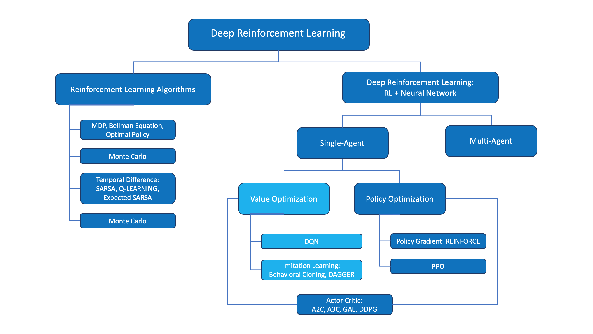

# C-3: Deep Value-Based Methods

1. Function Approximation

    - Linear Value Function Approximation
    - Gradient Descent for Value Functions
    - Feature Representation Techniques
    - Non-Linear Function Approximation

2. Deep Q-Networks (DQN)

    - Neural Networks for Q-Function Approximation
    - Experience Replay
    - Fixed Q-Targets
    - DQN Architecture and Training Process

3. Advanced DQN Variants
    - Double DQN and Overestimation Bias
    - Prioritized Experience Replay
    - Dueling Network Architectures
    - Rainbow DQN: Integrated Improvements

## 1. Function Approximation

### Linear Value Function Approximation

When reinforcement learning problems involve large or continuous state spaces, representing value functions with tables
becomes impractical or impossible. Linear function approximation offers an elegant and computationally efficient method
to generalize value functions across states, enabling RL to scale to more complex problems.

#### Basic Concept

Linear function approximation represents value functions as linear combinations of features:

$$\hat{v}(s, \mathbf{w}) = \mathbf{w}^T \mathbf{x}(s) = \sum_{i=1}^{n} w_i x_i(s)$$

Where:

- $\hat{v}(s, \mathbf{w})$ is the approximated value of state $s$
- $\mathbf{w} = (w_1, w_2, ..., w_n)^T$ is a weight vector
- $\mathbf{x}(s) = (x_1(s), x_2(s), ..., x_n(s))^T$ is a feature vector for state $s$

Similarly, for action-value functions:

$$\hat{q}(s, a, \mathbf{w}) = \mathbf{w}^T \mathbf{x}(s, a) = \sum_{i=1}^{n} w_i x_i(s, a)$$

#### Feature Representation

The feature vector $\mathbf{x}(s)$ transforms the state into a set of features that capture relevant aspects of the
state. Common feature representations include:

1. **State Variables**: Using state components directly as features

    ```
    x(s) = [s₁, s₂, ..., sₖ]ᵀ
    ```

2. **Polynomial Features**: Including powers and products of state variables

    ```
    x(s) = [1, s₁, s₂, s₁², s₁s₂, s₂², ...]ᵀ
    ```

3. **Radial Basis Functions (RBFs)**: Gaussian functions centered at fixed points

    ```
    x_i(s) = exp(-||s - cᵢ||²/(2σ²))
    ```

    Where cᵢ are fixed center points and σ controls the width.

4. **Tile Coding**: Overlapping tilings of the state space

    ```
    x_i(s) = 1 if s falls in the i-th tile, 0 otherwise
    ```

5. **Fourier Basis**: Sine and cosine functions of varying frequencies

    ```
    x_i(s) = cos(πic·s) or sin(πic·s)
    ```

6. **Coarse Coding**: Binary features activated by proximity to reference points

    ```
    x_i(s) = 1 if ||s - cᵢ|| < rᵢ, 0 otherwise
    ```

#### Parameter Updating with Gradient Descent

The goal is to find weights $\mathbf{w}$ that minimize the mean squared error between the approximated and true value
functions. Gradient descent provides an iterative method to update these weights:

$$\mathbf{w}*{t+1} = \mathbf{w}\*t - \frac{1}{2}\alpha \nabla\*\mathbf{w} [v*\pi(S_t) - \hat{v}(S_t, \mathbf{w}_t)]^2 = \mathbf{w}*t + \alpha [v*\pi(S_t) - \hat{v}(S_t, \mathbf{w}*t)] \nabla*\mathbf{w} \hat{v}(S_t, \mathbf{w}_t)$$

For linear function approximation, the gradient simplifies to:

$$\nabla_\mathbf{w} \hat{v}(S_t, \mathbf{w}) = \mathbf{x}(S_t)$$

Leading to the update rule:

$$\mathbf{w}_{t+1} = \mathbf{w}*t + \alpha [v*\pi(S_t) - \hat{v}(S_t, \mathbf{w}_t)] \mathbf{x}(S_t)$$

In practice, we don't know $v_\pi(S_t)$, so we replace it with a target such as the TD target
$R_{t+1} + \gamma \hat{v}(S_{t+1}, \mathbf{w})$.

#### Convergence Properties

Linear function approximation with TD learning has important convergence properties:

1. **Fixed Point**: With linear function approximation, TD(0) converges to a fixed point $\mathbf{w}_{TD}$.
2. **On-Policy Convergence**: For on-policy learning with linear function approximation, TD(0) is guaranteed to converge
   under standard conditions.
3. **Off-Policy Challenges**: Off-policy methods like Q-learning with linear function approximation may diverge in some
   cases.
4. **Projection**: The solution $\mathbf{w}_{TD}$ represents a projection of the true value function onto the space of
   functions representable by the linear approximator.

#### Practical Implementation Examples

1. **TD(0) with Linear Function Approximation**:

    ```
    Initialize w arbitrarily
    For each episode:
       Initialize S
       For each step:
             Take action A, observe R, S'
             w ← w + α[R + γw^Tx(S') - w^Tx(S)]x(S)
             S ← S'
    ```

2. **SARSA with Linear Function Approximation**:

    ```
    Initialize w arbitrarily
    For each episode:
       Initialize S, choose A using policy
       For each step:
             Take action A, observe R, S'
             Choose A' from S' using policy
             w ← w + α[R + γw^Tx(S',A') - w^Tx(S,A)]x(S,A)
             S ← S', A ← A'
    ```

#### Advantages of Linear Function Approximation

1. **Generalization**: Leverages similarity between states to infer values of unseen states.
2. **Memory Efficiency**: Requires storing only the weight vector rather than values for all states.
3. **Computational Efficiency**: Updates and predictions involve simple dot products.
4. **Theoretical Guarantees**: Many linear methods have convergence guarantees under certain conditions.
5. **Interpretability**: Weights directly indicate the importance of different features.

#### Limitations

1. **Expressiveness**: Limited to representing value functions that are linear in the features.
2. **Feature Engineering**: Performance heavily depends on the choice of features.
3. **Off-Policy Divergence**: Some algorithms may diverge with off-policy learning.
4. **Catastrophic Interference**: Learning new tasks may erase knowledge of previously learned tasks.

Linear function approximation provides a powerful and theoretically grounded approach to scaling reinforcement learning
to larger problems. By carefully selecting features and update rules, it enables effective generalization across state
spaces while maintaining computational efficiency and, in many cases, convergence guarantees.

### Gradient Descent for Value Functions

Gradient descent is a fundamental optimization technique in reinforcement learning used to update value function
approximations. It provides a systematic way to adjust parameters to minimize prediction errors, making it possible to
learn complex value functions from experience.

#### Objective Function and Error Minimization

In value function approximation, the goal is to minimize the difference between the estimated value function and the
true value function. This is typically formulated as minimizing a mean squared error (MSE) objective:

$$J(\mathbf{w}) = \mathbb{E}*\pi[(v*\pi(s) - \hat{v}(s, \mathbf{w}))^2]$$

For action-value functions, the objective is:

$$J(\mathbf{w}) = \mathbb{E}*\pi[(q*\pi(s, a) - \hat{q}(s, a, \mathbf{w}))^2]$$

Since we don't know the true value functions $v_\pi$ or $q_\pi$, we use target values that serve as substitutes:

1. **Monte Carlo Target**: $G_t$ (the actual return)
2. **TD Target**: $R_{t+1} + \gamma \hat{v}(S_{t+1}, \mathbf{w})$
3. **n-step TD Target**: $R_{t+1} + \gamma R_{t+2} + ... + \gamma^{n-1}R_{t+n} + \gamma^n \hat{v}(S_{t+n}, \mathbf{w})$

#### Standard Gradient Descent Update

The general form of gradient descent updates the parameter vector in the direction that reduces the error:

$$\mathbf{w}_{t+1} = \mathbf{w}*t - \alpha \nabla*\mathbf{w} J(\mathbf{w}_t)$$

For the squared error between the current estimate and the target, this becomes:

$$\mathbf{w}_{t+1} = \mathbf{w}_t + \alpha [target - \hat{v}(S_t, \mathbf{w}*t)] \nabla*\mathbf{w} \hat{v}(S_t, \mathbf{w}_t)$$

#### Value Function Derivatives

The gradient term $\nabla_\mathbf{w} \hat{v}(S_t, \mathbf{w}_t)$ depends on the form of the function approximator:

1. **Linear Function Approximation**: $$\hat{v}(s, \mathbf{w}) = \mathbf{w}^T \mathbf{x}(s)$$
   $$\nabla_\mathbf{w} \hat{v}(s, \mathbf{w}) = \mathbf{x}(s)$$
2. **Neural Network**: $$\nabla_\mathbf{w} \hat{v}(s, \mathbf{w})$$ is computed using backpropagation through the
   network

#### Gradient Descent Updates for Different Algorithms

1. **Monte Carlo with Gradient Descent**:
   $$\mathbf{w}_{t+1} = \mathbf{w}_t + \alpha [G_t - \hat{v}(S_t, \mathbf{w}*t)] \nabla*\mathbf{w} \hat{v}(S_t, \mathbf{w}_t)$$
2. **TD(0) with Gradient Descent**:
   $$\mathbf{w}*{t+1} = \mathbf{w}\*t + \alpha [R\*{t+1} + \gamma\hat{v}(S*{t+1}, \mathbf{w}_t) - \hat{v}(S_t, \mathbf{w}*t)] \nabla*\mathbf{w} \hat{v}(S_t, \mathbf{w}_t)$$
3. **SARSA with Gradient Descent**:
   $$\mathbf{w}*{t+1} = \mathbf{w}\*t + \alpha [R\*{t+1} + \gamma\hat{q}(S*{t+1}, A_{t+1}, \mathbf{w}_t) - \hat{q}(S_t, A_t, \mathbf{w}*t)] \nabla*\mathbf{w} \hat{q}(S_t, A_t, \mathbf{w}_t)$$
4. **Q-Learning with Gradient Descent**:
   $$\mathbf{w}*{t+1} = \mathbf{w}\*t + \alpha [R\*{t+1} + \gamma\max_a\hat{q}(S*{t+1}, a, \mathbf{w}_t) - \hat{q}(S_t, A_t, \mathbf{w}*t)] \nabla*\mathbf{w} \hat{q}(S_t, A_t, \mathbf{w}_t)$$

#### Practical Gradient Descent Variations

Several variations of gradient descent are commonly used to improve convergence:

1. **Stochastic Gradient Descent (SGD)**: Updates parameters using individual samples rather than full expectations.
2. **Mini-batch Gradient Descent**: Updates parameters using the average gradient from a small batch of samples.
   $$\mathbf{w}_{t+1} = \mathbf{w}*t + \alpha \frac{1}{|B|} \sum*{i \in B} [target_i - \hat{v}(S_i, \mathbf{w}*t)] \nabla*\mathbf{w} \hat{v}(S_i, \mathbf{w}_t)$$
3. **Momentum**: Adds a fraction of the previous update to accelerate learning.
   $$\mathbf{v}_{t+1} = \beta\mathbf{v}*t + (1-\beta)\nabla*\mathbf{w} J(\mathbf{w}*t)$$
   $$\mathbf{w}*{t+1} = \mathbf{w}*t - \alpha \mathbf{v}*{t+1}$$
4. **RMSProp**: Adapts the learning rate for each parameter based on recent gradient magnitudes.
   $$\mathbf{s}_{t+1} = \rho\mathbf{s}*t + (1-\rho)(\nabla*\mathbf{w} J(\mathbf{w}*t))^2$$
   $$\mathbf{w}*{t+1} = \mathbf{w}*t - \alpha \frac{\nabla*\mathbf{w} J(\mathbf{w}*t)}{\sqrt{\mathbf{s}*{t+1} + \epsilon}}$$
5. **Adam**: Combines momentum and RMSProp for parameter-specific adaptive learning rates.

#### Semi-Gradient Methods

In TD learning with function approximation, the update target itself depends on the current parameters, creating a
"moving target" problem. To address this, we use semi-gradient methods that ignore the dependency of the target on the
parameters:

$$\mathbf{w}*{t+1} = \mathbf{w}\*t + \alpha [R\*{t+1} + \gamma\hat{v}(S*{t+1}, \mathbf{w}_t) - \hat{v}(S_t, \mathbf{w}*t)] \nabla*\mathbf{w} \hat{v}(S_t, \mathbf{w}_t)$$

The term "semi-gradient" reflects that this is not a true gradient of any fixed objective function, but rather a partial
update that ignores how changes in $\mathbf{w}$ affect the target.

#### Convergence Considerations

The convergence properties of gradient-based methods in RL depend on several factors:

1. **Function Approximator**: Linear approximators have stronger convergence guarantees than non-linear ones.
2. **Learning Algorithm**: On-policy methods like SARSA generally have better convergence properties than off-policy
   methods like Q-learning.
3. **Learning Rate Schedule**: Decreasing learning rates that satisfy the Robbins-Monro conditions guarantee convergence
   under certain assumptions:
    - $\sum_{t=1}^{\infty} \alpha_t = \infty$
    - $\sum_{t=1}^{\infty} \alpha_t^2 < \infty$
4. **Bootstrapping**: Methods that bootstrap (use their own estimates as targets) may introduce instability, especially
   with off-policy learning and function approximation.
5. **Feature Representation**: The choice of features significantly affects both the expressiveness of the approximator
   and the stability of learning.

Gradient descent provides a powerful framework for updating value function approximations in reinforcement learning. By
systematically adjusting parameters to minimize prediction errors, it enables the learning of complex value functions
from experience. Understanding the variations and convergence properties of gradient-based methods is essential for
developing effective reinforcement learning systems across a wide range of applications.

### Feature Representation Techniques

Feature representation is a critical element of successful function approximation in reinforcement learning. The choice
of features determines how states and actions are represented to the learning algorithm, directly affecting
generalization, sample efficiency, and overall performance. Here we explore several powerful feature representation
techniques.

#### Tile Coding

Tile coding (also known as CMAC - Cerebellar Model Articulation Controller) is a method for representing continuous
states using overlapping tilings of the state space.

**Key Principles:**

1. **Multiple Overlapping Tilings**: The state space is covered by several offset grids or "tilings."
2. **Binary Features**: Each tile corresponds to a binary feature that is 1 if the state falls within the tile and 0
   otherwise.
3. **Generalization**: States that share tiles have similar representations, enabling generalization.

**Mathematical Representation:**

For a state $s$, the feature vector $\mathbf{x}(s)$ is:

$$x_i(s) = \begin{cases} 1, & \text{if } s \text{ falls in tile } i \ 0, & \text{otherwise} \end{cases}$$

**Implementation Details:**

1. **Offset Strategy**: Each tiling is offset by a fraction of the tile width, typically $\frac{1}{\text{num_tilings}}$.

2. **Memory Efficiency**: Hashing techniques can reduce memory requirements by mapping multiple tiles to the same
   feature.

3. Resolution Control

    : The generalization capability is controlled by:

    - Number of tilings: More tilings provide finer granularity
    - Tile size: Smaller tiles provide higher resolution

**Advantages:**

1. Very efficient computation (sparse binary features)
2. Good generalization across similar states
3. Linear in the number of tilings (unlike grid-based approaches which are exponential in dimensions)
4. Works well with linear function approximation

**Limitations:**

1. Curse of dimensionality: Becomes inefficient for high-dimensional state spaces
2. Requires careful tuning of tile size and number of tilings
3. Uniform tiling may waste resources on less important regions

#### Coarse Coding

Coarse coding uses overlapping receptive fields (often circular in continuous spaces) to create a distributed
representation of states.

**Key Principles:**

1. **Receptive Fields**: Each feature responds to a region of the state space.
2. **Overlapping Coverage**: Multiple features activate for any given state.
3. **Distance-Based Activation**: Features may activate based on distance to a prototype or center.

**Mathematical Representation:**

For a state $s$ and feature centers $c_i$:

$$x_i(s) = \begin{cases} 1, & \text{if } ||s - c_i|| \leq r_i \ 0, & \text{otherwise} \end{cases}$$

Where $r_i$ is the radius of the receptive field.

**Variations:**

1. **Gaussian Coarse Coding**: Uses Gaussian activation rather than binary:
   $$x_i(s) = \exp\left(-\frac{||s - c_i||^2}{2\sigma_i^2}\right)$$
2. **Variable Receptive Field Size**: Different features can have different sized fields.
3. **Non-uniform Placement**: Feature centers can be placed more densely in important regions.

**Advantages:**

1. Flexible geometric representation
2. Natural generalization based on proximity
3. Can adapt resolution to state space structure

**Limitations:**

1. Requires careful placement of receptive fields
2. May need many features for complex value functions
3. Curse of dimensionality in high-dimensional spaces

#### Radial Basis Functions (RBFs)

RBFs extend coarse coding by using continuous, often Gaussian, activation functions centered at specific points in the
state space.

**Key Principles:**

1. **Gaussian Activation**: Features activate based on distance to center points using Gaussian functions.
2. **Continuous Response**: Activation varies smoothly with distance (unlike binary features).
3. **Bandwidth Control**: The width parameter controls generalization scope.

**Mathematical Representation:**

For a state $s$ and RBF centers $c_i$:

$$x_i(s) = \exp\left(-\frac{||s - c_i||^2}{2\sigma_i^2}\right)$$

Where $\sigma_i$ controls the width of the Gaussian.

**Implementation Considerations:**

1. **Center Placement**: Centers can be placed on a grid, randomly, or using clustering algorithms.
2. **Width Selection**: The width parameter significantly affects generalization.
3. **Normalization**: Often, RBF outputs are normalized so they sum to 1.

**Advantages:**

1. Smooth generalization across state space
2. Local response (changes in distant areas have little effect)
3. Universal function approximation capabilities
4. Natural handling of continuous spaces

**Limitations:**

1. Computationally more expensive than binary features
2. Requires careful tuning of centers and widths
3. Scales poorly to high dimensions without additional techniques

#### Fourier Basis

Fourier basis uses sine and cosine functions of varying frequencies to represent value functions, leveraging frequency
domain approximation.

**Key Principles:**

1. **Periodic Functions**: Uses sinusoidal basis functions.
2. **Multiple Frequencies**: Higher frequencies capture finer details.
3. **Linear Combination**: Value function is approximated as a linear combination of these basis functions.

**Mathematical Representation:**

For a state $s$ normalized to $[0,1]^d$ and coefficient vector $c$:

$$x_i(s) = \cos(\pi c_i \cdot s)$$

Where $c_i$ is a coefficient vector determining the frequency along each dimension.

**Implementation Details:**

1. **Coefficient Selection**: For an order $n$ approximation, use all coefficient vectors with elements ${0,1,2,...,n}$.
2. **State Normalization**: States are typically normalized to $[0,1]^d$ before applying the basis functions.
3. **Computation**: Only requires simple trigonometric operations.

**Advantages:**

1. Theoretically grounded in Fourier analysis
2. No centers or prototypes to place
3. Systematic control of approximation resolution
4. Works well for smooth value functions

**Limitations:**

1. Less efficient for discontinuous or highly localized functions
2. Requires normalized state spaces
3. Exponential growth in number of features with dimensionality

#### Polynomial Features

Polynomial features use powers and products of state variables to represent nonlinear relationships in a form amenable
to linear approximation.

**Key Principles:**

1. **Polynomial Expansion**: Includes powers and cross-products of original features.
2. **Order Selection**: The polynomial order determines the complexity of representable functions.
3. **Linear Combination**: The expanded features are used in linear function approximation.

**Mathematical Representation:**

For a state $s = [s_1, s_2, ..., s_d]$, second-order polynomial features would include:

$$\mathbf{x}(s) = [1, s_1, s_2, ..., s_d, s_1^2, s_1s_2, ..., s_1s_d, s_2^2, ...]^T$$

**Implementation Considerations:**

1. **Feature Scaling**: Important to normalize input features to prevent numerical issues.
2. **Order Selection**: Higher orders provide more flexibility but increase overfitting risk.
3. **Sparse Interactions**: Often, only specific interactions are included rather than all possibilities.

**Advantages:**

1. Simple to implement
2. Captures nonlinear relationships
3. Works with linear learning algorithms
4. Interpretable feature importance

**Limitations:**

1. Exponential growth with feature dimensionality and polynomial order
2. Sensitive to outliers
3. Limited expressiveness compared to some other techniques
4. Requires feature engineering to select relevant interactions

#### Best Practices for Feature Selection

1. **Start Simple**: Begin with simple features and add complexity as needed.
2. **Domain Knowledge**: Incorporate domain expertise in feature design when available.
3. **Dimensionality Reduction**: Consider applying techniques like PCA before feature expansion.
4. **Feature Normalization**: Normalize features to ensure consistent influence and numerical stability.
5. **Cross-Validation**: Use validation performance to select between feature representations.
6. **Hybrid Approaches**: Combine multiple feature representation techniques when appropriate.
7. **Adaptivity**: Consider adaptive feature generation methods that refine representation during learning.

Feature representation is both an art and a science in reinforcement learning. The choice of representation
significantly impacts the learning algorithm's ability to generalize from experience and approximate complex value
functions. By understanding the strengths and limitations of different feature representation techniques, practitioners
can select appropriate approaches for their specific reinforcement learning problems.

### Non-Linear Function Approximation

While linear function approximation has strong theoretical properties, many complex reinforcement learning problems
require more expressive representations. Non-linear function approximation, particularly neural networks, has emerged as
a powerful approach for representing complex value functions and policies. This section explores the use of non-linear
function approximators in reinforcement learning.

#### From Linear to Non-Linear Approximation

Linear function approximation takes the form:

$$\hat{v}(s, \mathbf{w}) = \mathbf{w}^T \mathbf{x}(s) = \sum_{i=1}^{n} w_i x_i(s)$$

Non-linear function approximation generalizes this to:

$$\hat{v}(s, \mathbf{w}) = f(s; \mathbf{w})$$

Where $f$ is a non-linear function parameterized by $\mathbf{w}$. The key difference is that the relationship between
parameters and the output is no longer linear, enabling more complex representations.

#### Neural Networks as Function Approximators

Neural networks are the most widely used non-linear function approximators in modern reinforcement learning. They
consist of layers of interconnected units (neurons) that process information through non-linear transformations.

**Basic Architecture:**

1. **Input Layer**: Receives the state representation (or state-action pair)
2. **Hidden Layers**: Apply non-linear transformations to the inputs
3. **Output Layer**: Produces the estimated value or action values

**Forward Pass Computation:**

For a simple feedforward neural network with one hidden layer:

$$\mathbf{h} = \sigma(\mathbf{W}_1 \mathbf{s} + \mathbf{b}_1)$$
$$\hat{v}(s, \mathbf{w}) = \mathbf{W}_2 \mathbf{h} + \mathbf{b}_2$$

Where:

- $\mathbf{s}$ is the state input
- $\mathbf{W}_1, \mathbf{b}_1$ are weights and biases for the hidden layer
- $\mathbf{W}_2, \mathbf{b}_2$ are weights and biases for the output layer
- $\sigma$ is a non-linear activation function (e.g., ReLU, tanh, sigmoid)
- The parameter vector $\mathbf{w}$ encompasses all weights and biases:
  $\mathbf{w} = [\mathbf{W}_1, \mathbf{b}_1, \mathbf{W}_2, \mathbf{b}_2]$

**Representation for Action Values:**

Neural networks can represent action values in two ways:

1. **Multiple Output Units**: One output per action
   $$Q(s, a; \mathbf{w}) = [Q(s, a_1; \mathbf{w}), Q(s, a_2; \mathbf{w}), ..., Q(s, a_n; \mathbf{w})]$$
2. **State-Action Input**: Single output with both state and action as input
   $$Q(s, a; \mathbf{w}) = f(s, a; \mathbf{w})$$

#### Gradient-Based Updates

For non-linear function approximation, the gradient $\nabla_\mathbf{w} \hat{v}(s, \mathbf{w})$ is no longer simply the
feature vector. Instead, it must be computed using the chain rule of calculus, typically through backpropagation for
neural networks.

The update rule still takes the form:

$$\mathbf{w}_{t+1} = \mathbf{w}_t + \alpha [target - \hat{v}(S_t, \mathbf{w}*t)] \nabla*\mathbf{w} \hat{v}(S_t, \mathbf{w}_t)$$

For a neural network, the gradient $\nabla_\mathbf{w} \hat{v}(S_t, \mathbf{w}_t)$ represents how the output changes with
respect to each parameter, computed efficiently via backpropagation.

#### Common Neural Network Architectures

1. **Feedforward Neural Networks (FNNs)**: Standard architecture with fully connected layers.

    ```
    State → Dense Layer(s) → Value Output
    ```

2. **Convolutional Neural Networks (CNNs)**: Specialized for processing grid-like data (e.g., images).

    ```
    Image State → Conv Layers → Flatten → Dense Layer(s) → Value Output
    ```

3. **Recurrent Neural Networks (RNNs)**: Process sequential data, maintaining internal state.

    ```
    State Sequence → RNN Layers → Dense Layer(s) → Value Output
    ```

4. **Dueling Networks**: Split value estimation into state value and action advantage components.

    ```
    State → Shared Layers → [Value Stream, Advantage Stream] → Combined Output
    ```

#### Challenges with Non-Linear Function Approximation

1. **Stability Issues**: Non-linear approximators, especially with bootstrapping and off-policy learning, can lead to
   unstable training.
2. **Moving Target Problem**: The target values in TD learning depend on the current approximation, creating a
   non-stationary learning problem.
3. **Local Minima**: The optimization landscape may contain multiple local minima.
4. **Overparameterization**: Neural networks typically have many more parameters than strictly necessary, requiring
   regularization.
5. **Sample Efficiency**: Non-linear methods often require more data to train effectively.

#### Stabilization Techniques

Several techniques have been developed to stabilize learning with non-linear function approximation:

1. **Experience Replay**: Store and reuse past experiences to break temporal correlations.

    ```
    Buffer = [(s₁,a₁,r₁,s₁'), (s₂,a₂,r₂,s₂'), ...]
    Sample minibatch randomly for updates
    ```

2. **Target Networks**: Use a separate network with frozen parameters for computing target values.

    ```
    Target = r + γ Q_target(s', argmax_a Q(s',a; w); w⁻)
    ```

    Where $w⁻$ represents the parameters of the target network, updated less frequently.

3. **Batch Normalization**: Normalize activations to reduce internal covariate shift.

    ```
    h = BatchNorm(W·x + b)
    ```

4. **Gradient Clipping**: Limit the magnitude of gradients to prevent large updates.

    ```
    if ||∇w|| > threshold:
       ∇w = threshold · ∇w/||∇w||
    ```

5. **Double Learning**: Use two separate networks to reduce overestimation bias.

    ```
    Target = r + γ Q_B(s', argmax_a Q_A(s',a))
    ```

#### Deep Reinforcement Learning Algorithms

The combination of reinforcement learning with deep neural networks has led to several powerful algorithms:

1. **Deep Q-Network (DQN)**: Combines Q-learning with convolutional neural networks and stabilization techniques.
2. **Double DQN**: Extends DQN with double learning to reduce overestimation bias.
3. **Dueling DQN**: Uses a special architecture that separates state value and action advantage.
4. **Prioritized Experience Replay**: Samples experiences based on their TD error magnitude.
5. **Deep Deterministic Policy Gradient (DDPG)**: Actor-critic algorithm for continuous action spaces using deep neural
   networks.

#### Practical Considerations

When implementing non-linear function approximation for RL:

1. **Network Size**: Start with smaller networks and increase complexity as needed.
2. **Learning Rate**: Typically requires smaller learning rates than linear approximation.
3. **Initialization**: Proper weight initialization is crucial for convergence.
4. **Preprocessing**: Normalize input features to stabilize training.
5. **Exploration Strategy**: Epsilon-greedy or more sophisticated exploration strategies are still needed.
6. **Hyperparameter Tuning**: Non-linear methods often require careful tuning of multiple hyperparameters.
7. **Computational Resources**: Be aware of the increased computational requirements.

Non-linear function approximation, particularly with neural networks, has dramatically expanded the capability of
reinforcement learning to handle complex problems with high-dimensional state spaces. While introducing challenges in
terms of stability and complexity, the expressive power of these methods has enabled breakthroughs in applications
ranging from game playing to robotics. Understanding how to effectively implement and stabilize non-linear function
approximation is essential for tackling sophisticated reinforcement learning problems.

## 2. Deep Q-Networks (DQN)

### Neural Networks for Q-Function Approximation

Deep Q-Networks (DQN) represent a landmark advancement in reinforcement learning by successfully combining Q-learning
with neural network function approximation to solve complex problems with high-dimensional state spaces. This section
explores how neural networks are used to approximate Q-functions and the specific architectural considerations for this
application.

#### The Q-Function Approximation Problem

In traditional Q-learning with tabular representations, we maintain a table with entries Q(s,a) for each state-action
pair. However, for problems with large or continuous state spaces, this becomes impractical. Instead, we use a function
approximator:

$$Q(s, a; \theta) \approx Q^*(s, a)$$

Where $\theta$ represents the parameters of the neural network (weights and biases). The goal is to find parameters
$\theta$ such that the approximated Q-values closely match the optimal Q-values.

#### Neural Network Architecture for Q-Function Approximation

There are two main architectural approaches for representing Q-functions with neural networks:

1. **Value-per-action Architecture**: The network takes the state as input and outputs Q-values for all possible
   actions.

    - Input: State representation
    - Output: Vector of Q-values, one for each action
    - Used for: Discrete action spaces with manageable number of actions

    ```
    Q(s, a₁; θ)   Q(s, a₂; θ)   ...   Q(s, aₙ; θ)
          ↑            ↑                    ↑
    +------------------------------------------+
    |            Hidden Layers                 |
    +------------------------------------------+
                      ↑
                   State (s)
    ```

2. **State-action Architecture**: The network takes both state and action as input and outputs a single Q-value.

    - Input: State representation and action
    - Output: Q-value for the given state-action pair
    - Used for: Continuous action spaces or very large discrete action spaces

    ```
             Q(s, a; θ)
                ↑
    +---------------------------+
    |       Hidden Layers       |
    +---------------------------+
             ↑         ↑
          State (s)  Action (a)
    ```

#### DQN Architectural Components

The original DQN architecture designed for Atari games had several key components:

1. **Convolutional Layers**: For processing raw pixel inputs
    - Capture spatial patterns and hierarchical features
    - Enable learning directly from visual input
    - Typical structure: 3-4 convolutional layers with ReLU activations
2. **Fully Connected Layers**: For integration and value estimation
    - Combine features extracted by convolutional layers
    - Map to action values
    - Typically 1-2 layers with 512-1024 units
3. **Input Preprocessing**:
    - Frame stacking: Combine multiple (typically 4) consecutive frames to capture motion
    - Grayscale conversion: Reduce color dimensions to focus on structure
    - Downsampling: Resize images (e.g., 84×84 pixels) to reduce computational requirements
4. **Output Layer**:
    - Linear activation (no non-linearity)
    - One output unit per possible action
    - Directly represents Q-values

A typical DQN architecture for Atari games:

```
Input: 84×84×4 (4 stacked grayscale frames)
Conv1: 32 filters of 8×8 with stride 4, ReLU
Conv2: 64 filters of 4×4 with stride 2, ReLU
Conv3: 64 filters of 3×3 with stride 1, ReLU
Flatten
FC1: 512 units, ReLU
Output: Linear layer with one output per action
```

#### Dueling Network Architecture

An important architectural variation is the Dueling DQN, which separates the Q-function into two components:

1. **State Value Function (V)**: Estimates how good it is to be in a state
2. **Advantage Function (A)**: Estimates the relative advantage of each action

The Q-value is then computed as:

$$Q(s, a; \theta) = V(s; \theta_v) + \left(A(s, a; \theta_a) - \frac{1}{|A|}\sum_{a'} A(s, a'; \theta_a)\right)$$

This architecture provides several benefits:

- Better learning efficiency in many environments
- Implicit regularization through the advantage stream
- Improved policy evaluation by separating state value from action advantages

The architecture typically looks like:

```
                        Q-values
                           ↑
            +------------+------------+
            ↑                         ↑
      Value Stream              Advantage Stream
            ↑                         ↑
            +------------+------------+
                           ↑
                     Shared Layers
                           ↑
                     State Input
```

#### Training Neural Network Q-Functions

Training a neural network to approximate Q-functions involves several steps:

1. **Loss Function**: Mean squared error between the current Q-value and the target
   $$L(\theta) = \mathbb{E}\left[(r + \gamma \max_{a'} Q(s', a'; \theta^-) - Q(s, a; \theta))^2\right]$$ Where
   $\theta^-$ represents the parameters of a target network.
2. **Gradient Computation**: Compute the gradient of the loss with respect to network parameters
   $$\nabla_\theta L(\theta) = \mathbb{E}\left[(r + \gamma \max_{a'} Q(s', a'; \theta^-) - Q(s, a; \theta)) \nabla_\theta Q(s, a; \theta)\right]$$
3. **Parameter Update**: Update network parameters using gradient descent
   $$\theta \leftarrow \theta - \alpha \nabla_\theta L(\theta)$$
4. **Target Network Updates**: Periodically update the target network parameters $$\theta^- \leftarrow \theta$$

#### Feature Extraction and Representation

Neural networks for Q-function approximation perform automatic feature extraction from raw inputs, a key advantage over
traditional methods:

1. **Hierarchical Feature Learning**: Deep networks learn increasingly abstract features in successive layers
    - Early layers: Low-level patterns (edges, textures)
    - Middle layers: Mid-level features (shapes, object parts)
    - Later layers: High-level concepts relevant to decision making
2. **End-to-End Learning**: The feature extraction and value estimation are jointly optimized
    - No need for manual feature engineering
    - Learns representations specifically useful for the task
3. **Transfer Learning**: Features learned on one task can often be transferred to related tasks
    - Pre-training on similar environments
    - Fine-tuning for specific objectives

#### Advanced Network Architectures

Beyond basic convolutional networks, several advanced architectures have been applied:

1. **Residual Networks (ResNets)**: Use skip connections to improve gradient flow in deep networks
2. **Attention Mechanisms**: Focus computational resources on relevant parts of the input
3. **Recurrent Networks**: Incorporate temporal dependencies more explicitly
    - LSTM or GRU layers for handling partial observability
    - Maintaining internal state across time steps
4. **Transformer Architectures**: Process sequential data with self-attention mechanisms

#### Practical Implementation Considerations

When implementing neural networks for Q-function approximation:

1. **Network Size**: Balance expressiveness with computational efficiency
    - Too small: May underfit, limiting performance
    - Too large: May overfit, increasing computational requirements
2. **Activation Functions**: ReLU is commonly used for hidden layers due to:
    - Computational efficiency
    - Reducing vanishing gradient problems
    - Sparse activation patterns
3. **Initialization**: Proper weight initialization is crucial
    - Xavier/Glorot or He initialization methods
    - Prevents vanishing or exploding gradients
4. **Normalization Techniques**:
    - Batch normalization: Stabilizes training
    - Layer normalization: Useful for smaller batch sizes
5. **Regularization**:
    - Dropout: Prevents co-adaptation of neurons
    - L2 regularization: Penalizes large weights

Neural networks for Q-function approximation have transformed reinforcement learning by enabling agents to learn
directly from high-dimensional inputs like images. By understanding the architectural considerations and training
techniques, practitioners can effectively implement DQN and its variants for a wide range of complex reinforcement
learning problems.

### Experience Replay

Experience replay is a fundamental technique that enabled the breakthrough success of Deep Q-Networks by addressing the
sample inefficiency and stability issues that plagued earlier attempts to combine deep learning with reinforcement
learning. This mechanism stores and reuses past experiences, dramatically improving both the learning stability and data
efficiency of deep reinforcement learning algorithms.

#### Core Concept and Motivation

Experience replay involves storing the agent's experiences in a memory buffer and then sampling from this buffer to
perform learning updates. Each experience is typically stored as a transition tuple:

$$(s_t, a_t, r_{t+1}, s_{t+1})$$

Where:

- $s_t$ is the state at time $t$
- $a_t$ is the action taken
- $r_{t+1}$ is the reward received
- $s_{t+1}$ is the next state

The primary motivations for experience replay include:

1. **Breaking Temporal Correlations**: Sequential experiences in RL are highly correlated, which can lead to inefficient
   learning and instability in neural network training. Random sampling from the replay buffer breaks these
   correlations.
2. **Data Efficiency**: Each experience can be used multiple times for learning, extracting more value from the agent's
   interactions with the environment.
3. **Variance Reduction**: Averaging over many past experiences reduces the variance in updates, leading to more stable
   learning.
4. **Experience Diversity**: The buffer maintains a diverse set of experiences, preventing the network from forgetting
   earlier encountered situations.

#### Implementation Details

A typical implementation of experience replay includes:

1. **Replay Buffer Structure**: A fixed-size first-in-first-out (FIFO) queue that stores transition tuples.

    ```
    D = {(s₁, a₁, r₁, s₁'), (s₂, a₂, r₂, s₂'), ..., (sₙ, aₙ, rₙ, sₙ')}
    ```

2. **Storage Process**: After each interaction with the environment, the agent stores the transition in the buffer.

    ```
    D ← D ∪ {(sₜ, aₜ, rₜ₊₁, sₜ₊₁)}
    ```

    If the buffer is full, the oldest experience is removed.

3. **Sampling Process**: During learning, a mini-batch of experiences is randomly sampled from the buffer.

    ```
    Sample random minibatch of N transitions (sⱼ, aⱼ, rⱼ, sⱼ') from D
    ```

4. **Update Process**: The sampled experiences are used to compute the loss and update the Q-network.

    ```
    For each (sⱼ, aⱼ, rⱼ, sⱼ') compute target yⱼ = rⱼ + γ max_a' Q(sⱼ', a'; θ⁻)
    Perform gradient descent step on (yⱼ - Q(sⱼ, aⱼ; θ))² with respect to θ
    ```

#### Buffer Size Considerations

The size of the replay buffer involves important trade-offs:

1. **Too Small**: Insufficient diversity of experiences, leading to forgetting and instability.
2. **Too Large**: May include too many outdated experiences that reflect old policies.

Typical buffer sizes range from 50,000 to 1,000,000 transitions, depending on the complexity of the environment and the
specific algorithm.

#### Mini-Batch Sampling

The mini-batch size for experience replay also requires careful consideration:

1. **Computational Efficiency**: Larger batches utilize hardware more efficiently (particularly on GPUs).
2. **Update Stability**: Larger batches provide more stable gradient estimates.
3. **Learning Speed**: Smaller batches allow for more frequent updates per unit of computation.

Common mini-batch sizes range from 32 to 256 transitions.

#### Prioritized Experience Replay

A significant enhancement to basic experience replay is Prioritized Experience Replay (PER), which samples experiences
with higher priority based on their TD error:

$$p_i = \frac{(|\delta_i| + \epsilon)^\alpha}{\sum_j (|\delta_j| + \epsilon)^\alpha}$$

Where:

- $\delta_i$ is the TD error for transition $i$
- $\alpha$ controls how much prioritization is used
- $\epsilon$ is a small constant to ensure non-zero probability for all transitions

Prioritized sampling introduces bias in the update distribution, which is corrected using importance sampling weights:

$$w_i = \left(\frac{1}{N} \cdot \frac{1}{P(i)}\right)^\beta$$

Where:

- $N$ is the buffer size
- $P(i)$ is the probability of sampling transition $i$
- $\beta$ is the importance sampling exponent

PER provides several advantages:

- More efficient learning by focusing on the most informative transitions
- Better performance on problems with rare but important experiences
- Automatic adaptation to the current learning state

#### Extensions and Variations

Several extensions to basic experience replay have been developed:

1. **Hindsight Experience Replay (HER)**: Augments experiences by retrospectively changing the goal, turning failed
   attempts into successful ones for different goals.
2. **Combined Experience Replay**: Ensures both recent and historical experiences are included in each batch by always
   including the most recent transition.
3. **Selective Experience Replay**: Strategically decides which experiences to store and recall based on their potential
   value for learning.
4. **Distributed Experience Replay**: Uses parallel agents to collect experiences into a shared replay buffer,
   increasing the diversity and collection rate.

#### Theoretical Understanding

Experience replay can be understood from several theoretical perspectives:

1. **Decorrelation**: Breaking the temporal correlations in the data stream makes the training more similar to
   supervised learning with i.i.d. samples.
2. **Multi-step Bootstrapping**: When combined with eligibility traces or n-step returns, experience replay facilitates
   efficient credit assignment across multiple time steps.
3. **Approximate Dynamic Programming**: Experience replay can be viewed as a form of fitted Q-iteration, where each
   update improves the approximation of the Bellman optimality operator.
4. **Memory-Based Learning**: Connections to memory-based approaches in psychology and neuroscience, where past
   experiences guide future decisions.

Experience replay represents a crucial innovation in deep reinforcement learning, addressing key challenges in stability
and data efficiency. Its integration into DQN and subsequent algorithms has been essential for their success in complex
environments. Understanding the nuances of experience replay implementation and its extensions is vital for developing
effective deep reinforcement learning systems.

### Fixed Q-Targets

Fixed Q-targets, also known as target networks, represent a critical stabilization technique in Deep Q-Networks (DQN)
and related algorithms. This approach directly addresses the instability that arises when learning with bootstrapped
targets in conjunction with function approximation, particularly neural networks.

#### The Moving Target Problem

In standard Q-learning, the update rule takes the form:

$$Q(s_t, a_t) \leftarrow Q(s_t, a_t) + \alpha \left[r_{t+1} + \gamma \max_{a'} Q(s_{t+1}, a') - Q(s_t, a_t)\right]$$

When Q-values are approximated by a neural network with parameters $\theta$, this becomes:

$$\theta \leftarrow \theta + \alpha \left[r_{t+1} + \gamma \max_{a'} Q(s_{t+1}, a'; \theta) - Q(s_t, a_t; \theta)\right] \nabla_\theta Q(s_t, a_t; \theta)$$

The fundamental problem here is that the same set of parameters $\theta$ is used both to:

1. Generate the target value ($r_{t+1} + \gamma \max_{a'} Q(s_{t+1}, a'; \theta)$)
2. Generate the current value being updated ($Q(s_t, a_t; \theta)$)

This creates a moving target problem: as the parameters $\theta$ change during learning, the target values also change,
leading to potential instability, oscillations, or divergence. This issue is particularly severe with non-linear
function approximators like neural networks.

#### The Fixed Q-Target Solution

Fixed Q-targets address this issue by maintaining two separate networks:

1. **Online Network** (with parameters $\theta$): Used for action selection and updated continually.
2. **Target Network** (with parameters $\theta^-$): Used to compute target values and updated less frequently.

The modified update rule becomes:

$$\theta \leftarrow \theta + \alpha \left[r_{t+1} + \gamma \max_{a'} Q(s_{t+1}, a'; \theta^-) - Q(s_t, a_t; \theta)\right] \nabla_\theta Q(s_t, a_t; \theta)$$

The key insight is that by keeping the target network parameters $\theta^-$ fixed for multiple updates, the training
becomes more similar to supervised learning with stable targets, significantly improving stability.

#### Target Network Update Methods

There are several strategies for updating the target network parameters:

1. **Periodic Updates**: The original DQN approach, where the target network is updated every $C$ steps by copying the
   online network parameters.

    ```
    if step % C == 0:
       θ⁻ ← θ
    ```

    Typical values for $C$ range from 1,000 to 10,000 steps.

2. **Soft Updates (Polyak Averaging)**: A smoother approach that updates the target network parameters as a weighted
   average of the online and target networks.

    ```
    θ⁻ ← τθ + (1-τ)θ⁻
    ```

    Where $\tau$ is a small value (e.g., 0.001 or 0.01) that controls the update rate.

3. **Adaptive Updates**: Update the target network based on performance metrics or convergence criteria rather than
   fixed schedules.

#### Mathematical Analysis

The stability improvement from fixed Q-targets can be understood mathematically:

1. **Decoupling the Optimization**: The target network parameters remain constant during the optimization of the online
   network, effectively decoupling the target generation from the current approximation.
2. **Reducing Target Variance**: By holding the target network fixed, the variance in target values is reduced, making
   the learning process more stable.
3. **Preventing Oscillations**: Without fixed targets, updates can cause oscillations as changes to the network
   parameters affect both the prediction and target sides of the equation.
4. **Contraction Mapping Properties**: Fixed targets help maintain the contraction mapping properties of the Bellman
   operator, which are crucial for convergence guarantees.

#### Implementation Considerations

When implementing fixed Q-targets, several practical considerations are important:

1. **Memory Requirements**: Maintaining two networks doubles the memory requirements for storing network parameters,
   though this is typically not a significant constraint.
2. **Computational Overhead**: The forward pass through the target network adds some computational cost, but this is
   generally minimal compared to the overall training process.
3. **Update Frequency Trade-off**: There is a fundamental trade-off in the update frequency:
    - Too frequent: Approaches standard Q-learning with moving targets
    - Too infrequent: Slows down learning as targets become stale
4. **Initialization**: Both networks are typically initialized with the same parameters at the start of training.

#### Extensions and Variations

Several extensions to the basic fixed Q-target approach have been developed:

1. **Double DQN**: Uses the online network to select actions and the target network to evaluate them, addressing the
   overestimation bias in Q-learning.

    ```
    y = r + γ Q(s', argmax_a Q(s',a;θ); θ⁻)
    ```

2. **Multiple Target Networks**: Some algorithms use more than two networks with different update frequencies to further
   stabilize learning.

3. **Averaged DQN**: Maintains multiple previous versions of the Q-network and uses their average for computing target
   values, further reducing variance.

4. **Distributed Target Networks**: In distributed RL settings, target networks can be synchronized across multiple
   agents at different rates.

#### Empirical Evidence

The effectiveness of fixed Q-targets has been demonstrated empirically in numerous studies:

1. **Convergence Stability**: Enables reliable convergence in environments where standard DQN diverges.
2. **Learning Performance**: Improves the final performance and learning speed across a wide range of environments.
3. **Robustness**: Makes the algorithm more robust to hyperparameter choices, particularly the learning rate.
4. **Reduced Oscillations**: Visibly reduces oscillations in the training curves compared to methods without target
   networks.

Fixed Q-targets represent a fundamental innovation in deep reinforcement learning that has become standard practice
across a wide range of algorithms. By addressing the moving target problem inherent in bootstrapped learning with
function approximation, this approach has been crucial for the successful application of deep learning techniques to
reinforcement learning problems.

### DQN Architecture and Training Process

The Deep Q-Network (DQN) architecture and training process represent a carefully engineered system that successfully
combines deep learning with reinforcement learning. This section provides a comprehensive overview of the DQN
architecture and the detailed training process that enables effective learning in complex environments.

#### DQN Network Architecture

The network architecture in DQN is designed to process high-dimensional sensory inputs and output action values. The
original DQN, applied to Atari games, used the following architecture:

<div align="center">  <p style="color: #555;">Figure: Deep Q-Network architecture overview</p> </div>

1. **Input Processing**:

    - Raw frames are preprocessed to 84×84 grayscale images
    - Four consecutive frames are stacked to form the input (84×84×4)
    - This provides temporal information to infer motion and velocity

2. **Convolutional Layers**:

    - First convolutional layer: 32 filters of size 8×8 with stride 4, followed by ReLU activation
    - Second convolutional layer: 64 filters of size 4×4 with stride 2, followed by ReLU activation
    - Third convolutional layer: 64 filters of size 3×3 with stride 1, followed by ReLU activation

    These layers progressively extract spatial features from the input frames.

3. **Fully Connected Layers**:

    - The output of the convolutional layers is flattened
    - A fully connected layer with 512 units and ReLU activation
    - Output layer with one unit per action (linear activation)

This architecture was designed to efficiently process visual inputs while being computationally tractable for
reinforcement learning, which requires frequent forward and backward passes.

#### The DQN Training Algorithm

The DQN training process integrates Q-learning with neural networks, experience replay, and fixed Q-targets:

1. **Initialization**:
    - Initialize replay memory $D$ with capacity $N$
    - Initialize action-value function $Q$ with random weights $\theta$
    - Initialize target action-value function $\hat{Q}$ with weights $\theta^- = \theta$
2. **Interaction Loop**: For each episode:
    - Initialize state $s_1$ by resetting the environment
    - For each time step $t = 1, 2, ..., T$:
        - With probability $\epsilon$, select a random action $a_t$
        - Otherwise, select $a_t = \arg\max_a Q(s_t, a; \theta)$
        - Execute action $a_t$, observe reward $r_t$ and next state $s_{t+1}$
        - Store transition $(s_t, a_t, r_t, s_{t+1})$ in replay memory $D$
        - Sample random minibatch of transitions $(s_j, a_j, r_j, s_{j+1})$ from $D$
        - Set target
          $y_j = \begin{cases} r_j & \text{if episode terminates at step } j+1 \ r_j + \gamma \max_{a'} \hat{Q}(s_{j+1}, a'; \theta^-) & \text{otherwise} \end{cases}$
        - Perform gradient descent step on $(y_j - Q(s_j, a_j; \theta))^2$ with respect to $\theta$
        - Every $C$ steps, update target network parameters: $\theta^- \leftarrow \theta$

This algorithm addresses key challenges in deep reinforcement learning through several integrated components.

#### Key DQN Training Components

1. **Experience Replay**:
    - Stores transitions $(s_t, a_t, r_t, s_{t+1})$ in a replay buffer
    - Randomly samples minibatches for training
    - Breaks temporal correlations in the training data
    - Increases data efficiency through reuse of experiences
    - Typical buffer size: 1,000,000 transitions
    - Typical minibatch size: 32-128 transitions
2. **Target Network**:
    - Separate network with parameters $\theta^-$ used for computing target values
    - Updated less frequently (typically every 10,000 steps)
    - Stabilizes training by providing fixed targets
    - Reduces harmful correlations between target and current Q-values
3. **Exploration Strategy**:
    - $\epsilon$-greedy policy with annealing
    - Typically starts at $\epsilon = 1.0$ (100% random actions)
    - Linearly annealed to a final value (e.g., 0.1 or 0.01) over many frames
    - Ensures sufficient exploration early in training
    - Transitions to exploitation as the Q-function becomes more accurate
4. **Reward Clipping**:
    - Rewards are often clipped to the range [-1, 1]
    - Makes the algorithm more robust across different games with varying reward scales
    - Simplifies the optimization problem
    - May change the optimal policy in some environments

#### Loss Function and Optimization

The DQN loss function for a single transition is:

$$L(\theta) = (r + \gamma \max_{a'} \hat{Q}(s', a'; \theta^-) - Q(s, a; \theta))^2$$

For a minibatch of transitions, the loss is the average over the individual losses. The network is optimized using:

1. **Optimizer**: RMSProp or Adam optimizer
2. **Learning Rate**: Typically around 0.00025
3. **Gradient Clipping**: Often applied to prevent exploding gradients
4. **Minibatch Size**: Typically 32 to 128 transitions

#### Preprocessing and Frame Skipping

Several preprocessing steps are typically applied:

1. **Grayscale Conversion**: Reduces input dimensionality

2. **Downsampling**: Reduces image size to 84×84 pixels

3. Frame Skipping

    : Agent selects actions every $k$ frames (typically $k = 4$)

    - The same action is repeated for $k$ frames
    - Speeds up training and helps with temporal abstraction

4. Frame Stacking

    : Combining consecutive frames provides temporal context

    - Typically 4 frames are stacked
    - Allows the network to infer velocity and motion

#### Hyperparameters and Their Impact

Critical hyperparameters in DQN training include:

1. **Discount Factor ($\gamma$)**: Typically 0.99, balances immediate vs. future rewards
2. **Replay Buffer Size**: Larger buffers provide more diverse experiences but require more memory
3. **Target Network Update Frequency**: Trade-off between stability and adaptiveness
4. **Exploration Rate Decay**: Controls the exploration-exploitation trade-off
5. **Learning Rate**: Affects the speed and stability of convergence
6. **Minibatch Size**: Affects the variance in gradient updates and computational efficiency

#### Training Process Monitoring

During training, several metrics are typically monitored:

1. **Episode Return**: The total reward per episode
2. **Average Q-Values**: The estimated value of states encountered
3. **Loss Values**: The TD error during training
4. **Exploration Rate**: The current value of $\epsilon$
5. **Frame Count**: The total number of frames processed

These metrics help diagnose issues and track learning progress.

#### Computational Requirements

DQN training is computationally intensive:

1. **GPU Requirements**: Training typically requires a GPU for reasonable speed
2. **Training Duration**: The original DQN paper used 50 million frames (approximately 38 days of game experience)
3. **Memory Usage**: Dominated by the replay buffer (several GB for a million transitions)

#### Practical Implementation Challenges

Several challenges often arise in implementing DQN:

1. **Reward Sparsity**: Many environments have sparse rewards, making learning difficult
2. **Hyperparameter Sensitivity**: Performance can be sensitive to hyperparameter choices
3. **Sample Efficiency**: DQN requires millions of frames to achieve good performance
4. **Reproducibility Issues**: Small implementation details can significantly affect results
5. **Neural Network Initialization**: Initial weights can impact convergence

The DQN architecture and training process represent a carefully balanced system where each component addresses specific
challenges in deep reinforcement learning. Understanding these components and their interactions is essential for
implementing effective DQN agents and for developing improved algorithms based on the DQN framework.

## 3. Advanced DQN Variants

### Double DQN and Overestimation Bias

Double DQN represents a significant enhancement to the original DQN algorithm, specifically addressing the
overestimation bias inherent in Q-learning. This section explores the problem of overestimation bias, how Double DQN
resolves it, and the practical implementation and benefits of this approach.

#### Understanding Overestimation Bias

Q-learning and DQN use the maximum estimated action value to update the Q-function:

$$Q(s_t, a_t) \leftarrow Q(s_t, a_t) + \alpha \left[r_{t+1} + \gamma \max_{a'} Q(s_{t+1}, a') - Q(s_t, a_t)\right]$$

In DQN, with neural network approximation and target networks:

$$\text{Target} = r + \gamma \max_{a'} Q(s', a'; \theta^-)$$

This max operation introduces a systematic positive bias because:

1. **Noise in Estimation**: Q-value estimates contain noise due to limited sampling, approximation errors, or
   non-stationary targets.
2. **Maximum of Noisy Estimates**: Taking the maximum of noisy estimates creates a positive bias, as overestimations are
   more likely to be selected than underestimations.
3. **Feedback Loop**: These overestimated values are used as targets for future updates, creating a feedback loop of
   ever-increasing overestimation.

In mathematical terms, for any set of random variables $X_1, X_2, ..., X_n$ with noise, the expected maximum tends to be
higher than the maximum of the expected values:

$$\mathbb{E}\left[\max_i X_i\right] \geq \max_i \mathbb{E}[X_i]$$

This bias can lead to:

- Suboptimal policies
- Unstable learning
- Poor performance in environments with many actions
- Exaggerated value estimates

#### The Double DQN Solution

Double DQN decouples action selection from action evaluation using the two networks already present in DQN:

1. **Action Selection**: The online network selects the action $$a^* = \arg\max_{a'} Q(s', a'; \theta)$$
2. **Action Evaluation**: The target network evaluates the selected action $$Q(s', a^*; \theta^-)$$

This results in the modified Double DQN target:

$$\text{Target} = r + \gamma Q(s', \arg\max_{a'} Q(s', a'; \theta); \theta^-)$$

By using different sets of weights for selection and evaluation, Double DQN reduces the correlation between the two
processes, leading to more realistic value estimates.

#### Mathematical Analysis

The effectiveness of Double DQN can be understood through probabilistic analysis:

1. **Standard DQN Target**: $$Y_t^{\text{DQN}} = R_{t+1} + \gamma \max_{a} Q(S_{t+1}, a; \theta^-)$$
2. **Double DQN Target**:
   $$Y_t^{\text{DDQN}} = R_{t+1} + \gamma Q(S_{t+1}, \arg\max_{a} Q(S_{t+1}, a; \theta); \theta^-)$$

The Double DQN target is unbiased when the two sets of weights produce independent estimates, as the action selection
becomes independent from its evaluation. In practice, the two networks are not entirely independent but are sufficiently
different to reduce the bias significantly.

#### Implementation Details

Implementing Double DQN requires minimal changes to the standard DQN algorithm:

1. **Algorithm Modification**:

    ```python
    # Standard DQN target
    target = reward + gamma * np.max(target_q_values)

    # Double DQN target
    best_action = np.argmax(online_q_values)
    target = reward + gamma * target_q_values[best_action]
    ```

2. **Network Architecture**: No changes required from standard DQN.

3. **Training Process**: The same as standard DQN, with only the target calculation modified.

4. **Computational Overhead**: Minimal additional computation required (one extra forward pass through the online
   network for next states).

#### Empirical Results

Double DQN has shown significant improvements over the original DQN across multiple dimensions:

1. **More Accurate Value Estimates**: Q-values are closer to true values, reducing overestimation.
2. **Better Policies**: The more accurate value estimates lead to better action selection.
3. **Improved Stability**: Learning is more stable with less variance in performance.
4. **Better Final Performance**: Double DQN often achieves higher scores in benchmark environments like Atari games.
5. **Robustness**: Less sensitive to hyperparameter choices, particularly in environments with many actions.

#### Extensions and Variations

Several extensions to Double DQN have been proposed:

1. **Averaged DQN**: Uses an average of multiple previous target networks to further reduce estimation errors.
2. **Weighted Double DQN**: Interpolates between standard and Double DQN targets based on confidence estimates.
3. **Bootstrapped DQN with Double Q-learning**: Combines ensemble methods with double Q-learning for improved
   exploration and reduced bias.
4. **Double Dueling DQN**: Combines Double DQN with the Dueling network architecture for additional performance
   benefits.

#### Practical Considerations

When implementing Double DQN, several practical considerations are important:

1. **Target Network Update Frequency**: The bias reduction from Double DQN may allow for less frequent target network
   updates, but this should be empirically validated for each environment.
2. **Learning Rate**: Double DQN can sometimes benefit from slightly higher learning rates due to its more stable
   targets.
3. **Exploration Schedule**: The reduced overestimation may affect the exploration-exploitation trade-off, potentially
   requiring adjustment to the exploration schedule.
4. **Compatibility**: Double DQN is compatible with virtually all other DQN enhancements (prioritized replay, dueling
   networks, etc.) and should generally be included in any DQN implementation.

Double DQN represents a simple yet powerful enhancement to the DQN algorithm that addresses a fundamental issue in
value-based reinforcement learning. By decoupling action selection from evaluation, it significantly reduces
overestimation bias, leading to more accurate value estimates and improved performance. Its minimal implementation cost
and compatibility with other extensions make it a standard component in modern DQN variants.

### Prioritized Experience Replay

Prioritized Experience Replay (PER) represents a significant advancement over uniform experience replay by strategically
sampling transitions based on their expected learning value. This approach dramatically improves sample efficiency and
learning speed in Deep Q-Networks and related algorithms.

#### Core Concept and Motivation

Standard experience replay in DQN samples transitions uniformly from the replay buffer, treating all experiences as
equally important for learning. However, some transitions are more valuable for learning than others, particularly those
with large Temporal Difference (TD) errors:

$$\delta_i = |r_i + \gamma \max_{a'} Q(s_i', a'; \theta^-) - Q(s_i, a_i; \theta)|$$

Prioritized Experience Replay leverages this insight by:

1. **Priority Assignment**: Assigning sampling priorities to transitions based on their TD error
2. **Biased Sampling**: Sampling transitions with probabilities proportional to their priorities
3. **Bias Correction**: Correcting the introduced bias to ensure valid learning

This approach focuses computation on the most informative transitions, accelerating learning while maintaining
stability.

#### Priority Metrics

The priority $p_i$ for transition $i$ can be defined in several ways:

1. **Proportional Prioritization**: $$p_i = (|\delta_i| + \epsilon)^\alpha$$ Where:
    - $\delta_i$ is the TD error
    - $\epsilon$ is a small positive constant (e.g., 0.01) ensuring non-zero probability for all transitions
    - $\alpha$ controls the degree of prioritization (α = 0 gives uniform sampling, α = 1 gives fully prioritized
      sampling)
2. **Rank-Based Prioritization**: $$p_i = \frac{1}{\text{rank}(i)^\alpha}$$ Where rank(i) is the rank of transition i
   when sorted by |δᵢ|

The sampling probability is then computed as:

$$P(i) = \frac{p_i}{\sum_k p_k}$$

#### Importance Sampling Correction

Prioritized sampling introduces bias in the update distribution, as the sampled transitions no longer represent the
original distribution. To correct this bias, importance sampling weights are applied:

$$w_i = \left(\frac{1}{N} \cdot \frac{1}{P(i)}\right)^\beta$$

Where:

- $N$ is the replay buffer size
- $\beta$ controls the amount of correction (β = 0 means no correction, β = 1 means full correction)

These weights are typically normalized by the maximum weight to ensure stability:

$$w_i = \frac{w_i}{\max_j w_j}$$

The loss function for a transition is then weighted:

$$L_i = w_i \cdot (r_i + \gamma \max_{a'} Q(s_i', a'; \theta^-) - Q(s_i, a_i; \theta))^2$$

The β parameter is typically annealed from an initial value (e.g., 0.4) to 1 over the course of training.

#### Implementation Architecture

Efficiently implementing PER requires specialized data structures:

1. **Sum Tree**: A binary tree where:
    - Leaf nodes store transition priorities
    - Internal nodes store the sum of their children's values
    - The root node contains the sum of all priorities
    - Allows O(log N) updates and sampling operations
2. **Min Tree**: A similar structure tracking minimum priority values for normalization
3. **Storage Components**:
    - Priority Storage: Sum tree for efficient sampling
    - Transition Storage: Array or list storing the actual transitions
    - Additional Metadata: Tracking indices and update frequencies

#### Transition Management Process

PER involves several key processes for managing transitions:

1. **Addition of New Transitions**:
    - Assign maximum current priority to new transitions to ensure they are sampled
    - Add to both the sum tree and transition storage
    - If buffer is full, replace oldest transitions
2. **Priority Updates**:
    - After a transition is used for learning, update its priority based on the new TD error
    - Propagate changes through the sum tree
3. **Sampling Procedure**:
    - Divide the sum tree's total priority into N segments (for batch size N)
    - Sample a value uniformly from each segment
    - Retrieve the corresponding transition by traversing the tree
4. **Batch Construction**:
    - Gather sampled transitions
    - Compute importance sampling weights
    - Form minibatch with transitions and their weights

#### Hyperparameters and Tuning

Key hyperparameters in PER include:

1. **α (Prioritization Exponent)**: Controls how much prioritization is used
    - Typical range: 0.4 to 0.7
    - Higher values focus more on high-error transitions
    - Lower values approach uniform sampling
2. **β (Importance Sampling Exponent)**: Controls how much bias correction is applied
    - Typically annealed from ~0.4 to 1.0
    - Starting too high can destabilize early learning
    - Ending at 1.0 provides full bias correction
3. **ε (Minimum Priority)**: Ensures all transitions have some sampling probability
    - Typical value: 0.01
    - Prevents starving of transitions with zero error
4. **Initial Priority**: The priority assigned to new transitions
    - Typically set to the maximum current priority in the buffer
    - Ensures new experiences are sampled at least once

#### Practical Benefits

PER offers several significant advantages:

1. **Faster Learning**: Achieves better performance with fewer environment interactions
2. **Data Efficiency**: Makes more effective use of the replay buffer by focusing on informative transitions
3. **Performance Improvement**: Often achieves higher final performance than uniform replay
4. **Handles Reward Sparsity**: Particularly beneficial in environments with sparse rewards where valuable transitions
   are rare
5. **Adaptive Focus**: Automatically adapts to focus on the currently most relevant transitions as learning progresses

#### Challenges and Limitations (continued)

1. **Implementation Complexity**: More complex than uniform replay, requiring specialized data structures
2. **Computational Overhead**: Priority updates and sampling add computational cost
3. **Memory Requirements**: Additional storage for priority values and tree structures increases memory usage
4. **Hyperparameter Sensitivity**: Performance can be sensitive to α and β values
5. **Initial Learning Phase**: May be less effective during early learning when error estimates are highly unreliable
6. **Catastrophic Forgetting Risk**: Extremely high prioritization might lead to forgetting of some experiences

#### Advanced Extensions

Several extensions to basic PER have been developed to address limitations or enhance performance:

1. **Combined Experience Replay**: Mixes prioritized sampling with uniform sampling to maintain diversity

    ```
    batch = prioritized_sample(buffer, batch_size - 1) + [buffer[-1]]  # Include most recent transition
    ```

2. **Hindsight Experience Replay with Prioritization**: Combines HER's goal manipulation with prioritized sampling for
   sparse reward environments

3. **Hierarchical Prioritization**: Groups similar transitions and prioritizes both within and between groups

4. **Episodic Prioritization**: Considers the entire episode's return when prioritizing individual transitions

5. **Distributed Prioritized Experience Replay**: Adapted for distributed reinforcement learning systems with multiple
   actors

#### Integration with Other DQN Enhancements

PER integrates well with other DQN enhancements:

1. **Double DQN**: Complements PER by providing more accurate TD error estimates for priority calculation
2. **Dueling Networks**: Compatible with no modifications needed
3. **Multi-step Returns**: TD errors from n-step returns can be used for prioritization
4. **Noisy Networks**: Can reduce the need for separate exploration strategies while maintaining PER's benefits

Prioritized Experience Replay represents a substantial advancement in experience replay techniques, focusing
computational resources on the most valuable transitions. Despite its implementation complexity, the significant
improvements in sample efficiency and final performance make it a standard component in modern deep reinforcement
learning algorithms. Understanding its mechanisms and implementation details is essential for developing efficient and
effective reinforcement learning systems.

### Dueling Network Architectures

Dueling Network Architecture represents an innovative neural network design for value-based reinforcement learning that
separates the representation of state values and action advantages. This architectural enhancement improves learning
efficiency and performance without changing the underlying reinforcement learning algorithm.

#### Conceptual Foundation

The dueling architecture is based on a key insight about value functions: in many states, the choice of action doesn't
matter significantly, while the value of being in the state itself is important. Traditional Q-networks conflate these
two aspects, while dueling networks explicitly separate them:

1. **State Value Function (V)**: Estimates how good it is to be in a state, regardless of the action taken $$V(s)$$
2. **Advantage Function (A)**: Estimates the relative advantage of each action compared to other actions in that state
   $$A(s,a)$$
3. **Relationship to Q-function**: The Q-function can be decomposed as: $$Q(s,a) = V(s) + A(s,a)$$

This decomposition allows the network to learn which states are valuable without having to learn the effect of each
action for each state, leading to more efficient learning.

#### Network Architecture

The dueling architecture modifies the standard DQN by splitting the network into two streams after the convolutional
feature extraction layers:

1. **Shared Feature Extraction**: Convolutional layers process the input state to extract relevant features

2. **Value Stream**: A sequence of fully connected layers that estimates the state value function V(s)

    ```
    Value(s) = fully_connected_layers(features(s))
    ```

3. **Advantage Stream**: A separate sequence of fully connected layers that estimates the advantage function A(s,a)

    ```
    Advantage(s,a) = fully_connected_layers(features(s))
    ```

4. **Combination Layer**: Combines the two streams to produce Q-values

    ```
    Q(s,a) = Value(s) + (Advantage(s,a) - mean(Advantage(s,:)))
    ```

#### Identifiability Issue and Solution

A challenge with the naive decomposition Q(s,a) = V(s) + A(s,a) is the lack of identifiability: given a Q-function,
there are multiple ways to decompose it into V and A. For instance, adding a constant to V and subtracting it from A
yields the same Q-values.

To address this, the dueling architecture forces the advantage function to have zero mean across actions:

$$Q(s,a;\theta,\alpha,\beta) = V(s;\theta,\beta) + \left(A(s,a;\theta,\alpha) - \frac{1}{|A|}\sum_{a'}A(s,a';\theta,\alpha)\right)$$

Where:

- θ represents shared parameters
- α represents advantage stream parameters
- β represents value stream parameters
- |A| is the number of actions

This formulation ensures that:

1. The advantage function estimates relative advantages of actions
2. The value function captures the state value
3. For a deterministic policy, A(s,argmax_a Q(s,a)) = 0

An alternative formulation uses the maximum advantage instead of the mean:

$$Q(s,a;\theta,\alpha,\beta) = V(s;\theta,\beta) + \left(A(s,a;\theta,\alpha) - \max_{a'}A(s,a';\theta,\alpha)\right)$$

Both formulations maintain the same optimal policy but may have different learning dynamics.

#### Theoretical Advantages

The dueling architecture offers several theoretical advantages:

1. **Improved Policy Evaluation**: By explicitly estimating state values, the network can better evaluate the current
   policy.
2. **Generalization Across Actions**: The value stream generalizes across actions, learning a shared representation of
   state value.
3. **Learning Efficiency in Action-Insensitive States**: In states where action choice has little impact, the value
   stream can still learn effectively while the advantage stream learns to be near-zero.
4. **Reduced Variance**: The separation reduces variance in value estimates, particularly for states where many actions
   have similar values.
5. **Implicit Regularization**: The architecture provides an implicit regularization effect by sharing representations
   between state values and action advantages.

#### Implementation Details

Implementing the dueling architecture involves:

1. **Network Structure**:

    ```python
    def dueling_network(input_state):
       # Shared convolutional layers
       conv_features = convolutional_layers(input_state)

       # Value stream
       value = dense_layers(conv_features)
       value = linear_layer(value, output_dim=1)

       # Advantage stream
       advantage = dense_layers(conv_features)
       advantage = linear_layer(advantage, output_dim=num_actions)

       # Combining streams
       q_values = value + (advantage - tf.reduce_mean(advantage, axis=1, keepdims=True))

       return q_values
    ```

2. **Initialization Considerations**:

    - Both streams typically use the same initialization strategy
    - The final layer of the value stream initializes to smaller values to prevent initial dominance

3. **Training Procedure**:

    - Uses the same loss function and training procedure as standard DQN
    - No changes needed to the reinforcement learning algorithm itself

#### Empirical Performance

The dueling architecture has demonstrated significant empirical advantages:

1. **Superior Performance**: Consistently outperforms standard DQN across a wide range of Atari games
2. **Faster Learning**: Achieves good performance with fewer training steps
3. **Policy Robustness**: Less susceptible to value estimation errors for non-optimal actions
4. **Noise Resilience**: More robust to input noise and stochasticity in the environment
5. **Sample Efficiency**: Makes better use of available experience data

#### Visualizing Network Behavior

A key advantage of the dueling architecture is the ability to visualize and interpret the separate value and advantage
components:

1. **Value Maps**: Visualizing the state value function across states reveals which states the agent considers valuable,
   independent of action selection.
2. **Advantage Maps**: Visualizing advantage functions shows which actions are preferred in different states and by how
   much.
3. **Feature Attention**: Analyzing the shared feature extraction layers reveals what aspects of the state the network
   attends to.

These visualizations provide insights into the agent's decision-making process that are not available with standard
architectures.

#### Integration with Other DQN Enhancements

The dueling architecture integrates seamlessly with other DQN enhancements:

1. **Double DQN**: Reduces overestimation bias in both value and advantage streams

    ```
    a* = argmax_a Q(s', a; θ)
    target = r + γ(V(s'; θ⁻) + A(s', a*; θ⁻) - mean/max(A(s', ·; θ⁻)))
    ```

2. **Prioritized Experience Replay**: Uses the same TD error formulation with the dueling Q-values

3. **Multi-step Returns**: Compatible without modification

4. **Distributional RL**: Can be extended to estimate distributions over values and advantages

#### Variants and Extensions

Several variants and extensions of the dueling architecture have been proposed:

1. **Multiple Advantage Streams**: Using multiple advantage streams for different aspects of the action space
2. **Hierarchical Dueling Networks**: Applying the dueling concept in hierarchical reinforcement learning
3. **Dueling Network with Parameter Sharing**: Sharing more parameters between value and advantage streams
4. **Attention-Enhanced Dueling Networks**: Incorporating attention mechanisms to focus on relevant state features
5. **Distributed Dueling Networks**: Adapting the architecture for distributed reinforcement learning

The dueling network architecture represents a significant architectural innovation in deep reinforcement learning that
improves performance without increasing computational requirements during inference. By explicitly separating state
values from action advantages, it enables more efficient learning, particularly in environments with many similar-valued
actions. This approach has become a standard component in modern deep reinforcement learning systems, often combined
with other enhancements like Double DQN and prioritized experience replay to achieve state-of-the-art performance.

### Rainbow DQN: Integrated Improvements

Rainbow DQN represents the systematic integration of multiple improvements to the original Deep Q-Network algorithm into
a single, unified agent. By combining six key enhancements, Rainbow achieves state-of-the-art performance in sample
efficiency and final policy quality across a wide range of environments. This section explores the components of
Rainbow, their integration, and the resulting performance benefits.

#### The Six Key Components

Rainbow DQN integrates the following six improvements to the original DQN algorithm:

<div align="center">  <p style="color: #555;">Figure: Performance comparison of DQN enhancements and Rainbow integration</p> </div>

1. **Double Q-Learning**: Addresses overestimation bias by decoupling action selection and evaluation
    - Uses online network for action selection: $a^* = \arg\max_{a'} Q(s', a'; \theta)$
    - Uses target network for action evaluation: $Q(s', a^*; \theta^-)$
2. **Prioritized Experience Replay (PER)**: Samples transitions based on TD error magnitude
    - Priority: $p_i = (|\delta_i| + \epsilon)^\alpha$
    - Sampling probability: $P(i) = \frac{p_i}{\sum_j p_j}$
    - Importance sampling correction: $w_i = \left(\frac{1}{N \cdot P(i)}\right)^\beta$
3. **Dueling Networks**: Separates state value and action advantage estimation
    - Q-value: $Q(s,a) = V(s) + A(s,a) - \frac{1}{|A|}\sum_{a'} A(s,a')$
    - Enables more efficient learning of state values
4. **Multi-step Learning**: Uses n-step returns instead of single-step TD targets
    - n-step return: $R_t^{(n)} = \sum_{k=0}^{n-1} \gamma^k r_{t+k+1} + \gamma^n \max_{a'} Q(s_{t+n}, a'; \theta^-)$
    - Balances bias and variance in return estimates
5. **Distributional RL**: Models the distribution of returns rather than just the expected value
    - Represents Q-value as discrete distribution: $Z(s,a) = z_i$ with probability $p_i(s,a)$
    - Uses categorical distribution with fixed support: $z_0 < z_1 < ... < z_{N-1}$
    - Updates full distribution using categorical projection
6. **Noisy Networks**: Replaces ε-greedy exploration with parametric noise in network weights
    - Linear layer: $y = (μ_w + σ_w \odot \epsilon_w)x + (μ_b + σ_b \odot \epsilon_b)$
    - Noise parameters (σ) learned alongside regular parameters (μ)
    - Enables state-dependent exploration

#### Integration Challenges and Solutions

Integrating these components presents several challenges that Rainbow addresses:

1. **Combining Distributional and Double Q-Learning**:

    - Problem: Double Q-learning selects actions based on one network and evaluates with another
    - Solution: Use online network for action selection and target network for distributional value estimation

    ```
    a* = argmax_a E[Z(s', a; θ)]
    target_distribution = r + γZ(s', a*; θ⁻)
    ```

2. **Multi-step Returns with Prioritized Experience Replay**:

    - Problem: Transitions with different time steps have different scales of errors
    - Solution: Compute TD errors using n-step distributional returns for prioritization

    ```
    priority = |KL[Φ(r₁ + γr₂ + ... + γⁿ⁻¹rₙ + γⁿZ(s', a*; θ⁻)) || Z(s, a; θ)]|
    ```

    Where KL is the Kullback-Leibler divergence and Φ is the categorical projection operator

3. **Noisy Networks with Exploration Strategies**:

    - Problem: Traditional exploration strategies conflict with parametric noise exploration
    - Solution: Eliminate ε-greedy entirely, relying solely on the learned noise for exploration

4. **Distributional RL with Dueling Networks**:

    - Problem: How to decompose a distribution into value and advantage components
    - Solution: Apply dueling architecture to the statistics (μ, σ) of the distribution or to each atom in the
      categorical distribution

#### Rainbow Algorithm Implementation

The integrated Rainbow algorithm works as follows:

1. **Network Architecture**:

    - Convolutional backbone for feature extraction
    - Dueling architecture with value and advantage streams
    - Each stream outputs parameters for distributional representation
    - All fully connected layers replaced with noisy layers

2. **Training Procedure**:

    - Store transitions in prioritized replay buffer
    - Sample transitions based on TD error magnitude
    - Compute n-step distributional returns
    - Apply double Q-learning for action selection
    - Update distributional value targets
    - Apply importance sampling correction from PER
    - Update priorities in replay buffer

3. **Loss Function**:

    - Cross-entropy loss between projected target distribution and current distribution
    - Weighted by importance sampling weights

    ```
    L(θ) = E[w_i * D_KL(Φ(r + γZ(s', a*; θ⁻)) || Z(s, a; θ))]
    ```

4. **Exploration Strategy**:

    - No explicit exploration (no ε-greedy)
    - Exploration entirely through noisy network parameters
    - Noise parameters updated through standard backpropagation

#### Performance and Ablation Studies

The Rainbow paper includes comprehensive ablation studies to understand the contribution of each component:

1. **Full Rainbow Performance**: Outperforms all individual enhancements and the original DQN by a significant margin
2. **Component Contributions**:
    - Prioritized replay and multi-step learning provide the largest individual performance improvements
    - Distributional RL contributes significantly to final performance
    - Double Q-learning provides more modest but consistent improvements
    - Noisy networks eliminate the need for hyperparameter tuning of exploration
    - Dueling networks improve performance particularly in environments with many similar-valued actions
3. **Synergistic Effects**: The combination of components provides greater improvement than the sum of individual
   contributions

#### Practical Implementation Considerations

Implementing Rainbow involves several practical considerations:

1. **Computational Requirements**:
    - Higher computational cost than basic DQN
    - Most expensive components: distributional RL (more output parameters) and PER (priority calculations)
    - Memory usage increased due to storing priorities and n-step transitions
2. **Hyperparameter Tuning**:
    - Number of atoms for categorical distribution (typically 51)
    - Support range for distribution (typically [-10, 10])
    - Multi-step return length (typically 3)
    - PER parameters α and β (typically α=0.5, β annealed from 0.4 to 1)
    - Noise layer parameters (typically factorized Gaussian noise)
3. **Implementation Challenges**:
    - Distributional RL projection operation requires careful implementation
    - PER requires efficient sum-tree data structure
    - Tracking n-step returns necessitates more complex replay buffer

#### Extensions Beyond Rainbow

Since the original Rainbow, several additional enhancements have been proposed:

1. **Recurrent Rainbow**: Integrates recurrent layers for partially observable environments
2. **Quantile Regression DQN**: Replaces categorical distributional RL with quantile regression
3. **Rainbow with Ape-X**: Distributed architecture for massively parallel Rainbow agents
4. **MuZero**: Combines model-based planning with Rainbow-style enhancements
5. **Agent57**: Extends Rainbow with intrinsic motivation and adaptive meta-controller

#### Implementation Example

A simplified pseudocode implementation of the Rainbow update step:

```python
def rainbow_update(batch, online_network, target_network):
   # Unpack batch: states, actions, rewards, next_states, dones, weights
   states, actions, rewards, next_states, dones, weights = batch

   # Compute n-step returns
   n_step_returns = compute_n_step_returns(rewards, next_states, dones)

   # Double Q-learning action selection
   online_q_means = online_network(next_states).mean(dim=2)  # Get mean of distribution
   next_actions = online_q_means.argmax(dim=1)

   # Get target distributions
   target_distributions = target_network(next_states)
   next_state_distributions = target_distributions[range(batch_size), next_actions]

   # Compute target distribution with n-step returns
   target_supports = n_step_returns.unsqueeze(1) + (gamma**n_steps) * support * (1 - dones.unsqueeze(1))
   projected_distribution = categorical_projection(target_supports, next_state_distributions)

   # Get current distribution
   current_distributions = online_network(states)
   action_distributions = current_distributions[range(batch_size), actions]

   # Compute cross-entropy loss with importance sampling weights
   loss = -(projected_distribution * action_distributions.log()).sum(1) * weights
   loss = loss.mean()

   # Update priorities in replay buffer
   new_priorities = loss.detach().abs() + priority_epsilon
   replay_buffer.update_priorities(batch_indices, new_priorities)

   # Optimize
   optimizer.zero_grad()
   loss.backward()
   optimizer.step()
```

Rainbow DQN represents a comprehensive integration of the most effective improvements to the original DQN algorithm. By
combining double Q-learning, prioritized experience replay, dueling networks, multi-step learning, distributional RL,
and noisy networks, Rainbow achieves state-of-the-art performance in sample efficiency and final policy quality.
Understanding the individual components and their integration provides valuable insights into modern deep reinforcement
learning design principles and offers a strong foundation for further innovations in the field.

# Conclusion

Deep Reinforcement Learning (DRL) has emerged as a transformative approach to solving sequential decision-making
problems by combining the representation power of deep neural networks with reinforcement learning principles.
Throughout this comprehensive exploration of value-based DRL methods, we have traversed from foundational concepts to
advanced algorithmic innovations.

We began by establishing the core concepts of reinforcement learning, including the agent-environment interaction
framework, Markov Decision Processes, and fundamental mathematical principles like value functions and Bellman
equations. These foundations provided the theoretical underpinnings for understanding more complex algorithms.

We then explored classical RL methods such as dynamic programming, Monte Carlo approaches, and temporal difference
learning, which established the algorithmic patterns that would later be scaled to more complex problems through
function approximation.

The integration of deep learning with reinforcement learning marked a paradigm shift, enabling RL algorithms to tackle
high-dimensional state spaces and complex environments. Deep Q-Networks (DQN) pioneered this approach by combining
Q-learning with convolutional neural networks and introducing crucial stabilization techniques like experience replay
and fixed Q-targets.

The field has rapidly evolved with numerous enhancements to the DQN architecture, including Double DQN to address
overestimation bias, Prioritized Experience Replay for more efficient learning, Dueling Networks for better value
representation, and ultimately their integration in Rainbow DQN, which represents the state of the art in value-based
methods.

Throughout this journey, we've seen that successful DRL approaches typically balance several considerations:

- Stability and convergence of learning algorithms
- Sample efficiency to reduce interaction requirements
- Exploration strategies to discover optimal policies
- Generalization across similar states and environments
- Computational efficiency to enable practical applications

The field continues to advance with new algorithmic innovations, applications to increasingly complex domains, and
integration with other areas of AI such as unsupervised learning, imitation learning, and model-based reasoning.

As deep reinforcement learning matures, it promises to enable increasingly sophisticated autonomous systems capable of
learning and adapting to complex, dynamic environments. From robotics and healthcare to finance and recommendation
systems, the principles and algorithms discussed in this text form the foundation for a new generation of intelligent
decision-making systems that learn from experience and improve over time.

Understanding these value-based methods provides crucial insight into how intelligent agents can learn optimal behaviors
through trial and error, laying the groundwork for future advances in artificial intelligence that may ultimately
approach the flexibility and adaptability of human learning.
