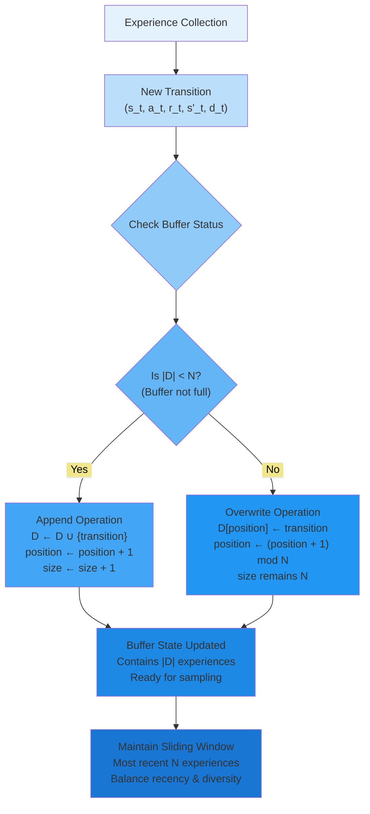
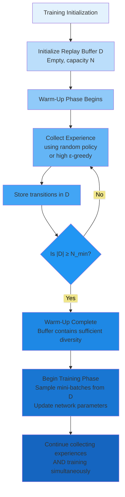
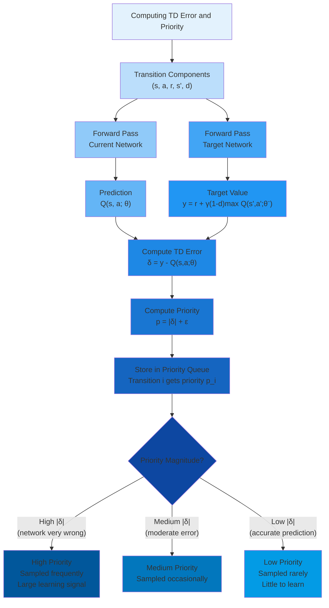
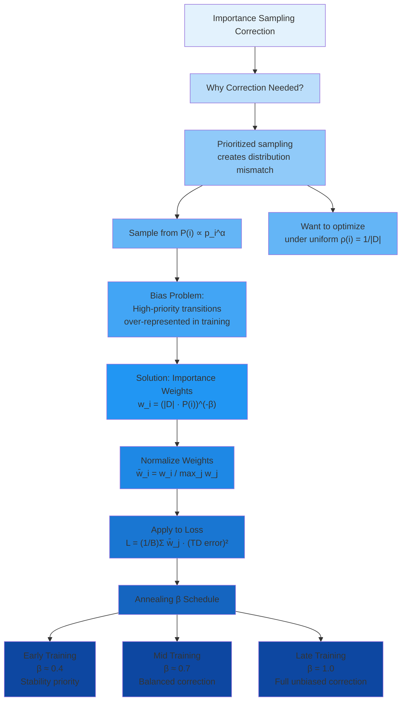
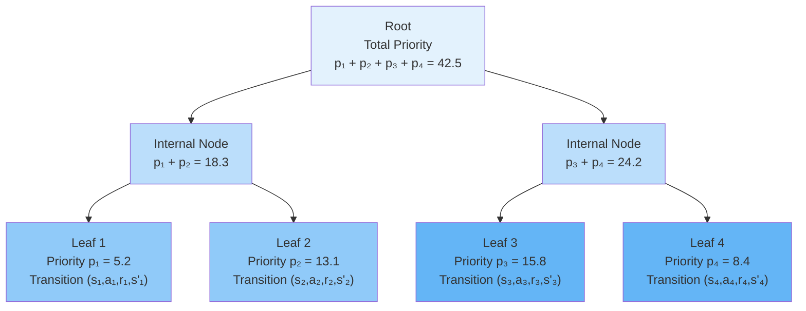
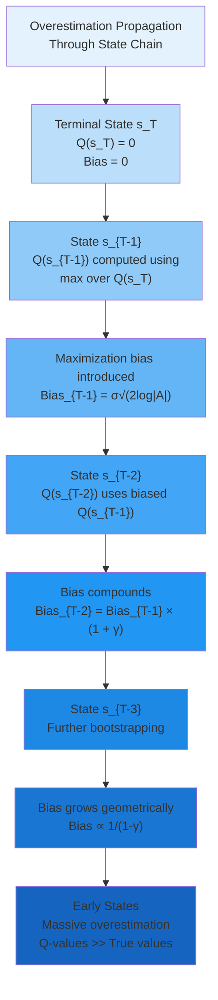
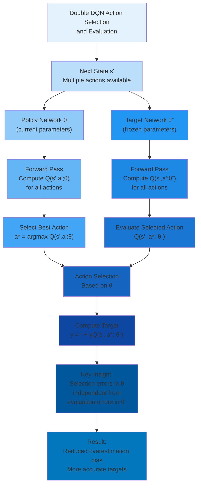

# C-5: Advanced DQN Techniques and Prioritized Experience Replay

1. Experience Replay Mechanisms

   - Uniform Experience Replay
   - Prioritized Experience Replay
   - Temporal Difference (TD) Error
   - Importance Sampling Weights
   - Priority Update Mechanisms

2. Double DQN: Addressing Overestimation Bias
   - The Maximization Bias Problem
   - Action Selection vs Action Evaluation
   - Mathematical Formulation of Double DQN
   - Comparison with Standard DQN

---

##### Experience Replay Mechanisms

While the basic DQN algorithm introduced experience replay and target networks to stabilize learning, practitioners
quickly discovered that uniform sampling from the replay buffer treats all experiences equally—a suboptimal strategy
when some transitions provide far more learning signal than others. Similarly, the standard Bellman update mechanism
systematically overestimates action values, leading to suboptimal policies and slower convergence.

This chapter explores two critical refinements that transform DQN from a functional algorithm into a highly effective
one: **Prioritized Experience Replay**, which intelligently samples experiences based on their learning potential, and
**Double DQN**, which eliminates the maximization bias inherent in Q-learning. Together, these techniques address
fundamental limitations in the original DQN formulation, significantly improving both sample efficiency and final policy
quality.

##### Uniform Experience Replay

###### The Motivation: Breaking Sequential Dependencies

In standard online reinforcement learning, the agent learns immediately from each experience and then discards it. This
creates a sequential learning process where the agent updates its policy based on $(s_t, a_t, r_t, s_{t+1})$, then
immediately encounters $(s_{t+1}, a_{t+1}, r_{t+1}, s_{t+2})$. The consecutive nature of these experiences creates three
fundamental problems that severely impede learning:

**Temporal Correlation**: Consecutive experiences share states, creating strong statistical dependencies. The transition
$(s_t, a_t, r_t, s_{t+1})$ and the subsequent transition $(s_{t+1}, a_{t+1}, r_{t+1}, s_{t+2})$ both involve state
$s_{t+1}$. When the network updates based on the first transition, it modifies its representation of $s_{t+1}$. The very
next update uses this same modified representation, creating a feedback loop where parameter updates are not
independent.

This correlation violates the fundamental assumption of stochastic gradient descent: training samples should be
independent and identically distributed (i.i.d.). When samples are correlated, gradient estimates have much higher
variance than theory predicts, and the optimization landscape becomes distorted.

**Non-Stationary Data Distribution**: As the policy improves through learning, the distribution of states the agent
visits changes dramatically. Consider traffic signal control: early in training with nearly random actions, the agent
experiences all possible queue configurations with roughly equal probability. After substantial learning, the agent
predominantly visits states along efficient trajectories—short queues, balanced flow, minimal waiting times.

The network must continuously adapt to this shifting target distribution rather than learning from a stable dataset.
This is fundamentally harder than supervised learning, where the training distribution is fixed. Each parameter update
becomes partially obsolete as the policy evolves and the state visitation distribution changes.

**Catastrophic Forgetting**: Neural networks are prone to catastrophic forgetting when learning sequentially from
non-i.i.d. data. When the agent explores a new region of state space and learns from many consecutive transitions in
that region, the network's parameters shift to fit these recent experiences. This adaptation can degrade performance in
previously mastered regions.

For traffic control, imagine the agent has learned good policies for moderate traffic (5-10 vehicles per approach) but
then encounters a sustained period of heavy traffic (15-20 vehicles per approach). Sequential learning from many
heavy-traffic transitions may cause the network to "forget" how to handle moderate traffic effectively, degrading
overall performance.

##### Replay Buffer Structure and Operations

The **replay buffer** $\mathcal{D}$ provides an elegant solution to these problems by decoupling experience collection
from learning. It stores transitions as they occur, allowing the agent to learn from randomly sampled mini-batches that
break temporal correlations:

$$
\mathcal{D} = {(s_i, a_i, r_i, s'*i, d_i)}*{i=1}^{|\mathcal{D}|}
$$

Each stored transition contains:

- **State** $s_i \in \mathbb{R}^{d_s}$: The environment configuration when the action was taken
- **Action** $a_i \in {0, 1, \ldots, |\mathcal{A}|-1}$: The discrete action executed
- **Reward** $r_i \in \mathbb{R}$: The immediate reward received
- **Next State** $s'_i \in \mathbb{R}^{d_s}$: The resulting environment configuration
- **Done Flag** $d_i \in {0, 1}$: Terminal state indicator (1 if episode ended)

**Circular Buffer Implementation**: The buffer operates with fixed capacity $N$ (typically $10^4$ to $10^6$ depending on
problem complexity and available memory). When the buffer reaches capacity, new experiences overwrite the oldest ones in
First-In-First-Out (FIFO) order:

The circular structure creates a **sliding window** over the agent's experience history. This balances two competing
objectives:

**Recency**: Recently collected experiences reflect the current policy's behavior and the current state distribution.
These are most relevant for improving the current policy.

**Diversity**: Older experiences, collected under different (typically worse) policies, provide diversity. They help the
network generalize across the state space and prevent overfitting to the current policy's narrow state distribution.

##### Uniform Sampling Procedure

During each training step, rather than using the most recent transition, we randomly sample a **mini-batch**
$\mathcal{B}$ of size $B$ (typically 32-256) from the replay buffer:

$$
\mathcal{B} = {(s_j, a_j, r_j, s'*j, d_j)}*{j=1}^{B}
$$

where each transition is sampled uniformly with probability:

$$
P(\text{selecting transition } i) = \frac{1}{|\mathcal{D}|} \quad \forall i \in {1, \ldots, |\mathcal{D}|}
$$

**Sampling Without Replacement**: Within a single mini-batch, we sample without replacement to ensure diversity—no
transition appears twice in the same batch. Across different mini-batches (different training steps), the same
transition can be sampled multiple times.

The training loss is computed over this randomly sampled mini-batch:

$$
\mathcal{L}(\theta) = \frac{1}{B}\sum_{j=1}^{B}\left[r_j + \gamma(1-d_j)\max_{a'} Q(s'_j, a'; \theta^-) - Q(s_j, a_j; \theta)\right]^2
$$

The term $(1-d_j)$ zeroes out the bootstrapped future value for terminal states, ensuring we don't add fictitious future
rewards when an episode has ended.

##### Benefits of Uniform Experience Replay

Experience replay provides multiple synergistic benefits that fundamentally improve learning stability and efficiency:

**Breaking Temporal Correlations**: Random sampling ensures that consecutive samples in a mini-batch come from different
episodes, different time steps, and often different policy versions (as the agent improves over time). This makes
samples approximately independent and identically distributed, satisfying the core assumption of stochastic gradient
descent.

**Mathematical Formulation**: Let $C(i,j)$ denote the correlation between transitions $i$ and $j$. For sequential
learning:

$$
C(t, t+1) = \text{Cov}(s_t, s_{t+1}) \gg 0
$$

For replay buffer sampling:

$$
C(i, j) \approx 0 \text{ for randomly sampled } i,j
$$

The correlation approaches zero because samples are drawn uniformly from a diverse set of experiences spanning many
episodes and time steps.

**Sample Efficiency Through Reuse**: In online learning, each transition is used for exactly one parameter update before
being discarded. With a replay buffer, each transition is used for multiple updates (potentially hundreds) before being
overwritten.

**Quantifying Reuse**: If the buffer size is $N = 100{,}000$ and we sample mini-batches of size $B = 64$ at each training step, then on average each transition is sampled:

$$
\mathbb{E}[\text{times sampled}] = \frac{B \cdot N}{N} = B = 64 \text{ times}
$$

before being overwritten by newer experiences. This provides a 64-fold improvement in sample efficiency compared to
online learning.

**Variance Reduction via Averaging**: The mini-batch loss averages over $B$ independent samples:

$$
\mathcal{L}(\theta) = \frac{1}{B}\sum_{j=1}^{B} \ell_j(\theta)
$$

By the central limit theorem, if individual losses $\ell_j$ have variance $\sigma^2$, the mini-batch loss has variance:

$$
\text{Var}[\mathcal{L}] = \frac{\sigma^2}{B}
$$

Larger mini-batches reduce gradient variance by factor $\sqrt{B}$, enabling larger learning rates and more stable
convergence. The gradient estimator becomes more reliable, pointing more consistently toward better parameters.

**Distributional Smoothing**: The replay buffer aggregates experiences from many policy versions as the agent learns.
Early in training, it contains mostly random exploratory experiences. As training progresses, better trajectories gradually replace poor ones. At any given time, the buffer represents a mixture distribution:

$$
\rho_{\mathcal{D}}(s,a) = \sum_{k=0}^{K} w_k \rho_{\pi_k}(s,a)
$$

where $\rho_{\pi_k}$ is the state-action visitation distribution under policy version $\pi_k$, and weights $w_k$ depend
on how many transitions from each policy remain in the buffer. This smoothed distribution is more stable than the
current policy's rapidly changing distribution, providing a steadier learning signal.

##### Buffer Size Selection: Theory and Practice

The replay buffer size $N$ is a critical hyperparameter that balances several competing factors:

**Small Buffer** ($N \sim 10^4$):

- **Advantages**:
  - Low memory footprint (important for resource-constrained systems)
  - Fast sampling operations (linear search over fewer items)
  - High recency—mostly contains transitions from current or recent policies
- **Disadvantages**:
  - Limited diversity—narrow coverage of state space
  - High correlation—recent experiences still somewhat related
  - Recency bias—may overfit to current policy's distribution

**Medium Buffer** ($N \sim 10^5$):

- **Advantages**:
  - Good balance of recency and diversity
  - Sufficient decorrelation for most problems
  - Reasonable memory requirements (few hundred MB to few GB)
  - Suitable for traffic control and similar applications
- **Disadvantages**:
  - May be insufficient for very large state spaces
  - Still discards potentially useful old experiences

**Large Buffer** ($N \sim 10^6$):

- **Advantages**:
  - Maximum diversity—comprehensive state space coverage
  - Very low correlation between samples
  - Retains useful experiences from early learning
- **Disadvantages**:
  - High memory usage (tens of GB)
  - Slower sampling (especially for prioritized variants)
  - May contain many obsolete transitions from very poor early policies

**Practical Guidelines by Problem Complexity**:

| Problem Type                         | State Dim           | Action Space | Recommended $N$ |
| ------------------------------------ | ------------------- | ------------ | --------------- |
| Simple (CartPole, basic gridworld)   | $d_s < 10$          | $            | \mathcal{A}     |
| Moderate (Traffic control, robotics) | $10 \leq d_s < 100$ | $5 \leq      | \mathcal{A}     |
| Complex (Atari games, high-dim)      | $d_s \geq 100$      | $            | \mathcal{A}     |

**Buffer-to-Batch Ratio**: A useful heuristic is that the buffer should hold at least 1000× the mini-batch size:

$$
N \geq 1000 \cdot B
$$

This ensures sufficient diversity—a mini-batch samples only a tiny fraction ($B/N \leq 0.1%$) of available experiences,
providing good decorrelation.

##### Warm-Up Period: Initial Buffer Population

An often-overlooked implementation detail is the **warm-up period** or **pre-filling phase**. Training should not begin
until the replay buffer contains sufficient diverse experiences.

**Minimum Buffer Threshold**: Define a minimum size $N_{\text{min}}$ (typically $N_{\text{min}} = 10{,}000$ or $N_{\text{min}} = 0.1N$):

$$
\text{Training begins only when } |\mathcal{D}| \geq N_{\text{min}}
$$

During warm-up, the agent collects experiences (often using purely random actions for maximum exploration) without performing any network updates. This ensures:

**Sufficient Diversity**: Initial mini-batches contain diverse experiences rather than a few highly correlated
trajectories.

**Stable Initial Gradients**: Early gradient estimates are computed from adequately large samples, preventing erratic
initial updates.

**Better Initialization**: The first parameter updates are informed by a representative sample of the state-action space
rather than a narrow slice.

**Warm-Up Strategy**: Common approaches include:

- **Random policy**: Pure random actions for first $N_{\text{min}}$ steps
- **High epsilon**: $\varepsilon = 1.0$ during warm-up, gradually decrease afterward
- **Demonstration data**: Pre-fill buffer with expert demonstrations if available

##### Limitations of Uniform Sampling

Despite its effectiveness, uniform experience replay treats all transitions equally—an assumption that becomes
problematic upon closer examination:

**Not All Experiences Are Equally Valuable**: Consider two transitions from traffic signal control:

**Transition 1**: Routine situation with moderate queues ($q_{\text{NS}} = 5$, $q_{\text{EW}} = 4$). Agent maintains
current phase, receives $r = -9$. The network's prediction is $Q = -9.2$, very close to target. TD error:
$\delta = 0.2$.

**Transition 2**: Rare accident scenario with heavy queue buildup ($q_{\text{NS}} = 18$, $q_{\text{EW}} = 3$). Agent
switches phase inappropriately, receives $r = -45$. Network's prediction is $Q = -15$ (severe underestimation). TD
error: $\delta = -30$.

Uniform sampling treats both equally, despite Transition 2 providing far more learning signal (the network is very wrong
and needs correction) and being more important (rare critical event).

**Slow Learning from Rare Events**: Important but infrequent experiences (accidents, emergency vehicles, equipment
failures) may be sampled too rarely to significantly impact learning. With buffer size $N = 100{,}000$ and mini-batch
size $B = 64$, a single rare experience has probability:

$$
P(\text{rare event in mini-batch}) = 1 - \left(1 - \frac{1}{N}\right)^B \approx \frac{B}{N} = 0.064%
$$

This rare event might be sampled only a few times before being overwritten, insufficient for the network to learn
appropriate responses.

**Computational Waste on Well-Predicted Transitions**: Many transitions, especially later in training, have very small
TD errors—the network already predicts them accurately. Sampling these provides negligible learning signal while
consuming computational resources (forward passes, gradient computation).

These limitations motivate **Prioritized Experience Replay**, which intelligently focuses learning on the most
informative experiences.

---

#### Prioritized Experience Replay

##### The Core Principle: Learning from Surprise

Prioritized Experience Replay (PER), introduced by Schaul et al. (2016), embodies a simple but powerful insight: **the
agent should learn more from experiences it currently misunderstands**. The degree of misunderstanding is quantified by
the **temporal difference error** magnitude $|\delta|$—large errors indicate surprise, suggesting the transition
contains significant information the network hasn't yet incorporated.

**Fundamental Motivation**: In supervised learning, active learning strategies preferentially train on examples where
the model is most uncertain or makes the largest errors. This accelerates learning by focusing computational resources
where they provide maximum benefit. PER brings this principle to reinforcement learning.

**Mathematical Formulation**: Instead of uniform sampling probability:

$$
P_{\text{uniform}}(i) = \frac{1}{|\mathcal{D}|}
$$

PER assigns each transition $i$ a **priority** $p_i > 0$ and samples proportionally:

$$
P(i) = \frac{p_i^\alpha}{\sum_{k=1}^{|\mathcal{D}|} p_k^\alpha}
$$

The exponent $\alpha \in [0, 1]$ controls the degree of prioritization:

- $\alpha = 0$: Uniform sampling (no prioritization), $P(i) = \frac{1}{|\mathcal{D}|}$
- $\alpha = 1$: Full prioritization proportional to $p_i$
- $\alpha \in (0,1)$: Interpolates between uniform and full prioritization

**Intuitive Interpretation**: Transitions where the network's predictions are poor (high TD error) receive higher
priority and are sampled more frequently. As the network learns and predictions improve for those transitions, their
priorities decrease and sampling shifts to other high-error transitions. This creates a dynamic curriculum where the
agent automatically focuses on its weakest areas.

##### Priority Assignment Mechanisms

The priority $p_i$ must capture the "learning value" of transition $i$. Two primary approaches exist:

**Proportional Prioritization**: Set priority directly based on TD error magnitude:

$$
p_i = |\delta_i| + \epsilon
$$

where:

- $\delta_i = r_i + \gamma \max_{a'} Q(s'_i, a'; \theta^-) - Q(s_i, a_i; \theta)$ is the TD error
- $\epsilon > 0$ is a small constant (typically $\epsilon = 10^{-6}$ to $10^{-4}$) ensuring all transitions have
  non-zero probability

The additive $\epsilon$ serves two purposes:

1. **Guarantees exploration**: Every transition can be sampled, even those with zero TD error
2. **Numerical stability**: Prevents division by zero in probability calculations

**Why TD Error Magnitude?** The TD error directly measures prediction error. If $|\delta_i|$ is large, the network's
current parameters produce a Q-value far from the Bellman target, indicating the network hasn't learned this transition
well. Learning from high-$|\delta|$ transitions provides large gradients that significantly improve the network.

**Rank-Based Prioritization**: Sort all transitions by $|\delta_i|$ in descending order and assign priority based on rank:

$$
p_i = \frac{1}{\text{rank}(i)}
$$

where $\text{rank}(i) \in {1, 2, \ldots, |\mathcal{D}|}$ is the position of transition $i$ when sorted by decreasing $|\delta|$.

**Advantages of Rank-Based**:

- **Robustness to outliers**: A single extremely large TD error doesn't dominate sampling
- **Stability**: Priorities change only when relative rankings change, not when absolute errors fluctuate
- **Insensitivity to reward scale**: The prioritization depends only on ordering, not magnitudes

**Disadvantages of Rank-Based**:

- **Computational cost**: Requires maintaining sorted order, typically $O(N \log N)$ to recompute
- **Granularity loss**: Transitions with similar but distinct TD errors receive identical priority if adjacent in rank

**Practical Choice**: Proportional prioritization is more common due to implementation simplicity, though rank-based can
be preferable when reward scales vary dramatically or outliers are common.

##### Temporal Difference (TD) Error as Priority

The TD error serves dual roles in DQN with prioritized replay: it drives learning through gradient descent AND
determines sampling priorities.

**Definition and Computation**: For transition $(s, a, r, s', d)$, the TD error is:

$$
\delta = r + \gamma(1-d)\max_{a'} Q(s', a'; \theta^-) - Q(s, a; \theta)
$$

**Decomposition**:

- **Target**: $y = r + \gamma(1-d)\max_{a'} Q(s', a'; \theta^-)$ represents the "true" value according to the Bellman
  equation
- **Prediction**: $Q(s, a; \theta)$ is the network's current estimate
- **Error**: $\delta = y - Q(s,a;\theta)$ measures the discrepancy

**Sign Interpretation**:

- $\delta > 0$: **Underestimation** — The realized return exceeded expectations. The network should increase $Q(s,a)$.
- $\delta < 0$: **Overestimation** — The realized return fell short. The network should decrease $Q(s,a)$.
- $\delta \approx 0$: **Accurate prediction** — Little learning needed for this transition.

**Magnitude Interpretation**: The absolute value $|\delta|$ quantifies learning opportunity:

- $|\delta| \gg 0$: Large error indicates the network is very wrong about this transition. High priority for learning.
- $|\delta| \approx 0$: Small error indicates accurate prediction. Low priority—resources better spent elsewhere.

**Example Calculation**: Consider a traffic transition:

- **Current state**: $s = [q_{\text{NS}}=8, q_{\text{EW}}=3, \phi=\text{NS}, \tau=25]$
- **Action**: Maintain NS phase
- **Reward**: $r = -11$ (negative sum of queue lengths)
- **Next state**: $s' = [q_{\text{NS}}=6, q_{\text{EW}}=4, \phi=\text{NS}, \tau=30]$
- **Current Q-value**: $Q(s, \text{maintain}; \theta) = -45$
- **Target network's best next Q**: $\max_{a'} Q(s', a'; \theta^-) = -38$

Compute TD error:

$$
\delta = -11 + 0.9(-38) - (-45) = -11 - 34.2 + 45 = -0.2
$$

The small magnitude $|\delta| = 0.2$ indicates good prediction—low priority.

Compare with an accident scenario:

- **Reward**: $r = -120$ (severe congestion)
- **Current Q-value**: $Q(s_{\text{accident}}, a; \theta) = -50$ (network underestimated severity)
- **Target network**: $\max_{a'} Q(s'_{\text{accident}}, a'; \theta^-) = -95$

TD error:

$$
\delta = -120 + 0.9(-95) - (-50) = -120 - 85.5 + 50 = -155.5
$$

The large magnitude $|\delta| = 155.5$ signals huge misprediction—very high priority for learning.

##### Temporal Evolution of TD Errors

TD errors evolve systematically as training progresses, reflecting the network's learning trajectory:

**Early Training** (Episodes 1-100):

- **Characteristics**: Q-values far from true values; random initialization means predictions are essentially noise
- **TD Errors**: Large magnitude, high variance across transitions: $|\delta| \in [10, 100]$ typical
- **Priority Distribution**: Relatively uniform—most transitions have large errors
- **Learning Dynamics**: Rapid Q-value changes; priorities fluctuate significantly

**Mid Training** (Episodes 100-500):

- **Characteristics**: Q-values converging toward true values; network learned basic patterns
- **TD Errors**: Decreasing magnitude, lower variance: $|\delta| \in [1, 20]$
- **Priority Distribution**: More concentrated—some transitions well-learned (low $|\delta|$), others still challenging
- **Learning Dynamics**: Priorities stabilize; clear distinction between easy and hard transitions emerges

**Late Training** (Episodes 500+):

- **Characteristics**: Q-values near optimal; policy mostly converged
- **TD Errors**: Small magnitude on most transitions: $|\delta| < 5$, with occasional spikes for rare events
- **Priority Distribution**: Highly skewed—most transitions have low priority, few high-priority outliers
- **Learning Dynamics**: Focus shifts almost entirely to rare/difficult cases

**Theoretical Analysis**: Under mild assumptions, the expected TD error decreases as:

$$
\mathbb{E}[|\delta_t|] \leq \gamma^t |\delta_0| + \frac{C}{t}
$$

where the first term reflects geometric decay from temporal credit assignment and the second term captures residual
approximation error. This guarantees TD errors shrink as learning progresses.

---

#### Importance Sampling Weights

##### The Bias Problem in Prioritized Sampling

Prioritized sampling introduces a fundamental problem: we're learning from a biased distribution. The true goal is to
minimize loss under the data distribution induced by the agent's policy:

$$
\mathcal{L}(\theta) = \mathbb{E}*{(s,a,r,s') \sim \rho*{\pi}}[(\text{TD error})^2]
$$

where $\rho_\pi$ is the state-action visitation frequency under policy $\pi$.

However, prioritized replay samples according to a different distribution:

$$
\text{Samples drawn from } P(i) = \frac{p_i^\alpha}{\sum_k p_k^\alpha}
$$

This creates **sampling bias**: we're optimizing the loss under $P$, not under $\rho_\pi$. High-priority transitions are
over-represented, potentially causing the network to overfit to them and neglect other regions of state space.

**Mathematical Formulation of Bias**: The expected gradient under prioritized sampling differs from the true gradient:

$$\mathbb{E}*{i \sim P}[\nabla*\theta \mathcal{L}*i] \neq \mathbb{E}*{i \sim \rho_\pi}[\nabla_\theta \mathcal{L}_i]$$

This bias can prevent convergence to the optimal policy—the network minimizes the wrong objective function.

##### Importance Sampling Correction

**Importance sampling** is a statistical technique that corrects for sampling from the wrong distribution. The key idea:
when we sample transition $i$ from distribution $P$ but want to compute expectations under distribution $\rho$, we
weight the sample by the **importance weight**:

$$w_i = \frac{\rho(i)}{P(i)}$$

This ratio corrects the over- or under-representation of transition $i$.

**Derivation**: The expectation under target distribution $\rho$ can be rewritten as:

$$\mathbb{E}*{i \sim \rho}[f(i)] = \sum_i \rho(i) f(i) = \sum_i P(i) \frac{\rho(i)}{P(i)} f(i) = \mathbb{E}*{i \sim P}\left[w_i f(i)\right]$$

By weighting samples from $P$ with $w_i = \frac{\rho(i)}{P(i)}$, we recover unbiased estimates of expectations under
$\rho$.

**Application to Prioritized Replay**: In uniform replay, every transition has equal probability
$\rho(i) = \frac{1}{|\mathcal{D}|}$. Under prioritized sampling:

$$P(i) = \frac{p_i^\alpha}{\sum_k p_k^\alpha}$$

The importance weight becomes:

$$w_i = \frac{1/|\mathcal{D}|}{p_i^\alpha / \sum_k p_k^\alpha} = \frac{\sum_k p_k^\alpha}{|\mathcal{D}| \cdot p_i^\alpha}$$

**Introducing the Correction Exponent**: We don't necessarily want full bias correction, especially early in training
when priorities are noisy. Introduce exponent $\beta \in [0,1]$:

$$w_i = \left(\frac{1}{|\mathcal{D}|} \cdot \frac{1}{P(i)}\right)^\beta = \left(\frac{1}{|\mathcal{D}| \cdot P(i)}\right)^\beta$$

Substituting $P(i)$:

$$w_i = \left(|\mathcal{D}| \cdot \frac{p_i^\alpha}{\sum_k p_k^\alpha}\right)^{-\beta}$$

**Interpretation of β**:

- $\beta = 0$: No correction, $w_i = 1$ for all $i$ (biased but stable)
- $\beta = 1$: Full correction, unbiased gradient estimates (higher variance)
- $\beta \in (0,1)$: Partial correction, trading off bias and variance

**Normalized Importance Weights**: To maintain numerical stability and prevent any single transition from dominating
updates, we normalize weights by their maximum value in the mini-batch:

$$\bar{w}_i = \frac{w_i}{\max_j w_j}$$

This ensures $\bar{w}_i \in (0, 1]$ for all transitions in the mini-batch. The highest-priority transition (smallest
$w_i$) gets weight 1, while lower-priority transitions (larger $w_i$) get proportionally smaller weights.

**Modified Loss Function**: The corrected loss for a mini-batch becomes:

$$\mathcal{L}(\theta) = \frac{1}{B}\sum_{j=1}^{B} \bar{w}*j \cdot \left[r_j + \gamma(1-d_j)\max*{a'} Q(s'_j, a'; \theta^-) - Q(s_j, a_j; \theta)\right]^2$$

Each transition's contribution to the loss is scaled by its importance weight, compensating for prioritized sampling
bias.

##### Annealing Schedule for β

Bias correction is most critical near convergence when small biases can prevent reaching the optimal solution. Early in
training, priorities are noisy (based on poor Q-value estimates) and high variance from importance sampling is more
problematic than bias.

**Annealing Strategy**: Gradually increase $\beta$ from an initial value $\beta_0$ (typically 0.4) to 1.0 over training:

$$\beta_t = \min\left(1.0, \beta_0 + t \cdot \frac{1.0 - \beta_0}{T}\right)$$

where $t$ is the current training step and $T$ is the total number of training steps.

**Rationale**:

**Early Training** ($\beta \approx 0.4$):

- Priorities are unreliable (based on random Q-values)
- Network is far from convergence—small biases don't matter
- Low variance more important than unbiased estimates
- Partial correction provides stability while reducing worst bias

**Mid Training** ($\beta \approx 0.7$):

- Priorities becoming more reliable
- Q-values improving, bias more meaningful
- Gradually increasing correction as priorities stabilize

**Late Training** ($\beta = 1.0$):

- Priorities based on accurate Q-values
- Near convergence—bias could prevent reaching optimum
- Full correction ensures unbiased convergence
- Network is stable enough to handle higher variance

##### Worked Example: Computing Importance Weights

Consider a mini-batch of 4 transitions sampled from a replay buffer with $|\mathcal{D}| = 10{,}000$:

**Transition Priorities**:

- Transition 1: $p_1 = 5.2$ (moderate TD error)
- Transition 2: $p_2 = 0.3$ (small TD error, well-predicted)
- Transition 3: $p_3 = 15.8$ (large TD error, misprediction)
- Transition 4: $p_4 = 2.1$ (moderate TD error)

**Hyperparameters**: $\alpha = 0.6$ (prioritization), $\beta = 0.8$ (correction), $\epsilon = 0.01$ (small constant
already included in $p_i$)

**Step 1: Compute Total Priority Mass**

Sum of all priorities raised to power $\alpha$: $$\sum_{k=1}^{|\mathcal{D}|} p_k^\alpha$$

For this example, assume this sum equals $S = 25{,}000$ (computed over entire buffer).

**Step 2: Compute Sampling Probabilities**

For each transition in the mini-batch:

$$P(1) = \frac{p_1^\alpha}{S} = \frac{5.2^{0.6}}{25000} = \frac{2.765}{25000} = 1.106 \times 10^{-4}$$

$$P(2) = \frac{p_2^\alpha}{S} = \frac{0.3^{0.6}}{25000} = \frac{0.455}{25000} = 1.820 \times 10^{-5}$$

$$P(3) = \frac{p_3^\alpha}{S} = \frac{15.8^{0.6}}{25000} = \frac{5.218}{25000} = 2.087 \times 10^{-4}$$

$$P(4) = \frac{p_4^\alpha}{S} = \frac{2.1^{0.6}}{25000} = \frac{1.456}{25000} = 5.824 \times 10^{-5}$$

**Step 3: Compute Raw Importance Weights**

$$w_i = \left(|\mathcal{D}| \cdot P(i)\right)^{-\beta} = (10000 \cdot P(i))^{-0.8}$$

For transition 1: $$w_1 = (10000 \times 1.106 \times 10^{-4})^{-0.8} = (1.106)^{-0.8} = 0.933$$

For transition 2: $$w_2 = (10000 \times 1.820 \times 10^{-5})^{-0.8} = (0.182)^{-0.8} = 3.625$$

For transition 3: $$w_3 = (10000 \times 2.087 \times 10^{-4})^{-0.8} = (2.087)^{-0.8} = 0.542$$

For transition 4: $$w_4 = (10000 \times 5.824 \times 10^{-5})^{-0.8} = (0.582)^{-0.8} = 1.589$$

**Step 4: Normalize by Maximum**

Find maximum weight: $\max_j w_j = w_2 = 3.625$

Normalized weights: $$\bar{w}_1 = \frac{0.933}{3.625} = 0.257$$

$$\bar{w}_2 = \frac{3.625}{3.625} = 1.000$$

$$\bar{w}_3 = \frac{0.542}{3.625} = 0.150$$

$$\bar{w}_4 = \frac{1.589}{3.625} = 0.438$$

**Interpretation**:

- **Transition 3** (highest priority, largest TD error): Gets smallest weight (0.150) because it was over-sampled. Its
  gradient contribution is down-weighted to compensate.
- **Transition 2** (lowest priority, smallest TD error): Gets largest weight (1.000) because it was under-sampled. Its
  gradient contribution is up-weighted to compensate.
- **Transitions 1, 4** (medium priority): Get intermediate weights.

**Step 5: Apply to Loss**

Suppose TD errors for the mini-batch are:

- $\delta_1 = -3.2$
- $\delta_2 = 0.5$ (small, as expected from low priority)
- $\delta_3 = -12.7$ (large, as expected from high priority)
- $\delta_4 = 4.1$

Weighted loss:
$$\mathcal{L}(\theta) = \frac{1}{4}\left[\bar{w}_1 \delta_1^2 + \bar{w}_2 \delta_2^2 + \bar{w}_3 \delta_3^2 + \bar{w}_4 \delta_4^2\right]$$

$$= \frac{1}{4}\left[0.257(10.24) + 1.000(0.25) + 0.150(161.29) + 0.438(16.81)\right]$$

$$= \frac{1}{4}\left[2.632 + 0.250 + 24.194 + 7.363\right] = \frac{34.439}{4} = 8.610$$

Without importance weights (uniform $w_i = 1$):
$$\mathcal{L}_{\text{no correction}} = \frac{1}{4}(10.24 + 0.25 + 161.29 + 16.81) = 47.148$$

The importance weights reduced the effective loss by emphasizing the under-sampled transition 2 and de-emphasizing the
over-sampled transition 3, providing a less biased gradient estimate.

---

#### Priority Update Mechanisms

##### When and How to Update Priorities

Priorities must be updated as the agent learns and Q-value predictions improve. Transitions that initially had large TD
errors (high priority) should have their priorities reduced as the network learns to predict them accurately.
Conversely, transitions that become harder to predict should have priorities increased.

**Update Timing Options**:

**After Sampling (Online Update)**:

- **Procedure**: Immediately after using a transition in a mini-batch for training, recompute its TD error with updated
  network parameters and update its priority
- **Advantages**: Priorities reflect the network's current understanding; most accurate priority estimates
- **Disadvantages**: Requires additional forward passes through the network (computational cost); priorities updated
  only for sampled transitions

**Before Update (Lazy Update)**:

- **Procedure**: When sampling a transition, compute its TD error using current network parameters (this happens anyway
  for the loss computation). After the parameter update, use these pre-update TD errors to update priorities
- **Advantages**: No extra forward passes needed; computationally efficient
- **Disadvantages**: Priorities slightly stale (based on pre-update network); small bias in priority estimates

**Periodic Batch Update**:

- **Procedure**: Every $K$ training steps (e.g., $K = 1000$), perform a full sweep through the replay buffer,
  recomputing TD errors and updating all priorities
- **Advantages**: All priorities updated simultaneously; can use efficient batched operations
- **Disadvantages**: Computationally expensive for large buffers; priorities very stale between updates; complex
  implementation

**Practical Choice**: **Lazy update** (using pre-update TD errors) provides the best trade-off between accuracy and
computational cost for most applications. The slight staleness in priorities has minimal impact on learning while
avoiding expensive recomputation.

##### Priority Update Procedure

**For Sampled Transitions**:

When transition $i$ is sampled and used for training:

**Step 1**: Compute TD error during loss calculation:
$$\delta_i = r_i + \gamma(1-d_i)\max_{a'} Q(s'_i, a'; \theta^-) - Q(s_i, a_i; \theta)$$

**Step 2**: Update network parameters: $$\theta \leftarrow \theta - \alpha \nabla_\theta \mathcal{L}(\theta)$$

**Step 3**: Update transition's priority using pre-update TD error: $$p_i \leftarrow |\delta_i| + \epsilon$$

**Step 4**: Update priority in data structure (sum-tree or similar):

- Propagate change from leaf to root in $O(\log N)$ time

**For Newly Added Transitions**:

When a new transition is added to the replay buffer from environment interaction, we must assign it an initial priority
without having trained on it yet.

**Maximum Priority Initialization**: $$p_{\text{new}} = \max_{j \in \mathcal{D}} p_j$$

**Rationale**: Assigning maximum priority ensures the new transition will be sampled at least once soon, allowing the
network to learn from it and compute an accurate TD error. This prevents potentially important new experiences from
being neglected.

**Alternative**: Compute TD error immediately upon storage:
$$\delta_{\text{new}} = r + \gamma(1-d)\max_{a'} Q(s', a'; \theta^-) - Q(s, a; \theta)$$
$$p_{\text{new}} = |\delta_{\text{new}}| + \epsilon$$

This is more accurate but requires an extra forward pass for every environment step.

##### Efficient Priority Data Structures

Naive prioritized sampling requires $O(N)$ time to compute cumulative probabilities and sample. For large buffers
($N = 10^6$), this is prohibitively expensive. Efficient implementations use a **sum-tree** data structure.

**Sum-Tree Structure**: A binary tree where:

- **Leaves** store individual priorities: $p_1, p_2, \ldots, p_N$
- **Internal nodes** store the sum of their children's values
- **Root** stores total priority: $\sum_{i=1}^{N} p_i$

**Sampling Algorithm** (O(log N) time):

**Input**: Random value $v \sim \text{Uniform}(0, \sum_i p_i)$

**Procedure**:

1. Start at root node
2. While not at a leaf:
   - If $v \leq \text{left\_child.value}$: Go left
   - Else: $v \leftarrow v - \text{left\_child.value}$, go right
3. Return the transition at the leaf

**Example**: Sample from the tree above with $v = 25.0$

- At root: $v = 25.0 > 18.3$ (left child sum), go right, $v \leftarrow 25.0 - 18.3 = 6.7$
- At right internal node: $v = 6.7 \leq 15.8$ (left child), go left
- Reach leaf 3 with priority $p_3 = 15.8$

The probability of selecting leaf 3 is indeed:
$$P(3) = \frac{p_3^\alpha}{\sum_k p_k^\alpha} \approx \frac{15.8}{42.5} = 0.372$$

**Update Algorithm** (O(log N) time):

When priority $p_i$ changes to $p_i'$:

1. Update leaf node: $p_i \leftarrow p_i'$
2. Propagate change up the tree: For each ancestor, recompute sum of children
3. Requires visiting $O(\log N)$ nodes (tree height)

**Comparison of Complexities**:

| Operation           | Naive  | Sum-Tree    |
| ------------------- | ------ | ----------- |
| **Sample**          | $O(N)$ | $O(\log N)$ |
| **Update Priority** | $O(1)$ | $O(\log N)$ |
| **Memory**          | $O(N)$ | $O(N)$      |

For $N = 10^6$:

- Naive sampling: $10^6$ operations
- Sum-tree sampling: $\log_2(10^6) \approx 20$ operations

The sum-tree provides a $50{,}000×$ speedup for sampling!

##### Priority Distribution Evolution

As training progresses, the distribution of priorities evolves systematically, reflecting the network's learning
progress:

**Early Training** (Episodes 1-100):

- **Distribution**: Relatively uniform—most transitions have large TD errors
- **Mean Priority**: High, $\mathbb{E}[p_i] \approx 20-50$ for normalized rewards
- **Variance**: High—noisy Q-values produce variable errors
- **Sampling**: Nearly uniform (priorities similar) despite prioritization mechanism

**Mid Training** (Episodes 100-500):

- **Distribution**: Becoming skewed—clear separation between well-learned and challenging transitions
- **Mean Priority**: Decreasing, $\mathbb{E}[p_i] \approx 5-15$
- **Variance**: Moderate—some consistent high-priority outliers emerge
- **Sampling**: Focused on moderate-to-high error transitions; low-error transitions rarely sampled

**Late Training** (Episodes 500+):

- **Distribution**: Highly skewed—most transitions have very low priority, few high-priority outliers
- **Mean Priority**: Low, $\mathbb{E}[p_i] < 5$
- **Variance**: Low mean but heavy tail—rare events and edge cases remain high priority
- **Sampling**: Almost exclusively from small set of challenging transitions

**Visualizing Priority Distribution**:

Imagine plotting priority histogram at different training stages:

**Episode 50**: Bell-curve shape centered at $p = 30$, range $[10, 60]$

**Episode 200**: Right-skewed distribution, mode at $p = 8$, long tail to $p = 40$

**Episode 800**: Extreme right-skew, mode at $p = 2$, 90% of mass below $p = 5$, but occasional spikes at $p = 50+$ for
rare critical events

This evolution is exactly what we want: as the network masters routine situations, attention shifts to remaining
challenges and rare but important events.

##### Handling Priority Clipping and Numerical Stability

Very large priorities (from catastrophic mispredictions) or very small priorities (from near-perfect predictions) can
cause numerical issues:

**Maximum Priority Clipping**: $$p_i \leftarrow \min(p_i, p_{\max})$$

where $p_{\max}$ is a reasonable upper bound (e.g., $p_{\max} = 100$ for normalized rewards). This prevents a single
outlier from dominating sampling probability.

**Minimum Priority Floor**: $$p_i \leftarrow \max(p_i, \epsilon)$$

The constant $\epsilon$ (typically $10^{-6}$ to $10^{-4}$) ensures all transitions remain discoverable, even those with
zero TD error.

**Logarithmic Priority Transformation**:

For extremely large error ranges, consider log-priority: $$p_i = \log(|\delta_i| + 1) + \epsilon$$

This compresses the priority range, preventing extreme outliers while preserving relative ordering.

**Practical Recommendations**:

- Use additive $\epsilon = 10^{-4}$ for minimum priority
- Clip maximum to $p_{\max} = 100$ (for rewards normalized to $[-10, 10]$)
- Monitor priority distribution—if 99% of samples come from <1% of buffer, reduce $\alpha$ or increase $\epsilon$

---

## Double DQN: Addressing Overestimation Bias

#### The Maximization Bias Problem

##### Origins of Systematic Overestimation

Standard DQN exhibits a pervasive and systematic overestimation of action values due to the maximization operator in the
Bellman target. This bias is not merely a minor technical issue—it fundamentally distorts the learned Q-function,
leading to suboptimal policies and slower convergence.

**The Root Cause**: Consider the target computation in standard DQN:

$$y = r + \gamma \max_{a'} Q(s', a'; \theta^-)$$

The max operator selects the action with the highest Q-value estimate. Crucially, these Q-values are **estimates**—they
contain both the true value and estimation error:

$$Q(s', a'; \theta^-) = Q^*(s', a') + \epsilon_a$$

where $Q^*(s', a')$ is the true optimal value and $\epsilon_a$ is the estimation error for action $a$. If errors are
unbiased, $\mathbb{E}[\epsilon_a] = 0$, but errors across actions are not equal—they vary randomly.

**The Maximization Creates Positive Bias**: The max operator preferentially selects actions whose estimation error
happens to be positive (overestimated):

$$\max_{a'} Q(s', a'; \theta^-) = \max_{a'} [Q^*(s', a') + \epsilon_a] \geq \max_{a'} Q^*(s', a')$$

The inequality is strict whenever any error $\epsilon_a > 0$, which occurs with probability approaching 1 as the number
of actions increases.

**Mathematical Proof of Overestimation**: Suppose $Q^*$ is the true Q-function and $Q$ is an estimate with independent
zero-mean noise:

$$Q(s', a') = Q^*(s', a') + \epsilon_a, \quad \epsilon_a \sim \mathcal{N}(0, \sigma^2)$$

The expected value under the max operation is:

$$\mathbb{E}\left[\max_{a'} Q(s', a')\right] = \mathbb{E}\left[\max_{a'} (Q^*(s', a') + \epsilon_a)\right]$$

By Jensen's inequality (since max is a convex function):

$$\mathbb{E}\left[\max_{a'} (Q^*(s', a') + \epsilon_a)\right] > \max_{a'} \mathbb{E}[Q^*(s', a') + \epsilon_a] = \max_{a'} Q^*(s', a')$$

The expected maximum exceeds the maximum of expectations, creating systematic positive bias.

**Quantifying the Bias**: For $|\ mathcal{A}|$ actions with i.i.d. Gaussian noise $\mathcal{N}(0, \sigma^2)$:

$$\text{Bias} = \mathbb{E}\left[\max_{a'} \epsilon_a\right] \approx \sigma \sqrt{2\log|\mathcal{A}|}$$

The bias grows with:

- **Number of actions**: More actions → more opportunities to select overestimated values
- **Estimation noise**: Larger $\sigma$ → larger typical errors to select from

For $|\mathcal{A}| = 10$ actions and $\sigma = 5$:
$$\text{Bias} \approx 5\sqrt{2\log 10} \approx 5 \times 2.15 \approx 10.75$$

The systematic overestimation can be substantial!

##### Accumulation Through Bootstrapping

The maximization bias compounds because Q-learning uses **bootstrapping**—Q-value estimates are updated using other
Q-value estimates. Overestimation in one state propagates backward to predecessor states through the Bellman update.

**Feedback Loop**:

1. $Q(s', a')$ overestimates the true value due to maximization bias
2. This overestimated value becomes the target for updating $Q(s, a)$:
   $$Q(s,a) \leftarrow Q(s,a) + \alpha[r + \gamma \max_{a'} Q(s',a') - Q(s,a)]$$
3. The inflated target causes $Q(s, a)$ to also overestimate
4. This overestimation propagates further backward to states leading to $s$

**Mathematical Analysis of Accumulation**: Consider a chain of states $s_0 \to s_1 \to s_2 \to \cdots \to s_T$ (goal).
Let $\text{Bias}_t$ denote the overestimation at state $s_t$.

At the goal: $\text{Bias}_T = 0$ (terminal states have no bootstrapping)

Working backward:
$$\text{Bias}*{T-1} = \mathbb{E}\left[\max*{a'} \epsilon_{a'}\right] \approx \sigma\sqrt{2\log|\mathcal{A}|}$$

$$\text{Bias}*{T-2} = \sigma\sqrt{2\log|\mathcal{A}|} + \gamma \cdot \text{Bias}*{T-1}$$

By induction:
$$\text{Bias}*t = \sigma\sqrt{2\log|\mathcal{A}|} \sum*{k=0}^{T-t-1} \gamma^k = \sigma\sqrt{2\log|\mathcal{A}|} \cdot \frac{1-\gamma^{T-t}}{1-\gamma}$$

For states far from the goal ($T-t \gg 1$):
$$\text{Bias}_t \approx \frac{\sigma\sqrt{2\log|\mathcal{A}|}}{1-\gamma}$$

**Example Calculation**: Traffic control with $|\mathcal{A}| = 8$ actions, $\sigma = 10$, $\gamma = 0.9$:

$$\text{Bias} \approx \frac{10\sqrt{2\log 8}}{1-0.9} = \frac{10 \times 2.03}{0.1} = 203$$

The accumulated bias can be enormous—Q-values may overestimate by 200+ units!

##### Consequences for Learning and Policy Quality

Overestimation bias has several detrimental effects on DQN performance:

**Suboptimal Action Selection**: The agent may prefer actions with high estimation errors rather than genuinely high
values. If action $a_1$ has true value $Q^*(s,a_1) = 10$ but estimate $Q(s,a_1) = 12$ (overestimated by 2), while action
$a_2$ has true value $Q^*(s,a_2) = 11$ but estimate $Q(s,a_2) = 9$ (underestimated by 2), the agent incorrectly prefers
$a_1$ over the superior $a_2$.

**Slower Convergence**: The network must overcome accumulated bias to converge to true values. Training requires many
more iterations as the network repeatedly adjusts downward from overestimated values. Empirically, this can double or
triple the number of episodes needed for convergence.

**Gradient Instability**: Large, inflated Q-values can cause numerical instability. Gradients may become very large
(gradient explosion) or suffer from numerical precision issues. Networks may require aggressive gradient clipping or
reward normalization to maintain stability.

**Poor Generalization**: Overestimation is often inconsistent across the state space—some states severely overestimated,
others less so. This creates an uneven value landscape that makes policy extraction difficult. The greedy policy with
respect to overestimated Q-values may be far from optimal.

**Empirical Evidence**: Studies on Atari games showed standard DQN overestimating Q-values by factors of 2-5× compared
to ground truth (computed by averaging returns from actual gameplay). For example:

- **True value**: Average return of 150 from state $s$
- **DQN estimate**: $Q(s, a^*) = 450$
- **Overestimation factor**: 3×

##### A Simple Illustrative Example

Consider a two-action MDP with known true values:

- State $s$: $Q^*(s, a_1) = 10$, $Q^*(s, a_2) = 8$
- Optimal action: $a_1$

**DQN Estimates** (with noise):

- Policy network: $Q(s, a_1; \theta) = 9$ (underestimate), $Q(s, a_2; \theta) = 11$ (overestimate)
- Target network: $Q(s, a_1; \theta^-) = 8$ (underestimate), $Q(s, a_2; \theta^-) = 12$ (overestimate)

**Standard DQN Target**: $$y = r + \gamma \max_{a'} Q(s', a'; \theta^-) = r + \gamma \cdot 12$$

The target uses $a_2$'s overestimated value of 12, even though $a_1$ is actually better. This reinforces the wrong
action and propagates overestimation.

**Consequences**:

1. The target $y$ is inflated by the overestimation
2. $Q(s, a)$ gets updated toward this inflated target
3. The policy may incorrectly prefer $a_2$ over $a_1$
4. Learning is slowed and potentially converges to suboptimal policy

Double DQN addresses this by decoupling action selection from action evaluation.

---

#### Action Selection vs Action Evaluation

##### The Decoupling Principle

Double DQN's key insight is to separate two distinct roles that were conflated in standard DQN:

**Action Selection**: Which action appears to be best according to current knowledge? **Action Evaluation**: How good is
that action actually?

In standard DQN, the same network ($\theta^-$) performs both:
$$a^* = \arg\max_{a'} Q(s', a'; \theta^-) \quad \text{(selection)}$$
$$y = r + \gamma Q(s', a^*; \theta^-) \quad \text{(evaluation using same network)}$$

When $Q(s', a^*; \theta^-)$ is overestimated, that overestimation directly becomes the target.

**Double DQN's Solution**: Use different networks for each role:

**Policy Network for Selection**: $$a^* = \arg\max_{a'} Q(s', a'; \theta)$$

The policy network (with current parameters $\theta$) selects which action looks best.

**Target Network for Evaluation**: $$y = r + \gamma Q(s', a^*; \theta^-)$$

The target network (with older parameters $\theta^-$) evaluates how good that action actually is.

**Why This Reduces Bias**: The errors in $\theta$ and $\theta^-$ are largely independent (since $\theta^-$ is updated
infrequently and represents the network from $C$ steps ago). If the policy network overestimates action $a$, the target
network is equally likely to overestimate or underestimate it, since their errors are uncorrelated.

**Mathematical Intuition**: Let $\epsilon_a^{(\theta)}$ and $\epsilon_a^{(\theta^-)}$ be estimation errors in the two
networks:

Standard DQN: $$\mathbb{E}[\max_a (Q^* + \epsilon_a^{(\theta^-)})] > \max_a Q^*$$

Double DQN:
$$\mathbb{E}[Q^*(a^*) + \epsilon_{a^*}^{(\theta^-)}] \text{ where } a^* = \arg\max_a (Q^* + \epsilon_a^{(\theta)})$$

If errors are independent: $\mathbb{E}[\epsilon_{a^*}^{(\theta^-)}] \approx 0$ because the selection criterion (based on
$\theta$) doesn't correlate with the evaluation error ($\theta^-$).

##### Concrete Example: How Decoupling Helps

**Scenario**: Next state $s'$ with two actions, true values:

- $Q^*(s', a_1) = 15$
- $Q^*(s', a_2) = 13$

**Network Estimates**:

- Policy network $\theta$: $Q(s', a_1; \theta) = 13$, $Q(s', a_2; \theta) = 16$ (overestimates $a_2$)
- Target network $\theta^-$: $Q(s', a_1; \theta^-) = 16$, $Q(s', a_2; \theta^-) = 12$ (underestimates $a_2$)

**Standard DQN**: $$a^* = \arg\max_{a'} Q(s', a'; \theta^-) = a_1$$ $$y = r + \gamma \cdot 16$$

Uses $a_1$'s overestimated value of 16. Target is inflated.

**Double DQN**: $$a^* = \arg\max_{a'} Q(s', a'; \theta) = a_2$$ (policy network thinks $a_2$ is best)
$$y = r + \gamma \cdot 12$$ (but target network evaluates $a_2$ at 12)

Even though the policy network incorrectly selects $a_2$ (due to overestimation), the target network's independent
estimate (12) is closer to the truth (13) than standard DQN's inflated target (16). The decoupling prevents the same
overestimation from being used twice.

**Averaged Over Many Samples**: Across many states, the policy network sometimes selects overestimated actions and
sometimes underestimated ones. Because evaluation is independent, these errors average toward zero rather than
accumulating as positive bias.

##### Probabilistic Analysis

**Standard DQN**: For each state, select the action with maximum estimated value:
$$a^* = \arg\max_a Q(s', a; \theta^-)$$

With $|\mathcal{A}|$ actions and i.i.d. estimation errors:
$$P(\text{selected action is overestimated}) \approx 1 - \frac{1}{|\mathcal{A}|}$$

For $|\mathcal{A}| = 10$, there's 90% probability that the selected action's estimate is above its true value. This
creates systematic positive bias.

**Double DQN**: Select with $\theta$, evaluate with $\theta^-$:

If errors are independent:
$$P(\text{selected action's } \theta^- \text{ evaluation is overestimated}) \approx 0.5$$

Roughly half the time, the independently evaluated action is overestimated; half the time, underestimated. Over many
samples, these cancel out, yielding approximately unbiased estimates.

**Assumption Validity**: Are errors truly independent? Since $\theta^-$ is copied from $\theta$ every $C$ steps, they
share history. However:

- Networks trained with different mini-batches between updates
- Stochastic gradient descent adds noise
- Function approximation errors differ due to slight parameter differences

Empirically, the independence assumption holds reasonably well, especially for moderate to large $C$ (1000+ steps).

---

#### Mathematical Formulation of Double DQN

##### The Double DQN Update Rule

The complete Double DQN target computation is:

$$y^{\text{DDQN}} = r + \gamma Q(s', \arg\max_{a'} Q(s', a'; \theta); \theta^-)$$

Breaking this into steps for clarity:

**Step 1 - Action Selection**: Use policy network to determine best action:
$$a^* = \arg\max_{a'} Q(s', a'; \theta)$$

**Step 2 - Action Evaluation**: Use target network to evaluate that action:
$$y = r + \gamma Q(s', a^*; \theta^-)$$

**Step 3 - Loss Computation**: Standard MSE loss between prediction and target:
$$\mathcal{L}(\theta) = \mathbb{E}_{(s,a,r,s')\sim\mathcal{D}}\left[(y - Q(s, a; \theta))^2\right]$$

**Comparison with Standard DQN**:

| Aspect                | Standard DQN                        | Double DQN                        |
| --------------------- | ----------------------------------- | --------------------------------- |
| **Action Selection**  | $\arg\max_{a'} Q(s', a'; \theta^-)$ | $\arg\max_{a'} Q(s', a'; \theta)$ |
| **Action Evaluation** | $Q(s', a^*; \theta^-)$              | $Q(s', a^*; \theta^-)$            |
| **Key Difference**    | Same network for both               | Different networks                |
| **Bias**              | Systematic overestimation           | Approximately unbiased            |

The modification is minimal—just one line of code changes—but the impact is substantial.

##### Complete Algorithm Specification

**Double DQN Training Algorithm**:

**Initialization**:

1. Initialize replay buffer $\mathcal{D}$ with capacity $N$
2. Initialize policy network $Q(s,a;\theta)$ with random weights
3. Initialize target network $Q(s,a;\theta^-)$ with $\theta^- = \theta$

**Main Loop** (for each episode):

1. Initialize state $s_0$

2. **For each timestep** $t$:

   **a) Action Selection** ($\epsilon$-greedy with policy network):
   $$a_t = \begin{cases} \arg\max_{a} Q(s_t, a; \theta) & \text{w.p. } 1-\varepsilon \ \text{random} & \text{w.p. } \varepsilon \end{cases}$$

   **b) Environment Step**:

   - Execute $a_t$, observe $r_t, s_{t+1}, d_t$
   - Store $(s_t, a_t, r_t, s_{t+1}, d_t)$ in $\mathcal{D}$

   **c) Sample Mini-Batch**:

   - Sample $\mathcal{B} = {(s_j, a_j, r_j, s'*j, d_j)}*{j=1}^B$ from $\mathcal{D}$

   **d) Compute Targets** (Double DQN modification):

   - For each transition $j$:
     - Select action with policy network: $a^**j = \arg\max*{a'} Q(s'_j, a'; \theta)$
     - Evaluate with target network: $y_j = r_j + \gamma(1-d_j) Q(s'_j, a^*_j; \theta^-)$

   **e) Compute Loss**: $$\mathcal{L}(\theta) = \frac{1}{B}\sum_{j=1}^{B}[y_j - Q(s_j, a_j; \theta)]^2$$

   **f) Update Policy Network**:

   - $\theta \leftarrow \theta - \alpha \nabla_\theta \mathcal{L}(\theta)$

   **g) Update Target Network**:

   - If $t \bmod C = 0$: $\theta^- \leftarrow \theta$

##### Worked Example: Double DQN Target Computation

**Setup**: Traffic signal control, next state $s'$ with queue configuration:

- North-South: 6 vehicles
- East-West: 9 vehicles
- Current phase: NS green
- Phase duration: 40 seconds

**Actions**:
$\mathcal{A} = {\text{maintain NS}, \text{switch to EW}, \text{switch to turn phase}, \text{switch to pedestrian}}$

**Policy Network Q-values** $Q(s', \cdot; \theta)$:

- Maintain NS: $Q(s', a_1; \theta) = -42$
- Switch to EW: $Q(s', a_2; \theta) = -38$ (highest)
- Switch to turn: $Q(s', a_3; \theta) = -55$
- Switch to pedestrian: $Q(s', a_4; \theta) = -67$

**Target Network Q-values** $Q(s', \cdot; \theta^-)$:

- Maintain NS: $Q(s', a_1; \theta^-) = -40$
- Switch to EW: $Q(s', a_2; \theta^-) = -45$
- Switch to turn: $Q(s', a_3; \theta^-) = -52$
- Switch to pedestrian: $Q(s', a_4; \theta^-) = -65$

**Current Transition**: $(s, a, r, s', d)$ where $r = -15$, $\gamma = 0.9$, $d = 0$

**Standard DQN Target**:

Select action with target network:
$$a^* = \arg\max_{a'} Q(s', a'; \theta^-) = a_1 \text{ (maintain NS, value -40)}$$

Compute target: $$y^{\text{DQN}} = -15 + 0.9(-40) = -15 - 36 = -51$$

**Double DQN Target**:

Select action with policy network:
$$a^* = \arg\max_{a'} Q(s', a'; \theta) = a_2 \text{ (switch to EW, value -38)}$$

Evaluate with target network:
$$y^{\text{DDQN}} = -15 + 0.9 \cdot Q(s', a_2; \theta^-) = -15 + 0.9(-45) = -15 - 40.5 = -55.5$$

**Comparison**:

- Standard DQN target: $-51$
- Double DQN target: $-55.5$
- Difference: $4.5$ units

If the true optimal Q-value is around $-53$, Double DQN's target ($-55.5$) may be closer than standard DQN's ($-51$),
especially if the policy network's preference for $a_2$ reflects recent learning while the target network's evaluation
provides a more conservative estimate.

---

#### Comparison with Standard DQN

##### Empirical Performance Improvements

Double DQN provides measurable benefits across multiple dimensions:

**Reduced Q-Value Overestimation**: Studies show Double DQN reduces average Q-value magnitude by 30-60% compared to
standard DQN, bringing estimates closer to true values computed from actual gameplay.

**Example from Atari Breakout**:

- True average return: 150 points
- Standard DQN estimate: 420 points (2.8× overestimation)
- Double DQN estimate: 175 points (1.17× overestimation)

**Improved Policy Quality**: More accurate Q-values lead to better action selection. Across 57 Atari games, Double DQN
achieved:

- 10-20% higher average scores than standard DQN
- Better performance on 75% of games
- More stable learning curves with lower variance

**Faster Convergence**: Eliminating the need to overcome accumulated overestimation bias accelerates learning:

- Standard DQN: 1000-2000 episodes to converge
- Double DQN: 600-1200 episodes to converge (30-40% faster)

**Increased Training Stability**: Smaller Q-values reduce risk of numerical instability:

- Fewer gradient explosions
- More consistent performance across random seeds
- Less sensitive to hyperparameter choices

##### When Double DQN Helps Most

Double DQN's benefits are most pronounced in certain problem characteristics:

**Large Action Spaces**: Overestimation bias grows with $\sqrt{|\mathcal{A}|}$. For $|\mathcal{A}| > 10$, Double DQN's
advantage becomes substantial.

**Example**: Traffic network with 20 intersections, each having 8 phases:

- Standard DQN: Severe overestimation due to many actions
- Double DQN: Significant improvement (20-30% better performance)

**Long Time Horizons**: High discount factors ($\gamma \geq 0.95$) cause bias to accumulate over many timesteps. Double
DQN prevents this accumulation.

**Stochastic Environments**: Random transitions create noisy Q-value estimates, exacerbating maximization bias. Double
DQN's decorrelation is especially valuable here.

**Function Approximation with Limited Capacity**: Neural networks with insufficient capacity produce higher
approximation errors. Double DQN's bias reduction partially compensates for these errors.

##### Situations Where Double DQN Helps Less

**Deterministic Environments**: When transitions are deterministic and Q-values can be learned perfectly, there's no
estimation error and thus no maximization bias. Double DQN provides minimal benefit.

**Few Actions**: With $|\mathcal{A}| = 2-3$, maximization bias is small. The additional complexity of Double DQN may not
be warranted.

**Very Frequent Target Updates**: If $C$ is very small (e.g., $C < 100$), $\theta$ and $\theta^-$ are too similar for
effective decorrelation. The independence assumption breaks down.

**Underestimation Scenarios**: In rare cases where both networks consistently underestimate the same actions, Double DQN
can underestimate more than standard DQN. This is uncommon but possible.

##### Computational Cost Comparison

Double DQN adds minimal computational overhead:

**Additional Operations**:

1. One extra forward pass through policy network per mini-batch (to select actions)
2. Gathering Q-values at selected actions from target network

**Timing Analysis** (typical values):

- Standard DQN forward pass: 5ms
- Double DQN additional forward pass: 5ms
- Gathering operation: <0.1ms
- **Total overhead**: ~5ms per training step (~5-10% increase)

**Memory**: Identical to standard DQN—no additional storage required.

**Implementation Complexity**: One additional line of code:

- Standard: `target_q = target_net(next_states).max(dim=1)[0]`
- Double: `best_actions = policy_net(next_states).argmax(dim=1)`
  `target_q = target_net(next_states).gather(1, best_actions.unsqueeze(1))`

##### Practical Adoption and Recommendations

**Default Choice**: Double DQN has become the de facto standard. Most modern DQN implementations use Double DQN by
default because:

1. Consistent benefits across diverse domains
2. Minimal computational cost
3. Simple implementation
4. No additional hyperparameters

**When to Use**:

- ✅ Always use for problems with $|\mathcal{A}| \geq 4$
- ✅ Always use for stochastic environments
- ✅ Always use for long horizons ($\gamma > 0.9$)
- ⚠️ Consider skipping only for very simple problems (2-3 actions, deterministic, short horizon)

**Integration with Other Techniques**: Double DQN combines seamlessly with:

- Prioritized Experience Replay
- Dueling Networks
- Noisy Networks
- Multi-step Returns
- Distributional RL

The "Rainbow" DQN agent, which combines six extensions including Double DQN, achieved state-of-the-art performance on
Atari by leveraging their synergistic benefits.

---
