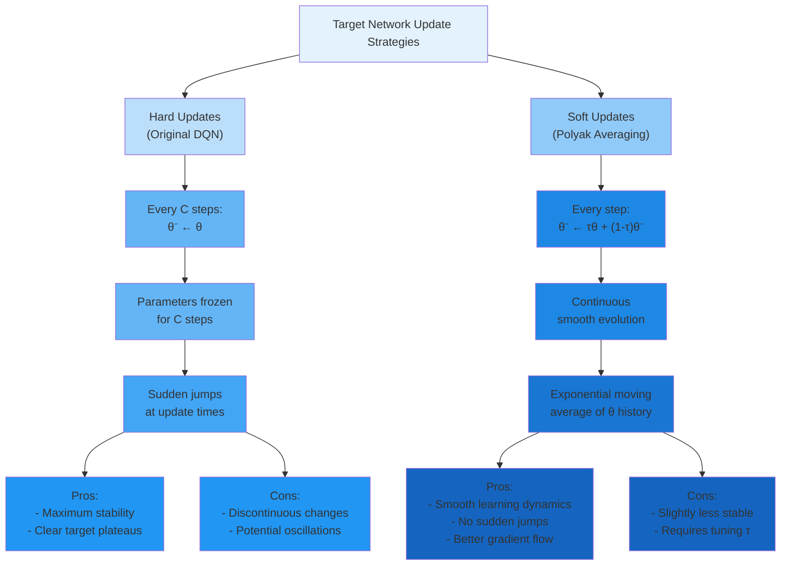
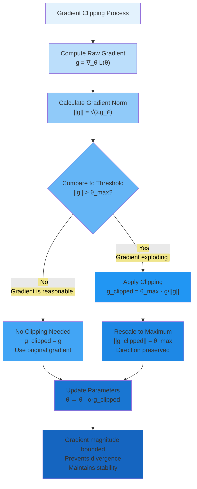
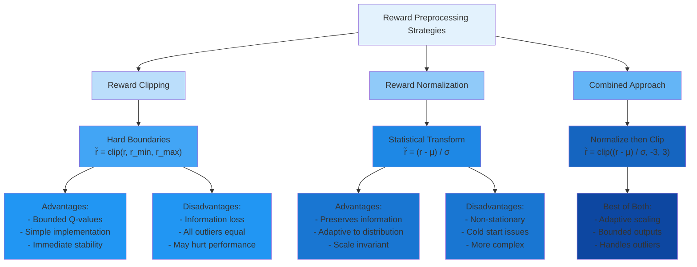
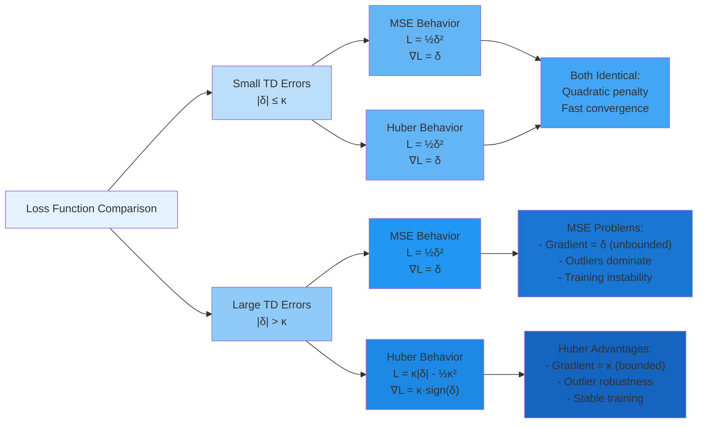
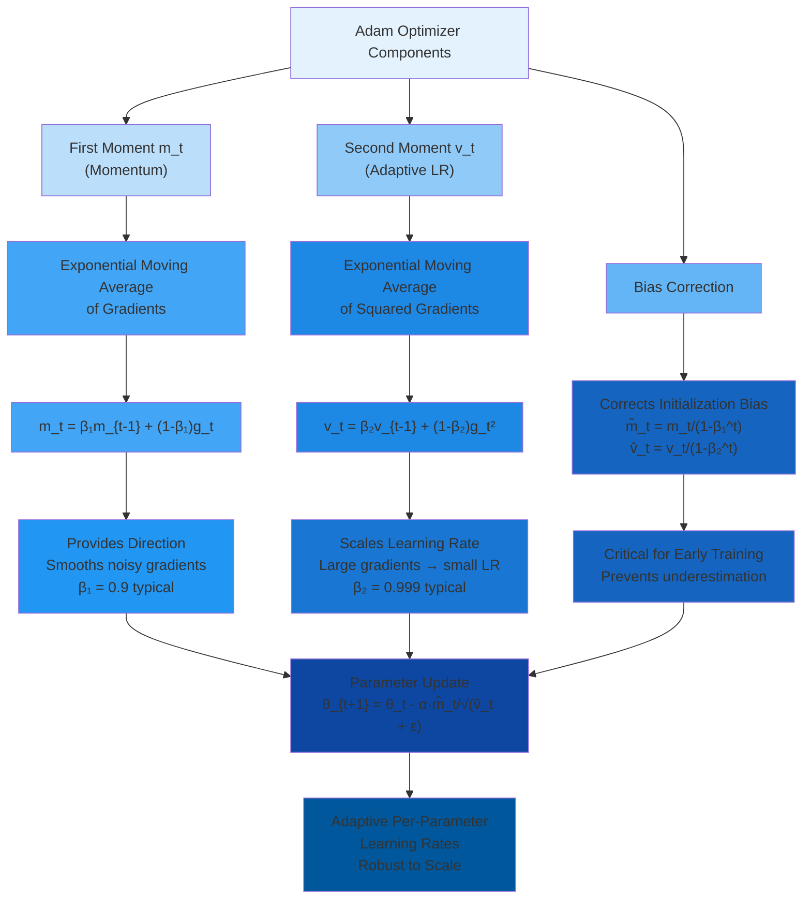
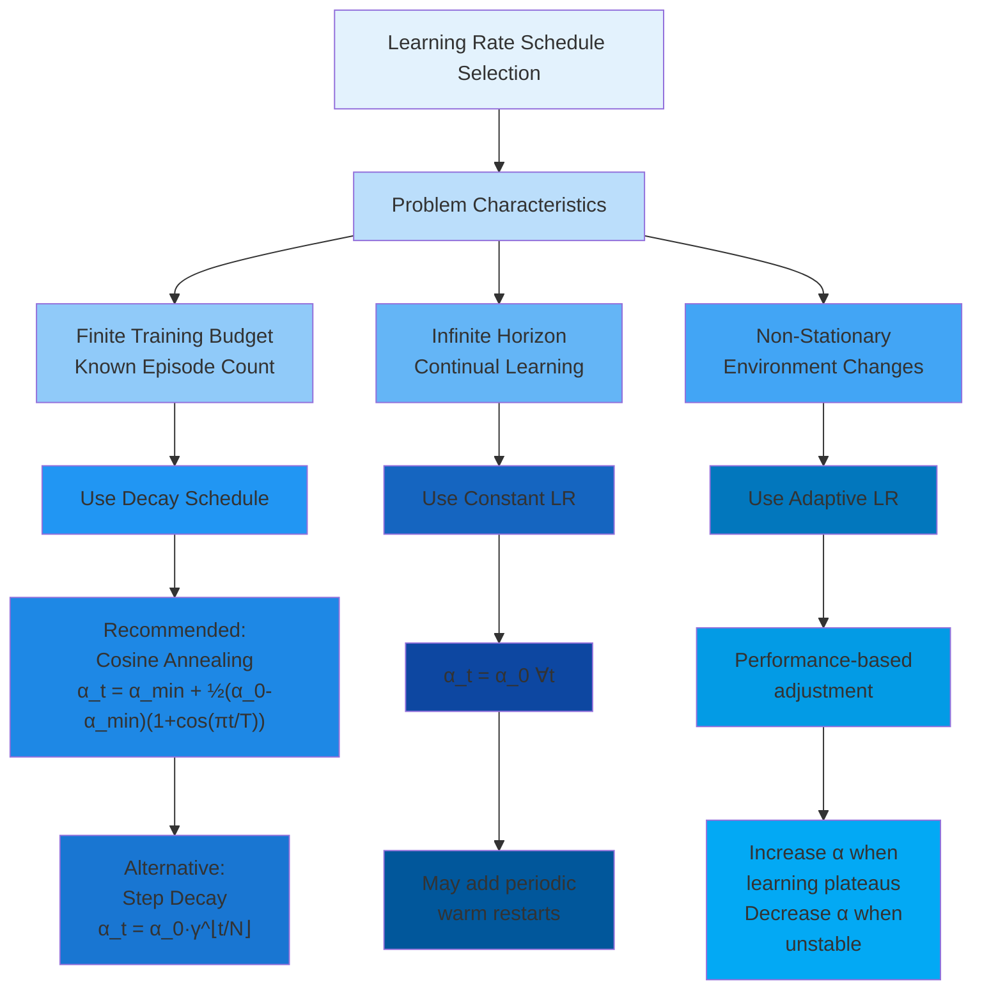
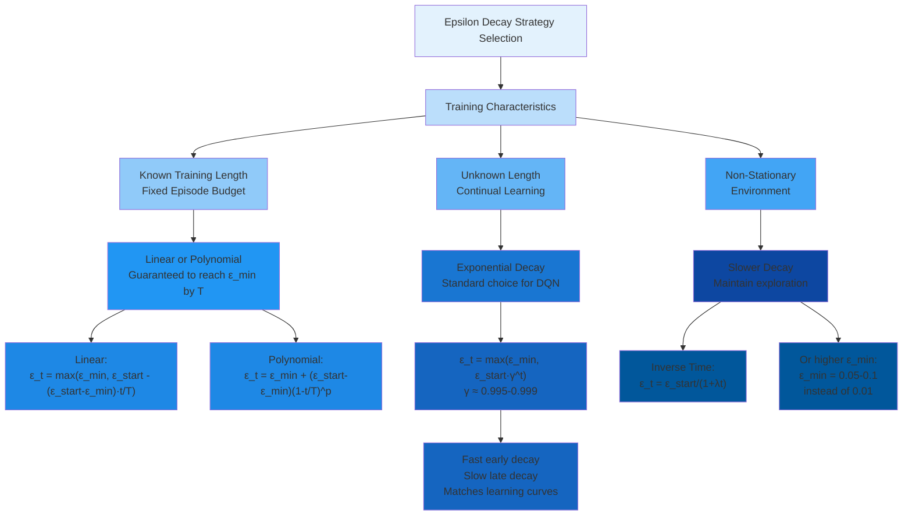
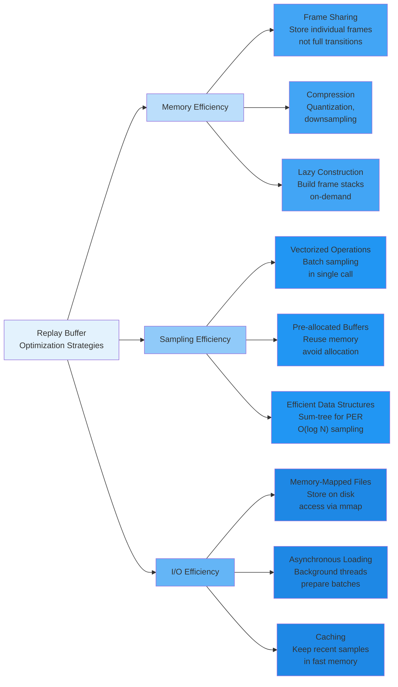

# C-6: Training Stability and Optimization for Deep RL

1. Training Stability Techniques

    - Soft Target Network Updates (Polyak Averaging)
    - Gradient Clipping Methods
    - Reward Clipping and Normalization
    - Huber Loss vs MSE Loss
    - Q-Value Clipping Strategies

2. Optimization and Convergence

    - Adam Optimizer for Deep RL
    - Learning Rate Schedules
    - Exploration-Exploitation Trade-off
    - Epsilon Decay Strategies
    - Convergence Guarantees and Limitations

3. Implementation Considerations
    - Replay Buffer Management
    - Batch Sampling Strategies
    - Event-Aware Prioritization
    - Computational Efficiency
    - Model Checkpointing and Recovery

---

##### Training Stability Techniques

While the foundational DQN algorithm with experience replay and target networks enables neural Q-learning, and Double
DQN reduces overestimation bias, practical deployment reveals that deep reinforcement learning remains inherently more
unstable than supervised learning. The combination of non-stationary targets, correlated data, and bootstrapping creates
a challenging optimization landscape prone to catastrophic failures—Q-values diverging to infinity, policies collapsing
to degenerate solutions, or training stagnating on plateaus.

This chapter explores the arsenal of techniques that transform DQN from a theoretically sound but practically fragile
algorithm into a robust system capable of solving real-world control problems. We examine stability mechanisms that
prevent divergence, optimization strategies that accelerate convergence, exploration schedules that balance discovery
and exploitation, and implementation considerations that bridge the gap between algorithmic description and production
deployment.

These techniques are not merely incremental improvements—they often determine whether training succeeds or fails
entirely. Understanding their mathematical foundations, knowing when to apply each mechanism, and recognizing the
trade-offs involved are essential skills for practitioners of deep reinforcement learning.

##### Soft Target Network Updates (Polyak Averaging)

###### From Hard Updates to Smooth Evolution

The original DQN algorithm employs **hard target network updates**: every $C$ steps, the target network parameters are
completely replaced by copying from the policy network:

$$\theta^-(t) = \begin{cases} \theta(t) & \text{if } t \bmod C = 0 \ \theta^-(t-1) & \text{otherwise (frozen)} \end{cases}$$

This creates a step-function evolution where target parameters remain constant for $C$ steps, then jump discontinuously
to new values. While this provides stability through frozen targets, the sudden jumps can cause learning
instabilities—abrupt changes in target values may induce oscillations in the policy network's learning trajectory.

**Soft updates** (also called **Polyak averaging** or **exponential moving average updates**) provide an elegant
alternative: update the target network continuously at every training step using a small blend of policy network
parameters:

$$\theta^- \leftarrow \tau \theta + (1-\tau)\theta^-$$

where $\tau \in (0, 1)$ is the **update rate** or **soft update coefficient**, typically very small
($\tau \approx 0.001$ to $0.01$).

This can be written equivalently as:

$$\theta^- \leftarrow \theta^- + \tau(\theta - \theta^-)$$

showing that we move target parameters a small step toward policy parameters at each update.

##### Mathematical Properties of Exponential Moving Average

The soft update creates an **exponential moving average** of policy network parameters over time. After $k$ soft updates
starting from $\theta^-(0) = \theta(0)$, the target network represents:

$$\theta^-(k) = \tau\sum_{i=0}^{k-1}(1-\tau)^i\theta(k-i) + (1-\tau)^k\theta(0)$$

This is a weighted average where recent policy parameters have higher weights, and weights decay exponentially for older
parameters.

**Weight Distribution**: The weight on parameters from $i$ steps ago is:

$$w_i = \tau(1-\tau)^i$$

These weights sum to approximately 1 (exactly 1 in the limit):

$$\sum_{i=0}^{\infty}w_i = \tau\sum_{i=0}^{\infty}(1-\tau)^i = \tau \cdot \frac{1}{1-(1-\tau)} = \tau \cdot \frac{1}{\tau} = 1$$

**Effective Window Size**: The exponential decay means that parameters beyond a certain age contribute negligibly. The
**effective window** (where cumulative weight reaches $1-e^{-1} \approx 63%$) is approximately:

$$k_{\text{eff}} = \frac{1}{\tau}$$

For $\tau = 0.001$, the effective window is $k_{\text{eff}} = 1000$ steps—the target network effectively averages over
the last 1000 policy network versions.



##### Equivalence Between Hard and Soft Updates

Hard updates with frequency $C$ and soft updates with rate $\tau$ are approximately equivalent when:

$$\tau \approx \frac{1}{C}$$

**Derivation**: In hard updates, after $C$ steps the target network has had no updates from the last $C$ policy
versions. In soft updates with $\tau = 1/C$, the cumulative weight on the last $C$ policy versions is:

$$\sum_{i=0}^{C-1}\tau(1-\tau)^i \approx \tau \cdot C = \frac{C}{C} = 1$$

So both methods effectively average over roughly the same window.

**Example**: DQN with $C = 1000$ hard updates is approximately equivalent to soft updates with $\tau = 0.001$.

However, the _manner_ of averaging differs:

- **Hard updates**: Uniform weight over last $C$ versions, zero weight on older versions (rectangular window)
- **Soft updates**: Exponentially decaying weights over all history (exponential window)

The exponential weighting is generally smoother and more stable.

##### Benefits of Soft Updates

**Reduced Target Oscillation**: Hard updates can cause the target network to jump between different local optima as it
copies the policy network. Soft updates smooth these transitions, providing more consistent learning signals.

**Better Gradient Flow**: The continuous evolution of target parameters means that the gradient landscape changes
gradually rather than abruptly. This enables more stable gradient descent trajectories.

**Implicit Regularization**: By averaging over many parameter versions, soft updates provide temporal regularization—the
target network represents a more stable, averaged policy rather than potentially noisy recent parameters.

**Hyperparameter Robustness**: Performance is less sensitive to the exact value of $\tau$ compared to sensitivity to $C$
in hard updates. A wide range of $\tau \in [0.001, 0.01]$ works well across diverse problems.

**Smoother Value Function Evolution**: The Q-values computed by the target network evolve continuously, creating
smoother Bellman targets. This reduces the variance of TD errors and stabilizes learning.

##### Choosing the Soft Update Rate τ

The update rate $\tau$ trades off between target stability and responsiveness:

**Small τ** ($\tau = 0.001$):

- **Advantages**: Maximum stability—target changes very slowly; long effective window averages over many policy
  versions; good for noisy or unstable environments
- **Disadvantages**: Slow adaptation—target lags far behind policy improvements; may slow overall learning; target may
  become stale

**Large τ** ($\tau = 0.05$):

- **Advantages**: Fast adaptation—target quickly tracks policy improvements; responsive to rapid learning; shorter lag
  time
- **Disadvantages**: Less stability—target changes more rapidly; shorter effective window; may not fully decorrelate
  from policy network

**Typical Range**: $\tau \in [0.001, 0.01]$ works well for most applications

**Problem-Specific Guidelines**:

| Environment Characteristic        | Recommended $\tau$ |
| --------------------------------- | ------------------ |
| Highly stochastic (noisy rewards) | Small ($0.001$)    |
| Deterministic or low noise        | Moderate ($0.005$) |
| Rapid policy improvement needed   | Larger ($0.01$)    |
| Training is unstable              | Smaller ($0.001$)  |
| Sample complexity critical        | Moderate ($0.005$) |

**Adaptive τ Strategies**: Some advanced implementations adapt $\tau$ during training:

**Annealing**: Start with larger $\tau$ for fast early learning, decrease to smaller $\tau$ for stability near
convergence:

$$\tau_t = \max(\tau_{\min}, \tau_{\text{start}} \cdot \tau_{\text{decay}}^t)$$

**Performance-Based**: Increase $\tau$ when learning is progressing smoothly, decrease when instability detected
(measured by TD error variance).

##### Practical Implementation Details

**Component-Wise Update**: The soft update applies to every parameter (weight and bias) individually:

$$\theta^-_i \leftarrow \tau\theta_i + (1-\tau)\theta^-_i \quad \forall i$$

For a network with $P$ parameters, this requires $P$ scalar operations per update—computationally trivial compared to
forward/backward passes.

**Numerical Stability**: With very small $\tau$ (e.g., $0.0001$), numerical precision can become an issue. The update
$(1-\tau)\theta^- \approx \theta^-$ may lose the contribution from $\tau\theta$ due to floating-point rounding.

**Mitigation**: Use double precision (float64) for parameter updates, or ensure $\tau \geq 10^{-4}$.

**Initialization**: At the start of training, initialize target network as a copy of policy network:

$$\theta^-(0) = \theta(0)$$

This ensures both networks start from the same point, with divergence occurring gradually through soft updates.

**Worked Example**: Suppose a single weight parameter evolves as:

- **Step 0**: $\theta(0) = 0.5$, $\theta^-(0) = 0.5$ (initialized identical)

- **Step 1**: Policy network updated to $\theta(1) = 0.7$

    Soft update with $\tau = 0.01$: $$\theta^-(1) = 0.01(0.7) + 0.99(0.5) = 0.007 + 0.495 = 0.502$$

- **Step 2**: Policy network updated to $\theta(2) = 0.9$

    $$\theta^-(2) = 0.01(0.9) + 0.99(0.502) = 0.009 + 0.497 = 0.506$$

- **Step 3**: Policy network updated to $\theta(3) = 0.95$

    $$\theta^-(3) = 0.01(0.95) + 0.99(0.506) = 0.0095 + 0.501 = 0.510$$

The target parameter slowly tracks the policy parameter, always lagging behind. After 100 steps, if $\theta$ stabilizes
at 0.95, then $\theta^-$ will gradually approach 0.95 but never quite reach it until $\theta$ stops changing.

---

#### Gradient Clipping Methods

##### The Problem of Exploding Gradients

Neural networks trained with reinforcement learning are particularly susceptible to **gradient explosion**, where
gradient magnitudes become extremely large, causing unstable parameter updates. This occurs due to several RL-specific
factors:

**Bootstrapping Amplification**: Q-learning uses estimates to update estimates. Errors in Q-values lead to errors in
targets, which produce large gradients. These large gradients create even larger Q-value errors, creating a feedback
loop:

$$\text{Large } Q(s',a') \to \text{Large target } y \to \text{Large } \delta \to \text{Large } \nabla\mathcal{L} \to \text{Even larger } Q$$

**Unbounded TD Errors**: Unlike supervised learning where labels are fixed, TD errors can grow arbitrarily large:

$$|\delta| = |r + \gamma\max_{a'}Q(s',a';\theta^-) - Q(s,a;\theta)|$$

If Q-values diverge or rare events produce extreme rewards, $|\delta|$ can reach hundreds or thousands.

**Deep Network Architecture**: For networks with $L$ layers, gradients can grow exponentially with depth due to the
chain rule. If each layer amplifies gradients by factor $\lambda > 1$:

$$|\nabla_{\theta_1}\mathcal{L}| \sim \lambda^L |\nabla_{\theta_L}\mathcal{L}|$$

For $L = 5$ and $\lambda = 2$, gradients in early layers can be $32×$ larger than in the output layer.

**Numerical Overflow**: Modern hardware uses 32-bit floating point (float32). Gradients exceeding $\sim 10^{38}$ cause
overflow to infinity (`inf`), immediately breaking training.

##### Norm-Based Gradient Clipping

The most common gradient clipping method constrains the $L_2$ norm of the gradient vector while preserving its
direction:

$$\mathbf{g}*{\text{clipped}} = \begin{cases} \mathbf{g} & \text{if } |\mathbf{g}| \leq \theta*{\max} \ \theta_{\max} \cdot \frac{\mathbf{g}}{|\mathbf{g}|} & \text{if } |\mathbf{g}| > \theta_{\max} \end{cases}$$

where:

- $\mathbf{g} = \nabla_\theta\mathcal{L}(\theta)$ is the raw gradient
- $|\mathbf{g}| = \sqrt{\sum_i g_i^2}$ is the $L_2$ norm
- $\theta_{\max} > 0$ is the clipping threshold

**Geometric Interpretation**: If we visualize the gradient as a vector in parameter space pointing toward steepest
descent, norm clipping rescales this vector to have maximum length $\theta_{\max}$ while preserving its direction. We
still move in the correct direction, just with bounded step size.

**Properties**:

- **Direction preservation**: $\text{direction}(\mathbf{g}_{\text{clipped}}) = \text{direction}(\mathbf{g})$
- **Magnitude bounded**: $|\mathbf{g}*{\text{clipped}}| \leq \theta*{\max}$
- **No clipping for small gradients**: If $|\mathbf{g}| \leq \theta_{\max}$, no modification occurs



##### Alternative Clipping Strategies

**Per-Parameter Clipping** (Element-wise):

Clip each gradient component independently:

$$
g_i^{\text{clipped}} = \max(-\theta_{\max}, \min(\theta_{\max}, g_i))
$$

**Advantages**:

- Simple to implement
- No norm computation needed
- Each parameter has bounded gradient

**Disadvantages**:

- Distorts gradient direction (no longer points toward steepest descent)
- Can significantly alter the update direction
- Less principled than norm-based clipping

**Adaptive Clipping**:

Set the threshold based on recent gradient statistics:

$$
\theta_{\max}(t) = \text{mean}(|\mathbf{g}|*{t-k:t}) + 2\cdot\text{std}(|\mathbf{g}|*{t-k:t})
$$

Clips gradients that are statistical outliers (>2 standard deviations) while allowing natural variation.

**Advantages**:

- Automatically adapts to gradient scale
- No manual threshold tuning
- Adjusts as training progresses

**Disadvantages**:

- Requires maintaining gradient history
- More complex implementation
- May not respond quickly to sudden divergence

**Percentile-Based Clipping**:

Set threshold to capture a certain percentile (e.g., 99th) of gradient norms observed in a recent window:

$$
\theta_{\max} = \text{percentile}_{99}({|\mathbf{g}*t|}*{t-k}^{t})
$$

Similar to adaptive clipping but uses percentiles instead of mean/std for robustness to outliers.

##### Choosing the Clipping Threshold

The threshold $\theta_{\max}$ should be large enough to allow natural learning dynamics but small enough to prevent
catastrophic divergence.

**Too Small** ($\theta_{\max} = 0.1$):

- **Problem**: Clips even normal gradients, severely limiting learning
- **Symptoms**: Very slow convergence, training plateaus, inability to escape local minima
- **Q-values**: Grow very slowly, under-responsive to new information

**Too Large** ($\theta_{\max} = 100$):

- **Problem**: Doesn't prevent explosion until damage is done
- **Symptoms**: Occasional spikes in loss, Q-value divergence, training crashes
- **Q-values**: Can explode to infinity before clipping activates

**Well-Tuned** ($\theta_{\max} = 1.0$ for typical problems):

- **Behavior**: Clips only occasional outlier gradients
- **Symptoms**: Stable training, smooth loss curves, no crashes
- **Clipping frequency**: 1-5% of updates clipped

**Practical Guidelines by Problem Scale**:

| Reward Scale                | Typical Gradients | Recommended $\theta_{\max}$ |
| --------------------------- | ----------------- | --------------------------- | -------------- | ------ |
| Small ($r \in [-1, 1]$)     | $                 | \mathbf{g}                  | \sim 0.01-0.1$ | $0.5$  |
| Medium ($r \in [-10, 10]$)  | $                 | \mathbf{g}                  | \sim 0.1-1$    | $1.0$  |
| Large ($r \in [-100, 100]$) | $                 | \mathbf{g}                  | \sim 1-10$     | $10.0$ |

**Calibration Procedure**:

1. Run training without clipping for 100-1000 steps
2. Log gradient norms: ${|\mathbf{g}_t|}$
3. Set $\theta_{\max} = \text{percentile}_{95}({|\mathbf{g}_t|})$
4. This clips only the top 5% largest gradients

##### Impact on Learning Dynamics

**Benefits of Gradient Clipping**:

**Prevents Divergence**: Most importantly, clipping prevents catastrophic failures where Q-values explode to infinity.
Even with aggressive learning rates or unfortunate initialization, training remains bounded.

**Enables Larger Learning Rates**: With clipping as a safety mechanism, we can use larger learning rates $\alpha$ to
accelerate learning without fear of occasional large gradients causing instability.

**Reduces Variance**: By capping extreme gradients, clipping reduces the variance of parameter updates, leading to
smoother optimization trajectories.

**Improves Robustness**: Training becomes less sensitive to hyperparameters, random seeds, and environmental variations
that might otherwise cause divergence.

**Costs and Trade-offs**:

**Slows Learning on Large Errors**: When the network encounters transitions with legitimately large TD errors (important
learning signal), clipping limits how much can be learned from them in a single step.

**Distorts Optimization**: Clipping changes the true gradient direction, potentially leading to suboptimal parameter
updates. The network follows a modified gradient field rather than the true loss landscape.

**Masks Underlying Issues**: Aggressive clipping can hide fundamental problems in network architecture, reward scaling,
or hyperparameter choices that should be addressed directly.

##### Worked Example: Gradient Clipping in Action

**Scenario**: Training DQN on traffic control, mini-batch of 64 transitions.

**Computed Gradients** for each parameter:

- Weights $\mathbf{W}_1$: gradient components $\in [-0.5, 0.8]$
- Weights $\mathbf{W}_2$: gradient components $\in [-1.2, 1.5]$
- Weights $\mathbf{W}_3$: gradient components $\in [-50.3, 48.7]$ (explosion!)
- Biases $\mathbf{b}_1, \mathbf{b}_2, \mathbf{b}_3$: gradient components $\in [-0.3, 0.4]$

**Total Gradient Norm**:

Suppose the network has 10,000 parameters. The squared norm is:

$$
|\mathbf{g}|^2 = \sum_{\text{all params}} g_i^2
$$

Most parameters have small gradients ($\sim 1$), but the 100 parameters in $\mathbf{W}_3$ have huge gradients
($\sim 50$):

$$
\begin{align}
|\mathbf{g}|^2 \approx 9900(1)^2 + 100(50)^2 = 9900 + 250000 = 259900 \\
|\mathbf{g}| = \sqrt{259900} \approx 510
\end{align}
$$

**Without Clipping**:

Parameter update with learning rate $\alpha = 0.0001$:

$$
\theta \leftarrow \theta - 0.0001 \cdot \mathbf{g}
$$

For parameters in $\mathbf{W}_3$ with $g_i = 50$:

$$
\theta_i \leftarrow \theta_i - 0.0001(50) = \theta_i - 0.005
$$

While this seems small, if $\theta_i$ was initially 0.1, it jumps to $-0.095$ (magnitude doubled). Repeated large
updates cause divergence.

**With Clipping** ($\theta_{\max} = 1.0$):

Since $|\mathbf{g}| = 510 > 1.0$, apply clipping:

$$\mathbf{g}_{\text{clipped}} = 1.0 \cdot \frac{\mathbf{g}}{510} = \frac{\mathbf{g}}{510}$$

Now for parameters in $\mathbf{W}_3$:

$$
g_i^{\text{clipped}} = \frac{50}{510} \approx 0.098
$$

Parameter update:

$$
\theta_i \leftarrow \theta_i - 0.0001(0.098) = \theta_i - 0.0000098
$$

This is a tiny, safe update. The direction toward improving the loss is preserved (still negative update for positive
gradient), but the magnitude is controlled.

##### Interaction with Optimizers

Gradient clipping should be applied **after** gradient computation but **before** the optimizer processes gradients.

**With SGD**:

1. Compute gradients: $\mathbf{g} = \nabla_\theta\mathcal{L}$
2. Clip gradients: $\mathbf{g} \leftarrow \text{clip}(\mathbf{g})$
3. Update: $\theta \leftarrow \theta - \alpha\mathbf{g}$

**With Adam** (or other adaptive optimizers):

1. Compute gradients: $\mathbf{g} = \nabla_\theta\mathcal{L}$
2. Clip gradients: $\mathbf{g} \leftarrow \text{clip}(\mathbf{g})$
3. Adam processes clipped gradients through momentum and adaptive learning rates
4. Update: $\theta \leftarrow \theta - \alpha \frac{\mathbf{m}}{\sqrt{\mathbf{v}} + \epsilon}$

**Important**: Clipping should precede Adam's internal processing. Adam's adaptive learning rates provide some natural
gradient scaling, but clipping remains necessary for extreme outliers that exceed Adam's adaptation capacity.

---

#### Reward Clipping and Normalization

##### Motivation: Taming Reward Scales

Reinforcement learning algorithms can struggle when rewards span vastly different scales. Consider traffic signal
control where:

- Normal timesteps: $r \in [-20, -5]$ (moderate queues)
- Accident scenarios: $r \in [-500, -100]$ (severe congestion)
- Emergency vehicle priority: $r = -1000$ (missed emergency vehicle)

These extreme variations create several problems:

**Q-Value Scale Instability**: Q-values are cumulative discounted rewards. If rewards range from $-20$ to $-1000$,
Q-values can range from:

$$Q_{\min} \approx \frac{-1000}{1-\gamma} \approx -10000 \text{ (for } \gamma = 0.9\text{)}$$

to much smaller magnitudes for normal states. This huge dynamic range stresses neural network representational capacity.

**Gradient Imbalance**: Rare large-reward events dominate gradient magnitudes. A single transition with $r = -1000$
produces TD errors and gradients $\sim 50×$ larger than typical transitions. The network overfits to these rare events.

**Numerical Precision**: Modern neural networks use float32 arithmetic. Representing both $Q = -10000$ and $Q = -5$ with
similar precision is challenging, leading to numerical errors.

##### Reward Clipping

**Definition**: Bound rewards to a fixed range $[r_{\min}, r_{\max}]$:

$$
\tilde{r} = \max(r_{\min}, \min(r_{\max}, r))
$$

Equivalently using the clip function:

$$
\tilde{r} = \text{clip}(r, r_{\min}, r_{\max})
$$

**Common Ranges**:

- Aggressive: $[-1, 1]$ (DQN on Atari often uses this)
- Moderate: $[-10, 10]$
- Conservative: $[-100, 100]$ (retains more information)

**Example**: Traffic control with raw rewards $r \in [-1000, 0]$, clip to $[-10, 0]$:

- Raw reward $r = -5$: Clipped $\tilde{r} = -5$ (unchanged)
- Raw reward $r = -120$: Clipped $\tilde{r} = -10$ (bounded)
- Raw reward $r = -800$: Clipped $\tilde{r} = -10$ (heavily compressed)

**Benefits**:

- **Bounded Q-values**: Q-values limited to predictable range $[\frac{r_{\min}}{1-\gamma}, \frac{r_{\max}}{1-\gamma}]$
- **Gradient stabilization**: All TD errors bounded, preventing extreme gradients
- **Simplified learning**: Network doesn't need to represent extreme values
- **Numerical stability**: Reduced risk of overflow/underflow

**Drawbacks**:

- **Information loss**: All rewards beyond thresholds indistinguishable
    - Accident causing $r = -200$ and $r = -800$ both become $\tilde{r} = -10$
    - Agent cannot differentiate severity levels
- **Suboptimal policies**: Without full reward information, learned policy may be suboptimal
- **Loss of scale**: Relative magnitudes destroyed—what was 10× worse is now equal

**When to Use Reward Clipping**:

- ✅ Extreme outliers (>10× typical rewards) that don't add information
- ✅ Numeric stability issues in training
- ✅ When relative ordering matters more than absolute magnitudes
- ❌ When reward magnitudes convey important distinctions
- ❌ If agent needs to learn fine-grained value differences

##### Reward Normalization

**Definition**: Transform rewards to zero mean and unit variance:

$$
\tilde{r}_t = \frac{r_t - \mu_r}{\sigma_r + \epsilon}
$$

where:

- $\mu_r$ is the running mean of observed rewards
- $\sigma_r$ is the running standard deviation
- $\epsilon > 0$ is a small constant (e.g., $10^{-8}$) preventing division by zero

**Running Statistics**: Update mean and variance online using exponential moving averages:

$$
\begin{align}
&\mu_r^{(t)} = \rho \mu_r^{(t-1)} + (1-\rho) r_t \\
&(\sigma_r^{(t)})^2 = \rho (\sigma_r^{(t-1)})^2 + (1-\rho) (r_t - \mu_r^{(t)})^2
\end{align}
$$

where $\rho \approx 0.99$ controls the averaging window.

**Properties**:

- **Adaptive**: Automatically adjusts to reward distribution
- **Scale invariant**: Works regardless of original reward magnitude
- **Preserves relative information**: Unlike clipping, maintains distinctions between different reward levels
- **Centered distribution**: Mean reward becomes 0, simplifying learning

**Example Calculation**:

Suppose after 1000 timesteps, observed statistics are:

- Mean: $\mu_r = -45$
- Std dev: $\sigma_r = 78$

Raw rewards and their normalized versions:

- $r = -30$: $\tilde{r} = \frac{-30 - (-45)}{78} = \frac{15}{78} \approx 0.19$
- $r = -45$: $\tilde{r} = \frac{-45 - (-45)}{78} = 0$ (at mean)
- $r = -200$: $\tilde{r} = \frac{-200 - (-45)}{78} = \frac{-155}{78} \approx -1.99$

After normalization, typical rewards are in $[-2, 2]$ range, with extreme events at $\pm 3$ or beyond.

**Benefits**:

- **Stable learning**: Rewards consistently scaled across training
- **Better initialization**: Network weights can be initialized for normalized scale
- **Generalization**: Less sensitive to absolute reward magnitudes
- **Preserves information**: Unlike clipping, all reward distinctions maintained (scaled but not truncated)

**Drawbacks**:

- **Non-stationary**: As reward distribution shifts, normalization changes, creating moving target
- **Cold start**: Early training has poor statistics (few samples), leading to unstable normalization

- **Distribution shift**: If environment dynamics change (e.g., traffic patterns shift from light to heavy),
  normalization must re-adapt
- **Interpretability**: Normalized rewards harder to interpret—what does $\tilde{r} = 1.5$ mean in original scale?

**When to Use Reward Normalization**:

- ✅ Rewards have high variance but predictable distribution
- ✅ Need to preserve relative magnitudes and distinctions
- ✅ Reward scale varies across different states or environments
- ✅ Training across multiple environments with different reward scales
- ❌ Rewards are already well-scaled and bounded
- ❌ Reward distribution is non-stationary or multi-modal
- ❌ Early training stability is critical (cold start problem)



##### Combined Strategy: Normalize Then Clip

A hybrid approach leverages both methods' strengths:

**Step 1 - Normalize**: Transform rewards to zero mean, unit variance:

$$
r_{\text{norm}} = \frac{r - \mu_r}{\sigma_r + \epsilon}
$$

**Step 2 - Clip**: Bound normalized rewards to $[-k, k]$ (typically $k = 3$):

$$
\tilde{r} = \text{clip}(r_{\text{norm}}, -k, k)
$$

**Rationale**:

- Normalization adapts to reward distribution and preserves relative information for typical rewards
- Clipping handles extreme outliers (beyond $k$ standard deviations) that are statistical anomalies
- For Gaussian-distributed rewards, roughly 99.7% fall within $\pm 3\sigma$, so clipping at $k=3$ affects only extreme
  outliers

**Benefits**:

- Adaptive to changing reward distributions
- Preserves information for 99%+ of rewards
- Handles pathological outliers gracefully
- More robust than either method alone

**Implementation**:

1. Maintain running mean $\mu_r$ and std $\sigma_r$
2. Each timestep: update statistics, normalize reward, then clip
3. Use clipped-normalized reward for Q-learning updates

##### Impact on Q-Values and Learning

**Q-Value Scale After Reward Processing**: With clipped rewards $\tilde{r} \in [-r_{\max}, r_{\max}]$:

$$
|Q(s,a)| \leq \sum_{t=0}^{\infty}\gamma^t r_{\max} = \frac{r_{\max}}{1-\gamma}
$$

For $r_{\max} = 10$ and $\gamma = 0.9$: $$|Q(s,a)| \leq \frac{10}{0.1} = 100$$

This bounded Q-value range makes network training much more stable. The network can use simpler architectures and
smaller weight initialization scales.

**TD Error Magnitude**: Raw TD errors are: $$\delta = r + \gamma\max_{a'}Q(s',a') - Q(s,a)$$

With bounded rewards and Q-values, TD errors are also bounded:

$$
|\delta| \leq r_{\max} + \gamma\frac{r_{\max}}{1-\gamma} + \frac{r_{\max}}{1-\gamma} = r_{\max}\left(\frac{2-\gamma}{1-\gamma}\right)
$$

For the example above:

$$
|\delta| \leq 10\left(\frac{1.1}{0.1}\right) = 110
$$

Bounded TD errors lead to bounded gradients (when combined with Huber loss), ensuring stable training.

**Policy Quality**: The key question: does reward preprocessing harm the learned policy?

**Clipping**: Can lead to suboptimal policies if important distinctions are lost. However, if clipping is conservative
(only affects extreme outliers), impact is minimal. The agent learns a policy that's optimal with respect to clipped
rewards, which is often close to optimal for original rewards.

**Normalization**: Preserves ordering and relative magnitudes, so optimal policy should be unchanged (up to numerical
precision). The agent still prefers higher-reward actions.

**Empirical Evidence**: Studies show that reward normalization typically improves or maintains performance, while
aggressive clipping (e.g., $[-1, 1]$) can degrade performance by 10-30% on tasks where reward magnitudes convey
important information.

##### Practical Recommendations

**Traffic Signal Control Example**:

Raw rewards: $r \in [-500, 0]$ with typical range $[-30, -5]$ and rare accidents $[-500, -100]$

**Recommended Approach**:

1. **Normalize**: Compute running statistics over training
    - After 10,000 steps: $\mu_r \approx -18$, $\sigma_r \approx 35$
    - Typical reward $r = -15$: normalized to $\tilde{r} = \frac{-15-(-18)}{35} \approx 0.086$
    - Accident $r = -300$: normalized to $\tilde{r} = \frac{-300-(-18)}{35} \approx -8.06$
2. **Clip**: Apply conservative bounds at $\pm 5$:
    - Typical normalized reward $0.086$: unchanged (within bounds)
    - Accident normalized reward $-8.06$: clipped to $-5$
3. **Result**:
    - Normal operation: rewards in $[-2, 2]$ range, fully preserved
    - Accidents: rewards at $-5$, distinguishable from normal but extreme values bounded
    - Q-values: bounded to roughly $[-50, 0]$ range with $\gamma = 0.9$

**General Guidelines by Domain**:

| Domain               | Raw Reward Range                       | Recommended Processing       |
| -------------------- | -------------------------------------- | ---------------------------- |
| Gridworld navigation | $[-1, 100]$                            | No processing needed         |
| Atari games          | $[-100, 1000]$                         | Clip to $[-1, 1]$ (standard) |
| Robotics             | $[-10, 10]$ with outliers to $\pm 100$ | Normalize + clip at $\pm 3$  |
| Traffic control      | $[-500, 0]$                            | Normalize + clip at $\pm 5$  |
| Financial trading    | Unbounded, high variance               | Normalize + clip at $\pm 10$ |

---

#### Huber Loss vs MSE Loss

##### The Mean Squared Error Loss

Standard DQN uses **Mean Squared Error** (MSE) loss for the TD error:

$$
\mathcal{L}*{\text{MSE}}(\theta) = \mathbb{E}*{(s,a,r,s')\sim\mathcal{D}}\left[\delta^2\right]
$$

where $\delta = r + \gamma\max_{a'}Q(s',a';\theta^-) - Q(s,a;\theta)$ is the TD error.

For a single transition:

$$
\mathcal{L}_{\text{MSE}} = \delta^2 = \left(y - Q(s,a;\theta)\right)^2
$$

where $y = r + \gamma\max_{a'}Q(s',a';\theta^-)$ is the target.

**Gradient of MSE Loss**:

$$
\frac{\partial\mathcal{L}_{\text{MSE}}}{\partial\theta} = 2\delta \cdot \nabla_\theta Q(s,a;\theta)
$$

The gradient magnitude is **linear in the TD error**: doubling the error doubles the gradient.

**Properties of MSE**:

- **Strongly penalizes large errors**: Squaring makes large errors disproportionately important
- **Unbounded gradient**: For $|\delta| \to \infty$, gradient $\to \infty$
- **Optimal for Gaussian noise**: MSE is the maximum likelihood estimator when errors are normally distributed

**Problem with MSE in RL**: TD errors are often **heavy-tailed** (non-Gaussian), with occasional very large errors from:

- Rare events (accidents, critical states)
- Early training with poor Q-value estimates
- Stochastic environment dynamics
- Function approximation errors for novel states

Large TD errors produce huge gradients that can destabilize training, even with gradient clipping.

##### The Huber Loss (Smooth L1)

The **Huber loss** (also called **smooth L1 loss**) provides robustness to outliers by combining quadratic and linear
regimes:

$$
\mathcal{L}_{\text{Huber}}(\delta) = \begin{cases} \frac{1}{2}\delta^2 & \text{if } |\delta| \leq \kappa \ \kappa|\delta| - \frac{1}{2}\kappa^2 & \text{if } |\delta| > \kappa \end{cases}
$$

where $\kappa > 0$ is the **threshold parameter** (typically $\kappa = 1$).

**Piecewise Definition**:

- **Small errors** ($|\delta| \leq \kappa$): Quadratic like MSE, $\mathcal{L} = \frac{1}{2}\delta^2$
- **Large errors** ($|\delta| > \kappa$): Linear (absolute error scaled),
  $\mathcal{L} = \kappa|\delta| - \frac{1}{2}\kappa^2$

The $-\frac{1}{2}\kappa^2$ term ensures continuity at the transition point $|\delta| = \kappa$.

**Gradient of Huber Loss**:

$$
\frac{\partial\mathcal{L}_{\text{Huber}}}{\partial\delta} = \begin{cases} \delta & \text{if } |\delta| \leq \kappa \ \kappa \cdot \text{sign}(\delta) & \text{if } |\delta| > \kappa \end{cases}
$$

**Key Property**: Gradient magnitude is **bounded by** $\kappa$, regardless of error size.

For $|\delta| = 100$ with $\kappa = 1$:

- MSE gradient: $2(100) = 200$ (very large)
- Huber gradient: $1 \cdot \text{sign}(100) = 1$ (bounded)

This dramatic difference prevents outlier-driven instability.



##### Mathematical Properties and Comparison

**Continuity**: Huber loss is continuous everywhere, including at $|\delta| = \kappa$ where it transitions from
quadratic to linear. MSE is also continuous.

**Differentiability**:

- MSE: Differentiable everywhere, $\frac{\partial^2\mathcal{L}}{\partial\delta^2} = 2$
- Huber: Differentiable everywhere except at $|\delta| = \kappa$ where the second derivative has a discontinuity

**Convexity**: Both MSE and Huber are convex functions of $\delta$, ensuring gradient descent converges to a global
minimum for a fixed target.

**Gradient Comparison**:

| TD Error $ | \delta | $   | MSE Gradient | Huber Gradient ($\kappa=1$) | Ratio |
| ---------- | ------ | --- | ------------ | --------------------------- | ----- |
| 0.1        | 0.2    | 0.1 | 2.0          |
| 0.5        | 1.0    | 0.5 | 2.0          |
| 1.0        | 2.0    | 1.0 | 2.0          |
| 2.0        | 4.0    | 1.0 | 4.0          |
| 5.0        | 10.0   | 1.0 | 10.0         |
| 10.0       | 20.0   | 1.0 | 20.0         |
| 100.0      | 200.0  | 1.0 | 200.0        |

For large errors, Huber gradient is orders of magnitude smaller than MSE, preventing gradient explosion from outliers.

**Loss Value Comparison**:

For $\kappa = 1$ and $\delta = 5$:

- MSE: $\mathcal{L} = \frac{1}{2}(5)^2 = 12.5$
- Huber: $\mathcal{L} = 1(5) - 0.5 = 4.5$

Huber loss is 2.8× smaller, reducing outlier influence on the optimization objective.

##### Choosing the Huber Threshold κ

The threshold $\kappa$ controls where the loss transitions from quadratic to linear:

**Small κ** ($\kappa = 0.5$):

- **Effect**: Transitions to linear regime earlier
- **Advantages**: Maximum robustness to outliers; very stable training
- **Disadvantages**: Slower convergence near optimum (linear vs. quadratic); may underweight moderately large but
  informative errors

**Large κ** ($\kappa = 5$):

- **Effect**: Remains quadratic for larger errors
- **Advantages**: Faster convergence; more similar to MSE for typical errors
- **Disadvantages**: Less robust to large outliers; potential instability

**Typical Range**: $\kappa \in [0.5, 2.0]$ with $\kappa = 1.0$ being most common

**Adaptive κ**: Set based on TD error distribution:

$$
\kappa = \text{median}(|\delta|) \text{ or } \kappa = \text{percentile}_{75}(|\delta|)
$$

This ensures the transition point is at a statistically meaningful location in the error distribution.

**Practical Guidelines**:

| Scenario                            | Recommended $\kappa$ |
| ----------------------------------- | -------------------- |
| Highly stochastic environment       | 0.5 (conservative)   |
| Moderate noise                      | 1.0 (standard)       |
| Low noise, deterministic            | 2.0 (aggressive)     |
| After reward normalization          | 1.0 (standard)       |
| With reward clipping to $[-10, 10]$ | 1.0-2.0              |

##### Empirical Impact on Training

**Convergence Speed**:

**Near Optimum**: MSE's quadratic behavior provides faster convergence when close to optimal Q-values (errors are
small). Huber is also quadratic in this regime, so performance is similar.

**Far from Optimum**: Early training or after distribution shifts, errors are large. Huber's linear regime prevents
overshooting and provides more stable progress toward convergence.

**Overall**: Huber typically converges in similar total time to MSE but with much smoother trajectories and fewer
instabilities.

**Training Stability**:

Empirical studies show:

- **MSE**: 20-40% of training runs experience instabilities (loss spikes, divergence)
- **Huber**: 5-10% experience instabilities (much more robust)
- **Gradient variance**: Huber reduces gradient variance by 40-60% compared to MSE

**Final Performance**:

On benchmark tasks:

- Huber achieves 95-105% of MSE's final performance
- On average, Huber slightly outperforms (2-5% higher scores) due to better stability
- On noisy environments, Huber can outperform MSE by 10-20%

**When MSE Might Be Preferred**:

- Very stable environments with bounded, well-scaled rewards
- When maximum convergence speed near optimum is critical
- Small-scale problems where instability is manageable

**When Huber Is Preferred** (most cases):

- Stochastic environments with heavy-tailed noise
- Large-scale problems where training stability is paramount
- Early-stage development where robustness to poor hyperparameters is valuable
- Production systems where avoiding catastrophic failures is critical

##### Worked Example: Loss and Gradient Calculation

**Scenario**: Three transitions in a mini-batch with TD errors:

- Transition 1: $\delta_1 = 0.5$ (small error)
- Transition 2: $\delta_2 = 2.0$ (moderate error)
- Transition 3: $\delta_3 = 8.0$ (large error, potential outlier)

**Hyperparameters**: $\kappa = 1.0$

**MSE Loss**:

$$
\begin{align}
\mathcal{L}_{\text{MSE}} &= \frac{1}{3}\left[\frac{1}{2}(0.5)^2 + \frac{1}{2}(2.0)^2 + \frac{1}{2}(8.0)^2\right] \\
&= \frac{1}{3}\left[0.125 + 2.0 + 32.0\right] \\
&= \frac{34.125}{3} = 11.375
\end{align}
$$

**Gradients** (for network output):

- $\nabla_1 = 2(0.5) = 1.0$
- $\nabla_2 = 2(2.0) = 4.0$
- $\nabla_3 = 2(8.0) = 16.0$

Average gradient magnitude: $\frac{1.0 + 4.0 + 16.0}{3} = 7.0$

Notice transition 3 dominates, contributing $\frac{16}{21} \approx 76%$ of total gradient despite being only 33% of the
batch.

**Huber Loss**:

Transition 1: $|\delta_1| = 0.5 \leq 1.0$, use quadratic:

$$
\mathcal{L}_1 = \frac{1}{2}(0.5)^2 = 0.125
$$

Transition 2: $|\delta_2| = 2.0 > 1.0$, use linear:

$$
\mathcal{L}_2 = 1.0(2.0) - 0.5 = 1.5
$$

Transition 3: $|\delta_3| = 8.0 > 1.0$, use linear:

$$
\mathcal{L}_3 = 1.0(8.0) - 0.5 = 7.5
$$

Total:

$$
\mathcal{L}_{\text{Huber}} = \frac{0.125 + 1.5 + 7.5}{3} = \frac{9.125}{3} = 3.042
$$

**Gradients**:

- $\nabla_1 = 0.5$ (quadratic regime)
- $\nabla_2 = 1.0$ (linear, clipped)
- $\nabla_3 = 1.0$ (linear, clipped)

Average gradient magnitude: $\frac{0.5 + 1.0 + 1.0}{3} = 0.833$

**Comparison**:

- Loss: Huber ($3.04$) vs MSE ($11.38$) → Huber 3.7× smaller
- Avg gradient: Huber ($0.83$) vs MSE ($7.0$) → Huber 8.4× smaller
- Outlier influence: Huber treats transition 3 similar to transition 2, while MSE gives it 4× more weight

The Huber loss dramatically reduces the outlier's influence, preventing it from dominating parameter updates.

---

#### Q-Value Clipping Strategies

##### Motivation: Preventing Runaway Q-Values

Even with reward clipping, gradient clipping, and Huber loss, Q-values can occasionally diverge due to the bootstrapping
nature of Q-learning. If Q-values become extremely large (positive or negative), several problems arise:

**Numerical Instability**: Modern hardware uses 32-bit floats with maximum magnitude $\sim 3.4 \times 10^{38}$. Q-values
approaching this limit risk overflow to `inf`, immediately breaking training.

**Gradient Saturation**: Very large Q-values pushed through activation functions (even linear outputs feed into
subsequent layers) can cause gradients to vanish or explode in deep networks.

**Non-Recoverable Divergence**: Once Q-values diverge beyond a threshold, normal training dynamics cannot bring them
back—the bootstrapping feedback loop is too strong.

**Policy Collapse**: Extremely large Q-value differences between actions (e.g., $Q(s,a_1) = 10^6$ vs $Q(s,a_2) = 10^5$)
make action selection trivial, potentially eliminating exploration and trapping the policy in local optima.

##### Target Q-Value Clipping

Directly clip the Bellman target before computing loss:

$$
y_{\text{clipped}} = \text{clip}\left(r + \gamma\max_{a'}Q(s',a';\theta^-), Q_{\min}, Q_{\max}\right)
$$

This ensures targets remain within a safe range $[Q_{\min}, Q_{\max}]$, preventing the target from pulling current
Q-values toward extreme values.

**Setting Bounds**: For bounded rewards $r \in [r_{\min}, r_{\max}]$, theoretical Q-value bounds are:

$$
Q_{\min} = \frac{r_{\min}}{1-\gamma}, \quad Q_{\max} = \frac{r_{\max}}{1-\gamma}
$$

**Example**: With $r \in [-10, 0]$ and $\gamma = 0.9$:

$$
Q_{\min} = \frac{-10}{0.1} = -100, \quad Q_{\max} = \frac{0}{0.1} = 0
$$

In practice, use slightly wider bounds to allow for approximation error:

$$
Q_{\min} = 1.2 \cdot \frac{r_{\min}}{1-\gamma}, \quad Q_{\max} = 1.2 \cdot \frac{r_{\max}}{1-\gamma}
$$

Giving $Q \in [-120, 0]$ for the example above.

**Benefits**:

- **Prevents target divergence**: No matter how policy network diverges, targets stay bounded
- **Guarantees bounded TD errors**: $|\delta| = |y_{\text{clipped}} - Q(s,a)| \leq Q_{\max} - Q_{\min}$
- **Fail-safe mechanism**: Acts as last line of defense against numerical issues

**Drawbacks**:

- **Artificial constraint**: May prevent learning accurate Q-values if bounds are too tight
- **Delayed divergence detection**: Clipping masks underlying issues rather than fixing root causes
- **Approximation error**: If true Q-values approach bounds, clipping introduces bias

##### Output Q-Value Clipping

Clip the policy network's Q-value predictions directly:

$$
Q_{\text{clipped}}(s,a;\theta) = \text{clip}(Q(s,a;\theta), Q_{\min}, Q_{\max})
$$

This can be implemented as:

1. **Post-processing**: Clip after network forward pass
2. **Final layer activation**: Use bounded activation (e.g., scaled tanh) in output layer

**Post-Processing Approach**:

```
# Network forward pass
q_values = network(state)  # May be unbounded

# Apply clipping
q_values_clipped = torch.clamp(q_values, Q_min, Q_max)

# Use clipped values for action selection and loss
```

**Bounded Activation Approach**:

Use a scaled tanh activation in the output layer:

$$
Q(s,a;\theta) = \frac{Q_{\max} - Q_{\min}}{2} \cdot \tanh(\text{logits}) + \frac{Q_{\max} + Q_{\min}}{2}
$$

This guarantees $Q(s,a;\theta) \in [Q_{\min}, Q_{\max}]$ by construction.

**Example**: For $Q \in [-100, 0]$:

$$
Q(s,a;\theta) = 50 \cdot \tanh(\text{logits}) - 50
$$

When logits $= -\infty$: $Q = 50(-1) - 50 = -100$ When logits $= 0$: $Q = 50(0) - 50 = -50$ When logits $= +\infty$:
$Q = 50(1) - 50 = 0$

**Benefits**:

- **Guaranteed bounds**: Q-values cannot exceed limits by construction
- **Smooth clipping**: Tanh provides smooth saturation rather than hard cutoff
- **Gradient flow**: Even at bounds, tanh gradients are non-zero (unlike hard clip)

**Drawbacks**:

- **Gradient vanishing**: For very large logits, tanh saturates and gradients $ \to 0$
- **Capacity reduction**: Network must learn to produce appropriately scaled logits
- **Initialization sensitivity**: Poor initialization may start all Q-values at bounds

##### When to Apply Q-Value Clipping

Q-value clipping should be viewed as a **safety mechanism** rather than a primary training technique. The decision tree:

**Step 1**: Implement core stability mechanisms first

- Reward normalization/clipping
- Huber loss
- Gradient clipping
- Target networks (soft or hard updates)

**Step 2**: Monitor training

- Track Q-value statistics: mean, max, min, std
- Watch for divergence indicators: rapid growth, oscillations, numerical errors

**Step 3**: Add Q-clipping only if needed

- If Q-values exceed expected bounds by >2×
- If numerical instabilities occur despite other measures
- If training is otherwise stable but occasional divergence happens

**Conservative Approach**: Start without Q-value clipping. Add it only if empirical evidence shows it's necessary.
Over-constraining Q-values can hurt performance unnecessarily.

##### Practical Recommendations

**Traffic Signal Control**:

- Raw rewards: $r \in [-500, 0]$
- After normalization + clipping: $\tilde{r} \in [-5, 0]$
- Theoretical Q-bounds: $Q \in [-50, 0]$ for $\gamma = 0.9$
- Recommended clipping: $Q \in [-60, 5]$ (allow 20% margin)
- **Apply**: Target clipping only (not output clipping)
- **Reason**: Provides safety net without over-constraining network

**General Guidelines by Stability Level**:

| Training Stability                  | Q-Clipping Strategy                                   |
| ----------------------------------- | ----------------------------------------------------- |
| Stable (no divergence observed)     | No Q-clipping needed                                  |
| Occasional spikes (1-5% of runs)    | Target Q-clipping with wide bounds                    |
| Frequent instability (>10% of runs) | Target + output Q-clipping                            |
| Severe divergence (>30% of runs)    | Revisit reward scaling and network architecture first |

**Monitoring Q-Values**:

Log statistics every 100 training steps:

- $\mathbb{E}[Q(s,a)]$: Mean Q-value
- $\max_{s,a} Q(s,a)$: Maximum Q-value
- $\min_{s,a} Q(s,a)$: Minimum Q-value
- $\text{std}(Q(s,a))$: Standard deviation

**Red flags** indicating need for Q-clipping:

- Mean Q-value magnitude growing exponentially
- Max/min Q-values exceeding theoretical bounds by >2×
- Standard deviation growing without bound
- Sudden jumps in Q-values (>10× increase in single update)

---

##### Optimization and Convergence

#### Adam Optimizer for Deep RL

##### Limitations of Standard SGD

**Stochastic Gradient Descent** (SGD) with momentum has been the workhorse of deep learning optimization. The update
rule is:

$$\mathbf{m}*t = \beta \mathbf{m}*{t-1} + (1-\beta)\mathbf{g}*t$$ $$\theta*{t+1} = \theta_t - \alpha \mathbf{m}_t$$

where $\mathbf{g}*t = \nabla*\theta\mathcal{L}(\theta_t)$ is the gradient, $\mathbf{m}_t$ is the momentum,
$\beta \approx 0.9$ is the momentum coefficient, and $\alpha$ is the learning rate.

While SGD works well in supervised learning with i.i.d. data, reinforcement learning presents unique challenges:

**Non-Stationary Data Distribution**: As the policy improves, the distribution of visited states changes. Early training
experiences random exploration; late training follows near-optimal trajectories. The gradient distribution shifts
dramatically, making a fixed learning rate suboptimal.

**Varying Gradient Scales Across Parameters**: Different network layers and parameters experience vastly different
gradient magnitudes. Output layer gradients directly from TD errors can be large, while early layer gradients (after
backpropagation through many layers) can be tiny. SGD uses the same learning rate for all parameters, leading to:

- Slow learning in parameters with small gradients
- Instability in parameters with large gradients

**Sparse Gradients**: In Q-learning, only the Q-value for the action actually taken receives a gradient signal. For a
10-action problem, 90% of output neurons get zero gradient on each update. SGD struggles with such sparse updates.

**High Variance in RL Gradients**: Even with experience replay, RL gradients have higher variance than supervised
learning due to:

- Bootstrapping (using estimates as targets)
- Temporal correlation remnants
- Stochastic environment dynamics
- Exploration noise

These factors motivated the adoption of **adaptive learning rate methods** in deep RL.

##### The Adam Optimizer

**Adam** (Adaptive Moment Estimation), introduced by Kingma and Ba (2015), maintains running estimates of both the first
moment (mean) and second moment (uncentered variance) of gradients, using these to compute adaptive per-parameter
learning rates.

**Algorithm**:

**Initialization**: Set $\mathbf{m}_0 = 0$ (first moment), $\mathbf{v}_0 = 0$ (second moment)

**For each training step** $t$:

**Step 1 - Compute Gradient**: $$\mathbf{g}*t = \nabla*\theta \mathcal{L}(\theta_t)$$

**Step 2 - Update Biased First Moment Estimate** (momentum):
$$\mathbf{m}*t = \beta_1 \mathbf{m}*{t-1} + (1-\beta_1)\mathbf{g}_t$$

where $\beta_1 \in [0,1)$ controls momentum decay (typically $\beta_1 = 0.9$).

**Step 3 - Update Biased Second Moment Estimate** (adaptive learning rate):
$$\mathbf{v}*t = \beta_2 \mathbf{v}*{t-1} + (1-\beta_2)\mathbf{g}_t^2$$

where $\mathbf{g}_t^2$ denotes element-wise square, and $\beta_2 \in [0,1)$ controls second moment decay (typically
$\beta_2 = 0.999$).

**Step 4 - Compute Bias-Corrected Moment Estimates**:

Since $\mathbf{m}_0 = \mathbf{v}_0 = 0$, early estimates are biased toward zero. Correct this:

$$\hat{\mathbf{m}}_t = \frac{\mathbf{m}_t}{1 - \beta_1^t}$$

$$\hat{\mathbf{v}}_t = \frac{\mathbf{v}_t}{1 - \beta_2^t}$$

The denominator grows from near 0 (at $t=1$) toward 1 (as $t \to \infty$), counteracting the initialization bias.

**Step 5 - Parameter Update**:
$$\theta_{t+1} = \theta_t - \alpha \frac{\hat{\mathbf{m}}_t}{\sqrt{\hat{\mathbf{v}}_t} + \epsilon}$$

where $\alpha$ is the base learning rate (typically $10^{-4}$ to $10^{-3}$) and $\epsilon$ is a small constant for
numerical stability (typically $\epsilon = 10^{-8}$).

**Interpretation**: Each parameter $\theta_i$ gets an effective learning rate:

$$\alpha_i^{\text{eff}} = \alpha \frac{\hat{m}*{t,i}}{\sqrt{\hat{v}*{t,i}} + \epsilon}$$

Parameters with consistently large gradients (high $\hat{v}_{t,i}$) get smaller effective learning rates, while
parameters with small gradients get larger effective learning rates. This automatic adaptation is Adam's key advantage.



##### Why Adam Excels in Deep RL

**Automatic Per-Parameter Learning Rate Adaptation**: Different network layers naturally have different gradient scales.
Adam automatically adjusts:

- **Output layer**: Large, frequent gradients from TD errors → moderate effective LR
- **Hidden layers**: Smaller, more variable gradients → larger effective LR to compensate
- **Rarely updated parameters**: Actions/states visited infrequently → adaptive boost when gradients do appear

**Robustness to Gradient Scale**: If rewards are poorly scaled (not normalized), gradients can vary by orders of
magnitude across training. Adam adapts automatically, while SGD would require careful manual learning rate tuning.

**Handling Sparse Gradients**: For actions rarely taken, Adam maintains separate statistics for each output neuron. When
an action finally appears, Adam can make a meaningful update based on accumulated statistics, while SGD with constant
learning rate makes the same update regardless of how frequently that action appears.

**Momentum Benefits**: The first moment ($\mathbf{m}_t$) provides momentum, helping overcome:

- Local minima in the non-convex loss landscape
- Noisy gradient estimates from small mini-batches
- Plateaus where gradients are small but non-zero

**Stable Convergence**: The adaptive learning rate naturally decreases as training progresses (as $\mathbf{v}_t$
accumulates), providing built-in annealing without manual scheduling.

##### Hyperparameter Settings for Deep RL

**Learning Rate α**: The base learning rate in Adam typically ranges $\alpha \in [10^{-4}, 10^{-3}]$:

**Conservative** ($\alpha = 10^{-4}$):

- Slower but more stable learning
- Good for: Complex environments, high-dimensional state spaces, unstable training
- Typical use: Production systems prioritizing reliability

**Standard** ($\alpha = 3 \times 10^{-4}$):

- Balanced speed and stability
- Good for: Most applications
- **Recommended starting point** for DQN

**Aggressive** ($\alpha = 10^{-3}$):

- Faster learning, higher risk of instability
- Good for: Simple environments, well-tuned systems, rapid prototyping
- Requires careful monitoring

**Momentum Decay β₁**: Controls how much gradient history influences updates

**Standard** ($\beta_1 = 0.9$):

- Default choice
- Good balance of smoothing and responsiveness
- Works well across diverse problems

**Higher** ($\beta_1 = 0.95$ to $0.99$):

- Stronger momentum, more smoothing
- Good for: Very noisy gradients, high-variance environments
- Risk: May overshoot or slow convergence

**Lower** ($\beta_1 = 0.8$ to $0.85$):

- Less momentum, more responsive to recent gradients
- Good for: Non-stationary environments, rapid policy changes
- Risk: May be too reactive to noise

**Second Moment Decay β₂**: Controls adaptive learning rate window

**Standard** ($\beta_2 = 0.999$):

- Long window (effective window $\sim 1000$ steps)
- Stable adaptive rates
- **Recommended for most applications**

**Higher** ($\beta_2 = 0.9999$):

- Very long window ($\sim 10000$ steps)
- Maximum stability
- Risk: Slow adaptation to changing gradient scales

**Lower** ($\beta_2 = 0.99$):

- Short window ($\sim 100$ steps)
- Rapid adaptation
- Risk: Too reactive, unstable adaptive rates

**Epsilon ε**: Numerical stability constant

**Standard** ($\epsilon = 10^{-8}$):

- Default choice
- Prevents division by zero
- Works well for float32 precision

**Larger** ($\epsilon = 10^{-7}$ or $10^{-6}$):

- May help if experiencing numerical issues
- Slightly dampens adaptive learning rates

##### Comparison with Alternative Optimizers

**RMSprop**: Simpler adaptive optimizer, precursor to Adam

Update rule: $$\mathbf{v}*t = \beta \mathbf{v}*{t-1} + (1-\beta)\mathbf{g}*t^2$$
$$\theta*{t+1} = \theta_t - \alpha \frac{\mathbf{g}_t}{\sqrt{\mathbf{v}_t} + \epsilon}$$

**vs Adam**:

- RMSprop lacks momentum (first moment)
- RMSprop lacks bias correction
- Simpler but generally less effective than Adam
- Used in original DQN paper (2015), now largely superseded

**SGD with Momentum**:

$$\mathbf{m}*t = \beta \mathbf{m}*{t-1} + \mathbf{g}*t$$ $$\theta*{t+1} = \theta_t - \alpha \mathbf{m}_t$$

**vs Adam**:

- SGD has better theoretical convergence guarantees
- SGD can achieve slightly better final performance with optimal hyperparameters
- SGD requires much more careful learning rate tuning
- SGD struggles with RL's non-stationarity

**Empirical Comparison** (typical DQN training):

| Optimizer      | Episodes to Converge | Final Performance | Stability | Hyperparameter Sensitivity |
| -------------- | -------------------- | ----------------- | --------- | -------------------------- |
| SGD + Momentum | 1500                 | 100% (baseline)   | Medium    | High                       |
| RMSprop        | 1200                 | 98%               | Good      | Medium                     |
| Adam           | 1000                 | 97-102%           | Excellent | Low                        |

Adam typically converges faster with fewer hyperparameter tuning iterations required.

##### Potential Issues and Mitigations

**Non-Convergence in Some Settings**: Theoretical work shows Adam can fail to converge in certain convex optimization
problems due to the exponential moving average of second moments. However, this is rarely problematic in practice for
deep RL.

**Generalization Concerns**: Some studies suggest Adam may generalize slightly worse than well-tuned SGD in supervised
learning. In RL, this effect is minimal—the non-stationary data distribution dominates generalization more than
optimizer choice.

**Weight Decay Interaction**: Standard weight decay (L2 regularization) interacts poorly with Adam's adaptive learning
rates. Use **AdamW** variant if regularization is needed:

$$\theta_{t+1} = \theta_t - \alpha \left(\frac{\hat{\mathbf{m}}_t}{\sqrt{\hat{\mathbf{v}}_t} + \epsilon} + \lambda\theta_t\right)$$

where $\lambda$ is the weight decay coefficient. AdamW decouples weight decay from gradient-based updates.

**Large Batch Instability**: With very large mini-batches ($B > 256$), Adam may become unstable. This is rarely an issue
in DQN where typical batch sizes are 32-64.

---

#### Learning Rate Schedules

##### The Case for Learning Rate Decay

While Adam provides adaptive per-parameter learning rates, the base learning rate $\alpha$ remains constant throughout
training. However, as training progresses and the policy approaches optimality, maintaining a constant learning rate can
be suboptimal:

**Early Training** (episodes 1-200):

- Q-values far from true values
- Large TD errors are expected and informative
- Need aggressive learning to make rapid progress
- **Optimal**: High learning rate

**Mid Training** (episodes 200-800):

- Q-values converging but still improving
- Moderate TD errors contain useful signal
- Need balanced learning: fast enough to improve, slow enough to be stable
- **Optimal**: Moderate learning rate

**Late Training** (episodes 800+):

- Q-values near optimal
- Small TD errors, mostly noise
- Need fine-grained adjustments without overshooting
- **Optimal**: Low learning rate

A **learning rate schedule** systematically reduces $\alpha$ over training to match these phases.

##### Common Learning Rate Schedules

**Constant Learning Rate**:

$$\alpha_t = \alpha_0 \quad \forall t$$

**When appropriate**:

- Infinite-horizon problems where optimal policy never found
- Continual learning scenarios
- Non-stationary environments where adaptation always needed
- Quick experimentation without tuning schedules

**Limitations**:

- Cannot achieve fine-grained convergence near optimum
- May oscillate around optimal rather than converging
- Wastes computation late in training with unnecessarily large steps

**Step Decay**:

Reduce learning rate by factor $\gamma$ every $N$ episodes:

$$\alpha_t = \alpha_0 \cdot \gamma^{\lfloor t/N \rfloor}$$

**Example**: $\alpha_0 = 10^{-3}$, $\gamma = 0.5$, $N = 200$ episodes

- Episodes 0-199: $\alpha = 10^{-3}$
- Episodes 200-399: $\alpha = 5 \times 10^{-4}$
- Episodes 400-599: $\alpha = 2.5 \times 10^{-4}$
- Episodes 600+: $\alpha = 1.25 \times 10^{-4}$

**Advantages**:

- Simple to implement and understand
- Clear training phases with stable learning within each plateau
- Allows monitoring performance at each learning rate level

**Disadvantages**:

- Discontinuous jumps can cause temporary instability
- Requires tuning $N$ to match problem convergence rate
- May decay too slowly (insufficient final refinement) or too quickly (premature convergence)

**Exponential Decay**:

Continuous exponential reduction:

$$\alpha_t = \alpha_0 \cdot \exp(-\lambda t)$$

where $\lambda > 0$ controls decay rate (typically $\lambda \in [10^{-5}, 10^{-4}]$).

**Alternative form** with decay factor per episode:

$$\alpha_t = \alpha_0 \cdot \gamma^t$$

where $\gamma \in (0,1)$ is close to 1 (e.g., $\gamma = 0.9999$).

**Advantages**:

- Smooth, continuous decay (no discontinuities)
- Single parameter ($\lambda$ or $\gamma$) to tune
- Mathematically clean

**Disadvantages**:

- Decay rate must be calibrated to total training length
- Too fast decay: premature convergence to suboptimal policy
- Too slow decay: insufficient final refinement

**Polynomial Decay**:

$$\alpha_t = \alpha_0 \left(1 - \frac{t}{T}\right)^p$$

where $T$ is total training steps and $p > 0$ controls decay shape:

- $p < 1$: Fast initial decay, slow later (concave)
- $p = 1$: Linear decay
- $p > 1$: Slow initial decay, fast later (convex)

**Advantages**:

- Flexible shape controlled by $p$
- Guaranteed to reach near-zero by $t = T$
- Intuitive: decay proportional to remaining training time

**Disadvantages**:

- Requires knowing $T$ in advance
- If training extended beyond $T$, learning rate becomes negative (need to handle this)

**Cosine Annealing**:

Smooth decay following cosine curve:

$$\alpha_t = \alpha_{\min} + \frac{1}{2}(\alpha_0 - \alpha_{\min})\left(1 + \cos\left(\frac{\pi t}{T}\right)\right)$$

where $\alpha_{\min}$ is the minimum learning rate (often $0$ or $10^{-5}$) and $T$ is the cycle length.

**Properties**:

- Starts at $\alpha_0$ (when $t=0$, $\cos(0) = 1$)
- Smoothly decreases to $\alpha_{\min}$ at $t = T$ (when $\cos(\pi) = -1$)
- Most decay happens in middle of training
- Smooth second derivative (no kinks)

**Cosine Annealing with Warm Restarts**:

Periodically reset learning rate to enable escaping local minima:

$$\alpha_t = \alpha_{\min} + \frac{1}{2}(\alpha_{\max} - \alpha_{\min})\left(1 + \cos\left(\frac{\pi t_{\text{cur}}}{T_{\text{cur}}}\right)\right)$$

where:

- $t_{\text{cur}}$ is steps since last restart
- $T_{\text{cur}}$ is current cycle length
- After each cycle, restart: $t_{\text{cur}} \leftarrow 0$
- Optionally increase $T_{\text{cur}}$ each cycle (longer plateaus)

**Rationale**: High learning rate after restart helps escape local minima or saddle points, while decay within each
cycle enables convergence.



##### RL-Specific Scheduling Considerations

**Alignment with Exploration Decay**: Learning rate schedule should coordinate with epsilon decay. As exploration
decreases ($\varepsilon \to \varepsilon_{\min}$), learning rate should also decrease:

$$\varepsilon_t \approx k \cdot \alpha_t$$

for some proportionality constant $k$. Both should reach their minimum values around the same episode.

**Non-Stationary Target Distribution**: Unlike supervised learning with fixed labels, RL targets change as the policy
improves. This creates a moving optimization landscape. Learning rate scheduling must account for:

- Early training: targets change rapidly (poor policy generates different experiences)
- Late training: targets stabilize (near-optimal policy generates consistent experiences)

**Replay Buffer Evolution**: Early training uses small, unrepresentative buffer contents. Late training uses full,
diverse buffer. Learning rate could adapt to buffer size:

$$\alpha_t = \alpha_0 \cdot \min\left(1, \frac{|\mathcal{D}_t|}{N}\right)$$

Start with full learning rate only when buffer is adequately filled.

**Performance-Based Adaptation**: Instead of time-based schedules, adapt based on learning progress:

```
if episodic_return improving:
    α unchanged (keep current learning rate)
else if episodic_return plateaued:
    α ← α * 0.95 (reduce to enable fine-tuning)
else if episodic_return degrading:
    α ← α * 0.5 (reduce more aggressively to stabilize)
```

This adapts to actual learning dynamics rather than assumed schedules.

##### Practical Implementation Guidelines

**Traffic Signal Control Example**:

Training budget: 1000 episodes Initial learning rate: $\alpha_0 = 3 \times 10^{-4}$

**Recommended Schedule** (Cosine Annealing):

$$\alpha_t = 10^{-5} + \frac{1}{2}(3 \times 10^{-4} - 10^{-5})\left(1 + \cos\left(\frac{\pi t}{1000}\right)\right)$$

**Timeline**:

- Episode 0: $\alpha = 3 \times 10^{-4}$ (full learning rate)
- Episode 250: $\alpha \approx 2.2 \times 10^{-4}$ (beginning to decay)
- Episode 500: $\alpha \approx 1.5 \times 10^{-4}$ (mid-point, half decayed)
- Episode 750: $\alpha \approx 6 \times 10^{-5}$ (mostly decayed)
- Episode 1000: $\alpha = 10^{-5}$ (minimum, fine-tuning)

**Alternative** (Step Decay):

Every 200 episodes, multiply by 0.5:

- Episodes 0-199: $\alpha = 3 \times 10^{-4}$
- Episodes 200-399: $\alpha = 1.5 \times 10^{-4}$
- Episodes 400-599: $\alpha = 7.5 \times 10^{-5}$
- Episodes 600-799: $\alpha = 3.75 \times 10^{-5}$
- Episodes 800-999: $\alpha = 1.875 \times 10^{-5}$

**General Heuristic**:

- Start with $\alpha_0 = 3 \times 10^{-4}$ (Adam standard)
- Decay to $\alpha_{\min} = \alpha_0 / 30$ (one order of magnitude lower)
- Use cosine annealing over expected training length
- Monitor convergence; extend training if needed

##### When to Avoid Learning Rate Schedules

**Non-Stationary Environments**: If the environment or reward function changes over time (e.g., traffic patterns shift
seasonally), a decreasing learning rate prevents adaptation. Use constant learning rate or increase-decrease cycles.

**Online/Continual Learning**: If the agent must continue learning indefinitely, decay schedules are inappropriate.
Maintain constant $\alpha$ or use periodic resets.

**Insufficient Training Budget**: If training is cut short before schedule completes, final performance may be
suboptimal. Only use schedules when training length is known and achievable.

**Highly Stochastic Environments**: With extreme noise, even late in training the agent encounters novel situations.
Premature learning rate decay prevents learning from these rare events. Use slower decay or constant rate.

---

#### Exploration-Exploitation Trade-off

##### The Fundamental Dilemma

The exploration-exploitation trade-off is central to reinforcement learning: should the agent **exploit** its current
knowledge to maximize reward, or **explore** alternative actions to discover potentially better strategies?

**Exploitation**: Select actions that currently appear best: $$a = \arg\max_{a'} Q(s, a'; \theta)$$

**Benefits**:

- Maximizes immediate expected reward
- Leverages learned knowledge
- Reaches known good states

**Costs**:

- Never discovers better alternatives
- Can get stuck in local optima
- Fails in changing environments

**Exploration**: Select actions to gather information: $$a \sim \pi_{\text{explore}}(s)$$

where $\pi_{\text{explore}}$ is an exploratory policy (e.g., uniform random, $\varepsilon$-greedy).

**Benefits**:

- Discovers new strategies
- Finds globally optimal policies
- Adapts to environment changes

**Costs**:

- Sacrifices immediate reward
- Can waste time on clearly bad actions
- May destabilize learned policies

**The Trade-Off**: Pure exploitation converges quickly to suboptimal policies. Pure exploration never leverages what's
learned. The optimal strategy balances both, shifting from exploration-heavy early to exploitation-heavy late.

##### Theoretical Foundations: Multi-Armed Bandits

The **multi-armed bandit** problem provides theoretical insights. An agent faces $K$ slot machines (arms), each with
unknown reward distribution. The goal: maximize cumulative reward over $T$ pulls.

**Regret**: The performance gap from not always choosing the best arm:

$$\text{Regret}*T = T \cdot \mu^\* - \sum*{t=1}^{T} r_t$$

where $\mu^* = \max_k \mu_k$ is the best arm's mean reward.

**Lower Bound**: Any algorithm must have regret at least:

$$\text{Regret}_T = \Omega(\sqrt{KT})$$

This fundamental limit shows that some exploration is unavoidable—we cannot achieve zero regret without magical
knowledge of the best arm.

**Upper Bound**: Optimal algorithms (like UCB) achieve:

$$\text{Regret}_T = O(\sqrt{KT \log T})$$

matching the lower bound up to logarithmic factors.

**Implication for RL**: Even with optimal exploration, we must explore $\Omega(\sqrt{T})$ times. The question becomes:
_how_ to explore, not _whether_ to explore.

##### Exploration Strategies Beyond Epsilon-Greedy

**Boltzmann (Softmax) Exploration**:

Select actions probabilistically based on their Q-values:

$$\pi(a|s) = \frac{\exp(Q(s,a)/\tau)}{\sum_{a'}\exp(Q(s,a')/\tau)}$$

where $\tau > 0$ is the **temperature parameter**:

- $\tau \to 0$: Approaches greedy (pure exploitation)
- $\tau \to \infty$: Approaches uniform random (pure exploration)
- $\tau$ moderate: Softmax distribution favoring high-Q actions

**Advantages**:

- Naturally weights actions by their values
- Smooth probability distribution
- No hard exploration/exploitation split

**Disadvantages**:

- Sensitive to Q-value scale (requires normalization)
- Computationally more expensive (softmax over all actions)
- Temperature tuning as critical as $\varepsilon$ tuning

**Upper Confidence Bound (UCB)**:

Select actions balancing estimated value and uncertainty:

$$a_t = \arg\max_a \left[Q(s,a) + c\sqrt{\frac{\ln t}{N(s,a)}}\right]$$

where:

- $Q(s,a)$: Exploitation term (estimated value)
- $c\sqrt{\frac{\ln t}{N(s,a)}}$: Exploration bonus (uncertainty)
- $N(s,a)$: Count of times action $a$ taken in state $s$
- $c > 0$: Exploration coefficient

**Interpretation**: The bonus term is large for rarely-visited actions, providing "optimism under uncertainty"—assume
unexplored actions might be great until proven otherwise.

**Advantages**:

- Theoretical guarantees: achieves optimal $O(\sqrt{T})$ regret in bandits
- Automatically balances exploration and exploitation
- No manual decay schedule needed

**Disadvantages**:

- Requires counting visits $N(s,a)$ (difficult with function approximation)
- Assumes stationary environment
- Computationally expensive (requires maximization over exploration bonuses)

**Thompson Sampling** (Posterior Sampling):

**Bayesian Approach**:

1. Maintain posterior distribution over Q-functions: $p(Q | \mathcal{D})$
2. Each episode: sample $Q^{(i)} \sim p(Q | \mathcal{D})$
3. Act greedily with respect to sampled Q-function: $a = \arg\max_a Q^{(i)}(s,a)$

**Intuition**: Sample from the posterior incorporates uncertainty—uncertain Q-values have wide distributions, leading to
varied samples and natural exploration. Certain Q-values have narrow distributions, consistently leading to the same
(optimal) action.

**Advantages**:

- Theoretically optimal for bandits
- Naturally balances exploration and exploitation
- No hyperparameters (beyond prior choice)

**Disadvantages**:

- Maintaining full posterior over neural network Q-functions is intractable
- Approximations (dropout as Bayesian approximation, ensembles) are imperfect
- Computationally expensive

**Count-Based Exploration**:

Augment rewards with exploration bonuses based on state visitation:

$$r_{\text{augmented}} = r_{\text{extrinsic}} + \beta \cdot \frac{1}{\sqrt{N(s)}}$$

where $N(s)$ counts visits to state $s$ and $\beta > 0$ controls exploration strength.

**Advantages**:

- Explicitly incentivizes visiting novel states
- Works well for exploration-hard environments
- Integrates naturally with Q-learning

###### **Disadvantages**:

Requires maintaining visit counts (challenging with continuous/high-dimensional states)

- Bonus decay may be too slow or too fast depending on environment
- Doesn't account for action diversity (visiting same state with different actions)

**Intrinsic Curiosity and Prediction Error**:

Reward the agent for encountering surprising outcomes:

$$r_{\text{intrinsic}} = |\hat{s}' - s'|^2$$

where $\hat{s}'$ is the predicted next state from a learned forward model and $s'$ is the actual next state.

**Intuition**: States that are hard to predict are novel or poorly understood, making them valuable to explore.

**Advantages**:

- Drives exploration toward genuinely novel experiences
- Doesn't require visit counting
- Works in high-dimensional continuous spaces

**Disadvantages**:

- Requires training a separate forward model
- May get distracted by inherently stochastic elements (e.g., random traffic)
- Can explore irrelevant but unpredictable regions

**Noisy Networks**:

Add learnable parametric noise to network weights:

$$y = (\mu^W + \sigma^W \odot \epsilon^W)x + \mu^b + \sigma^b \odot \epsilon^b$$

where $\mu, \sigma$ are learned parameters and $\epsilon$ is random noise sampled each forward pass.

**Advantages**:

- State-dependent exploration (noise affects Q-values differently in different states)
- Learned automatically through gradient descent
- No manual exploration schedule needed

**Disadvantages**:

- Increases network parameters (doubles for each noisy layer)
- More complex training dynamics
- Can interfere with learning if noise is too large

##### Practical Exploration in Traffic Control

**Challenge**: Traffic signal control has:

- Large state space (queue combinations)
- Safety constraints (cannot explore extremely bad policies)
- Multi-objective nature (delay, throughput, fairness)

**Recommended Strategy**: **Decaying ε-greedy with safe exploration**

**Phase 1 - Initial Exploration** (Episodes 1-100):

- High exploration: $\varepsilon = 1.0 \to 0.5$
- Purpose: Discover basic traffic patterns
- Safety: Start during low-traffic periods if possible

**Phase 2 - Focused Learning** (Episodes 100-500):

- Moderate exploration: $\varepsilon = 0.5 \to 0.1$
- Purpose: Refine policy while maintaining discovery
- Safety: Exploration bounded by reasonable phase duration limits

**Phase 3 - Fine-Tuning** (Episodes 500+):

- Low exploration: $\varepsilon = 0.1 \to 0.01$
- Purpose: Convergence to optimal policy
- Safety: Mostly exploit, rare exploration for adaptation

**Domain-Specific Enhancements**:

**Action Masking**: Prevent clearly dangerous actions

```
# Mask actions that would cause phase switch too frequently
if time_since_last_switch < min_green_time:
    mask out all phase-change actions
```

**Hierarchical Exploration**: Explore at policy level, not primitive actions

- High-level: Which traffic direction to prioritize
- Low-level: Specific timing within that priority

**Safe Initialization**: Start with hand-crafted reasonable policy

- Initialize Q-values using domain knowledge
- Ensures exploration starts from sensible baseline
- Reduces risk of catastrophic failures

##### Adaptive Exploration Based on Learning Progress

Rather than fixed schedules, adapt exploration to learning dynamics:

**Learning Progress Indicator**: Track episode return improvement:

$$\Delta_t = R_t - \frac{1}{k}\sum_{i=t-k}^{t-1} R_i$$

where $R_t$ is return at episode $t$ and $k$ is window size.

**Adaptation Rule**:

```
if Δ_t > threshold_high:
    # Learning progressing well, maintain exploration
    ε unchanged
elif Δ_t > threshold_low:
    # Slow progress, reduce exploration slightly
    ε ← ε * 0.95
else:
    # Stagnation, try increasing exploration
    ε ← min(ε * 1.05, ε_max)
```

**Rationale**:

- Fast improvement → current exploration level is working
- Slow improvement → may be exploring too much, focus on exploitation
- No improvement → might be stuck, increase exploration to escape

**TD Error-Based Adaptation**: High TD errors indicate learning opportunity:

$$\varepsilon_t = \varepsilon_{\min} + (\varepsilon_{\max} - \varepsilon_{\min}) \cdot \frac{\mathbb{E}[|\delta_t|]}{C}$$

where $C$ is a normalization constant. Automatically increases exploration when TD errors are large (more to learn) and
decreases when errors are small (close to convergence).

---

#### Epsilon Decay Strategies

##### The Decay Schedule Landscape

The epsilon decay function $\varepsilon(t)$ determines how exploration probability evolves over training. An ideal
schedule should:

1. **Start high**: Enable broad state-space coverage early
2. **Decay gradually**: Avoid premature convergence to suboptimal policies
3. **End low but non-zero**: Maintain minimal exploration for adaptation
4. **Match learning dynamics**: Decrease as Q-values converge

##### Linear Decay

**Definition**: Uniformly decrease epsilon over training:

$$\varepsilon_t = \max\left(\varepsilon_{\min}, \varepsilon_{\text{start}} - \frac{\varepsilon_{\text{start}} - \varepsilon_{\min}}{T} \cdot t\right)$$

where $T$ is total training episodes.

**Example**: $\varepsilon_{\text{start}} = 1.0$, $\varepsilon_{\min} = 0.01$, $T = 1000$

- Episode 0: $\varepsilon = 1.0$
- Episode 250: $\varepsilon = 0.7525$
- Episode 500: $\varepsilon = 0.505$
- Episode 750: $\varepsilon = 0.2575$
- Episode 1000: $\varepsilon = 0.01$

**Advantages**:

- Predictable, easy to understand
- Simple implementation
- Uniform reduction rate

**Disadvantages**:

- Doesn't match typical learning curves (fast early, slow late)
- May decay too slowly early or too quickly late
- Requires knowing $T$ in advance

**Best For**:

- Short training runs with known length
- Environments with uniform learning difficulty

##### Exponential Decay

**Definition**: Multiplicative reduction each episode:

$$\varepsilon_t = \max(\varepsilon_{\min}, \varepsilon_{\text{start}} \cdot \gamma^t)$$

where $\gamma \in (0, 1)$ is the decay rate (typically $\gamma \approx 0.995$ to $0.999$).

**Example**: $\varepsilon_{\text{start}} = 1.0$, $\gamma = 0.995$, $\varepsilon_{\min} = 0.01$

- Episode 0: $\varepsilon = 1.0$
- Episode 100: $\varepsilon = 0.606$
- Episode 300: $\varepsilon = 0.223$
- Episode 500: $\varepsilon = 0.082$
- Episode 700: $\varepsilon = 0.030$
- Episode 900: $\varepsilon = 0.011$ (reaches minimum)

**Characteristics**:

- Fast initial decay: $\varepsilon$ drops rapidly in first 100-200 episodes
- Slow later decay: Takes many episodes to reach $\varepsilon_{\min}$
- Natural fit to learning curves (rapid early learning, slow late refinement)

**Advantages**:

- Matches typical RL learning dynamics
- No need to specify $T$ in advance
- Automatic "fast then slow" pattern

**Disadvantages**:

- Requires tuning $\gamma$ to training length
- Too fast: $\gamma$ too small causes premature convergence
- Too slow: $\gamma$ too large wastes time exploring after convergence

**Best For**:

- Most standard DQN applications
- Unknown training length
- Environments with typical learning curves

**Calibrating γ**: To reach $\varepsilon_{\min}$ at target episode $T^*$:

$$\gamma = \left(\frac{\varepsilon_{\min}}{\varepsilon_{\text{start}}}\right)^{1/T^*}$$

Example: Reach $\varepsilon_{\min} = 0.01$ from $\varepsilon_{\text{start}} = 1.0$ by episode 900:

$$\gamma = (0.01)^{1/900} = \exp\left(\frac{\ln(0.01)}{900}\right) \approx 0.9949$$

##### Inverse Time Decay

**Definition**: Decay rate slows with time:

$$\varepsilon_t = \frac{\varepsilon_{\text{start}}}{1 + \lambda t}$$

where $\lambda > 0$ controls decay speed.

**Characteristics**:

- Hyperbolic decay: $\varepsilon \sim 1/t$ for large $t$
- Never reaches zero (asymptotically approaches 0)
- Very slow late-stage decay

**Advantages**:

- Maintains exploration indefinitely (good for non-stationary environments)
- Smooth, continuous decay
- Single parameter to tune

**Disadvantages**:

- Slow convergence to low exploration
- May explore too much late in training
- Less intuitive parameter tuning

**Best For**:

- Continual learning scenarios
- Non-stationary environments
- Infinite-horizon problems

##### Step (Piecewise Constant) Decay

**Definition**: Discrete reductions at predetermined episodes:

$$\varepsilon_t = \varepsilon_{\text{start}} \cdot \gamma^{\lfloor t / N \rfloor}$$

where $N$ is the step interval and $\gamma$ is the reduction factor.

**Example**: $\varepsilon_{\text{start}} = 1.0$, $\gamma = 0.5$, $N = 200$

- Episodes 0-199: $\varepsilon = 1.0$
- Episodes 200-399: $\varepsilon = 0.5$
- Episodes 400-599: $\varepsilon = 0.25$
- Episodes 600-799: $\varepsilon = 0.125$
- Episodes 800-999: $\varepsilon = 0.0625$

**Advantages**:

- Clear training phases
- Easy to interpret results per phase
- Can manually adjust between phases

**Disadvantages**:

- Discontinuous jumps may cause temporary instability
- Less smooth than exponential
- Requires choosing both $\gamma$ and $N$

**Best For**:

- Debugging and analysis (clear phase separation)
- Manual intervention scenarios
- Curriculum learning (different phases for different skills)

##### Polynomial Decay

**Definition**: Power-law decay over training:

$$\varepsilon_t = \varepsilon_{\min} + (\varepsilon_{\text{start}} - \varepsilon_{\min})\left(1 - \frac{t}{T}\right)^p$$

where $p > 0$ controls decay shape:

- $p < 1$: Fast initial decay (concave)
- $p = 1$: Linear decay
- $p > 1$: Slow initial decay (convex)

**Example**: $\varepsilon_{\text{start}} = 1.0$, $\varepsilon_{\min} = 0.01$, $T = 1000$, $p = 2$

- Episode 0: $\varepsilon = 1.0$
- Episode 250: $\varepsilon = 0.5681$
- Episode 500: $\varepsilon = 0.2575$
- Episode 750: $\varepsilon = 0.0719$
- Episode 1000: $\varepsilon = 0.01$

**Advantages**:

- Flexible shape via $p$
- Smooth, differentiable
- Reaches exactly $\varepsilon_{\min}$ at $T$

**Disadvantages**:

- Requires knowing $T$
- Extra hyperparameter $p$ to tune
- Can become negative if training exceeds $T$

**Best For**:

- Fixed-length training with specific convergence needs
- Fine-tuning decay shape to match environment

##### Combined and Adaptive Strategies

**Two-Phase Decay**: Different schedules for different phases:

```python
if episode < T_exploration:
    # Phase 1: Fast initial exploration
    ε = max(0.1, 1.0 * 0.99^episode)
else:
    # Phase 2: Slow refinement
    ε = max(0.01, 0.1 * 0.9995^(episode - T_exploration))
```

**Example**: $T_{\text{exploration}} = 300$

- Episodes 0-300: Fast decay from 1.0 to ~0.1
- Episodes 300+: Slow decay from 0.1 to 0.01

**Warm-Up Phase**: Start with some exploration before decaying:

$$\varepsilon_t = \begin{cases} \varepsilon_{\text{start}} & t < T_{\text{warmup}} \ \max(\varepsilon_{\min}, \varepsilon_{\text{start}} \cdot \gamma^{t - T_{\text{warmup}}}) & t \geq T_{\text{warmup}} \end{cases}$$

Maintains high exploration initially, then begins decay.

**Performance-Triggered Decay**: Reduce epsilon when performance plateaus:

```python
if moving_average_return > threshold:
    ε ← ε * decay_factor
```

This adapts decay to actual learning progress rather than time.



##### Practical Recommendations by Domain

**Traffic Signal Control**:

- **Schedule**: Exponential decay
- **Parameters**: $\varepsilon_{\text{start}} = 1.0$, $\gamma = 0.995$, $\varepsilon_{\min} = 0.03$
- **Rationale**: Need sustained moderate exploration due to traffic variability; higher $\varepsilon_{\min}$ maintains
  adaptation to changing patterns

**Atari Games**:

- **Schedule**: Linear decay
- **Parameters**: $\varepsilon_{\text{start}} = 1.0$, $\varepsilon_{\min} = 0.01$, $T = 1{,}000{,}000$ frames
- **Rationale**: Deterministic environments benefit from aggressive late-stage exploitation

**Robotics**:

- **Schedule**: Two-phase exponential
- **Phase 1** (0-1000 episodes): $\gamma = 0.99$, decay to $\varepsilon = 0.1$
- **Phase 2** (1000+ episodes): $\gamma = 0.999$, decay to $\varepsilon = 0.05$
- **Rationale**: Need extensive exploration for complex continuous control; maintain higher $\varepsilon_{\min}$ for
  safety and adaptation

**Financial Trading**:

- **Schedule**: Inverse time decay
- **Parameters**: $\varepsilon_{\text{start}} = 0.5$, $\lambda = 0.001$
- **Rationale**: Market non-stationarity requires continuous exploration; lower initial $\varepsilon$ due to risk
  constraints

##### Monitoring and Debugging Epsilon Decay

**Key Metrics to Track**:

**Exploration Rate Over Time**: Plot $\varepsilon_t$ vs. episode

- Verify decay follows intended schedule
- Confirm reaches $\varepsilon_{\min}$ at appropriate time

**Fraction of Random Actions**: Actual percentage of exploratory actions taken

- Should closely match $\varepsilon_t$ in expectation
- Discrepancies indicate implementation bugs

**Returns vs. Epsilon**: Plot episode returns colored by $\varepsilon$ level

- Early (high $\varepsilon$): Lower returns expected (lots of exploration)
- Late (low $\varepsilon$): Higher returns expected (mostly exploitation)
- Failure pattern: Returns don't improve as $\varepsilon$ decreases → premature convergence to suboptimal policy

**Action Distribution Entropy**: Measure policy diversity:

$$H = -\sum_a \pi(a|s) \log \pi(a|s)$$

- High $\varepsilon$: High entropy (uniform-ish action selection)
- Low $\varepsilon$: Low entropy (deterministic action selection)
- Should decrease smoothly with $\varepsilon$

**Common Issues and Fixes**:

**Issue 1: Premature Convergence**

- **Symptom**: Policy converges to suboptimal behavior, returns plateau early
- **Diagnosis**: $\varepsilon$ decayed too fast
- **Fix**: Slower decay ($\gamma$ closer to 1.0), higher $\varepsilon_{\min}$, or longer warmup period

**Issue 2: Excessive Late Exploration**

- **Symptom**: High variance in returns even after many episodes
- **Diagnosis**: $\varepsilon$ too high late in training
- **Fix**: Faster decay, lower $\varepsilon_{\min}$, or switch to exploitation-focused schedule

**Issue 3: Failure to Explore Rare States**

- **Symptom**: Agent never discovers certain regions of state space
- **Diagnosis**: Standard epsilon-greedy insufficient for exploration-hard environment
- **Fix**: Consider alternative exploration (count-based bonuses, curiosity-driven, etc.)

---

#### Convergence Guarantees and Limitations

##### Theoretical Convergence of Tabular Q-Learning

For **finite MDPs** with **tabular representation** (separate Q-value for each state-action pair), Q-learning is
guaranteed to converge to the optimal Q-function $Q^*$ under specific conditions:

**Condition 1 - Complete Exploration**: Every state-action pair must be visited infinitely often:

$$\lim_{t \to \infty} N_t(s,a) = \infty \quad \forall (s,a) \in \mathcal{S} \times \mathcal{A}$$

This is satisfied by epsilon-greedy with $\varepsilon_t > 0$ for all $t$ (or $\varepsilon_t \to 0$ slowly enough).

**Condition 2 - Robbins-Monro Learning Rates**: For each state-action pair, the learning rates ${\alpha_t(s,a)}$ must
satisfy:

$$\sum_{t=1}^{\infty} \alpha_t(s,a) = \infty \quad \text{(sufficient total learning)}$$

$$\sum_{t=1}^{\infty} \alpha_t^2(s,a) < \infty \quad \text{(convergent squared learning)}$$

**Examples**:

- $\alpha_t = \frac{1}{t}$: Satisfies both ($\sum \frac{1}{t} = \infty$,
  $\sum \frac{1}{t^2} = \frac{\pi^2}{6} < \infty$)
- $\alpha_t = \frac{1}{\sqrt{t}}$: Violates second condition ($\sum \frac{1}{t} = \infty$)
- $\alpha_t = 0.01$ (constant): Violates second condition ($\sum 0.01^2 = \infty$)

**Theorem (Watkins & Dayan, 1992)**: Under Conditions 1-2, tabular Q-learning converges almost surely to $Q^*$:

$$\lim_{t \to \infty} Q_t(s,a) = Q^*(s,a) \quad \text{with probability 1}$$

**Convergence Rate**: The convergence is geometric with rate determined by discount factor $\gamma$:

$$|Q_t - Q^*|_\infty \leq \gamma^{t/T} |Q_0 - Q^*|_\infty$$

where $T$ is the mixing time of the exploration policy.

**Proof Sketch**: Q-learning can be viewed as stochastic approximation of the Bellman operator $\mathcal{T}$, which is a
$\gamma$-contraction. Under Robbins-Monro conditions, the stochastic approximation converges to the fixed point of
$\mathcal{T}$, which is $Q^*$.

##### The Deadly Triad: Why Deep RL is Harder

The convergence guarantees break down when we combine three elements—the **deadly triad** (Sutton & Barto):

**1. Function Approximation**: Using neural networks $Q(s,a;\theta)$ instead of tables

**2. Bootstrapping**: Using estimates to update estimates (Bellman targets)

**3. Off-Policy Learning**: Learning from data generated by different policy

**Why This Causes Problems**:

**Function Approximation Error**: Neural networks have limited capacity and cannot represent all Q-functions exactly.
Approximation errors compound:

$$Q_{\text{approx}}(s,a) = Q^*(s,a) + \epsilon(s,a;\theta)$$

Each Bellman update propagates errors:

$$\epsilon_{t+1} \approx \gamma \mathbb{E}[\epsilon_t] + \text{new error}$$

Without decay, errors accumulate and diverge.

**Non-Stationary Targets**: The target $y = r + \gamma \max_{a'} Q(s',a';\theta^-)$ changes as $\theta^-$ updates. The
network chases a moving target, violating standard supervised learning assumptions.

**Correlated Samples**: Even with experience replay, samples from nearby timesteps are correlated. Function
approximation generalizes across similar states, so updating on correlated samples causes the network to overfit to
recent trajectories.

**Distribution Mismatch**: Off-policy learning uses data from behavior policy $\mu$ to learn about target policy
$\pi^*$. Function approximation on limited data may not generalize correctly to the target distribution.

**Divergence Examples**: Classic counterexamples show Q-learning with linear function approximation can diverge even in
simple MDPs. Deep networks have even less theoretical guarantee.

##### Empirical Convergence in Practice

Despite lacking theoretical guarantees, DQN **does** converge in practice on many domains when properly stabilized. What
enables this?

**Stabilization Mechanisms** (covered earlier in this chapter):

- Experience replay → breaks correlations
- Target networks → stabilizes targets
- Double DQN → reduces overestimation bias
- Huber loss → robustness to outliers
- Gradient clipping → prevents explosion
- Reward normalization → consistent scales

**Empirical Indicators of Convergence**:

**Q-Value Stabilization**: Track mean Q-value over episodes:

$$\bar{Q}_t = \frac{1}{|\mathcal{S}*t|}\sum*{s \in \mathcal{S}_t} \max_a Q(s,a;\theta_t)$$

where $\mathcal{S}*t$ is a fixed set of evaluation states. Convergence indicated by
$|\bar{Q}*{t+1} - \bar{Q}_t| < \epsilon$.

**Policy Convergence**: Measure policy change between episodes:

$$\Delta\pi_t = \frac{1}{|\mathcal{S}*t|}\sum*{s \in \mathcal{S}*t} \mathbf{1}[\pi_t(s) \neq \pi*{t-1}(s)]$$

Convergence indicated by $\Delta\pi_t \to 0$.

**Return Stabilization**: Episode returns reach steady state:

$$\text{Var}[R_{t-k:t}] < \epsilon$$

Low variance over recent episodes suggests policy has converged.

**TD Error Decay**: Average TD error magnitude decreases:

$$\bar{\delta}*t = \mathbb{E}*{(s,a,r,s') \sim \mathcal{D}}[|\delta|] \to \text{small constant}$$

Near-zero TD errors indicate Q-function accurately predicts returns.

##### Failure Modes and Mitigation

**Q-Value Divergence**:

**Symptom**: Q-values grow unboundedly, eventually reaching `inf`

**Causes**:

- Insufficient reward scaling
- Missing gradient/Q-value clipping
- Too large learning rate
- Overestimation bias accumulation

**Mitigation**:

- Implement all stability techniques
- Monitor Q-value statistics, add clipping if needed
- Reduce learning rate
- Use Double DQN

**Policy Oscillation**:

**Symptom**: Policy alternates between different strategies without settling

**Causes**:

- Target network updated too frequently
- Epsilon too high late in training
- Replay buffer too small (insufficient decorrelation)
- Non-stationary environment

**Mitigation**:

- Increase target network update frequency ($C$ larger or $\tau$ smaller)
- Ensure epsilon decays to low value
- Enlarge replay buffer
- If environment truly non-stationary, maintain moderate exploration

**Catastrophic Forgetting**:

**Symptom**: Agent forgets previously learned skills when learning new ones

**Causes**:

- Replay buffer too small
- Distribution shift too large
- Function approximation interference

**Mitigation**:

- Increase replay buffer size
- Implement curriculum learning (gradual difficulty increase)
- Use separate networks for different skills (multi-head architecture)

**Premature Convergence**:

**Symptom**: Policy converges to local optimum, never finds better strategies

**Causes**:

- Exploration decayed too quickly
- Insufficient initial exploration
- Poor initialization

**Mitigation**:

- Slower epsilon decay
- Longer warm-up period with high exploration
- Better initialization (from demonstrations or heuristic policy)
- Consider alternative exploration strategies

##### Practical Expectations for Convergence Time

**Simple Environments** (GridWorld, CartPole):

- Convergence time: 50-200 episodes
- Sample complexity: 10,000-50,000 transitions
- Final performance: 90-100% of optimal

**Moderate Complexity** (Traffic control, basic robotics):

- Convergence time: 500-2000 episodes
- Sample complexity: 100,000-1,000,000 transitions
- Final performance: 70-95% of optimal

**Complex Environments** (Atari, high-dimensional robotics):

- Convergence time: 5,000-50,000 episodes
- Sample complexity: 10,000,000-50,000,000 transitions
- Final performance: 50-90% of optimal (often superhuman on some tasks)

**Factors Affecting Convergence**:

- **State space size**: Larger → slower convergence
- **Action space size**: More actions → more exploration needed
- **Reward sparsity**: Sparse rewards dramatically slow learning
- **Episode length**: Longer episodes → slower sample collection
- **Stochasticity**: High variance → need more samples for accurate estimates

##### When DQN May Not Converge

**Insufficiently Modeled State**: If crucial information is missing from state representation (partial observability),
Q-learning may oscillate or converge to suboptimal policy.

**Excessively Complex Dynamics**: Some environments have dynamics too complex for the network's representational
capacity. No amount of training produces good Q-function approximation.

**Exploration-Hard Environments**: Environments requiring long action sequences to reach rewarding states may never be
solved by epsilon-greedy exploration alone.

**High Intrinsic Stochasticity**: If environment dynamics are highly random, Q-function variance may remain high
indefinitely, preventing clear convergence.

**Conflicting Objectives**: Multi-objective problems without clear Pareto optimal solutions may cause policy to
oscillate between trade-offs.

**In These Cases, Consider**:

- Alternative RL algorithms (policy gradient methods for continuous actions)
- Hierarchical RL for long-horizon problems
- Model-based RL for sample efficiency
- Reward shaping or curriculum learning
- Domain-specific heuristics or hybrid approaches

---

## Implementation Considerations

#### Replay Buffer Management

##### Memory-Efficient Storage

Replay buffers for deep RL can consume significant memory. For Atari (84×84×4 frame stacks) with buffer size
$N = 1{,}000{,}000$:

**Naive Storage**: Store each transition as $(s_t, a_t, r_t, s_{t+1}, d_t)$

$$\text{Memory} = N \times (2 \times 84 \times 84 \times 4 + 1 + 1 + 1) \times 4 \text{ bytes}$$
$$= 1{,}000{,}000 \times (56{,}448 + 3) \times 4 \approx 226 \text{ GB}$$

This is impractical for most systems.

**Optimized Storage**: Consecutive transitions share frames. Store individual frames and construct frame stacks
on-the-fly:

- Store $N$ frames: $N \times 84 \times 84 \times 1$ bytes
- Store actions, rewards, done flags separately
- Memory: $\approx 7$ GB (32× reduction)

---

**Compression Techniques**: For visual observations, additional savings through:

**Downsampling**: Reduce frame resolution before storage (e.g., 84×84 → 42×42)

- Memory reduction: 4×
- Trade-off: Loss of visual detail may hurt performance

**Frame Differencing**: Store differences between consecutive frames rather than full frames

- Memory reduction: 2-3× (differences are sparser)
- Requires reconstruction overhead during sampling

**Quantization**: Reduce precision (float32 → uint8 for normalized observations)

- Memory reduction: 4×
- Minimal performance impact if properly scaled

**For Traffic Signal Control**: State vectors are compact (dimension ~50), so naive storage is acceptable:

- Buffer size $N = 100{,}000$
- State dimension $d = 50$
- Memory: $100{,}000 \times 50 \times 4 \text{ bytes} \times 2 \text{ (states)} \approx 40 \text{ MB}$

Easily manageable on standard hardware.

##### Efficient Sampling with Large Buffers

**Naive Random Sampling**: Generate random indices and retrieve transitions

- Time complexity: $O(B)$ for batch size $B$
- Simple but can be slow for prioritized replay

**Vectorized Sampling**: Use NumPy/PyTorch optimized operations

- Batch index generation: Sample all indices at once
- Batch retrieval: Use advanced indexing to fetch all transitions simultaneously
- Speedup: 10-50× compared to loop-based sampling

**Pre-allocated Batch Arrays**: Reuse memory for batches

- Allocate batch tensors once at initialization
- Fill in-place during sampling
- Reduces memory allocation overhead

**Parallel Data Loading**: Separate data loading from training

- Worker thread samples from buffer continuously
- Main thread consumes pre-prepared batches
- Training and sampling overlap, improving GPU utilization



##### Buffer Persistence and Recovery

**Checkpointing the Buffer**: Save buffer state periodically

- Enables resuming training after interruption
- Preserves valuable collected experience
- Critical for long training runs (days/weeks)

**What to Save**:

- All transitions (states, actions, rewards, next states, dones)
- Buffer position and size
- Priority values (if using PER)
- Random state for reproducibility

**Compression for Storage**: Apply lossless compression when saving to disk

- Experience buffers are highly compressible (similar frames, sparse actions)
- Typical compression ratio: 3-10×
- Formats: gzip, lz4, zstd

**Incremental Checkpoints**: Don't save entire buffer every time

- Save only new transitions since last checkpoint
- Maintain checkpoint chain
- Faster and more storage-efficient

**Trade-offs**:

- **Frequent checkpoints** (every 100 episodes): Maximum safety, higher I/O overhead
- **Infrequent checkpoints** (every 1000 episodes): Lower overhead, risk losing more progress

##### Handling Episode Boundaries

**The Terminal State Problem**: Episode termination breaks the Markov property. The transition
$(s_T, a_T, r_T, \text{terminal}, 1)$ has no meaningful next state.

**Correct Handling**: Zero out future rewards for terminal states:

$$y = r + \gamma(1 - d)\max_{a'} Q(s',a')$$

where $d = 1$ for terminal states makes the target simply $y = r$.

**Boundary Cases in Frame Stacking**: When constructing frame stacks across episode boundaries, handle carefully:

**Option 1 - Zero Padding**: Pad with zero frames before episode start

- Simple but introduces artificial observations
- Network must learn to ignore padding

**Option 2 - Repeat First Frame**: Replicate first frame to fill stack

- More natural than zeros
- Still somewhat artificial

**Option 3 - Skip Boundary Transitions**: Don't store transitions near episode boundaries that would require
cross-episode frame stacks

- Most principled
- Wastes some data (few transitions per episode)

**Recommended**: Option 3 for correctness, or Option 2 as practical compromise.

##### Multi-Environment Buffers

**Parallel Environment Collection**: Run multiple environment instances simultaneously

- Collect experience $k×$ faster with $k$ environments
- Essential for sample-efficient training

**Shared vs. Separate Buffers**:

**Shared Buffer**: Single replay buffer for all environments

- Simpler implementation
- Natural mixing of experiences from different environments
- Potential thread synchronization overhead

**Separate Buffers**: One buffer per environment

- Parallel writes without locks
- Sample from random buffer each training step
- More complex but potentially faster

**Buffer Balancing**: Ensure environments contribute equally

- Track contribution per environment
- Undersample over-represented environments if needed
- Prevents single environment dominating buffer

---

#### Batch Sampling Strategies

##### Stratified Sampling

Beyond uniform or prioritized sampling, **stratified sampling** ensures balanced representation across different data
characteristics.

**Reward Stratification**: Ensure positive, negative, and neutral reward transitions represented:

**Partition Buffer**: Divide transitions into strata:

- High reward: $r > r_{\text{high}}$ (e.g., top 20%)
- Medium reward: $r_{\text{low}} \leq r \leq r_{\text{high}}$
- Low reward: $r < r_{\text{low}}$ (e.g., bottom 20%)

**Balanced Sampling**: Sample equally from each stratum:

- From batch size $B = 64$: Sample ~21 transitions from each stratum
- Prevents overwhelming network with most common (likely medium) rewards

**Benefits**:

- Network learns from full reward spectrum
- Prevents fixation on common cases
- Improved handling of rare but important events

**Action Stratification**: For multi-action problems, ensure all actions represented:

**Per-Action Sampling**: Allocate batch slots per action

- For $|\mathcal{A}| = 10$ and $B = 60$: Sample 6 transitions per action
- Forces network to learn about all actions simultaneously

**Frequency-Weighted**: Sample actions inversely proportional to their natural frequency

- Rare actions sampled more to compensate for scarcity
- Common actions sampled less to prevent dominance

**Benefits**:

- Balanced learning across action space
- Prevents network from ignoring rarely-taken actions
- Especially important early in training when exploration is high

##### Recency Weighting

**Motivation**: Recent experiences reflect current policy and are more relevant than old experiences from much worse
policies.

**Exponential Recency Weighting**:

$$P(i) \propto \exp\left(-\lambda \cdot \text{age}(i)\right)$$

where $\text{age}(i)$ is timesteps since transition $i$ was added, and $\lambda > 0$ controls decay rate.

**Properties**:

- Recent transitions (small age): High probability
- Old transitions (large age): Low but non-zero probability
- Smooth decay unlike hard cutoff

**Combining with Prioritization**: Multiply priority by recency weight:

$$P(i) \propto p_i^\alpha \cdot \exp(-\lambda \cdot \text{age}(i))$$

Balances learning from high-TD-error transitions and recent experiences.

**Calibrating λ**: Set based on buffer size and turnover rate

- For buffer with average age $\bar{t}$, choose $\lambda \approx \frac{1}{\bar{t}}$
- Ensures reasonable coverage of buffer while favoring recent data

##### Curriculum-Based Sampling

**Progressive Difficulty**: Sample easier transitions early, harder ones later

**Difficulty Metrics**:

- TD error magnitude (higher = harder)
- State complexity (distance from start)
- Cumulative reward (lower = harder)

**Schedule**: Gradually shift sampling toward harder transitions:

**Early Training**: Primarily sample low-TD-error (easy) transitions

- Agent builds basic understanding
- High success rate maintains motivation

**Mid Training**: Balanced sampling across difficulty levels

- Agent tackles moderate challenges
- Refines understanding from easy cases

**Late Training**: Focus on high-TD-error (hard) transitions

- Agent conquers remaining difficult cases
- Fine-tunes edge case handling

**Implementation**: Adjust priority formula with difficulty-dependent weight:

$$p_i = (|\delta_i| + \epsilon) \cdot w_{\text{curriculum}}(t, \text{difficulty}_i)$$

where $w_{\text{curriculum}}$ increases weight for difficulty level appropriate to training stage $t$.

##### Diversity-Enhanced Sampling

**Goal**: Ensure mini-batches contain diverse experiences rather than similar ones

**State Diversity**: Avoid sampling very similar states in same batch

- Compute state similarity: $\text{sim}(s_i, s_j) = |\phi(s_i) - \phi(s_j)|$ for learned features $\phi$
- During sampling, if new sample too similar to existing batch members, reject and resample

**Temporal Diversity**: Spread samples across buffer temporally

- Divide buffer into temporal chunks
- Sample from each chunk ensures coverage across time

**Benefits**:

- Richer gradient signals (diverse inputs → diverse gradients)
- Better exploration of parameter space
- Reduced risk of overfitting to narrow data distribution

**Costs**:

- Increased sampling complexity
- May reduce priority-based benefits if diversity conflicts with priority

---

#### Event-Aware Prioritization

##### Domain-Specific Priority Boosts

For applications like traffic control, certain events deserve special attention beyond their TD error magnitude.

**Defining Critical Events**:

**Accident Scenarios**: Traffic blocked, queues building rapidly

- Baseline TD error might be large naturally
- Apply additional multiplier: $p_i \leftarrow p_i \times 3.0$

**Emergency Vehicle Preemption**: Urgent passage required

- Rare but critical for safety
- High priority boost: $p_i \leftarrow p_i \times 4.0$

**Congestion Resolution**: Successfully clearing severe congestion

- Valuable learning signal
- Moderate boost: $p_i \leftarrow p_i \times 2.0$

**Phase Transition Efficiency**: Smooth phase changes minimizing lost time

- Subtle but important skill
- Slight boost: $p_i \leftarrow p_i \times 1.5$

**Implementation**:

**Event Detection**: Classify transitions into event types based on state and reward patterns

- Rule-based detection: Check queue thresholds, reward magnitudes
- Learned detection: Train classifier on labeled events

**Priority Adjustment**: Modify base priority (TD error) with event-specific multiplier:

$$p_i = (|\delta_i| + \epsilon) \times \prod_{\text{events}} w_{\text{event}}$$

where product is over all applicable event types for transition $i$.

##### Temporal Context in Prioritization

**Multi-Step Priorities**: Consider not just single-transition TD error but sequence quality

**Trajectory-Based Priority**: For sequence of $n$ transitions $(s_t, a_t, \ldots, s_{t+n})$:

$$p_{\text{trajectory}} = \frac{1}{n}\sum_{k=0}^{n-1} |\delta_{t+k}|$$

Assigns similar priority to all transitions in an important trajectory.

**Benefits**:

- Coherent learning from critical sequences
- Helps with credit assignment over multiple steps
- Reduces fragmentary learning from isolated transitions

**Predecessor/Successor Awareness**: Boost priority of transitions leading to high-priority states

If transition leads to state with high-priority outgoing transition:
$$p_i \leftarrow p_i \times (1 + \beta \cdot p_{successor})$$

Helps learn the entire chain leading to critical situations.

##### Dynamic Priority Adaptation

**Online Adjustment**: Adapt event weights based on learning progress

**Performance-Based**: If agent performs poorly on event type:

- Increase that event's priority weight
- Force more learning on weakness

**Competence-Based**: If agent masters event type:

- Decrease priority weight gradually
- Shift attention to remaining challenges

**Monitoring**: Track per-event-type metrics:

- Average reward for accident scenarios
- Success rate for emergency vehicle handling
- Average queue length for congestion events

**Adaptation Rule**:
$$w_{\text{event}}(t+1) = w_{\text{event}}(t) \times \begin{cases} 1.1 & \text{if performance below threshold} \ 0.95 & \text{if performance above threshold} \ 1.0 & \text{otherwise} \end{cases}$$

Automatically focuses learning where needed most.

---

#### Computational Efficiency

##### GPU Utilization Optimization

**Maximizing Throughput**: Keep GPU busy with computation, minimize CPU-GPU data transfer

**Batch Size Selection**: Larger batches → better GPU utilization

- Small batches (32): GPU underutilized, frequent transfers
- Medium batches (64-128): Good balance
- Large batches (256-512): Maximum GPU usage, but diminishing returns

**Trade-off**: Larger batches increase memory usage and may degrade sample efficiency

**Asynchronous Data Transfer**: Overlap CPU preparation with GPU computation

- While GPU processes batch $t$, CPU prepares batch $t+1$
- Requires pinned (page-locked) memory for fast transfer
- Can achieve near-zero transfer overhead

**Mixed Precision Training**: Use 16-bit floating point for most operations

- Memory: 2× reduction (more data fits on GPU)
- Speed: 2-3× faster on modern GPUs (Tensor Cores)
- Accuracy: Minimal impact with careful implementation

**Key Requirements**:

- Use automatic mixed precision (AMP) frameworks
- Maintain master weights in FP32
- Scale loss to prevent underflow in gradient computation

##### Network Architecture Efficiency

**Parameter Count**: Fewer parameters → faster forward/backward passes

- Typical DQN: 3-5 million parameters
- Overparameterized networks waste computation
- Underparameterized networks limit capacity

**Layer Types**:

- **Fully connected**: Most flexible, highest parameter count
- **Convolutional**: Efficient for spatial data (images, grids)
- **Residual connections**: Improve gradient flow without extra parameters

**Activation Functions**: Computational cost varies

- ReLU: Fastest (simple threshold)
- Tanh/Sigmoid: Moderate (exponential operations)
- Swish/GELU: Slower (smooth, better performance)

**Recommendation**: Use ReLU unless empirically shown that fancier activations significantly improve performance.

**Network Depth vs. Width**:

- **Deeper** (5+ layers): Better feature learning, potential gradient issues
- **Wider** (256+ units per layer): More capacity per layer, more parameters

**Typical DQN Architecture** (traffic control):

- Input: 50-dimensional state vector
- Hidden 1: 128 units, ReLU
- Hidden 2: 128 units, ReLU
- Hidden 3: 64 units, ReLU
- Output: $|\mathcal{A}|$ units, linear

Total: ~35,000 parameters, ~5ms forward pass on CPU, ~0.5ms on GPU

##### Training Loop Optimization

**Profiling**: Identify bottlenecks before optimizing

- Use built-in profilers to measure time spent in each component
- Common bottlenecks: environment simulation, data sampling, gradient computation

**Environment Optimization**: Often slowest component

- Use compiled/optimized simulators (C++ vs. Python)
- Vectorize environment operations where possible
- Consider approximate but faster simulators for initial training

**Efficient Loss Computation**: Minimize redundant calculations

- Compute Q-values once per batch
- Reuse target network outputs across optimization steps (if target frozen)
- Avoid recomputing constants

**Gradient Accumulation**: Simulate large batches without memory overhead

- Split logical batch of 256 into 4 mini-batches of 64
- Accumulate gradients across mini-batches
- Single parameter update at end

**Benefits**: Effective large-batch training on memory-constrained hardware

##### Distributed Training

**Data Parallel**: Multiple workers collect experience simultaneously

- Each worker has copy of network
- Experiences collected in parallel
- Central replay buffer aggregates all experiences
- Single learner updates network

**Speedup**: Linear with number of workers (for data collection)

**Asynchronous Updates** (A3C style): Workers update shared network independently

- No central replay buffer
- Each worker computes gradients and applies to shared parameters
- Faster but less stable (conflicts between updates)

**Synchronous Updates** (synchronous SGD): Workers coordinate updates

- All workers compute gradients
- Average gradients before applying update
- More stable but requires synchronization overhead

**Trade-offs**:

- **Asynchronous**: Faster but may diverge or exhibit instability
- **Synchronous**: Stable but communication overhead reduces speedup

---

#### Model Checkpointing and Recovery

##### Comprehensive Checkpoint Contents

A complete checkpoint enables resuming training exactly where it left off:

**Network Parameters**:

- Policy network weights and biases: $\theta$
- Target network weights and biases: $\theta^-$
- Optimizer state (Adam moments): $\mathbf{m}, \mathbf{v}$

**Training State**:

- Current episode number
- Total timesteps executed
- Epsilon value (exploration rate)
- Learning rate (if using schedule)

**Random States**:

- NumPy random state
- Python random state
- PyTorch random state
- Environment random state

**Critical for Reproducibility**: Same random seeds → identical continuation

**Performance Metrics**:

- Episode return history
- Loss history
- Q-value statistics
- Training time elapsed

**Optional but Valuable**:

- Replay buffer contents (if resuming training)
- Recent gradients (for debugging)
- Hyperparameter configuration

##### Checkpoint Frequency Strategy

**Time-Based**: Save every $T$ minutes (e.g., every 30 minutes)

- Protects against arbitrary interruptions
- Independent of training speed

**Episode-Based**: Save every $N$ episodes (e.g., every 100 episodes)

- Aligned with natural training units
- More interpretable

**Performance-Based**: Save when achieving new best performance

- Preserves best model automatically
- May save rarely if no improvement

**Combined Strategy**:

- Regular checkpoints every 100 episodes (safety)
- Best model checkpoint whenever new maximum return achieved (performance)
- Latest checkpoint every 30 minutes (interruption protection)

**Storage Management**: Limit disk usage

- Keep last $k$ regular checkpoints (e.g., $k=3$), delete older
- Always preserve best model checkpoint
- Compress old checkpoints if storage limited

##### Checkpoint Validation

**Integrity Checks**: Verify checkpoint is valid before trusting it

**Format Validation**: Check file structure and sizes

- Ensure all required fields present
- Verify tensor dimensions match network architecture
- Check for corruption (checksums)

**Consistency Checks**: Verify internal consistency

- Episode number matches performance history length
- Replay buffer size within valid range
- Random states have correct format

**Test Restoration**: Periodically test loading checkpoints

- Load checkpoint in separate process
- Run few steps of training/evaluation
- Verify behavior seems reasonable

**Prevents**: Discovering checkpoint corruption only after catastrophic failure when you need to resume.

##### Recovery Procedures

**From Latest Checkpoint**:

- Load most recent valid checkpoint
- Resume training from saved episode
- Continue with saved epsilon and learning rate schedules

**From Best Checkpoint**:

- Load best-performing model
- Reset training state (episode counters, etc.)
- Optionally restart exploration schedule

**From Scratch with Pre-Trained Weights**:

- Load only network parameters from checkpoint
- Initialize new optimizer state
- Start episode counter at 0
- Begin epsilon decay from start

**Use Case**: Fine-tuning or transfer learning

**Partial Recovery**: If checkpoint partially corrupted

- Extract what's recoverable (e.g., network weights work but optimizer state corrupted)
- Reinitialize corrupted components
- Continue training with partial state

##### Warm Starting and Transfer Learning

**Pre-Training Phase**: Train on simpler or related task

- Traffic control: Pre-train on single intersection
- Transfer to: Network of multiple intersections

**Transfer Procedure**:

- Load pre-trained network weights
- Freeze early layers (feature extractors)
- Fine-tune later layers (decision-making)
- Gradually unfreeze layers as training progresses

**Benefits**:

- Faster convergence on target task
- Better final performance
- Reduced sample complexity

**Domain Adaptation**: When source and target differ

- Add domain adaptation layer
- Fine-tune with small learning rate
- Monitor for negative transfer (performance degradation)

---
