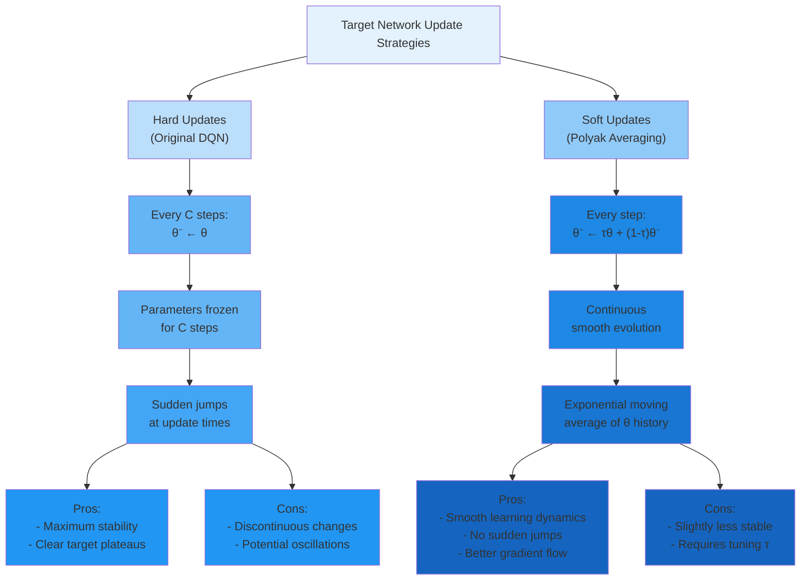
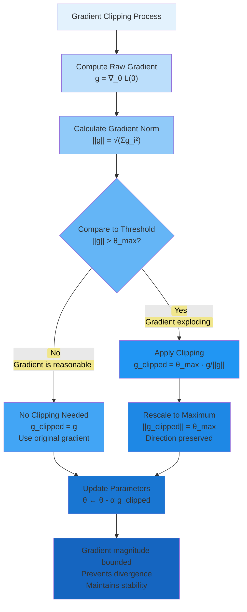

# C-6: Training Stability and Optimization for Deep RL

1. Training Stability Techniques
   - Soft Target Network Updates (Polyak Averaging)
   - Gradient Clipping Methods
   - Reward Clipping and Normalization
   - Huber Loss vs MSE Loss
   - Q-Value Clipping Strategies

2. Optimization and Convergence
   - Adam Optimizer for Deep RL
   - Learning Rate Schedules
   - Exploration-Exploitation Trade-off
   - Epsilon Decay Strategies
   - Convergence Guarantees and Limitations

3. Implementation Considerations
   - Replay Buffer Management
   - Batch Sampling Strategies
   - Event-Aware Prioritization
   - Computational Efficiency
   - Model Checkpointing and Recovery

------

##### Training Stability Techniques

While the foundational DQN algorithm with experience replay and target networks enables neural Q-learning, and Double DQN reduces overestimation bias, practical deployment reveals that deep reinforcement learning remains inherently more unstable than supervised learning. The combination of non-stationary targets, correlated data, and bootstrapping creates a challenging optimization landscape prone to catastrophic failures—Q-values diverging to infinity, policies collapsing to degenerate solutions, or training stagnating on plateaus.

This chapter explores the arsenal of techniques that transform DQN from a theoretically sound but practically fragile algorithm into a robust system capable of solving real-world control problems. We examine stability mechanisms that prevent divergence, optimization strategies that accelerate convergence, exploration schedules that balance discovery and exploitation, and implementation considerations that bridge the gap between algorithmic description and production deployment.

These techniques are not merely incremental improvements—they often determine whether training succeeds or fails entirely. Understanding their mathematical foundations, knowing when to apply each mechanism, and recognizing the trade-offs involved are essential skills for practitioners of deep reinforcement learning.

##### Soft Target Network Updates (Polyak Averaging)

###### From Hard Updates to Smooth Evolution

The original DQN algorithm employs **hard target network updates**: every $C$ steps, the target network parameters are completely replaced by copying from the policy network:

$$\large \theta^-(t) = \begin{cases} \theta(t) & \text{if } t \bmod C = 0 \ \theta^-(t-1) & \text{otherwise (frozen)} \end{cases}$$

This creates a step-function evolution where target parameters remain constant for $C$ steps, then jump discontinuously to new values. While this provides stability through frozen targets, the sudden jumps can cause learning instabilities—abrupt changes in target values may induce oscillations in the policy network's learning trajectory.

**Soft updates** (also called **Polyak averaging** or **exponential moving average updates**) provide an elegant alternative: update the target network continuously at every training step using a small blend of policy network parameters:

$$\large \theta^- \leftarrow \tau \theta + (1-\tau)\theta^-$$

where $\tau \in (0, 1)$ is the **update rate** or **soft update coefficient**, typically very small ($\tau \approx 0.001$ to $0.01$).

This can be written equivalently as:

$$\large \theta^- \leftarrow \theta^- + \tau(\theta - \theta^-)$$

showing that we move target parameters a small step toward policy parameters at each update.

##### Mathematical Properties of Exponential Moving Average

The soft update creates an **exponential moving average** of policy network parameters over time. After $k$ soft updates starting from $\theta^-(0) = \theta(0)$, the target network represents:

$$\large \theta^-(k) = \tau\sum_{i=0}^{k-1}(1-\tau)^i\theta(k-i) + (1-\tau)^k\theta(0)$$

This is a weighted average where recent policy parameters have higher weights, and weights decay exponentially for older parameters.

**Weight Distribution**: The weight on parameters from $i$ steps ago is:

$$\large w_i = \tau(1-\tau)^i$$

These weights sum to approximately 1 (exactly 1 in the limit):

$$\large \sum_{i=0}^{\infty}w_i = \tau\sum_{i=0}^{\infty}(1-\tau)^i = \tau \cdot \frac{1}{1-(1-\tau)} = \tau \cdot \frac{1}{\tau} = 1$$

**Effective Window Size**: The exponential decay means that parameters beyond a certain age contribute negligibly. The **effective window** (where cumulative weight reaches $1-e^{-1} \approx 63%$) is approximately:

$$\large k_{\text{eff}} = \frac{1}{\tau}$$

For $\tau = 0.001$, the effective window is $k_{\text{eff}} = 1000$ steps—the target network effectively averages over the last 1000 policy network versions.

##### Equivalence Between Hard and Soft Updates

Hard updates with frequency $C$ and soft updates with rate $\tau$ are approximately equivalent when:

$$\large \tau \approx \frac{1}{C}$$

**Derivation**: In hard updates, after $C$ steps the target network has had no updates from the last $C$ policy versions. In soft updates with $\tau = 1/C$, the cumulative weight on the last $C$ policy versions is:

$$\large \sum_{i=0}^{C-1}\tau(1-\tau)^i \approx \tau \cdot C = \frac{C}{C} = 1$$

So both methods effectively average over roughly the same window.

**Example**: DQN with $C = 1000$ hard updates is approximately equivalent to soft updates with $\tau = 0.001$.

However, the *manner* of averaging differs:

- **Hard updates**: Uniform weight over last $C$ versions, zero weight on older versions (rectangular window)
- **Soft updates**: Exponentially decaying weights over all history (exponential window)

The exponential weighting is generally smoother and more stable.

##### Benefits of Soft Updates

**Reduced Target Oscillation**: Hard updates can cause the target network to jump between different local optima as it copies the policy network. Soft updates smooth these transitions, providing more consistent learning signals.

**Better Gradient Flow**: The continuous evolution of target parameters means that the gradient landscape changes gradually rather than abruptly. This enables more stable gradient descent trajectories.

**Implicit Regularization**: By averaging over many parameter versions, soft updates provide temporal regularization—the target network represents a more stable, averaged policy rather than potentially noisy recent parameters.

**Hyperparameter Robustness**: Performance is less sensitive to the exact value of $\tau$ compared to sensitivity to $C$ in hard updates. A wide range of $\tau \in [0.001, 0.01]$ works well across diverse problems.

**Smoother Value Function Evolution**: The Q-values computed by the target network evolve continuously, creating smoother Bellman targets. This reduces the variance of TD errors and stabilizes learning.

##### Choosing the Soft Update Rate τ

The update rate $\tau$ trades off between target stability and responsiveness:

**Small τ** ($\tau = 0.001$):

- **Advantages**: Maximum stability—target changes very slowly; long effective window averages over many policy versions; good for noisy or unstable environments
- **Disadvantages**: Slow adaptation—target lags far behind policy improvements; may slow overall learning; target may become stale

**Large τ** ($\tau = 0.05$):

- **Advantages**: Fast adaptation—target quickly tracks policy improvements; responsive to rapid learning; shorter lag time
- **Disadvantages**: Less stability—target changes more rapidly; shorter effective window; may not fully decorrelate from policy network

**Typical Range**: $\tau \in [0.001, 0.01]$ works well for most applications

**Problem-Specific Guidelines**:

| Environment Characteristic        | Recommended $\tau$ |
| --------------------------------- | ------------------ |
| Highly stochastic (noisy rewards) | Small ($0.001$)    |
| Deterministic or low noise        | Moderate ($0.005$) |
| Rapid policy improvement needed   | Larger ($0.01$)    |
| Training is unstable              | Smaller ($0.001$)  |
| Sample complexity critical        | Moderate ($0.005$) |

**Adaptive τ Strategies**: Some advanced implementations adapt $\tau$ during training:

**Annealing**: Start with larger $\tau$ for fast early learning, decrease to smaller $\tau$ for stability near convergence:

$$\large \tau_t = \max(\tau_{\min}, \tau_{\text{start}} \cdot \tau_{\text{decay}}^t)$$

**Performance-Based**: Increase $\tau$ when learning is progressing smoothly, decrease when instability detected (measured by TD error variance).

##### Practical Implementation Details

**Component-Wise Update**: The soft update applies to every parameter (weight and bias) individually:

$$\large \theta^-_i \leftarrow \tau\theta_i + (1-\tau)\theta^-_i \quad \forall i$$

For a network with $P$ parameters, this requires $P$ scalar operations per update—computationally trivial compared to forward/backward passes.

**Numerical Stability**: With very small $\tau$ (e.g., $0.0001$), numerical precision can become an issue. The update $(1-\tau)\theta^- \approx \theta^-$ may lose the contribution from $\tau\theta$ due to floating-point rounding.

**Mitigation**: Use double precision (float64) for parameter updates, or ensure $\tau \geq 10^{-4}$.

**Initialization**: At the start of training, initialize target network as a copy of policy network:

$$\large \theta^-(0) = \theta(0)$$

This ensures both networks start from the same point, with divergence occurring gradually through soft updates.

**Worked Example**: Suppose a single weight parameter evolves as:

- **Step 0**: $\theta(0) = 0.5$, $\theta^-(0) = 0.5$ (initialized identical)

- **Step 1**: Policy network updated to $\theta(1) = 0.7$

  Soft update with $\tau = 0.01$: $$\large \theta^-(1) = 0.01(0.7) + 0.99(0.5) = 0.007 + 0.495 = 0.502$$

- **Step 2**: Policy network updated to $\theta(2) = 0.9$

  $$\large \theta^-(2) = 0.01(0.9) + 0.99(0.502) = 0.009 + 0.497 = 0.506$$

- **Step 3**: Policy network updated to $\theta(3) = 0.95$

  $$\large \theta^-(3) = 0.01(0.95) + 0.99(0.506) = 0.0095 + 0.501 = 0.510$$

The target parameter slowly tracks the policy parameter, always lagging behind. After 100 steps, if $\theta$ stabilizes at 0.95, then $\theta^-$ will gradually approach 0.95 but never quite reach it until $\theta$ stops changing.

------

#### Gradient Clipping Methods

##### The Problem of Exploding Gradients

Neural networks trained with reinforcement learning are particularly susceptible to **gradient explosion**, where gradient magnitudes become extremely large, causing unstable parameter updates. This occurs due to several RL-specific factors:

**Bootstrapping Amplification**: Q-learning uses estimates to update estimates. Errors in Q-values lead to errors in targets, which produce large gradients. These large gradients create even larger Q-value errors, creating a feedback loop:

$$\large \text{Large } Q(s',a') \to \text{Large target } y \to \text{Large } \delta \to \text{Large } \nabla\mathcal{L} \to \text{Even larger } Q$$

**Unbounded TD Errors**: Unlike supervised learning where labels are fixed, TD errors can grow arbitrarily large:

$$\large |\delta| = |r + \gamma\max_{a'}Q(s',a';\theta^-) - Q(s,a;\theta)|$$

If Q-values diverge or rare events produce extreme rewards, $|\delta|$ can reach hundreds or thousands.

**Deep Network Architecture**: For networks with $L$ layers, gradients can grow exponentially with depth due to the chain rule. If each layer amplifies gradients by factor $\lambda > 1$:

$$\large |\nabla_{\theta_1}\mathcal{L}| \sim \lambda^L |\nabla_{\theta_L}\mathcal{L}|$$

For $L = 5$ and $\lambda = 2$, gradients in early layers can be $32×$ larger than in the output layer.

**Numerical Overflow**: Modern hardware uses 32-bit floating point (float32). Gradients exceeding $\sim 10^{38}$ cause overflow to infinity (`inf`), immediately breaking training.

##### Norm-Based Gradient Clipping

The most common gradient clipping method constrains the $L_2$ norm of the gradient vector while preserving its direction:

$$\large \mathbf{g}*{\text{clipped}} = \begin{cases} \mathbf{g} & \text{if } |\mathbf{g}| \leq \theta*{\max} \ \theta_{\max} \cdot \frac{\mathbf{g}}{|\mathbf{g}|} & \text{if } |\mathbf{g}| > \theta_{\max} \end{cases}$$

where:

- $\mathbf{g} = \nabla_\theta\mathcal{L}(\theta)$ is the raw gradient
- $|\mathbf{g}| = \sqrt{\sum_i g_i^2}$ is the $L_2$ norm
- $\theta_{\max} > 0$ is the clipping threshold

**Geometric Interpretation**: If we visualize the gradient as a vector in parameter space pointing toward steepest descent, norm clipping rescales this vector to have maximum length $\theta_{\max}$ while preserving its direction. We still move in the correct direction, just with bounded step size.

**Properties**:

- **Direction preservation**: $\text{direction}(\mathbf{g}_{\text{clipped}}) = \text{direction}(\mathbf{g})$
- **Magnitude bounded**: $|\mathbf{g}*{\text{clipped}}| \leq \theta*{\max}$
- **No clipping for small gradients**: If $|\mathbf{g}| \leq \theta_{\max}$, no modification occurs

##### Alternative Clipping Strategies

**Per-Parameter Clipping** (Element-wise):

Clip each gradient component independently:

$$\large g_i^{\text{clipped}} = \max(-\theta_{\max}, \min(\theta_{\max}, g_i))$$

**Advantages**:

- Simple to implement
- No norm computation needed
- Each parameter has bounded gradient

**Disadvantages**:

- Distorts gradient direction (no longer points toward steepest descent)
- Can significantly alter the update direction
- Less principled than norm-based clipping

**Adaptive Clipping**:

Set the threshold based on recent gradient statistics:

$$\large \theta_{\max}(t) = \text{mean}(|\mathbf{g}|*{t-k:t}) + 2\cdot\text{std}(|\mathbf{g}|*{t-k:t})$$

Clips gradients that are statistical outliers (>2 standard deviations) while allowing natural variation.

**Advantages**:

- Automatically adapts to gradient scale
- No manual threshold tuning
- Adjusts as training progresses

**Disadvantages**:

- Requires maintaining gradient history
- More complex implementation
- May not respond quickly to sudden divergence

**Percentile-Based Clipping**:

Set threshold to capture a certain percentile (e.g., 99th) of gradient norms observed in a recent window:

$$\large \theta_{\max} = \text{percentile}_{99}({|\mathbf{g}*t|}*{t-k}^{t})$$

Similar to adaptive clipping but uses percentiles instead of mean/std for robustness to outliers.

##### Choosing the Clipping Threshold

The threshold $\theta_{\max}$ should be large enough to allow natural learning dynamics but small enough to prevent catastrophic divergence.

**Too Small** ($\theta_{\max} = 0.1$):

- **Problem**: Clips even normal gradients, severely limiting learning
- **Symptoms**: Very slow convergence, training plateaus, inability to escape local minima
- **Q-values**: Grow very slowly, under-responsive to new information

**Too Large** ($\theta_{\max} = 100$):

- **Problem**: Doesn't prevent explosion until damage is done
- **Symptoms**: Occasional spikes in loss, Q-value divergence, training crashes
- **Q-values**: Can explode to infinity before clipping activates

**Well-Tuned** ($\theta_{\max} = 1.0$ for typical problems):

- **Behavior**: Clips only occasional outlier gradients
- **Symptoms**: Stable training, smooth loss curves, no crashes
- **Clipping frequency**: 1-5% of updates clipped

**Practical Guidelines by Problem Scale**:

| Reward Scale                | Typical Gradients            | Recommended $\theta_{\max}$ |
| --------------------------- | ---------------------------- | --------------------------- |
| Small ($r \in [-1, 1]$)     | $|\mathbf{g}| \sim 0.01-0.1$ | $0.5$                       |
| Medium ($r \in [-10, 10]$)  | $|\mathbf{g}| \sim 0.1-1$    | $1.0$                       |
| Large ($r \in [-100, 100]$) | $|\mathbf{g}| \sim 1-10$     | $10.0$                      |

**Calibration Procedure**:

1. Run training without clipping for 100-1000 steps
2. Log gradient norms: ${|\mathbf{g}_t|}$
3. Set $\theta_{\max} = \text{percentile}_{95}({|\mathbf{g}_t|})$
4. This clips only the top 5% largest gradients

##### Impact on Learning Dynamics

**Benefits of Gradient Clipping**:

**Prevents Divergence**: Most importantly, clipping prevents catastrophic failures where Q-values explode to infinity. Even with aggressive learning rates or unfortunate initialization, training remains bounded.

**Enables Larger Learning Rates**: With clipping as a safety mechanism, we can use larger learning rates $\alpha$ to accelerate learning without fear of occasional large gradients causing instability.

**Reduces Variance**: By capping extreme gradients, clipping reduces the variance of parameter updates, leading to smoother optimization trajectories.

**Improves Robustness**: Training becomes less sensitive to hyperparameters, random seeds, and environmental variations that might otherwise cause divergence.

**Costs and Trade-offs**:

**Slows Learning on Large Errors**: When the network encounters transitions with legitimately large TD errors (important learning signal), clipping limits how much can be learned from them in a single step.

**Distorts Optimization**: Clipping changes the true gradient direction, potentially leading to suboptimal parameter updates. The network follows a modified gradient field rather than the true loss landscape.

**Masks Underlying Issues**: Aggressive clipping can hide fundamental problems in network architecture, reward scaling, or hyperparameter choices that should be addressed directly.

##### Worked Example: Gradient Clipping in Action

**Scenario**: Training DQN on traffic control, mini-batch of 64 transitions.

**Computed Gradients** for each parameter:

- Weights $\mathbf{W}_1$: gradient components $\in [-0.5, 0.8]$
- Weights $\mathbf{W}_2$: gradient components $\in [-1.2, 1.5]$
- Weights $\mathbf{W}_3$: gradient components $\in [-50.3, 48.7]$ (explosion!)
- Biases $\mathbf{b}_1, \mathbf{b}_2, \mathbf{b}_3$: gradient components $\in [-0.3, 0.4]$

**Total Gradient Norm**:

Suppose the network has 10,000 parameters. The squared norm is:

$$\large |\mathbf{g}|^2 = \sum_{\text{all params}} g_i^2$$

Most parameters have small gradients ($\sim 1$), but the 100 parameters in $\mathbf{W}_3$ have huge gradients ($\sim 50$):

$$\large |\mathbf{g}|^2 \approx 9900(1)^2 + 100(50)^2 = 9900 + 250000 = 259900$$

$$\large |\mathbf{g}| = \sqrt{259900} \approx 510$$

**Without Clipping**:

Parameter update with learning rate $\alpha = 0.0001$:

$$\large \theta \leftarrow \theta - 0.0001 \cdot \mathbf{g}$$

For parameters in $\mathbf{W}_3$ with $g_i = 50$:

$$\large \theta_i \leftarrow \theta_i - 0.0001(50) = \theta_i - 0.005$$

While this seems small, if $\theta_i$ was initially 0.1, it jumps to $-0.095$ (magnitude doubled). Repeated large updates cause divergence.

**With Clipping** ($\theta_{\max} = 1.0$):

Since $|\mathbf{g}| = 510 > 1.0$, apply clipping:

$$\large \mathbf{g}_{\text{clipped}} = 1.0 \cdot \frac{\mathbf{g}}{510} = \frac{\mathbf{g}}{510}$$

Now for parameters in $\mathbf{W}_3$:

$$\large g_i^{\text{clipped}} = \frac{50}{510} \approx 0.098$$

Parameter update:

$$\large \theta_i \leftarrow \theta_i - 0.0001(0.098) = \theta_i - 0.0000098$$

This is a tiny, safe update. The direction toward improving the loss is preserved (still negative update for positive gradient), but the magnitude is controlled.

##### Interaction with Optimizers

Gradient clipping should be applied **after** gradient computation but **before** the optimizer processes gradients.

**With SGD**:

1. Compute gradients: $\mathbf{g} = \nabla_\theta\mathcal{L}$
2. Clip gradients: $\mathbf{g} \leftarrow \text{clip}(\mathbf{g})$
3. Update: $\theta \leftarrow \theta - \alpha\mathbf{g}$

**With Adam** (or other adaptive optimizers):

1. Compute gradients: $\mathbf{g} = \nabla_\theta\mathcal{L}$
2. Clip gradients: $\mathbf{g} \leftarrow \text{clip}(\mathbf{g})$
3. Adam processes clipped gradients through momentum and adaptive learning rates
4. Update: $\theta \leftarrow \theta - \alpha \frac{\mathbf{m}}{\sqrt{\mathbf{v}} + \epsilon}$

**Important**: Clipping should precede Adam's internal processing. Adam's adaptive learning rates provide some natural gradient scaling, but clipping remains necessary for extreme outliers that exceed Adam's adaptation capacity.

------

#### Reward Clipping and Normalization

##### Motivation: Taming Reward Scales

Reinforcement learning algorithms can struggle when rewards span vastly different scales. Consider traffic signal control where:

- Normal timesteps: $r \in [-20, -5]$ (moderate queues)
- Accident scenarios: $r \in [-500, -100]$ (severe congestion)
- Emergency vehicle priority: $r = -1000$ (missed emergency vehicle)

These extreme variations create several problems:

**Q-Value Scale Instability**: Q-values are cumulative discounted rewards. If rewards range from $-20$ to $-1000$, Q-values can range from:

$$\large Q_{\min} \approx \frac{-1000}{1-\gamma} \approx -10000 \text{ (for } \gamma = 0.9\text{)}$$

to much smaller magnitudes for normal states. This huge dynamic range stresses neural network representational capacity.

**Gradient Imbalance**: Rare large-reward events dominate gradient magnitudes. A single transition with $r = -1000$ produces TD errors and gradients $\sim 50×$ larger than typical transitions. The network overfits to these rare events.

**Numerical Precision**: Modern neural networks use float32 arithmetic. Representing both $Q = -10000$ and $Q = -5$ with similar precision is challenging, leading to numerical errors.

##### Reward Clipping

**Definition**: Bound rewards to a fixed range $[r_{\min}, r_{\max}]$:

$$\large \tilde{r} = \max(r_{\min}, \min(r_{\max}, r))$$

Equivalently using the clip function:

$$\large \tilde{r} = \text{clip}(r, r_{\min}, r_{\max})$$

**Common Ranges**:

- Aggressive: $[-1, 1]$ (DQN on Atari often uses this)
- Moderate: $[-10, 10]$
- Conservative: $[-100, 100]$ (retains more information)

**Example**: Traffic control with raw rewards $r \in [-1000, 0]$, clip to $[-10, 0]$:

- Raw reward $r = -5$: Clipped $\tilde{r} = -5$ (unchanged)
- Raw reward $r = -120$: Clipped $\tilde{r} = -10$ (bounded)
- Raw reward $r = -800$: Clipped $\tilde{r} = -10$ (heavily compressed)

**Benefits**:

- **Bounded Q-values**: Q-values limited to predictable range $[\frac{r_{\min}}{1-\gamma}, \frac{r_{\max}}{1-\gamma}]$
- **Gradient stabilization**: All TD errors bounded, preventing extreme gradients
- **Simplified learning**: Network doesn't need to represent extreme values
- **Numerical stability**: Reduced risk of overflow/underflow

**Drawbacks**:

- **Information loss**: All rewards beyond thresholds indistinguishable
  - Accident causing $r = -200$ and $r = -800$ both become $\tilde{r} = -10$
  - Agent cannot differentiate severity levels
- **Suboptimal policies**: Without full reward information, learned policy may be suboptimal
- **Loss of scale**: Relative magnitudes destroyed—what was 10× worse is now equal

**When to Use Reward Clipping**:

- ✅ Extreme outliers (>10× typical rewards) that don't add information
- ✅ Numeric stability issues in training
- ✅ When relative ordering matters more than absolute magnitudes
- ❌ When reward magnitudes convey important distinctions
- ❌ If agent needs to learn fine-grained value differences

##### Reward Normalization

**Definition**: Transform rewards to zero mean and unit variance:

$$\large \tilde{r}_t = \frac{r_t - \mu_r}{\sigma_r + \epsilon}$$

where:

- $\mu_r$ is the running mean of observed rewards
- $\sigma_r$ is the running standard deviation
- $\epsilon > 0$ is a small constant (e.g., $10^{-8}$) preventing division by zero

**Running Statistics**: Update mean and variance online using exponential moving averages:

$$\large \mu_r^{(t)} = \rho \mu_r^{(t-1)} + (1-\rho) r_t$$

$$\large (\sigma_r^{(t)})^2 = \rho (\sigma_r^{(t-1)})^2 + (1-\rho) (r_t - \mu_r^{(t)})^2$$

where $\rho \approx 0.99$ controls the averaging window.

**Properties**:

- **Adaptive**: Automatically adjusts to reward distribution
- **Scale invariant**: Works regardless of original reward magnitude
- **Preserves relative information**: Unlike clipping, maintains distinctions between different reward levels
- **Centered distribution**: Mean reward becomes 0, simplifying learning

**Example Calculation**:

Suppose after 1000 timesteps, observed statistics are:

- Mean: $\mu_r = -45$
- Std dev: $\sigma_r = 78$

Raw rewards and their normalized versions:

- $r = -30$: $\tilde{r} = \frac{-30 - (-45)}{78} = \frac{15}{78} \approx 0.19$
- $r = -45$: $\tilde{r} = \frac{-45 - (-45)}{78} = 0$ (at mean)
- $r = -200$: $\tilde{r} = \frac{-200 - (-45)}{78} = \frac{-155}{78} \approx -1.99$

After normalization, typical rewards are in $[-2, 2]$ range, with extreme events at $\pm 3$ or beyond.

**Benefits**:

- **Stable learning**: Rewards consistently scaled across training
- **Better initialization**: Network weights can be initialized for normalized scale
- **Generalization**: Less sensitive to absolute reward magnitudes
- **Preserves information**: Unlike clipping, all reward distinctions maintained (scaled but not truncated)

**Drawbacks**:

- **Non-stationary**: As reward distribution shifts, normalization changes, creating moving target
- **Cold start**: Early training has poor statistics (few samples
