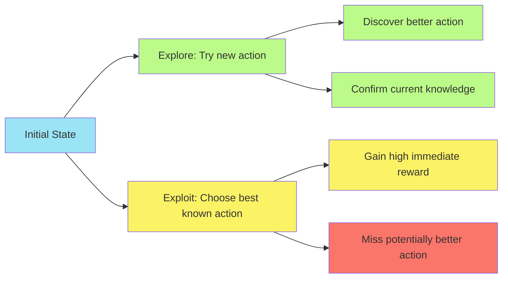
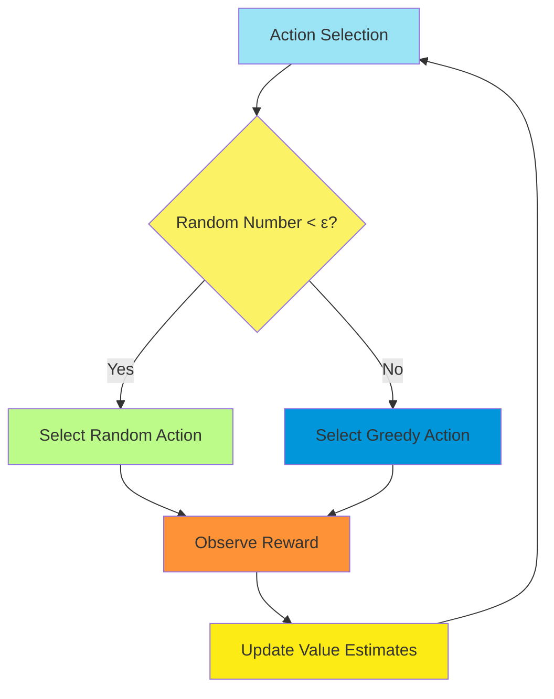
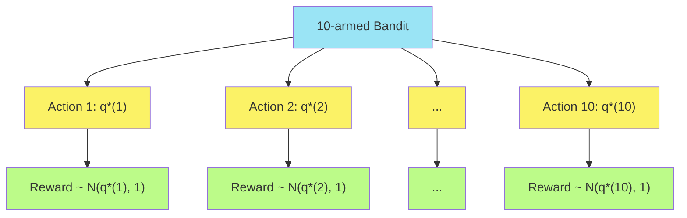
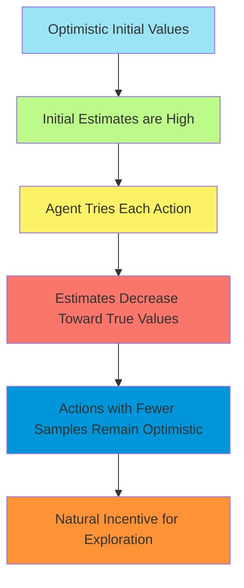
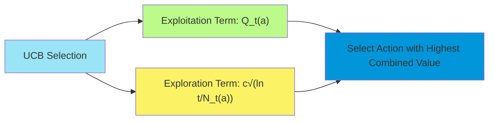
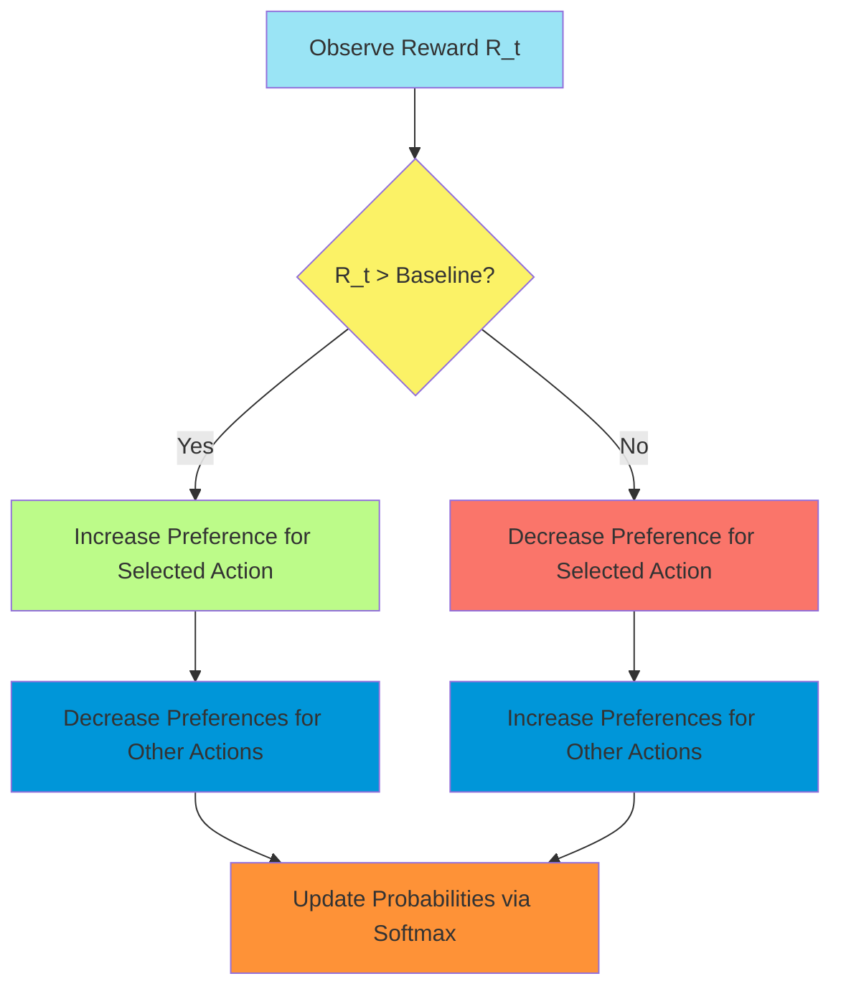

# C-1: Multi-armed Bandits: Exploration vs. Exploitation

1. The Exploration-Exploitation Dilemma

    - Nature of the k-armed Bandit Problem
    - The Value of Exploration
    - Regret and Reward Maximization
    - Formal Problem Definition

2. Action-Value Methods

    - Sample-Average Methods
    - Greedy and ε-greedy Policies
    - The 10-armed Testbed Environment
    - Performance Evaluation Metrics

3. Incremental Implementation

    - Incremental Update Rules
    - Relationship to Stochastic Approximation
    - Computational Efficiency Considerations

4. Tracking Non-stationary Problems

    - Constant Step-Size Parameters
    - Weighted Averages
    - Adapting to Changing Environments

5. Optimistic Initial Values

    - Encouraging Exploration
    - Limitations and Practical Considerations
    - Comparison with ε-greedy Methods

6. Upper Confidence Bound Action Selection

    - UCB Algorithm
    - Theoretical Guarantees
    - Performance Characteristics

7. Gradient Bandit Algorithms
    - Preference-Based Action Selection
    - Stochastic Gradient Ascent
    - Baseline Comparison
    - Theoretical Properties

#### The Exploration-Exploitation Dilemma

##### Nature of the k-armed Bandit Problem

The multi-armed bandit problem represents one of the simplest yet most profound frameworks in reinforcement learning.
Imagine you are faced with $k$ different actions (often called "arms" by analogy to slot machine levers), each
delivering rewards drawn from a probability distribution unique to that action. Your objective is to maximize the total
reward obtained over time, but there's a fundamental challenge: you don't know in advance which actions yield the
highest rewards.

This scenario derives its name from gambling terminology, where a "one-armed bandit" refers to a slot machine with one
lever. In our case, we have $k$ such levers, hence "k-armed bandit." Each time you pull a lever (take an action), you
receive a numerical reward sampled from a probability distribution associated with that specific lever.

The key characteristic that makes this problem challenging is that you initially have no information about the reward
distributions. You must simultaneously:

1. Discover which actions yield the highest rewards (exploration)
2. Select those high-reward actions to maximize your cumulative reward (exploitation)

Mathematically, we can define the expected reward for each action $a$ as:

$$q_*(a) = \mathbb{E}[R_t | A_t = a]$$

Where $R_t$ represents the reward at time $t$, and $A_t$ is the action selected at time $t$. The value $q_*(a)$ is the
true value of action $a$, which is unknown to the decision-maker.

##### The Value of Exploration

Exploration involves trying actions to learn about their reward distributions. This is essential because:

1. Without exploration, we might never discover that some initially unpromising actions actually yield higher long-term
   rewards
2. The environment may change over time, requiring us to continuously reassess our understanding

However, exploration comes at a cost—time spent exploring suboptimal actions means potentially foregoing higher
immediate rewards. Consider this example:



This tension between gaining new knowledge (exploration) and using existing knowledge (exploitation) is fundamental not
just to reinforcement learning but to many decision-making problems in economics, psychology, and even everyday life.

##### Regret and Reward Maximization

The concept of regret provides a formal way to measure the effectiveness of a bandit algorithm. Regret is defined as the
difference between the reward that could have been obtained by always selecting the optimal action and the reward
actually obtained.

If we denote the optimal action as $a^*$ (the action with the highest true value $q_*(a)$), the regret after $T$ steps
is:

$$\text{Regret}*T = T \times q**(a^*) - \sum_{t=1}^{T} \mathbb{E}[R_t]$$

A good bandit algorithm aims to minimize regret, which is equivalent to maximizing the total expected reward. The
challenge is that minimizing regret requires knowledge of the optimal action—information we don't have in advance.

This leads to a theoretical result known as the "no-free-lunch theorem" for bandit problems: any algorithm that performs
well on some bandit problems must necessarily perform poorly on others, unless it has prior knowledge about the specific
problem structure.

##### Formal Problem Definition

We can formally define the k-armed bandit problem as follows:

1. At each time step $t = 1, 2, 3, ...$, the agent:
    - Selects an action $A_t \in {1, 2, ..., k}$
    - Receives a reward $R_t$ where $\mathbb{E}[R_t | A_t = a] = q_*(a)$
2. The goal is to maximize the expected total reward: $\mathbb{E}[\sum_{t=1}^{T} R_t]$
3. The agent maintains estimates of the action values, denoted $Q_t(a)$, which are updated based on observed rewards
4. The agent's policy determines how it selects actions based on the estimated values and possibly other factors like
   exploration mechanisms

The k-armed bandit problem serves as a fundamental building block for understanding more complex reinforcement learning
scenarios. While it doesn't involve sequential state transitions (as in Markov Decision Processes), it captures the
essential exploration-exploitation dilemma that characterizes all reinforcement learning problems.

#### 2. Action-Value Methods

##### Sample-Average Methods

To make decisions in a bandit problem, we need to estimate the value of each action based on the rewards we've observed.
The most straightforward approach is to use sample averages.

If by time $t$, we have selected action $a$ for $N_t(a)$ times and received rewards $R_1, R_2, ..., R_{N_t(a)}$, then
the sample-average estimate of the action's value is:

$$Q_t(a) = \frac{\sum_{i=1}^{N_t(a)} R_i}{N_t(a)}$$

This is simply the average of all rewards received when taking action $a$. As the number of samples increases, this
estimate will converge to the true action value $q_*(a)$ by the law of large numbers.

The sample-average method has several important properties:

1. **Unbiasedness**: The expected value of $Q_t(a)$ equals $q_*(a)$, making it an unbiased estimator
2. **Consistency**: As $N_t(a) \rightarrow \infty$, $Q_t(a) \rightarrow q_*(a)$ with probability 1
3. **Variance Reduction**: The variance of the estimate decreases as $\frac{1}{N_t(a)}$, meaning more samples lead to
   more precise estimates

##### Greedy and ε-greedy Policies

Once we have estimates for each action's value, we need a strategy (policy) for selecting actions. Two fundamental
approaches are:

1. **Greedy Policy**: Always select the action with the highest estimated value:

    $$A_t = \arg\max_a Q_t(a)$$

    This maximizes immediate expected reward but provides no exploration.

2. **ε-greedy Policy**: With probability $1-\varepsilon$, select the greedy action; with probability $\varepsilon$,
   select a random action uniformly:

    $$A_t = \begin{cases} \arg\max_a Q_t(a) & \text{with probability } 1-\varepsilon \ \text{random action} & \text{with probability } \varepsilon \end{cases}$$

    This balances exploitation (through greedy selection) with exploration (through random selection).

The parameter $\varepsilon$ controls the exploration rate: higher values increase exploration but potentially reduce
immediate rewards. The optimal value of $\varepsilon$ depends on the specific problem characteristics and time horizon.



##### The 10-armed Testbed Environment

To evaluate bandit algorithms empirically, researchers commonly use a standardized testbed called the "10-armed
testbed." This environment consists of:

1. 10 actions (k=10)
2. True action values $q_*(a)$ drawn from a normal distribution $\mathcal{N}(0, 1)$
3. Rewards for each action drawn from a normal distribution $\mathcal{N}(q_*(a), 1)$

This creates a scenario where the true values of actions differ, but their rewards are noisy, making it challenging to
identify the best actions without sufficient sampling.

The 10-armed testbed allows us to evaluate algorithms by averaging performance over many independent bandit problems
(typically 2000 or more), providing statistically meaningful comparisons between different approaches.



##### Performance Evaluation Metrics

To evaluate the effectiveness of bandit algorithms, several metrics are commonly used:

1. **Average Reward**: The mean reward obtained per time step, which directly measures how well the algorithm maximizes
   rewards.
2. **Percentage of Optimal Actions**: The frequency with which the algorithm selects the truly best action (the one with
   the highest $q_*(a)$), which measures how well it identifies the optimal action.
3. **Regret**: The cumulative difference between the reward that could have been obtained by always selecting the
   optimal action and the reward actually obtained.
4. **Learning Rate**: How quickly the algorithm converges to selecting the optimal action or achieving near-optimal
   rewards.

These metrics allow us to compare different approaches across dimensions of immediate performance, long-term learning,
and the exploration-exploitation balance.

For example, when comparing greedy and ε-greedy policies on the 10-armed testbed, we typically observe:

- Greedy policies perform well initially if lucky in their early samples but often get stuck with suboptimal actions
- ε-greedy policies may have lower immediate performance due to exploration but achieve higher long-term rewards by
  discovering better actions
- The optimal value of ε depends on factors like the variance of rewards and the time horizon of interest

The empirical evaluation of these metrics provides insights into which algorithms are most suitable for specific bandit
scenarios and helps guide the development of more sophisticated approaches.

#### 3. Incremental Implementation

##### Incremental Update Rules

While the sample-average method provides a conceptually clear way to estimate action values, recalculating the entire
average from scratch each time becomes computationally inefficient as the number of samples grows. Incremental update
rules address this by adjusting the current estimate based on each new reward.

For action value estimates, the incremental update takes the form:

$$Q_{n+1} = Q_n + \frac{1}{n}[R_n - Q_n]$$

Where:

- $Q_n$ is the estimate after $n-1$ rewards
- $R_n$ is the $n$th reward
- $Q_{n+1}$ is the updated estimate after incorporating the $n$th reward

This can be rewritten as:

$$Q_{n+1} = Q_n + \alpha_n [R_n - Q_n]$$

Where $\alpha_n = \frac{1}{n}$ is the step-size parameter. The term $[R_n - Q_n]$ represents the error in our
estimate—the difference between the observed reward and our current estimate.

The general form with arbitrary step-size parameter $\alpha$ is:

$$Q_{n+1} = Q_n + \alpha [R_n - Q_n]$$

This incremental update has several advantages:

1. It requires only $O(1)$ computation per update, regardless of how many samples we've seen
2. It needs only the current estimate and the new reward, not the entire history
3. It allows for more flexible weighting of recent vs. older rewards by adjusting $\alpha$

##### Relationship to Stochastic Approximation

The incremental update rule is a special case of stochastic approximation methods, a class of algorithms for finding
zeros or extrema of functions whose values can only be observed with random noise.

The general stochastic approximation update takes the form:

$$\theta_{t+1} = \theta_t + \alpha_t [f(\theta_t) + \epsilon_t]$$

Where:

- $\theta_t$ is the parameter being estimated
- $f(\theta_t)$ is the function being optimized
- $\epsilon_t$ is random noise
- $\alpha_t$ is a sequence of step sizes

For convergence to the true value, the step sizes typically need to satisfy:

$$\sum_{t=1}^{\infty} \alpha_t = \infty \quad \text{and} \quad \sum_{t=1}^{\infty} \alpha_t^2 < \infty$$

The first condition ensures that the steps are large enough to eventually overcome any initial errors, while the second
condition ensures that the steps eventually become small enough for convergence.

In the context of our bandit problem, the incremental update with $\alpha_n = \frac{1}{n}$ satisfies these conditions,
guaranteeing convergence to the true action values as the number of samples increases.

##### Computational Efficiency Considerations

The incremental implementation offers significant computational advantages:

1. **Memory Efficiency**: Only requires storing one value per action ($Q(a)$) and one count per action ($N(a)$)
2. **Time Efficiency**: Updates are $O(1)$ regardless of how many times an action has been selected
3. **Anytime Operation**: Provides a valid estimate at any point, allowing for continuous action selection

A practical implementation of an ε-greedy bandit algorithm using incremental updates would look like:

```
Initialize:
    Q(a) = 0, for all a ∈ {1, 2, ..., k}
    N(a) = 0, for all a ∈ {1, 2, ..., k}

Repeat for each step:
    With probability ε, select a random action A
    Otherwise, select A = argmax_a Q(a)

    Observe reward R
    N(A) ← N(A) + 1
    Q(A) ← Q(A) + (1/N(A))[R - Q(A)]
```

This algorithm maintains running estimates of each action's value and updates them efficiently after each observation,
while balancing exploration and exploitation through the ε-greedy policy.

For computationally constrained applications, this incremental approach is essential, as it allows bandit algorithms to
run on systems with limited memory and processing power while still converging to optimal behavior over time.

#### 4. Tracking Non-stationary Problems

##### Constant Step-Size Parameters

While the sample average method with $\alpha_n = \frac{1}{n}$ works well for stationary problems (where action values
don't change over time), many real-world scenarios involve non-stationary dynamics. For example, in financial markets,
the expected return of different investments changes over time.

In non-stationary environments, we need to give more weight to recent rewards than to older ones. One effective approach
is to use a constant step size $\alpha \in (0,1]$:

$$Q_{n+1} = Q_n + \alpha [R_n - Q_n]$$

This approach has several important properties:

1. It gives more weight to recent rewards: the contribution of reward $R_i$ to the current estimate decays by a factor
   of $(1-\alpha)$ for each subsequent reward.
2. The estimate can be written as a weighted average of past rewards:
   $$Q_{n+1} = (1-\alpha)^n Q_1 + \sum_{i=1}^n \alpha(1-\alpha)^{n-i} R_i$$
3. It effectively considers only the most recent $\frac{1}{\alpha}$ rewards (in terms of the weights being significant).

This approach allows the algorithm to adapt to changing reward distributions by gradually forgetting outdated
information.

##### Weighted Averages

The constant step-size update can be viewed as computing an exponentially weighted average, where the weight of each
past reward decays exponentially with its age:

$$Q_{n+1} = \sum_{i=1}^n \beta_i R_i$$

Where the weights $\beta_i$ sum to 1 and follow:

$$\beta_i = \alpha(1-\alpha)^{n-i}$$

This weighting scheme creates a "sliding window" effect, where:

- Recent rewards have the most influence on the current estimate
- Older rewards have progressively less influence
- Very old rewards are effectively forgotten

The decay rate is controlled by the step-size parameter $\alpha$:

- Larger $\alpha$ values result in faster forgetting (more emphasis on recent rewards)
- Smaller $\alpha$ values result in slower forgetting (more emphasis on history)


##### Adapting to Changing Environments

In non-stationary environments, the performance of different approaches varies dramatically:

1. **Sample Average Method** ($\alpha_n = \frac{1}{n}$):
    - Converges to the average of all past rewards
    - Cannot adapt to changes in the true action values
    - Performance degrades as the environment changes
2. **Constant Step Size** ($\alpha$ fixed):
    - Continuously adapts to recent reward patterns
    - Tracks changing action values with a lag dependent on $\alpha$
    - Never converges in the traditional sense but maintains bounded error

The optimal step size depends on:

- The rate of environmental change (faster changes require larger $\alpha$)
- The noise level in rewards (noisier rewards benefit from smaller $\alpha$)
- The detection-adaptation tradeoff (detecting changes vs. stable estimation)

Consider a scenario where the true action values perform a random walk:

$$q_*(a) \leftarrow q_*(a) + \sigma \mathcal{N}(0, 1)$$

Where $\sigma$ controls the magnitude of changes. In such environments:

- Constant step-size methods significantly outperform sample averages
- The optimal $\alpha$ increases with $\sigma$ (more change requires faster adaptation)
- Even with optimal settings, performance degrades as the environment becomes more non-stationary

More sophisticated approaches to non-stationary problems include:

- Adaptive step sizes that increase when change is detected
- Maintaining uncertainty estimates about action values
- Using contextual information to predict changes in action values

These methods enable reinforcement learning systems to operate effectively in dynamic, changing environments where the
relationships between actions and rewards evolve over time.

#### 5. Optimistic Initial Values

##### Encouraging Exploration

Another technique for balancing exploration and exploitation is optimistic initial value estimation. This approach works
by initializing the action value estimates to values higher than what we expect to encounter in reality.

The key idea is:

1. Initialize all action values optimistically: $Q_1(a) = Q_0 > \text{max}*a q**(a)$
2. When an action is selected, its estimated value will typically decrease toward its true value
3. This creates a natural incentive to try actions that haven't been selected many times

Mathematically, with incremental updating:

$$Q_{n+1}(a) = Q_n(a) + \frac{1}{n}[R_n - Q_n(a)]$$

The larger the initial value $Q_0$, the more exploration will occur before converging to a purely exploitative policy.

This approach effectively injects an exploration bonus for actions with fewer samples, as their estimates will remain
closer to the optimistic initial values.



##### Limitations and Practical Considerations

While optimistic initialization can be effective, it has several limitations:

1. **Initial Exploration Phase**: The approach creates a focused initial exploration phase, after which it may become
   purely exploitative. This makes it less suitable for non-stationary problems where continued exploration is
   necessary.
2. **Parameter Sensitivity**: The degree of exploration depends heavily on how optimistic the initial values are,
   requiring prior knowledge or careful tuning.
3. **Limited to Early Learning**: The effect of initialization diminishes over time as more rewards are observed, making
   this technique primarily useful in the early stages of learning.
4. **Reward Scale Dependence**: The appropriate level of optimism depends on the scale of rewards, making it difficult
   to set without domain knowledge.

In practice, implementations often:

- Combine optimistic initialization with other exploration strategies like ε-greedy
- Decay the influence of initial values more slowly to prolong exploration
- Reset value estimates periodically in non-stationary environments

Despite these limitations, optimistic initialization remains a powerful tool in the reinforcement learning toolbox,
especially for problems where exploration is primarily needed in the early learning stages.

##### Comparison with ε-greedy Methods

When comparing optimistic initialization to ε-greedy exploration, several differences emerge:

| Optimistic Initialization           | ε-greedy                                |
| ----------------------------------- | --------------------------------------- |
| Front-loaded exploration            | Consistent exploration throughout       |
| No explicit random actions          | Explicitly takes random actions         |
| Exploration decreases automatically | Exploration rate must be manually tuned |
| Biased initial value estimates      | Unbiased value estimates                |
| Generally higher initial regret     | More uniform regret distribution        |

Empirical studies on the 10-armed testbed show:

1. Optimistic methods typically achieve higher average rewards in early stages
2. ε-greedy methods maintain exploration and can perform better in the long run
3. Optimistic methods reach near-optimal performance more quickly in stationary environments
4. ε-greedy methods adapt better to changes in non-stationary environments

The choice between these approaches depends on:

- Whether the problem is stationary or non-stationary
- The time horizon of interest (short vs. long-term performance)
- Prior knowledge about the reward distribution
- Whether unbiased value estimates are required

In many practical applications, combining both approaches can yield superior performance: using optimistic
initialization to drive early exploration while maintaining a small ε value to ensure continued exploration throughout
the learning process.

#### 6. Upper Confidence Bound Action Selection

##### UCB Algorithm

Upper Confidence Bound (UCB) action selection represents a more sophisticated approach to balancing exploration and
exploitation. Unlike ε-greedy methods which explore randomly, UCB directs exploration toward actions with the most
uncertain values.

The UCB1 algorithm selects actions according to:

$$A_t = \arg\max_a \left[ Q_t(a) + c\sqrt{\frac{\ln t}{N_t(a)}} \right]$$

Where:

- $Q_t(a)$ is the estimated value of action $a$
- $N_t(a)$ is the number of times action $a$ has been selected
- $c$ is a parameter controlling the degree of exploration
- $t$ is the total number of actions taken so far

The second term represents an upper confidence bound on the true value of action $a$. This bound:

1. Increases with the logarithm of the total number of actions (encouraging exploration of all actions over time)
2. Decreases with the square root of the number of times the action has been selected (reducing exploration for
   well-sampled actions)



##### Theoretical Guarantees

UCB algorithms come with strong theoretical guarantees derived from the multi-armed bandit literature:

1. **Logarithmic Regret Bound**: The expected regret of UCB1 is bounded by $O(\ln T)$, which is provably optimal—no
   algorithm can achieve better than logarithmic regret in general.
2. **Concentration Inequalities**: The confidence bounds are based on Hoeffding's inequality, which bounds the
   probability that the sample average deviates from the true mean.
3. **Asymptotic Optimality**: As $t \rightarrow \infty$, the fraction of time spent on suboptimal actions approaches
   zero at an optimal rate.

The parameter $c$ controls the confidence level and the exploration-exploitation trade-off:

- Higher values of $c$ increase exploration
- Lower values of $c$ increase exploitation
- The theoretical optimal value is $c = \sqrt{2}$ for rewards in [0,1]

These guarantees make UCB particularly attractive for applications where theoretical performance bounds are important.

##### Performance Characteristics

In practice, UCB algorithms demonstrate several distinctive performance characteristics:

1. **Directed Exploration**: Unlike ε-greedy, UCB systematically explores actions with uncertain values rather than
   random actions.
2. **Diminishing Exploration**: The exploration bonus decreases as actions are sampled more frequently, naturally
   transitioning from exploration to exploitation.
3. **Contextual Awareness**: The algorithm automatically adjusts exploration based on the observed reward patterns and
   action selection history.
4. **Early Performance**: UCB typically performs better than ε-greedy in early stages because it prioritizes exploration
   more effectively.

On the 10-armed testbed, UCB typically shows:

- Faster identification of the optimal action compared to ε-greedy
- Higher average rewards, especially during early learning
- More consistent performance across different bandit problems
- Greater robustness to parameter settings

However, UCB also has limitations:

- It requires maintaining counts for each action
- The exploration term assumes stationary reward distributions
- It can be sensitive to reward scaling
- The logarithmic growth term can lead to over-exploration in some scenarios

Despite these limitations, UCB represents one of the most theoretically well-founded and practically effective
approaches to the exploration-exploitation dilemma in multi-armed bandit problems.

#### 7. Gradient Bandit Algorithms

##### Preference-Based Action Selection

Gradient bandit algorithms take a fundamentally different approach to action selection. Rather than estimating action
values directly, they learn a numerical preference for each action and select actions based on the softmax (Boltzmann)
distribution over these preferences.

For each action $a$, we maintain a preference value $H_t(a)$. The probability of selecting action $a$ at time $t$ is:

$$\pi_t(a) = \frac{e^{H_t(a)}}{\sum_{b=1}^k e^{H_t(b)}}$$

This softmax function ensures that:

- Actions with higher preferences are more likely to be selected
- All actions have non-zero selection probability (ensuring continued exploration)
- The relative differences between preferences determine the selection probabilities

Initially, all preferences are equal (often set to zero), resulting in a uniform random policy. As learning progresses,
the preferences are updated to favor actions that yield higher rewards.

##### Stochastic Gradient Ascent

Gradient bandit algorithms update the preferences using stochastic gradient ascent to maximize the expected reward.
After selecting action $A_t$ and observing reward $R_t$, the preferences are updated as follows:

$$H_{t+1}(A_t) = H_t(A_t) + \alpha (R_t - \bar{R}*t)(1 - \pi_t(A_t))$$
$$H*{t+1}(a) = H_t(a) - \alpha (R_t - \bar{R}_t)\pi_t(a) \quad \text{for all } a \neq A_t$$

Where:

- $\alpha$ is the step-size parameter
- $\bar{R}_t$ is the average of all rewards up to time $t$
- $(R_t - \bar{R}_t)$ works as a baseline for comparison

These update rules have an intuitive interpretation:

- If the reward is above average, increase the preference for the selected action
- If the reward is below average, decrease the preference for the selected action
- Adjust the preferences for non-selected actions in the opposite direction

The magnitude of updates depends on:

1. How surprising the reward is (difference from baseline)
2. How far the current policy is from deterministic (room for improvement)
3. The step-size parameter $\alpha$

##### Baseline Comparison

The term $\bar{R}_t$ serves as a baseline for reward comparison and plays a crucial role in gradient bandit algorithms.
Without a baseline (setting $\bar{R}_t = 0$), the algorithm would still converge, but with higher variance and slower
learning.

The baseline provides several benefits:

1. **Variance Reduction**: Comparing rewards to a baseline reduces the variance of updates
2. **Scale Invariance**: Makes the algorithm less sensitive to the absolute scale of rewards
3. **Faster Convergence**: Allows for larger step sizes without divergence

The average reward is a natural choice for the baseline, but other options include:

- A moving average of recent rewards
- A learned state-value function (in contextual bandits)
- An optimized baseline that minimizes update variance

Mathematically, the baseline doesn't affect the expected update direction (the gradient remains unbiased) but
significantly improves the algorithm's sample efficiency.



##### Theoretical Properties

Gradient bandit algorithms have several important theoretical properties:

1. **Policy Gradient Theory**: The update rules can be derived from the policy gradient theorem in reinforcement
   learning, making them theoretically well-founded.
2. **Convergence Guarantees**: With appropriately decreasing step sizes, gradient bandits converge to a locally optimal
   policy.
3. **Softmax Parameterization**: The softmax function ensures that action probabilities remain valid (non-negative and
   sum to one) throughout learning.
4. **Natural Exploration-Exploitation Balance**: The algorithm naturally balances exploration and exploitation through
   the probabilistic action selection.

The algorithm can be shown to follow the gradient of the expected reward with respect to the preferences:

$$\nabla_{\mathbf{H}} \mathbb{E}[R_t] = \mathbb{E}[(R_t - \bar{R}*t)(\nabla*{\mathbf{H}} \ln \pi_t(A_t))]$$

Where $\nabla_{\mathbf{H}}$ denotes the gradient with respect to the preference vector $\mathbf{H}$.

This gradient ascent property means that the algorithm is constantly moving the policy in the direction that most
rapidly increases the expected reward, making it particularly effective for finding the optimal action in complex or
noisy environments.

Empirically, gradient bandit algorithms often outperform simpler methods like ε-greedy, especially when:

- The number of actions is large
- The reward distributions are non-stationary
- The differences between action values are small relative to their variance

The primary limitations are:

- Higher computational complexity than simpler methods
- Potential sensitivity to the step-size parameter
- Sometimes slower initial learning compared to optimistic methods

Despite these limitations, gradient bandit algorithms represent a powerful approach to the multi-armed bandit problem,
especially in scenarios where robust performance across a wide range of problems is desired.
