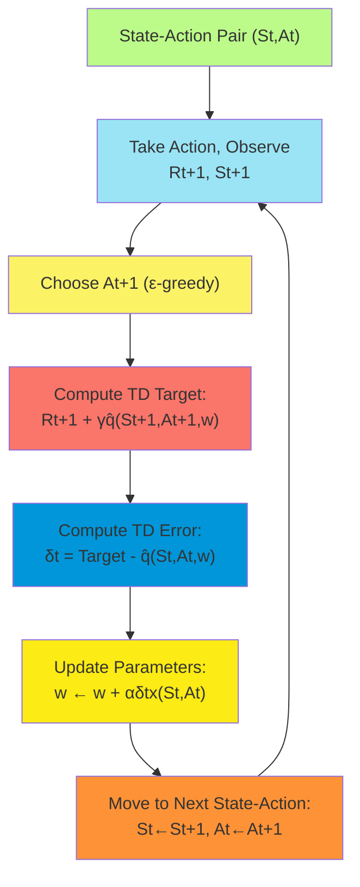
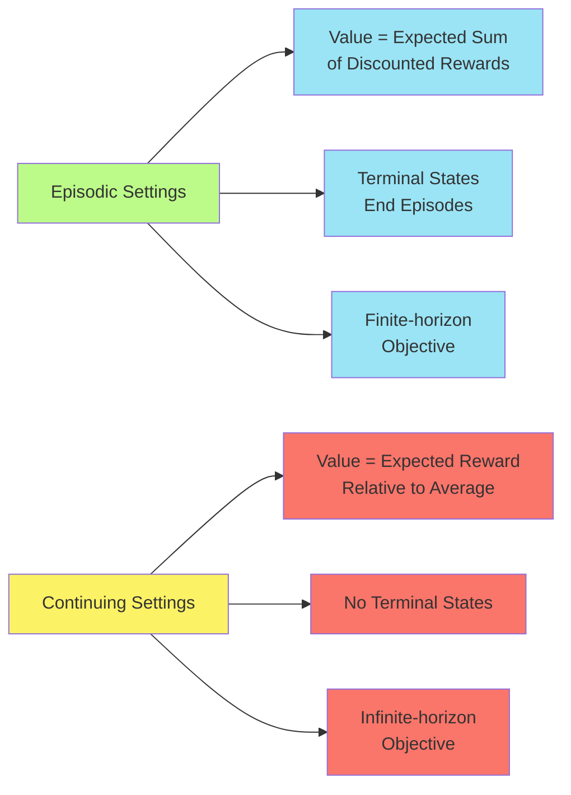
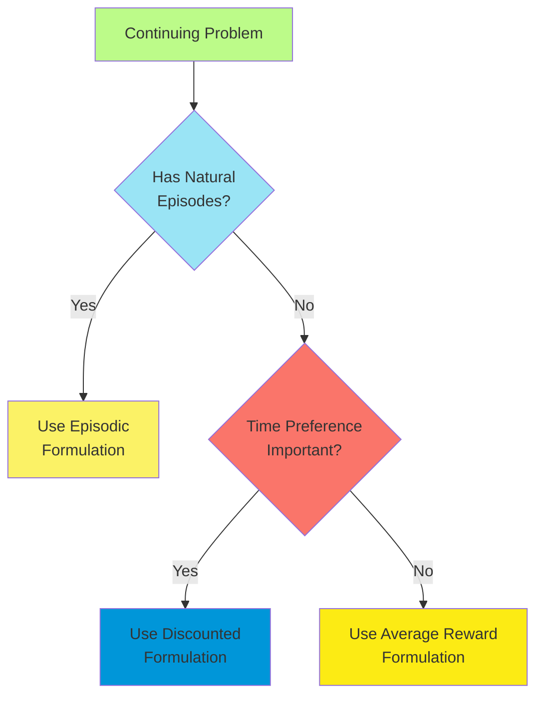
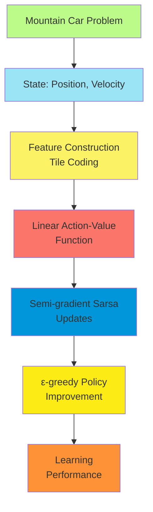

# C-10: On-policy Control with Approximation

1. Episodic Semi-gradient Control

    - Linear Action-Value Function Approximation
    - The Control Problem with Approximation
    - Semi-gradient n-step Sarsa

2. Average Reward: Continuing Tasks
    - The Continuing Control Problem Setting
    - Average Reward Formulation
    - Differential Semi-gradient n-step Sarsa
    - Discounting vs. Average Reward
    - Convergence Properties of Control Methods

#### Episodic Semi-gradient Control

##### Linear Action-Value Function Approximation

In on-policy control problems, we need to estimate action-values $q_\pi(s,a)$ rather than just state values $v_\pi(s)$.
The action-value function maps state-action pairs to expected returns and serves as the foundation for policy
improvement. With function approximation, we parameterize this mapping as $\hat{q}(s,a,\mathbf{w})$.

Linear approximation remains one of the most important approaches due to its simplicity, theoretical guarantees, and
empirical effectiveness. The linear approximation of action-values takes the form:

$\hat{q}(s,a,\mathbf{w}) = \mathbf{w}^T\mathbf{x}(s,a) = \sum_{i=1}^d w_i x_i(s,a)$

Where:

- $\mathbf{x}(s,a)$ is a feature vector for the state-action pair
- $\mathbf{w}$ is the weight vector being learned
- $d$ is the number of features

Several approaches exist for constructing the feature vector $\mathbf{x}(s,a)$:

1. **State-action features**: Create features that directly encode properties of state-action pairs.

2. **State features with action separation**: Use separate weights for each action:
   $\hat{q}(s,a,\mathbf{w}) = \mathbf{w}_a^T\mathbf{x}(s)$

    With this approach, the full weight vector is the concatenation of action-specific weights:
    $\mathbf{w} = [\mathbf{w}_1, \mathbf{w}*2, ..., \mathbf{w}*{|\mathcal{A}|}]$

3. **Shared state features with action features**: Combine state features with action-dependent features:
   $\mathbf{x}(s,a) = \mathbf{x}(s) \otimes \mathbf{x}(a)$

    Where $\otimes$ might be concatenation, outer product, or other combination operations.

The gradient of the linear approximation is again simply the feature vector:

$\nabla \hat{q}(s,a,\mathbf{w}) = \mathbf{x}(s,a)$

This simplifies the update rules for semi-gradient methods.

##### The Control Problem with Approximation

The control problem in reinforcement learning involves both prediction (value function estimation) and policy
improvement. With function approximation, this becomes more challenging due to several factors:

1. **Approximate representation**: The true value function may not be perfectly representable in our function class.
2. **Moving target**: The target policy keeps changing, making convergence analysis more complex.
3. **Exploration requirements**: We need to balance exploitation of current knowledge with exploration of uncertain
   options.

The general approach for on-policy control with approximation follows the generalized policy iteration (GPI) framework:

1. **Policy evaluation**: Estimate $\hat{q}(s,a,\mathbf{w}) \approx q_\pi(s,a)$ using semi-gradient methods.

2. **Policy improvement**: Derive an improved policy based on the current value estimates, typically using
   $\epsilon$-greedy:

    $\pi(a|s) = \begin{cases} 1-\epsilon+\frac{\epsilon}{|\mathcal{A}|} & \text{if } a = \arg\max_{a'} \hat{q}(s,a',\mathbf{w}) \ \frac{\epsilon}{|\mathcal{A}|} & \text{otherwise} \end{cases}$

These steps are usually interleaved, with each experience leading to both value function updates and policy changes.
This interleaving is crucial for computational efficiency and helps the agent adapt to changing environments.

The objective in control is typically to maximize the expected return, which with function approximation translates to
minimizing the error between the approximate and true action-values. However, as with prediction, semi-gradient methods
do not directly minimize this error but instead converge to related fixed points.

##### Semi-gradient n-step Sarsa

The semi-gradient Sarsa algorithm can be extended to use n-step returns, providing a more flexible trade-off between
bias and variance. The n-step return from time $t$ is defined as:

$G_{t:t+n} = R_{t+1} + \gamma R_{t+2} + ... + \gamma^{n-1}R_{t+n} + \gamma^n \hat{q}(S_{t+n},A_{t+n},\mathbf{w})$

The update rule then becomes:

$\mathbf{w}*{t+n} = \mathbf{w}*{t+n-1} + \alpha [G_{t:t+n} - \hat{q}(S_t,A_t,\mathbf{w}*{t+n-1})] \nabla \hat{q}(S_t,A_t,\mathbf{w}*{t+n-1})$

For linear function approximation, this simplifies to:

$\mathbf{w}*{t+n} = \mathbf{w}*{t+n-1} + \alpha [G_{t:t+n} - \hat{q}(S_t,A_t,\mathbf{w}_{t+n-1})] \mathbf{x}(S_t,A_t)$

The complete n-step semi-gradient Sarsa algorithm is as follows:

1. Initialize parameter vector $\mathbf{w}$ arbitrarily
2. Repeat for each episode: a. Initialize state $S_0$ and select action $A_0$ using policy derived from $\hat{q}$ (e.g.,
   $\epsilon$-greedy) b. For $t = 0, 1, 2, ...$: i. Take action $A_t$, observe $R_{t+1}$ and $S_{t+1}$ ii. If $S_{t+1}$
   is terminal: - $G \leftarrow R_{t+1}$ -
   $\mathbf{w} \leftarrow \mathbf{w} + \alpha [G - \hat{q}(S_t,A_t,\mathbf{w})] \nabla \hat{q}(S_t,A_t,\mathbf{w})$ - Go
   to next episode iii. Select action $A_{t+1}$ using policy derived from $\hat{q}$ (e.g., $\epsilon$-greedy) iv. If
   $t \geq n-1$: - $G \leftarrow \sum_{i=1}^n \gamma^{i-1}R_{t-n+1+i} + \gamma^n \hat{q}(S_{t+1},A_{t+1},\mathbf{w})$ -
   $\mathbf{w} \leftarrow \mathbf{w} + \alpha [G - \hat{q}(S_{t-n+1},A_{t-n+1},\mathbf{w})] \nabla \hat{q}(S_{t-n+1},A_{t-n+1},\mathbf{w})$

The n-step approach offers several advantages:

1. **Flexible bias-variance trade-off**: The parameter $n$ allows adjusting between one-step TD methods ($n=1$) and
   Monte Carlo methods ($n=\infty$).
2. **Potentially faster learning**: By incorporating information from multiple steps, learning can be more efficient.
3. **Reduced variance**: Compared to Monte Carlo methods, n-step methods typically have lower variance while still
   reducing the bias from bootstrapping.
4. **Bridging temporal gaps**: In problems with delayed rewards, n-step methods can more effectively propagate reward
   information.

The choice of $n$ is an important hyperparameter:

- Small $n$: More bootstrapping, potentially more bias, less variance
- Large $n$: Less bootstrapping, less bias, more variance
- Optimal $n$: Problem-dependent, requiring tuning

Forward view and backward view implementations (similar to TD(λ)) are possible, with the backward view typically being
more computationally efficient.

#### Average Reward: Continuing Tasks

##### The Continuing Control Problem Setting

Many reinforcement learning problems naturally occur in a continuing setting without clear episode boundaries. Examples
include:

- Process control in manufacturing
- Resource management in computer systems
- Continuous robotic control
- Traffic signal control

In these continuing problems:

- There are no terminal states or episode boundaries
- The agent-environment interaction continues indefinitely
- Traditional episodic formulations become problematic

Continuing tasks present several challenges:

1. **Infinite returns**: With standard discounted formulations, returns would be infinite.
2. **Reward scaling**: Small changes in reward can lead to large changes in returns due to infinite horizons.
3. **Steady-state performance**: The goal is often to optimize long-term performance rather than transient behavior.
4. **No natural reset**: The agent must learn while continuously interacting with the environment.

The average reward formulation addresses these challenges by focusing on the long-term average reward rate rather than
cumulative discounted returns.

##### Average Reward Formulation

In the average reward formulation, we define the objective as maximizing the long-term average reward:

$r(\pi) = \lim_{h\to\infty} \frac{1}{h}\mathbb{E}\left[\sum_{t=1}^{h}R_t | S_0, A_{0:t-1} \sim \pi\right]$

For ergodic Markov decision processes (where any state can eventually be reached from any other state), this average
reward is independent of the starting state.

The value functions in the average reward setting are defined relative to this average:

1. **Differential state-value function**:
   $v_\pi(s) = \mathbb{E}*\pi\left[\sum*{k=1}^{\infty}(R_{t+k} - r(\pi)) | S_t = s\right]$
2. **Differential action-value function**:
   $q_\pi(s,a) = \mathbb{E}*\pi\left[\sum*{k=1}^{\infty}(R_{t+k} - r(\pi)) | S_t = s, A_t = a\right]$

These differential value functions represent the expected sum of differences between rewards and the average reward when
starting from a particular state (or state-action pair) and following policy $\pi$.

The Bellman equations for the differential value functions are:

1. **Differential state-value function**: $v_\pi(s) = \sum_a \pi(a|s) \sum_{s',r} p(s',r|s,a)[r - r(\pi) + v_\pi(s')]$
2. **Differential action-value function**:
   $q_\pi(s,a) = \sum_{s',r} p(s',r|s,a)[r - r(\pi) + \sum_{a'} \pi(a'|s') q_\pi(s',a')]$

The average reward formulation has the advantage of focusing on the long-term sustainable performance, making it
particularly suitable for continuing tasks.

##### Differential Semi-gradient n-step Sarsa

The semi-gradient n-step Sarsa algorithm can be adapted to the average reward setting by using differential returns:

1. Estimate the average reward $\bar{R}$ using a running average: $\bar{R}_{t+1} = \bar{R}_t + \beta\delta_t$

    Where $\beta$ is a step-size parameter and $\delta_t$ is the TD error.

2. Define the differential n-step return:
   $G_{t:t+n} = R_{t+1} - \bar{R} + R_{t+2} - \bar{R} + ... + R_{t+n} - \bar{R} + \hat{q}(S_{t+n},A_{t+n},\mathbf{w})$

    Or more compactly: $G_{t:t+n} = \sum_{i=1}^{n}(R_{t+i} - \bar{R}) + \hat{q}(S_{t+n},A_{t+n},\mathbf{w})$

3. Update the parameter vector:
   $\mathbf{w}*{t+n} = \mathbf{w}*{t+n-1} + \alpha [G_{t:t+n} - \hat{q}(S_t,A_t,\mathbf{w}*{t+n-1})] \nabla \hat{q}(S_t,A_t,\mathbf{w}*{t+n-1})$

The complete differential semi-gradient n-step Sarsa algorithm is:

1. Initialize parameter vector $\mathbf{w}$ arbitrarily and average reward estimate $\bar{R} \in \mathbb{R}$
2. Initialize state $S_0$ and select action $A_0$ using policy derived from $\hat{q}$ (e.g., $\epsilon$-greedy)
3. For $t = 0, 1, 2, ...$: a. Take action $A_t$, observe $R_{t+1}$ and $S_{t+1}$ b. Select action $A_{t+1}$ using policy
   derived from $\hat{q}$ (e.g., $\epsilon$-greedy) c.
   $\delta \leftarrow R_{t+1} - \bar{R} + \hat{q}(S_{t+1},A_{t+1},\mathbf{w}) - \hat{q}(S_t,A_t,\mathbf{w})$ d.
   $\bar{R} \leftarrow \bar{R} + \beta\delta$ e. If $t \geq n-1$: i.
   $G \leftarrow \sum_{i=1}^{n}(R_{t-n+1+i} - \bar{R}) + \hat{q}(S_{t+1},A_{t+1},\mathbf{w})$ ii.
   $\mathbf{w} \leftarrow \mathbf{w} + \alpha [G - \hat{q}(S_{t-n+1},A_{t-n+1},\mathbf{w})] \nabla \hat{q}(S_{t-n+1},A_{t-n+1},\mathbf{w})$

This algorithm continuously updates both the value function approximation and the estimate of the average reward,
allowing it to optimize for long-term performance in continuing tasks.

The choice of step-size parameters $\alpha$ (for the value function) and $\beta$ (for the average reward estimate) is
important:

- Typically $\beta < \alpha$, as the average reward should change more slowly
- Both should decrease over time for convergence in stationary environments
- In non-stationary environments, constant step sizes allow tracking of changes

##### Discounting vs. Average Reward

The discounted and average reward formulations represent different approaches to continuing problems, each with
advantages and disadvantages:

**Discounted Reward Formulation**:

- Values future rewards less than immediate ones (by factor $\gamma$)
- Returns remain finite even in infinite horizon
- Parameter $\gamma$ controls the effective planning horizon
- Well-established theoretical properties
- Natural for problems with inherent time preference

**Average Reward Formulation**:

- Treats all future rewards equally (no time preference)
- Focuses on steady-state performance
- No discount parameter to tune
- More natural for truly continuing problems
- Can be more stable in some settings

The average reward formulation is particularly appropriate when:

1. The problem truly has no episodes or resets
2. Long-term sustainable performance is the primary concern
3. There is no natural reason to discount future rewards

Mathematically, the relationship between discounted and average reward formulations becomes clearer as $\gamma \to 1$:

- As $\gamma$ approaches 1, the discounted formulation becomes increasingly sensitive to the average reward
- In the limit, optimal policies for the discounted case approach optimal policies for the average reward case
- However, computational issues arise in the discounted case as $\gamma \to 1$

##### Convergence Properties of Control Methods

Understanding the convergence properties of control methods with function approximation is crucial for their effective
application:

**Episodic Semi-gradient Sarsa**:

- With linear function approximation and decaying step sizes:
    - Converges to a local optimum of the mean squared error under standard conditions
    - The policy typically improves but may oscillate in some cases
    - No guarantee of convergence to the optimal policy
- With non-linear function approximation:
    - No general convergence guarantees
    - May be unstable due to the interaction between policy improvement and value estimation
    - Practical success often depends on careful hyperparameter tuning

**Differential Semi-gradient Sarsa**:

- With linear function approximation:
    - Converges under similar conditions to episodic Sarsa
    - The average reward estimate converges to the true average reward
    - The differential value function approximation converges to a fixed point
- With non-linear function approximation:
    - Even less theoretical understanding than the episodic case
    - Empirically can work well with proper stabilization techniques

The "deadly triad" of reinforcement learning (function approximation, bootstrapping, and off-policy learning) is less
problematic for on-policy methods like Sarsa, but can still lead to instability, especially with:

- High-dimensional or poorly conditioned feature spaces
- Rapidly changing policies
- Poor initialization
- Inappropriate step sizes

Several techniques have been developed to improve convergence:

1. **Gradient TD methods**: Provide true gradient descent in the projected Bellman error
2. **Experience replay**: Reduces correlations in the training data
3. **Target networks**: Stabilize the bootstrap targets
4. **Careful feature engineering**: Improves the conditioning of the problem
5. **Slowly changing policies**: Allow value estimates to catch up to policy changes

#### Advanced Topics and Applications

##### Eligibility Traces and Function Approximation

Eligibility traces can be combined with function approximation to create more efficient learning algorithms:

1. **Linear Semi-gradient Sarsa(λ)**:
    - Maintains an eligibility trace for each parameter: $\mathbf{e} \in \mathbb{R}^d$
    - Updates traces on each step: $\mathbf{e} \leftarrow \gamma\lambda\mathbf{e} + \nabla \hat{q}(S_t,A_t,\mathbf{w})$
    - Updates parameters: $\mathbf{w} \leftarrow \mathbf{w} + \alpha\delta_t\mathbf{e}$
2. **Average Reward with Traces**:
    - Similar to the discounted case, but without the gamma in trace updates
    - Uses differential returns in the TD error

Eligibility traces provide a computationally efficient way to implement n-step methods, with the parameter λ effectively
determining the equivalent n-step length.

##### True Online TD Methods

True online TD methods address a subtle but important issue with standard TD(λ) implementations:

1. Standard TD(λ) with function approximation doesn't exactly implement the forward view (the n-step updates we ideally
   want)
2. True online TD(λ) exactly implements the forward view with a backward view algorithm
3. The difference becomes significant with changing features and large step sizes

The true online TD(λ) update for control (True Online Sarsa(λ)) is:

$\mathbf{e} \leftarrow \gamma\lambda\mathbf{e} + (1-\alpha\gamma\lambda\mathbf{e}^T\mathbf{x}(S_t,A_t))\mathbf{x}(S_t,A_t)$
$V_{\text{old}} \leftarrow \hat{q}(S_t,A_t,\mathbf{w})$
$\mathbf{w} \leftarrow \mathbf{w} + \alpha[\delta_t\mathbf{e} + (V_{\text{old}} - \hat{q}(S_t,A_t,\mathbf{w}))\mathbf{x}(S_t,A_t)]$

True online methods often provide better performance, especially with larger step sizes.

##### Action-dependent Features and Natural Actor-Critic

When the feature vector depends on both states and actions, several specialized techniques become relevant:

1. **Compatible features**: Features that are compatible with the policy parameterization, ensuring policy improvement.
2. **Natural gradient**: Uses the Fisher information matrix to scale the gradient, accounting for the geometry of the
   parameter space.
3. **Natural actor-critic**: Combines natural gradient updates with actor-critic methods, improving the stability and
   efficiency of learning.

The natural actor-critic update takes the form:

$\mathbf{w}*{\text{actor}} \leftarrow \mathbf{w}*{\text{actor}} + \alpha_{\text{actor}}G^{-1}\nabla J(\mathbf{w}_{\text{actor}})$

Where:

- $G$ is the Fisher information matrix
- $\nabla J(\mathbf{w}_{\text{actor}})$ is the policy gradient
- $\alpha_{\text{actor}}$ is the actor step size

This approach often shows improved stability and data efficiency compared to standard actor-critic methods.

#### Case Studies and Practical Applications

##### Mountain Car with Semi-gradient Sarsa

The Mountain Car problem is a classic testbed for reinforcement learning algorithms:

1. **State space**: Position $x \in [-1.2, 0.6]$ and velocity $\dot{x} \in [-0.07, 0.07]$
2. **Action space**: Accelerate left, right, or neither (3 discrete actions)
3. **Reward**: -1 per time step (encouraging fast solutions)
4. **Termination**: Reaching the goal position $x \geq 0.5$

Semi-gradient Sarsa with linear function approximation can effectively solve this problem:

1. **Feature representation**: Tile coding with 8 tilings of $8 \times 8$ tiles, for a total of 8×8×8×3=1536 features
   (when separated by action)
2. **Policy**: $\epsilon$-greedy with $\epsilon = 0.1$
3. **Step size**: $\alpha = 0.5/8$ (normalized by the number of tilings)

This approach typically solves the problem within a few hundred episodes, learning to accelerate on the downhill to
build momentum for reaching the goal.

##### Access Control Queuing Example

The access control problem demonstrates the average reward formulation:

1. **Setting**: Server handling requests from different customer classes
2. **State**: Number of customers of each priority in queue
3. **Action**: Accept or reject new customers
4. **Reward**: Depends on customer priority and server utilization
5. **Continuing**: No episodes, continuous operation

This problem naturally fits the average reward formulation since:

- There are no episodes or termination
- The goal is to maximize long-term throughput
- All future rewards are equally important (no discounting)

Differential semi-gradient Sarsa can learn effective policies that balance accepting high-priority customers against
server utilization, outperforming simplistic threshold policies.

#### Summary and Key Takeaways

On-policy control with function approximation combines several key elements:

1. **Value Function Approximation**:
    - Linear methods provide computational efficiency and theoretical guarantees
    - Feature construction critically impacts performance
    - Gradients simplify to feature vectors for linear approximation
2. **Semi-gradient Methods**:
    - Episodic Sarsa for problems with natural termination
    - Differential Sarsa for continuing problems
    - n-step methods provide flexible bias-variance trade-offs
3. **Average Reward Formulation**:
    - Natural for truly continuing problems
    - Focuses on sustainable long-term performance
    - Requires estimating the average reward in addition to differential values
4. **Convergence Properties**:
    - Linear methods with appropriate step sizes typically converge
    - Convergence point depends on feature representation
    - Not guaranteed to find globally optimal policies
5. **Advanced Techniques**:
    - Eligibility traces improve efficiency
    - True online methods implement forward view exactly
    - Natural gradients account for parameter space geometry

The choice between episodic and continuing formulations, as well as between different algorithmic variants, depends on:

- Problem characteristics (episodic vs. truly continuing)
- Time preference (discount future rewards or not)
- Computational constraints
- Stability requirements
- Prior knowledge about state and action spaces

On-policy control with function approximation has enabled reinforcement learning to solve increasingly complex problems
in robotics, game playing, resource allocation, and many other domains, establishing it as a powerful framework for
sequential decision making in large-scale and continuous environments.
