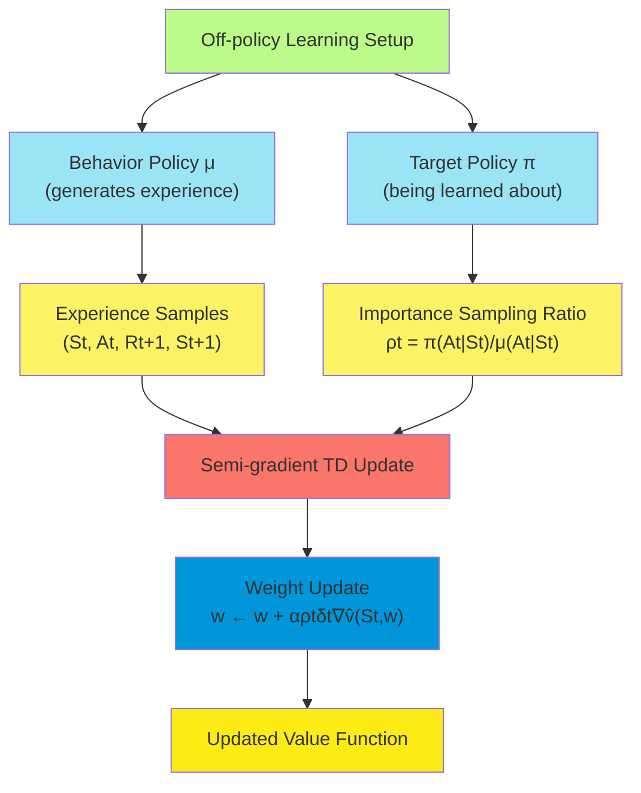
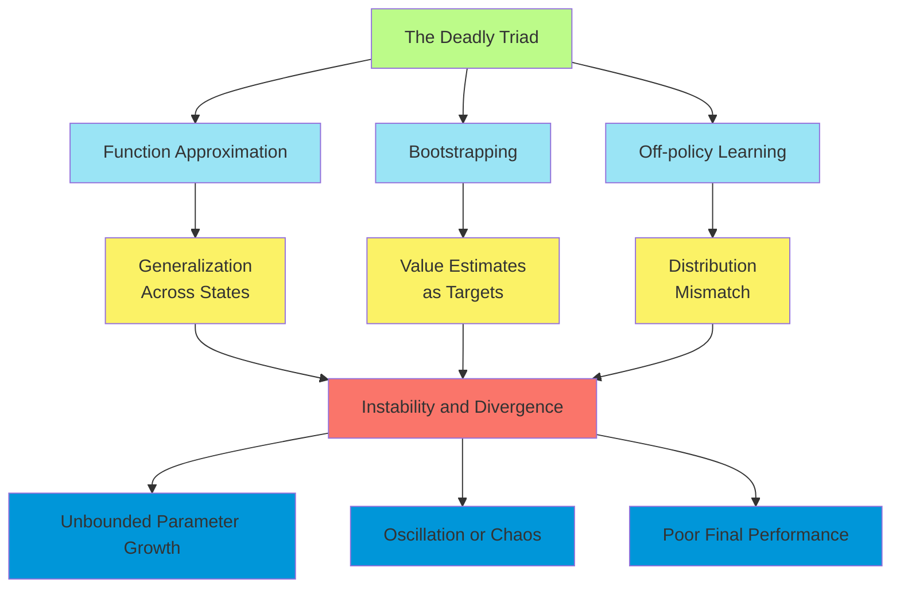
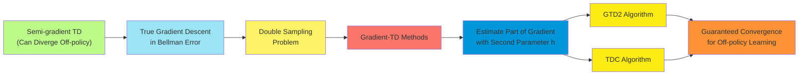
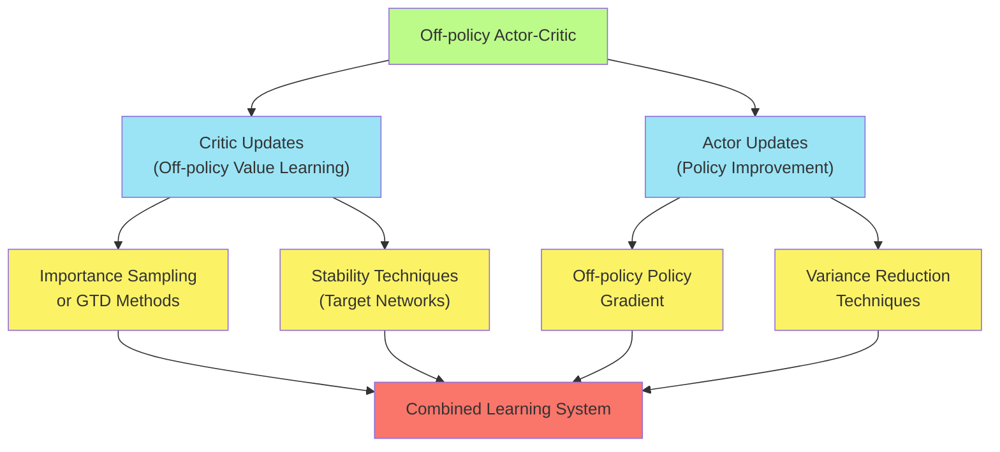

# C-11: Off-policy Methods with Approximation

1. Semi-gradient Methods

    - The Off-policy Setting with Approximation
    - Semi-gradient Off-policy TD(0)
    - Examples of Off-policy Divergence

2. The Stability Challenge
    - The Deadly Triad: Function Approximation, Bootstrapping, Off-policy
    - Linear Value-function Geometry
    - Gradient Descent in the Bellman Error
    - The Bellman Error Not Being Learnable
    - Gradient-TD Methods
    - Emphatic-TD Methods
    - Reducing Variance in Off-policy Methods

#### Semi-gradient Methods

##### The Off-policy Setting with Approximation

Off-policy learning is a fundamental paradigm in reinforcement learning where an agent learns about one policy (the
target policy) while following another policy (the behavior policy). This approach offers several important advantages:

1. **Learning from demonstrations**: The agent can learn from expert demonstrations without having to replicate the
   expert's policy exactly.
2. **Exploratory data collection**: The agent can explore the environment freely while still learning about the optimal
   policy.
3. **Experience reuse**: Data collected under one policy can be used to learn about many different policies.
4. **Learning about multiple policies**: The agent can simultaneously learn about multiple target policies from a single
   stream of experience.

When combined with function approximation, off-policy learning faces significant challenges that don't arise in the
tabular setting. The fundamental problem is one of distribution mismatch: the agent updates its value function based on
a distribution of states and actions generated by the behavior policy, but the value function should represent
expectations under the target policy.

The off-policy setting with function approximation is characterized by:

1. **Target policy** $\pi$: The policy we want to evaluate or optimize
2. **Behavior policy** $\mu$: The policy generating the experience
3. **Coverage assumption**: Requires that $\mu(a|s) > 0$ whenever $\pi(a|s) > 0$
4. **Importance sampling ratio**: $\rho_t = \frac{\pi(A_t|S_t)}{\mu(A_t|S_t)}$

The learning objective remains approximating the true value function $v_\pi$ or $q_\pi$, but now using data generated by
$\mu$.

##### Semi-gradient Off-policy TD(0)

The semi-gradient TD(0) algorithm can be adapted to the off-policy setting by incorporating importance sampling. For
state values, the update becomes:

$\mathbf{w}*{t+1} = \mathbf{w}\*t + \alpha \rho_t [R\*{t+1} + \gamma \hat{v}(S*{t+1}, \mathbf{w}_t) - \hat{v}(S_t, \mathbf{w}_t)] \nabla \hat{v}(S_t, \mathbf{w}_t)$

For action values, we can use:

$\mathbf{w}*{t+1} = \mathbf{w}\*t + \alpha [R\*{t+1} + \gamma \hat{q}(S*{t+1}, A_{t+1}', \mathbf{w}_t) - \hat{q}(S_t, A_t, \mathbf{w}_t)] \nabla \hat{q}(S_t, A_t, \mathbf{w}_t)$

Where $A_{t+1}'$ is selected according to the target policy $\pi$.

In the case of Q-learning with function approximation, the update is:

$\mathbf{w}*{t+1} = \mathbf{w}\*t + \alpha [R\*{t+1} + \gamma \max_a \hat{q}(S*{t+1}, a, \mathbf{w}_t) - \hat{q}(S_t, A_t, \mathbf{w}_t)] \nabla \hat{q}(S_t, A_t, \mathbf{w}_t)$

This is a special case where importance sampling is not needed because the max operation implicitly represents the
greedy target policy.

For expected Sarsa with function approximation, the update is:

$\mathbf{w}*{t+1} = \mathbf{w}\*t + \alpha [R\*{t+1} + \gamma \sum_a \pi(a|S*{t+1}) \hat{q}(S_{t+1}, a, \mathbf{w}_t) - \hat{q}(S_t, A_t, \mathbf{w}_t)] \nabla \hat{q}(S_t, A_t, \mathbf{w}_t)$

With linear function approximation, the gradient simplifies to the feature vector:

$\nabla \hat{v}(S_t, \mathbf{w}_t) = \mathbf{x}(S_t)$ or $\nabla \hat{q}(S_t, A_t, \mathbf{w}_t) = \mathbf{x}(S_t, A_t)$

While these semi-gradient off-policy methods are simple and computationally efficient, they lack the convergence
guarantees of their on-policy counterparts. The combination of function approximation, bootstrapping, and off-policy
learning can lead to divergence in certain cases.

##### Examples of Off-policy Divergence

A classic example demonstrating the potential for divergence in off-policy learning with function approximation is
Baird's counterexample:

**Baird's Counterexample**:

- 7-state MDP with specific transition dynamics
- Target policy: always select action that transitions to the 7th state
- Behavior policy: uniform random actions
- Linear function approximation with carefully designed features
- Rewards all zero (pure prediction problem)

In this example, the standard semi-gradient Q-learning algorithm with linear function approximation can be shown to
diverge, with the weights growing without bound. This occurs despite using linear function approximation (which is
stable in the on-policy case) and despite the simplicity of the problem.

Another instructive example is the **Spiral Example**:

- 2-state MDP with specific reward and transition dynamics
- Target policy differs from behavior policy
- Linear function approximation with 2 parameters
- Semi-gradient TD(0) causes the parameters to spiral outward, diverging to infinity

These examples highlight that the combination of function approximation, bootstrapping, and off-policy learning can
create fundamental instability issues that don't arise when any one of these elements is removed:

1. With function approximation and off-policy learning but no bootstrapping (i.e., Monte Carlo methods), convergence can
   be guaranteed.
2. With function approximation and bootstrapping but on-policy (i.e., semi-gradient TD or Sarsa), convergence can be
   guaranteed for linear approximation.
3. With bootstrapping and off-policy learning but tabular representation (no function approximation), convergence can be
   guaranteed.

The divergence in these examples is not due to poor step-size selection or other implementation details—it represents a
fundamental incompatibility between semi-gradient methods and the off-policy setting with function approximation.

#### The Stability Challenge

##### The Deadly Triad: Function Approximation, Bootstrapping, Off-policy

The "deadly triad" refers to the combination of three elements that, when present simultaneously, can lead to
instability and divergence in reinforcement learning algorithms:

1. **Function Approximation**: Using parametric functions to approximate value functions or policies, rather than
   tabular representations.
2. **Bootstrapping**: Using estimates of value functions to update other estimates, as in temporal-difference learning.
3. **Off-policy Learning**: Learning about a target policy while following a different behavior policy.

While each of these elements individually provides important benefits:

- Function approximation enables scalability to large state spaces
- Bootstrapping reduces variance and speeds up learning
- Off-policy learning enables exploration and experience reuse

Their combination creates a perfect storm of instability:

1. **Function approximation** introduces generalization across states, which can propagate errors.
2. **Bootstrapping** creates a moving target problem, where the update target depends on the current approximation.
3. **Off-policy learning** introduces distribution mismatch between update samples and the target policy's state
   distribution.

This instability manifests as:

- Unbounded growth of parameter values
- Oscillating or chaotic parameter trajectories
- Poor final performance even when convergence occurs

Understanding the deadly triad has motivated the development of numerous algorithms designed to address this fundamental
challenge in reinforcement learning.

##### Linear Value-function Geometry

To understand the stability issues in off-policy learning with function approximation, it's helpful to examine the
geometry of linear value function approximation. In this framework:

1. Each state $s$ is represented as a feature vector $\mathbf{x}(s) \in \mathbb{R}^d$.
2. The approximate value function is $\hat{v}(s, \mathbf{w}) = \mathbf{w}^T \mathbf{x}(s)$.
3. The set of all possible value functions representable by the approximator forms a subspace of the full space of all
   possible value functions.
4. The true value function $v_\pi$ typically lies outside this subspace.
5. The projection operation $\Pi$ maps any value function to the closest point in the approximation subspace, where
   "closest" is defined by a weighted norm with weights given by the state distribution.

The standard TD(0) algorithm can be understood as implementing a combination of two operations:

1. The Bellman operator $\mathcal{T}^\pi$, which maps a value function to a new value function through one application
   of the Bellman equation.
2. The projection operator $\Pi$, which projects the result back onto the approximation subspace.

In the on-policy case with linear function approximation, the repeated application of $\Pi \mathcal{T}^\pi$ is a
contraction mapping in the weighted norm defined by the on-policy distribution, guaranteeing convergence to a unique
fixed point.

However, in the off-policy case, the projection $\Pi$ is defined with respect to the behavior policy's state
distribution, while the Bellman operator $\mathcal{T}^\pi$ involves the target policy. This mismatch means that
$\Pi \mathcal{T}^\pi$ is no longer guaranteed to be a contraction, potentially leading to divergence.

The projected fixed point equation is:

$\hat{v} = \Pi \mathcal{T}^\pi \hat{v}$

This equation may have zero, one, or multiple solutions depending on the specific problem and function approximation
architecture.

##### Gradient Descent in the Bellman Error

An alternative approach to value function approximation is to directly minimize the Bellman error:

$\text{BE}(\mathbf{w}) = \sum_s \mu(s) [\mathcal{T}^\pi \hat{v}(s, \mathbf{w}) - \hat{v}(s, \mathbf{w})]^2$

Where:

- $\mu(s)$ is the state distribution under the behavior policy
- $\mathcal{T}^\pi \hat{v}(s, \mathbf{w}) = \sum_a \pi(a|s) \sum_{s', r} p(s', r|s, a)[r + \gamma \hat{v}(s', \mathbf{w})]$

The gradient of the Bellman error is:

$\nabla \text{BE}(\mathbf{w}) = 2 \sum_s \mu(s) [\mathcal{T}^\pi \hat{v}(s, \mathbf{w}) - \hat{v}(s, \mathbf{w})] [\gamma \sum_a \pi(a|s) \sum_{s'} p(s'|s, a) \nabla \hat{v}(s', \mathbf{w}) - \nabla \hat{v}(s, \mathbf{w})]$

This approach has the advantage of being well-defined as an optimization problem with a clear objective function.
Minimizing the Bellman error directly can lead to more stable learning in off-policy settings.

However, traditional semi-gradient methods do not perform true gradient descent in the Bellman error, contributing to
their instability in off-policy settings.

##### The Bellman Error Not Being Learnable

A fundamental challenge in minimizing the Bellman error is that it cannot be sampled directly from individual
transitions. The term $\mathcal{T}^\pi \hat{v}(s, \mathbf{w})$ involves an expectation over next states and rewards,
which isn't available from a single experience.

If we try to estimate the Bellman error using samples:

$\delta_t = R_{t+1} + \gamma \hat{v}(S_{t+1}, \mathbf{w}) - \hat{v}(S_t, \mathbf{w})$

And then perform updates based on minimizing $\delta_t^2$:

$\mathbf{w}_{t+1} = \mathbf{w}_t - \frac{\alpha}{2} \nabla \delta_t^2 = \mathbf{w}_t - \alpha \delta_t \nabla \delta_t$

The gradient term becomes:

$\nabla \delta_t = \gamma \nabla \hat{v}(S_{t+1}, \mathbf{w}) - \nabla \hat{v}(S_t, \mathbf{w})$

This leads to a form of double sampling: we need two independent samples of the next state $S_{t+1}$ from the same
current state $S_t$ and action $A_t$ to get an unbiased estimate of the gradient. In practice, this is rarely possible.

This "double sampling" problem means that the Bellman error is not directly learnable from single-step transitions,
necessitating alternative approaches.

##### Gradient-TD Methods

Gradient Temporal Difference (GTD) methods address the stability issues of off-policy learning by performing true
gradient descent in a related objective function that can be estimated from samples without double sampling.

The key insight is to use a different objective function, the Mean Squared Projected Bellman Error (MSPBE):

$\text{MSPBE}(\mathbf{w}) = |\hat{v} - \Pi \mathcal{T}^\pi \hat{v}|_\mu^2$

This measures the distance between the current value function and the projected Bellman update, using the behavior
policy's state distribution $\mu$ for the norm.

The gradient of the MSPBE is:

$\nabla \text{MSPBE}(\mathbf{w}) = 2 \mathbb{E}[\rho_t \delta_t \mathbf{x}(S_t) - \gamma \rho_t \mathbf{x}(S_t) \mathbf{x}(S_{t+1})^T \mathbf{w}]$

Where $\rho_t = \frac{\pi(A_t|S_t)}{\mu(A_t|S_t)}$ is the importance sampling ratio.

This gradient is not directly estimable from single samples. GTD methods overcome this by introducing a secondary weight
vector $\mathbf{h}$ to estimate part of the gradient, using a two-timescale approach:

GTD2 algorithm:

1. $\delta_t = R_{t+1} + \gamma \mathbf{w}*t^T \mathbf{x}(S*{t+1}) - \mathbf{w}_t^T \mathbf{x}(S_t)$
2. $\mathbf{h}_{t+1} = \mathbf{h}_t + \beta \rho_t (\delta_t - \mathbf{h}_t^T \mathbf{x}(S_t)) \mathbf{x}(S_t)$
3. $\mathbf{w}_{t+1} = \mathbf{w}*t + \alpha \rho_t (\mathbf{x}(S_t) - \gamma \mathbf{x}(S*{t+1})) \mathbf{h}_t^T \mathbf{x}(S_t)$

Where $\alpha$ and $\beta$ are step sizes with $\beta \ll \alpha$ (two-timescale).

Another GTD algorithm, TDC (Temporal Difference with Correction), uses a slightly different update:

$\mathbf{w}_{t+1} = \mathbf{w}*t + \alpha \rho_t (\delta_t \mathbf{x}(S_t) - \gamma \mathbf{x}(S*{t+1}) \mathbf{h}_t^T \mathbf{x}(S_t))$

These methods have important properties:

1. Guaranteed convergence with linear function approximation under standard assumptions
2. Compatible with bootstrapping and off-policy learning
3. Linear computational complexity in parameters and features
4. Can be extended to control settings and non-linear function approximation

##### Emphatic-TD Methods

Emphatic-TD methods represent another approach to addressing off-policy instability. Rather than modifying the objective
function, they reweight the updates to emphasize certain states based on their importance under the target policy.

The key idea is to use "followon traces" that measure how much a state affects future states under the target policy,
accounting for the discrepancy between target and behavior policies.

The Emphatic-TD(0) algorithm uses an emphasis weight $M_t$ for each state:

1. $F_t = \gamma \rho_{t-1} F_{t-1} + 1$, with $F_0 = 1$ (the followon trace)
2. $M_t = \lambda F_t + (1-\lambda)$ (the emphasis)
3. $\mathbf{w}_{t+1} = \mathbf{w}_t + \alpha M_t \rho_t \delta_t \mathbf{x}(S_t)$

Where:

- $\lambda$ is a parameter controlling the emphasis between immediate and long-term effects
- $\delta_t = R_{t+1} + \gamma \mathbf{w}*t^T \mathbf{x}(S*{t+1}) - \mathbf{w}_t^T \mathbf{x}(S_t)$ is the TD error
- $\rho_t = \frac{\pi(A_t|S_t)}{\mu(A_t|S_t)}$ is the importance sampling ratio

The emphasis weight $M_t$ grows larger for states that have a significant impact on future states that are emphasized by
the target policy, effectively reweighting the state distribution to match that of the target policy.

Emphatic-TD methods have several important properties:

1. Convergence guarantees with linear function approximation in the off-policy case
2. Maintaining the simplicity and computational efficiency of standard TD learning
3. Focus computation on states that matter for the target policy
4. Can be extended to include eligibility traces for better credit assignment

The primary drawback is potentially high variance in the emphasis weights, which can lead to noisy updates and slower
learning in practice.

##### Reducing Variance in Off-policy Methods

Off-policy methods, particularly those using importance sampling, often suffer from high variance in their updates.
Several techniques have been developed to address this issue:

1. **Per-decision Importance Sampling**:
    - Applies importance sampling to individual reward terms rather than entire returns
    - For n-step returns: $G_{t:t+n} = R_{t+1} + \gamma \rho_{t+1}(R_{t+2} + \gamma \rho_{t+2}(...))$
    - Typically lower variance than standard importance sampling
2. **Weighted Importance Sampling**:
    - Uses normalized importance sampling weights: $\frac{\rho_t}{\sum_i \rho_i}$
    - Biased but much lower variance
    - Often used in practice for return-based methods
3. **Truncated Importance Sampling**:
    - Caps the importance sampling ratios at a maximum value
    - Introduces bias but significantly reduces variance
    - Common setting: $\rho_t \leftarrow \min(\rho_t, c)$ for some constant $c$
4. **V-trace** (from the IMPALA algorithm):
    - Uses truncated importance sampling for returns
    - Truncates both forward and backward to control variance
    - Maintains a guarantee of convergence to a fixed point
5. **Q(σ)** and related algorithms:
    - Interpolate between importance sampling and expected values
    - Parameter σ controls the trade-off between bias and variance
    - Can be combined with n-step returns for additional flexibility
6. **Self-normalization techniques**:
    - Normalize weights within mini-batches
    - Reduce the impact of extreme importance sampling ratios
    - Improve numerical stability

These variance reduction techniques are crucial for practical off-policy learning, especially with longer time horizons
or when the target and behavior policies differ significantly.

#### Advanced Topics and Extensions

##### Off-policy Actor-Critic Methods

Actor-Critic methods can be extended to the off-policy setting by combining off-policy evaluation techniques with policy
gradient approaches:

1. **Off-policy Deterministic Policy Gradient (OPDPG)**:
    - Updates a deterministic policy based on off-policy samples
    - Uses importance sampling for the critic but not the actor
    - Forms the basis for algorithms like DDPG
2. **Off-policy Actor-Critic with Experience Replay**:
    - Stores transitions in a replay buffer
    - Samples mini-batches for both actor and critic updates
    - Uses techniques like target networks to stabilize learning
3. **V-trace Actor-Critic**:
    - Uses V-trace for stable off-policy correction
    - Maintains low variance updates while correcting for off-policy sampling
    - Suitable for distributed reinforcement learning systems

The general form of off-policy actor-critic updates:

- Critic: $\mathbf{w}_{t+1} = \mathbf{w}_t + \alpha_c \rho_t \delta_t \nabla \hat{v}(S_t, \mathbf{w}_t)$
- Actor:
  $\boldsymbol{\theta}_{t+1} = \boldsymbol{\theta}_t + \alpha_a \rho_t \nabla \log \pi(A_t|S_t, \boldsymbol{\theta}_t) \delta_t$

Where $\delta_t$ is typically a TD error and $\rho_t$ is an importance sampling ratio.

##### Gradient-TD for Control

The Gradient-TD methods can be extended to control problems by estimating action-values rather than state values:

1. **GTD Q-learning**:
    - Applies GTD methods to action-value estimation
    - Uses off-policy samples to learn about a greedy policy
    - Secondary weight vector estimates part of the gradient
2. **Greedy-GQ**:
    - Extends GTD2 to the control setting
    - Learns action-values while following a behavior policy
    - Converges to the optimal policy under standard assumptions
3. **GQ(λ)**:
    - Incorporates eligibility traces for faster learning
    - Uses GTD-style updates with trace-based credit assignment
    - Balances bias and variance through the λ parameter

The update rules mirror those of GTD methods, but with action-value functions and appropriate policy considerations.

##### Experience Replay and Deep Off-policy Learning

Experience replay has become a central component of deep off-policy learning methods:

1. **Deep Q-Network (DQN)**:
    - Stores transitions in a replay buffer
    - Samples random mini-batches for updates
    - Uses a target network updated periodically
    - Breaks correlations in the data, improving stability
2. **Prioritized Experience Replay**:
    - Prioritizes transitions based on TD error magnitude
    - Focuses computation on samples with high learning potential
    - Corrects for the resulting bias through importance sampling
3. **Hindsight Experience Replay (HER)**:
    - Relabels goals in failed experiences to create successful ones
    - Enables efficient learning in sparse reward settings
    - Naturally fits the off-policy framework

These approaches have led to significant advances in deep reinforcement learning, demonstrating that the challenges of
the deadly triad can be mitigated through appropriate algorithmic innovations.

#### Case Studies and Applications

##### Baird's Counterexample Revisited

Returning to Baird's counterexample, we can examine how different algorithms perform:

1. **Semi-gradient TD**: Diverges, with weights growing without bound.
2. **GTD methods**: Converge to the TD fixed point, demonstrating their stability guarantees.
3. **Emphatic-TD**: Also converges, but with higher variance in the updates.
4. **Residual gradient methods**: Converge to a different fixed point that minimizes the Bellman error.

This example clearly illustrates the fundamental instability of semi-gradient methods in off-policy settings and the
effectiveness of methods specifically designed to address this issue.

##### Off-policy Learning in Continuous Control

Off-policy methods have been particularly successful in continuous control tasks:

1. **Deep Deterministic Policy Gradient (DDPG)**:
    - Combines DQN-style experience replay with deterministic policy gradients
    - Off-policy learning enables sample-efficient exploration
    - Stable learning in high-dimensional continuous action spaces
2. **Soft Actor-Critic (SAC)**:
    - Uses entropy regularization for better exploration
    - Off-policy training with experience replay
    - State-of-the-art performance on many continuous control benchmarks
3. **Twin Delayed DDPG (TD3)**:
    - Addresses overestimation bias with double Q-learning
    - Uses off-policy learning with delayed policy updates
    - Demonstrates improved stability and performance

These applications highlight the practical value of off-policy learning, particularly in settings where data collection
is expensive and sample efficiency is paramount.

#### Summary and Key Takeaways

Off-policy methods with approximation present fundamental challenges but also offer powerful capabilities:

1. **The Deadly Triad**:
    - Function approximation, bootstrapping, and off-policy learning together create instability
    - Standard semi-gradient methods can diverge in this setting
    - Specialized algorithms are required for stable learning
2. **Gradient-TD Methods**:
    - Perform true gradient descent in the MSPBE
    - Use a secondary weight vector to estimate part of the gradient
    - Provide convergence guarantees for linear function approximation
3. **Emphatic-TD Methods**:
    - Reweight updates based on state importance under the target policy
    - Maintain computational simplicity of standard TD
    - Address distribution mismatch through emphasis
4. **Variance Reduction Techniques**:
    - Critical for practical off-policy learning
    - Include per-decision importance sampling, truncation, and normalization
    - Balance bias and variance for stable learning
5. **Modern Applications**:
    - Experience replay enables efficient deep off-policy learning
    - Success in continuous control demonstrates practical value
    - Advanced algorithms mitigate stability challenges while retaining benefits

The study of off-policy methods with approximation represents one of the most active areas in reinforcement learning
research, with ongoing developments continuing to expand the capabilities and applications of these powerful techniques.

Understanding the theoretical foundations and practical challenges of these methods is essential for developing robust
reinforcement learning systems capable of efficiently learning from diverse experiences in complex environments.
