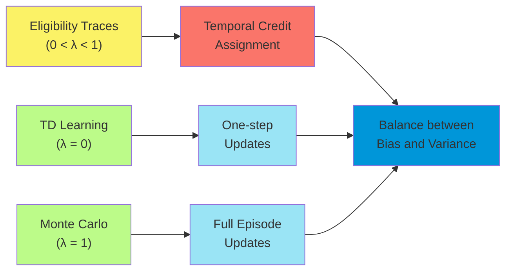
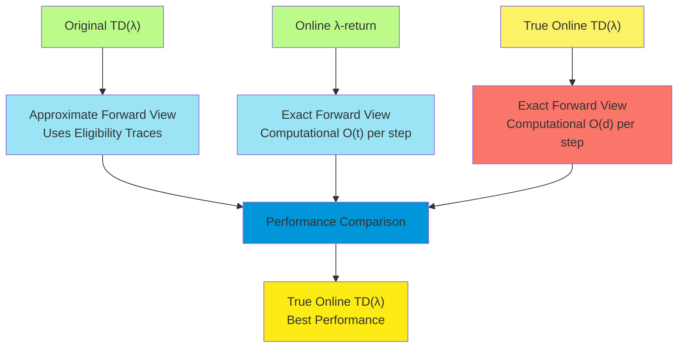
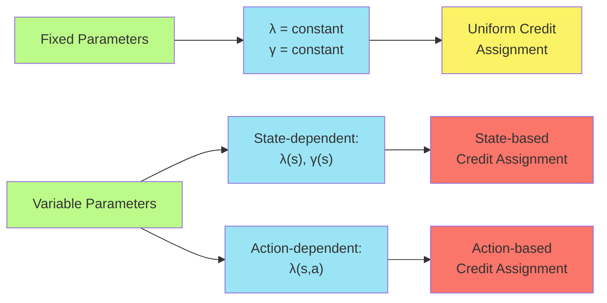
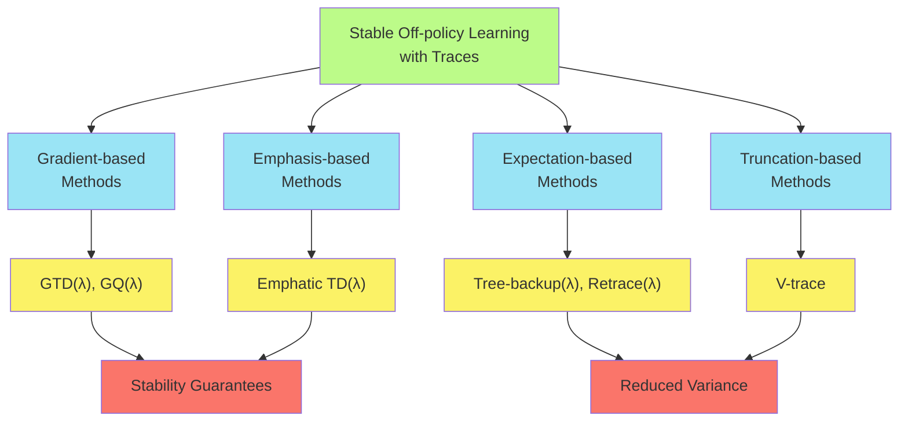
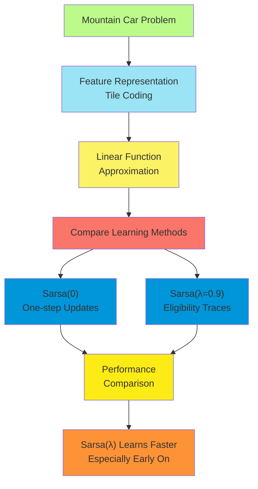
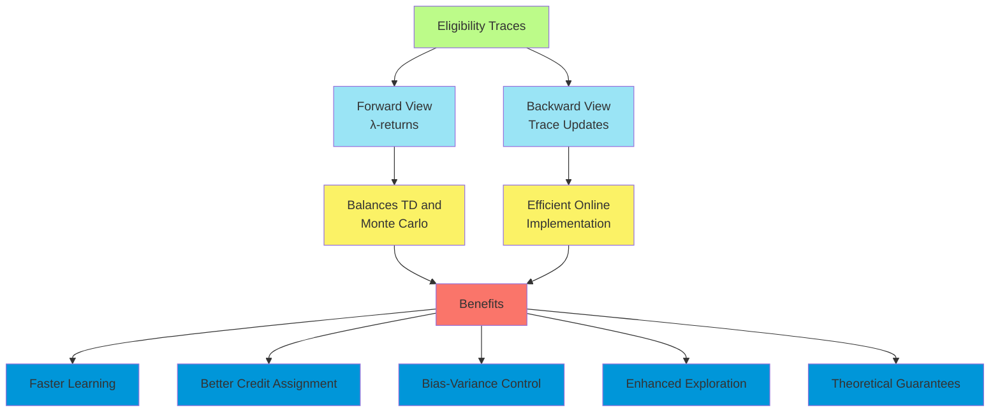

# C-12: Eligibility Traces

1. The λ-return

    - Eligibility Traces as the Backward View
    - TD(λ)
    - n-step Truncated λ-return Methods
    - Redoing Updates: Online λ-return Algorithm
    - True Online TD(λ)
    - Dutch Traces in Monte Carlo Learning

2. Eligibility Traces for Control
    - Sarsa(λ)
    - Variable λ and γ
    - Off-policy Traces with Control Variates
    - Watkins's Q(λ) to Tree-Backup(λ)
    - Stable Off-policy Methods with Traces
    - Implementation Considerations

#### The λ-return

Eligibility traces represent one of the most powerful and general mechanisms in reinforcement learning, providing a
bridge between one-step temporal difference (TD) methods and Monte Carlo methods. They offer a way to efficiently assign
credit to past states and actions while maintaining many of the advantages of both approaches.

The fundamental concept behind eligibility traces is the λ-return, which combines multiple n-step returns into a single
update target. The λ-return for time t is defined as:

$G_t^\lambda = (1-\lambda) \sum_{n=1}^{\infty} \lambda^{n-1} G_{t:t+n}$

Where:

- $G_{t:t+n}$ is the n-step return starting from time t
- $\lambda \in [0, 1]$ is a parameter controlling the weighting of different n-step returns

The λ-return can be understood as a weighted average of all possible n-step returns, with exponentially decaying weights
controlled by λ. At the extremes:

- When $\lambda = 0$, $G_t^\lambda = G_{t:t+1}$, which is the one-step TD return
- When $\lambda = 1$, $G_t^\lambda = G_t$, which is the full Monte Carlo return

This formulation provides a spectrum of methods between TD and Monte Carlo learning, allowing us to balance the
trade-off between bias and variance:

- TD methods (low λ): Lower variance, but potentially higher bias due to bootstrapping
- Monte Carlo methods (high λ): No bias, but higher variance due to long action sequences

The λ-return formulation neatly captures this trade-off through a single parameter, making it a powerful tool in
reinforcement learning.

##### Eligibility Traces as the Backward View

While the λ-return provides a conceptually clear "forward view" of credit assignment, it requires waiting for multiple
future rewards before updating the value function, which isn't ideal for online learning. Eligibility traces offer an
equivalent "backward view" that can be implemented efficiently in an online manner.

An eligibility trace is a temporary record of the occurrence of an event, such as the visitation of a state or the
taking of an action. The trace marks the state or state-action pair as eligible for undergoing learning changes. When a
TD error occurs, only states or state-action pairs with non-zero eligibility traces are updated, with the magnitude of
the update proportional to the trace level.

For state values, the eligibility trace vector $\mathbf{e}_t \in \mathbb{R}^d$ is updated as follows:

$\mathbf{e}*t = \gamma \lambda \mathbf{e}*{t-1} + \nabla \hat{v}(S_t, \mathbf{w}_t)$

Where:

- $\gamma$ is the discount factor
- $\lambda$ is the trace decay parameter
- $\nabla \hat{v}(S_t, \mathbf{w}_t)$ is the gradient of the value function at the current state

The eligibility trace combines two separate ideas:

1. **Frequency heuristic**: States visited more frequently are updated more
2. **Recency heuristic**: States visited more recently are updated more

The trace decay parameter λ determines how quickly the eligibility of previous states decays over time. Higher values of
λ result in longer-lasting traces, causing updates to affect a longer history of states.

##### TD(λ)

The TD(λ) algorithm combines eligibility traces with TD learning to approximate the λ-return algorithm in an online,
incremental manner. For linear function approximation, the weight update rule for TD(λ) is:

$\mathbf{w}_{t+1} = \mathbf{w}_t + \alpha \delta_t \mathbf{e}_t$

Where:

- $\delta_t = R_{t+1} + \gamma \hat{v}(S_{t+1}, \mathbf{w}_t) - \hat{v}(S_t, \mathbf{w}_t)$ is the TD error
- $\mathbf{e}_t$ is the eligibility trace vector
- $\alpha$ is the learning rate

The complete TD(λ) algorithm for linear function approximation is:

1. Initialize weight vector $\mathbf{w}$ and eligibility trace vector $\mathbf{e} = \mathbf{0}$
2. For each time step t: a. Observe next state $S_{t+1}$ and reward $R_{t+1}$ b. Compute TD error:
   $\delta_t = R_{t+1} + \gamma \hat{v}(S_{t+1}, \mathbf{w}) - \hat{v}(S_t, \mathbf{w})$ c. Update trace:
   $\mathbf{e} \leftarrow \gamma \lambda \mathbf{e} + \nabla \hat{v}(S_t, \mathbf{w})$ d. Update weights:
   $\mathbf{w} \leftarrow \mathbf{w} + \alpha \delta_t \mathbf{e}$ e. $S_t \leftarrow S_{t+1}$

For linear function approximation where $\hat{v}(s, \mathbf{w}) = \mathbf{w}^T \mathbf{x}(s)$, the gradient simplifies
to $\nabla \hat{v}(S_t, \mathbf{w}) = \mathbf{x}(S_t)$, making the trace update:

$\mathbf{e} \leftarrow \gamma \lambda \mathbf{e} + \mathbf{x}(S_t)$

TD(λ) has several important properties:

1. Computationally efficient, with updates of O(d) complexity (where d is the number of parameters)
2. Can be applied to continuous state spaces through function approximation
3. Provides a smooth transition between TD(0) and Monte Carlo methods
4. Often outperforms both TD(0) and Monte Carlo methods in practice

However, standard TD(λ) does not exactly implement the forward view λ-return algorithm due to the online nature of the
updates. This discrepancy is addressed by true online TD(λ), discussed later.

##### n-step Truncated λ-return Methods

The λ-return as defined earlier uses an infinite sum of n-step returns, which isn't practical to compute directly.
Instead, we can use a truncated version that only considers a finite number of steps:

$G_{t:t+n}^\lambda = (1-\lambda) \sum_{i=1}^{n-1} \lambda^{i-1} G_{t:t+i} + \lambda^{n-1} G_{t:t+n}$

This is the n-step truncated λ-return, which combines n-step returns up to horizon n and then bootstraps with the
current value estimate.

The n-step truncated λ-return methods provide a middle ground between computational efficiency and approximation
quality:

- Lower n values: More computationally efficient, but may be a poorer approximation of the full λ-return
- Higher n values: Better approximation of the full λ-return, but less computationally efficient

These methods can be particularly useful in online settings where a fixed computation budget per time step is available,
as they allow controlling the computational complexity while still capturing some benefits of eligibility traces.

The weight update for the n-step truncated λ-return is:

$\mathbf{w}*{t+n} = \mathbf{w}*{t+n-1} + \alpha [G_{t:t+n}^\lambda - \hat{v}(S_t, \mathbf{w}*{t+n-1})] \nabla \hat{v}(S_t, \mathbf{w}*{t+n-1})$

This update still requires waiting for n time steps before updating the weights, making it less suitable for fully
online learning.

##### Redoing Updates: Online λ-return Algorithm

The online λ-return algorithm addresses the delay issue in the forward view by maintaining and updating estimates of the
λ-return for each time step. This algorithm "redoes" updates as new information becomes available.

The key idea is to maintain estimates of the λ-return for each recent time step and update them as new rewards are
observed:

1. Initialize $\mathbf{w}_0$ and let $G^\lambda \leftarrow \hat{v}(S_0, \mathbf{w}_0)$
2. For each time step t = 0, 1, 2, ...: a. Generate A*t, R*{t+1}, S\_{t+1} b. Update estimate of G^\lambda for each
   recent time step from tau = 0 to t c. Update the weights based on these estimates

This approach provides a better approximation of the λ-return but involves significantly more computation per time step,
which grows linearly with the episode length. This makes it less practical for long episodes or continuing tasks.

The advantage is that it more closely matches the forward view λ-return, potentially leading to improved learning
performance. However, the computational complexity has led to the development of more efficient alternatives, such as
true online TD(λ).

##### True Online TD(λ)

True online TD(λ) addresses the discrepancy between standard TD(λ) and the forward view λ-return algorithm while
maintaining computational efficiency. It exactly implements the forward view in an efficient, online manner.

The key insight is to add a correction term to the standard TD(λ) update to account for the difference between the
forward and backward views. For linear function approximation, the true online TD(λ) update is:

$\mathbf{e} \leftarrow \gamma \lambda \mathbf{e} + \alpha(1-\gamma\lambda \mathbf{e}^T \mathbf{x}(S_t)) \mathbf{x}(S_t)$
$V_{\text{old}} \leftarrow \mathbf{w}^T \mathbf{x}(S_t)$
$\mathbf{w} \leftarrow \mathbf{w} + \alpha (R_{t+1} + \gamma \mathbf{w}^T \mathbf{x}(S_{t+1}) - \mathbf{w}^T \mathbf{x}(S_t)) \mathbf{e} + \alpha (V_{\text{old}} - \mathbf{w}^T \mathbf{x}(S_t)) \mathbf{x}(S_t)$

The additional term $\alpha (V_{\text{old}} - \mathbf{w}^T \mathbf{x}(S_t)) \mathbf{x}(S_t)$ is what distinguishes true
online TD(λ) from standard TD(λ). This term ensures that the algorithm exactly implements the forward view λ-return.

True online TD(λ) maintains the O(d) computational complexity of standard TD(λ) while providing a more accurate
implementation of the λ-return concept. Empirical studies have shown that true online TD(λ) often outperforms standard
TD(λ), particularly with higher learning rates.

##### Dutch Traces in Monte Carlo Learning

Dutch traces are a variant of eligibility traces used in the true online TD(λ) algorithm. The name "Dutch traces" comes
from the Netherlands-based researchers who developed this approach.

The Dutch trace update differs from the conventional trace update in two ways:

1. It includes a decay component based on the learning rate: $(1-\alpha\gamma\lambda \mathbf{e}^T \mathbf{x}(S_t))$
2. It results in a different trace accumulation pattern

For linear function approximation, the Dutch trace update is:

$\mathbf{e} \leftarrow \gamma \lambda \mathbf{e} + \alpha(1-\gamma\lambda \mathbf{e}^T \mathbf{x}(S_t)) \mathbf{x}(S_t)$

This update ensures that the true online TD(λ) algorithm exactly implements the forward view λ-return. The conventional
trace, in contrast, doesn't guarantee this equivalence.

Dutch traces can also be applied in the Monte Carlo setting, where they help ensure that the algorithm properly
implements the intended learning target. This approach has been shown to improve performance in various reinforcement
learning tasks.

#### Eligibility Traces for Control

##### Sarsa(λ)

Eligibility traces can be extended to control problems, where we need to learn action-value functions rather than
state-value functions. Sarsa(λ) is the direct extension of TD(λ) to the control setting.

For linear function approximation of action-values, where $\hat{q}(s, a, \mathbf{w}) = \mathbf{w}^T \mathbf{x}(s, a)$,
the eligibility trace update in Sarsa(λ) is:

$\mathbf{e} \leftarrow \gamma \lambda \mathbf{e} + \mathbf{x}(S_t, A_t)$

And the weight update is:

$\mathbf{w} \leftarrow \mathbf{w} + \alpha \delta_t \mathbf{e}$

Where $\delta_t = R_{t+1} + \gamma \hat{q}(S_{t+1}, A_{t+1}, \mathbf{w}) - \hat{q}(S_t, A_t, \mathbf{w})$ is the TD
error.

The complete Sarsa(λ) algorithm is:

1. Initialize weight vector $\mathbf{w}$ and eligibility trace vector $\mathbf{e} = \mathbf{0}$
2. Initialize state $S_0$ and select action $A_0$ based on $\hat{q}(S_0, \cdot, \mathbf{w})$ (e.g., using ε-greedy)
3. For each time step t = 0, 1, 2, ...: a. Take action $A_t$, observe reward $R_{t+1}$ and next state $S_{t+1}$ b.
   Choose action $A_{t+1}$ based on $\hat{q}(S_{t+1}, \cdot, \mathbf{w})$ (e.g., using ε-greedy) c. Compute TD error:
   $\delta_t = R_{t+1} + \gamma \hat{q}(S_{t+1}, A_{t+1}, \mathbf{w}) - \hat{q}(S_t, A_t, \mathbf{w})$ d. Update trace:
   $\mathbf{e} \leftarrow \gamma \lambda \mathbf{e} + \mathbf{x}(S_t, A_t)$ e. Update weights:
   $\mathbf{w} \leftarrow \mathbf{w} + \alpha \delta_t \mathbf{e}$

As with TD(λ), Sarsa(λ) provides a bridge between one-step Sarsa and Monte Carlo methods for control. The parameter λ
allows balancing between these approaches:

- λ = 0: One-step Sarsa (more bias, less variance)
- λ = 1: Monte Carlo-like updates (less bias, more variance)
- 0 < λ < 1: A blend of the two approaches

Sarsa(λ) has been shown to learn faster than one-step Sarsa on many control problems, particularly those with delayed
rewards or sparse feedback.

##### Variable λ and γ

In some cases, it can be beneficial to vary the trace decay parameter λ or the discount factor γ based on the current
state or other factors:

1. **State-dependent λ**: The trace decay parameter can be made a function of the state: $\lambda = \lambda(s)$
    - Higher λ in states with reliable value estimates
    - Lower λ in states with uncertain value estimates
    - Can adapt based on observed variance in returns
2. **Action-dependent λ**: In control settings, λ can depend on the action: $\lambda = \lambda(s, a)$
    - Higher λ for exploitative actions
    - Lower λ for exploratory actions
3. **Variable discount factor γ**: The discount factor can vary with the state: $\gamma = \gamma(s)$
    - Lower γ for states closer to goal states
    - Higher γ for states where long-term planning is important
    - Can reflect natural time preferences in the problem

When using variable λ or γ, the eligibility trace update becomes:

$\mathbf{e} \leftarrow \gamma_t \lambda_t \mathbf{e} + \nabla \hat{v}(S_t, \mathbf{w})$

Where $\gamma_t = \gamma(S_t)$ and $\lambda_t = \lambda(S_t)$ or $\lambda_t = \lambda(S_t, A_t)$ depending on the
approach.

This flexibility allows for more adaptive credit assignment, potentially improving learning efficiency in complex
environments. However, it also introduces additional hyperparameters that need to be tuned or learned.

##### Off-policy Traces with Control Variates

Off-policy learning with eligibility traces presents additional challenges. The straightforward approach of using
importance sampling ratios can lead to high variance, particularly with long traces.

Control variates provide a technique for reducing this variance. The key idea is to subtract a correlated term from the
update, then add back its expected value. For off-policy eligibility traces, this involves:

1. Using importance sampling ratios $\rho_t = \frac{\pi(A_t|S_t)}{\mu(A_t|S_t)}$ to correct for the difference between
   target policy π and behavior policy μ
2. Incorporating control variates to reduce variance while maintaining the expected update direction
3. Adjusting the eligibility traces to account for both off-policy learning and variance reduction

For linear function approximation, one approach is the per-decision importance sampling with control variates:

$\mathbf{e} \leftarrow \gamma \lambda \rho_t \mathbf{e} + \nabla \hat{v}(S_t, \mathbf{w})$
$\mathbf{w} \leftarrow \mathbf{w} + \alpha (\rho_t - c) \delta_t \mathbf{e} + \alpha c \delta_t \nabla \hat{v}(S_t, \mathbf{w})$

Where c is a parameter controlling the trade-off between variance and bias.

Another approach is to use tree-backup updates, which avoid importance sampling entirely by considering expected values
under the target policy.

These methods provide more stable off-policy learning with traces, though they typically involve additional
computational complexity or approximations.

##### Watkins's Q(λ) to Tree-Backup(λ)

Watkins's Q(λ) is an off-policy control algorithm that combines Q-learning with eligibility traces. The key challenge is
handling the max operation in Q-learning, which doesn't naturally fit with eligibility traces.

Watkins's Q(λ) addresses this by cutting the eligibility trace whenever a non-greedy action is selected:

1. Update trace as usual: $\mathbf{e} \leftarrow \gamma \lambda \mathbf{e} + \nabla \hat{q}(S_t, A_t, \mathbf{w})$
2. If action $A_t$ is not greedy (i.e., $A_t \neq \arg\max_a \hat{q}(S_t, a, \mathbf{w})$), then reset trace:
   $\mathbf{e} \leftarrow \mathbf{0}$
3. Use the Q-learning TD error:
   $\delta_t = R_{t+1} + \gamma \max_a \hat{q}(S_{t+1}, a, \mathbf{w}) - \hat{q}(S_t, A_t, \mathbf{w})$
4. Update weights: $\mathbf{w} \leftarrow \mathbf{w} + \alpha \delta_t \mathbf{e}$

This approach ensures that traces only propagate along greedy action sequences, maintaining the off-policy nature of
Q-learning. However, cutting traces whenever a non-greedy action is taken can significantly reduce the benefit of
eligibility traces, especially with highly exploratory policies.

Tree-backup(λ) provides an alternative that doesn't require cutting traces. Instead, it uses expected values under the
target policy:

1. For each action value: $\hat{q}(s, a, \mathbf{w}) = \mathbf{w}^T \mathbf{x}(s, a)$
2. Expected update:
   $\delta_t = R_{t+1} + \gamma \sum_a \pi(a|S_{t+1}) \hat{q}(S_{t+1}, a, \mathbf{w}) - \hat{q}(S_t, A_t, \mathbf{w})$
3. Trace update: $\mathbf{e} \leftarrow \gamma \lambda \pi(A_t|S_t) \mathbf{e} + \nabla \hat{q}(S_t, A_t, \mathbf{w})$
4. Weight update: $\mathbf{w} \leftarrow \mathbf{w} + \alpha \delta_t \mathbf{e}$

Tree-backup(λ) provides a more efficient use of eligibility traces in off-policy learning, as it doesn't need to cut
traces for exploratory actions. Instead, it weights the traces by the probability of the action under the target policy.

##### Stable Off-policy Methods with Traces

Combining eligibility traces with off-policy learning and function approximation brings together all elements of the
"deadly triad" that can lead to instability and divergence. Several methods have been developed to address this
challenge:

1. **Gradient-TD methods with traces**: Extend the gradient-TD approach to include eligibility traces.
    - GTD(λ): Uses eligibility traces with the GTD algorithm
    - GQ(λ): The control variant for action-value learning
    - Maintain stability guarantees with linear function approximation
2. **Emphatic-TD methods with traces**: Build on the emphatic approach to handle off-policy learning.
    - Emphatic TD(λ): Uses a follow-on trace to reweight updates
    - Can provide stability guarantees with linear function approximation
    - May have higher variance than gradient-TD methods
3. **Tree-backup and Retrace methods**: Use expected values to avoid high variance from importance sampling.
    - Tree-backup(λ): Uses target policy probabilities without importance sampling
    - Retrace(λ): Combines importance sampling with expectation-based updates
    - Q(σ): Interpolates between sarsa and tree-backup
4. **V-trace**: Used in the IMPALA algorithm for distributed reinforcement learning.
    - Truncates importance sampling ratios to reduce variance
    - Uses traces for efficient credit assignment
    - Provides a stable target for off-policy learning

These methods represent different trade-offs between stability, variance, computational complexity, and sample
efficiency. The choice of algorithm depends on the specific requirements of the application and the characteristics of
the environment.

##### Implementation Considerations

Implementing eligibility traces effectively requires attention to several practical considerations:

1. **Trace representation**: For large or continuous state spaces, maintaining full eligibility traces can be
   memory-intensive.
    - Sparse representations: Only store non-zero trace elements
    - Truncated traces: Only maintain traces above a certain threshold
    - Replacing traces: Set trace to 1 rather than accumulating (useful in some tabular settings)
2. **Trace initialization**: The initial value of eligibility traces can impact early learning.
    - Typically initialized to zero
    - Some variants initialize based on initial state features
3. **Numerical stability**: Long traces can lead to numerical issues.
    - Periodically normalize traces to prevent overflow/underflow
    - Use double precision for trace calculations
    - Consider trace magnitude clipping
4. **Computation-memory trade-offs**: Different trace implementations offer different trade-offs.
    - Dense traces: Faster updates but higher memory usage
    - Sparse traces: Lower memory usage but potentially slower updates
    - Hybrid approaches based on problem characteristics
5. **Episode boundaries**: Traces should be reset at the beginning of each episode.
    - Clear all trace elements to zero
    - Particularly important for episodic tasks
6. **Feature considerations**: The feature representation affects trace behavior.
    - Binary features: Simpler trace updates
    - Continuous features: May require more careful normalization
    - High-dimensional features: Consider dimensionality reduction techniques
7. **Parameter tuning**: Eligibility traces introduce additional parameters that require tuning.
    - λ: The trace decay parameter (most critical)
    - Trace type: Accumulating, replacing, or Dutch traces
    - Implementation details like sparsity thresholds

These considerations can significantly impact the practical performance of algorithms using eligibility traces, and
careful implementation is often key to realizing their theoretical benefits.

#### Advanced Topics and Applications

##### True Online Control Methods

The true online approach can be extended to control settings, resulting in true online Sarsa(λ) and related algorithms.
For linear function approximation, the true online Sarsa(λ) update is:

$\mathbf{e} \leftarrow \gamma \lambda \mathbf{e} + \alpha(1-\gamma\lambda \mathbf{e}^T \mathbf{x}(S_t, A_t)) \mathbf{x}(S_t, A_t)$
$Q_{\text{old}} \leftarrow \mathbf{w}^T \mathbf{x}(S_t, A_t)$
$\mathbf{w} \leftarrow \mathbf{w} + \alpha (R_{t+1} + \gamma \mathbf{w}^T \mathbf{x}(S_{t+1}, A_{t+1}) - \mathbf{w}^T \mathbf{x}(S_t, A_t)) \mathbf{e} + \alpha (Q_{\text{old}} - \mathbf{w}^T \mathbf{x}(S_t, A_t)) \mathbf{x}(S_t, A_t)$

True online methods have been extended to various control algorithms, including:

- True online Q(λ): Combines true online updates with Q-learning
- True online expected Sarsa(λ): Uses expected values over next actions
- True online tree-backup(λ): Integrates with expectation-based off-policy learning

These methods maintain the theoretical advantages of true online TD(λ) while adapting to the control setting, often
resulting in improved learning performance compared to their standard counterparts.

##### Eligibility Traces for Policy Gradient Methods

Eligibility traces can be incorporated into policy gradient methods to improve credit assignment and learning
efficiency. The eligibility trace concept naturally fits with the REINFORCE algorithm and actor-critic methods.

For REINFORCE with eligibility traces, the update becomes:

$\mathbf{e}^\theta \leftarrow \gamma \lambda \mathbf{e}^\theta + \nabla \log \pi(A_t|S_t, \boldsymbol{\theta})$
$\boldsymbol{\theta} \leftarrow \boldsymbol{\theta} + \alpha G_t \mathbf{e}^\theta$

Where $\boldsymbol{\theta}$ is the policy parameter vector and $G_t$ is the return.

For actor-critic methods, both the actor and critic can use eligibility traces:

- Critic traces: $\mathbf{e}^w \leftarrow \gamma \lambda \mathbf{e}^w + \nabla \hat{v}(S_t, \mathbf{w})$
  $\mathbf{w} \leftarrow \mathbf{w} + \alpha_w \delta_t \mathbf{e}^w$
- Actor traces:
  $\mathbf{e}^\theta \leftarrow \gamma \lambda \mathbf{e}^\theta + \nabla \log \pi(A_t|S_t, \boldsymbol{\theta})$
  $\boldsymbol{\theta} \leftarrow \boldsymbol{\theta} + \alpha_\theta \delta_t \mathbf{e}^\theta$

Where $\delta_t$ is the TD error from the critic.

These approaches have been shown to improve the learning efficiency of policy gradient methods, particularly in
environments with delayed rewards or sparse feedback.

##### Eligibility Traces in Deep Reinforcement Learning

Applying eligibility traces to deep reinforcement learning introduces additional challenges due to the non-linear
function approximation and the scale of the problems. Several approaches have been developed:

1. **Function approximation with neural networks**:
    - The gradient $\nabla \hat{v}(S_t, \mathbf{w})$ or $\nabla \hat{q}(S_t, A_t, \mathbf{w})$ is computed via
      backpropagation
    - Traces are maintained for each parameter in the network
    - Can lead to high computational and memory requirements
2. **Experience replay with traces**:
    - Modify experience replay to incorporate trace-like credit assignment
    - Prioritized replay can partially capture the effect of traces
    - Sequence replay preserves temporal correlations important for traces
3. **Synthetic traces**:

    - Generate synthetic experiences that approximate the effect of eligibility traces
    - Can be more compatible with mini-batch learning
    - Examples include n-step returns and λ-returns applied to sampled sequences

4. **Advantage traces**:

    - Use traces to estimate advantage functions more effectively

    - Common in actor-critic methods like A3C and PPO

    - Can improve both policy and value function learning

5. **Neural episodic control**:

    - Combine episodic memory with neural networks

    - Use trace-like mechanisms to store and retrieve experiences

    - Provides fast learning while maintaining generalization capabilities

These approaches enable deep reinforcement learning methods to benefit from the improved credit assignment of
eligibility traces while managing the computational challenges of large neural networks.

#### Case Studies and Applications

##### Mountain Car with Sarsa(λ)

The Mountain Car problem is a classic benchmark in reinforcement learning where an underpowered car must build momentum
to climb a steep hill. This problem demonstrates the benefits of eligibility traces for tasks with delayed rewards.

**Problem setting**:

- State: Position and velocity of the car
- Actions: Accelerate left, right, or do nothing
- Reward: -1 per time step until goal is reached
- Episode terminates when the car reaches the goal or after a maximum number of steps

With function approximation using tile coding (a form of coarse coding), the standard approach might use:

- 8 tilings, each 8×8, for a total of 512 binary features
- Linear function approximation: $\hat{q}(s, a, \mathbf{w}) = \mathbf{w}^T \mathbf{x}(s, a)$
- ε-greedy policy with ε = 0.1

Implementing Sarsa(λ) on this problem shows clear benefits compared to one-step Sarsa:

- Faster learning, particularly in early episodes
- Better final performance with appropriate λ values (typically λ ≈ 0.9)
- More robust to suboptimal step sizes

The Mountain Car problem illustrates how eligibility traces help propagate the delayed reward signal more efficiently,
enabling quicker learning of the momentum-building strategy required to solve the task.

##### Cart-pole Balancing

The Cart-pole problem involves balancing a pole attached to a cart by applying forces to the cart. This problem
demonstrates how eligibility traces can improve learning in control tasks with continuous state spaces.

**Problem setting**:

- State: Cart position, cart velocity, pole angle, pole angular velocity
- Actions: Apply force to the left or right
- Reward: +1 for each time step the pole remains balanced
- Episode terminates when the pole falls beyond a certain angle or the cart moves too far

Using linear function approximation with polynomial features:

- State variables and their products up to a certain degree
- Linear function approximation: $\hat{q}(s, a, \mathbf{w}) = \mathbf{w}^T \mathbf{x}(s, a)$
- ε-greedy policy with decreasing ε

True online Sarsa(λ) shows significant improvements over standard Sarsa:

- Faster convergence to a successful balancing policy
- More stable learning, with less variance between runs
- Better final performance in terms of average episode length

The Cart-pole problem highlights how eligibility traces can help in continuous control tasks by propagating credit more
effectively through the continuous state space.

#### Theoretical Analysis and Insights

##### The Forward-Backward Equivalence

The forward and backward views of eligibility traces represent two ways of understanding the same underlying concept.
The forward view focuses on the target of the update (the λ-return), while the backward view focuses on the mechanism of
the update (the eligibility trace).

For linear function approximation, true online TD(λ) exactly implements the forward view λ-return algorithm,
establishing a formal equivalence between the two perspectives. This equivalence has several important implications:

1. The λ parameter has a clear interpretation in both views:
    - Forward view: Weighting factor for different n-step returns
    - Backward view: Decay rate for eligibility traces
2. The computational advantages of the backward view can be combined with the theoretical clarity of the forward view.
3. Advancements in one view can often be translated to the other, facilitating theoretical analysis and algorithm
   development.

Understanding this equivalence helps in developing new algorithms and analyzing their properties, as well as in
explaining the behavior of eligibility traces in different settings.

##### Convergence Analysis

The convergence properties of eligibility trace methods depend on several factors, including the function approximation
architecture, the policy evaluation or control setting, and whether learning is on-policy or off-policy.

For linear function approximation in the on-policy case:

- TD(λ) converges to a fixed point that depends on λ
- As λ approaches 1, this fixed point approaches the minimum of the mean squared error
- For λ between 0 and 1, the fixed point balances the TD fixed point and the minimum MSE

In the off-policy case with linear function approximation:

- Standard TD(λ) may diverge due to the "deadly triad" problem
- Gradient-TD methods with traces provide convergence guarantees
- Emphatic-TD methods also offer stability under certain conditions

Theoretical analyses have shown that eligibility traces not only can improve learning speed but also can lead to better
asymptotic performance in some cases, particularly when the function approximation architecture has limitations.

##### Bias-Variance Trade-off

Eligibility traces provide a mechanism for controlling the bias-variance trade-off in reinforcement learning. This
trade-off is fundamental to understanding the behavior of different algorithms:

1. **One-step TD methods (λ = 0)**:
    - Higher bias due to bootstrapping from potentially inaccurate value estimates
    - Lower variance since each update uses only one reward
    - More computationally efficient per update
2. **Monte Carlo methods (λ = 1)**:
    - Unbiased, as they use actual returns rather than estimates
    - Higher variance, especially for long episodes with stochastic rewards
    - Require waiting until the end of an episode before updating
3. **Intermediate λ values (0 < λ < 1)**:
    - Balance bias and variance based on the specific value of λ
    - Higher λ reduces bias but increases variance
    - Lower λ increases bias but reduces variance

The optimal λ value depends on various factors:

- The accuracy of the value function approximation
- The length of episodes and discount factor
- The stochasticity of rewards and transitions
- The stage of learning (early vs. late)

Empirical studies have found that intermediate λ values (often around 0.7-0.9) frequently provide the best performance
across a wide range of tasks, suggesting that balancing bias and variance is generally beneficial.

#### Summary and Key Takeaways

Eligibility traces represent a powerful and general mechanism in reinforcement learning that provides several important
benefits:

1. **Efficient credit assignment**: Traces propagate information about rewards to previously visited states and actions,
   enabling more efficient learning in tasks with delayed rewards.
2. **Bridging TD and Monte Carlo methods**: The λ parameter provides a continuous spectrum between one-step TD methods
   (λ = 0) and Monte Carlo methods (λ = 1), allowing algorithms to balance bias and variance.
3. **Improved learning speed**: Empirical studies consistently show that eligibility traces can significantly accelerate
   learning compared to one-step methods, particularly in problems with sparse rewards or delayed feedback.
4. **Enhanced exploration**: By propagating information more widely through the state space, traces can help agents
   discover good policies more quickly, even with simple exploration strategies.
5. **Theoretical connections**: The forward-backward equivalence provides a solid theoretical foundation for
   understanding and analyzing eligibility trace methods.

Key algorithms discussed include:

- TD(λ) and true online TD(λ) for prediction
- Sarsa(λ) and true online Sarsa(λ) for on-policy control
- Q(λ), tree-backup(λ), and retrace(λ) for off-policy control
- Gradient-TD(λ) and emphatic-TD(λ) for stable off-policy learning with function approximation

Implementation considerations such as trace representation, computational efficiency, and parameter tuning are important
for realizing the benefits of eligibility traces in practice.

Overall, eligibility traces remain one of the most powerful and widely applicable ideas in reinforcement learning,
providing a general mechanism for efficient credit assignment that can be integrated with almost any reinforcement
learning algorithm.

