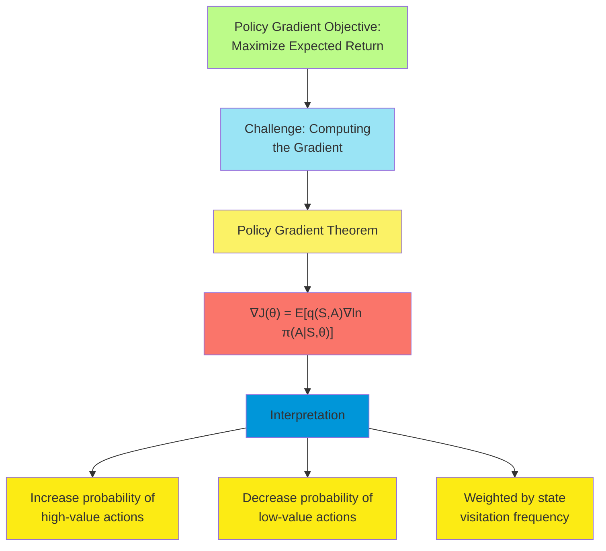
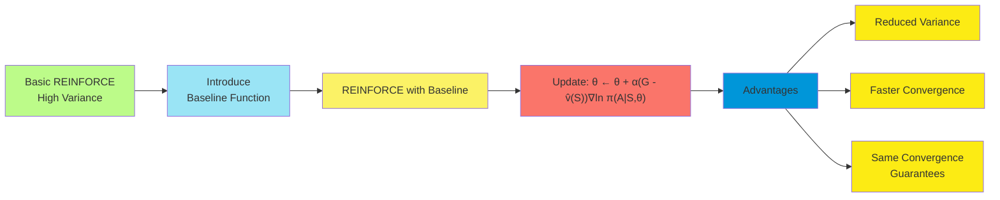
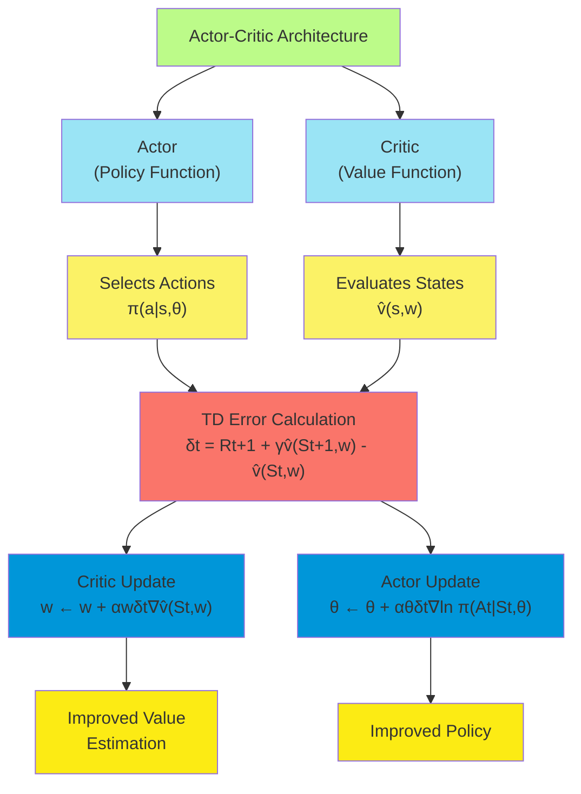
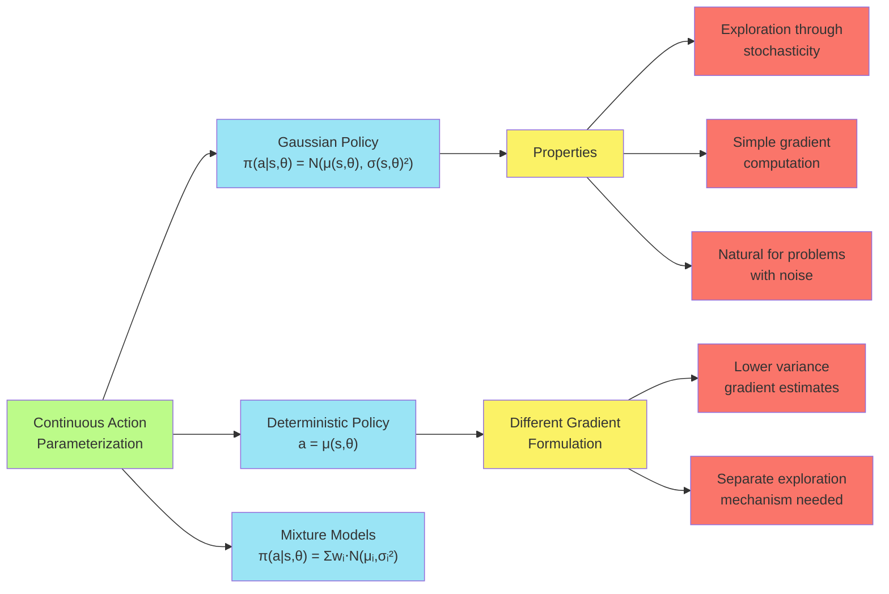
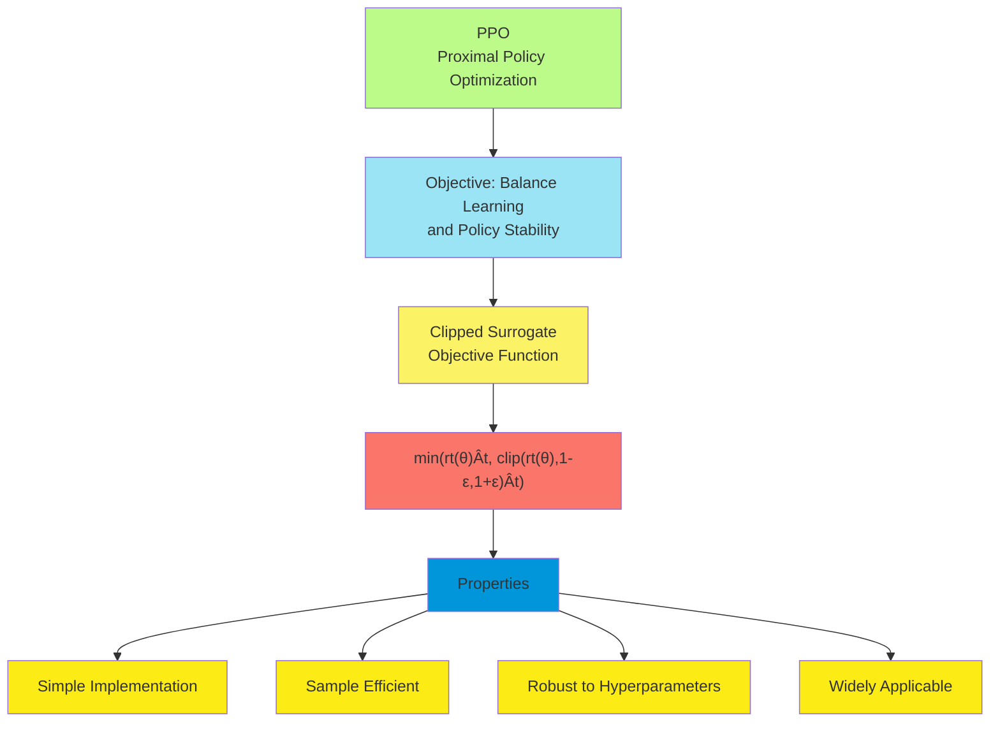
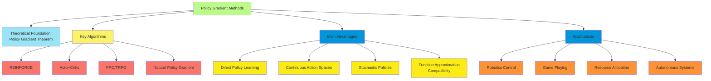

# C-13: Policy Gradient Methods

1. Policy Approximation
    - Policy Parameterization and its Advantages
    - The Policy Gradient Theorem
    - REINFORCE: Monte Carlo Policy Gradient
    - REINFORCE with Baseline
    - Actor–Critic Methods
    - Policy Gradient for Continuing Problems
    - Policy Parameterization for Continuous Actions

#### Policy Approximation

##### Policy Parameterization and its Advantages

In traditional value-based reinforcement learning methods, we estimate value functions and derive policies from them
(usually through greedy or ε-greedy selection). Policy gradient methods take a fundamentally different approach by
directly parameterizing the policy and optimizing the parameters to maximize expected return. This direct policy
parameterization offers several significant advantages.

The policy is typically represented as a parameterized function:

$\pi(a|s, \boldsymbol{\theta}) = \text{Pr}(A_t = a | S_t = s, \boldsymbol{\theta}_t = \boldsymbol{\theta})$

Where $\boldsymbol{\theta} \in \mathbb{R}^d$ is the policy parameter vector that we adjust through learning.

This approach offers several key advantages:

1. **Handling continuous action spaces naturally**: Policy gradient methods can work directly with continuous action
   distributions (e.g., Gaussian policies), avoiding the need for discretization or complex optimization procedures to
   find the maximizing action.
2. **Stochastic policy representation**: The policy can naturally represent stochastic behaviors, which can be
   beneficial for exploration, games with mixed strategies, or problems where randomized behaviors are optimal.
3. **Function approximation compatibility**: The policy can be represented using any differentiable function
   approximator, including neural networks, allowing for expressive policies in complex environments.
4. **Convergence properties**: Policy gradient methods can converge to a locally optimal policy even with function
   approximation, avoiding some of the instability issues of value-based methods.
5. **Incorporating domain knowledge**: Prior knowledge about good policies can be directly encoded in the policy
   parameterization or initialization.
6. **Handling partial observability**: In partially observable environments, stochastic policies can sometimes perform
   better than deterministic ones.

Common policy parameterizations include:

For discrete action spaces:

- **Softmax policies**:
  $\pi(a|s, \boldsymbol{\theta}) = \frac{e^{h(s,a,\boldsymbol{\theta})}}{\sum_{a'} e^{h(s,a',\boldsymbol{\theta})}}$

    Where $h(s,a,\boldsymbol{\theta})$ is a preference function, often a linear function of features:
    $h(s,a,\boldsymbol{\theta}) = \boldsymbol{\theta}^T \mathbf{x}(s,a)$

For continuous action spaces:

- **Gaussian policies**:
  $\pi(a|s, \boldsymbol{\theta}) = \frac{1}{\sigma(s,\boldsymbol{\theta})\sqrt{2\pi}} \exp\left(-\frac{(a-\mu(s,\boldsymbol{\theta}))^2}{2\sigma(s,\boldsymbol{\theta})^2}\right)$

    Where $\mu(s,\boldsymbol{\theta})$ is the mean action and $\sigma(s,\boldsymbol{\theta})$ is the standard deviation,
    both parameterized functions of the state.

A crucial property of policy parameterization for policy gradient methods is that the policy must be differentiable with
respect to the parameters $\boldsymbol{\theta}$. This enables the computation of gradients that guide the parameter
updates toward higher expected returns.

##### The Policy Gradient Theorem

The core objective in policy gradient methods is to maximize the expected return. For the episodic case, this is
formalized as maximizing the start-state value:

$J(\boldsymbol{\theta}) = v_{\pi_\theta}(s_0) = \mathbb{E}*{\pi*\theta}[G_0 | S_0 = s_0]$

The gradient of this objective function with respect to the policy parameters provides the direction of steepest ascent.
However, calculating this gradient is not straightforward because the expectation depends on both the policy parameters
and the environment dynamics.

The Policy Gradient Theorem provides a remarkable solution to this problem. It states that:

$\nabla J(\boldsymbol{\theta}) = \sum_s \mu_{\pi_\theta}(s) \sum_a q_{\pi_\theta}(s,a) \nabla \pi(a|s, \boldsymbol{\theta})$

Or equivalently:

$\nabla J(\boldsymbol{\theta}) = \mathbb{E}*{\pi*\theta}\left[q_{\pi_\theta}(S,A) \nabla \ln \pi(A|S, \boldsymbol{\theta})\right]$

Where:

- $\mu_{\pi_\theta}(s)$ is the on-policy state distribution under policy $\pi_\theta$
- $q_{\pi_\theta}(s,a)$ is the action-value function for policy $\pi_\theta$
- $\nabla \ln \pi(a|s, \boldsymbol{\theta})$ is the score function (gradient of the log policy)

This theorem is profound because it shows that the gradient of the expected return can be estimated using samples of
states, actions, and returns, without requiring knowledge of the environment dynamics or the derivative of the state
distribution. This makes it possible to implement model-free policy gradient algorithms.

The intuition behind the theorem is that it increases the probability of actions that lead to higher returns and
decreases the probability of actions that lead to lower returns, weighted by the frequency of state visitation.

##### REINFORCE: Monte Carlo Policy Gradient

REINFORCE is the most basic policy gradient algorithm, implementing a Monte Carlo approach to policy gradient
estimation. It uses complete episode returns to update the policy parameters.

The algorithm proceeds as follows:

1. Initialize policy parameters $\boldsymbol{\theta}$ arbitrarily
2. For each episode: a. Generate an episode $S_0, A_0, R_1, S_1, A_1, R_2, \ldots, S_{T-1}, A_{T-1}, R_T$ following
   $\pi(\cdot|s, \boldsymbol{\theta})$ b. For each step t of the episode: i. Estimate the return $G_t$ ii. Update the
   policy parameters:
   $\boldsymbol{\theta} \leftarrow \boldsymbol{\theta} + \alpha G_t \nabla \ln \pi(A_t|S_t, \boldsymbol{\theta})$

This update rule directly implements the policy gradient theorem, using the actual return $G_t$ as an unbiased sample of
the action-value $q_{\pi_\theta}(S_t,A_t)$.

The term $\nabla \ln \pi(A_t|S_t, \boldsymbol{\theta})$ is the score function, which indicates how changing the
parameters $\boldsymbol{\theta}$ would affect the probability of taking action $A_t$ in state $S_t$. Multiplying this by
the return $G_t$ ensures that parameters are adjusted to increase the probability of actions that led to good returns
and decrease the probability of actions that led to poor returns.

For a softmax policy parameterization:
$\nabla \ln \pi(a|s, \boldsymbol{\theta}) = \mathbf{x}(s,a) - \sum_{a'} \pi(a'|s, \boldsymbol{\theta}) \mathbf{x}(s,a')$

And for a Gaussian policy with constant variance:
$\nabla \ln \pi(a|s, \boldsymbol{\theta}) = \frac{(a-\mu(s,\boldsymbol{\theta}))}{\sigma^2} \nabla \mu(s,\boldsymbol{\theta})$

REINFORCE has several important properties:

1. It's a model-free algorithm, requiring no knowledge of the environment dynamics
2. It updates parameters after complete episodes (episodic learning)
3. It uses Monte Carlo returns, which can have high variance
4. It converges to a locally optimal policy under appropriate conditions

The main drawback of basic REINFORCE is its high variance in gradient estimates, which can lead to slow and unstable
learning. This issue is addressed by REINFORCE with baseline and actor-critic methods.

##### REINFORCE with Baseline

To address the high variance issue in REINFORCE, we can introduce a baseline function. The resulting algorithm is called
REINFORCE with baseline.

The key insight is that subtracting a baseline $b(s)$ from the return doesn't change the expected gradient (it
introduces zero bias) but can significantly reduce variance if the baseline is chosen appropriately.

The modified update rule becomes:

$\boldsymbol{\theta} \leftarrow \boldsymbol{\theta} + \alpha (G_t - b(S_t)) \nabla \ln \pi(A_t|S_t, \boldsymbol{\theta})$

A natural choice for the baseline is the state value function $v_\pi(s)$, which represents the expected return from
state $s$. By subtracting this value, we're effectively measuring how much better or worse the actual return was
compared to what was expected.

The complete REINFORCE with baseline algorithm is:

1. Initialize policy parameters $\boldsymbol{\theta}$ and baseline parameters $\mathbf{w}$ arbitrarily
2. For each episode: a. Generate an episode $S_0, A_0, R_1, S_1, A_1, R_2, \ldots, S_{T-1}, A_{T-1}, R_T$ following
   $\pi(\cdot|s, \boldsymbol{\theta})$ b. For each step t of the episode: i. Estimate the return $G_t$ ii. Update the
   baseline parameters:
   $\mathbf{w} \leftarrow \mathbf{w} + \alpha_w (G_t - \hat{v}(S_t, \mathbf{w})) \nabla \hat{v}(S_t, \mathbf{w})$ iii.
   Update the policy parameters:
   $\boldsymbol{\theta} \leftarrow \boldsymbol{\theta} + \alpha_\theta (G_t - \hat{v}(S_t, \mathbf{w})) \nabla \ln \pi(A_t|S_t, \boldsymbol{\theta})$

The term $(G_t - \hat{v}(S_t, \mathbf{w}))$ is often called the advantage estimate, as it estimates how much better (or
worse) the action $A_t$ was compared to the average action in state $S_t$.

The baseline itself is typically learned using mean squared error minimization. For linear function approximation:
$\hat{v}(s, \mathbf{w}) = \mathbf{w}^T \mathbf{x}(s)$

And the gradient update: $\nabla \hat{v}(s, \mathbf{w}) = \mathbf{x}(s)$

REINFORCE with baseline offers several advantages over basic REINFORCE:

1. Reduced variance in gradient estimates, leading to more stable learning
2. Faster convergence in many problems
3. The ability to incorporate state-dependent expectations through the baseline

It still maintains the property of converging to a locally optimal policy under appropriate conditions, but with
improved sample efficiency.

##### Actor–Critic Methods

Actor-critic methods represent a significant advancement over REINFORCE with baseline by combining policy gradient
updates with temporal difference learning. As the name suggests, these methods consist of two components:

1. **Actor**: The policy function $\pi(a|s, \boldsymbol{\theta})$ that selects actions
2. **Critic**: The value function $\hat{v}(s, \mathbf{w})$ that evaluates the current policy

The key innovation in actor-critic methods is using temporal difference (TD) learning for the critic instead of Monte
Carlo returns. This allows for online, incremental updates without waiting for episodes to complete.

A basic one-step actor-critic algorithm proceeds as follows:

1. Initialize policy parameters $\boldsymbol{\theta}$ and critic parameters $\mathbf{w}$ arbitrarily
2. For each episode: a. Initialize state $S_0$ b. For each step t of the episode: i. Select action
   $A_t \sim \pi(\cdot|S_t, \boldsymbol{\theta})$ ii. Take action $A_t$, observe reward $R_{t+1}$ and next state
   $S_{t+1}$ iii. Compute TD error:
   $\delta_t = R_{t+1} + \gamma \hat{v}(S_{t+1}, \mathbf{w}) - \hat{v}(S_t, \mathbf{w})$ iv. Update critic:
   $\mathbf{w} \leftarrow \mathbf{w} + \alpha_w \delta_t \nabla \hat{v}(S_t, \mathbf{w})$ v. Update actor:
   $\boldsymbol{\theta} \leftarrow \boldsymbol{\theta} + \alpha_\theta \delta_t \nabla \ln \pi(A_t|S_t, \boldsymbol{\theta})$
   vi. $S_t \leftarrow S_{t+1}$ vii. If $S_{t+1}$ is terminal, break

The TD error $\delta_t$ serves as an estimate of the advantage function, indicating how much better or worse the action
$A_t$ was than expected. It's a biased but much lower-variance estimate compared to using complete returns.

For linear function approximation of the critic: $\hat{v}(s, \mathbf{w}) = \mathbf{w}^T \mathbf{x}(s)$

And the gradient: $\nabla \hat{v}(s, \mathbf{w}) = \mathbf{x}(s)$

Actor-critic methods can be extended in several ways:

1. **n-step actor-critic**: Uses n-step returns instead of one-step TD errors
   $\delta_t = R_{t+1} + \gamma R_{t+2} + \ldots + \gamma^{n-1} R_{t+n} + \gamma^n \hat{v}(S_{t+n}, \mathbf{w}) - \hat{v}(S_t, \mathbf{w})$
2. **Actor-critic with eligibility traces**: Incorporates eligibility traces for more efficient credit assignment
    - Critic traces: $\mathbf{e}_w \leftarrow \gamma \lambda_w \mathbf{e}_w + \nabla \hat{v}(S_t, \mathbf{w})$
    - Actor traces:
      $\mathbf{e}*\theta \leftarrow \gamma \lambda*\theta \mathbf{e}_\theta + \nabla \ln \pi(A_t|S_t, \boldsymbol{\theta})$
    - Updates: $\mathbf{w} \leftarrow \mathbf{w} + \alpha_w \delta_t \mathbf{e}*w$ and
      $\boldsymbol{\theta} \leftarrow \boldsymbol{\theta} + \alpha*\theta \delta_t \mathbf{e}_\theta$
3. **Natural actor-critic**: Uses the natural gradient, which accounts for the geometry of the parameter space
   $\boldsymbol{\theta} \leftarrow \boldsymbol{\theta} + \alpha_\theta F^{-1} \nabla J(\boldsymbol{\theta})$ Where $F$
   is the Fisher information matrix.

Actor-critic methods offer several advantages:

1. Online, incremental learning without waiting for episode completion
2. Lower variance compared to Monte Carlo methods
3. Ability to learn in continuing (non-episodic) environments
4. Faster convergence in many problems
5. Compatibility with function approximation

These advantages have made actor-critic methods a cornerstone of modern reinforcement learning, forming the basis for
many advanced algorithms like A3C, PPO, and SAC.

##### Policy Gradient for Continuing Problems

So far, we've primarily discussed policy gradient methods in the episodic setting. However, many real-world problems are
continuing, with no natural episode boundaries. For such problems, we need to adapt our objective function and
algorithms.

In continuing problems, the objective is typically to maximize the average reward per time step:

$J(\boldsymbol{\theta}) = \lim_{T\to\infty} \frac{1}{T} \sum_{t=0}^{T-1} \mathbb{E}[R_{t+1} | S_0, A_{0:t} \sim \pi_\theta]$

Under ergodicity assumptions (any state can be reached from any other state), this simplifies to:

$J(\boldsymbol{\theta}) = \sum_s \mu_{\pi_\theta}(s) \sum_a \pi(a|s, \boldsymbol{\theta}) r(s, a)$

Where $\mu_{\pi_\theta}(s)$ is the stationary distribution of states under policy $\pi_\theta$.

The policy gradient theorem for the average reward setting states:

$\nabla J(\boldsymbol{\theta}) = \sum_s \mu_{\pi_\theta}(s) \sum_a q_{\pi_\theta}(s,a) \nabla \pi(a|s, \boldsymbol{\theta})$

Or equivalently:

$\nabla J(\boldsymbol{\theta}) = \mathbb{E}*{\pi*\theta}\left[q_{\pi_\theta}(S,A) \nabla \ln \pi(A|S, \boldsymbol{\theta})\right]$

Here, $q_{\pi_\theta}(s,a)$ is the differential action-value function, which measures the expected future reward
relative to the average reward.

For actor-critic methods in the continuing case, we use the differential TD error:

$\delta_t = R_{t+1} - \bar{R} + \hat{v}(S_{t+1}, \mathbf{w}) - \hat{v}(S_t, \mathbf{w})$

Where $\bar{R}$ is an estimate of the average reward, updated with:

$\bar{R} \leftarrow \bar{R} + \alpha_R (R_{t+1} - \bar{R})$

The complete average-reward actor-critic algorithm is:

1. Initialize policy parameters $\boldsymbol{\theta}$, critic parameters $\mathbf{w}$, and average reward estimate
   $\bar{R}$ arbitrarily
2. Initialize state $S_0$
3. For each step t = 0, 1, 2, ...: a. Select action $A_t \sim \pi(\cdot|S_t, \boldsymbol{\theta})$ b. Take action $A_t$,
   observe reward $R_{t+1}$ and next state $S_{t+1}$ c. Compute TD error:
   $\delta_t = R_{t+1} - \bar{R} + \hat{v}(S_{t+1}, \mathbf{w}) - \hat{v}(S_t, \mathbf{w})$ d. Update average reward:
   $\bar{R} \leftarrow \bar{R} + \alpha_R \delta_t$ e. Update critic:
   $\mathbf{w} \leftarrow \mathbf{w} + \alpha_w \delta_t \nabla \hat{v}(S_t, \mathbf{w})$ f. Update actor:
   $\boldsymbol{\theta} \leftarrow \boldsymbol{\theta} + \alpha_\theta \delta_t \nabla \ln \pi(A_t|S_t, \boldsymbol{\theta})$
   g. $S_t \leftarrow S_{t+1}$

This algorithm allows for stable learning in continuing environments without requiring episode boundaries or discounting
future rewards.

Extensions like natural gradients, entropy regularization, and advanced critic designs apply to the continuing case as
well, making policy gradient methods versatile across different problem formulations.

##### Policy Parameterization for Continuous Actions

Many real-world problems involve continuous action spaces, such as robotic control, autonomous driving, and resource
allocation. Policy gradient methods are particularly well-suited for these domains because they can directly
parameterize continuous action distributions.

The most common policy parameterization for continuous actions is the Gaussian policy:

$\pi(a|s, \boldsymbol{\theta}) = \frac{1}{\sigma(s,\boldsymbol{\theta})\sqrt{2\pi}} \exp\left(-\frac{(a-\mu(s,\boldsymbol{\theta}))^2}{2\sigma(s,\boldsymbol{\theta})^2}\right)$

Where:

- $\mu(s,\boldsymbol{\theta})$ is the mean action in state s
- $\sigma(s,\boldsymbol{\theta})$ is the standard deviation of the action distribution

Both the mean and standard deviation can be parameterized functions of the state, often using neural networks:

$\mu(s,\boldsymbol{\theta}*\mu) = f*{\boldsymbol{\theta}*\mu}(s)$
$\sigma(s,\boldsymbol{\theta}*\sigma) = g_{\boldsymbol{\theta}_\sigma}(s)$

Where $\boldsymbol{\theta} = [\boldsymbol{\theta}*\mu, \boldsymbol{\theta}*\sigma]$ combines all policy parameters.

The log-gradient for a Gaussian policy with state-dependent mean and standard deviation is:

$\nabla_{\boldsymbol{\theta}*\mu} \ln \pi(a|s, \boldsymbol{\theta}) = \frac{(a-\mu(s,\boldsymbol{\theta}*\mu))}{\sigma(s,\boldsymbol{\theta}*\sigma)^2} \nabla*{\boldsymbol{\theta}*\mu} \mu(s,\boldsymbol{\theta}*\mu)$

$\nabla_{\boldsymbol{\theta}*\sigma} \ln \pi(a|s, \boldsymbol{\theta}) = \frac{(a-\mu(s,\boldsymbol{\theta}*\mu))^2 - \sigma(s,\boldsymbol{\theta}*\sigma)^2}{\sigma(s,\boldsymbol{\theta}*\sigma)^3} \nabla_{\boldsymbol{\theta}*\sigma} \sigma(s,\boldsymbol{\theta}*\sigma)$

For high-dimensional action spaces, multivariate Gaussian distributions are used:

$\pi(a|s, \boldsymbol{\theta}) = \frac{1}{(2\pi)^{d/2}|\Sigma(s,\boldsymbol{\theta})|^{1/2}} \exp\left(-\frac{1}{2}(a-\mu(s,\boldsymbol{\theta}))^T \Sigma(s,\boldsymbol{\theta})^{-1} (a-\mu(s,\boldsymbol{\theta}))\right)$

Where:

- $a$ and $\mu(s,\boldsymbol{\theta})$ are d-dimensional vectors
- $\Sigma(s,\boldsymbol{\theta})$ is a d×d covariance matrix

To simplify parameterization, the covariance matrix is often chosen to be diagonal:

$\Sigma(s,\boldsymbol{\theta}) = \text{diag}(\sigma_1(s,\boldsymbol{\theta})^2, \sigma_2(s,\boldsymbol{\theta})^2, \ldots, \sigma_d(s,\boldsymbol{\theta})^2)$

This assumes independence between different action dimensions, which is often a reasonable approximation.

Advanced policy parameterizations for continuous actions include:

1. **Mixture of Gaussians**: Represents multi-modal action distributions
   $\pi(a|s, \boldsymbol{\theta}) = \sum_{i=1}^k w_i(s,\boldsymbol{\theta}) \mathcal{N}(a|\mu_i(s,\boldsymbol{\theta}), \sigma_i(s,\boldsymbol{\theta})^2)$
2. **Normalizing Flows**: Transforms a simple base distribution into a more complex one through a series of invertible
   transformations
3. **Deterministic Policies**: Directly outputs a deterministic action $a = \mu(s,\boldsymbol{\theta})$ Used in
   deterministic policy gradient (DPG) and deep deterministic policy gradient (DDPG) algorithms

For deterministic policies, the policy gradient theorem takes a different form:

$\nabla J(\boldsymbol{\theta}) = \mathbb{E}*{s \sim \rho^\mu}\left[\nabla_a q*\pi(s,a)|*{a=\mu(s)} \nabla*{\boldsymbol{\theta}} \mu(s,\boldsymbol{\theta})\right]$

This avoids the need to sample from a stochastic policy during gradient estimation, potentially reducing variance.

#### Advanced Policy Gradient Methods

##### Natural Policy Gradients

The standard policy gradient updates the parameters in the direction of steepest ascent in Euclidean space. However, the
parameter space of policies has a natural Riemannian structure, where the distance between policies should be measured
by their behavior, not by the Euclidean distance between parameters.

Natural policy gradient methods incorporate this structure by using the Fisher information matrix to define the
direction of steepest ascent:

$\boldsymbol{\theta} \leftarrow \boldsymbol{\theta} + \alpha F(\boldsymbol{\theta})^{-1} \nabla J(\boldsymbol{\theta})$

Where $F(\boldsymbol{\theta})$ is the Fisher information matrix:

$F(\boldsymbol{\theta}) = \mathbb{E}*{\pi*\theta}\left[\nabla \ln \pi(A|S, \boldsymbol{\theta}) \nabla \ln \pi(A|S, \boldsymbol{\theta})^T\right]$

The natural gradient offers several advantages:

1. Invariance to parameterization: The update direction doesn't depend on how the policy is parameterized
2. More efficient learning: Often requires fewer samples to converge
3. Better step sizes: The natural metric provides a better sense of how large a parameter change should be

Computing the exact Fisher information matrix and its inverse is often impractical for large parameter vectors. Several
approximation techniques have been developed:

1. **Conjugate gradient methods**: Solve the system $F(\boldsymbol{\theta}) x = \nabla J(\boldsymbol{\theta})$
   iteratively
2. **Kronecker-factored approximations**: Approximate $F$ as a Kronecker product of smaller matrices
3. **Diagonal approximations**: Use only the diagonal elements of $F$

Trust Region Policy Optimization (TRPO) and Proximal Policy Optimization (PPO) are modern policy gradient methods that
build on the natural gradient concept, using constraints or penalties to limit the size of policy updates.

##### Advantage Actor-Critic (A2C and A3C)

A2C (Advantage Actor-Critic) and its asynchronous variant A3C are influential actor-critic methods that use advantage
estimates to reduce variance in policy gradient updates.

The advantage function is defined as:

$A_\pi(s,a) = q_\pi(s,a) - v_\pi(s)$

It measures how much better (or worse) an action is compared to the average action in a state. Using the advantage
instead of the Q-value can significantly reduce variance without introducing bias.

In practice, advantages are often estimated using the TD error:

$\hat{A}(S_t, A_t) = R_{t+1} + \gamma \hat{v}(S_{t+1}, \mathbf{w}) - \hat{v}(S_t, \mathbf{w})$

Or with n-step returns:

$\hat{A}(S_t, A_t) = \sum_{i=0}^{n-1} \gamma^i R_{t+i+1} + \gamma^n \hat{v}(S_{t+n}, \mathbf{w}) - \hat{v}(S_t, \mathbf{w})$

The actor update becomes:

$\boldsymbol{\theta} \leftarrow \boldsymbol{\theta} + \alpha_\theta \hat{A}(S_t, A_t) \nabla \ln \pi(A_t|S_t, \boldsymbol{\theta})$

A3C (Asynchronous Advantage Actor-Critic) extends this idea by running multiple agents in parallel, each interacting
with its own copy of the environment. This parallel architecture has several benefits:

1. More diverse experience collection, improving exploration
2. Better utilization of multi-core CPU resources
3. Decorrelation of updates, leading to more stable learning
4. Faster convergence in wall-clock time

The core algorithm remains similar to A2C, but with asynchronous updates from multiple workers to a global parameter
set. Each worker:

1. Copies the global parameters
2. Interacts with its environment copy for n steps
3. Computes gradients based on its experience
4. Updates the global parameters asynchronously

Both A2C and A3C have been highly influential in deep reinforcement learning, demonstrating strong performance across a
wide range of tasks while maintaining algorithmic simplicity.

##### Proximal Policy Optimization (PPO)

Proximal Policy Optimization (PPO) addresses a key challenge in policy gradient methods: determining the appropriate
step size. Taking steps that are too large can lead to catastrophic policy degradation, while steps that are too small
result in slow learning.

PPO solves this by optimizing a "surrogate" objective function that includes a penalty for large policy changes:

$J^{\text{PPO}}(\boldsymbol{\theta}) = \mathbb{E}\left[\min\left(r_t(\boldsymbol{\theta})\hat{A}_t, \text{clip}(r_t(\boldsymbol{\theta}), 1-\epsilon, 1+\epsilon)\hat{A}_t\right)\right]$

Where:

- $r_t(\boldsymbol{\theta}) = \frac{\pi(A_t|S_t, \boldsymbol{\theta})}{\pi(A_t|S_t, \boldsymbol{\theta}_{\text{old}})}$
  is the probability ratio
- $\hat{A}_t$ is the advantage estimate
- $\epsilon$ is a hyperparameter controlling the size of policy updates (typically 0.1 or 0.2)

The clipping operation ensures that the objective function doesn't incentivize changes that would move the probability
ratio $r_t(\boldsymbol{\theta})$ outside the interval $[1-\epsilon, 1+\epsilon]$.

PPO has several key properties:

1. Simplicity: Easier to implement than methods like TRPO
2. Sample efficiency: Often requires fewer samples than A2C/A3C
3. Robustness: Works well across a wide range of hyperparameters
4. Compatibility with recurrent networks and continuous actions

These properties have made PPO one of the most widely used policy gradient methods in recent years, with applications
ranging from game playing to robotic control.

#### Case Studies and Applications

##### Continuous Control: Robotic Tasks

Policy gradient methods have achieved remarkable success in continuous control tasks, particularly in robotics. These
problems are characterized by:

- Continuous state and action spaces
- Complex dynamics
- Long-term dependencies
- Physical constraints

A classic example is the inverted pendulum or cart-pole system, where the goal is to balance a pole by moving a cart
left or right. More complex examples include robotic arm manipulation, locomotion (walking, running), and autonomous
navigation.

For these tasks, a Gaussian policy is typically used:
$\pi(a|s, \boldsymbol{\theta}) = \mathcal{N}(\mu(s,\boldsymbol{\theta}), \sigma(s,\boldsymbol{\theta})^2)$

The mean action $\mu(s,\boldsymbol{\theta})$ is often represented by a neural network, while the standard deviation
$\sigma(s,\boldsymbol{\theta})$ can be state-dependent or a global parameter.

Advanced algorithms like TRPO, PPO, and SAC (Soft Actor-Critic) have demonstrated impressive results on benchmark
robotic tasks, including:

1. Learning to walk with various legged robots
2. Dexterous manipulation with robotic hands
3. Acrobatic maneuvers with simulated humanoids
4. Object grasping and placement

These successes highlight the capability of policy gradient methods to learn complex behaviors directly from experience,
without requiring explicit models of the environment dynamics.

##### Game Playing and Decision Making

Policy gradient methods have also shown strong performance in game playing and decision-making tasks:

1. **Atari Games**: A3C and PPO have achieved human-level or superhuman performance on many Atari games directly from
   pixel inputs.
2. **Go, Chess, and Shogi**: AlphaGo and its successors used policy gradient methods (combined with MCTS) to achieve
   superhuman performance in these complex board games.
3. **StarCraft II**: Agents like AlphaStar use variants of policy gradient methods to master this complex real-time
   strategy game.
4. **Poker and other imperfect information games**: Policy gradient methods can learn stochastic policies that
   approximate Nash equilibria in these games.

For discrete action spaces in these domains, softmax policies are typically used:
$\pi(a|s, \boldsymbol{\theta}) = \frac{e^{f(s,a,\boldsymbol{\theta})}}{\sum_{a'} e^{f(s,a',\boldsymbol{\theta})}}$

Where $f(s,a,\boldsymbol{\theta})$ is often a deep neural network processing state information and outputting action
preferences.

The success in these domains demonstrates that policy gradient methods can scale to problems with high-dimensional state
spaces and complex decision-making requirements.

#### Theoretical Analysis and Insights

##### Convergence Properties

The convergence properties of policy gradient methods depend on the specific algorithm and the problem setting:

1. **Basic policy gradient (REINFORCE)**:
    - Converges to a local optimum under appropriate conditions
    - Requires decreasing step sizes satisfying Robbins-Monro conditions
    - May have high variance, leading to slow convergence
2. **Natural policy gradient**:
    - Converges more reliably than standard policy gradient
    - Invariant to parameterization, improving consistency
    - Still converges to local optima in general
3. **Actor-critic methods**:
    - Convergence depends on both actor and critic updates
    - Linear function approximation with compatible features provides theoretical guarantees
    - Non-linear function approximation (e.g., neural networks) lacks strong theoretical guarantees but works well in
      practice
4. **Modern methods (PPO, TRPO)**:
    - Designed for practical performance rather than theoretical guarantees
    - Empirically more stable than earlier methods
    - Monotonic improvement guarantees under certain assumptions

The "Policy Gradient Theorem" itself ensures that the gradient estimator is unbiased, but does not guarantee convergence
to global optima. The non-convex nature of the objective function means that policy gradient methods typically converge
to local optima.

##### Exploration-Exploitation Trade-off

Policy gradient methods handle the exploration-exploitation trade-off through stochastic policies. The policy's
randomness naturally encourages exploration, with the degree of exploration controlled by the policy's entropy.

Several approaches explicitly manage this trade-off:

1. **Entropy regularization**: Adds a term to the objective function that rewards higher entropy
   $J_{\text{ent}}(\boldsymbol{\theta}) = J(\boldsymbol{\theta}) + \beta H(\pi_\theta)$ Where
   $H(\pi_\theta) = -\sum_s \mu(s) \sum_a \pi(a|s, \boldsymbol{\theta}) \ln \pi(a|s, \boldsymbol{\theta})$ is the policy
   entropy
2. **Decreasing stochasticity**: Gradually reduces exploration by decreasing the policy's standard deviation or
   temperature over time
3. **Separate exploration policies**: Uses different policies for exploration and exploitation
4. **Intrinsic motivation**: Adds intrinsic rewards for visiting novel or uncertain states

The balance between exploration and exploitation is particularly important in sparse reward environments, where
effective exploration is necessary to discover rewarding behaviors.

##### Sample Efficiency and Variance Reduction

A key challenge in policy gradient methods is sample efficiency. Several techniques have been developed to improve this
aspect:

1. **Baselines and advantage estimation**: Reduces variance by subtracting a baseline from returns
    - State value function baseline: $\hat{v}(s, \mathbf{w})$
    - Average return baseline: $\bar{G}$
    - Advantage actor-critic: Uses TD errors as advantage estimates
2. **Importance sampling**: Reuses past experiences with appropriate weighting
    - Off-policy policy gradient:
      $\boldsymbol{\theta} \leftarrow \boldsymbol{\theta} + \alpha \frac{\pi(A_t|S_t, \boldsymbol{\theta})}{\mu(A_t|S_t)} G_t \nabla \ln \pi(A_t|S_t, \boldsymbol{\theta})$
    - Requires careful handling to avoid high variance
3. **Experience replay**: Stores and reuses past experiences
    - Increases sample efficiency by learning from the same data multiple times
    - Requires off-policy corrections if the policy changes significantly
4. **Parallel data collection**: Collects experiences from multiple agents simultaneously
    - A3C, IMPALA, and other distributed algorithms
    - Increases throughput and diversity of experiences

These techniques have significantly improved the practical applicability of policy gradient methods, making them
competitive with value-based approaches in terms of sample efficiency.

#### Summary and Key Takeaways

Policy gradient methods represent a powerful approach to reinforcement learning that directly optimizes policy
parameters to maximize expected returns. They offer several key advantages:

1. **Direct policy parameterization**: Learns a policy without requiring value function maximization
2. **Natural handling of continuous actions**: Works well for robotic control and other continuous domains
3. **Stochastic policy representation**: Enables learning of mixed strategies and natural exploration
4. **Convergence guarantees**: Even with function approximation, converges to locally optimal policies
5. **Compatibility with function approximation**: Works well with neural networks and other complex function
   approximators

Key algorithms in the policy gradient family include:

- REINFORCE: Basic Monte Carlo policy gradient
- REINFORCE with baseline: Reduces variance using a value function baseline
- Actor-critic methods: Combines policy gradients with temporal difference learning
- Natural policy gradients: Accounts for the Riemannian geometry of the parameter space
- PPO and TRPO: Modern methods with improved stability and sample efficiency

As reinforcement learning continues to advance, policy gradient methods remain a cornerstone approach, particularly for
problems with continuous action spaces or where stochastic policies are beneficial. Their conceptual simplicity,
theoretical foundations, and practical effectiveness have established them as essential tools in the reinforcement
learning toolkit.

