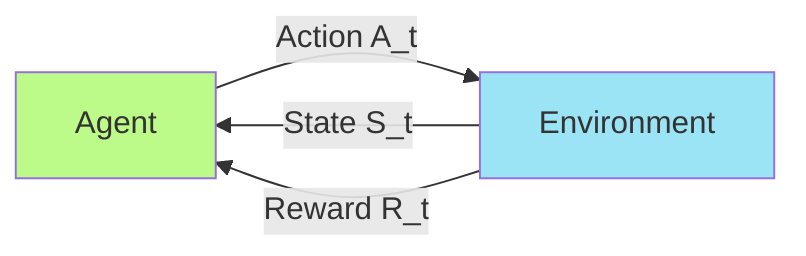
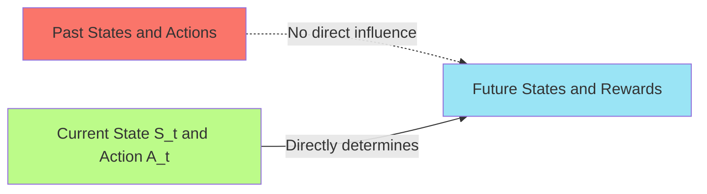
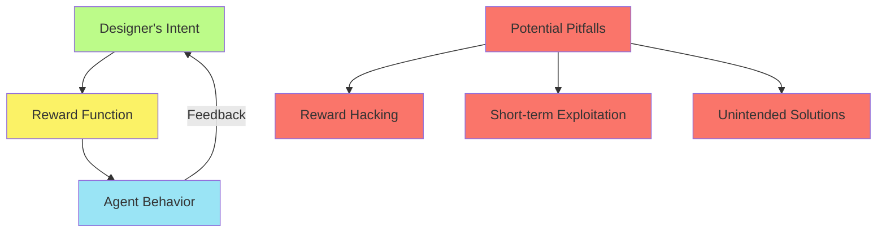
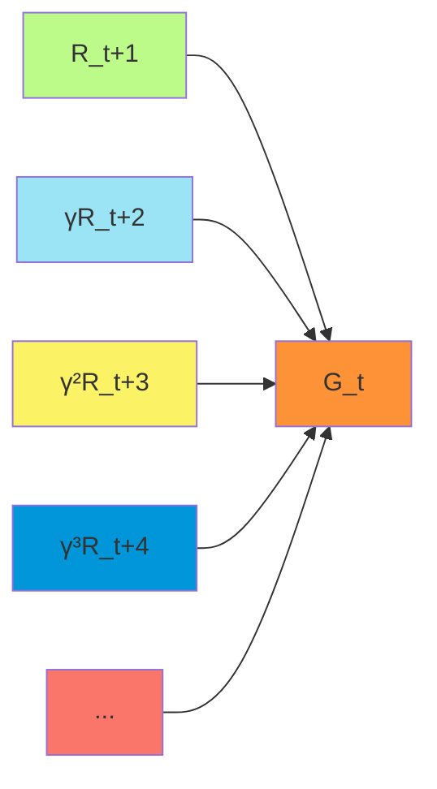
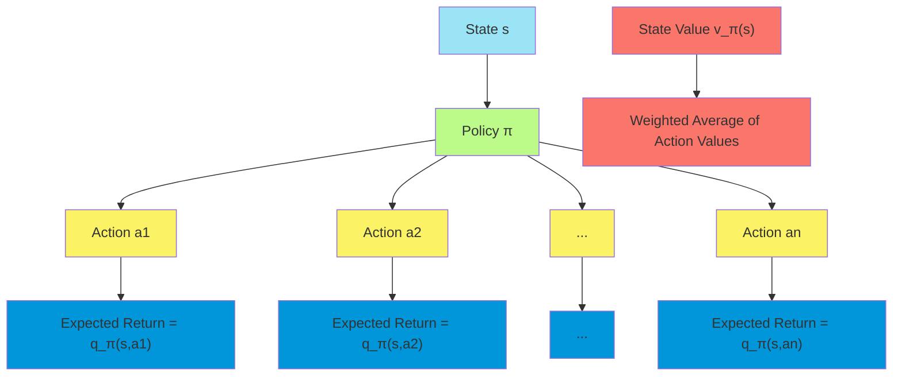
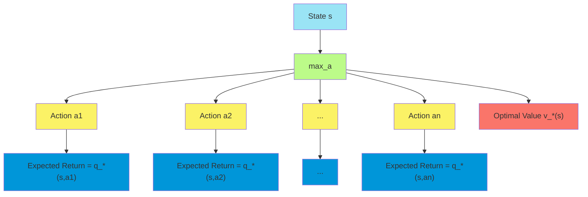
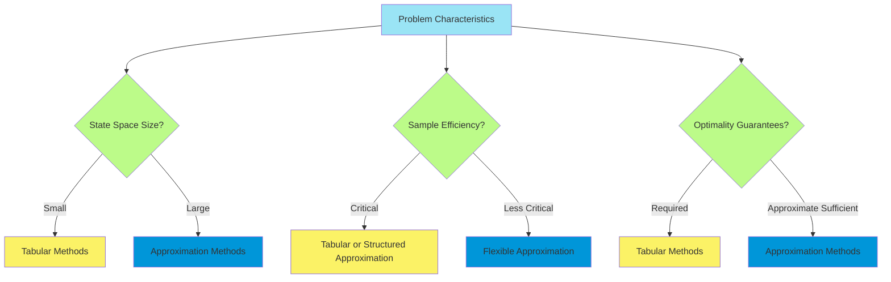

# C-2: Markov Decision Processes

1. The Agent-Environment Interface

    - States, Actions, and Rewards
    - Episodic vs. Continuing Tasks
    - The Markov Property
    - Formal MDP Definition

2. Goals and Rewards

    - Reward Hypothesis
    - Designing Reward Functions
    - Examples and Applications

3. Returns and Episodes

    - Episodic Tasks
    - Continuing Tasks
    - Discounting
    - Mathematical Formulations

4. Unified Notation

    - Episodic and Continuing Tasks
    - Terminal States
    - Time Indexing Conventions

5. Policies and Value Functions

    - Deterministic and Stochastic Policies
    - State-Value Functions
    - Action-Value Functions
    - Bellman Equations for Prediction

6. Optimal Policies and Value Functions

    - Optimal Value Functions
    - Policy Improvement Theorem
    - Bellman Optimality Equation
    - Finding Optimal Policies

7. Optimality and Approximation
    - Computational Complexity
    - Practical Limitations
    - Tabular Methods vs. Approximation

#### The Agent-Environment Interface

##### States, Actions, and Rewards

The Markov Decision Process (MDP) framework formalizes the interaction between an agent and its environment. This
interaction occurs in discrete time steps and involves three core elements:

1. **States**: The set of possible situations or configurations in which the agent can find itself, denoted by $S$. At
   each time step $t$, the agent receives information about the current state $S_t \in S$.
2. **Actions**: The set of possible choices available to the agent, denoted by $A$. At each time step, the agent selects
   an action $A_t \in A(S_t)$, where $A(s)$ is the set of actions available in state $s$.
3. **Rewards**: The numerical feedback signals provided by the environment, denoted by $R$. After taking action $A_t$ in
   state $S_t$, the agent receives a reward $R_{t+1}$.

This interaction creates a trajectory or sequence of states, actions, and rewards:

$$S_0, A_0, R_1, S_1, A_1, R_2, S_2, A_2, R_3, \ldots$$

The key insight of the MDP framework is that it separates the agent from the environment at a specific boundary. The
agent has complete control over its actions but only partial control over the state (through the influence of its
actions). The environment determines the state transitions and rewards based on the agent's actions.

This framework is extremely flexible and can represent a wide variety of decision-making problems. For example:

- In robotics, states might be sensor readings, actions might be motor commands, and rewards might be progress toward a
  goal.
- In game playing, states might be board configurations, actions might be legal moves, and rewards might be +1 for
  winning, -1 for losing, and 0 otherwise.
- In resource management, states might be resource levels, actions might be allocation decisions, and rewards might be
  profit or utility.

##### Episodic vs. Continuing Tasks

MDPs can be categorized into two types based on how they evolve over time:

1. **Episodic Tasks**: These have a natural endpoint or terminal state, dividing the agent's experience into distinct
   episodes. For example:

    - A game of chess ends when one player wins or when there's a draw
    - A maze navigation task ends when the agent reaches the exit
    - A product recommendation task ends when the customer makes a purchase

    In episodic tasks, the agent reaches a terminal state, after which the environment is reset to some initial state
    distribution for the next episode.

2. **Continuing Tasks**: These go on continuously without natural breaks. For example:

    - An automated stock trading system that operates indefinitely
    - A process control system maintaining optimal conditions
    - An autonomous agent that must survive in a persistent environment

    In continuing tasks, the agent must learn to balance immediate rewards with long-term consequences in an ongoing
    fashion.

The distinction affects how we formulate the agent's objective:

- In episodic tasks, we can simply sum rewards over an episode
- In continuing tasks, we typically need discounting to ensure that the sum of rewards remains finite

##### The Markov Property

The defining characteristic of MDPs is the Markov property, which states that the future depends only on the present
state and action, not on the past trajectory:

$$P(S_{t+1}=s', R_{t+1}=r | S_0, A_0, R_1, \ldots, S_t, A_t) = P(S_{t+1}=s', R_{t+1}=r | S_t, A_t)$$

This means that the current state encapsulates all relevant information from the history of the process. When the agent
observes the current state, it doesn't need to know how it got there to make optimal decisions.

The Markov property is often visualized as a "memoryless" property—the future state depends only on the current state
and action, not on the sequence of states and actions that led to the current state.

In practice, many problems are not perfectly Markovian, but can be approximated as MDPs by:

1. Enriching the state representation to include relevant historical information
2. Using partially observable MDP frameworks when the Markov property cannot be satisfied
3. Adding memory mechanisms to the agent's policy

##### Formal MDP Definition

Formally, an MDP is defined as a tuple $(S, A, P, R, \gamma)$:

1. $S$: A set of states
2. $A$: A set of actions
3. $P$: A state transition probability function $P(s', r | s, a) = Pr{S_{t+1}=s', R_{t+1}=r | S_t=s, A_t=a}$
4. $R$: A reward function derivable from $P$
   $R(s, a) = \mathbb{E}[R_{t+1} | S_t=s, A_t=a] = \sum_{s', r} r \cdot P(s', r | s, a)$
5. $\gamma$: A discount factor, $\gamma \in [0, 1]$

The state transition probabilities satisfy:

$$\sum_{s' \in S} \sum_{r \in R} P(s', r | s, a) = 1, \text{ for all } s \in S, a \in A(s)$$

From $P$, we can derive several useful quantities:

- The state transition probabilities: $P(s' | s, a) = \sum_{r \in R} P(s', r | s, a)$
- The expected rewards for state-action pairs: $R(s, a) = \sum_{s', r} r \cdot P(s', r | s, a)$
- The expected rewards for state-action-next-state transitions:
  $R(s, a, s') = \sum_{r} r \cdot \frac{P(s', r | s, a)}{P(s' | s, a)}$

This formal definition provides a complete mathematical description of the environment's dynamics, which is essential
for the development of solution methods such as dynamic programming.

#### 2. Goals and Rewards

##### Reward Hypothesis

The reward hypothesis is a fundamental principle in reinforcement learning:

> **All goals can be formulated as the maximization of the expected cumulative reward.**

This hypothesis suggests that any objective we might want to achieve—whether it's winning a game, optimizing resource
allocation, or teaching a robot to walk—can be expressed by designing an appropriate reward signal. The agent's sole
objective is then to maximize the expected sum of these rewards over time.

The power of this hypothesis lies in its simplicity and generality. It reduces the complex problem of goal-directed
behavior to a single, well-defined optimization problem: maximize expected cumulative reward. This creates a clear
learning signal for the agent and a principled way to evaluate different policies.

For example:

- If we want a robot to reach a destination quickly, we can give a negative reward (-1) for each time step until it
  reaches the goal
- If we want an agent to win a game, we can give a positive reward (+1) for winning and a negative reward (-1) for
  losing
- If we want a system to maintain a stable state, we can give negative rewards proportional to deviations from the
  desired state

##### Designing Reward Functions

Designing appropriate reward functions is both art and science. The reward function translates the designer's intentions
into a signal that guides the agent's learning. Several principles inform effective reward design:

1. **Reward the outcome, not the method**: It's generally better to reward achieving the goal rather than the specific
   behaviors expected to lead to the goal. For example, reward a chess agent for winning, not for taking the opponent's
   pieces.
2. **Immediate vs. delayed rewards**: Immediate rewards provide faster learning but may lead to myopic behavior. Delayed
   rewards better reflect long-term objectives but make learning more difficult.
3. **Sparse vs. dense rewards**: Sparse rewards (given only at goal achievement) are often more aligned with the true
   objective but make exploration challenging. Dense rewards (given throughout the task) aid learning but may distort
   the objective.
4. **Reward shaping**: Adding intermediate rewards to guide learning can be helpful but must be done carefully to avoid
   introducing suboptimal behavior.
5. **Reward scaling**: The absolute magnitude of rewards matters less than their relative values, but extreme
   differences can cause numerical issues.

Poorly designed reward functions can lead to unexpected and undesired behavior, as the agent will optimize for the
reward signal it receives, not the designer's unstated intentions. This is sometimes called the "reward hacking"
problem.

##### Examples and Applications

To illustrate the versatility of the reward framework, consider these examples:

1. **Robot Navigation**:
    - States: Position and orientation in the environment
    - Actions: Motor commands (forward, turn left, turn right)
    - Rewards: -1 per time step until reaching the goal, encouraging efficient paths
2. **Financial Portfolio Management**:
    - States: Current portfolio allocation and market conditions
    - Actions: Buy, sell, or hold different assets
    - Rewards: Portfolio returns adjusted for risk
3. **Healthcare Treatment Planning**:
    - States: Patient health indicators and medical history
    - Actions: Treatment options (medication, surgery, therapy)
    - Rewards: Indicators of improved health outcomes minus treatment costs
4. **Game Playing**:
    - States: Game configurations
    - Actions: Legal moves
    - Rewards: +1 for winning, -1 for losing, 0 for draws or continuing states
5. **Resource Allocation**:
    - States: Current resource distribution and demand
    - Actions: Resource allocation decisions
    - Rewards: Measures of efficiency, fairness, or profit

In each case, the reward function encodes the objective, and the agent learns to maximize it through interaction with
the environment. The flexibility of the reward framework allows reinforcement learning to be applied to a vast array of
problems across different domains.

#### 3. Returns and Episodes

##### Episodic Tasks

In episodic tasks, the agent-environment interaction naturally divides into sequences called episodes. Each episode ends
in a terminal state, after which the system resets to a new starting state.

The key characteristics of episodic tasks are:

1. **Finite duration**: Each episode has a definite end point
2. **Terminal states**: Special states that end the episode
3. **Independence between episodes**: Each episode starts fresh, regardless of how previous episodes ended
4. **Reset mechanism**: After reaching a terminal state, the environment resets to an initial state distribution

Examples of episodic tasks include:

- Games with clear ending conditions (chess, backgammon, etc.)
- Navigation tasks with goal locations
- Decision processes with natural completion points (e.g., customer service interactions)

In episodic tasks, we denote the terminal time step as $T$. The set of all non-terminal states is denoted as $S$, while
the set of all states including the terminal state is denoted as $S^+$.

##### Continuing Tasks

Continuing tasks have no natural episodes or terminal states. The agent-environment interaction continues indefinitely
without reset points.

The key characteristics of continuing tasks are:

1. **Infinite horizon**: The interaction potentially continues forever
2. **No terminal states**: The process never naturally ends
3. **Persistent consequences**: Actions have long-term effects that cannot be reset
4. **Need for long-term balance**: The agent must consider the indefinite future

Examples of continuing tasks include:

- Stock trading systems that operate continuously
- Persistent control problems (e.g., HVAC system management)
- Survival-based scenarios where the agent must remain functional indefinitely

The distinction between episodic and continuing tasks influences how we formulate the agent's objective and measure
performance.

##### Discounting

To deal with potentially infinite sums of rewards in continuing tasks (and sometimes in episodic tasks), we use
discounting. The discount factor $\gamma \in [0, 1]$ determines how much the agent values future rewards relative to
immediate ones.

The discounted return is defined as:

$$G_t = R_{t+1} + \gamma R_{t+2} + \gamma^2 R_{t+3} + \ldots = \sum_{k=0}^{\infty} \gamma^k R_{t+k+1}$$

This formulation has several important properties:

1. **Convergence**: For $\gamma < 1$ and bounded rewards, the sum converges to a finite value even in infinite-horizon
   tasks
2. **Present value**: Future rewards are weighted less than immediate rewards, reflecting time preference
3. **Mathematical convenience**: The discounted return has a recursive relationship: $$G_t = R_{t+1} + \gamma G_{t+1}$$
4. **Interpretability**: $\gamma$ can be viewed as a probability of continuation or as an interest rate

The discount factor affects the agent's behavior:

- $\gamma$ close to 0: Myopic behavior, focusing almost exclusively on immediate rewards
- $\gamma$ close to 1: Far-sighted behavior, giving significant weight to distant future rewards

##### Mathematical Formulations

The return (cumulative reward) is defined differently depending on the task type:

1. **Episodic Tasks without Discounting**: $$G_t = R_{t+1} + R_{t+2} + \ldots + R_T$$ where $T$ is the final time step
   of the episode.
2. **Episodic Tasks with Discounting**:
   $$G_t = R_{t+1} + \gamma R_{t+2} + \gamma^2 R_{t+3} + \ldots + \gamma^{T-t-1} R_T$$ Discounting can be useful even in
   episodic tasks to prioritize earlier rewards.
3. **Continuing Tasks**:
   $$G_t = R_{t+1} + \gamma R_{t+2} + \gamma^2 R_{t+3} + \ldots = \sum_{k=0}^{\infty} \gamma^k R_{t+k+1}$$ Discounting
   is necessary to ensure the sum converges to a finite value.

For continuing tasks, if $\gamma = 1$ and rewards are non-zero, the return could be infinite. But with $\gamma < 1$,
even a constant stream of rewards has a finite sum:

$$R + \gamma R + \gamma^2 R + \ldots = R \sum_{k=0}^{\infty} \gamma^k = \frac{R}{1-\gamma}$$

The agent's objective in all cases is to maximize the expected return from each state, which leads to the definition of
value functions in the next section.

#### 4. Unified Notation

##### Episodic and Continuing Tasks

To streamline the theory and algorithms of reinforcement learning, it's beneficial to use a unified notation that
handles both episodic and continuing tasks. The key insight is to treat episodic termination as a transition to a
special absorbing state that only transitions to itself with zero reward.

This unification allows us to:

1. Use the same update equations for both types of tasks
2. Apply the same algorithms with minimal modification
3. Compare methods across different task types
4. Switch smoothly between episodic and continuing formulations

For example, consider an episodic task that terminates after three steps with rewards +1, +1, +1. Using the absorbing
state formulation, we can extend this to an infinite sequence: +1, +1, +1, 0, 0, 0, ... where all rewards after
termination are zero.

##### Terminal States

Terminal states are handled specially in the unified notation:

1. **Value of terminal states**: The value of terminal states is defined as zero since no future rewards are possible
   after termination.
2. **Transitions from terminal states**: Terminal states transition only to themselves with a reward of zero:
   $$P(terminal | terminal, a) = 1 \text{ and } R(terminal, a, terminal) = 0$$
3. **Return calculation**: For both episodic and continuing tasks, we can use the same infinite-sum formulation for
   returns, with the understanding that all rewards after termination are zero in episodic tasks.

This allows us to write the general form of the return as:

$$G_t = \sum_{k=0}^{\infty} \gamma^k R_{t+k+1}$$

which works for both episodic tasks (where rewards become zero after termination) and continuing tasks.

##### Time Indexing Conventions

To further unify episodic and continuing formulations, we adopt specific conventions for time indexing:

1. **Episode-specific indexing**: When discussing multiple episodes, we can use $S_{t,i}$ to denote the state at time
   $t$ of episode $i$. However, since we rarely need to distinguish between episodes, we typically drop the episode
   index.
2. **Time step resets**: In episodic tasks, the time index resets to $t=0$ at the beginning of each episode. This
   simplifies notation and allows algorithms to treat each episode independently.
3. **Terminal time**: We denote the time of termination as $T$, which may vary across episodes. For continuing tasks, we
   can formally set $T = \infty$.
4. **Handling terminal transitions**: When an episode terminates at time $T$, the next state $S_T$ is considered to be
   the terminal state. No further actions are taken, and the environment is reset for the next episode.

Using these conventions, we can write equations that apply equally well to both episodic and continuing cases. For
example, the general update equation for value functions becomes:

$$V(S_t) \leftarrow V(S_t) + \alpha [G_t - V(S_t)]$$

where $G_t$ is calculated using the unified formulation of returns, and the algorithm automatically handles the
differences between episodic and continuing tasks.

#### 5. Policies and Value Functions

##### Deterministic and Stochastic Policies

A policy defines the agent's behavior by mapping states to actions (or probabilities of actions). There are two main
types of policies:

1. **Deterministic Policies**: These specify exactly which action to take in each state: $$\pi(s) = a$$ Deterministic
   policies are simpler and often easier to implement but may be less flexible in stochastic environments.
2. **Stochastic Policies**: These specify the probability of taking each action in each state:
   $$\pi(a|s) = P(A_t=a | S_t=s)$$ Stochastic policies can be beneficial for exploration, handling uncertainty, and in
   some cases, achieving optimal performance in partially observable environments.

All policies must satisfy:

- For deterministic policies: $\pi(s) \in A(s)$ for all $s \in S$
- For stochastic policies: $\sum_{a \in A(s)} \pi(a|s) = 1$ and $\pi(a|s) \geq 0$ for all $s \in S, a \in A(s)$

The choice between deterministic and stochastic policies depends on the problem characteristics and solution approach.
Many reinforcement learning algorithms learn stochastic policies during training but may converge to deterministic
policies.

##### State-Value Functions

The state-value function $v_\pi(s)$ quantifies how good it is for the agent to be in a particular state $s$ when
following policy $\pi$. Formally, it is defined as the expected return starting from state $s$ and following policy
$\pi$ thereafter:

$$v_\pi(s) = \mathbb{E}*\pi[G_t | S_t=s] = \mathbb{E}*\pi\left[\sum_{k=0}^{\infty} \gamma^k R_{t+k+1} \Big| S_t=s\right]$$

The state-value function has several important properties:

1. **Evaluative measure**: It provides a numerical assessment of each state's quality under the current policy
2. **Future-oriented**: It considers the long-term consequences of being in a state, not just immediate rewards
3. **Policy-dependent**: Different policies lead to different value functions for the same states
4. **Predictive**: It predicts the cumulative reward the agent will receive from each state

The state-value function plays a critical role in policy evaluation and improvement, as it allows the agent to compare
different states and assess the quality of its current policy.

##### Action-Value Functions

The action-value function $q_\pi(s,a)$ quantifies how good it is to take a specific action $a$ in state $s$ and then
follow policy $\pi$ thereafter. Formally:

$$q_\pi(s,a) = \mathbb{E}*\pi[G_t | S_t=s, A_t=a] = \mathbb{E}*\pi\left[\sum_{k=0}^{\infty} \gamma^k R_{t+k+1} \Big| S_t=s, A_t=a\right]$$

Action-value functions have several advantages over state-value functions:

1. **Action selection**: They directly inform which actions are best in each state
2. **Model-free learning**: They can be learned and used without a model of the environment
3. **Exploration guidance**: They naturally provide information about the relative quality of different actions

The relationship between state-value and action-value functions is:

$$v_\pi(s) = \sum_{a} \pi(a|s) q_\pi(s,a)$$

That is, the value of a state is the expected value of the actions taken from that state according to the policy.

##### Bellman Equations for Prediction

Value functions satisfy recursive relationships known as Bellman equations. For the state-value function, the Bellman
equation is:

$$v_\pi(s) = \sum_{a} \pi(a|s) \sum_{s', r} p(s', r | s, a) [r + \gamma v_\pi(s')]$$

This equation expresses the value of a state in terms of the immediate reward and the discounted value of the next
state, averaged over all possible actions and transitions.

For the action-value function, the Bellman equation is:

$$q_\pi(s,a) = \sum_{s', r} p(s', r | s, a) \left[r + \gamma \sum_{a'} \pi(a'|s') q_\pi(s',a')\right]$$

These equations are fundamental to reinforcement learning as they enable iterative methods for computing value functions
and form the basis for many learning algorithms. They reveal the recursive nature of value estimation: the value of a
state depends on the values of future states, which in turn depend on the values of further future states, and so on.

Bellman equations can be visualized through backup diagrams, which illustrate the relationships between current values
and future values. For example, the backup diagram for the state-value Bellman equation shows how the value of a state
depends on the values of subsequent states, weighted by action probabilities and transition probabilities.

The Bellman equations provide the theoretical foundation for dynamic programming methods such as policy evaluation,
value iteration, and policy iteration. They also inspire temporal-difference learning methods, which approximate
solutions to these equations through experience-based updates.

#### 6. Optimal Policies and Value Functions

##### Optimal Value Functions

The optimal value functions define the best possible performance in an MDP. They represent the maximum expected return
achievable from each state (or state-action pair).

The optimal state-value function, denoted $v_*(s)$, is defined as:

$$v_*(s) = \max_\pi v_\pi(s) \text{ for all } s \in S$$

This is the maximum value possible for each state across all policies. Similarly, the optimal action-value function,
denoted $q_*(s,a)$, is defined as:

$$q_*(s,a) = \max_\pi q_\pi(s,a) \text{ for all } s \in S, a \in A(s)$$

These optimal value functions have a special relationship:

$$v_*(s) = \max_a q_*(s,a)$$

That is, the optimal value of a state is the value of the best action in that state. This relationship is crucial for
deriving optimal policies from optimal value functions.

##### Policy Improvement Theorem

The policy improvement theorem provides a principled way to improve a policy based on its value function. If we have a
policy $\pi$ and its corresponding value function $v_\pi$, we can define a new policy $\pi'$ that selects actions
greedily with respect to $v_\pi$:

$$\pi'(s) = \arg\max_a \sum_{s', r} p(s', r | s, a) [r + \gamma v_\pi(s')]$$

The policy improvement theorem states that if $q_\pi(s, \pi'(s)) \geq v_\pi(s)$ for all $s \in S$, then
$v_{\pi'}(s) \geq v_\pi(s)$ for all $s \in S$. Furthermore, if the inequality is strict for at least one state, then
$v_{\pi'}(s) > v_\pi(s)$ for at least one state.

This theorem guarantees that a greedy policy with respect to the value function of a policy is at least as good as the
original policy. This forms the basis for policy iteration methods, which alternate between policy evaluation and policy
improvement.

##### Bellman Optimality Equation

The Bellman optimality equation characterizes the optimal value functions. For the optimal state-value function:

$$v_*(s) = \max_a \sum_{s', r} p(s', r | s, a) [r + \gamma v_*(s')]$$

For the optimal action-value function:

$$q_*(s,a) = \sum_{s', r} p(s', r | s, a) \left[r + \gamma \max_{a'} q_*(s',a')\right]$$

These equations are nonlinear due to the max operation, making them more challenging to solve than the regular Bellman
equations. However, they have unique solutions in finite MDPs.

The Bellman optimality equations express a key property: the value of a state under an optimal policy must equal the
expected return for the best action from that state.

##### Finding Optimal Policies

An optimal policy $\pi_*$ is one that achieves the optimal value function:

$$v_{\pi_*}(s) = v_*(s) \text{ for all } s \in S$$

The key insight is that once we have the optimal value function, finding an optimal policy is straightforward. An
optimal policy can be constructed by acting greedily with respect to the optimal value function:

For the state-value function: $$\pi_*(s) = \arg\max_a \sum_{s', r} p(s', r | s, a) [r + \gamma v_*(s')]$$

For the action-value function, it's even simpler: $$\pi_*(s) = \arg\max_a q_*(s,a)$$

This is why many reinforcement learning algorithms focus on estimating optimal value functions—once the value function
is known, the optimal policy follows directly.

Several important properties of optimal policies include:

1. **Existence**: In any finite MDP, there exists at least one optimal policy
2. **Determinism**: At least one optimal policy is always deterministic
3. **Stationarity**: The optimal policy does not change over time for stationary environments
4. **Multiple optima**: There may be multiple optimal policies that share the same optimal value function

Finding optimal policies directly is challenging because the space of all policies is vast. Value-based methods
circumvent this by focusing on estimating the optimal value function, from which an optimal policy can be derived.
Policy-based methods, on the other hand, directly search through the space of policies using gradient-based or
evolutionary approaches.

#### 7. Optimality and Approximation

##### Computational Complexity

Finding optimal solutions to MDPs is computationally challenging. The complexity arises from several factors:

1. **State-space size**: The number of states can be enormous or even infinite. For example, a chess game has
   approximately $10^{43}$ possible board configurations.
2. **Curse of dimensionality**: As the number of state variables increases, the state space grows exponentially, making
   exact solutions intractable for high-dimensional problems.
3. **Planning horizon**: Long-horizon problems require considering many future time steps, increasing computational
   complexity.
4. **Stochasticity**: Handling uncertainty in transitions and rewards adds additional complexity.

For a finite MDP with $|S|$ states and $|A|$ actions, dynamic programming methods typically have a computational
complexity of:

- $O(|S|^2|A|)$ per iteration for policy evaluation
- $O(|S|^2|A|)$ per iteration for value iteration
- $O(k|S|^2|A|)$ for policy iteration with $k$ iterations of policy evaluation

These complexities make exact solutions feasible only for relatively small MDPs with thousands or tens of thousands of
states.

##### Practical Limitations

Beyond computational complexity, several practical limitations affect the application of MDP solutions:

1. **Model uncertainty**: In real-world applications, the MDP's transition and reward functions are often not perfectly
   known and must be estimated from data.
2. **Partial observability**: Many real-world problems involve hidden state information, violating the Markov property
   and requiring more complex frameworks like POMDPs (Partially Observable MDPs).
3. **Non-stationarity**: Environments may change over time, invalidating learned policies and value functions.
4. **Sample complexity**: Learning from experience can require many samples, especially in environments with high
   stochasticity or sparse rewards.
5. **Representation challenges**: Representing complex value functions accurately may require sophisticated function
   approximation techniques.

These limitations motivate the development of approximate methods that trade off some optimality guarantees for
practical feasibility.

##### Tabular Methods vs. Approximation

Reinforcement learning methods can be categorized based on how they represent value functions and policies:

1. **Tabular methods**: Maintain a separate value for each state or state-action pair. These methods:
    - Can represent any value function exactly
    - Converge to optimal solutions under appropriate conditions
    - Scale poorly to large state spaces
    - Cannot generalize to unseen states
2. **Approximation methods**: Use function approximation (e.g., neural networks) to represent value functions and
   policies. These methods:

    - Can handle large or continuous state spaces
    - Generalize to unseen states
    - May not converge to optimal solutions
    - May suffer from instability or divergence issues
    - Often require careful hyperparameter tuning
    - Can incorporate domain knowledge through function design
    - Allow for transfer learning between similar tasks

In practice, the choice between tabular and approximation methods depends on the specific characteristics of the
problem:

The field of reinforcement learning has developed a rich set of methods that span the spectrum from pure tabular
approaches to sophisticated approximation techniques:

1. **Pure tabular methods**: Dynamic programming, tabular Q-learning, SARSA
2. **Structured approximations**: Tile coding, radial basis functions, linear function approximation
3. **Flexible approximations**: Neural networks, decision trees, kernel methods
4. **Hybrid approaches**: Combining tabular representations for critical states with approximation for others

Each approach offers different trade-offs between optimality, scalability, sample efficiency, and computational
requirements. Modern reinforcement learning systems often combine elements from multiple approaches to achieve the best
performance for a specific domain.

In the context of MDPs, the approximation challenge lies in estimating the value functions $v_\pi(s)$ or $q_\pi(s,a)$
when the state space is too large for tabular representation. This leads to the field of approximate dynamic programming
and approximate reinforcement learning, which extend the theoretical foundations of MDPs to practical large-scale
applications.

The theoretical guarantees of MDP solutions—such as the existence of optimal policies and the convergence of dynamic
programming methods—provide an important touchstone even when working with approximations. They give us confidence that
the approximation methods are targeting well-defined objectives, even if they achieve those objectives only
approximately.

#### Additional Considerations and Extensions

While the core MDP framework provides a powerful foundation for sequential decision-making, several important extensions
and refinements deserve mention:

##### Continuous State and Action Spaces

Many real-world problems involve continuous states (e.g., positions, velocities, temperatures) and actions (e.g.,
forces, voltages, pressures). Extending MDPs to continuous domains requires:

1. **Modified definitions**: The transition function becomes a probability density function rather than a discrete
   probability mass function
2. **Integration instead of summation**: Bellman equations involve integrals rather than sums
3. **Function approximation**: Value functions must be represented by parametric or non-parametric function
   approximators
4. **Policy representation**: Policies become mappings to probability distributions over continuous action spaces

Continuous MDPs present additional challenges including:

- The curse of dimensionality becomes even more severe
- Exploration becomes more challenging in infinite action spaces
- Optimization over continuous action spaces during policy improvement
- Stability issues in function approximation

Techniques for addressing continuous domains include discretization, linear function approximation, Gaussian processes,
and deep neural networks.

##### Partially Observable MDPs (POMDPs)

In many practical scenarios, the agent cannot directly observe the true state of the environment, violating the Markov
property. POMDPs extend MDPs to handle partial observability by:

1. Maintaining a distinction between states (which the agent cannot observe) and observations (which the agent can
   observe)
2. Including an observation model that specifies the probability of observations given states
3. Working with belief states—probability distributions over possible states—instead of direct states
4. Defining policies as mappings from belief states (or histories of observations) to actions

POMDPs are significantly more challenging to solve than MDPs, with computational complexity that is PSPACE-complete in
the worst case. Approximate methods for POMDPs include:

- Point-based value iteration
- Monte Carlo belief state sampling
- Finite-state controllers
- Memory-based policies (e.g., recurrent neural networks)

##### Multi-Agent MDPs

When multiple agents interact in the same environment, the standard MDP framework must be extended to account for the
strategic interactions between agents:

1. **Markov Games/Stochastic Games**: Extend MDPs to include multiple agents, each with their own reward function
2. **Joint action spaces**: The outcome depends on the actions of all agents
3. **Solution concepts**: Nash equilibria or correlated equilibria replace the concept of optimal policies
4. **Coordination challenges**: Agents must learn to coordinate their actions effectively

Multi-agent reinforcement learning combines concepts from game theory with reinforcement learning to address these
challenges. Approaches include:

- Independent learners (each agent treats others as part of the environment)
- Joint action learners (explicitly model other agents' actions)
- Centralized training with decentralized execution
- Communication protocols between agents

##### Risk-Sensitive MDPs

Standard MDPs focus on maximizing expected return, but in many applications, the risk or variability of returns is also
important:

1. **Risk measures**: Incorporate variance, value-at-risk, or conditional value-at-risk into the objective
2. **Robust MDPs**: Optimize against worst-case scenarios or uncertainties in the model
3. **Constrained MDPs**: Maximize expected return subject to constraints on risk or other metrics
4. **Prospect theory**: Incorporate human risk preferences through asymmetric valuation of gains and losses

Risk-sensitive formulations provide a more nuanced approach to decision-making under uncertainty, especially in domains
like finance, healthcare, and safety-critical systems.

#### Theoretical Foundations and Connections

The MDP framework connects to several other important theoretical frameworks:

##### Connection to Optimal Control

MDPs can be viewed as a discrete-time, stochastic version of optimal control problems. Key connections include:

1. **Hamilton-Jacobi-Bellman (HJB) equation**: The continuous-time analog of the Bellman optimality equation
2. **Linear-Quadratic Regulator (LQR)**: A special case with linear dynamics, quadratic costs, and Gaussian noise
3. **Model Predictive Control (MPC)**: Combines planning with online execution in a receding horizon fashion
4. **Certainty Equivalence**: The principle that, under certain conditions, the optimal policy for the stochastic
   problem is the same as for the deterministic version

These connections allow techniques from control theory to inform reinforcement learning algorithms and vice versa.

##### Connection to Operations Research

MDPs have strong connections to operations research techniques:

1. **Stochastic Programming**: Optimization under uncertainty with recourse decisions
2. **Markov Decision Chains**: Special cases of MDPs studied in operations research
3. **Queuing Theory**: Models of service systems that can be formulated as MDPs
4. **Inventory Control**: Classic formulations as sequential decision problems under uncertainty

These connections highlight the broad applicability of the MDP framework across different disciplines.

##### Connection to Computational Learning Theory

From a theoretical perspective, MDPs connect to broader questions in learning theory:

1. **Sample Complexity**: How many samples are needed to learn a near-optimal policy?
2. **Regret Bounds**: How much reward is lost during learning compared to an optimal policy?
3. **Exploration-Exploitation Dilemma**: Formal analysis of the trade-off between gathering information and maximizing
   immediate return
4. **PAC (Probably Approximately Correct) Learning**: Learning frameworks with probabilistic guarantees on approximation
   quality

These theoretical connections provide formal guarantees on the performance and sample efficiency of reinforcement
learning algorithms in MDP settings.

#### Conclusion

The Markov Decision Process framework provides a rigorous mathematical foundation for understanding sequential
decision-making under uncertainty. By formalizing the agent-environment interaction in terms of states, actions,
transitions, and rewards, MDPs enable the precise definition of optimal behavior and the development of algorithms to
achieve it.

The key concepts introduced in this chapter—states, actions, policies, rewards, returns, value functions, and Bellman
equations—form the building blocks for all reinforcement learning methods. Understanding these fundamentals is essential
for developing, analyzing, and applying reinforcement learning techniques across diverse domains.

While exact solutions to MDPs are computationally intractable for large problems, the theoretical framework provides
important insights that guide the development of approximate methods. The balance between theoretical guarantees and
practical approximations is a central theme in reinforcement learning research and applications.

Extensions of the basic MDP framework—including continuous spaces, partial observability, multiple agents, and risk
sensitivity—address limitations of the standard formulation and expand the range of problems that can be tackled within
this paradigm. These extensions connect MDPs to broader fields including control theory, game theory, operations
research, and computational learning theory.

In subsequent chapters, we will explore specific algorithms and techniques for solving MDPs, building on the theoretical
foundation established here. These include dynamic programming methods, Monte Carlo methods, temporal-difference
learning, and various combinations and extensions of these approaches. Each method offers different trade-offs in terms
of computational requirements, sample efficiency, and approximation quality, but all are grounded in the fundamental MDP
formalism presented in this chapter.
