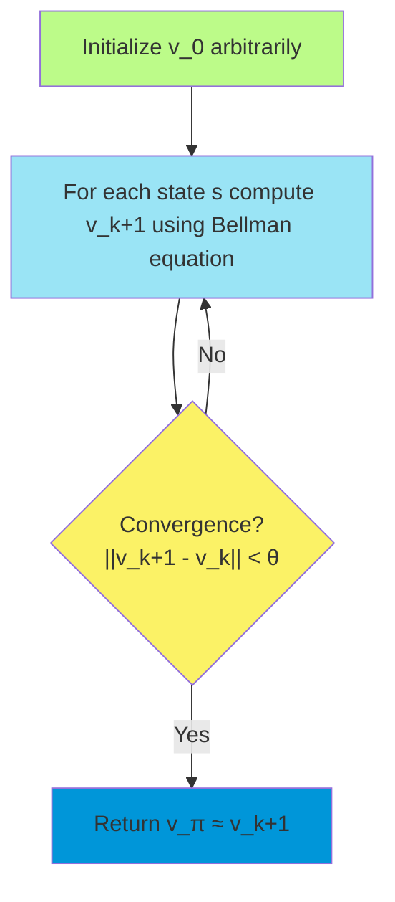
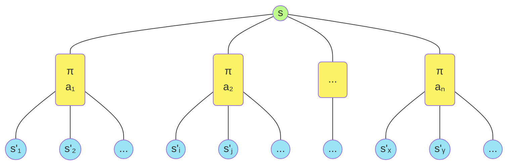
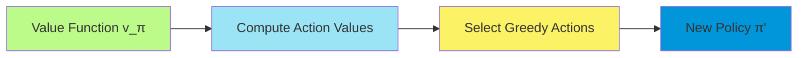
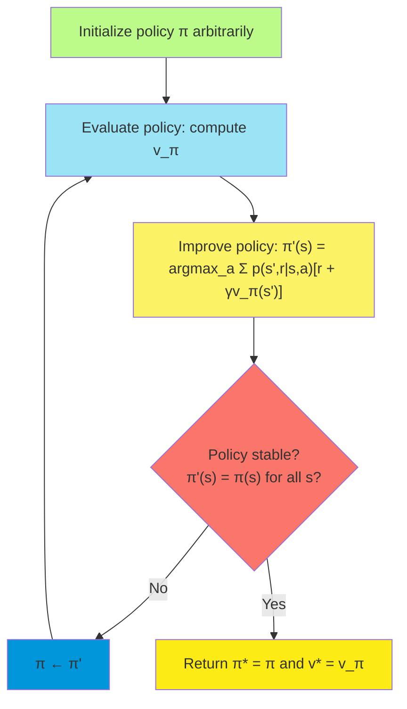
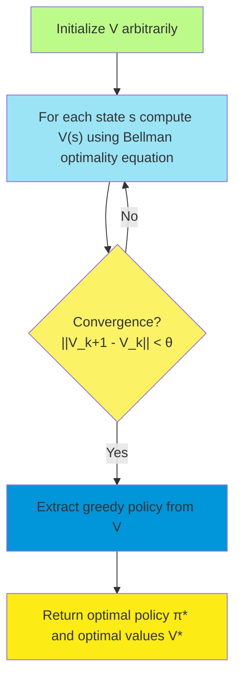
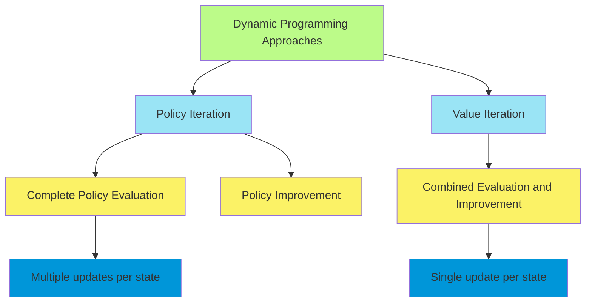
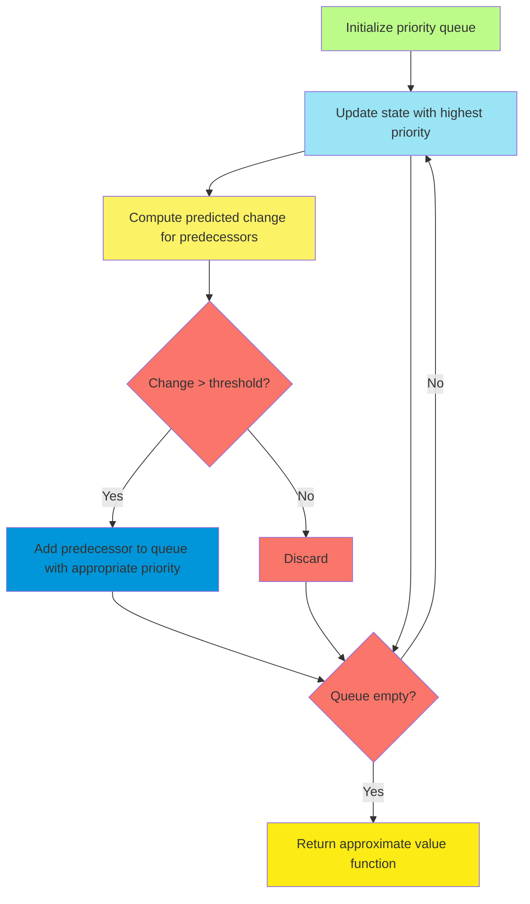
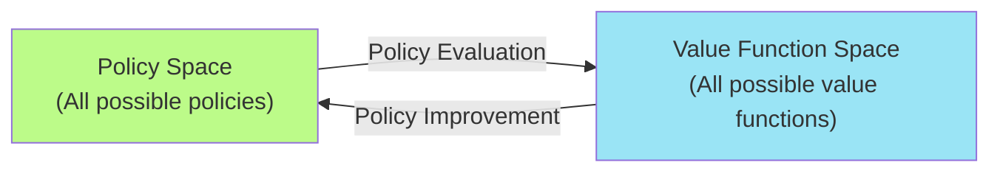
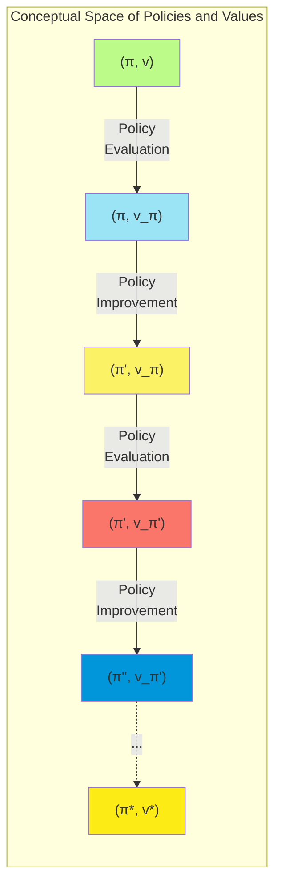

# C-3: Dynamic Programming

1. Policy Evaluation

    - Iterative Policy Evaluation
    - Bellman Expectation Equation
    - Convergence Properties
    - Computational Considerations

2. Policy Improvement

    - Policy Improvement Theorem
    - Greedy Policy Updates
    - Theoretical Guarantees

3. Policy Iteration

    - Combined Evaluation and Improvement
    - Convergence Properties
    - Computational Requirements
    - Practical Examples

4. Value Iteration

    - Optimality Bellman Equation
    - Combined Updates
    - Convergence Properties
    - Comparison with Policy Iteration

5. Asynchronous Dynamic Programming

    - In-place Updates
    - Prioritized Updates
    - Advantages over Synchronous Methods

6. Generalized Policy Iteration

    - Theoretical Framework
    - Interaction Between Evaluation and Improvement
    - Applications in RL Algorithms

7. Efficiency of Dynamic Programming
    - Computational Complexity
    - Curse of Dimensionality
    - Practical Limitations
    - Real-world Applications

#### Policy Evaluation

##### Iterative Policy Evaluation

Dynamic Programming (DP) represents the first major algorithmic approach we study for solving Markov Decision Processes
(MDPs). Policy evaluation, or prediction, is the process of computing the state-value function $v_\pi$ for a given
policy $\pi$. This forms a foundational building block for solving the complete reinforcement learning problem.

The core idea of iterative policy evaluation is to convert the Bellman expectation equation into an iterative update
rule. Given a policy $\pi$, we want to compute the corresponding value function $v_\pi$ that satisfies:

$$v_\pi(s) = \sum_a \pi(a|s) \sum_{s',r} p(s',r|s,a)[r + \gamma v_\pi(s')]$$

The iterative solution approach starts with an arbitrary value function $v_0$ (often initialized to zero for all states)
and progressively refines it through successive approximations $v_1, v_2, ..., v_k, ...$ until convergence. Each new
approximation is generated by applying the Bellman operator to the previous approximation:

$$v_{k+1}(s) = \sum_a \pi(a|s) \sum_{s',r} p(s',r|s,a)[r + \gamma v_k(s')]$$

This update can be applied to all states simultaneously (synchronous updates) or state-by-state in some sequence
(asynchronous updates). The synchronous version with a complete sweep through the state space represents the purest form
of the algorithm.

The update can be visualized using a backup diagram that represents the flow of information from future states back to
the current state:

The procedural form of iterative policy evaluation is:

1. Initialize $V(s)$ arbitrarily for all states $s$
2. Repeat until convergence:
    - For each state $s$:
        - $v \leftarrow V(s)$
        - $V(s) \leftarrow \sum_a \pi(a|s) \sum_{s',r} p(s',r|s,a)[r + \gamma V(s')]$
    - If change in $V$ is sufficiently small, stop

##### Bellman Expectation Equation

The Bellman expectation equation forms the theoretical foundation for policy evaluation. It expresses the value of a
state in terms of expected immediate rewards plus the discounted value of successor states:

$$v_\pi(s) = \mathbb{E}*\pi[R*{t+1} + \gamma v_\pi(S_{t+1}) | S_t = s]$$

This can be expanded to:

$$v_\pi(s) = \sum_a \pi(a|s) \sum_{s',r} p(s',r|s,a)[r + \gamma v_\pi(s')]$$

The Bellman equation captures a fundamental recursive relationship in MDPs: the value of the current state depends on
the values of future states. This recursive structure enables the iterative solution methods of dynamic programming.

From a mathematical perspective, the Bellman equation can be viewed as a system of $|S|$ linear equations in $|S|$
unknowns (the values of each state). While direct solution methods exist for systems of linear equations, iterative
methods are often preferred due to their computational efficiency and ability to handle large state spaces.

##### Convergence Properties

Iterative policy evaluation converges to the true value function $v_\pi$ under fairly general conditions. The key
theoretical results include:

1. **Contraction Mapping**: The Bellman operator is a contraction mapping with respect to the maximum norm, with
   contraction factor $\gamma < 1$ for discounted MDPs.
2. **Unique Fixed Point**: By the Banach fixed-point theorem, the Bellman operator has a unique fixed point, which is
   the true value function $v_\pi$.
3. **Convergence Rate**: The error reduces by at least a factor of $\gamma$ with each iteration:
   $$||v_{k+1} - v_\pi||*\infty \leq \gamma ||v_k - v*\pi||_\infty$$
4. **Error Bound**: After $k$ iterations, the maximum error is bounded by:
   $$||v_k - v_\pi||*\infty \leq \gamma^k ||v_0 - v*\pi||_\infty$$

This means that the algorithm converges exponentially fast, with the convergence rate determined by the discount factor
$\gamma$. Values closer to 1 lead to slower convergence because future rewards have greater influence on current state
values.

For undiscounted episodic tasks (where $\gamma = 1$), convergence is still guaranteed as long as all episodes terminate,
though the mathematical analysis is slightly different and involves showing that the Bellman operator is a contraction
in a weighted maximum norm.

##### Computational Considerations

Several practical considerations affect the implementation and efficiency of iterative policy evaluation:

1. **Memory Requirements**: The basic algorithm requires storing two copies of the value function (current and next
   estimates) for all states, requiring $O(|S|)$ space.
2. **Computational Complexity**: Each iteration requires $O(|S|^2 \times |A|)$ operations in the worst case, as we must
   consider all possible next states for each state-action pair.
3. **In-place Updates**: Rather than maintaining two separate arrays, we can update values "in-place," which often
   accelerates convergence because new values are used as soon as they are computed.
4. **Termination Criteria**: In practice, we terminate the algorithm when the maximum change in value function is below
   a threshold: $\max_s |v_{k+1}(s) - v_k(s)| < \theta$. The choice of $\theta$ affects both solution accuracy and
   computation time.
5. **Initialization**: Although any initialization works in theory, starting with values close to the true values can
   significantly speed up convergence. Common choices include all zeros, optimistic values (higher than true values), or
   values from a previous similar policy.
6. **Sparse Transitions**: In many MDPs, each state-action pair leads to only a small number of next states, allowing
   for more efficient implementations that exploit this sparsity.
7. **Parallelization**: The updates for different states can be parallelized, though care must be taken with
   synchronization in asynchronous variants.

The choice between synchronous and asynchronous updates involves trade-offs between computational efficiency, memory
usage, and ease of implementation. Synchronous updates are conceptually simpler and match the theory more directly,
while asynchronous updates often converge faster in practice.

#### Policy Improvement

##### Policy Improvement Theorem

The policy improvement theorem provides the theoretical foundation for iteratively improving policies based on their
value functions. It states that if we have a policy $\pi$ and its corresponding value function $v_\pi$, we can construct
a new policy $\pi'$ that is guaranteed to be at least as good as $\pi$ by acting greedily with respect to $v_\pi$.

Formally, if for all states $s \in S$:

$$q_\pi(s, \pi'(s)) \geq v_\pi(s)$$

then:

$$v_{\pi'}(s) \geq v_\pi(s) \text{ for all } s \in S$$

Moreover, if there is at least one state where $q_\pi(s, \pi'(s)) > v_\pi(s)$, then there is at least one state where
$v_{\pi'}(s) > v_\pi(s)$.

The proof follows from the definition of the action-value function and the recursive nature of the return:

$$
\begin{align*} v*\pi(s) &\leq q*\pi(s, \pi'(s)) \ &= \mathbb{E}[R_{t+1} + \gamma v_\pi(S_{t+1}) | S_t = s, A_t =
\pi'(s)] \ &\leq \mathbb{E}[R_{t+1} + \gamma q_\pi(S_{t+1}, \pi'(S_{t+1})) | S_t = s, A_t = \pi'(s)] \ &=
\mathbb{E}*{\pi'}[R*{t+1} + \gamma R_{t+2} + \gamma^2 v_\pi(S_{t+2}) | S_t = s] \ &\leq \mathbb{E}_{\pi'}[R_{t+1} +
\gamma R*{t+2} + \gamma^2 q*\pi(S*{t+2}, \pi'(S*{t+2})) | S*t = s] \ &= \mathbb{E}*{\pi'}[R*{t+1} + \gamma R*{t+2} +
\gamma^2 R*{t+3} + \gamma^3 v*\pi(S*{t+3}) | S_t = s] \ &\leq \ldots \ &\leq \mathbb{E}*{\pi'}[R*{t+1} + \gamma
R*{t+2} + \gamma^2 R*{t+3} + \ldots | S_t = s] \ &= v*{\pi'}(s) \end{align\*}
$$

This theorem is fundamental because it guarantees that policy improvement steps will monotonically increase policy
quality until an optimal policy is reached.

##### Greedy Policy Updates

The most common way to improve a policy is to make it greedy with respect to its value function. For a policy $\pi$ with
value function $v_\pi$, the greedy policy $\pi'$ is defined as:

$$\pi'(s) = \arg\max_a \sum_{s',r} p(s',r|s,a)[r + \gamma v_\pi(s')]$$

This policy selects, for each state, the action that maximizes the expected return based on immediate reward plus
discounted future value. The greedification process can be visualized as follows:

The process of selecting a greedy action requires a model of the environment because it involves considering the
consequences of different actions. Specifically, we need to know the transition probabilities $p(s',r|s,a)$ to compute
the expected next-state values.

##### Theoretical Guarantees

The policy improvement theorem provides several important theoretical guarantees:

1. **Monotonic Improvement**: Each greedy policy update is guaranteed to produce a policy that is at least as good as
   the previous one, and strictly better if any improvement is possible.
2. **Finite Convergence**: Since there are only a finite number of deterministic policies in a finite MDP (at most
   $|A|^{|S|}$), and each policy improvement step produces a strictly better policy unless the current policy is already
   optimal, the process must converge to an optimal policy in a finite number of steps.
3. **Optimal Policy Structure**: At least one optimal policy is always deterministic, and it is greedy with respect to
   its own value function.
4. **Value Function Bounds**: During the improvement process, the value functions provide lower bounds on the optimal
   value function: $v_\pi(s) \leq v_*(s)$ for all policies $\pi$ and states $s$.
5. **Existence of Stable Points**: The only policies that cannot be improved by greedification are those that are
   already greedy with respect to their own value functions, which are precisely the optimal policies.

These guarantees make policy improvement a robust and theoretically sound component of dynamic programming algorithms
for MDPs. However, it's worth noting that greedification alone does not directly provide an algorithmic solution to
MDPs—it must be combined with policy evaluation to create a complete solution approach.

#### Policy Iteration

##### Combined Evaluation and Improvement

Policy iteration combines policy evaluation and policy improvement into a complete algorithm for finding optimal
policies in MDPs. The process alternates between two phases:

1. **Policy Evaluation**: Compute the value function $v_\pi$ for the current policy $\pi$
2. **Policy Improvement**: Generate a new, improved policy $\pi'$ by acting greedily with respect to $v_\pi$

This process continues until the policy stabilizes, meaning that the greedy policy with respect to the value function is
identical to the current policy. At this point, the Bellman optimality equation must be satisfied, indicating that an
optimal policy has been found.

The overall algorithm can be expressed as:

Each complete cycle of evaluation and improvement is called an iteration of policy iteration. The algorithm iteratively
refines the policy until it converges to the optimal policy.

The full pseudocode for policy iteration is:

1. Initialize $\pi$ arbitrarily

2. Loop:

    - Policy Evaluation

        :

        - Repeat until convergence:
            - For each $s \in S$:
                - $v \leftarrow V(s)$
                - $V(s) \leftarrow \sum_{s',r} p(s',r|s,\pi(s))[r + \gamma V(s')]$

    - Policy Improvement

        :

        - policy-stable $\leftarrow$ true
        - For each $s \in S$:
            - old-action $\leftarrow \pi(s)$
            - $\pi(s) \leftarrow \arg\max_a \sum_{s',r} p(s',r|s,a)[r + \gamma V(s')]$
            - If old-action $\neq \pi(s)$, then policy-stable $\leftarrow$ false

    - If policy-stable, return $V$ and $\pi$; else continue

##### Convergence Properties

Policy iteration has strong convergence guarantees:

1. **Finite Termination**: Since there are only a finite number of deterministic policies in a finite MDP, and policy
   iteration produces a strictly better policy with each iteration (unless the policy is already optimal), the algorithm
   must terminate in a finite number of steps.
2. **Optimality**: Upon termination, policy iteration produces an optimal policy $\pi^*$ and its corresponding optimal
   value function $v^*$.
3. **Rate of Convergence**: Policy iteration typically converges in surprisingly few iterations, often much fewer than
   the total number of possible policies. This is because:
    - Each policy improvement step can potentially make large changes to the policy
    - The value functions provide increasingly tight lower bounds on the optimal value function
    - Policy evaluation can leverage previous value function approximations for warm starts
4. **Policy Stability Criterion**: The condition for termination—that the policy is stable (unchanged by improvement)—is
   equivalent to the policy satisfying the Bellman optimality equation, which guarantees its optimality.

While the worst-case number of iterations is exponential in the number of states, in practice, policy iteration often
converges in a small number of iterations, making it a practical algorithm for moderately sized MDPs.

##### Computational Requirements

The computational demands of policy iteration stem from both its policy evaluation and policy improvement phases:

1. **Policy Evaluation Complexity**:
    - Each iteration of policy evaluation requires $O(|S|^2)$ operations
    - Policy evaluation typically requires multiple iterations to converge, though the exact number depends on the
      discount factor and the policy
    - Later policy evaluations can often converge more quickly by using the previous value function as a starting point
2. **Policy Improvement Complexity**:
    - Each policy improvement step requires $O(|S|^2|A|)$ operations to consider all actions at all states
    - The improvement step itself is relatively simple compared to policy evaluation
3. **Overall Time Complexity**:
    - If policy evaluation is performed exactly (to convergence), the time complexity per policy iteration is dominated
      by the policy evaluation phase
    - If approximations are used (e.g., stopping policy evaluation after a fixed number of iterations), the
      per-iteration complexity can be reduced
    - The total complexity depends on the number of policy iterations, which is typically much smaller than the
      worst-case bound of $|A|^{|S|}$
4. **Memory Requirements**:
    - Policy iteration requires storing the current policy $\pi$ (size $|S|$) and the value function $V$ (size $|S|$)
    - If in-place updates are used during policy evaluation, only one copy of the value function needs to be maintained
5. **Practical Considerations**:
    - In large state spaces, the memory and computation requirements can become prohibitive
    - Various approximation techniques (e.g., early stopping of policy evaluation) can be used to reduce computational
      demands
    - Efficient data structures can exploit sparsity in the transition dynamics to reduce practical complexity

While policy iteration has theoretical guarantees of optimality, its computational requirements limit its direct
application to moderately sized MDPs. For larger problems, approximation techniques or alternative algorithms like value
iteration may be preferred.

##### Practical Examples

To illustrate policy iteration, let's consider a simple grid world example:

1. **Grid World Description**:
    - 4x4 grid with states numbered 0 to 15
    - Four possible actions: up, down, left, right
    - Actions that would take the agent off the grid leave the state unchanged
    - Reward of -1 for each step until reaching the goal state (state 15)
    - Discount factor $\gamma = 0.9$
2. **Initial Policy**: Random policy (equal probability for each action in each state)
3. **First Iteration**:
    - **Policy Evaluation**: Compute value function for random policy (typical values might range from -20 to -1)
    - **Policy Improvement**: Create new policy by selecting actions that maximize expected return
    - Result: Policy now takes more direct routes toward the goal
4. **Second Iteration**:
    - **Policy Evaluation**: Value function shows improved values
    - **Policy Improvement**: Further refinement of policy
    - Result: Policy now takes even more direct routes toward the goal
5. **Third Iteration and Beyond**:
    - Each iteration further refines the policy
    - Values gradually approach optimal values
    - After a small number of iterations (typically 3-5 for this example), the policy stabilizes
6. **Final Result**:
    - Optimal policy that chooses actions leading most directly to the goal
    - Optimal value function representing minimum expected steps to the goal from each state

Another classic example is the car rental problem:

1. **Problem Description**:
    - Two car rental locations
    - Cars are requested and returned at each location according to Poisson distributions
    - Cars can be moved between locations overnight (at a cost)
    - Reward of +10 for each car rented, cost of -2 for each car moved
2. **Policy Iteration Solution**:
    - Initial policy: Never move cars
    - Policy gradually evolves to balance cars between locations
    - Final policy depends on the specific request and return rates at each location
    - Typical optimal policy might move cars from location with less demand to location with more demand

These examples illustrate how policy iteration can find optimal solutions to MDPs through systematic improvement of the
policy based on accurate value function estimation.

#### Value Iteration

##### Optimality Bellman Equation

Value iteration is based directly on the Bellman optimality equation, which characterizes the optimal value function:

$$v_*(s) = \max_a \sum_{s',r} p(s',r|s,a)[r + \gamma v_*(s')]$$

This equation states that the optimal value of a state is equal to the maximum expected return achievable from that
state by taking any action and following the optimal policy thereafter. Unlike the Bellman expectation equation used in
policy evaluation, this equation includes a maximization over actions, making it nonlinear.

The Bellman optimality equation can be viewed as combining policy evaluation and policy improvement into a single
update. Instead of first computing the value function for a fixed policy and then improving the policy, value iteration
directly computes the optimal value function by assuming that the optimal action is always chosen.

The operator form of the Bellman optimality equation defines the Bellman optimality operator $T^*$:

$$T^*v(s) = \max_a \sum_{s',r} p(s',r|s,a)[r + \gamma v(s')]$$

This operator, when applied repeatedly to any initial value function, will eventually converge to the optimal value
function $v_*$.

##### Combined Updates

Value iteration performs a sequence of updates based on the Bellman optimality equation:

$$v_{k+1}(s) = \max_a \sum_{s',r} p(s',r|s,a)[r + \gamma v_k(s')]$$

Starting with an arbitrary value function $v_0$, each iteration applies this update to all states, effectively combining
aspects of policy evaluation and policy improvement:

The formal value iteration algorithm is:

1. Initialize $V(s)$ arbitrarily for all states $s$
2. Repeat until convergence:
    - For each state $s$:
        - $V(s) \leftarrow \max_a \sum_{s',r} p(s',r|s,a)[r + \gamma V(s')]$
    - If change in $V$ is sufficiently small, stop
3. Output a deterministic policy $\pi^*(s) = \arg\max_a \sum_{s',r} p(s',r|s,a)[r + \gamma V(s')]$

Value iteration can be seen as a special case of policy iteration where policy evaluation is stopped after just one
sweep (one update per state). Alternatively, it can be viewed as applying the Bellman optimality operator repeatedly
until convergence.

##### Convergence Properties

Value iteration has strong convergence guarantees:

1. **Contraction Mapping**: The Bellman optimality operator $T^*$ is a contraction mapping with contraction factor
   $\gamma < 1$ for discounted MDPs.
2. **Unique Fixed Point**: The optimal value function $v_*$ is the unique fixed point of the Bellman optimality
   operator.
3. **Convergence Rate**: The error reduces by at least a factor of $\gamma$ with each iteration:
   $$||v_{k+1} - v_*||\*\infty \leq \gamma ||v_k - v**||_\infty$$
4. **Error Bound**: After $k$ iterations, the maximum error is bounded by:
   $$||v_k - v_*||\*\infty \leq \gamma^k ||v_0 - v**||_\infty$$
5. **Policy Convergence**: The greedy policy with respect to $v_k$ converges to an optimal policy in a finite number of
   iterations, even before the value function converges completely.

Value iteration generally requires more iterations to converge than policy iteration, but each iteration is
computationally simpler because it does not involve a complete policy evaluation phase.

An important practical insight is that an optimal policy can often be extracted well before the value function has fully
converged. Once the relative ordering of action values within each state stabilizes, the greedy policy will no longer
change, even if the exact values continue to refine.

##### Comparison with Policy Iteration

Value iteration and policy iteration represent different approaches to solving MDPs, each with its own advantages and
disadvantages:

1. **Computational Complexity**:
    - **Policy Iteration**: Each iteration requires solving a system of linear equations (policy evaluation), which is
      computationally intensive, but typically requires fewer iterations overall.
    - **Value Iteration**: Each iteration is simpler (requiring only one update per state), but more iterations are
      typically needed for convergence.
2. **Memory Requirements**:
    - Both algorithms have similar memory requirements, needing to store a value function over the state space.
    - Policy iteration additionally needs to explicitly store a policy.
3. **Convergence Behavior**:
    - **Policy Iteration**: Often converges in fewer iterations, especially for problems with high discount factors.
    - **Value Iteration**: May require more iterations but each iteration is computationally less expensive.
4. **Early Termination**:
    - **Policy Iteration**: Can only terminate when the policy stabilizes, which might happen only after near-exact
      convergence of the value function.
    - **Value Iteration**: Can terminate early based on changes in the value function, and can often extract a good or
      optimal policy before complete convergence.
5. **Implementation Complexity**:
    - **Policy Iteration**: More complex, requiring a nested iterative process for policy evaluation.
    - **Value Iteration**: Simpler implementation with a single iterative process.
6. **Practical Performance**:
    - **Policy Iteration**: Often works better in problems with high discount factors ($\gamma$ close to 1) where value
      iteration converges slowly.
    - **Value Iteration**: Often preferred for problems with lower discount factors or when approximate solutions are
      acceptable.
7. **Hybrid Approaches**:
    - Modified policy iteration combines aspects of both algorithms by performing a fixed number of policy evaluation
      updates in each iteration, balancing computation per iteration against number of iterations.

There is no universally superior algorithm between the two—the choice depends on the specific characteristics of the MDP
being solved and the computational resources available.

#### Asynchronous Dynamic Programming

##### In-place Updates

Asynchronous dynamic programming (DP) refers to a class of algorithms that update states' values individually, in any
order, and use new value information as soon as it becomes available. Unlike the synchronous updates of standard policy
and value iteration, which update all states simultaneously based on the previous iteration's values, asynchronous
methods update states "in-place."

Key characteristics of in-place updates include:

1. **Immediate Use of New Information**: When a state's value is updated, that new value is immediately available for
   use in subsequent updates of other states.
2. **Gauss-Seidel Style**: In-place updates resemble the Gauss-Seidel method for solving systems of linear equations, in
   contrast to the Jacobi-style updates of synchronous methods.
3. **Implementation Advantages**: In-place updates typically require less memory (only one copy of the value function)
   and often converge faster due to the more immediate propagation of information.
4. **Theoretical Guarantees**: Despite their apparent departure from the synchronous algorithms for which convergence
   proofs are typically given, in-place asynchronous methods maintain the same convergence guarantees.

The update equations remain the same as in synchronous methods, but the implementation differs. For example, in
asynchronous value iteration:

$$V(s) \leftarrow \max_a \sum_{s',r} p(s',r|s,a)[r + \gamma V(s')]$$

Each state update immediately affects the stored value function, influencing subsequent updates within the same sweep.

##### Prioritized Updates

Asynchronous DP methods allow for prioritizing updates to focus computational resources on states where updates are
likely to have the most significant impact. Prioritized sweeping is a particularly effective approach for this.

The key insight is that some states' values change more significantly than others, and these changes propagate to
predecessor states—states that can reach the changed state in one step. By prioritizing updates to these predecessor
states, we can efficiently propagate value changes through the state space.

The general approach of prioritized sweeping is:

1. Maintain a priority queue of states to update, ordered by expected magnitude of update.
2. Update the state with the highest priority, removing it from the queue.
3. For each predecessor of the updated state, compute the potential change in its value.
4. If the potential change exceeds a threshold, add the predecessor to the priority queue with priority proportional to
   the expected change.

This process focuses computation on the states where values are changing the most, which often represent the most
relevant parts of the state space.

Prioritized sweeping can dramatically reduce computation time, especially in MDPs with sparse transition structures
where changes in value propagate along specific pathways.

##### Advantages over Synchronous Methods

Asynchronous DP methods offer several advantages over their synchronous counterparts:

1. **Computational Efficiency**:
    - By focusing updates on the most relevant states, asynchronous methods can achieve similar accuracy with
      significantly fewer updates.
    - In-place updates often accelerate convergence by making new information immediately available.
2. **Memory Efficiency**:
    - Only one copy of the value function needs to be maintained, reducing memory requirements.
    - Priority queues or other data structures for managing update order typically require less memory than a complete
      second copy of the value function.
3. **Flexibility in Update Order**:
    - States can be updated in any order, allowing for strategic selection to maximize convergence rate or prioritize
      relevant parts of the state space.
    - This flexibility is particularly valuable in large or infinite state spaces where complete sweeps are impractical.
4. **Integration with Experience**:

    - Asynchronous methods can naturally incorporate new information from actual or simulated experience, updating
      states as they are encountered.
    - This creates a natural bridge between planning (model-based) and learning (model-free)

5. **Real-time Applications**:

    - Asynchronous methods allow for interleaving planning with acting in real-time settings, where computational
      resources are limited.

    - An agent can perform a few high-priority updates between actions rather than waiting for complete sweeps.

6. **Anytime Property**:

    - Asynchronous methods can be interrupted at any time while still providing a meaningful, if approximate, solution.

    - This is particularly valuable in time-critical applications where a good solution now is better than a perfect
      solution later.

7. **Better Exploration of Large State Spaces**:

    - When combined with prioritization, asynchronous methods effectively focus computation on the most relevant regions
      of large state spaces.

    - This property makes them particularly well-suited for problems with localized state dependencies.

The combination of these advantages makes asynchronous DP methods particularly attractive for complex real-world
applications where computational efficiency and adaptability are crucial.

#### Generalized Policy Iteration

##### Theoretical Framework

Generalized Policy Iteration (GPI) is a fundamental conceptual framework that encompasses virtually all reinforcement
learning methods. It abstracts the key ideas behind policy iteration into two interacting processes:

1. **Policy Evaluation**: Moving the value function toward the value function for the current policy.
2. **Policy Improvement**: Moving the policy toward greediness with respect to the current value function.

These two processes continuously interact, with each driving the other. The value function is repeatedly updated to
better reflect the current policy, while the policy is repeatedly improved to exploit the current value function.

The power of GPI lies in its generality. Unlike the specific algorithms of policy iteration or value iteration, GPI is a
conceptual framework that allows for various instantiations:

- The evaluation process might be complete (computing $v_\pi$ exactly) or partial (moving only partway toward $v_\pi$).
- The improvement process might make the policy fully greedy or only move it partially toward greediness.
- The processes might operate in strict alternation or be interleaved at finer granularity.

Mathematically, we can view GPI as two operators: an evaluation operator $E$ that moves the value function toward
$v_\pi$, and an improvement operator $I$ that makes the policy more greedy with respect to the current value. The GPI
process can then be represented as:

$$\pi_0 \xrightarrow{E} v_{\pi_0} \xrightarrow{I} \pi_1 \xrightarrow{E} v_{\pi_1} \xrightarrow{I} \pi_2 \xrightarrow{E} \ldots \xrightarrow{I} \pi_* \xrightarrow{E} v_*$$

This framework provides a unifying perspective for understanding both model-based methods like dynamic programming and
model-free methods like temporal-difference learning.

##### Interaction Between Evaluation and Improvement

The interaction between policy evaluation and policy improvement in GPI creates a powerful dynamic that drives the
system toward optimality. This interaction can be visualized as two intertwined processes operating in different spaces:

Several key insights emerge from studying this interaction:

1. **Simultaneous Convergence**: As the process continues, both the policy and value function converge toward their
   optimal counterparts. The policy becomes increasingly optimal, and the value function increasingly accurate.

2. **Competition and Cooperation**: The two processes can be seen as both competing and cooperating:

    - They compete in the sense that each process changes what the other is trying to converge to.
    - They cooperate in the sense that both work together toward the common goal of optimality.

3. **Efficiency of Partial Updates**: Remarkably, both processes can make progress even with incomplete or approximate
   steps:

    - Policy evaluation doesn't need to converge completely before policy improvement can be useful.
    - Similarly, the policy doesn't need to be fully greedy before further evaluation is beneficial.

4. **Convergence to Stable Point**: The only stable point of this system is when:

    - The value function is the true value function for the current policy.
    - The policy is greedy with respect to its value function.

    These conditions are satisfied simultaneously only at the optimal policy and value function.

5. **Geometric Interpretation**: We can visualize the interaction as two constraint lines in a two-dimensional space,
   where one dimension represents policies and the other represents value functions. The policy evaluation process moves
   vertically toward the value function line, while policy improvement moves horizontally toward the greedy policy line.
   The only intersection of these constraints is at the optimal point.

This dynamic interaction is what makes reinforcement learning methods so powerful. Even with approximations and limited
information, the GPI framework ensures progress toward optimal solutions.

##### Applications in RL Algorithms

The generalized policy iteration framework underlies virtually all reinforcement learning methods, though they may
instantiate it in different ways:

1. **Dynamic Programming Methods**:
    - **Policy Iteration**: Implements GPI with complete policy evaluation and complete policy improvement.
    - **Value Iteration**: Implements GPI with one-step policy evaluation (truncated) and complete policy improvement.
    - **Modified Policy Iteration**: Implements GPI with n-step policy evaluation and complete policy improvement.
    - **Asynchronous DP**: Implements GPI with selective state updates for both evaluation and improvement.
2. **Temporal-Difference Methods**:
    - **SARSA**: Implements GPI with sample-based TD updates for evaluation and ε-greedy policy improvement.
    - **Q-learning**: Implements GPI with sample-based off-policy evaluation and greedy policy improvement.
    - **Expected SARSA**: Implements GPI with expected value updates for evaluation and ε-greedy policy improvement.
3. **Monte Carlo Methods**:
    - **Monte Carlo Control**: Implements GPI with complete episode returns for evaluation and ε-greedy policy
      improvement.
    - **Off-policy Monte Carlo**: Implements GPI with importance sampling for evaluation and greedy policy improvement.
4. **Actor-Critic Methods**:
    - Explicitly represent both the policy (actor) and value function (critic), with the critic evaluating the actor's
      policy and the actor improving based on the critic's evaluation.
5. **Function Approximation Methods**:
    - Extend GPI to continuous or large state spaces by using approximate representations of policies and value
      functions.
    - Examples include Deep Q-Networks (DQN), Proximal Policy Optimization (PPO), and Trust Region Policy Optimization
      (TRPO).

Each algorithm makes different choices regarding:

- **Granularity of Interaction**: How frequently evaluation and improvement alternate
- **Completeness of Evaluation**: How accurately the value function approximates $v_\pi$
- **Extent of Improvement**: How closely the policy approaches

- **Extent of Improvement**: How closely the policy approaches greediness
- **Policy Representation**: Whether the policy is stored explicitly or implicitly via the value function
- **Update Targets**: Whether updates target state values, action values, or both
- **Source of Experience**: Whether updates use model-generated or real experience

The flexibility of the GPI framework explains why reinforcement learning can encompass such a diverse range of
algorithms while maintaining theoretical coherence.

#### Efficiency of Dynamic Programming

##### Computational Complexity

Dynamic programming methods provide guaranteed solutions to MDPs, but their computational requirements must be carefully
considered:

1. **Time Complexity**:
    - **Policy Iteration**: The time complexity is dominated by the policy evaluation phase, which requires solving a
      system of $|S|$ linear equations. Using iterative methods, each policy evaluation phase requires $O(|S|^2)$
      operations per iteration, with the number of iterations depending on the convergence criterion. The policy
      improvement phase requires $O(|S|^2|A|)$ operations. Overall, if policy evaluation takes $k$ iterations to
      converge and policy iteration requires $m$ iterations, the total complexity is $O(mk|S|^2 + m|S|^2|A|)$.
    - **Value Iteration**: Each iteration requires $O(|S|^2|A|)$ operations, and the number of iterations until
      convergence is approximately $\log(1/\epsilon)/(1-\gamma)$, where $\epsilon$ is the desired precision. This gives
      a total complexity of $O(|S|^2|A|\log(1/\epsilon)/(1-\gamma))$.
    - **Asynchronous Methods**: The computational complexity depends on the specific update ordering strategy, but can
      be significantly less than synchronous methods when updates are prioritized effectively.
2. **Space Complexity**:
    - All DP methods require storing the value function, which takes $O(|S|)$ space.
    - Policy iteration additionally requires storing the policy, taking another $O(|S|)$ space.
    - Prioritized sweeping and other asynchronous methods may require additional data structures, such as priority
      queues, adding to the space complexity.
3. **Convergence Rate**:
    - The rate of convergence is primarily determined by the discount factor $\gamma$. As $\gamma$ approaches 1, the
      number of iterations required for convergence increases substantially.
    - For a desired accuracy $\epsilon$, value iteration requires approximately $\log(1/\epsilon)/(1-\gamma)$
      iterations.
    - Policy iteration typically converges in fewer iterations than value iteration, but each iteration is more
      computationally intensive.

These polynomial time and space complexities make DP methods significantly more efficient than naive approaches that
would enumerate all possible policies (which would be exponential in the state space size). Nevertheless, the quadratic
dependence on the state space size limits the direct application of DP to problems with moderately sized state spaces.

##### Curse of Dimensionality

The most significant limitation of dynamic programming approaches is the "curse of dimensionality" - a term coined by
Richard Bellman, the originator of dynamic programming. This refers to the exponential growth in the size of the state
space as the number of state variables increases:

1. **Exponential State Space Growth**:
    - If a state is described by $n$ variables, each with $k$ possible values, then the state space size is $k^n$.
    - For example, a problem with 10 binary state variables has $2^{10} = 1,024$ states, while one with 20 such
      variables has over a million states.
    - Real-world problems often have dozens or hundreds of state variables, making the state space astronomically large.
2. **Ramifications for DP**:
    - Since DP methods typically require storage and computation proportional to the size of the state space, they
      become impractical for high-dimensional problems.
    - Even with modern computing power, problems with more than a handful of continuous variables or more than a dozen
      discrete variables quickly become intractable for exact DP approaches.
3. **Manifestations of the Curse**:
    - **Memory Requirements**: The value function representation requires memory proportional to the state space size.
    - **Computational Time**: The time to perform sweeps through the state space grows exponentially with the
      dimensionality.
    - **Data Sparsity**: In high-dimensional spaces, available data becomes sparse, making it difficult to estimate
      transition probabilities accurately.
4. **Addressing the Curse**:
    - **Function Approximation**: Representing value functions with parametric approximators instead of tabular
      representations.
    - **State Abstraction**: Grouping similar states together to reduce the effective state space size.
    - **Hierarchical Methods**: Decomposing problems into smaller subproblems with more manageable state spaces.
    - **Sampling-Based Approaches**: Using Monte Carlo methods to sample relevant parts of the state space.
    - **Factored Representations**: Exploiting structure in the state space to represent and compute with it more
      efficiently.

Despite these mitigation strategies, the curse of dimensionality remains a fundamental challenge in applying DP to
complex real-world problems, and is a primary motivation for the development of alternative reinforcement learning
approaches.

##### Practical Limitations

Beyond computational complexity and the curse of dimensionality, dynamic programming methods face several practical
limitations that restrict their applicability:

1. **Model Requirement**:
    - DP methods require a complete and accurate model of the environment, specifically the transition probabilities
      $p(s',r|s,a)$.
    - In many real-world applications, such models are not available or are prohibitively expensive to obtain.
    - Even when models can be learned, inaccuracies can lead to suboptimal policies ("model bias").
2. **Stationarity Assumption**:
    - DP methods assume that the MDP is stationary – that the transition probabilities and rewards do not change over
      time.
    - Many real-world systems are non-stationary, with dynamics that evolve over time due to external factors or wear
      and tear.
3. **Full Observability Requirement**:
    - Standard DP assumes full observability of the state, which is often not realistic in applications with sensor
      limitations or partial information.
    - Partial observability requires extending to partially observable MDPs (POMDPs), which are significantly more
      complex to solve.
4. **Discrete State and Action Spaces**:
    - Classical DP methods are formulated for discrete state and action spaces.
    - Many practical problems involve continuous spaces, requiring discretization (which can introduce approximation
      errors) or extensions of DP to continuous spaces.
5. **Lack of Exploration Mechanisms**:
    - DP assumes access to the complete model and thus doesn't intrinsically address the exploration-exploitation
      dilemma present in online learning scenarios.
    - This limits its direct application to settings where learning must occur through interaction.
6. **Implementation Challenges**:
    - Efficient implementation of DP requires careful consideration of data structures and algorithm design.
    - Numerical issues can arise in value iteration due to the compounding of small errors across many iterations.
    - In asynchronous methods, determining an effective update ordering can be non-trivial.
7. **Scalability Issues**:
    - Even with polynomial time complexity, the practical scalability of DP is limited by available computational
      resources.
    - Real-time applications may not afford the luxury of waiting for DP algorithms to converge.

Despite these limitations, understanding DP methods is crucial for reinforcement learning practitioners, as they provide
the theoretical foundation for many more scalable approaches and offer insights into the structure of optimal solutions.

##### Real-world Applications

Despite their limitations, dynamic programming methods have found successful application in various domains where the
problems are sufficiently structured and well-modeled:

1. **Resource Allocation and Management**:
    - **Inventory Management**: Determining optimal inventory levels to minimize costs while meeting demand.
    - **Energy Systems**: Optimizing energy generation, storage, and distribution in power grids.
    - **Water Resource Management**: Managing reservoir operations to balance flood control, hydropower generation, and
      water supply.
    - **Network Flow Optimization**: Routing traffic, data, or commodities through networks to minimize congestion or
      costs.
2. **Operations Research Problems**:
    - **Production Planning**: Scheduling manufacturing operations to maximize efficiency.
    - **Supply Chain Optimization**: Coordinating procurement, production, and distribution decisions.
    - **Logistics**: Vehicle routing, warehouse operations, and distribution planning.
    - **Project Scheduling**: Allocating resources to project tasks under constraints.
3. **Finance and Economics**:
    - **Portfolio Optimization**: Determining optimal asset allocations to balance risk and return.
    - **Option Pricing**: Computing fair prices for financial derivatives.
    - **Economic Policy Analysis**: Modeling the effects of taxation, regulation, and monetary policy.
    - **Retirement Planning**: Optimizing savings and withdrawal strategies.
4. **Games and Entertainment**:
    - **Board Games**: Computing optimal strategies for games like backgammon, checkers, and simplified poker variants.
    - **Video Game AI**: Controlling non-player characters to provide engaging challenges.
    - **Sports Analytics**: Developing game strategies and player substitution policies.
5. **Robotics and Control Systems**:
    - **Simplified Robot Navigation**: Planning paths in discretized environments.
    - **Manufacturing Automation**: Controlling robotic systems in structured industrial settings.
    - **Elevator Control**: Optimizing elevator dispatching to minimize wait times.
    - **Climate Control**: Managing HVAC systems in buildings.
6. **Healthcare**:
    - **Treatment Planning**: Optimizing sequences of medical interventions.
    - **Resource Allocation**: Managing hospital beds, operating rooms, and staff.
    - **Epidemic Control**: Determining vaccination and quarantine strategies.
    - **Medical Imaging**: Planning radiation therapy to maximize tumor treatment while minimizing damage to healthy
      tissue.
7. **Communication Systems**:
    - **Network Routing**: Directing packets through communication networks.
    - **Channel Allocation**: Assigning frequency bands in wireless communications.
    - **Data Compression**: Developing optimal encoding strategies.

For these applications, dynamic programming has been particularly successful when:

- The state and action spaces are naturally discrete or can be effectively discretized.
- The system dynamics are well-understood and can be accurately modeled.
- The problem size is moderate, with state spaces not exceeding a few million states.
- Offline computation is acceptable, with solutions being computed ahead of time and then implemented.

In many cases, approximate dynamic programming methods or hybrid approaches combining DP with other techniques are used
to address larger, more complex versions of these problems.

### Summary

Dynamic Programming represents the first algorithmic framework we've explored for solving Markov Decision Processes.
Through systematic value-based approaches, DP methods provide mathematically sound techniques for finding optimal
policies.

The core algorithms—policy iteration and value iteration—offer complementary approaches to solving MDPs through
iterative refinement of value functions and policies. Policy iteration alternates between complete policy evaluation and
policy improvement phases, while value iteration combines these operations into a single update that directly
approximates the optimal value function.

Asynchronous dynamic programming methods extend these approaches by allowing flexible update orderings, which can
significantly improve computational efficiency by focusing on relevant parts of the state space. Prioritized sweeping
exemplifies this approach by directing computational resources to states with the most significant value changes.

The Generalized Policy Iteration framework provides a unifying perspective on these methods by viewing them as
interacting processes of evaluation and improvement, driving both the value function and policy toward optimality. This
conceptual framework extends beyond dynamic programming to encompass virtually all reinforcement learning methods.

Despite their theoretical elegance and guaranteed convergence, dynamic programming methods face significant practical
limitations, particularly the curse of dimensionality and the requirement for a complete environment model. These
limitations motivate the development of more scalable model-free approaches like temporal-difference learning and more
efficient sampling-based planning methods.

Nevertheless, dynamic programming remains foundational to reinforcement learning, providing the theoretical
underpinnings for more advanced methods and serving as a benchmark for algorithm development. Understanding DP is
crucial for appreciating the goals, challenges, and solutions in the broader field of reinforcement learning.
