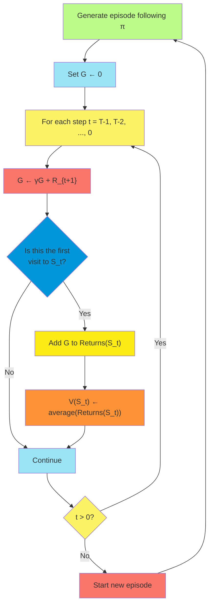
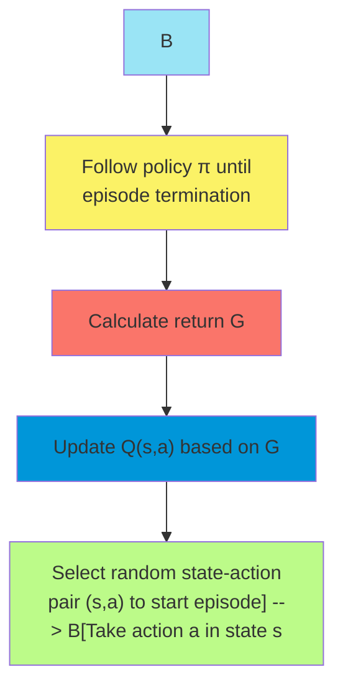
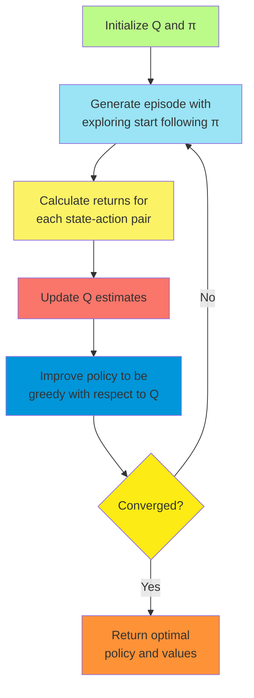
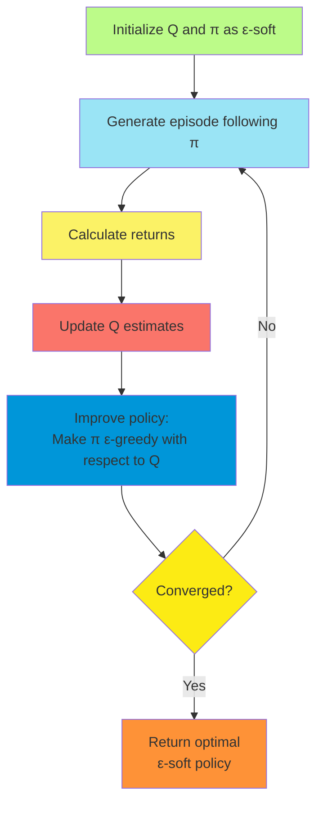
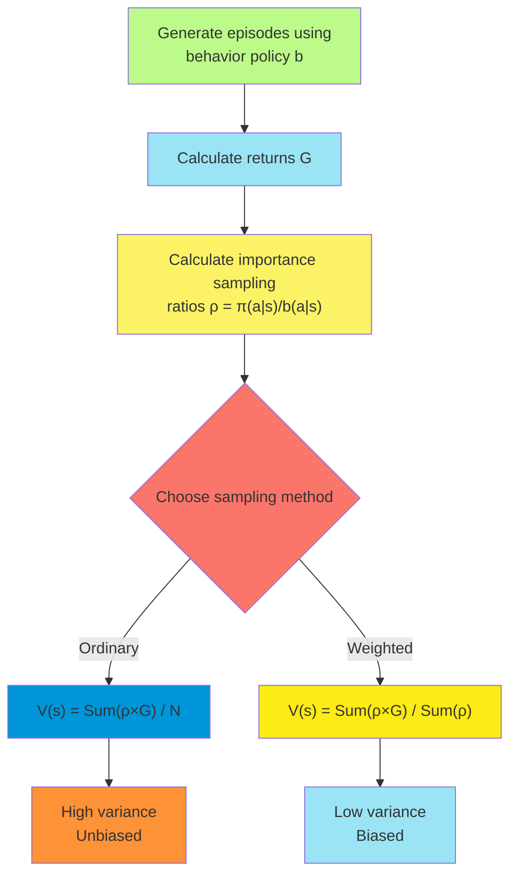
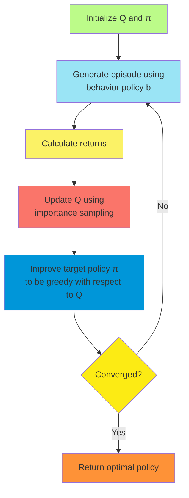

# C-4: Monte Carlo Methods

1. Monte Carlo Prediction

    - First-visit MC
    - Every-visit MC
    - Incremental Implementation
    - Convergence Properties

2. Monte Carlo Estimation of Action Values

    - State-Action Pair Visits
    - Exploring Starts Method
    - Limitations and Practical Considerations

3. Monte Carlo Control

    - Monte Carlo with Exploring Starts
    - On-policy Monte Carlo Control
    - ε-greedy Policies
    - Convergence Properties

4. Monte Carlo Control without Exploring Starts

    - ε-soft Policies
    - Policy Improvement Theorem for ε-soft Policies
    - Convergence Guarantees

5. Off-policy Prediction via Importance Sampling

    - Target and Behavior Policies
    - Importance Sampling Ratio
    - Ordinary and Weighted Importance Sampling
    - Variance Properties

6. Incremental Implementation

    - Efficient Computation
    - Weighted Importance Sampling
    - Practical Implementations

7. Off-policy Monte Carlo Control
    - Generating Behavior
    - Importance Sampling for Control
    - Convergence Considerations

#### Monte Carlo Prediction

##### First-visit MC

Monte Carlo (MC) methods represent a fundamentally different approach to solving reinforcement learning problems
compared to Dynamic Programming. Rather than requiring a complete model of the environment, Monte Carlo methods learn
directly from experience through sampling complete episodes and using the observed returns to estimate value functions.

The first-visit Monte Carlo method is a straightforward approach for estimating the state-value function $v_\pi$ for a
given policy $\pi$. The core idea is elegantly simple: to evaluate a state, we average the returns observed after visits
to that state. Specifically, for each state $s$, we maintain a running average of the returns that have followed the
first visit to $s$ in each episode.

The algorithm works as follows:

1. Initialize an arbitrary value function $V(s)$ for all states $s$
2. Initialize empty lists Returns$(s)$ for storing returns for each state
3. For each episode:
    - Generate an episode following policy $\pi$: $S_0, A_0, R_1, S_1, A_1, R_2, ..., S_{T-1}, A_{T-1}, R_T$
    - Set $G \leftarrow 0$ (initialize return)
    - For each step of episode, working backward: $t = T-1, T-2, ..., 0$:
        - $G \leftarrow \gamma G + R_{t+1}$ (calculate return from $t$)
        - If $S_t$ is not appearing in $S_0, S_1, ..., S_{t-1}$ (first visit):
            - Append $G$ to Returns$(S_t)$
            - $V(S_t) \leftarrow$ average(Returns$(S_t)$)

The "first-visit" aspect is crucial: for each episode, we only consider the first time a state is visited when updating
its value estimate. This ensures that the returns used in our average are independent samples, which simplifies the
theoretical analysis of convergence.

The first-visit MC method exemplifies several key characteristics of Monte Carlo approaches:

1. It requires complete episodes, meaning it can only be applied to episodic tasks where episodes terminate.
2. It learns from actual experience, requiring no prior knowledge of environment dynamics.
3. It updates estimates only after complete episodes, making it an offline learning method.
4. It handles stochastic rewards and transitions naturally through averaging.

##### Every-visit MC

While first-visit MC counts only the first occurrence of a state in each episode, every-visit MC considers every
occurrence. For a state $s$, every-visit MC maintains a running average of all returns that have followed any visit to
$s$, regardless of how many times $s$ appears in a single episode.

The algorithm is identical to first-visit MC except for one critical difference: we remove the condition checking
whether the state has been visited earlier in the episode. Instead, we simply incorporate all returns following each
visit.

Every-visit MC has several interesting properties:

1. It uses more data points than first-visit MC, potentially making better use of available experience.
2. However, the returns used in averaging are not independent samples when multiple visits to the same state occur in an
   episode, which complicates theoretical analysis.
3. Despite this complication, every-visit MC also converges to the true value function as the number of visits
   approaches infinity, albeit through a different mathematical route.
4. Every-visit MC often exhibits lower variance in practice due to using more samples, although the samples are
   correlated.

The choice between first-visit and every-visit MC involves a trade-off between the statistical simplicity of independent
samples and the data efficiency of using all available returns. In practice, the difference in performance is often
small, and the choice may depend on specific problem characteristics or implementation considerations.

Both methods share the fundamental Monte Carlo approach of learning directly from complete episodes of experience, with
no bootstrapping from estimated values of successor states. This distinguishes them from dynamic programming and
temporal-difference methods, which update estimates based in part on other estimates.

##### Incremental Implementation

In practical implementations, maintaining a list of all returns for each state becomes memory-intensive and
computationally inefficient as episodes accumulate. An incremental implementation addresses this by updating value
estimates after each episode using a running average.

For a state $s$ visited in an episode, if the return following the visit is $G$, the incremental update is:

$$V(s) \leftarrow V(s) + \frac{1}{N(s)}[G - V(s)]$$

where $N(s)$ is the number of times state $s$ has been visited (either first visits only or all visits, depending on the
variant). This can be rewritten as:

$$V(s) \leftarrow (1 - \alpha)V(s) + \alpha G$$

where $\alpha = \frac{1}{N(s)}$ is the step-size parameter. This form reveals the connection to the general update rule
used throughout reinforcement learning:

$$\text{NewEstimate} \leftarrow \text{OldEstimate} + \alpha[\text{Target} - \text{OldEstimate}]$$

The incremental implementation offers several advantages:

1. **Memory Efficiency**: We only need to store the current value estimate and visit count for each state, rather than
   lists of returns.
2. **Computational Efficiency**: Updates are simple and constant-time, regardless of how many episodes have been
   experienced.
3. **Online Learning Potential**: Although Monte Carlo methods require complete episodes, the incremental form prepares
   us for online methods that can update after each step.
4. **Adaptability**: By generalizing to a constant step-size parameter $\alpha$, we can handle non-stationary
   environments where the true values may change over time.

When using a constant step size, recent returns influence the estimate more than older returns, which is beneficial in
non-stationary settings. However, with a constant step size, the estimates never completely converge but continue to
vary in response to the most recent returns.

##### Convergence Properties

Monte Carlo methods have strong convergence guarantees under appropriate conditions. For first-visit MC:

1. **Law of Large Numbers**: As the number of visits to each state approaches infinity, the estimate $V(s)$ converges to
   the true expected value $v_\pi(s)$ with probability 1.
2. **Unbiased Estimation**: The expected value of our estimate after any number of episodes is equal to the true value:
   $\mathbb{E}[V(s)] = v_\pi(s)$.
3. **Error Reduction**: The standard error of the estimate decreases as $\frac{\sigma}{\sqrt{n}}$, where $\sigma$ is the
   standard deviation of returns and $n$ is the number of visits.
4. **No Bootstrapping Bias**: Unlike methods that bootstrap from estimated values, Monte Carlo methods don't suffer from
   bias induced by initial value estimates.

Every-visit MC convergence is slightly more complex but still guaranteed:

1. Every-visit MC estimates converge to $v_\pi(s)$ with probability 1.
2. The convergence may be slower initially due to the correlation between returns from the same episode.
3. The estimator is biased for small sample sizes but becomes asymptotically unbiased.

For both methods, convergence depends on:

1. **Sufficient Exploration**: Each state must be visited an infinite number of times in the limit.
2. **Appropriate Step Sizes**: If using constant step sizes, they must satisfy the stochastic approximation conditions:
   $\sum_{k=1}^{\infty} \alpha_k = \infty$ and $\sum_{k=1}^{\infty} \alpha_k^2 < \infty$.
3. **Episode Termination**: All episodes must terminate for the returns to be well-defined.

It's worth noting that while Monte Carlo methods eventually converge to the true value function, they may require many
episodes, especially for states that are visited infrequently or have high variance in returns. This practical
limitation motivates the development of methods that can learn more efficiently from limited experience.

#### Monte Carlo Estimation of Action Values

##### State-Action Pair Visits

To move beyond policy evaluation and toward control (finding optimal policies), we need to estimate action values—the
expected returns following state-action pairs—rather than just state values. This shift is necessary because, without a
model of the environment, state values alone don't provide enough information to select actions.

In Monte Carlo estimation of action values, we apply the same principles used for state values but focus on state-action
pairs. For a given policy $\pi$, we want to estimate $q_\pi(s,a)$, the expected return when starting in state $s$,
taking action $a$, and thereafter following policy $\pi$.

The methods parallel those for state values:

1. **First-visit MC for Action Values**: For each episode, we identify the first occurrence of each state-action pair
   $(s,a)$ and add the subsequent return to its running average.
2. **Every-visit MC for Action Values**: We consider every occurrence of each state-action pair and average all
   subsequent returns.

A state-action pair $(s,a)$ is considered "visited" in an episode if state $s$ is encountered and action $a$ is selected
at that state. This definition highlights an important challenge: to estimate $q_\pi(s,a)$ for all state-action pairs,
every such pair must be visited, which requires exploration beyond just following policy $\pi$.

The challenge is particularly acute for deterministic policies, which would never select certain actions in certain
states, leaving those state-action values unestimated. This leads to the exploration problem in reinforcement learning:
how to ensure adequate exploration of all state-action pairs while still making good decisions based on current
knowledge.

##### Exploring Starts Method

One approach to ensure sufficient exploration is the method of exploring starts. This method assumes that we can start
episodes from any state-action pair, with every pair having a non-zero probability of being selected as a starting
point.

The exploring starts approach works as follows:

1. For each episode, select a starting state $s$ and action $a$ randomly, ensuring all possible pairs are selected with
   non-zero probability.
2. After taking action $a$ in state $s$, follow policy $\pi$ for the remainder of the episode.
3. Update the estimate of $q_\pi(s,a)$ based on the observed return.

This method guarantees that all state-action pairs are visited infinitely often in the limit, ensuring convergence to
the true action values. It's particularly useful in simulated environments where we can initialize episodes arbitrarily.

##### Limitations and Practical Considerations

While conceptually clean, the exploring starts method has several practical limitations:

1. **Applicability**: In many real-world environments, we cannot arbitrarily set the starting state and action. For
   example, in robotics or when learning from real interactions, we are constrained by the physics of the system and
   initial conditions.
2. **Efficiency**: Random starts can waste experience on rare or irrelevant state-action pairs, particularly in large
   state spaces.
3. **Continuing Tasks**: The method is less naturally applicable to continuing tasks without episodic structure.
4. **Prior Knowledge**: It doesn't effectively incorporate prior knowledge about which states and actions are most
   relevant.

Several alternatives address these limitations:

1. **Stochastic Policies**: Instead of deterministic policies with exploring starts, use stochastic policies that have a
   non-zero probability of selecting each action in each state.
2. **ε-greedy Exploration**: Select the greedy action most of the time, but with small probability ε, select a random
   action instead.
3. **Softmax Action Selection**: Select actions according to a probability distribution that gives higher probability to
   actions with higher estimated values.
4. **Optimistic Initialization**: Initialize action values optimistically to encourage exploration of less-visited
   state-action pairs.
5. **Off-policy Methods**: Separate the policy used for action selection (behavior policy) from the policy being
   evaluated or improved (target policy).

In practice, most Monte Carlo methods for control use one of these alternatives rather than exploring starts. They allow
for more natural learning in sequential decision processes while still ensuring sufficient exploration to discover
optimal policies.

#### Monte Carlo Control

##### Monte Carlo with Exploring Starts

Monte Carlo control with exploring starts is one of the simplest Monte Carlo methods for finding optimal policies. It
directly implements the idea of generalized policy iteration (GPI), alternating between policy evaluation and policy
improvement, but using Monte Carlo methods for the evaluation step.

The algorithm follows these steps:

1. Initialize arbitrary value function $Q(s,a)$ and policy $\pi$
2. Loop forever:
    - **Policy Evaluation**: Generate an episode using exploring starts and $\pi$, and use the returns to update
      $Q(s,a)$
    - **Policy Improvement**: For each state $s$ in the episode, update policy: $\pi(s) \leftarrow \arg\max_a Q(s,a)$

In practice, we don't fully evaluate the policy before improving it. Instead, we make incremental improvements after
each episode, updating the action-value function based on the observed returns and then immediately making the policy
greedy with respect to the updated values.

The full algorithm is:

1. Initialize $Q(s,a)$ arbitrarily, and $\pi(s)$ as any policy (often as greedy with respect to $Q$)
2. Loop forever (for each episode):
    - Choose initial state $S$ and action $A$ randomly (exploring start)
    - Generate an episode from $S, A$ following $\pi$: $S_0, A_0, R_1, S_1, A_1, ..., R_T$
    - $G \leftarrow 0$
    - Loop for each step of episode, working backward: $t = T-1, T-2, ..., 0$:
        - $G \leftarrow \gamma G + R_{t+1}$
        - Unless the pair $S_t, A_t$ appears in $S_0, A_0, S_1, A_1, ..., S_{t-1}, A_{t-1}$:
            - Append $G$ to Returns$(S_t, A_t)$
            - $Q(S_t, A_t) \leftarrow$ average(Returns$(S_t, A_t)$)
            - $\pi(S_t) \leftarrow \arg\max_a Q(S_t, a)$

This algorithm has strong theoretical guarantees:

1. It converges to the optimal policy and optimal action-value function as the number of episodes approaches infinity.
2. Each policy improvement step yields a strictly better policy (unless the current policy is already optimal).
3. Since there are only a finite number of deterministic policies for a finite MDP, the algorithm must eventually find
   the optimal policy.

##### On-policy Monte Carlo Control

While exploring starts provide a theoretical foundation, more practical Monte Carlo control methods maintain exploration
without requiring arbitrary starting conditions. On-policy methods address this by using stochastic policies that
maintain some probability of exploring all actions.

In on-policy control, we evaluate and improve the same policy that is used to generate episodes. This requires the
policy to be both exploratory (to discover better actions) and gradually shift toward optimality.

The most common approach uses ε-greedy policies:

1. With probability $1-\epsilon$, select the greedy action: $a^* = \arg\max_a Q(s,a)$
2. With probability $\epsilon$, select a random action uniformly

This ensures that all state-action pairs will be visited infinitely often while still exploiting current knowledge most
of the time.

The on-policy Monte Carlo control algorithm follows the same structure as Monte Carlo with exploring starts, but
replaces the exploring starts mechanism with ε-greedy action selection:

1. Initialize $Q(s,a)$ arbitrarily, and $\pi$ to an ε-greedy policy with respect to $Q$
2. Loop forever (for each episode):
    - Generate an episode following $\pi$: $S_0, A_0, R_1, S_1, A_1, ..., R_T$
    - $G \leftarrow 0$
    - Loop for each step of episode, working backward: $t = T-1, T-2, ..., 0$:
        - $G \leftarrow \gamma G + R_{t+1}$
        - Unless the pair $S_t, A_t$ appears in $S_0, A_0, S_1, A_1, ..., S_{t-1}, A_{t-1}$:
            - Append $G$ to Returns$(S_t, A_t)$
            - $Q(S_t, A_t) \leftarrow$ average(Returns$(S_t, A_t)$)
            - Set $\pi(s)$ to be ε-greedy with respect to $Q$

This algorithm has several important characteristics:

1. It maintains exploration through the ε-greedy policy, ensuring all state-action pairs are visited.
2. It gradually improves the policy while continuing to explore, balancing exploitation and exploration.
3. It converges to an ε-optimal policy—a policy that is optimal among all ε-greedy policies, but not necessarily
   globally optimal due to the constraint of ε-greediness.

##### ε-greedy Policies

ε-greedy policies play a central role in on-policy Monte Carlo control, providing a simple but effective mechanism for
balancing exploration and exploitation. For a state $s$ and an ε-greedy policy $\pi$, the probability of selecting each
action is:

$$\pi(a|s) = \begin{cases} 1-\epsilon+\frac{\epsilon}{|A(s)|} & \text{if } a = \arg\max_{a'} Q(s,a') \ \frac{\epsilon}{|A(s)|} & \text{otherwise} \end{cases}$$

where $|A(s)|$ is the number of actions available in state $s$.

Key properties of ε-greedy policies include:

1. **Exploration Guarantee**: Every action in every state has at least probability $\frac{\epsilon}{|A(s)|}$ of being
   selected, ensuring sufficient exploration.
2. **Exploitation Bias**: The greedy action is selected with higher probability $(1-\epsilon+\frac{\epsilon}{|A(s)|})$
   than non-greedy actions, promoting exploitation of current knowledge.
3. **Simplicity**: The approach is easy to implement and computationally efficient.
4. **Annealing Potential**: The parameter $\epsilon$ can be reduced over time to decrease exploration as the estimates
   become more accurate.

ε-greedy policies are a special case of a broader class called ε-soft policies, where every action has at least
probability $\frac{\epsilon}{|A(s)|}$ of being selected. This general class provides a framework for proving convergence
properties.

##### Convergence Properties

On-policy Monte Carlo control with ε-greedy policies has well-established convergence properties:

1. **Convergence to ε-optimal Policy**: The algorithm converges to a policy that is optimal among all ε-soft policies,
   with value function approximating the optimal value function as $\epsilon \to 0$.

2. Sample Complexity

    : The number of episodes required for convergence depends on:

    - The size of the state and action spaces
    - The accuracy of the initial value estimates
    - The variance of returns
    - The choice of $\epsilon$

3. **Optimality Gap**: The performance of the converged policy differs from the truly optimal policy by an amount
   bounded by the exploration parameter $\epsilon$.

4. **Monotonic Improvement**: Each policy improvement step results in a policy with greater or equal value for all
   states.

Several factors affect the practical convergence rate:

1. **Exploration Rate**: Higher $\epsilon$ values explore more thoroughly but converge to policies further from optimal.
2. **Return Variance**: High variance in returns slows convergence by requiring more samples to obtain accurate
   estimates.
3. **Discount Factor**: Larger discount factors ($\gamma$ close to 1) typically require more episodes for convergence as
   they make long-term consequences more significant.
4. **Initial Estimates**: Starting with informed value estimates can dramatically accelerate convergence.

Despite theoretical guarantees, practical implementations often face challenges due to limited experience and the need
to balance exploration with performance. Various enhancements, such as decaying exploration rates, weighted averaging of
returns, and incorporating prior knowledge, can improve convergence in practical applications.

#### Monte Carlo Control without Exploring Starts

##### ε-soft Policies

Monte Carlo control without exploring starts addresses the practical limitation of requiring arbitrary starting
conditions. Instead, it ensures exploration through the use of ε-soft policies, which guarantee a minimum probability of
selecting each action in each state.

An ε-soft policy satisfies the constraint:

$$\pi(a|s) \geq \frac{\epsilon}{|A(s)|} \text{ for all } s \in S, a \in A(s)$$

where $\epsilon \in (0, 1]$ is a parameter controlling the minimum exploration probability. This ensures that all
state-action pairs will be visited infinitely often in the limit, a necessary condition for convergence to optimal
values.

The ε-greedy policy we discussed earlier is a specific instance of an ε-soft policy, where:

$$\pi(a|s) = \begin{cases} 1-\epsilon+\frac{\epsilon}{|A(s)|} & \text{if } a = \arg\max_{a'} Q(s,a') \ \frac{\epsilon}{|A(s)|} & \text{otherwise} \end{cases}$$

This construction gives the highest possible probability to the greedy action while maintaining the ε-soft property.
Other ε-soft policies are possible, such as softmax policies that distribute probabilities based on estimated action
values.

The key insight is that by constraining ourselves to ε-soft policies, we can find the best policy within that class
without requiring exploring starts. This leads to a well-defined control problem: finding the optimal ε-soft policy.

##### Policy Improvement Theorem for ε-soft Policies

To develop Monte Carlo control without exploring starts, we need to extend the policy improvement theorem to ε-soft
policies. For conventional policies, policy improvement involves making the policy greedy with respect to the current
value function. For ε-soft policies, we need a different improvement mechanism that preserves the ε-soft property.

Given an ε-soft policy $\pi$ with action-value function $q_\pi$, we can construct a new ε-soft policy $\pi'$ as follows:

$$\pi'(a|s) = \begin{cases} 1-\epsilon+\frac{\epsilon}{|A(s)|} & \text{if } a = \arg\max_{a'} q_\pi(s,a') \ \frac{\epsilon}{|A(s)|} & \text{otherwise} \end{cases}$$

The policy improvement theorem for ε-soft policies states that this new policy $\pi'$ is an improvement over $\pi$:

$$v_{\pi'}(s) \geq v_\pi(s) \text{ for all } s \in S$$

The proof follows from analyzing the expected value of actions under the new policy:

$$\begin{align} v_\pi(s) &= \sum_a \pi(a|s) q_\pi(s,a) \ &\leq \sum_a \pi(a|s) \max_{a'} q_\pi(s,a') \ &= \max_{a'} q_\pi(s,a') \sum_a \pi(a|s) \ &= \max_{a'} q_\pi(s,a') \end{align}$$

For the ε-greedy policy $\pi'$ with respect to $q_\pi$, we have:

$$\begin{align} q_\pi(s,\pi'(s)) &= \sum_a \pi'(a|s) q_\pi(s,a) \ &= (1-\epsilon+\frac{\epsilon}{|A(s)|}) \max_{a'} q_\pi(s,a') + \sum_{a \neq a^*} \frac{\epsilon}{|A(s)|} q_\pi(s,a) \ &\geq (1-\epsilon) \max_{a'} q_\pi(s,a') + \frac{\epsilon}{|A(s)|} \sum_a q_\pi(s,a) \ &\geq (1-\epsilon) v_\pi(s) + \epsilon v_\pi(s) \ &= v_\pi(s) \end{align}$$

Where $a^*$ is the greedy action. This result means that by iteratively improving the policy to be ε-greedy with respect
to its current action-value function, we converge to the optimal ε-soft policy.

##### Convergence Guarantees

Monte Carlo control without exploring starts has strong convergence guarantees when using ε-soft policies:

1. **Convergence to Optimal ε-soft Policy**: The algorithm converges to a policy that is optimal among all ε-soft
   policies.
2. **Value Function Convergence**: The action-value function converges to the optimal action-value function for the
   class of ε-soft policies.
3. **Finite Termination**: Since there are only finitely many deterministic policies for a finite MDP, and the algorithm
   improves the policy at each step (unless already optimal within the ε-soft class), it must converge in a finite
   number of episodes.
4. **Performance Bound**: The performance of the optimal ε-soft policy approaches that of the overall optimal policy as
   $\epsilon \to 0$.

The algorithm for on-policy Monte Carlo control with ε-soft policies is:

1. Initialize $Q(s,a)$ arbitrarily, and $\pi$ to an ε-soft policy (e.g., ε-greedy with respect to $Q$)
2. Loop forever (for each episode):
    - Generate an episode following $\pi$: $S_0, A_0, R_1, S_1, A_1, ..., R_T$
    - $G \leftarrow 0$
    - Loop for each step of episode, working backward: $t = T-1, T-2, ..., 0$:
        - $G \leftarrow \gamma G + R_{t+1}$
        - Unless the pair $S_t, A_t$ appears in $S_0, A_0, S_1, A_1, ..., S_{t-1}, A_{t-1}$:
            - Append $G$ to Returns$(S_t, A_t)$
            - $Q(S_t, A_t) \leftarrow$ average(Returns$(S_t, A_t)$)
            - $A^* \leftarrow \arg\max_a Q(S_t, a)$
            - For all $a \in A(S_t)$:
                - $\pi(a|S_t) \leftarrow \begin{cases} 1-\epsilon+\frac{\epsilon}{|A(S_t)|} & \text{if } a = A^* \ \frac{\epsilon}{|A(S_t)|} & \text{otherwise} \end{cases}$

This algorithm provides a practical approach to Monte Carlo control without requiring exploring starts, making it
applicable to a wide range of real-world problems where arbitrary state-action initialization is not feasible.

#### Off-policy Prediction via Importance Sampling

##### Target and Behavior Policies

Off-policy methods represent a significant advancement in reinforcement learning, allowing us to learn about one policy
(the target policy) while following another policy (the behavior policy). This separation is crucial for many practical
applications:

1. **Learning from Demonstrations**: We can learn the optimal policy while observing data generated by human experts or
   other agents.
2. **Reusing Experience**: Data collected under one policy can be used to evaluate or improve many different policies.
3. **Exploration**: We can follow an exploratory policy while learning about a greedy policy.
4. **Learning from Historical Data**: We can learn from fixed datasets collected under unknown policies.

In off-policy learning, we distinguish between:

- **Target Policy ($\pi$)**: The policy we want to evaluate or optimize. This could be a deterministic greedy policy
  that doesn't explore at all.
- **Behavior Policy ($b$)**: The policy used to generate experience. This must be exploratory to ensure all relevant
  state-action pairs are visited.

For off-policy learning to work, we need a fundamental requirement called **coverage**: the behavior policy must give
non-zero probability to any action that might be taken under the target policy:

$$\pi(a|s) > 0 \implies b(a|s) > 0 \text{ for all } s \in S, a \in A(s)$$

This requirement ensures that any state-action pair that is relevant for evaluating the target policy has some chance of
being experienced under the behavior policy.

##### Importance Sampling Ratio

The key insight in off-policy learning is that we can correct for the difference between the target and behavior
policies using importance sampling. Importance sampling is a statistical technique for estimating properties of one
distribution while sampling from another.

When evaluating the target policy $\pi$ using episodes generated by the behavior policy $b$, we weight returns by the
relative probability of the trajectories under the two policies. For a trajectory $A_t, S_{t+1}, A_{t+1}, ..., S_T$, the
importance sampling ratio is:

$$\rho_{t:T-1} = \prod_{k=t}^{T-1} \frac{\pi(A_k|S_k)}{b(A_k|S_k)}$$

This ratio represents how much more or less likely the trajectory is under the target policy compared to the behavior
policy. Key properties of the importance sampling ratio:

1. **Expected Value**: The expected value of $\rho_{t:T-1}$ under behavior policy $b$ is 1.
2. **Variance**: The variance can be very high, especially for long trajectories, as the products of ratios can grow or
   shrink exponentially.
3. **Zero Probability Actions**: If the target policy would take an action that has zero probability under the behavior
   policy, the trajectory has zero weight (due to coverage requirement).
4. **Deterministic Target Policy**: For a deterministic target policy, the ratio simplifies to the product of
   $\frac{1}{b(A_k|S_k)}$ for actions matching the target policy, and zero otherwise.

With this ratio, we can correct for the sampling bias introduced by following the behavior policy instead of the target
policy.

##### Ordinary and Weighted Importance Sampling

There are two main approaches to using importance sampling in off-policy Monte Carlo prediction:

1. **Ordinary Importance Sampling**: Scale each return by the importance sampling ratio before averaging:

    $$V(s) = \frac{\sum_{i=1}^{N(s)} \rho_{t_i:T(t_i)-1} G_{t_i}}{N(s)}$$

    where $t_i$ is the time step of the $i$-th visit to state $s$, $T(t_i)$ is the termination time of the episode
    containing the $i$-th visit, and $N(s)$ is the number of visits to $s$.

2. **Weighted Importance Sampling**: Use the importance sampling ratios as weights in a weighted average:

    $$V(s) = \frac{\sum_{i=1}^{N(s)} \rho_{t_i:T(t_i)-1} G_{t_i}}{\sum_{i=1}^{N(s)} \rho_{t_i:T(t_i)-1}}$$

These two methods have distinct statistical properties:

**Ordinary Importance Sampling:**

- Unbiased estimate: $\mathbb{E}[V(s)] = v_\pi(s)$
- Potentially infinite variance, especially with long episodes
- Can produce extreme estimates when sampling ratios are large
- Converges slower due to high variance

**Weighted Importance Sampling:**

- Biased estimate, but bias decreases with more samples
- Always bounded by the largest return observed
- Much lower variance than ordinary importance sampling
- Generally preferred in practice due to more stable behavior

The difference between these methods becomes apparent in how they handle episodes with extreme importance sampling
ratios. Ordinary importance sampling can give very high weight to unusual trajectories, potentially causing large swings
in the estimates. Weighted importance sampling normalizes by the sum of weights, ensuring that no single trajectory
dominates the estimate.

##### Variance Properties

The variance characteristics of importance sampling methods are critical to their practical performance:

1. **Trajectory Length Effect**: The variance of importance sampling grows exponentially with trajectory length. This is
   because the importance sampling ratio is a product of many terms, each with its own variance.
2. **Ratio Distribution**: The distribution of importance sampling ratios tends to be highly skewed, with many small
   values and a few extremely large values, leading to high variance.
3. **Variance Reduction Techniques**:
    - **Truncating trajectories**: Using shorter, partial returns reduces variance at the cost of introducing bias.
    - **Per-decision importance sampling**: Applying importance sampling to individual reward terms rather than full
      returns.
    - **Adaptive methods**: Dynamically adjusting the weighting scheme based on observed variance.
4. **Weighted vs. Ordinary**: The variance of weighted importance sampling is typically much lower, especially for
   longer episodes, making it the preferred choice in most practical applications.

Mathematically, the variance of ordinary importance sampling can be expressed as:

$$\text{Var}[V_{\text{ord}}(s)] = \frac{1}{N(s)^2} \sum_{i=1}^{N(s)} \mathbb{E}*b[(\rho*{t_i:T(t_i)-1} G_{t_i} - v_\pi(s))^2]$$

This variance can be unbounded, especially when the behavior and target policies differ significantly or when episodes
are long.

For weighted importance sampling, the asymptotic variance (as the number of samples grows) is:

$$\text{Var}[V_{\text{wis}}(s)] \approx \frac{1}{N(s)} \frac{\mathbb{E}*b[(\rho*{0:T-1} (G_0 - v_\pi(s)))^2]}{\mathbb{E}*b[\rho*{0:T-1}]^2}$$

This variance tends to be much smaller than that of ordinary importance sampling, particularly in cases with large
differences between the behavior and target policies.

#### Incremental Implementation

##### Efficient Computation

In practice, maintaining running averages of returns for every state becomes computationally inefficient as experience
accumulates. Incremental methods update estimates after each episode without storing all previous returns, making them
more memory-efficient and often more computationally efficient.

For ordinary importance sampling, the incremental update rule is:

$$V_{n+1}(s) = V_n(s) + \frac{1}{n+1}[\rho_{t:T-1}G_t - V_n(s)]$$

where $n$ is the number of times state $s$ has been visited.

This can be generalized to use a step-size parameter $\alpha$:

$$V_{n+1}(s) = V_n(s) + \alpha[\rho_{t:T-1}G_t - V_n(s)]$$

The step-size approach offers flexibility in handling non-stationary environments or giving more weight to recent
experiences.

##### Weighted Importance Sampling

Implementing weighted importance sampling incrementally is more complex because it requires maintaining both the sum of
weighted returns and the sum of weights:

$$V_{n+1}(s) = \frac{\sum_{k=1}^n W_k G_k + W_{n+1}G_{n+1}}{\sum_{k=1}^n W_k + W_{n+1}}$$

where $W_k = \rho_{t_k:T(t_k)-1}$ is the importance sampling ratio for the $k$-th return.

This can be rewritten recursively:

$$V_{n+1}(s) = V_n(s) + \frac{W_{n+1}}{\sum_{k=1}^{n+1} W_k}[G_{n+1} - V_n(s)]$$

To implement this efficiently, we need to maintain the cumulative weight $C_n(s) = \sum_{k=1}^n W_k$:

1. Initialize $V(s) = 0$ and $C(s) = 0$ for all states $s$
2. For each episode:
    - Generate an episode using behavior policy $b$
    - For each state $s$ in the episode at time $t$:
        - Calculate importance sampling ratio $W = \rho_{t:T-1}$
        - Update cumulative weight: $C(s) \leftarrow C(s) + W$
        - Update value estimate: $V(s) \leftarrow V(s) + \frac{W}{C(s)}[G_t - V(s)]$

This incremental algorithm achieves the same result as the batch weighted importance sampling formula but with much
better memory efficiency.

##### Practical Implementations

In practical implementations, several considerations enhance the efficiency and effectiveness of off-policy Monte Carlo
methods:

1. **Avoiding Zero Probabilities**: Ensure the behavior policy has non-zero probability for all actions that might be
   taken by the target policy, often by using ε-greedy or softmax policies.
2. **Log-Domain Calculations**: Compute importance sampling ratios in the log domain to avoid numerical underflow or
   overflow issues: $$\log(\rho_{t:T-1}) = \sum_{k=t}^{T-1} \log\left(\frac{\pi(A_k|S_k)}{b(A_k|S_k)}\right)$$
3. **Action-Value Estimation**: Extend the methods to estimate action values rather than state values:
   $$Q(s,a) = \frac{\sum_{i=1}^{N(s,a)} \rho_{t_i+1:T(t_i)-1} G_{t_i}}{\sum_{i=1}^{N(s,a)} \rho_{t_i+1:T(t_i)-1}}$$ Note
   that the importance sampling ratio starts from $t_i+1$ since the first action is fixed.
4. **Incremental Implementation for Action Values**:
    - Initialize $Q(s,a) = 0$ and $C(s,a) = 0$ for all state-action pairs
    - For each episode and each visited state-action pair $(s,a)$ at time $t$:
        - Calculate $W = \rho_{t+1:T-1}$
        - Update: $C(s,a) \leftarrow C(s,a) + W$
        - Update: $Q(s,a) \leftarrow Q(s,a) + \frac{W}{C(s,a)}[G_t - Q(s,a)]$

These practical implementations address numerical issues, improve computational efficiency, and extend the methods to
the more general case of action-value estimation, which is necessary for control problems.

#### Off-policy Monte Carlo Control

##### Generating Behavior

Off-policy Monte Carlo control extends the prediction techniques to find optimal policies. The key insight is that we
can learn about the optimal (deterministic) policy while following an exploratory behavior policy.

A natural approach is:

- **Behavior Policy ($b$)**: A soft policy that ensures exploration, such as ε-greedy.
- **Target Policy ($\pi$)**: The greedy policy with respect to the current action-value function.

This setup allows us to learn the optimal policy (which is deterministic and non-exploratory) while still exploring all
state-action pairs.

The behavior policy must satisfy the coverage condition:

$$\pi(a|s) > 0 \implies b(a|s) > 0$$

A common choice is to use an ε-greedy behavior policy with respect to the current action-value function, while the
target policy is the greedy policy with respect to the same function:

$$b(a|s) = \begin{cases} 1-\epsilon+\frac{\epsilon}{|A(s)|} & \text{if } a = \arg\max_{a'} Q(s,a') \ \frac{\epsilon}{|A(s)|} & \text{otherwise} \end{cases}$$

$$\pi(a|s) = \begin{cases} 1 & \text{if } a = \arg\max_{a'} Q(s,a') \ 0 & \text{otherwise} \end{cases}$$

This choice simplifies the importance sampling ratios:

$$\rho_{t:T-1} = \prod_{k=t}^{T-1} \frac{\pi(A_k|S_k)}{b(A_k|S_k)} = \begin{cases} \prod_{k=t}^{T-1} \frac{1}{b(A_k|S_k)} & \text{if all } A_k \text{ are greedy} \ 0 & \text{otherwise} \end{cases}$$

This means that returns from trajectories that include non-greedy actions get zero weight, effectively focusing learning
on the behavior of the greedy policy.

##### Importance Sampling for Control

Off-policy Monte Carlo control uses importance sampling to correct for the difference between the behavior and target
policies. The algorithm combines policy evaluation using weighted importance sampling with policy improvement:

1. Initialize arbitrary $Q(s,a)$ for all state-action pairs, and an arbitrary deterministic policy $\pi$
2. Initialize cumulative weights $C(s,a) = 0$ for all state-action pairs
3. Loop forever (for each episode):
    - $b \leftarrow$ an ε-greedy policy with respect to $Q$
    - Generate an episode using $b$: $S_0, A_0, R_1, S_1, A_1, ..., R_T$
    - $G \leftarrow 0$
    - $W \leftarrow 1$ (initial importance sampling weight)
    - Loop for each step of episode, working backward: $t = T-1, T-2, ..., 0$:
        - $G \leftarrow \gamma G + R_{t+1}$
        - $C(S_t, A_t) \leftarrow C(S_t, A_t) + W$
        - $Q(S_t, A_t) \leftarrow Q(S_t, A_t) + \frac{W}{C(S_t, A_t)}[G - Q(S_t, A_t)]$
        - $\pi(S_t) \leftarrow \arg\max_a Q(S_t, a)$ (policy improvement)
        - If $A_t \neq \pi(S_t)$ then exit inner loop (skip rest of episode)
        - $W \leftarrow W \cdot \frac{1}{b(A_t|S_t)}$ (update importance sampling ratio)

The key features of this algorithm are:

1. **Weighted Importance Sampling**: Uses the more stable weighted average approach.
2. **Early Termination**: Once a non-greedy action is taken, the remaining steps have zero importance weight, so
   computation can be skipped.
3. **Incremental Updates**: Values are updated incrementally without storing all past returns.
4. **Immediate Policy Improvement**: The policy is improved to be greedy after each episode.

This algorithm focuses learning on trajectories that would be followed by the greedy policy, efficiently using
experience to converge toward the optimal policy.

##### Convergence Considerations

Off-policy Monte Carlo control raises several important convergence considerations:

1. **Sample Efficiency**: Off-policy methods can be less sample-efficient than on-policy methods due to discarding
   portions of episodes with non-greedy actions.
2. **Variance Challenges**: The variance of importance sampling estimates can be extreme, slowing convergence,
   especially for:
    - Long episodes
    - Large differences between behavior and target policies
    - Small behavior policy probabilities for optimal actions
3. **Infinite Variance Problem**: In continuing tasks or very long episodes, the variance of importance sampling can
   become infinite, making convergence impossible without variance reduction techniques.
4. **Convergence Guarantees**: Under appropriate conditions (finite MDP, sufficient exploration, appropriate step
   sizes), off-policy Monte Carlo control converges to the optimal policy with probability 1. However, the rate of
   convergence can be slow compared to methods that bootstrap from estimated values.
5. **Practical Enhancements**:
    - **Discounting Greater Than Zero**: Using $\gamma < 1$ helps control variance by reducing the weight of long-term
      returns.
    - **Truncated Importance Sampling**: Limiting the length of trajectories used in importance sampling.
    - **Adaptive Behavior Policies**: Gradually shifting the behavior policy closer to the target policy as learning
      progresses.
    - **Hybrid Methods**: Combining Monte Carlo methods with bootstrapping approaches like temporal-difference learning.

Despite these challenges, off-policy Monte Carlo control remains valuable for problems where:

- The environment model is unknown
- Learning from fixed datasets or demonstrations is required
- Exploration separate from exploitation is beneficial
- The ability to evaluate multiple policies from the same data is desired

The development of more advanced off-policy methods, including variants with reduced variance and better convergence
properties, remains an active area of research in reinforcement learning.

### Summary of Monte Carlo Methods

Monte Carlo methods provide powerful techniques for learning from experience without requiring a model of the
environment. Their key characteristics include:

1. **Learning from Complete Episodes**: Monte Carlo methods use complete episodes of experience, working with the total
   return rather than bootstrapping from estimated values.
2. **Model-Free Learning**: They require no prior knowledge of environment dynamics, learning directly from observed
   transitions and rewards.
3. **Sampling-Based Estimation**: Monte Carlo methods approximate value functions by averaging returns from sampled
   episodes, handling stochastic environments naturally.
4. **On-Policy vs. Off-Policy Learning**: Monte Carlo methods can learn either while following the policy being
   evaluated (on-policy) or from data generated by a different policy (off-policy).
5. **Exploration-Exploitation Trade-off**: Various techniques, such as exploring starts, ε-soft policies, and off-policy
   learning, address the need to balance exploration with exploitation.
6. **Convergence Properties**: Monte Carlo methods generally converge to the true value functions with sufficient
   exploration, though the rate of convergence depends on factors like return variance and episode length.
7. **Incremental Implementation**: Practical implementations use incremental updates to efficiently compute value
   estimates without storing all historical returns.
8. **Advantages**:
    - No bootstrapping means no bias from initial value estimates
    - Effective for episodic tasks with clear termination
    - Well-suited for problems with delayed rewards
    - Can focus learning on states of interest
9. **Limitations**:
    - Requires complete episodes, not suitable for continuing tasks without artificial termination
    - Updates only at episode end, not fully online
    - Can have high variance, especially with long episodes
    - Off-policy methods face challenges with importance sampling variance

Monte Carlo methods provide a foundational approach to reinforcement learning that complements dynamic programming and
temporal-difference methods. Their ability to learn directly from experience makes them particularly valuable in domains
where models are unavailable or inaccurate, though their episodic nature and potential for high variance motivate the
development of hybrid approaches that combine their strengths with those of other methods.
