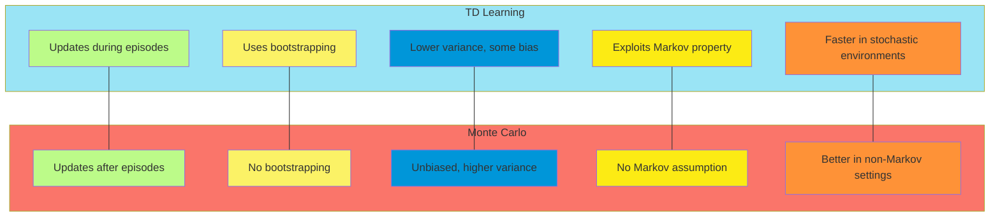
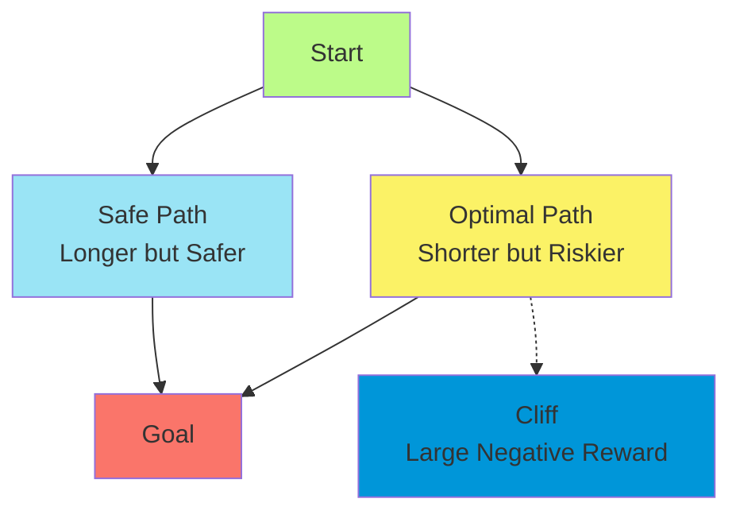
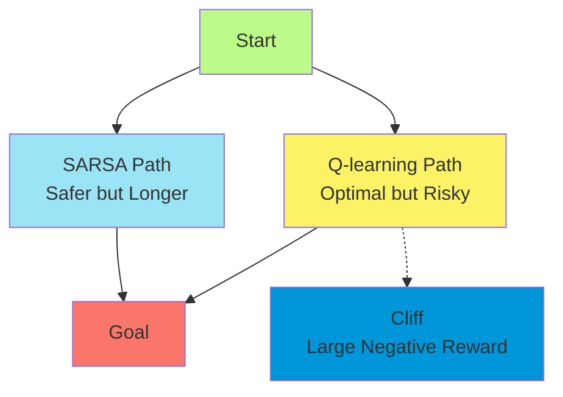
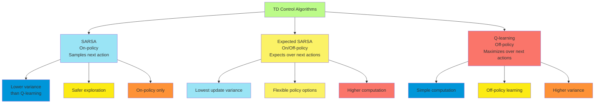
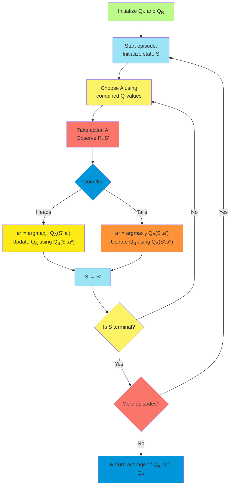

# C-5: Temporal-Difference Learning

1. TD Prediction

    - TD(0) Algorithm
    - Relation to Dynamic Programming
    - Bootstrapping and Sampling
    - Advantages and Limitations

2. Advantages of TD Methods

    - Comparison with Monte Carlo
    - Comparison with Dynamic Programming
    - Efficiency and Learning Speed
    - Empirical Results

3. Optimality of TD(0)

    - Batch Updating
    - Certainty Equivalence
    - Convergence Properties
    - Least-Squares Solution

4. SARSA: On-policy TD Control

    - Algorithm Description
    - Convergence Properties
    - Example Applications
    - Gridworld Experiments

5. Q-learning: Off-policy TD Control

    - Algorithm Description
    - Off-policy Learning
    - Convergence Properties
    - Cliff Walking Example

6. Expected SARSA

    - Algorithm Description
    - Reduction of Variance
    - Comparison with SARSA and Q-learning
    - Empirical Results

7. Maximization Bias and Double Learning
    - The Source of Bias
    - Double Q-learning
    - Empirical Evidence
    - Practical Implementations

#### TD Prediction

##### TD(0) Algorithm

Temporal-Difference (TD) learning represents a foundational approach in reinforcement learning that combines elements
from both Monte Carlo methods and dynamic programming. At its core, TD learning addresses the fundamental challenge of
learning value functions through experience without requiring a model of the environment.

The simplest TD method, known as TD(0) or one-step TD, updates value estimates based on the immediately observed reward
and the estimated value of the subsequent state. This creates a bootstrapping effect where estimates are updated based
on other estimates, unlike Monte Carlo methods which wait until the end of an episode to make updates.

The TD(0) algorithm for estimating the state-value function $v_\pi$ for a given policy $\pi$ works as follows:

1. Initialize value function $V(s)$ arbitrarily for all states (except terminal states, which should be 0)
2. For each episode:
    - Initialize state $S$
    - For each step of episode:
        - Take action $A$ following policy $\pi$
        - Observe reward $R$ and next state $S'$
        - Update $V(S)$ using the TD update rule: $V(S) \leftarrow V(S) + \alpha[R + \gamma V(S') - V(S)]$
        - $S \leftarrow S'$
    - Until $S$ is terminal

The critical component is the TD update rule. Let's break it down to understand its intuition:

- $R + \gamma V(S')$ is called the TD target, representing our new estimate of the value
- $R + \gamma V(S') - V(S)$ is the TD error, measuring the difference between the old estimate and the new target
- $\alpha$ is the step-size parameter, determining how much we adjust our estimate based on the new information

The value $R + \gamma V(S')$ can be seen as a sample of the expected return following state $S$. It combines the
immediate reward $R$ with the discounted estimate of future returns $\gamma V(S')$. This is a sample of the right side
of the Bellman equation:

$$v_\pi(s) = \sum_a \pi(a|s) \sum_{s',r} p(s',r|s,a)[r + \gamma v_\pi(s')]$$

The elegance of TD(0) lies in its incremental nature - it updates value estimates during the episode based on a single
time step, rather than waiting until the end.

```mermaid
flowchart TD
    A[Initialize V(s)] --> B[Start episode:<br>Initialize state S]
    B --> C[Take action A<br>following policy π]
    C --> D[Observe R, S']
    D --> E["Update V(S):<br>V(S) ← V(S) + α[R + γV(S') - V(S)]"]
    E --> F[S ← S']
    F --> G{Is S terminal?}
    G -->|No| C
    G -->|Yes| H{More episodes?}
    H -->|Yes| B
    H -->|No| I[Return V]

    style A fill:#BCFB89
    style B fill:#9AE4F5
    style C fill:#FBF266
    style D fill:#FA756A
    style E fill:#0096D9
    style F fill:#FCEB14
    style G fill:#FE9237
    style H fill:#9AE4F5
    style I fill:#FBF266
```

##### Relation to Dynamic Programming

TD learning shares important connections with dynamic programming techniques, particularly policy evaluation. Both
methods use the Bellman equation as a basis for updates, but they differ in how they obtain the next-state values and
expected rewards.

In dynamic programming (specifically policy evaluation), we perform full expected updates:

$$V(s) \leftarrow \sum_a \pi(a|s) \sum_{s',r} p(s',r|s,a)[r + \gamma V(s')]$$

This requires a complete model of the environment, including transition probabilities and reward functions.

In contrast, TD learning performs sample updates:

$$V(s) \leftarrow V(s) + \alpha[r + \gamma V(s') - V(s)]$$

Here, $r$ and $s'$ are a single sample from the environment, rather than an expectation over all possible outcomes. This
eliminates the need for a complete model.

The relationship between these approaches can be understood through the lens of the Bellman operator. Both methods can
be viewed as applying different approximations of the Bellman operator:

- Dynamic programming: exact application using expected values
- TD learning: stochastic approximation using samples

This connection provides theoretical grounding for TD methods' convergence properties. Under appropriate conditions
(such as decreasing step sizes and sufficient exploration), TD(0) converges to the true value function $v_\pi$ with
probability 1.

##### Bootstrapping and Sampling

TD learning combines two fundamental concepts in reinforcement learning: bootstrapping and sampling.

**Bootstrapping** refers to updating estimates based on other estimates. In TD(0), we update $V(S)$ based partly on
$V(S')$, another estimated value. This creates a dependency between value estimates that propagates information through
the state space without waiting for final outcomes.

**Sampling** refers to using actual experiences (samples) from the environment rather than expected values computed from
a model. TD methods sample transitions and rewards by interacting with the environment, making them model-free.

The combination of these properties places TD learning at a unique position in the reinforcement learning spectrum:

- Monte Carlo methods: Use sampling without bootstrapping
- Dynamic Programming: Uses bootstrapping without sampling
- TD Learning: Uses both bootstrapping and sampling

This combination gives TD methods distinct advantages and challenges:

**Benefits**:

1. **Incremental Computation**: Updates can be made after each step, not requiring episode completion
2. **Reduced Variance**: Bootstrapping typically reduces variance compared to Monte Carlo methods
3. **Model-Free Operation**: No need for transition or reward models
4. **Learning During Episodes**: Value information propagates through states during episodes

**Challenges**:

1. **Bias**: Bootstrapping introduces bias, especially early in learning
2. **Convergence Complexity**: The analysis of convergence is more complex due to the interdependence of estimates
3. **Parameter Sensitivity**: Performance can be sensitive to the step-size parameter

The bootstrapping nature of TD methods creates a characteristic behavior where value estimates propagate backward
through states during learning, with information flowing from states closer to rewards toward states that are more
distant from rewards.

##### Advantages and Limitations

TD learning offers several advantages that make it particularly useful in reinforcement learning applications:

**Advantages**:

1. **Online Learning**: TD methods can learn during an episode, making them suitable for continuing tasks without clear
   episode boundaries.
2. **Efficiency**: They typically converge faster than Monte Carlo methods in stochastic environments by making use of
   each step.
3. **Function Approximation Compatibility**: TD methods work well with function approximation techniques, allowing them
   to scale to large state spaces.
4. **Markov Property Utilization**: They make full use of the Markov property, unlike Monte Carlo methods which ignore
   the sequential structure within episodes.
5. **Low Variance**: Bootstrapping generally reduces variance in updates compared to Monte Carlo methods.
6. **Recency Emphasis**: TD methods naturally give more weight to recent observations, making them effective in
   non-stationary environments.

**Limitations**:

1. **Bias**: The bootstrapping nature introduces bias, particularly when initial value estimates are inaccurate.
2. **Sensitivity to Step Size**: Performance can be sensitive to the choice of step-size parameter.
3. **Bootstrapping Instability**: In some cases, especially with function approximation, bootstrapping can lead to
   instability or divergence.
4. **Temporal Credit Assignment**: While better than Monte Carlo methods, TD methods still face challenges in assigning
   credit over long sequences.
5. **Off-Policy Complications**: Using TD methods in off-policy settings introduces additional complexity for ensuring
   convergence.

TD learning encompasses a spectrum of algorithms, with TD(0) representing just one point on that spectrum. More advanced
TD methods, such as eligibility traces (TD(λ)), attempt to balance the trade-offs between TD(0) and Monte Carlo methods,
offering a continuous range of algorithms that combine their respective advantages.

The selection of the appropriate TD method depends on specific problem characteristics, including the availability of
samples, the length of episodes, the stochasticity of the environment, and the computational constraints.

#### Advantages of TD Methods

##### Comparison with Monte Carlo

TD methods and Monte Carlo methods represent two fundamental approaches to model-free reinforcement learning, each with
distinct characteristics. Understanding their differences helps in selecting the appropriate method for specific problem
contexts.

**Learning Mechanism**:

- **TD Methods**: Update estimates based on immediately observed rewards and subsequent state values (bootstrapping).
- **Monte Carlo**: Update estimates based on complete episode returns without bootstrapping.

**Update Timing**:

- **TD Methods**: Update after each step (or a small number of steps).
- **Monte Carlo**: Update only after episode completion.

**Bias-Variance Trade-off**:

- **TD Methods**: Lower variance but biased, especially early in learning.
- **Monte Carlo**: Unbiased estimates but higher variance.

**Sample Efficiency**:

- **TD Methods**: More efficient in stochastic environments by making use of each transition.
- **Monte Carlo**: Less efficient as it requires complete episodes and doesn't fully utilize the sequential structure of
  experiences.

**Handling Continuing Tasks**:

- **TD Methods**: Naturally applicable to continuing tasks without clear episode boundaries.
- **Monte Carlo**: Requires artificial episode termination for continuing tasks.

**Sensitivity to Initial Values**:

- **TD Methods**: More sensitive to initial value estimates due to bootstrapping.
- **Monte Carlo**: Less sensitive since updates are based on actual returns.

**Markov Property Reliance**:

- **TD Methods**: Exploit the Markov property by relating consecutive states.
- **Monte Carlo**: Don't rely on the Markov property, making them more robust in partially observable environments.

**Convergence Rate**:

- **TD Methods**: Generally faster convergence in stochastic environments.
- **Monte Carlo**: Often slower to converge but may find better policies in non-Markov environments.

Empirical studies have shown that TD methods often perform better than Monte Carlo methods in stochastic environments,
particularly when the Markov property holds. However, Monte Carlo methods may be preferred when faced with partial
observability or when unbiased estimates are critical.



##### Comparison with Dynamic Programming

TD methods and Dynamic Programming (DP) share the bootstrapping property but differ fundamentally in their reliance on
environment models. This comparison illuminates the trade-offs between model-based and model-free approaches.

**Environment Model Requirement**:

- **TD Methods**: Model-free, learning directly from experience without requiring transition probabilities or reward
  functions.
- **DP**: Model-based, requiring complete knowledge of environment dynamics.

**Update Mechanism**:

- **TD Methods**: Sample updates based on observed transitions.
- **DP**: Full expected updates across all possible next states and rewards.

**Computational Complexity**:

- **TD Methods**: Lower per-step computation, not requiring exhaustive calculations of expectations.
- **DP**: Higher complexity due to computing expectations over all possible transitions.

**Learning Approach**:

- **TD Methods**: Incremental learning through experience.
- **DP**: Systematic sweeping through state space.

**Handling Large State Spaces**:

- **TD Methods**: Can be combined with function approximation for scalability.
- **DP**: Traditional implementations scale poorly with state-space size.

**Convergence Properties**:

- **TD Methods**: Asymptotic convergence with appropriate conditions.
- **DP**: Deterministic convergence with finite iteration bounds.

**Exploration Requirement**:

- **TD Methods**: Need exploration strategies to ensure sufficient state-space coverage.
- **DP**: No exploration needed as all transitions are considered through the model.

The relationship between TD methods and DP can be understood through the lens of generalized policy iteration. Both
methods alternate between policy evaluation and improvement, but TD methods perform these steps through sampling rather
than exhaustive computation.

In practice, TD methods are often preferred when environment models are unavailable or inaccurate, while DP techniques
may be more appropriate when accurate models exist and computational resources permit their application.

##### Efficiency and Learning Speed

The efficiency and learning speed of TD methods are influenced by several factors, making them particularly advantageous
in certain domains.

**Sample Efficiency**: TD methods make efficient use of experience by learning from each step rather than waiting for
episode completion. This property is especially valuable in environments where:

- Episodes are long or have high variance in length
- Generating experience is costly (e.g., real-world robotics)
- Early termination of episodes is common

**Computational Efficiency**: TD updates are computationally lightweight, requiring only:

- The current state value $V(S)$
- The observed reward $R$
- The next state value $V(S')$

This simplicity enables:

- Fast updates suitable for real-time applications
- Easy parallelization across multiple agents or environments
- Efficient implementation on hardware with limited resources

**Learning Speed Factors**: The rate at which TD methods converge to accurate value functions depends on:

1. **Step-Size Parameter ($\alpha$)**:
    - Too large: Fast initial learning but potential instability
    - Too small: Stable but slow learning
    - Optimal: Problem-dependent, often requiring adaptive schemes
2. **Discount Factor ($\gamma$)**:
    - Influences the effective time horizon of value estimation
    - Values closer to 1 capture long-term dependencies but slow convergence
3. **State Representation**:
    - The quality of state features affects generalization ability
    - Good representations allow learning from fewer samples
4. **Problem Structure**:
    - Problems with clear reward signals learn faster
    - Environments with smooth value functions benefit from bootstrapping

**Efficiency Enhancements**: Several techniques can improve TD learning efficiency:

1. **Experience Replay**: Storing and reusing past transitions to improve sample efficiency
2. **Prioritized Sweeping**: Focusing updates on states with significant value changes
3. **Eligibility Traces**: Unifying TD and Monte Carlo approaches to accelerate learning
4. **Adaptive Step Sizes**: Adjusting learning rates based on observed statistics

The efficiency advantages of TD methods have made them the foundation for many successful reinforcement learning
applications, from robotics to game playing and recommendation systems.

##### Empirical Results

Empirical studies have consistently demonstrated the practical advantages of TD methods across various domains. These
results provide valuable insights into when and why TD methods excel.

**Random Walk Studies**: In the classic random walk experiments, TD(0) consistently outperformed Monte Carlo methods in
terms of prediction accuracy for a given amount of training data. Key findings include:

1. TD methods converged faster, especially in the early stages of learning
2. The difference was more pronounced with higher stochasticity in the environment
3. TD methods showed particular advantage when function approximation was used

**Game Playing Applications**: TD methods have achieved remarkable success in game-playing domains, including:

1. **Backgammon**: TD-Gammon learned to play at expert level using TD(λ) with neural networks
2. **Chess**: Various TD-based systems have achieved strong performance
3. **Go**: TD methods formed important components in early Go-playing systems

These successes highlighted TD learning's ability to handle long-term strategic planning with delayed rewards.

**Robotics and Control**: In robotics and control problems, TD methods have demonstrated several advantages:

1. Online learning capability allowed adaptation during task execution
2. Sample efficiency reduced the need for extensive physical interaction
3. The ability to learn from partial episodes proved valuable in tasks where failures needed to be avoided

**Practical Observations**: Empirical studies have revealed several practical insights about TD methods:

1. **Parameter Sensitivity**: Performance can be sensitive to step-size and other parameters, often requiring careful
   tuning
2. **Initial Value Effects**: Initial value functions can significantly impact learning trajectory and convergence rate
3. **Representation Impact**: The choice of state representation substantially affects learning efficiency
4. **Exploration Trade-offs**: The exploration strategy interacts with TD learning in complex ways, affecting overall
   performance

**Comparison Results**: Comparative studies between TD methods and alternatives have shown:

1. TD methods typically outperform Monte Carlo when the Markov property holds
2. Dynamic programming achieves better results when accurate models are available
3. TD(λ) with intermediate λ values often performs better than either TD(0) or Monte Carlo
4. The performance gap between methods narrows with increasing amounts of data

These empirical findings underscore the practical value of TD methods while also highlighting the importance of
algorithm selection based on specific problem characteristics and constraints.

#### Optimality of TD(0)

##### Batch Updating

Batch updating provides a theoretical framework for understanding the convergence properties of TD methods. In this
approach, we accumulate a batch of experiences and then perform updates to find a value function that minimizes certain
error measures.

In the batch setting, we consider a fixed set of experiences:

- Episodes or transitions from the environment
- A fixed policy that generated the experiences
- A finite set of states visited during these experiences

The batch TD(0) algorithm operates as follows:

1. Initialize value function $V$
2. Repeat until convergence:
    - For each state $S$ in the batch:
        - Compute TD update based on all transitions from $S$:
          $\Delta V(S) = \alpha \sum_i [R_i + \gamma V(S'_i) - V(S)]$
        - Update $V(S) \leftarrow V(S) + \Delta V(S)$

This algorithm converges to a value function that minimizes the mean squared TD error:

$$\text{MSTDE} = \sum_s \mu(s) \left[\sum_{s',r} p(s',r|s,\pi(s))[r + \gamma V(s') - V(s)]\right]^2$$

where $\mu(s)$ is the distribution of states in the batch.

The batch updating perspective reveals several important insights:

1. TD(0) converges to a unique solution regardless of initial values
2. The solution depends on the distribution of states in the batch
3. The solution minimizes a different objective than Monte Carlo methods

Understanding batch TD learning helps explain the algorithm's behavior in online settings. Even in online TD learning,
the algorithm tends to move toward solutions that would minimize the batch TD error if the current set of experiences
were treated as a batch.

```mermaid
flowchart TD
    A[Initialize value function V] --> B[For each state S in batch]
    B --> C[Compute average TD error<br>across all transitions from S]
    C --> D[Update V(S) based on<br>average TD error]
    D --> E{All states<br>processed?}
    E -->|No| B
    E -->|Yes| F{Converged?}
    F -->|No| B
    F -->|Yes| G[Return V]

    style A fill:#BCFB89
    style B fill:#9AE4F5
    style C fill:#FBF266
    style D fill:#FA756A
    style E fill:#0096D9
    style F fill:#FCEB14
    style G fill:#FE9237
```

##### Certainty Equivalence

Certainty equivalence is a principle that helps distinguish between different learning approaches based on how they
handle uncertainty in the environment. In reinforcement learning, this concept illuminates the fundamental difference
between TD methods and Monte Carlo methods in batch settings.

**Certainty Equivalence Principle**: A method exhibits certainty equivalence if it finds the optimal solution under a
model constructed from the observed data, as if that model were the true environment.

**TD(0) and Certainty Equivalence**: TD(0) in the batch setting exhibits certainty equivalence. It implicitly constructs
a maximum likelihood model of the environment from the observed transitions:

- For each state and action, it estimates transition probabilities based on observed frequencies
- It estimates expected rewards based on sample averages
- It then finds the value function that would be exact for this estimated model

Mathematically, TD(0) converges to the value function $V$ that satisfies:

$$V(s) = \sum_{s',r} \hat{p}(s',r|s,\pi(s))[r + \gamma V(s')]$$

where $\hat{p}$ represents the empirical transition probabilities derived from the batch of experiences.

**Monte Carlo and Certainty Equivalence**: In contrast, Monte Carlo methods do not exhibit certainty equivalence. They
directly average observed returns without constructing an implicit model of the environment. This leads to a different
solution that minimizes the mean squared error between predicted values and observed returns:

$$\text{MSE} = \sum_s \mu(s)[(V(s) - G_s)^2]$$

where $G_s$ represents the average observed return from state $s$.

**Practical Implications**: The certainty equivalence property has several implications for TD learning:

1. **Model Building**: TD methods implicitly build and solve models, connecting them to model-based approaches
2. **Data Efficiency**: This property contributes to TD methods' data efficiency in stochastic environments
3. **Bias Characteristics**: It explains the specific form of bias observed in TD learning
4. **Function Approximation**: The property extends to function approximation settings, helping explain convergence
   behavior

Understanding certainty equivalence provides theoretical insight into why TD methods perform differently from Monte
Carlo methods, even when both have access to the same data.

##### Convergence Properties

The convergence properties of TD(0) have been extensively studied, establishing solid theoretical foundations for its
practical application. Understanding these properties helps in setting expectations for algorithm performance and
choosing appropriate parameters.

**Tabular TD(0) Convergence**: For the tabular case (where each state has a separate value estimate), TD(0) converges to
the true value function $v_\pi$ with probability 1, given these conditions:

1. **Diminishing Step Sizes**: The step-size parameters $\alpha_t$ must satisfy:
    - $\sum_{t=1}^{\infty} \alpha_t = \infty$ (to ensure all states are updated sufficiently)
    - $\sum_{t=1}^{\infty} \alpha_t^2 < \infty$ (to control variance of updates)
2. **Sufficient Exploration**: All states must be visited infinitely often.
3. **Markov Property**: The environment must satisfy the Markov property.

The convergence rate depends on several factors:

- The mixing rate of the Markov process
- The discount factor $\gamma$
- The variance of rewards
- The choice of step-size schedule

**Convergence with Function Approximation**: When TD(0) is combined with function approximation (where the value
function is represented by a parameterized function), convergence becomes more complex:

1. **Linear Function Approximation**:
    - With on-policy sampling and appropriate step sizes, TD(0) converges with probability 1
    - The solution minimizes the TD error weighted by the state distribution under the policy
2. **Nonlinear Function Approximation**:
    - Convergence is not guaranteed in general
    - May converge to local optima or exhibit oscillatory behavior
    - Requires careful implementation and monitoring

**Stability Considerations**: Several factors affect the stability of TD learning:

1. **Off-Policy Learning**: TD(0) may diverge in off-policy settings due to the "deadly triad" of function
   approximation, bootstrapping, and off-policy sampling
2. **Step Size Selection**: Larger step sizes accelerate learning but can cause instability
3. **Representation Quality**: Poor state representations can cause slow convergence or divergence
4. **Reward Scale**: Very large rewards can destabilize learning through large TD errors

Advanced variants of TD learning address these stability issues through techniques like gradient TD methods, emphatic TD
algorithms, and various regularization approaches.

##### Least-Squares Solution

The least-squares approach to TD learning provides a computationally efficient way to find the optimal solution in the
batch setting. Rather than iteratively updating value estimates, least-squares temporal difference (LSTD) methods
compute the solution directly by solving a system of linear equations.

**LSTD for Value Prediction**: In the linear function approximation setting, where $V(s) = \mathbf{w}^T \mathbf{x}(s)$
with feature vector $\mathbf{x}(s)$, LSTD finds the weight vector $\mathbf{w}$ that minimizes the TD error across all
samples.

Given a batch of transitions $(s_t, r_t, s'_t)$, LSTD computes:

$$\mathbf{w} = \mathbf{A}^{-1}\mathbf{b}$$

where:

$$\mathbf{A} = \sum_t \mathbf{x}(s_t)(\mathbf{x}(s_t) - \gamma \mathbf{x}(s'_t))^T$$

$$\mathbf{b} = \sum_t \mathbf{x}(s_t)r_t$$

This computation finds the value function parameters that would make the expected TD update zero for the observed data
distribution.

**Advantages of LSTD**:

1. **Data Efficiency**: Makes optimal use of available data
2. **No Step-Size Parameter**: Eliminates the need to tune a critical hyperparameter
3. **Single Computation**: Finds the solution directly without iteration
4. **Stability**: Generally more stable than iterative TD methods

**Practical Considerations**:

1. **Computational Complexity**: Solving the system requires $O(d^3)$ operations for $d$ features
2. **Matrix Inversion**: The matrix $\mathbf{A}$ may be singular or ill-conditioned
3. **Regularization**: Often requires regularization for numerical stability
4. **Online Variants**: Recursive LSTD algorithms allow for online updating

**Relationship to TD(0)**: LSTD finds the same asymptotic solution as TD(0) would reach with batch updating, but it
computes this solution directly. In the tabular case with sufficient exploration, both methods converge to the true
value function.

The least-squares perspective provides important insights into the objectives that TD methods optimize, connecting them
to classical statistical estimation techniques and helping explain their empirical performance.

#### SARSA: On-policy TD Control

##### Algorithm Description

SARSA (State-Action-Reward-State-Action) extends temporal-difference learning from prediction to control, providing a
method for finding optimal policies through direct interaction with the environment. As an on-policy control algorithm,
SARSA learns action-value functions for the very policy it's using to make decisions.

The name SARSA comes from the quintuple of elements $(S_t, A_t, R_{t+1}, S_{t+1}, A_{t+1})$ used in the update rule,
capturing a complete transition from one state-action pair to the next.

The SARSA algorithm works as follows:

1. Initialize action-value function $Q(s,a)$ arbitrarily for all states and actions (except terminal states)
2. For each episode:
    - Initialize state $S$
    - Choose action $A$ from $S$ using policy derived from $Q$ (e.g., ε-greedy)
    - For each step of episode:
        - Take action $A$, observe reward $R$ and next state $S'$
        - Choose action $A'$ from $S'$ using policy derived from $Q$ (e.g., ε-greedy)
        - Update $Q(S,A)$ using the SARSA update rule: $Q(S,A) \leftarrow Q(S,A) + \alpha[R + \gamma Q(S',A') - Q(S,A)]$
        - $S \leftarrow S'$
        - $A \leftarrow A'$
    - Until $S$ is terminal

The core update rule in SARSA can be understood as:

- Current estimate: $Q(S,A)$
- TD target: $R + \gamma Q(S',A')$
- TD error: $R + \gamma Q(S',A') - Q(S,A)$
- New estimate: $Q(S,A) + \alpha$ × TD error

The critical aspect of SARSA is that it uses the action $A'$ actually taken in the next state according to the current
policy, rather than the maximum action value. This makes it an on-policy method that evaluates and improves the same
policy that's generating behavior.

```mermaid
flowchart TD
    A[Initialize Q(s,a)] --> B[Start episode:<br>Initialize state S]
    B --> C["Choose A from S<br>using policy from Q<br>(e.g., ε-greedy)"]
    C --> D[Take action A<br>Observe R, S']
    D --> E["Choose A' from S'<br>using policy from Q"]
    E --> F["Update Q(S,A):<br>Q(S,A) ← Q(S,A) + α[R + γQ(S',A') - Q(S,A)]"]
    F --> G[S ← S'<br>A ← A']
    G --> H{Is S terminal?}
    H -->|No| D
    H -->|Yes| I{More episodes?}
    I -->|Yes| B
    I -->|No| J[Return Q]

    style A fill:#BCFB89
    style B fill:#9AE4F5
    style C fill:#FBF266
    style D fill:#FA756A
    style E fill:#0096D9
    style F fill:#FCEB14
    style G fill:#FE9237
    style H fill:#9AE4F5
    style I fill:#FBF266
    style J fill:#FA756A
```

##### Convergence Properties

SARSA's convergence properties establish the theoretical foundation for its practical effectiveness. Understanding these
properties helps practitioners apply the algorithm with appropriate expectations and parameter settings.

**Convergence Conditions**: SARSA converges to the optimal policy and action-value function with probability 1 if:

1. **State-Action Pairs**: All state-action pairs are visited infinitely often.

2. **Exploration Reduction**: The policy must converge to a greedy policy, typically by reducing ε in the ε-greedy
   policy toward zero.

3. Step Sizes

    : The step-size parameters $\alpha_t$ must satisfy the stochastic approximation conditions:

    - $\sum_{t=1}^{\infty} \alpha_t = \infty$
    - $\sum_{t=1}^{\infty} \alpha_t^2 < \infty$

4. **Markov Property**: The environment must satisfy the Markov property.

**Convergence Rate Factors**: The speed of convergence is influenced by:

- Initial value function quality
- Exploration-exploitation trade-off and its adjustment over time
- Step-size parameter schedule
- Environment stochasticity
- Discount factor $\gamma$

**Practical Convergence Behavior**: In practice, SARSA exhibits several characteristic behaviors:

1. **Policy Improvement**: The policy typically improves monotonically in terms of expected return.
2. **Conservative Learning**: SARSA tends to learn more conservative policies than some alternatives, especially in
   environments with penalties for exploration.
3. **Exploration Impact**: The specific exploration strategy significantly affects convergence speed and the trajectory
   of learning.
4. **Parameter Sensitivity**: Performance can be sensitive to parameter choices, particularly the step size and
   exploration rate.

**Theoretical Results**: Important theoretical results for SARSA include:

1. **Finite-Sample Bounds**: Upper bounds exist on the number of samples needed to reach near-optimal policies with high
   probability.
2. **Asymptotic Convergence Rate**: Under appropriate conditions, SARSA converges at a rate of $O(1/\sqrt{n})$, where
   $n$ is the number of updates.
3. **Function Approximation**: With linear function approximation, SARSA converges under on-policy sampling with
   appropriate step sizes.

These theoretical properties translate into practical reliability in many applications, especially when SARSA is
implemented with appropriate parameter schedules and exploration strategies.

##### Example Applications

SARSA has been successfully applied to a wide range of reinforcement learning problems, demonstrating its practical
utility across diverse domains. These applications showcase the algorithm's strengths and adaptation possibilities.

**Robotics and Control**: SARSA has proven effective in various robotics applications:

1. **Robot Navigation**: Learning obstacle avoidance and path planning in unknown environments
2. **Manipulation Tasks**: Teaching robotic arms to grasp and manipulate objects
3. **Locomotion Control**: Developing walking gaits for legged robots

In these domains, SARSA's on-policy nature provides safety advantages, as it learns values for the actual policy being
followed rather than an idealized greedy policy.

**Game Playing**: SARSA has been applied to various games:

1. **Backgammon**: Learning effective strategies through self

SARSA has been applied to various games:

1. **Backgammon**: Learning effective strategies through self-play
2. **Grid-based Games**: Finding optimal paths in maze-like environments
3. **Arcade Games**: Learning control policies for Atari games and similar environments

The algorithm performs particularly well in games where cautious exploration is beneficial, as it accounts for
exploratory moves in its value estimates.

**Resource Management**: SARSA has been successfully implemented in resource allocation problems:

1. **Inventory Management**: Optimizing ordering policies in supply chains
2. **Energy Systems**: Managing power distribution in smart grids
3. **Network Routing**: Optimizing data packet routing in communication networks

In these applications, SARSA's ability to learn online during system operation provides advantages over methods
requiring offline training.

**Healthcare Applications**: Researchers have applied SARSA to healthcare decision-making:

1. **Treatment Planning**: Developing personalized treatment regimens
2. **Clinical Decision Support**: Suggesting interventions based on patient data
3. **Resource Allocation**: Optimizing hospital resource utilization

The on-policy nature of SARSA makes it suitable for healthcare applications where exploratory actions must be taken
cautiously.

**Practical Implementation Insights**: Across these applications, several common implementation practices emerge:

1. Using decaying exploration rates (ε-greedy with diminishing ε)
2. Combining SARSA with function approximation for handling large state spaces
3. Incorporating domain knowledge through reward shaping and state representation
4. Adapting step sizes based on observed learning progress

These examples demonstrate SARSA's versatility and practical utility across domains requiring sequential decision-making
under uncertainty.

##### Gridworld Experiments

Gridworld experiments provide an intuitive and visual way to understand SARSA's behavior. These simplified environments
allow for clear analysis of learning dynamics while still capturing essential challenges of sequential decision-making.

**Standard Gridworld Setup**: A typical gridworld consists of:

- A grid of cells representing possible states
- A set of actions (usually up, down, left, right)
- Reward specifications (e.g., positive reward at goal, negative rewards for obstacles)
- Terminal states (goals and possibly hazards)

**Learning Dynamics Observations**: Gridworld experiments with SARSA reveal several characteristic behaviors:

1. **Value Propagation**: Values propagate backward from reward locations through the state space, creating a "value
   gradient" that guides the agent toward goals.
2. **Policy Evolution**: The policy typically evolves from random exploration to increasingly direct paths as learning
   progresses.
3. **Exploration-Exploitation Trade-off**: The balance between exploring new paths and exploiting known good paths
   directly affects learning speed and final policy quality.
4. **Risk Sensitivity**: SARSA tends to learn paths that avoid states with the risk of large penalties, even if those
   paths are suboptimal under perfect play.

**Cliff Walking Example**: The cliff walking problem is a classic gridworld experiment that highlights SARSA's
distinctive properties:

- The agent must move from a start state to a goal state
- A "cliff" runs along the bottom path (the shortest route)
- Falling off the cliff results in a large negative reward and a return to the start

In this environment, SARSA typically learns a safer path that stays away from the cliff, while methods like Q-learning
(discussed next) may learn the riskier optimal path.

**Parameter Effects**: Gridworld experiments demonstrate how SARSA's behavior is affected by parameter choices:

1. **Step Size (α)**:
    - Small α: Slower learning but more stable convergence
    - Large α: Faster initial learning but potential oscillations
2. **Exploration Rate (ε)**:
    - High ε: Better exploration of all possible paths
    - Low ε: Faster exploitation of good paths
    - Decaying ε: Initial exploration followed by exploitation
3. **Discount Factor (γ)**:
    - γ close to 0: Myopic behavior focusing on immediate rewards
    - γ close to 1: Far-sighted behavior considering long-term consequences

These experiments provide practical insights for parameter tuning in more complex applications and help build intuition
about how SARSA works in more general settings.



#### Q-learning: Off-policy TD Control

##### Algorithm Description

Q-learning is a landmark algorithm in reinforcement learning that separates the policy being learned from the policy
being followed. This off-policy approach allows for greater flexibility and often leads to more efficient learning.

The Q-learning algorithm works as follows:

1. Initialize action-value function $Q(s,a)$ arbitrarily for all states and actions
2. For each episode:
    - Initialize state $S$
    - For each step of episode:
        - Choose action $A$ from $S$ using policy derived from $Q$ (e.g., ε-greedy)
        - Take action $A$, observe reward $R$ and next state $S'$
        - Update $Q(S,A)$ using the Q-learning update rule:
          $Q(S,A) \leftarrow Q(S,A) + \alpha[R + \gamma \max_{a'} Q(S',a') - Q(S,A)]$
        - $S \leftarrow S'$
    - Until $S$ is terminal

The critical difference from SARSA lies in the update rule. Q-learning uses the maximum action value in the next state
($\max_{a'} Q(S',a')$) regardless of what action will actually be taken. This corresponds to learning the value function
for the optimal policy while following an exploratory policy.

The update can be understood as:

- Current estimate: $Q(S,A)$
- TD target: $R + \gamma \max_{a'} Q(S',a')$
- TD error: $R + \gamma \max_{a'} Q(S',a') - Q(S,A)$
- New estimate: $Q(S,A) + \alpha$ × TD error

This approach directly approximates the optimal action-value function, independent of the policy being followed. This
makes Q-learning particularly sample-efficient in many environments.

```mermaid
flowchart TD
    A[Initialize Q(s,a)] --> B[Start episode:<br>Initialize state S]
    B --> C["Choose A from S<br>using policy from Q<br>(e.g., ε-greedy)"]
    C --> D[Take action A<br>Observe R, S']
    D --> E["Update Q(S,A):<br>Q(S,A) ← Q(S,A) + α[R + γ max<sub>a'</sub> Q(S',a') - Q(S,A)]"]
    E --> F[S ← S']
    F --> G{Is S terminal?}
    G -->|No| C
    G -->|Yes| H{More episodes?}
    H -->|Yes| B
    H -->|No| I[Return Q]

    style A fill:#BCFB89
    style B fill:#9AE4F5
    style C fill:#FBF266
    style D fill:#FA756A
    style E fill:#0096D9
    style F fill:#FCEB14
    style G fill:#FE9237
    style H fill:#9AE4F5
    style I fill:#FBF266
```

##### Off-policy Learning

Off-policy learning represents a fundamental approach in reinforcement learning where the policy being learned differs
from the policy generating experience. Q-learning is the quintessential off-policy algorithm, demonstrating both the
power and challenges of this approach.

**Key Principles of Off-policy Learning**:

1. **Policy Separation**:
    - **Target Policy**: The policy being learned (typically the optimal policy)
    - **Behavior Policy**: The policy used to generate experience (typically exploratory)
2. **Coverage Requirement**: For off-policy learning to converge, the behavior policy must provide adequate coverage:
    - Every action that might be taken by the target policy must have some probability of being selected by the behavior
      policy
    - In Q-learning, this is typically ensured through ε-greedy exploration
3. **Advantages of Off-policy Learning**:
    - Learning about multiple policies from the same experience stream
    - Learning the optimal policy while following an exploratory policy
    - Learning from demonstrations or historical data
    - Reusing experience efficiently through experience replay
4. **Challenges in Off-policy Learning**:
    - Higher variance in updates, potentially leading to instability
    - More complex convergence properties, especially with function approximation
    - The "deadly triad" problem: the combination of function approximation, bootstrapping, and off-policy learning can
      lead to divergence

**Q-learning as Off-policy TD Control**:

Q-learning implements off-policy learning through a specific formulation:

- The target policy is greedy with respect to the current Q-values: $\pi(s) = \arg\max_a Q(s,a)$
- The behavior policy is typically ε-greedy with respect to the same Q-values
- The update rule directly approximates the optimal value function using the maximum Q-value in the next state

This approach allows Q-learning to learn about the greedy policy while following an exploratory policy, leading to more
efficient learning in many environments.

The off-policy nature of Q-learning makes it particularly valuable in settings where exploration carries risk, where
data collection is expensive, or where learning must occur from historical data rather than new interactions.

##### Convergence Properties

Q-learning has strong theoretical convergence guarantees under appropriate conditions, establishing it as one of the
most reliable reinforcement learning algorithms.

**Convergence Conditions**: Q-learning converges to the optimal action-value function $q_*$ with probability 1 if:

1. **State-Action Coverage**: All state-action pairs $(s,a)$ are visited infinitely often.

2. Step Sizes

    : The step-size parameters $\alpha_t(s,a)$ satisfy the stochastic approximation conditions:

    - $\sum_{t=1}^{\infty} \alpha_t(s,a) = \infty$
    - $\sum_{t=1}^{\infty} \alpha_t(s,a)^2 < \infty$

3. **Bounded Rewards**: The rewards are bounded (i.e., $|R_t| < \infty$).

4. **Markov Property**: The environment satisfies the Markov property.

**Theoretical Guarantees**: Under these conditions, Q-learning provides several strong guarantees:

1. **Optimal Value Function**: The learned Q-values converge to the optimal action-value function: $Q(s,a) \to q_*(s,a)$
   as training progresses.
2. **Optimal Policy**: The greedy policy with respect to the converged Q-values is optimal:
   $\pi(s) = \arg\max_a Q(s,a) = \pi_*(s)$
3. **Convergence Rate**: The algorithm converges at a rate of approximately $O(1/\sqrt{n})$ in the tabular case, where
   $n$ is the number of updates.

**Practical Convergence Considerations**: In practice, convergence is influenced by several factors:

1. **Exploration Strategy**: The specific exploration method affects how quickly all relevant state-action pairs are
   visited.
2. **Step Size Schedule**: Constant step sizes provide adaptability but sacrifice asymptotic convergence guarantees.
3. **Initial Q-values**: Optimistic initialization can promote exploration and affect convergence speed.
4. **State Space Size**: Larger state spaces require more experience for convergence, often necessitating function
   approximation.

**Function Approximation Challenges**: When Q-learning is combined with function approximation, convergence becomes more
complex:

1. **Linear Function Approximation**: Can diverge even in simple environments due to the off-policy nature.

2. **Nonlinear Function Approximation**: Provides no general convergence guarantees.

3. Mitigation Techniques

    : Various approaches have been developed to address these challenges:

    - Experience replay to break temporal correlations
    - Target networks to stabilize bootstrapping
    - Gradient-based variants with better convergence properties
    - Double Q-learning to reduce overestimation bias

Despite these challenges, Q-learning's strong performance in practice has made it the foundation for many advanced
reinforcement learning algorithms, including deep Q-networks (DQN) which achieved breakthrough results in complex
domains.

##### Cliff Walking Example

The cliff walking example provides an illuminating comparison between Q-learning and SARSA, highlighting their different
behaviors due to their on-policy versus off-policy nature.

**Environment Description**: The cliff walking environment consists of:

- A grid of cells representing possible positions
- A start state in the bottom-left corner
- A goal state in the bottom-right corner
- A "cliff" along the bottom edge between start and goal
- Falling off the cliff results in a large negative reward (-100) and a return to the start
- Each movement has a small negative reward (-1)
- Actions include moving up, down, left, or right

**Behavioral Differences**: In this environment, Q-learning and SARSA typically learn different policies:

1. **Q-learning Behavior**:
    - Learns values for the optimal deterministic policy
    - Tends to find the shortest path along the cliff edge
    - This path is optimal under perfect execution but risky under exploration
    - During learning with exploration, the agent falls off the cliff frequently
    - Final learned policy is optimal but performed poorly during learning
2. **SARSA Behavior**:
    - Learns values for the actual policy being followed (including exploration)
    - Tends to find a path that stays away from the cliff
    - This path is suboptimal under perfect execution but safer under exploration
    - During learning, the agent falls off the cliff less frequently
    - Final learned policy is suboptimal but performed better during learning

**Interpretation**: This difference exemplifies a fundamental trade-off:

1. **Q-learning**: Maximizes asymptotic performance without considering the risks during learning
2. **SARSA**: Accounts for exploration risks, potentially leading to safer but suboptimal policies

The cliff walking example demonstrates the practical impact of the off-policy versus on-policy distinction, showing how
the choice of algorithm should consider the cost of mistakes during learning, not just the quality of the final policy.



**Performance Metrics**: Empirical results in the cliff walking example typically show:

1. Q-learning has higher total reward asymptotically (with ε = 0)
2. SARSA has higher total reward during learning (with exploration)
3. Q-learning experiences significantly more cliff falls during training
4. The performance difference decreases as exploration (ε) decreases

This example provides valuable intuition about algorithm selection based on the relative importance of learning
performance versus asymptotic performance in a given application.

#### Expected SARSA

##### Algorithm Description

Expected SARSA is an elegant algorithm that combines elements of both SARSA and Q-learning, offering improved stability
while maintaining the benefits of off-policy learning. It reduces variance in updates by considering the expected value
of the next state under the current policy, rather than sampling a specific action.

The Expected SARSA algorithm works as follows:

1. Initialize action-value function $Q(s,a)$ arbitrarily for all states and actions
2. For each episode:
    - Initialize state $S$
    - For each step of episode:
        - Choose action $A$ from $S$ using policy derived from $Q$ (e.g., ε-greedy)
        - Take action $A$, observe reward $R$ and next state $S'$
        - Update $Q(S,A)$ using the Expected SARSA update rule:
          $Q(S,A) \leftarrow Q(S,A) + \alpha[R + \gamma \sum_{a'} \pi(a'|S') Q(S',a') - Q(S,A)]$
        - $S \leftarrow S'$
    - Until $S$ is terminal

The key innovation is in the update rule, which uses the expected value of the next state-action pair under the current
policy, rather than:

- A sampled next action (as in SARSA)
- The maximum next action (as in Q-learning)

For an ε-greedy policy with ε = 0.1 and 4 possible actions, the expected value would be:
$(0.925 \times \max_a Q(S',a)) + (0.025 \times \sum_{a \neq a^*} Q(S',a))$ where $a^*$ is the greedy action in state
$S'$.

Expected SARSA can be used both on-policy (where the target policy is the same as the behavior policy) and off-policy
(where they differ). In the off-policy case, the expectation in the update rule is taken with respect to the target
policy, while actions are selected according to the behavior policy.

```mermaid
flowchart TD
    A[Initialize Q(s,a)] --> B[Start episode:<br>Initialize state S]
    B --> C["Choose A from S<br>using behavior policy"]
    C --> D[Take action A<br>Observe R, S']
    D --> E["Update Q(S,A):<br>Q(S,A) ← Q(S,A) + α[R + γ Σ<sub>a'</sub> π(a'|S')Q(S',a') - Q(S,A)]"]
    E --> F[S ← S']
    F --> G{Is S terminal?}
    G -->|No| C
    G -->|Yes| H{More episodes?}
    H -->|Yes| B
    H -->|No| I[Return Q]

    style A fill:#BCFB89
    style B fill:#9AE4F5
    style C fill:#FBF266
    style D fill:#FA756A
    style E fill:#0096D9
    style F fill:#FCEB14
    style G fill:#FE9237
    style H fill:#9AE4F5
    style I fill:#FBF266
```

##### Reduction of Variance

One of Expected SARSA's key advantages is its reduction in update variance compared to SARSA and Q-learning, leading to
more stable learning, particularly in stochastic environments.

**Sources of Variance in TD Updates**: In reinforcement learning algorithms, variance in updates can arise from:

1. Stochastic rewards
2. Stochastic transitions between states
3. Stochastic action selection in the updating policy

While all TD methods handle the first two sources similarly, Expected SARSA specifically addresses the third source by
replacing a sampled action with an expectation over actions.

**Variance Reduction Mechanism**: Expected SARSA reduces variance through expectation:

1. **SARSA Update**: Uses a sample of the next action ($A'$):
   $Q(S,A) \leftarrow Q(S,A) + \alpha[R + \gamma Q(S',A') - Q(S,A)]$
2. **Expected SARSA Update**: Uses the expected value over all possible next actions:
   $Q(S,A) \leftarrow Q(S,A) + \alpha[R + \gamma \sum_{a'} \pi(a'|S') Q(S',a') - Q(S,A)]$

This expectation eliminates the variance associated with sampling the next action, while still accounting for the
exploration policy.

**Mathematical Analysis**: The variance reduction can be quantified:

Let $Z_1 = R + \gamma Q(S',A')$ be the SARSA target and $Z_2 = R + \gamma \sum_{a'} \pi(a'|S') Q(S',a')$ be the Expected
SARSA target.

Since $\mathbb{E}[Z_1] = \mathbb{E}[Z_2]$ (they have the same expected value), but $\text{Var}[Z_1] > \text{Var}[Z_2]$
due to the additional randomness in sampling $A'$, Expected SARSA's updates have strictly lower variance when the policy
is stochastic.

**Practical Benefits**: The variance reduction provides several advantages:

1. More stable learning trajectories with fewer oscillations
2. Potentially larger usable step sizes without divergence
3. Improved performance in environments with high stochasticity
4. More reliable convergence, especially with function approximation

The variance reduction is especially significant when:

- The exploration rate (ε) is high
- The action-value differences in states are large
- The environment transitions are already high-variance

This variance reduction mechanism makes Expected SARSA particularly valuable in scenarios where stability during
learning is important, such as online learning in critical applications.

##### Comparison with SARSA and Q-learning

Expected SARSA offers a compelling middle ground between SARSA and Q-learning, sharing advantages with both while
addressing some of their limitations. Understanding these relationships helps in selecting the most appropriate
algorithm for specific problems.

**Algorithmic Relationships**: Expected SARSA can be viewed as a generalization of both SARSA and Q-learning:

1. **Connection to SARSA**:
    - Both use the current policy for action selection
    - SARSA samples the next action, while Expected SARSA takes an expectation
    - Both converge to the same values when used on-policy
2. **Connection to Q-learning**:
    - Both can be used off-policy
    - Q-learning is a special case of Expected SARSA where the target policy is greedy
    - When using Expected SARSA with a greedy target policy, the update becomes:
      $Q(S,A) \leftarrow Q(S,A) + \alpha[R + \gamma \max_{a'} Q(S',a') - Q(S,A)]$ which is identical to Q-learning

Thus, Expected SARSA provides a unified framework that includes both SARSA and Q-learning as special cases.

**Performance Comparisons**:

1. **Learning Stability**:
    - Expected SARSA > SARSA > Q-learning
    - Expected SARSA has the lowest update variance
    - Q-learning often shows highest variance due to the max operator
2. **Sample Efficiency**:
    - Expected SARSA ≈ Q-learning > SARSA
    - Off-policy learning allows more efficient use of experience
3. **Computational Complexity**:
    - SARSA < Q-learning < Expected SARSA
    - Expected SARSA requires computing an expectation over all actions
4. **Safety During Learning**:
    - SARSA > Expected SARSA > Q-learning
    - On-policy methods account for exploration risks
5. **Asymptotic Performance**:
    - Q-learning ≈ Expected SARSA (with greedy target) > SARSA
    - Off-policy methods can learn the optimal policy while exploring

**Practical Selection Criteria**: The choice between these algorithms should consider:

1. **Risk Tolerance**: If mistakes during learning are costly, SARSA or on-policy Expected SARSA may be preferred.
2. **Stochasticity**: In highly stochastic environments, Expected SARSA's variance reduction is more valuable.
3. **Computational Resources**: If computation per step is limited, SARSA may be more appropriate.
4. **Final Policy Quality**: If maximizing asymptotic performance is critical, off-policy methods are generally
   preferred.

In practice, Expected SARSA often provides the best overall performance, combining the stability of SARSA with the
efficiency of Q-learning, albeit at a slightly higher computational cost.



##### Empirical Results

Empirical studies have consistently demonstrated Expected SARSA's advantages across various environments, providing
evidence for its theoretical benefits in practical applications.

**Standard Benchmark Results**: In classic reinforcement learning benchmarks, Expected SARSA typically shows:

1. **Cliff Walking Environment**:
    - More stable learning than Q-learning
    - Fewer catastrophic falls during training
    - Better asymptotic performance than SARSA
    - Performance between SARSA and Q-learning in early learning
2. **Mountain Car Task**:
    - Faster convergence than SARSA
    - Lower variance in learning curves than Q-learning
    - Better performance with higher learning rates
3. **Windy Gridworld**:
    - More consistent learning across different exploration rates
    - Better average performance during training

**Stochasticity Impact**: Studies investigating the effect of environment stochasticity show:

1. The advantage of Expected SARSA over other methods increases with environment stochasticity
2. In deterministic environments, the benefit is smaller but still present
3. In highly stochastic environments, Expected SARSA allows for larger step sizes without divergence

**Step Size Sensitivity**: Comparative analyses of step size sensitivity reveal:

1. Expected SARSA remains stable with larger step sizes than both SARSA and Q-learning
2. Q-learning shows the highest sensitivity to step size
3. For any given environment, Expected SARSA typically has a wider range of effective step sizes

**Off-policy Performance**: When used off-policy (with different behavior and target policies):

1. Expected SARSA shows faster convergence than importance sampling methods
2. It maintains lower variance than Q-learning while achieving similar asymptotic performance
3. It combines the best aspects of deterministic and stochastic policy updates

**Function Approximation Settings**: With linear or neural network function approximation:

1. Expected SARSA typically exhibits greater stability
2. It often requires less careful tuning of hyperparameters
3. The variance reduction benefit becomes even more pronounced in complex domains

These empirical results confirm Expected SARSA's theoretical advantages and suggest it should be considered a primary
candidate for many reinforcement learning applications, particularly in stochastic environments or when stability during
learning is important.

#### Maximization Bias and Double Learning

##### The Source of Bias

Maximization bias is a fundamental issue in reinforcement learning algorithms that use the maximum value of a set of
estimated quantities. This bias affects both Q-learning and Expected SARSA when they utilize greedy target policies.

**Nature of Maximization Bias**: Maximization bias occurs because:

1. Value estimates contain errors (noise)
2. Taking the maximum of noisy estimates tends to select overestimated values
3. This leads to a systematic overestimation of state-action values

To understand this intuitively, consider a simple example: If we have several actions with the same true value Q, but
our estimates contain noise, the maximum estimated value will systematically exceed the true value because we're
selecting the most favorably overestimated action.

**Mathematical Analysis**: For a state $s$ with multiple actions, suppose the true Q-values are identical for all
actions: $q_*(s,a_1) = q_*(s,a_2) = ... = q_*(s,a_n) = v$

Our estimates $Q(s,a_i)$ will equal the true value plus some zero-mean noise: $Q(s,a_i) = v + \epsilon_i$

When we take the maximum: $\max_a Q(s,a) = v + \max_a \epsilon_a$

Since we're taking the maximum of the noise terms, and these have mean zero, the expected value of the maximum will be
positive: $\mathbb{E}[\max_a Q(s,a)] = v + \mathbb{E}[\max_a \epsilon_a] > v$

This creates a systematic overestimation.

**Impact in TD Learning**: In Q-learning, the update uses:
$Q(S,A) \leftarrow Q(S,A) + \alpha[R + \gamma \max_{a'} Q(S',a') - Q(S,A)]$

The $\max_{a'} Q(S',a')$ term introduces an upward bias in the update, leading to:

1. Overestimation of action values
2. Suboptimal action selection
3. Slower convergence
4. Potential instability in function approximation settings

The severity of maximization bias increases with:

1. The number of actions available
2. The variance in the value estimates
3. Insufficient exploration
4. The use of function approximation

This bias represents a significant challenge in reinforcement learning, motivating the development of methods like
Double Q-learning to address it.

##### Double Q-learning

Double Q-learning is an elegant algorithm designed to eliminate the maximization bias in Q-learning by decoupling the
selection of an action from the evaluation of that action. This approach maintains two separate value functions that
learn from each other's targets.

**Algorithm Description**: Double Q-learning maintains two independent action-value functions, $Q_A$ and $Q_B$:

1. Initialize two action-value functions $Q_A(s,a)$ and $Q_B(s,a)$ arbitrarily
2. For each episode:
    - Initialize state $S$
    - For each step of episode:
        - Choose action $A$ based on combined values (e.g., ε-greedy w.r.t. $(Q_A + Q_B)/2$)
        - Take action $A$, observe reward $R$ and next state $S'$
        - With 0.5 probability:
            - Update $Q_A$:
              $Q_A(S,A) \leftarrow Q_A(S,A) + \alpha[R + \gamma Q_B(S', \arg\max_{a'} Q_A(S', a')) - Q_A(S,A)]$
        - Else:
            - Update $Q_B$:
              $Q_B(S,A) \leftarrow Q_B(S,A) + \alpha[R + \gamma Q_A(S', \arg\max_{a'} Q_B(S', a')) - Q_B(S,A)]$
        - $S \leftarrow S'$
    - Until $S$ is terminal

The key innovation is how the target is computed:

1. One value function ($Q_A$ or $Q_B$) selects the best action $a^* = \arg\max_{a'} Q(S', a')$
2. The other value function evaluates that action $Q(S', a^*)$

This decoupling prevents the maximization bias because the errors in the two value functions are independent.



**Theoretical Properties**: Double Q-learning provides several theoretical advantages:

1. **Unbiased Estimation**: The expected value of the double Q-learning target converges to the true expected value,
   eliminating the systematic overestimation.
2. **Convergence Guarantees**: Like Q-learning, double Q-learning converges to the optimal policy with probability 1
   under standard conditions.
3. **Sample Efficiency**: Though it maintains two value functions, it does not require twice as many samples, as each
   update is more accurate.
4. **Variance Properties**: The decoupled estimators do introduce additional variance, creating a bias-variance
   trade-off compared to standard Q-learning.

The decoupling mechanism addresses the source of maximization bias at its core, providing an estimator that is more
accurate in expectation, particularly in environments with many actions or high estimation noise.

##### Empirical Evidence

Empirical studies have provided substantial evidence for the practical benefits of double learning approaches in
addressing maximization bias.

**Controlled Experiments**: In carefully designed synthetic environments where the true values are known:

1. **Systematic Overestimation**: Standard Q-learning consistently overestimates action values, with the bias increasing
   with the number of actions.
2. **Bias Elimination**: Double Q-learning produces estimates that are centered around the true values without
   systematic bias.
3. **Noise Sensitivity**: The advantage of double Q-learning increases with the noise level in the environment, as
   higher noise exacerbates maximization bias.
4. **Learning Speed**: Despite using twice the memory, double Q-learning often converges faster in terms of episodes
   required, due to more accurate targets.

**Reinforcement Learning Benchmarks**: In standard reinforcement learning benchmarks:

1. **Cliff Walking**: Double Q-learning finds safer paths than standard Q-learning, suggesting more accurate evaluation
   of risks.
2. **Randomly Generated MDPs**: Double Q-learning consistently outperforms Q-learning across a wide range of randomly
   generated environments, especially those with many actions.
3. **Atari Games**: Double DQN (the deep learning extension of double Q-learning) demonstrates substantial improvements
   over standard DQN in many Atari games.
4. **Continuous Control**: In continuous action spaces, variants of double Q-learning show more stable learning and
   better performance.

**Key Empirical Findings**: The empirical evidence reveals several important patterns:

1. **Performance Gap with Environment Complexity**: The advantage of double Q-learning increases with environment
   complexity and stochasticity.
2. **Early Learning Impact**: The improvement is often most pronounced in the early stages of learning when estimates
   contain the most noise.
3. **Function Approximation Benefits**: The benefits become even more significant when using function approximation,
   where the risk of divergence due to overestimation is greater.
4. **Parameter Robustness**: Double Q-learning typically exhibits greater robustness to hyperparameter choices,
   particularly learning rates.

These empirical results have firmly established double learning approaches as valuable tools in reinforcement learning,
especially in complex environments where accurate value estimation is crucial for finding optimal policies.

##### Practical Implementations

Double Q-learning has inspired several practical implementations and extensions that address maximization bias while
adapting to specific application contexts.

**Double Deep Q-Network (DDQN)**: In deep reinforcement learning, Double DQN applies the double Q-learning principle to
neural network function approximation:

1. Maintains a primary network and a target network (updated less frequently)
2. Uses the primary network to select actions: $a^* = \arg\max_{a'} Q_{\text{primary}}(s', a')$
3. Uses the target network to evaluate those actions: $Q_{\text{target}}(s', a^*)$
4. This approach significantly improved performance across Atari games compared to standard DQN

**Averaged Double Q-learning**: This variant improves sample efficiency by using a weighted average of both estimates
for action selection:

1. Maintains two Q-functions as in standard double Q-learning
2. Uses a weighted average for policy: $\pi(s) = \arg\max_a [(1-w)Q_A(s,a) + wQ_B(s,a)]$
3. Updates each Q-function independently using the double Q-learning approach
4. The weight parameter $w$ allows tuning the reliance on each estimator

**Weighted Double Q-learning**: This approach uses adaptive weighting based on uncertainty estimates:

1. Weights the two Q-functions based on their estimated uncertainties
2. Gives more weight to the function with lower uncertainty at each state-action pair
3. This focuses learning on more reliable estimates

**Multi-step Double Q-learning**: Combining double Q-learning with $n$-step returns:

1. Uses $n$-step returns instead of one-step returns in the update
2. Maintains the decoupled action selection and evaluation
3. This combines the bias reduction of double Q-learning with the variance reduction of multi-step methods

**Implementation Considerations**: When implementing double Q-learning in practice, several considerations are
important:

1. **Memory Requirements**: Double Q-learning requires twice the memory of standard Q-learning, which can be significant
   with large state spaces or function approximation.
2. **Efficient Implementation**: For efficiency, implementations often:
    - Share feature extraction layers in neural network implementations
    - Update both networks symmetrically to maintain similar feature representations
    - Use experience replay to improve sample efficiency
3. **Exploration Strategy**: The exploration strategy should consider both Q-functions, often using their average for
   ε-greedy selection.
4. **Initialization**: Careful initialization of both Q-functions helps ensure they remain somewhat independent,
   preserving the benefits of double estimation.
5. **Computational Cost**: The computational overhead is relatively small, as action selection still requires computing
   $\max_a Q(s,a)$ for both methods.

These practical implementations have extended double Q-learning's applicability to a wide range of reinforcement
learning problems, establishing it as a standard technique for addressing maximization bias in value-based methods.

### Summary of Temporal-Difference Learning

Temporal-Difference (TD) learning represents a fundamental class of reinforcement learning methods that combine the
sampling approach of Monte Carlo methods with the bootstrapping characteristic of dynamic programming. This unique
combination creates algorithms with distinct advantages for many practical applications.

**Core Principles**:

1. **TD Prediction (TD(0))**: The most basic TD algorithm updates state values based on immediately observed rewards and
   estimated values of subsequent states, creating a one-step bootstrap target.
2. **Bootstrapping and Sampling**: TD methods learn from incomplete episodes by bootstrapping (using value estimates in
   their updates) while sampling from the environment rather than using a model.
3. **On-policy Control (SARSA)**: Extends TD prediction to control problems by learning action values while following
   and improving the same policy used to generate experience.
4. **Off-policy Control (Q-learning)**: Learns about the optimal policy while following an exploratory policy, using the
   maximum action value for the next state regardless of the action actually taken.
5. **Expected SARSA**: Reduces variance by using the expected value of the next state under the current policy, rather
   than sampling a specific action or taking the maximum.
6. **Maximization Bias**: A challenge in algorithms that use maximum value estimates, addressed by techniques like
   double Q-learning which decouples action selection from action evaluation.

**Key Advantages of TD Methods**:

1. **Online Learning**: TD methods can learn during episodes without waiting for final outcomes, making them suitable
   for continuing tasks.
2. **Efficiency**: They typically achieve faster convergence than Monte Carlo methods in stochastic environments by
   making use of each step.
3. **Markov Property Utilization**: They make full use of the sequential structure of the environment, exploiting the
   Markov property.
4. **Function Approximation Compatibility**: TD methods work well with function approximation techniques, allowing them
   to scale to large state spaces.
5. **Flexibility**: The TD framework encompasses both on-policy and off-policy learning, providing options for different
   application requirements.

**Practical Considerations**:

1. **Algorithm Selection**: The choice between SARSA, Q-learning, and Expected SARSA depends on factors like:
    - Risk tolerance during learning
    - Computational resources
    - Environment stochasticity
    - Desired asymptotic performance
2. **Parameter Tuning**: TD methods require careful tuning of:
    - Step size (learning rate)
    - Exploration strategy
    - Discount factor
    - Initial value estimates
3. **Bias-Variance Trade-off**: Different TD methods offer different bias-variance profiles, with techniques like
   Expected SARSA and double Q-learning addressing specific bias concerns.
4. **Function Approximation**: When scaling to large state spaces, considerations include:
    - Stability concerns, especially with off-policy methods
    - Representation quality and its impact on generalization
    - Techniques to mitigate divergence risks

Temporal-Difference learning methods have become the foundation for many of the most successful reinforcement learning
applications, from game-playing systems to robotics and recommendation systems. Their ability to learn efficiently from
interaction with an environment, without requiring a model, makes them particularly valuable in scenarios where building
accurate models is challenging or where online learning is essential.
