# C-6: n-step Bootstrapping

1. n-step TD Prediction

    - n-step Returns
    - n-step TD Update
    - Interim and Asymptotic Performance
    - Error Reduction Property

2. n-step SARSA

    - n-step Returns for Action Values
    - n-step Update Rule
    - Convergence Properties
    - Performance Characteristics

3. n-step Off-policy Learning

    - Importance Sampling
    - n-step Importance Sampling Ratio
    - Off-policy Returns
    - Algorithm Implementation

4. Per-decision Methods with Control Variates

    - Variance Reduction Techniques
    - Technical Implementation
    - Efficiency Considerations

5. Off-policy Learning Without Importance Sampling

    - Tree Backup Algorithm
    - Algorithm Description
    - Theoretical Properties
    - Empirical Performance

6. Unifying Algorithm: n-step Q(σ)
    - Combining Sampling and Expectation
    - Algorithm Description
    - Relationship to Other Methods
    - Implementation Details

# C-6: n-step Bootstrapping

#### n-step TD Prediction

##### n-step Returns

The n-step bootstrapping approach represents a powerful generalization of temporal-difference methods, creating a
spectrum of algorithms that bridge one-step TD learning and Monte Carlo methods. At the heart of this approach is the
concept of n-step returns, which look ahead n steps into the future before bootstrapping from estimated values.

In standard one-step TD learning (TD(0)), we use a one-step return:

$$G_{t:t+1} = R_{t+1} + \gamma V(S_{t+1})$$

This bootstraps from the estimated value of the next state. At the other extreme, Monte Carlo methods use the full
return without bootstrapping:

$$G_t = R_{t+1} + \gamma R_{t+2} + \gamma^2 R_{t+3} + \ldots + \gamma^{T-t-1} R_T$$

The n-step return generalizes these concepts by looking n steps ahead before bootstrapping:

$$G_{t:t+n} = R_{t+1} + \gamma R_{t+2} + \gamma^2 R_{t+3} + \ldots + \gamma^{n-1} R_{t+n} + \gamma^n V(S_{t+n})$$

This formulation creates a continuum of methods between one-step TD learning (n=1) and Monte Carlo methods (n=∞).
Intuitively, the n-step return combines the first n rewards with the bootstrapped value of the state n steps later.

Several key insights emerge from this definition:

1. **Recursive Formulation**: The n-step return can be expressed recursively:
   $$G_{t:t+n} = R_{t+1} + \gamma G_{t+1:t+n}$$ This highlights the temporal structure of the return.
2. **Truncation at Episode End**: If the episode terminates within n steps, the return simply becomes the actual return
   until termination: $$G_{t:t+n} = G_t \text{ if } t+n \geq T$$ where T is the time of termination.
3. **Balancing Bias and Variance**: As n increases, bias from incorrect value estimates typically decreases, but
   variance increases due to the greater influence of stochastic rewards.

The choice of n thus represents a fundamental trade-off in reinforcement learning: with larger n, we reduce reliance on
potentially inaccurate value estimates (reducing bias), but increase sensitivity to the randomness in observed rewards
(increasing variance).


##### n-step TD Update

The n-step TD update uses the n-step return to update state value estimates, creating a more powerful learning algorithm
that can significantly accelerate learning in many environments.

The general form of the n-step TD update is:

$$V(S_t) \leftarrow V(S_t) + \alpha [G_{t:t+n} - V(S_t)]$$

where $G_{t:t+n}$ is the n-step return and $\alpha$ is the step-size parameter.

When we expand this using the definition of the n-step return:

$$V(S_t) \leftarrow V(S_t) + \alpha [(R_{t+1} + \gamma R_{t+2} + \ldots + \gamma^{n-1} R_{t+n} + \gamma^n V(S_{t+n})) - V(S_t)]$$

This update integrates information from n steps into the future before bootstrapping from the estimated value function.

The complete n-step TD algorithm:

1. Initialize $V(s)$ arbitrarily for all states
2. Algorithm parameters: step size $\alpha \in (0, 1]$, number of steps n
3. For each episode:
    - Initialize and store $S_0$
    - T ← ∞ (T represents the time of termination)
    - For t = 0, 1, 2, ...:
        - If t < T:
            - Take action according to policy π, observe reward $R_{t+1}$ and next state $S_{t+1}$
            - If $S_{t+1}$ is terminal: T ← t+1
        - τ ← t-n+1 (τ is the time whose state's estimate is being updated)
        - If τ ≥ 0:
            - G ← 0
            - For i = τ+1, τ+2, ..., min(τ+n, T):
                - G ← G + $\gamma^{i-τ-1} R_i$
            - If τ+n < T:
                - G ← G + $\gamma^n V(S_{τ+n})$
            - $V(S_τ) \leftarrow V(S_τ) + \alpha [G - V(S_τ)]$
    - Until τ = T-1

This algorithm efficiently implements the n-step update by storing states and rewards as they are experienced, then
performing updates once sufficient future information is available.

Several implementation considerations are important:

1. **Forward View vs. Backward View**: The algorithm above uses a forward view, waiting until n steps have occurred
   before updating. Backward views with eligibility traces provide an alternative implementation approach.
2. **Online vs. Offline Updates**: The algorithm can update values during the episode (online) or store all experiences
   and update after the episode (offline).
3. **Memory Requirements**: The algorithm needs to store states and rewards for at least the past n steps, increasing
   memory requirements with larger n.
4. **Partially Observable Environments**: Larger n values can help mitigate issues in partially observable environments
   by spanning potential observation ambiguities.

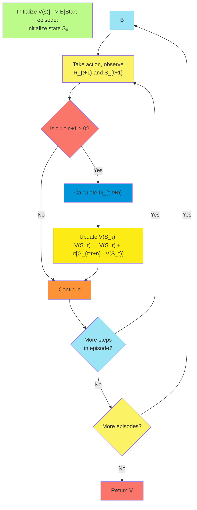

##### Interim and Asymptotic Performance

The choice of step number n significantly impacts both how quickly n-step TD methods learn (interim performance) and the
quality of the final value function (asymptotic performance).

**Interim Performance**: During the early stages of learning, n-step methods with intermediate n values (typically 3-10)
often outperform both one-step TD and Monte Carlo methods:

1. **Learning Speed**: Intermediate n values can accelerate learning by propagating information more efficiently through
   the state space.
2. **Initial Value Sensitivity**: Larger n values reduce dependence on initial value estimates, mitigating the impact of
   poor initialization.
3. **Reward Propagation**: n-step methods propagate reward information more quickly over n states, especially important
   for sparse or delayed rewards.

Empirical studies in various domains show a characteristic "sweet spot" for n, where:

- Values too small (n=1) learn slowly due to step-by-step propagation
- Values too large (n approaching ∞) learn slowly due to high variance
- Intermediate values achieve the fastest initial learning

The optimal n for interim performance depends on several factors:

- Environment stochasticity
- Discount factor
- Episode length
- Quality of initialization
- Step size

**Asymptotic Performance**: After sufficient training, the asymptotic performance is influenced by both the algorithm
and the environment:

1. **Tabular Case**: In the tabular case with appropriate step sizes, all n-step TD methods converge to the true value
   function given sufficient exploration.
2. **Function Approximation**: With function approximation, the asymptotic solution depends on n:
    - Larger n typically achieves better asymptotic performance
    - Monte Carlo methods (n=∞) often find better asymptotic solutions than TD methods
3. **Markov Property**: When the Markov property holds strongly, smaller n values may achieve better asymptotic
   performance.
4. **Partial Observability**: In partially observable environments, larger n values typically perform better
   asymptotically by bridging observation gaps.

The relationship between n and performance creates an important practical consideration: adaptive n values or combined
methods (like TD(λ)) can potentially capture both the fast learning of intermediate n and the good asymptotic
performance of larger n.

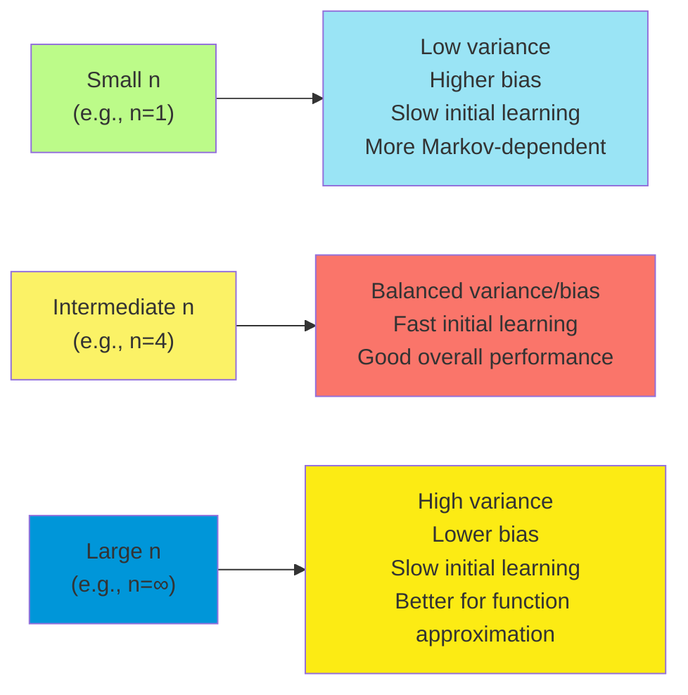

##### Error Reduction Property

A fundamental theoretical property of n-step TD methods is their error reduction capability, which provides insight into
why they can outperform both one-step TD and Monte Carlo methods.

**Error Decomposition**: The error in value function estimates can be decomposed into two components:

1. **Bias**: Systematic error due to bootstrapping from estimated values rather than true values.
2. **Variance**: Random error due to stochasticity in the sampled rewards and transitions.

**Theoretical Error Analysis**: n-step methods enjoy several important error properties:

1. **Bias Reduction with Increasing n**: As n increases, bias generally decreases because:
    - Less weight is placed on the bootstrapped value estimate
    - More actual reward samples are incorporated into the return
2. **Variance Increase with n**: As n increases, variance typically increases because:
    - More random reward samples are included in the return
    - The influence of a single state's value estimate decreases
3. **Total Error Trade-off**: The total error (combining bias and variance) often exhibits a U-shaped curve with respect
   to n:
    - Small n: High bias, low variance
    - Large n: Low bias, high variance
    - Intermediate n: Optimal trade-off minimizing total error

**Formal Error Bounds**: Under certain conditions, n-step TD methods have provable bounds on their error:

For the expected squared difference between the n-step return and the true value:

$$\mathbb{E}[(G_{t:t+n} - v_\pi(S_t))^2] \leq (1-\alpha\gamma^n)^2 \mathbb{E}[(V(S_t) - v_\pi(S_t))^2] + \sigma_R^2 \sum_{i=1}^{n} \alpha^2\gamma^{2(i-1)}$$

where $\sigma_R^2$ represents the variance of rewards.

This bound shows how the error depends on both the current value function error and the cumulative variance from reward
samples.

**Practical Implications**: The error reduction property has several practical implications:

1. **Adaptive n Selection**: Systems can potentially benefit from adapting n based on the current stage of learning.
2. **Environment-Specific Tuning**: The optimal n depends on environment characteristics like reward variance and state
   transition stochasticity.
3. **Combined Methods**: Techniques like TD(λ) leverage this error reduction property by effectively combining returns
   of different n values.
4. **Exploration Interaction**: The error reduction efficiency interacts with the exploration strategy, suggesting joint
   optimization of n and exploration parameters.

Understanding this error reduction property provides theoretical grounding for the empirical success of n-step methods
and guides the development of more advanced techniques that further optimize the bias-variance trade-off.

#### n-step SARSA

##### n-step Returns for Action Values

n-step SARSA extends the n-step concept from state values to action values, providing a more powerful framework for
control problems. This approach defines n-step returns for state-action pairs, looking ahead n steps before
bootstrapping from estimated action values.

The n-step return for action values, starting from state $S_t$ and action $A_t$, is defined as:

$$G_{t:t+n} = R_{t+1} + \gamma R_{t+2} + \gamma^2 R_{t+3} + \ldots + \gamma^{n-1} R_{t+n} + \gamma^n Q(S_{t+n}, A_{t+n})$$

Notably, this return bootstraps from the action value of the state-action pair encountered n steps later. This is why
the method is called n-step SARSA - it uses the entire sequence of State-Action-Reward-State-Action pairs over n steps.

Several important characteristics of this formulation:

1. **Terminal State Handling**: If the episode terminates within n steps (if $t+n \geq T$, where T is the termination
   time), then the return becomes the actual return:
   $$G_{t:t+n} = R_{t+1} + \gamma R_{t+2} + \ldots + \gamma^{T-t-1} R_T$$
2. **Relationship to One-step SARSA**: When n=1, this reduces to standard (one-step) SARSA's target:
   $$G_{t:t+1} = R_{t+1} + \gamma Q(S_{t+1}, A_{t+1})$$
3. **Relationship to Monte Carlo**: As n approaches infinity, this approaches the full Monte Carlo return for action
   values.
4. **Future Actions Requirement**: Computing the n-step return requires knowledge of not just future states and rewards,
   but also the actions actually taken in those states. This makes the method on-policy by definition.

This formulation creates a family of returns that span from one-step bootstrapping to full Monte Carlo returns, allowing
algorithms to balance between immediate bootstrapping and longer-term reward propagation.

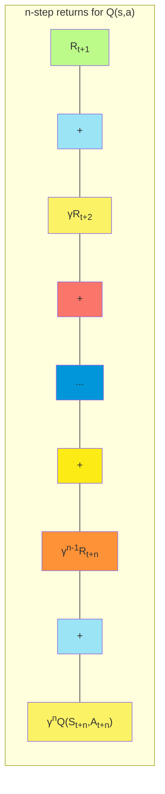

##### n-step Update Rule

The n-step SARSA algorithm uses the n-step return for action values to update action-value estimates, creating a
powerful on-policy control method that can significantly improve learning efficiency.

The core update rule for n-step SARSA is:

$$Q(S_t, A_t) \leftarrow Q(S_t, A_t) + \alpha [G_{t:t+n} - Q(S_t, A_t)]$$

This update moves the current estimate toward the n-step return, with the step size α controlling the learning rate.

The complete n-step SARSA algorithm follows:

1. Initialize $Q(s,a)$ arbitrarily for all states and actions
2. Algorithm parameters: step size $\alpha \in (0, 1]$, number of steps n, small ε > 0
3. For each episode:
    - Initialize and store $S_0$
    - Choose and store $A_0$ ∼ π(·|$S_0$) (e.g., ε-greedy)
    - T ← ∞
    - For t = 0, 1, 2, ...:
        - If t < T:
            - Take action $A_t$, observe and store reward $R_{t+1}$ and state $S_{t+1}$
            - If $S_{t+1}$ is terminal:
                - T ← t+1
            - Else:
                - Choose and store $A_{t+1}$ ∼ π(·|$S_{t+1}$) (e.g., ε-greedy)
        - τ ← t-n+1 (τ is the time whose state-action pair is being updated)
        - If τ ≥ 0:
            - G ← 0
            - For i = τ+1, τ+2, ..., min(τ+n, T):
                - G ← G + $\gamma^{i-τ-1} R_i$
            - If τ+n < T:
                - G ← G + $\gamma^n Q(S_{τ+n}, A_{τ+n})$
            - $Q(S_τ, A_τ) \leftarrow Q(S_τ, A_τ) + \alpha [G - Q(S_τ, A_τ)]$
            - Update policy based on new Q-values (e.g., make it ε-greedy)
    - Until τ = T-1

This algorithm incorporates both prediction (value function learning) and control (policy improvement) within the n-step
framework.

Several implementation considerations are particularly important:

1. **Action Selection**: Unlike n-step TD prediction, SARSA needs to select actions according to the current policy,
   typically using ε-greedy selection.
2. **Storage Requirements**: The algorithm needs to store states, actions, and rewards for n steps, increasing memory
   usage compared to one-step methods.
3. **Policy Improvement Timing**: The policy can be improved after each update or less frequently. More frequent updates
   accelerate learning but increase computation.
4. **Exploration Schedule**: The exploration parameter (ε in ε-greedy) can be decreased over time, starting with more
   exploration and gradually becoming more exploitative.
5. **n Value Selection**: The choice of n impacts both learning speed and final performance, with intermediate values
   often working best.

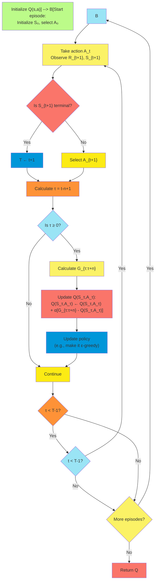

##### Convergence Properties

n-step SARSA possesses important convergence properties that establish its theoretical foundation and explain its
practical effectiveness across various domains.

**Theoretical Convergence Guarantees**: Under appropriate conditions, n-step SARSA converges to the optimal policy with
probability 1. These conditions include:

1. **State-Action Visitation**: All state-action pairs must be visited infinitely often.

2. **Exploration Reduction**: The policy must converge to a greedy policy, typically by gradually reducing the
   exploration parameter ε.

3. Step Size Schedule

    : The sequence of step sizes $\alpha_t$ must satisfy the stochastic approximation conditions:

    - $\sum_{t=1}^{\infty} \alpha_t = \infty$ (to ensure sufficient updates)
    - $\sum_{t=1}^{\infty} \alpha_t^2 < \infty$ (to control variance)

4. **Appropriate n Value**: Any finite n value is permissible for convergence.

**Convergence Rate Analysis**: The rate of convergence depends on several factors:

1. **Step Number (n)**:
    - Larger n values typically result in faster initial convergence due to more efficient reward propagation
    - However, as n increases, the variance in updates also increases, potentially slowing later convergence
2. **Step Size ($\alpha$)**:
    - Larger step sizes accelerate early learning but may cause instability
    - Optimal step sizes often decrease with n due to increased variance in larger n-step returns
3. **Exploration Strategy**:
    - The exploration schedule interacts with n: larger n values benefit more from structured exploration
    - As exploration decreases, smaller n values may become more effective

**Function Approximation Considerations**: With function approximation, convergence becomes more complex:

1. **Linear Function Approximation**: Under on-policy sampling and appropriate step sizes, n-step SARSA with linear
   function approximation converges to a local optimum.
2. **Nonlinear Function Approximation**: No general convergence guarantees exist, but empirical results show n-step
   methods often outperform one-step approaches.
3. **n Value Impact**: Larger n values typically improve stability with function approximation by reducing the influence
   of inaccurate bootstrapped values.

**Practical Convergence Behavior**: In practice, convergence exhibits several characteristic patterns:

1. **Initial Learning Phase**: Intermediate n values (typically 3-10) often show fastest initial learning.
2. **Middle Learning Phase**: The optimal n may decrease as estimates improve and exploitation becomes more important.
3. **Final Convergence Phase**: Smaller n values may achieve more precise final convergence in environments with low
   stochasticity.

These convergence properties make n-step SARSA a robust algorithm that combines theoretical guarantees with practical
efficiency across a wide range of reinforcement learning problems.

##### Performance Characteristics

n-step SARSA exhibits distinct performance characteristics that vary with the step number n, the environment dynamics,
and other algorithm parameters. Understanding these characteristics helps practitioners select appropriate
configurations for specific problems.

**Effect of Step Number (n)**: The choice of n creates a spectrum of behaviors:

1. **Small n (n=1 or 2)**:
    - Lower variance in updates
    - More sensitive to initial value estimates
    - Better in environments with accurate one-step models
    - More computationally efficient
    - Potentially slower reward propagation
2. **Intermediate n (n=3 to 10)**:
    - Balanced bias-variance trade-off
    - Often fastest overall learning in practice
    - Good compromise between computational efficiency and performance
    - Effective reward propagation without excessive variance
3. **Large n (n > 10)**:
    - Lower bias from bootstrapping
    - Higher variance in updates
    - Better in environments with poor models or partial observability
    - Higher computational and memory requirements
    - More robust to initial value function errors

**Environmental Factors**: n-step SARSA's performance is significantly influenced by environment characteristics:

1. **Reward Sparsity**:
    - Sparse rewards favor larger n values to propagate information more efficiently
    - Dense rewards may work better with smaller n values to reduce variance
2. **Stochasticity**:
    - Highly stochastic environments typically benefit from smaller n to control variance
    - More deterministic environments allow larger n to reduce bias
3. **Episode Length**:
    - Longer episodes may benefit from relatively smaller n values (as a proportion of episode length)
    - Very short episodes may work best with n approaching the episode length
4. **Markov Property**:
    - Strongly Markovian environments work well with smaller n
    - Partially observable or non-Markovian environments benefit from larger n

**Empirical Performance Patterns**: Across various domains, several consistent patterns emerge:

1. **Learning Curve Characteristics**:
    - Intermediate n values typically show steeper initial learning curves
    - Larger n values may achieve better asymptotic performance in some environments
    - Learning curve variance increases with n
2. **Exploration Interaction**:
    - Larger n values can compensate for limited exploration by propagating rewards more effectively
    - Structured exploration methods pair particularly well with larger n values
3. **Parameter Sensitivity**:
    - Sensitivity to step size decreases with larger n
    - Larger n values require more careful exploration scheduling
4. **Computational Efficiency**:
    - Time per update increases approximately linearly with n
    - The optimal n in terms of wall-clock time to convergence is often smaller than the optimal n in terms of sample
      efficiency

These performance characteristics make n-step SARSA a versatile algorithm that can be tuned to match specific
requirements across a wide range of reinforcement learning applications.

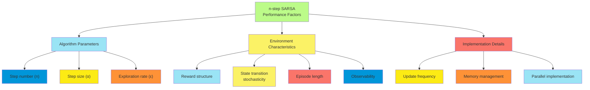

#### n-step Off-policy Learning

##### Importance Sampling

Importance sampling is a fundamental statistical technique that enables learning about one distribution while sampling
from another. In reinforcement learning, it allows off-policy learning - updating value estimates for a target policy
while following a different behavior policy.

**Basic Concept**: Importance sampling corrects for the difference between two distributions by weighting samples by the
ratio of their probabilities under the target and behavior distributions:

$$\mathbb{E}*{x \sim p}[f(x)] = \mathbb{E}*{x \sim q}\left[\frac{p(x)}{q(x)}f(x)\right]$$

where:

- $p$ is the target distribution
- $q$ is the behavior distribution
- $\frac{p(x)}{q(x)}$ is the importance sampling ratio

**Application to Reinforcement Learning**: In reinforcement learning, importance sampling allows us to estimate expected
returns under a target policy π using data collected from a behavior policy b:

1. **Policy Probability Ratio**: For each action taken following policy b, we compute how much more or less likely the
   action would be under policy π.
2. **Trajectory Weighting**: For multi-step returns, we compute the product of these ratios over all relevant steps.
3. **Return Correction**: We multiply the observed return by this ratio product to get an unbiased estimate of the
   expected return under policy π.

**Key Properties**: Importance sampling in reinforcement learning has several important properties:

1. **Unbiased Estimation**: With ordinary importance sampling, the expected value of the corrected return equals the
   true expected return under the target policy.
2. **Variance Issues**: The variance can be extremely high, particularly for long trajectories, as the variance of the
   product of ratios grows exponentially with trajectory length.
3. **Coverage Requirement**: The behavior policy must give non-zero probability to any action that might be taken under
   the target policy: $\pi(a|s) > 0 \implies b(a|s) > 0$
4. **Deterministic Target Policies**: When the target policy is deterministic, the importance sampling ratio becomes
   zero for any trajectory that deviates from the target policy's actions.

Importance sampling provides the mathematical foundation for off-policy n-step methods, allowing them to learn about one
policy while following another, but requires careful implementation to manage variance issues.

##### n-step Importance Sampling Ratio

The n-step importance sampling ratio extends the importance sampling concept to n-step returns, enabling off-policy
learning with multi-step bootstrapping. This ratio corrects for the difference between the target policy π and the
behavior policy b over multiple time steps.

For an n-step return starting at time t, the importance sampling ratio is defined as:

$$\rho_{t:t+n-1} = \prod_{i=t}^{t+n-1} \frac{\pi(A_i|S_i)}{b(A_i|S_i)}$$

This represents the relative probability of the action sequence $A_t, A_{t+1}, ..., A_{t+n-1}$ under the target policy
compared to the behavior policy.

**Key Characteristics**:

1. **Multiplicative Structure**: The ratio is a product of per-step ratios, meaning it grows or shrinks exponentially
   with the number of steps.
2. **Trajectory Specificity**: The ratio is specific to the particular sequence of states and actions experienced,
   making each sample unique.
3. **Step Number Impact**: As n increases, the variance of the ratio typically increases exponentially, creating
   practical limitations for large n.
4. **Deterministic Target Policy**: For a deterministic target policy, the ratio becomes:
    - 0 if any action in the sequence deviates from the target policy
    - $\prod_{i=t}^{t+n-1} \frac{1}{b(A_i|S_i)}$ if all actions match the target policy
5. **Variance Growth**: The variance of the ratio grows approximately as:
   $$\text{Var}[\rho_{t:t+n-1}] \approx \mathbb{E}[\rho_{t:t+n-1}^2] - 1$$ which increases exponentially with n when the
   policies differ significantly.

**Practical Considerations**: Several techniques can help manage the challenges of n-step importance sampling ratios:

1. **Ratio Truncation**: Limiting the maximum value of the ratio to reduce variance.
2. **Per-decision Importance Sampling**: Applying ratios to individual reward terms rather than the entire return.
3. **Weighted Importance Sampling**: Using the ratios as weights in a weighted average rather than direct multipliers.
4. **Adaptive n Values**: Using smaller n when the policies differ significantly to control ratio variance.
5. **Log-Domain Calculation**: Computing the logarithm of the ratio and summing rather than multiplying raw ratios, to
   prevent numerical issues.

The n-step importance sampling ratio is a critical component of off-policy n-step methods, enabling them to learn from
data generated by exploratory policies while estimating values for target policies.

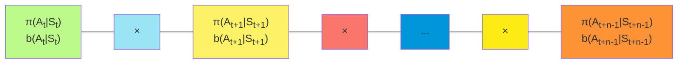

##### Off-policy Returns

Off-policy n-step returns combine the n-step return concept with importance sampling to enable learning about one policy
while following another. These returns are crucial for algorithms that need to learn optimal policies while maintaining
exploration or learning from demonstrations.

For n-step state values, the off-policy return is defined as:

$$G_{t:t+n}^{\pi} = \rho_{t:t+n-1} \left( R_{t+1} + \gamma R_{t+2} + \ldots + \gamma^{n-1} R_{t+n} + \gamma^n V(S_{t+n}) \right)$$

Where $\rho_{t:t+n-1}$ is the importance sampling ratio for steps t through t+n-1.

For n-step action values, the off-policy return has a subtle but important difference:

$$G_{t:t+n}^{\pi} = R_{t+1} + \gamma \rho_{t+1:t+n-1} \left( R_{t+2} + \gamma R_{t+3} + \ldots + \gamma^{n-2} R_{t+n} + \gamma^{n-1} Q(S_{t+n}, A_{t+n}) \right)$$

Notice that the immediate reward $R_{t+1}$ is not weighted by the importance sampling ratio, since the first action
$A_t$ is given and not dependent on either policy.

Several important properties of these off-policy returns:

1. **Unbiased Estimation**: These returns provide unbiased estimates of the expected return under the target policy when
   using ordinary importance sampling.
2. **Variance Characteristics**: The variance increases with:
    - The difference between target and behavior policies
    - The number of steps n
    - The stochasticity of the environment
3. **Zero Returns**: For deterministic target policies, returns become zero whenever any action in the sequence deviates
   from the target policy.
4. **Terminal State Handling**: If the episode terminates within n steps, the return becomes the importance-sampled
   actual return until termination:
   $$G_{t:t+n}^{\pi} = \rho_{t:T-1} \left( R_{t+1} + \gamma R_{t+2} + \ldots + \gamma^{T-t-1} R_T \right) \text{ if } t+n \geq T$$
5. **Recursive Formulation**: Off-policy returns can be expressed recursively:
   $$G_{t:t+n}^{\pi} = R_{t+1} + \gamma \rho_{t+1} G_{t+1:t+n}^{\pi}$$

These off-policy returns enable n-step methods to learn from exploratory or demonstration data while estimating values
for potentially optimal target policies.

##### Algorithm Implementation

Implementing off-policy n-step learning requires careful handling of importance sampling ratios and various algorithmic
considerations to manage the inherent challenges of off-policy learning with multi-step returns.

**n-step Off-policy SARSA Algorithm**:

1. Initialize $Q(s,a)$ arbitrarily for all states and actions
2. Initialize target policy π (typically ε-greedy with small ε)
3. Initialize behavior policy b (typically ε-greedy with larger ε)
4. Algorithm parameters: step size $\alpha \in (0, 1]$, number of steps n
5. For each episode:
    - Initialize and store $S_0$
    - Choose and store $A_0$ ~ b(·|$S_0$)
    - Store initial probability ratio $\rho_0 = \frac{\pi(A_0|S_0)}{b(A_0|S_0)}$
    - T ← ∞
    - For t = 0, 1, 2, ...:
        - If t < T:
            - Take action $A_t$, observe and store reward $R_{t+1}$ and state $S_{t+1}$
            - If $S_{t+1}$ is terminal:
                - T ← t+1
            - Else:
                - Choose and store $A_{t+1}$ ~ b(·|$S_{t+1}$)
                - Store probability ratio $\rho_{t+1} = \frac{\pi(A_{t+1}|S_{t+1})}{b(A_{t+1}|S_{t+1})}$
        - τ ← t-n+1 (τ is the time whose state-action pair is being updated)
        - If τ ≥ 0:
            - ρ ← $\prod_{i=τ}^{\min(\tau+n-1,T-1)} \rho_i$ (the n-step importance sampling ratio)
            - G ← 0
            - For i = τ+1, τ+2, ..., min(τ+n, T):
                - G ← G + $\gamma^{i-τ-1} R_i$
            - If τ+n < T:
                - G ← G + $\gamma^n Q(S_{\tau+n}, A_{\tau+n})$
            - $Q(S_τ, A_τ) \leftarrow Q(S_τ, A_τ) + \alpha \rho [G - Q(S_τ, A_τ)]$
            - Update target policy π based on new Q-values (typically make it ε-greedy)
    - Until τ = T-1

**Implementation Considerations**:

1. **Numerical Stability**:
    - Use logarithms to compute importance sampling ratios for long sequences
    - Implement ratio truncation to limit extreme values
    - Consider weighted importance sampling variants for more stable learning
2. **Memory Management**:
    - Store states, actions, rewards, and per-step ratios efficiently
    - Implement circular buffers for continuous learning
    - Prune unnecessary data when ratios become zero (with deterministic target policies)
3. **Computational Efficiency**:
    - Compute ratios incrementally to avoid redundant calculations
    - Pre-compute policy probabilities when possible
    - Consider parallel processing for multiple n-step returns
4. **Variance Reduction Techniques**:
    - Implement adaptive n selection based on observed ratio variance
    - Use control variates to reduce variance (covered in the next section)
    - Consider TD(λ) implementations that effectively combine multiple n values
5. **Policy Updates**:
    - Update the target policy after each episode or less frequently
    - Consider keeping the behavior policy fixed during early learning
    - Gradually bring behavior policy closer to target policy as learning progresses

These implementation details significantly impact the performance of off-policy n-step methods, particularly in
environments with long episodes or significant differences between the target and behavior policies.

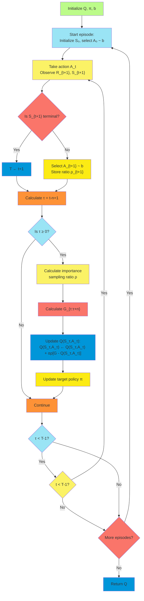

#### Per-decision Methods with Control Variates

##### Variance Reduction Techniques

The high variance of importance sampling ratios in off-policy n-step methods creates a significant challenge.
Per-decision methods with control variates address this challenge by applying importance sampling more precisely and
introducing additional terms that reduce variance while maintaining unbiased estimates.

**Sources of Variance in Off-policy Learning**: Several factors contribute to the high variance in standard off-policy
n-step returns:

1. **Multiplicative Ratios**: The product of importance sampling ratios grows or shrinks exponentially with trajectory
   length.
2. **Policy Differences**: Greater differences between target and behavior policies lead to more extreme ratios.
3. **Unnecessary Applications**: Standard methods apply importance sampling to all rewards, even when unnecessary.
4. **State Transition Variance**: Environment stochasticity adds additional variance beyond policy differences.

**Per-decision Importance Sampling**: This technique applies importance sampling ratios more precisely by weighting each
reward with only the ratios from preceding actions that influenced that reward:

$$G_t^{\pi} = R_{t+1} + \gamma \rho_{t+1} R_{t+2} + \gamma^2 \rho_{t+1}\rho_{t+2} R_{t+3} + \ldots + \gamma^{n-1} \rho_{t+1}\rho_{t+2}\ldots\rho_{t+n-1} R_{t+n} + \gamma^n \rho_{t+1}\rho_{t+2}\ldots\rho_{t+n-1} V(S_{t+n})$$

This approach has several advantages:

- Each reward is weighted only by the ratios relevant to it
- Zero ratios only affect subsequent rewards, not previous ones
- The expected value remains unbiased

**Control Variates**: Control variates are a statistical technique that reduces variance by subtracting a correlated
term with known expected value:

1. **Basic Principle**: If we have a quantity X we want to estimate, and another quantity Y with known expectation, we
   can form a new estimator: $$Z = X - c(Y - \mathbb{E}[Y])$$ where c is a coefficient chosen to minimize variance.
2. **Application to Off-policy Learning**: We introduce terms based on known properties of value functions under the
   current policy estimates:
    - Expected values under the current approximation
    - Differences between observed and expected outcomes
    - Products of these differences with importance sampling ratios
3. **Theoretical Advantage**: The optimal control variate can reduce variance to a level proportional to how closely the
   approximate value function matches the true value function.

**Combined Approach**: Per-decision methods with control variates combine both techniques:

1. Apply importance sampling per-decision rather than to entire returns
2. Introduce control variate terms that correlate with the importance sampling terms
3. Carefully balance the control variate coefficient to minimize variance

This approach can dramatically reduce variance while maintaining unbiased estimates, making off-policy n-step learning
more practical in many environments.

##### Technical Implementation

Implementing per-decision methods with control variates requires careful formulation of the update rules and efficient
computation of the various terms involved. This section details the technical aspects of implementation that make these
methods practical.

**Per-decision Off-policy Return Formulation**: The per-decision importance sampling return for n-step updates can be
expressed as:

$$G_{t:t+n}^{\pi} = R_{t+1} + \gamma \rho_{t+1} \left( R_{t+2} + \gamma \rho_{t+2} \left( \ldots + \gamma \rho_{t+n-1} \left( R_{t+n} + \gamma V(S_{t+n}) \right) \right) \right)$$

For action values, the first reward is not importance-sampled:

$$G_{t:t+n}^{\pi} = R_{t+1} + \gamma \rho_{t+1} \left( R_{t+2} + \gamma \rho_{t+2} \left( \ldots + \gamma \rho_{t+n-1} \left( R_{t+n} + \gamma Q(S_{t+n}, A_{t+n}) \right) \right) \right)$$

**Control Variate Terms**: Control variates for off-policy n-step methods typically take the form:

$$CV_t = \sum_{k=1}^{n-1} \gamma^k \left( \prod_{i=1}^{k} \rho_{t+i} - 1 \right) \mathbb{E}*b[R*{t+k+1} + \gamma V(S_{t+k+1}) | S_{t+k}]$$

Where $\mathbb{E}*b[R*{t+k+1} + \gamma V(S_{t+k+1}) | S_{t+k}]$ is approximated by $V(S_{t+k})$ under the current
estimate.

**Combined Update Rule**: The update rule combining per-decision importance sampling with control variates is:

$$V(S_t) \leftarrow V(S_t) + \alpha [G_{t:t+n}^{\pi} - CV_t - V(S_t)]$$

For action values:

$$Q(S_t, A_t) \leftarrow Q(S_t, A_t) + \alpha [G_{t:t+n}^{\pi} - CV_t - Q(S_t, A_t)]$$

**Efficient Implementation Algorithm**: An efficient implementation requires careful tracking of the cumulative products
of importance sampling ratios:

1. Initialize $Q(s,a)$ or $V(s)$ arbitrarily for all states and actions
2. For each episode:
    - Initialize state $S_0$ and select $A_0$ ~ b(·|$S_0$)
    - Initialize cumulative ratio: ρ_cum ← 1
    - T ← ∞
    - For t = 0, 1, 2, ...:
        - If t < T:
            - Take action $A_t$, observe reward $R_{t+1}$ and state $S_{t+1}$
            - If $S_{t+1}$ is terminal: T ← t+1
            - Else: Select $A_{t+1}$ ~ b(·|$S_{t+1}$) and compute ρ\_{t+1}
        - τ ← t-n+1
        - If τ ≥ 0:
            - Initialize G ← 0, CV ← 0
            - ρ_cum ← 1
            - For i = τ+1, τ+2, ..., min(τ+n, T):
                - G ← G + γ^(i-τ-1) · ρ_cum · R_i
                - If i < min(τ+n, T):
                    - CV ← CV + γ^(i-τ) · (ρ_cum - 1) · V(S_i)
                    - ρ_cum ← ρ_cum · ρ_i
            - If τ+n < T: G ← G + γ^n · ρ*cum · V(S*{τ+n})
            - V(S*τ) ← V(S*τ) + α[G - CV - V(S_τ)]
    - Until τ = T-1

**Numerical Considerations**: Several numerical techniques improve stability:

1. **Log-domain Computation**: Calculate logarithms of ratios and use exponentiation only when needed:

    ```
    log_ρ_cum = 0
    for each step:
        log_ρ_cum += log(ρ_i)
        ρ_cum = exp(log_ρ_cum)
    ```

2. **Ratio Truncation**: Implement maximum and minimum bounds on ratios to prevent numerical issues:

    ```
    ρ = min(max(ρ, MIN_RATIO), MAX_RATIO)
    ```

3. **Adaptive Control Variate Coefficient**: Adjust the coefficient based on observed correlations:

    ```
    c = cov(G, CV) / var(CV)  # Optimal coefficient
    ```

These technical implementation details enable per-decision methods with control variates to achieve substantially lower
variance while maintaining unbiased estimates, making off-policy n-step learning more effective in practice.

##### Efficiency Considerations

Implementing per-decision methods with control variates introduces additional computational complexity and memory
requirements compared to standard n-step methods. Careful consideration of efficiency aspects is crucial for practical
applications.

**Computational Complexity**: The additional computations in per-decision methods with control variates impact different
aspects of the algorithm:

1. **Time Complexity per Update**:
    - Basic n-step update: O(n)
    - Per-decision importance sampling: O(n)
    - Control variate computation: O(n)
    - Combined approach: O(n) (same asymptotic complexity, but with larger constant factors)
2. **Additional Calculations**:
    - Progressive calculation of importance sampling ratio products
    - Control variate terms for each reward
    - Expected value approximations
3. **Parallelization Opportunities**:
    - Control variate terms can be computed in parallel
    - Multiple n-step returns can be processed simultaneously
    - Batch processing can amortize computational overhead

**Memory Requirements**: The memory footprint is affected by several factors:

1. **Storage Components**:
    - States, actions, and rewards for n steps (same as standard n-step)
    - Per-step importance sampling ratios (n values)
    - Cumulative ratio products (up to n values)
    - Control variate terms (up to n values)
2. **Memory Optimization Techniques**:
    - Incremental computation of ratio products to avoid storing all intermediate values
    - Circular buffers to efficiently manage experience storage
    - Sparse representation when many ratios are near zero or one

**Sample Efficiency**: The primary benefit of these methods is improved sample efficiency:

1. **Variance Reduction**: Lower variance for the same number of samples means more reliable learning
2. **Effective n**: Enables larger n values without excessive variance, improving reward propagation
3. **Policy Difference Tolerance**: Allows greater differences between target and behavior policies

**Implementation Trade-offs**: Several trade-offs should be considered:

1. **Computation vs. Sample Efficiency**:
    - The additional computation may be worthwhile when samples are expensive
    - In simulation environments with cheap samples, simpler methods might be preferred
2. **Memory vs. Computation**:
    - Storing intermediate values reduces computation but increases memory usage
    - Recomputing values saves memory but increases computation
3. **Precision vs. Speed**:
    - Higher numerical precision improves stability but may slow computation
    - For many applications, single precision floating point is sufficient
4. **Implementation Complexity**:
    - The increased complexity may introduce bugs or optimization challenges
    - Well-tested library implementations can mitigate this concern

**Practical Efficiency Tips**: Several practical approaches improve efficiency:

1. **Adaptive n Values**: Use larger n when the policies are similar and smaller n when they differ substantially
2. **Selective Application**: Apply control variates only when the importance sampling ratios exceed certain thresholds
3. **Hybrid Methods**: Combine with other variance reduction techniques like weighted importance sampling
4. **Batch Processing**: Process multiple transitions simultaneously to amortize overhead
5. **GPU Acceleration**: Leverage parallel processing for matrix operations

These efficiency considerations help practitioners implement per-decision methods with control variates in a way that
maximizes their benefits while managing their computational costs.

#### Off-policy Learning Without Importance Sampling

##### Tree Backup Algorithm

The Tree Backup algorithm represents an elegant approach to off-policy learning that completely avoids the use of
importance sampling ratios, eliminating their associated variance issues. Instead, it uses action-value estimates and
target policy probabilities to correctly incorporate information from all possible next actions.

**Core Concept**: Rather than using a single sample of the next action (as in SARSA) or the maximum next action (as in
Q-learning), the Tree Backup algorithm considers all possible next actions weighted by their probability under the
target policy. This creates a "tree" of backup paths, giving the algorithm its name.

**n-step Tree Backup Return**: The n-step Tree Backup return for action values is defined recursively:

$$G_{t:t+n} = R_{t+1} + \gamma \sum_{a \neq A_{t+1}} \pi(a|S_{t+1}) Q(S_{t+1}, a) + \gamma \pi(A_{t+1}|S_{t+1}) G_{t+1:t+n}$$

For n=1, this reduces to:

$$G_{t:t+1} = R_{t+1} + \gamma \sum_a \pi(a|S_{t+1}) Q(S_{t+1}, a)$$

which is the expected SARSA target.

The full definition for arbitrary n can be written as:

$$G_{t:t+n} = R_{t+1} + \gamma \sum_{a \neq A_{t+1}} \pi(a|S_{t+1}) Q(S_{t+1}, a) + \gamma \pi(A_{t+1}|S_{t+1}) \left( R_{t+2} + \gamma \sum_{a \neq A_{t+2}} \pi(a|S_{t+2}) Q(S_{t+2}, a) + \ldots \right)$$

**Key Properties**: The Tree Backup algorithm has several distinctive properties:

1. **No Importance Sampling**: It completely avoids importance sampling ratios, eliminating their variance issues.
2. **Full Expectation Calculation**: It computes the expected value over all possible next actions under the target
   policy.
3. **On-policy Consistency**: When the behavior and target policies are identical, it becomes equivalent to Expected
   SARSA.
4. **Off-policy Learning**: It can learn about any target policy, including the greedy policy, while following an
   exploratory behavior policy.
5. **Sample Independence**: The updates are independent of the particular actions taken by the behavior policy (beyond
   the current action).

The Tree Backup algorithm provides a theoretically sound approach to off-policy learning without the high variance
issues associated with importance sampling, making it particularly valuable for problems with long episodes or
significant differences between target and behavior policies.

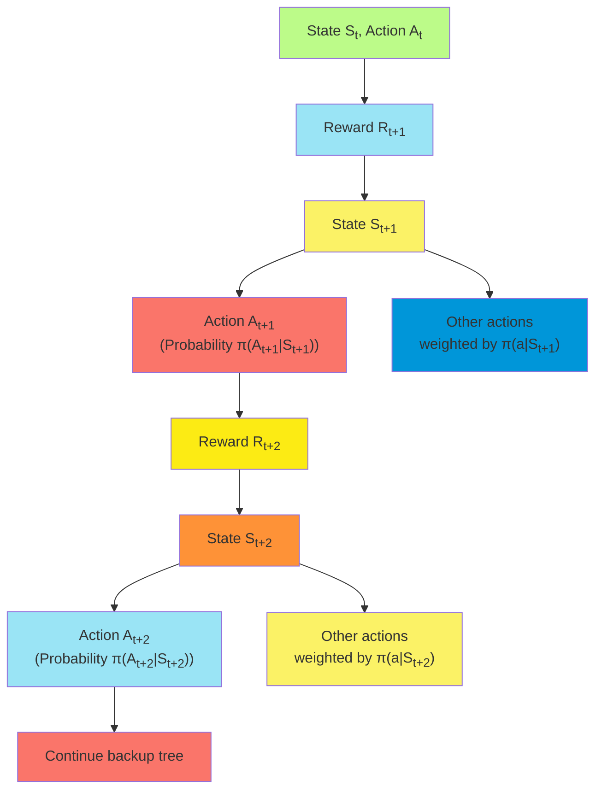

##### Algorithm Description

The Tree Backup algorithm provides a practical off-policy learning method that avoids importance sampling. This section
details the complete algorithm and its implementation.

**n-step Tree Backup Algorithm**:

1. Initialize $Q(s,a)$ arbitrarily for all states and actions
2. Algorithm parameters: step size $\alpha \in (0, 1]$, number of steps n
3. Define target policy π (typically a greedy or ε-greedy policy with respect to Q)
4. For each episode:
    - Initialize state $S_0$
    - Choose action $A_0$ using any behavior policy b (e.g., ε-greedy with larger ε)
    - T ← ∞
    - For t = 0, 1, 2, ...:
        - If t < T:
            - Take action $A_t$, observe reward $R_{t+1}$ and state $S_{t+1}$
            - If $S_{t+1}$ is terminal:
                - T ← t+1
                - Store $G_{t:t+1} \leftarrow R_{t+1}$
            - Else:
                - Store $E_{t+1} \leftarrow \sum_a \pi(a|S_{t+1}) Q(S_{t+1}, a)$ (expected value)
                - Choose action $A_{t+1}$ using behavior policy b
        - τ ← t-n+1 (time whose state-action pair is being updated)
        - If τ ≥ 0:
            - If τ+1 ≥ T:
                - $G_{\tau:\tau+1} \leftarrow R_{\tau+1}$
            - Else:
                - $G_{\tau:\tau+1} \leftarrow R_{\tau+1} + \gamma E_{\tau+1}$
            - For k = τ+1 to min(τ+n-1, T-1):
                - $G_{\tau:k+1} \leftarrow R_{\tau+1} + \gamma \sum_{a \neq A_{\tau+1}} \pi(a|S_{\tau+1}) Q(S_{\tau+1}, a) + \gamma \pi(A_{\tau+1}|S_{\tau+1}) G_{\tau+1:k+1}$
            - $Q(S_\tau, A_\tau) \leftarrow Q(S_\tau, A_\tau) + \alpha [G_{\tau:\tau+n} - Q(S_\tau, A_\tau)]$
            - Update target policy π if needed (e.g., make it ε-greedy with respect to updated Q)
    - Until τ = T-1

**Implementation Details**:

1. **Recursive Calculation**: The Tree Backup returns are calculated recursively, working backward from the end of the
   n-step sequence.
2. **Expected Values**: For each state, we calculate the expected value under the target policy:
   $E_t = \sum_a \pi(a|S_t) Q(S_t, a)$
3. **Handling Terminal States**: If the episode terminates within n steps, the return calculations are truncated
   appropriately.
4. **Efficient Implementation**: Several optimizations improve efficiency:
    - Store intermediate results to avoid redundant calculations
    - Calculate expected values once per state
    - Implement incremental updates of the form:
      $G_{\tau:k+1} = R_{\tau+1} + \gamma [(1-\pi(A_{\tau+1}|S_{\tau+1}))E_{\tau+1} + \pi(A_{\tau+1}|S_{\tau+1})G_{\tau+1:k+1}]$
5. **Target Policy Updates**: The target policy can be updated after each episode or more frequently, typically making
   it greedy or ε-greedy with respect to the current Q-values.
6. **Storage Requirements**: The algorithm needs to store:
    - States, actions, and rewards for n steps
    - Expected values for each state
    - Intermediate G values for recursive calculation

This implementation of the n-step Tree Backup algorithm provides a complete off-policy learning method that avoids the
variance issues associated with importance sampling while maintaining the ability to learn about any target policy.

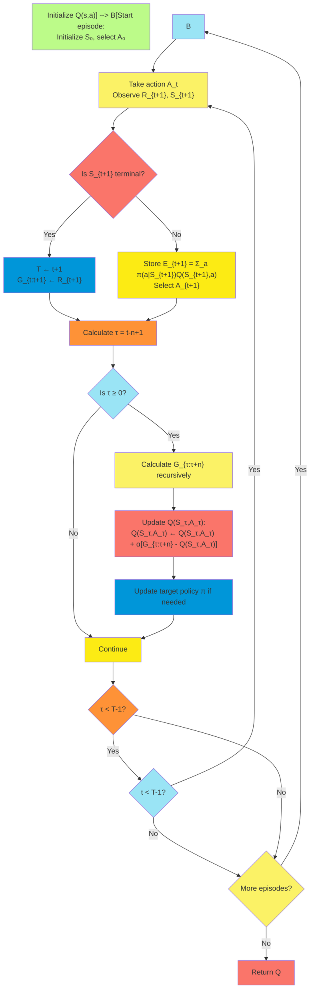

##### Theoretical Properties

The Tree Backup algorithm possesses important theoretical properties that establish its validity as an off-policy
learning method and explain its practical advantages over importance sampling approaches.

**Unbiased Estimation**: The Tree Backup algorithm provides unbiased estimates of action values under the target policy:

$$\mathbb{E}[G_{t:t+n}] = q_\pi(S_t, A_t)$$

as the number of episodes approaches infinity. This unbiased property holds regardless of the behavior policy used to
generate experiences, as long as all relevant states are visited.

**Convergence Guarantees**:

Under standard reinforcement learning conditions, the Tree Backup algorithm converges to the optimal action-value
function with probability 1:

1. **Required Conditions**:
    - All state-action pairs are visited infinitely often
    - Step sizes satisfy the stochastic approximation conditions
    - Rewards are bounded
    - The MDP is finite and satisfies the Markov property
2. **Convergence Rate**: The Tree Backup algorithm typically converges faster than importance sampling methods,
   especially for large n values, due to its lower variance.

**Variance Properties**: One of the most significant theoretical advantages of the Tree Backup algorithm is its variance
characteristics:

1. **No Importance Sampling Variance**: By avoiding importance sampling ratios, the Tree Backup algorithm eliminates
   their exponentially growing variance.
2. **Variance Bound**: The variance of Tree Backup returns is bounded by the variance of rewards and the accuracy of the
   current value estimates, not by the differences between policies.
3. **Variance Analysis**: For n-step returns, the variance can be expressed as:
   $$\text{Var}[G_{t:t+n}] \leq c_1 \sum_{i=1}^n \gamma^{2i} \text{Var}[R_{t+i}] + c_2 \gamma^{2n} \text{Var}[Q(S_{t+n}, A_{t+n})]$$
   where $c_1$ and $c_2$ are constants dependent on the target policy.

**Relationship to Other Algorithms**: The Tree Backup algorithm has important theoretical connections to other methods:

1. **Expected SARSA**: The Tree Backup algorithm with n=1 is equivalent to Expected SARSA.
2. **Q-learning**: When the target policy is greedy, the Tree Backup algorithm with n=1 becomes equivalent to
   Q-learning.
3. **Dynamic Programming**: The Tree Backup updates can be viewed as sample-based approximations of dynamic
   programming's expected updates.
4. **TD(λ)**: The Tree Backup algorithm can be generalized to a λ-return form that combines tree backups of different
   lengths.

**Bias-Variance Trade-off**: The Tree Backup algorithm presents a different bias-variance trade-off compared to
importance sampling methods:

1. **Bias Sources**: The bias primarily comes from inaccurate action-value estimates used in the expected value
   calculations.
2. **Variance Sources**: The variance primarily comes from stochastic rewards and transitions, not from importance
   sampling ratios.
3. **n-Value Effects**: Larger n values reduce bias from bootstrapping but increase the variance due to the deeper
   backup tree.
4. **Optimality**: The optimal n value typically depends on the accuracy of the current value estimates and the
   stochasticity of the environment.

These theoretical properties make the Tree Backup algorithm particularly valuable for off-policy learning in
environments with long episodes or significant differences between target and behavior policies, where importance
sampling methods would suffer from excessive variance.

##### Empirical Performance

Empirical studies of the Tree Backup algorithm reveal its practical advantages and limitations across various
reinforcement learning domains. These findings help guide algorithm selection and parameter tuning for specific
applications.

**Comparison with Importance Sampling Methods**: Empirical comparisons consistently show distinctive performance
differences:

1. **Learning Stability**: Tree Backup exhibits significantly more stable learning curves than importance sampling
   methods, particularly for larger n values and greater policy differences.
2. **Sample Efficiency**: For the same number of environment interactions, Tree Backup typically achieves better
   performance, especially in environments with long episodes.
3. **Policy Difference Tolerance**: Tree Backup maintains good performance even with substantial differences between
   target and behavior policies, where importance sampling methods often fail.
4. **n-Value Sensitivity**: Tree Backup works well with larger n values compared to importance sampling methods, which
   typically require smaller n values to control variance.

**Environment-Specific Performance**: The Tree Backup algorithm's performance varies across different environment types:

1. **Discrete Control Problems**:
    - Grid worlds: Excellent performance, especially with intermediate n values (4-8)
    - Cart-pole: Strong performance with smaller n values (2-4)
    - Mountain car: Good performance with target policies more exploratory than purely greedy
2. **Continuous Control Domains**:
    - Requires function approximation adaptations
    - Shows good stability compared to importance sampling alternatives
    - Benefits from smaller n values due to the increased dimensionality
3. **Partially Observable Environments**:
    - Performs better than expected given its full Markov assumption
    - Benefits from larger n values that span observation ambiguities
    - May outperform on-policy methods due to better expectation calculations

**Parameter Sensitivity**: Empirical studies reveal how the Tree Backup algorithm's performance depends on key
parameters:

1. **Step Number (n)**:
    - Small n (1-2): Good for environments with accurate value estimates
    - Intermediate n (3-8): Optimal for most problems, balancing bias and variance
    - Large n (>8): Beneficial primarily in environments with poor initial estimates or partial observability
2. **Step Size (α)**:
    - Less sensitive to step size than importance sampling methods
    - Can use larger step sizes without divergence
    - Optimal step size decreases with increasing n
3. **Target Policy**:
    - Nearly-deterministic target policies work well with larger n values
    - More stochastic target policies benefit from smaller n values
    - ε-greedy target policies with small ε (0.01-0.1) often work best

**Practical Findings**: Several practical insights emerge from empirical evaluations:

1. **Computational Efficiency**: Despite higher per-step computation, Tree Backup often converges in fewer steps,
   leading to better wall-clock performance.
2. **Robustness**: The algorithm demonstrates good robustness to hyperparameter settings compared to importance sampling
   alternatives.
3. **Function Approximation**: When combined with function approximation, Tree Backup maintains better stability than
   importance sampling methods.
4. **Exploration Balance**: The algorithm performs best when the behavior policy provides good coverage while not
   deviating too far from the target policy.

These empirical findings establish the Tree Backup algorithm as a practical and effective approach to off-policy
learning, particularly valuable in scenarios where importance sampling methods struggle due to high variance.

#### Unifying Algorithm: n-step Q(σ)

##### Combining Sampling and Expectation

The n-step Q(σ) algorithm represents a powerful unification of different off-policy learning approaches, creating a
continuous spectrum between pure sampling (as in importance sampling methods) and pure expectation (as in Tree Backup).
This flexibility allows practitioners to find the optimal balance for specific problems.

**Core Concept**: The n-step Q(σ) algorithm introduces a sampling parameter σ that determines the degree of sampling
versus expectation at each step:

- σ = 1: Full sampling of actual actions (requiring importance sampling)
- σ = 0: Full expectation over all actions (as in Tree Backup)
- 0 < σ < 1: A weighted combination of sampling and expectation

This creates a unified framework where various n-step algorithms become special cases of n-step Q(σ).

**Unified Return Definition**: The n-step Q(σ) return is defined recursively:

$$G_{t:t+n}^{Q(\sigma)} = R_{t+1} + \gamma [(1-\sigma_{t+1}) \sum_a \pi(a|S_{t+1}) Q(S_{t+1}, a) + \sigma_{t+1} \rho_{t+1} G_{t+1:t+n}^{Q(\sigma)}]$$

where:

- $\sigma_t \in [0,1]$ is the sampling parameter at time t
- $\rho_t = \frac{\pi(A_t|S_t)}{b(A_t|S_t)}$ is the importance sampling ratio
- The recursion terminates with $G_{t+n-1:t+n}^{Q(\sigma)} = R_{t+n} + \gamma \sum_a \pi(a|S_{t+n}) Q(S_{t+n}, a)$

**Special Cases**: This unified formulation encompasses several important algorithms:

1. **n-step SARSA with Importance Sampling** (σ = 1 for all steps):
   $$G_{t:t+n} = R_{t+1} + \gamma \rho_{t+1}[R_{t+2} + \gamma \rho_{t+2}[... + \gamma \rho_{t+n-1}[R_{t+n} + \gamma Q(S_{t+n}, A_{t+n})]...]]$$
2. **n-step Tree Backup** (σ = 0 for all steps):
   $$G_{t:t+n} = R_{t+1} + \gamma[\sum_{a \neq A_{t+1}} \pi(a|S_{t+1})Q(S_{t+1},a) + \pi(A_{t+1}|S_{t+1})G_{t+1:t+n}]$$
3. **n-step Expected SARSA** (n = 1, any σ): $$G_{t:t+1} = R_{t+1} + \gamma \sum_a \pi(a|S_{t+1})Q(S_{t+1},a)$$
4. **Intermediate Methods**: Setting σ between 0 and 1 creates a spectrum of algorithms with different
   sampling-expectation balances.

**Adaptive Sigma**: Beyond using fixed σ values, the framework allows for adaptive approaches:

1. **State-dependent σ**: Adjust σ based on state characteristics or uncertainty
2. **Policy-gap dependent σ**: Use larger σ when behavior and target policies are similar
3. **Time-dependent σ**: Decrease σ over time as value estimates improve
4. **Variance-based adaptation**: Adjust σ to minimize estimated return variance

This flexibility in combining sampling and expectation provides a powerful tool for optimizing the bias-variance
trade-off in off-policy learning.

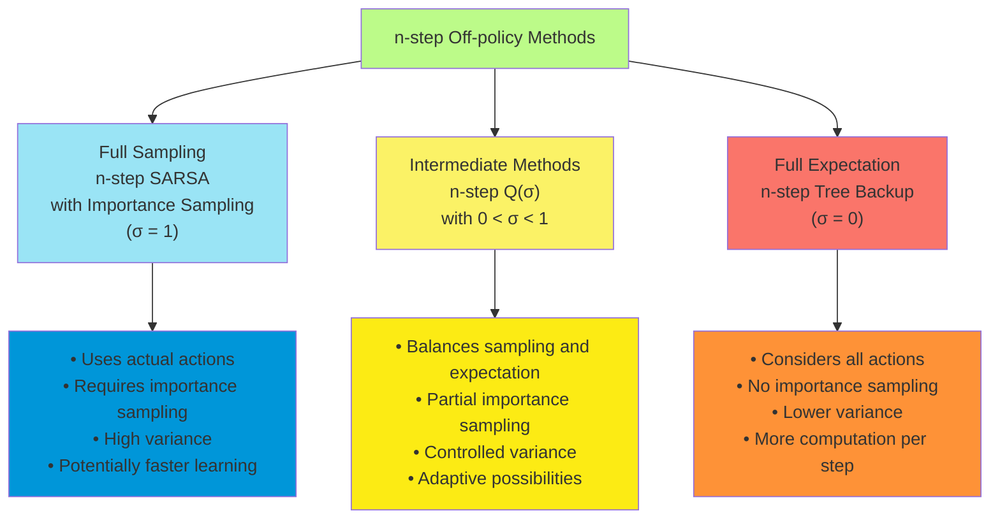

##### Algorithm Description

The n-step Q(σ) algorithm provides a flexible framework for off-policy learning that can be tuned for specific problems.
This section describes the complete algorithm and its implementation details.

**n-step Q(σ) Algorithm**:

1. Initialize $Q(s,a)$ arbitrarily for all states and actions
2. Algorithm parameters: step size $\alpha \in (0, 1]$, number of steps n, sampling parameters $\sigma_t \in [0,1]$
3. Define target policy π (typically a greedy or ε-greedy policy with respect to Q)
4. For each episode:
    - Initialize state $S_0$
    - Choose action $A_0$ using behavior policy b
    - T ← ∞
    - For t = 0, 1, 2, ...:
        - If t < T:
            - Take action $A_t$, observe reward $R_{t+1}$ and state $S_{t+1}$
            - If $S_{t+1}$ is terminal:
                - T ← t+1
            - Else:
                - Choose action $A_{t+1}$ using behavior policy b
                - Compute importance sampling ratio $\rho_{t+1} = \frac{\pi(A_{t+1}|S_{t+1})}{b(A_{t+1}|S_{t+1})}$
                - Compute expected value $E_{t+1} = \sum_a \pi(a|S_{t+1}) Q(S_{t+1}, a)$
        - τ ← t-n+1 (time whose state-action pair is being updated)
        - If τ ≥ 0:
            - If τ+1 ≥ T:
                - $G \leftarrow R_{\tau+1}$
            - Else:
                - $G \leftarrow R_{\tau+1} + \gamma [(1-\sigma_{\tau+1})E_{\tau+1} + \sigma_{\tau+1} \rho_{\tau+1} G_{\tau+1}]$
            - $Q(S_\tau, A_\tau) \leftarrow Q(S_\tau, A_\tau) + \alpha [G - Q(S_\tau, A_\tau)]$
            - Update target policy π if needed
    - Until τ = T-1

**Implementation Details**:

1. **Recursive G Calculation**: The recursive nature of the return calculation requires careful implementation:

    ```
    # Calculate G values from the end of the n-step sequence
    G_values = [0] * (n+1)
    for k in range(min(T, t+n), t, -1):
        if k == T:
            G_values[k-t] = R[k]
        else:
            expected_value = sum(pi(a|S[k]) * Q(S[k], a) for all actions a)
            sampled_value = rho[k] * G_values[k-t+1]
            G_values[k-t] = R[k] + gamma * ((1-sigma[k]) * expected_value + sigma[k] * sampled_value)
    ```

2. **Sigma Selection**: Various approaches for setting σ values:

    - **Fixed sigma**: Use a constant value for all steps
    - **Decreasing sigma**: $\sigma_t = \sigma_0 \cdot \gamma^t$ where $\sigma_0$ is the initial sigma
    - **Policy-based sigma**: $\sigma_t = \min(1, \frac{b(A_t|S_t)}{\pi(A_t|S_t)})$ to avoid high variance ratios
    - **Adaptive sigma**:
      $\sigma_t = \frac{\text{Var}[\text{expectation term}]}{\text{Var}[\text{expectation term}] + \text{Var}[\text{sampling term}]}$

3. **Optimizations**: Several optimizations improve efficiency:

    - Store expected values $E_t$ for each state to avoid redundant calculations
    - Precompute policy probabilities for frequently visited states
    - Implement special cases for σ = 0 and σ = 1 to avoid unnecessary calculations

4. **Edge Case Handling**:

    - If $\pi(A_t|S_t) = 0$, set $\sigma_t = 0$ to avoid zero ratios
    - For terminal states, the return is simply the final reward
    - Handle numeric stability issues in ratio calculations using log-domain operations when necessary

5. **Memory Management**: Efficient storage for the algorithm:

    - States, actions, and rewards for n steps
    - Importance sampling ratios for each step
    - Expected values under the target policy for each state
    - Sigma values for each step
    - Intermediate G values for recursive calculation

The n-step Q(σ) algorithm provides a complete and flexible framework for off-policy learning, allowing practitioners to
fine-tune the balance between sampling and expectation based on specific problem characteristics.

##### Relationship to Other Methods

The n-step Q(σ) algorithm provides a unifying framework that encompasses many important reinforcement learning methods
as special cases. Understanding these relationships helps place the algorithm in the broader context of reinforcement
learning and guides its practical application.

**Relationship to Temporal-Difference Methods**: The n-step Q(σ) algorithm connects to foundational TD algorithms:

1. **One-step TD (n=1)**:
    - With σ = 0: Equivalent to Expected SARSA
    - With σ = 1 and identical policies: Equivalent to SARSA
    - With σ = 0 and greedy target policy: Equivalent to Q-learning
2. **n-step TD Methods**:
    - With σ = 1 and identical policies: Equivalent to n-step SARSA
    - With σ = 0: Equivalent to n-step Tree Backup
    - With σ = 1 and different policies: Equivalent to n-step SARSA with importance sampling

**Relationship to Monte Carlo Methods**: As n approaches the episode length:

1. Full Monte Carlo (n = T-t)

    :

    - With σ = 1 and identical policies: Equivalent to Monte Carlo with returns
    - With σ = 1 and different policies: Equivalent to importance-weighted Monte Carlo
    - With σ = 0: A novel expectation-based variant of Monte Carlo

**Relationship to Dynamic Programming**: The algorithm connects to dynamic programming concepts:

1. **Expected Updates**:
    - With σ = 0, the algorithm performs sample-based expected updates similar to dynamic programming's full backups
    - As n increases, these expectations span multiple time steps
2. **Policy Evaluation and Improvement**:
    - Performs incremental policy evaluation through the return estimates
    - Can be combined with policy improvement for control

**Relationship to Other Off-policy Methods**: The algorithm unifies various off-policy approaches:

1. **Importance Sampling Methods**:
    - Generalizes standard importance sampling (σ = 1)
    - Allows partial importance sampling (0 < σ < 1)
    - Provides alternatives to importance sampling (σ = 0)
2. **Retrace(λ) Algorithm**:
    - A related algorithm that uses adaptive importance sampling ratios
    - Both address variance issues in off-policy learning
3. **Q(λ) and SARSA(λ)**:
    - Can be extended to use eligibility traces for a Q(σ,λ) algorithm
    - Provides a more general framework than traditional λ-return methods

**Relationship to Control Variates**: The expectation terms in n-step Q(σ) function as control variates:

1. **Variance Reduction**: The expectation terms reduce variance compared to pure sampling
2. **Optimal Combination**: The σ parameter allows tuning the control variate coefficient
3. **Adaptive Control**: By adjusting σ based on observed statistics, the algorithm can optimize variance reduction

This rich set of relationships establishes n-step Q(σ) as a powerful unifying framework that connects many seemingly
disparate reinforcement learning algorithms and suggests new variants that may combine their respective advantages.

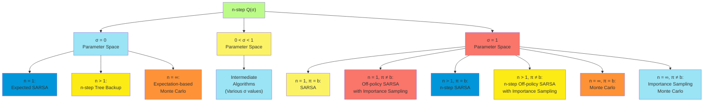

##### Implementation Details

Implementing the n-step Q(σ) algorithm efficiently requires careful attention to several technical details. This section
provides practical guidance for effective implementation.

**Efficient Return Calculation**: The recursive nature of the Q(σ) return requires an efficient implementation approach:

1. **Backward Recursion**: Calculate returns backward from the end of the n-step sequence:

    ```python
    # Initialize return for the last step
    if t+n < T:
        G = R[t+n] + gamma * sum(pi(a|S[t+n]) * Q(S[t+n], a) for all actions a)
    else:
        G = R[T-1]  # Terminal state

    # Backward recursion through the sequence
    for k in range(min(t+n-1, T-2), t, -1):
        expected_value = sum(pi(a|S[k+1]) * Q(S[k+1], a) for all actions a)
        G = R[k+1] + gamma * ((1-sigma[k+1]) * expected_value + sigma[k+1] * rho[k+1] * G)
    ```

2. **Incremental Updates**: For a complete episode, maintain and update G values incrementally:

    ```python
    G_values = [0] * (T+1)  # Store returns for all time steps

    # Initialize terminal state returns
    if T < t+n:
        G_values[T-1] = R[T-1]

    # Calculate returns backward through the episode
    for t in range(T-2, -1, -1):
        if t >= T-n:  # Near the end of episode
            expected_value = sum(pi(a|S[t+1]) * Q(S[t+1], a) for all actions a)
            G_values[t] = R[t+1] + gamma * ((1-sigma[t+1]) * expected_value
                         + sigma[t+1] * rho[t+1] * G_values[t+1])
    ```

**Sigma Selection Strategies**: Various strategies for setting the σ parameter:

1. **Policy-based Adaptive Sigma**:

    ```python
    def calculate_sigma(target_prob, behavior_prob, base_sigma):
        # Reduce sigma when importance sampling would have high variance
        ratio = target_prob / behavior_prob if behavior_prob > 0 else float('inf')
        if ratio > 10:  # High variance threshold
            return min(base_sigma, 1/ratio)
        return base_sigma
    ```

2. **Variance-based Adaptive Sigma**:

    ```python
    def optimal_sigma(expected_term_var, sampling_term_var):
        if sampling_term_var == 0:
            return 0  # Use expectation when sampling has zero variance
        if expected_term_var == 0:
            return 1  # Use sampling when expectation has zero variance
        # Optimal sigma minimizes variance of combined estimator
        return expected_term_var / (expected_term_var + sampling_term_var)
    ```

3. **Step-dependent Sigma**:

    ```python
    def step_dependent_sigma(t, base_sigma, decay_rate=0.95):
        # Reduce sigma for later steps in the sequence
        return base_sigma * (decay_rate ** t)
    ```

**Memory-Efficient Implementation**: Managing memory usage for long episodes or continuous learning:

1. **Circular Buffers**:

    ```python
    class CircularBuffer:
        def __init__(self, capacity):
            self.capacity = capacity
            self.buffer = [None] * capacity
            self.position = 0
            self.size = 0

        def push(self, item):
            self.buffer[self.position] = item
            self.position = (self.position + 1) % self.capacity
            self.size = min(self.size + 1, self.capacity)

        def get(self, index):
            # Get item at relative index from the oldest item
            return self.buffer[(self.position - self.size + index) % self.capacity]
    ```

2. **Experience Management**:

    ```python
    # Initialize experience buffers
    states = CircularBuffer(n+1)
    actions = CircularBuffer(n+1)
    rewards = CircularBuffer(n+1)
    rhos = CircularBuffer(n+1)
    sigmas = CircularBuffer(n+1)

    # Experience collection loop
    for t in range(max_steps):
        # Collect new experience
        states.push(current_state)
        actions.push(current_action)
        # ...

        # Check if we have enough experience for an update
        if t >= n-1:
            # Calculate return and update Q-value
            # ...
    ```

**Numerical Stability**: Ensuring robust behavior with floating-point calculations:

1. **Ratio Calculation**:

    ```python
    def stable_ratio(target_prob, behavior_prob, min_prob=1e-5):
        # Ensure behavior probability is non-zero
        safe_behavior_prob = max(behavior_prob, min_prob)
        # Limit maximum ratio to prevent numerical issues
        return min(target_prob / safe_behavior_prob, 100.0)
    ```

2. **Log-domain Implementation**:

    ```python
    def log_domain_importance_sampling(log_target_probs, log_behavior_probs):
        # Calculate log ratios
        log_ratios = [log_target - log_behavior for log_target, log_behavior
                      in zip(log_target_probs, log_behavior_probs)]
        # Sum logs for product of ratios
        log_product = sum(log_ratios)
        # Convert back to normal domain
        return math.exp(log_product)
    ```

**Parallelization**: Leveraging parallel processing for improved performance:

1. Batch Processing

    :

    ```python
    def batch_update(state_batch, action_batch, reward_batch, next_state_batch, sigma):    # Calculate expected values for all states in batch    expected_values = [calculate_expected_value(s) for s in next_state_batch]        # Calculate returns and updates in parallel    updates = parallel_map(calculate_update, zip(state_batch, action_batch,                                                 reward_batch, expected_values, sigma))        # Apply all updates    for state, action, update in updates:        Q[state, action] += alpha * update
    ```

These implementation details enable efficient and robust application of the n-step Q(σ) algorithm across a wide range of
reinforcement learning problems, from simple discrete environments to complex continuous domains requiring function
approximation.

### Summary of n-step Bootstrapping

n-step bootstrapping methods represent a powerful family of reinforcement learning algorithms that bridge one-step
temporal-difference learning and Monte Carlo methods. By looking n steps into the future before bootstrapping from
estimated values, these methods create a flexible spectrum of approaches with different bias-variance trade-offs.

**Key Concepts and Methods**:

1. **n-step Returns**: Define returns that include actual rewards for n steps followed by bootstrapped value estimates,
   creating a continuum between one-step TD (n=1) and Monte Carlo methods (n=∞).
2. **n-step TD Prediction**: Updates state values based on n-step returns, providing faster reward propagation than
   one-step methods while maintaining lower variance than Monte Carlo approaches.
3. **n-step SARSA**: Extends the n-step approach to control problems for on-policy learning, updating action values
   based on the actual sequence of actions taken.
4. **Off-policy Learning with Importance Sampling**: Enables learning about one policy while following another by
   weighting returns with importance sampling ratios, though this can introduce high variance.
5. **Per-decision Methods with Control Variates**: Reduces variance in off-policy learning by applying importance
   sampling more precisely and incorporating control variate terms.
6. **Tree Backup Algorithm**: Provides off-policy learning without importance sampling by considering all possible
   actions weighted by their target policy probabilities.
7. **n-step Q(σ)**: Unifies various approaches through a sampling parameter σ that creates a continuous spectrum between
   sampling-based methods (σ=1) and expectation-based methods (σ=0).

**Practical Considerations**:

1. **Step Number Selection**: The choice of n significantly impacts performance:
    - Small n: Lower variance, higher bias, often better in highly stochastic environments
    - Intermediate n (3-10): Often provides the best performance in practice
    - Large n: Lower bias, higher variance, better for environments with poor initial estimates
2. **Algorithm Selection**: The optimal algorithm depends on specific problem characteristics:
    - On-policy learning: n-step SARSA typically works well
    - Off-policy with similar policies: Importance sampling methods may be sufficient
    - Off-policy with divergent policies: Tree Backup or n-step Q(σ) with small σ values are preferred
    - Partial observability: Larger n values help span observation ambiguities
3. **Parameter Adaptation**: Many advanced implementations adapt parameters based on observed performance:
    - Adaptive n selection based on observed return variance
    - Dynamic σ values in n-step Q(σ) based on policy differences
    - Combined methods that effectively average over different n values
4. **Computational Considerations**: Implementation efficiency is important, particularly for:
    - Memory management for storing n-step trajectories
    - Efficient computation of expected values and importance sampling ratios
    - Numerical stability with importance sampling products

n-step bootstrapping methods provide a rich framework for reinforcement learning that encompasses many classic
algorithms as special cases while enabling new approaches that balance bias and variance in novel ways. Their
flexibility and strong theoretical foundations make them valuable tools for addressing complex sequential decision
problems across a wide range of domains.
