# C-7: Planning and Learning with Tabular Methods

1. Models and Planning

    - Distribution vs. Sample Models
    - Planning with Models
    - Learning and Planning Integration

2. Dyna: Integrated Planning, Acting, and Learning

    - Dyna Architecture
    - Dyna-Q Algorithm
    - Performance Characteristics
    - Maze Example

3. When the Model is Wrong

    - Changing Environments
    - Model Inaccuracies
    - Exploration Bonuses
    - Dyna-Q+ Algorithm

4. Prioritized Sweeping

    - Efficient State Selection
    - Backward Focusing
    - Implementation Details
    - Performance Advantages

5. Expected vs. Sample Updates

    - Computational Trade-offs
    - Relative Advantages
    - Empirical Comparisons
    - Application Guidelines

6. Trajectory Sampling

    - State Distribution for Updates
    - On-policy Distribution
    - Efficiency Considerations
    - Empirical Results

7. Real-time Dynamic Programming

    - RTDP Algorithm
    - On-policy Trajectory Sampling
    - Convergence Properties
    - Example Applications

8. Planning at Decision Time

    - Decision-time vs. Background Planning
    - Computational Considerations
    - Implementation Approaches

9. Heuristic Search

    - State-space Planning
    - Lookahead Search
    - Depth of Search
    - Value Function Role

10. Rollout Algorithms

    - Algorithm Description
    - Policy Improvement Property
    - Implementation Considerations
    - Examples and Applications

11. Monte Carlo Tree Search
    - MCTS Algorithm Components
    - UCT Selection Strategy
    - Applications in Game Playing
    - AlphaGo Connection

#### Models and Planning

##### Distribution vs. Sample Models

The concept of models lies at the heart of planning in reinforcement learning. Models represent an agent's understanding
of the environment's dynamics, allowing it to predict future states and rewards without direct interaction.
Understanding the distinction between distribution models and sample models is fundamental to developing effective
planning algorithms.

**Distribution Models**: A distribution model provides complete information about the probability distributions that
govern the environment's dynamics. Formally, a distribution model represents the environment's transition and reward
functions:

$$p(s',r|s,a)$$

This function specifies the probability of transitioning to state $s'$ and receiving reward $r$ when taking action $a$
in state $s$. A distribution model captures the full stochastic nature of the environment, including:

1. **Multiple Possible Outcomes**: All possible next states and rewards for each state-action pair
2. **Probability Distributions**: The likelihood of each outcome occurring
3. **Expected Values**: The expected reward for each state-action pair

Distribution models enable exact computation of expected updates, similar to those used in dynamic programming. With a
distribution model, an agent can compute the expected value of a state-action pair using the Bellman equation:

$$Q(s,a) \leftarrow \sum_{s',r} p(s',r|s,a)[r + \gamma \max_{a'} Q(s',a')]$$

**Sample Models**: In contrast, a sample model generates individual samples of possible next states and rewards, rather
than providing complete probability distributions. When queried with a state-action pair $(s,a)$, a sample model
returns:

$$(s',r) \sim p(s',r|s,a)$$

where $(s',r)$ is a sample drawn according to the environment's dynamics. Key characteristics of sample models include:

1. **Single Outcome Generation**: Each query produces one possible outcome
2. **Stochasticity**: Multiple queries with the same input may yield different outputs
3. **Statistical Approximation**: Repeated sampling approximates the true distribution

Sample models enable sample-based updates, similar to those used in temporal-difference learning:

$$Q(s,a) \leftarrow Q(s,a) + \alpha[r + \gamma \max_{a'} Q(s',a') - Q(s,a)]$$

**Comparison and Trade-offs**: The choice between distribution and sample models involves several important trade-offs:

1. **Computational Complexity**:
    - Distribution models: Higher computation per update, requiring summation over all possible outcomes
    - Sample models: Lower computation per update, processing only one outcome at a time
2. **Information Content**:
    - Distribution models: Complete information about environment dynamics
    - Sample models: Partial information requiring multiple samples for accurate estimates
3. **Memory Requirements**:
    - Distribution models: Must store complete probability distributions
    - Sample models: May store simplified representations or generative processes
4. **Learning Difficulty**:
    - Distribution models: More challenging to learn accurately, especially in complex environments
    - Sample models: Can be easier to learn, sometimes through direct experience
5. **Update Efficiency**:
    - Distribution models: More statistically efficient updates, using all probability information
    - Sample models: Less efficient updates, but potentially faster computation per update

In practice, the choice between distribution and sample models often depends on the specific problem characteristics,
computational constraints, and available knowledge about the environment.

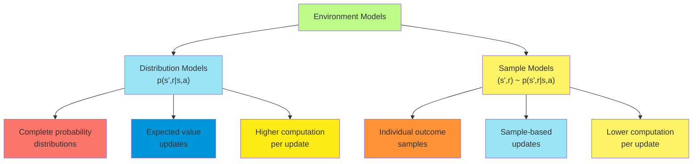

##### Planning with Models

Planning refers to the process of using a model to improve a policy or value function without direct interaction with
the environment. This powerful approach allows an agent to anticipate consequences of actions before taking them,
potentially leading to better decisions with less actual experience.

**Planning Process**: At its core, planning involves several key steps:

1. **Model Construction**: Developing or acquiring a model of the environment
2. **Simulated Experience**: Using the model to generate hypothetical experiences
3. **Policy/Value Improvement**: Updating policy or value functions based on these simulated experiences

Planning leverages the agent's model to simulate experience, which is then used to improve decision-making through
standard reinforcement learning updates.

**Types of Planning Algorithms**: Planning algorithms can be categorized along several dimensions:

1. **State-space vs. Plan-space Planning**:
    - **State-space Planning**: Works directly with states, actions, and their outcomes
    - **Plan-space Planning**: Operates on partial plans, adding and modifying steps to achieve goals
2. **Forward vs. Backward Planning**:
    - **Forward Planning**: Starts from the current state and projects forward
    - **Backward Planning**: Starts from goal states and works backward
3. **Breadth-first vs. Depth-first Planning**:
    - **Breadth-first**: Explores all possible immediate next steps before looking deeper
    - **Depth-first**: Follows potential action sequences to their conclusion before backtracking
4. **Deterministic vs. Stochastic Planning**:
    - **Deterministic**: Assumes fixed outcomes for actions
    - **Stochastic**: Accounts for probability distributions over outcomes

**Planning with Distribution Models**: When using a distribution model, planning typically involves:

1. **Expected Updates**: Computing expected values across all possible outcomes
2. **Prioritization**: Focusing updates on states with high expected improvement
3. **Convergence**: Iterating until the value function or policy stabilizes

This approach is exemplified by dynamic programming methods like value iteration and policy iteration.

**Planning with Sample Models**: With sample models, planning generally involves:

1. **Simulated Trajectories**: Generating sequences of states, actions, and rewards
2. **Sample-based Updates**: Applying standard TD or Monte Carlo updates to simulated experiences
3. **Statistical Approximation**: Using multiple samples to approximate expected values

This approach underlies methods like Monte Carlo Tree Search and Dyna-Q.

**Computational Considerations**: Several factors affect the computational efficiency of planning:

1. **Update Complexity**: The computational cost of each update
2. **Number of Updates**: How many updates are performed during planning
3. **State Selection**: Which states to focus updates on for maximum improvement
4. **Depth of Planning**: How far into the future the planning process considers
5. **Branching Factor**: How many actions and outcomes exist at each step

**Planning Horizons**: Planning can be conducted with different time horizons:

1. **Finite-horizon Planning**: Considers a fixed number of steps into the future
2. **Receding-horizon Planning**: Plans for a fixed horizon, executes the first action, then replans
3. **Infinite-horizon Planning**: Considers the long-term consequences of actions

The appropriate planning horizon depends on the problem characteristics, model accuracy, and computational constraints.

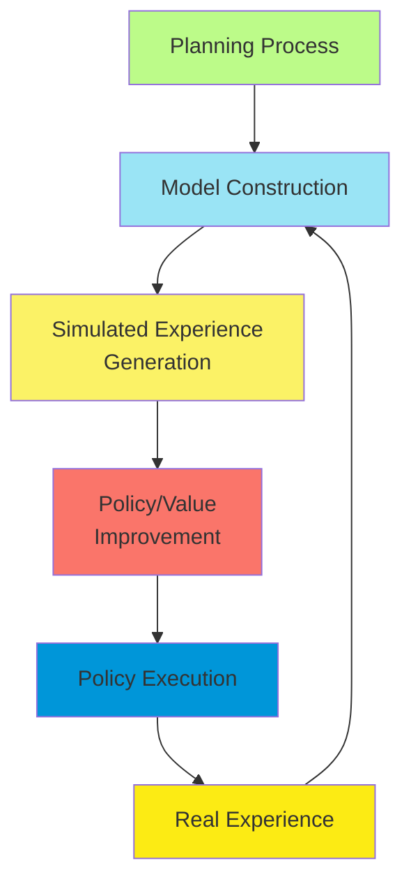

##### Learning and Planning Integration

The integration of learning and planning represents a powerful paradigm in reinforcement learning, combining the
strengths of model-free and model-based approaches. This integration enables agents to leverage both direct experience
and simulated experience to improve performance.

**Complementary Processes**: Learning and planning serve complementary roles in reinforcement learning:

1. **Learning**: Extracts value information directly from real experience, without requiring an explicit model.
2. **Planning**: Extracts value information from a model, enabling improvement without direct environment interaction.

Both processes ultimately contribute to the same goal: improving the agent's policy to maximize cumulative reward.

**Integrated Architecture Components**: A fully integrated learning and planning system typically includes:

1. **Direct RL Component**: Updates value functions or policies based on actual experience
2. **Model Learning Component**: Builds and refines a model of the environment
3. **Planning Component**: Uses the model to generate simulated experience for additional updates
4. **Experience Memory**: Stores real experiences for potential reuse
5. **Control Policy**: Determines actions based on current value estimates

**Benefits of Integration**: Integrating learning and planning offers several advantages:

1. **Sample Efficiency**: Leverages each real experience multiple times through model-based simulation
2. **Adaptation Speed**: Combines fast value propagation through planning with accurate updates from real experience
3. **Robustness**: Helps mitigate inaccuracies in the model through direct learning
4. **Exploration-Exploitation Balance**: Can explore efficiently in simulation while exploiting knowledge in the real
   environment

**Integration Approaches**: Several approaches exist for integrating learning and planning:

1. **Dyna Architecture**: Alternates between learning from real experience, updating the model, and planning with the
   model
2. **Prioritized Sweeping**: Focuses planning updates on states with the largest expected value changes
3. **Background Planning**: Performs planning continuously as a background process during environment interaction
4. **Decision-time Planning**: Conducts focused planning only when decisions are needed

**Computational Trade-offs**: The integration of learning and planning involves several computational trade-offs:

1. **Real vs. Simulated Experience**: Balancing the use of limited real experience against potentially abundant
   simulated experience
2. **Model Complexity vs. Accuracy**: Trading off the complexity of the model against its accuracy in predicting
   outcomes
3. **Planning Depth vs. Breadth**: Deciding whether to plan deeply for a few states or broadly across many states
4. **Learning vs. Planning Allocation**: Determining how much computational resource to allocate to each process

**Learning Rate Considerations**: Special considerations for learning rates in integrated systems:

1. **Real Experience Learning Rate**: Typically higher to prioritize actual experience
2. **Simulated Experience Learning Rate**: May be lower to account for model inaccuracies
3. **Model Learning Rate**: Balances adaptation to changing dynamics against stability

**Theoretical Foundations**: The integration of learning and planning is supported by theoretical connections:

1. **Bellman Equations**: Both processes can be viewed as different methods for approximating solutions to the Bellman
   equations
2. **Policy Iteration**: The alternation between policy evaluation and improvement underlies both processes
3. **Value Propagation**: Both processes propagate value information through the state space, albeit through different
   mechanisms

The effective integration of learning and planning represents one of the most promising approaches for developing
efficient and adaptive reinforcement learning systems.

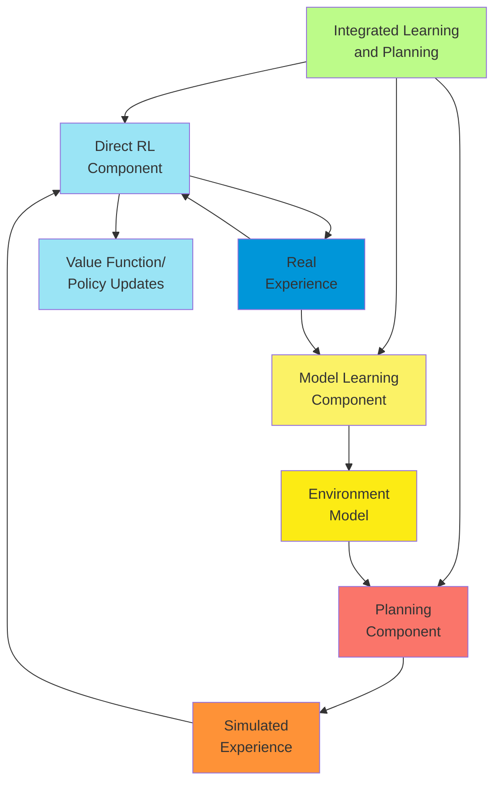

#### Dyna: Integrated Planning, Acting, and Learning

##### Dyna Architecture

The Dyna architecture represents a groundbreaking framework for integrating direct reinforcement learning with
model-based planning. Proposed by Richard Sutton, Dyna creates a unified system where learning, planning, and acting
work together to improve an agent's policy.

**Core Concept**: The fundamental insight of Dyna is that direct reinforcement learning and planning are essentially the
same operation, applied to different sources of experience:

1. **Direct RL**: Updates value functions based on real experience from environment interaction
2. **Planning**: Updates value functions based on simulated experience from a model

Dyna unifies these processes by treating both real and simulated experiences equivalently for value function updates.

**Basic Dyna Architecture**: The Dyna architecture consists of five key components:

1. **Direct RL**: A standard reinforcement learning algorithm (e.g., Q-learning, SARSA) that updates value estimates
   based on real experience
2. **Model Learning**: A component that learns to predict state transitions and rewards from observed experiences
3. **Planning**: A process that uses the model to generate simulated experiences for additional updates
4. **Action Selection**: A policy (typically ε-greedy) that selects actions based on current value estimates
5. **Experience Storage**: A mechanism for storing and potentially reusing real experiences

**Operational Cycle**: The Dyna architecture operates in a continuous cycle:

1. The agent selects an action based on the current state and policy
2. The action is executed in the environment, yielding a reward and next state
3. The direct RL component updates value estimates based on this real experience
4. The model learning component updates its predictions based on the observed transition
5. The planning component performs n simulated updates using the current model
6. The cycle repeats with a new action selection

This cycle seamlessly integrates acting, learning, and planning into a unified process.

**Information Flow**: Information flows through the Dyna architecture in multiple ways:

1. **Environment → Direct RL**: Real experiences inform value function updates
2. **Environment → Model Learning**: Real experiences improve the model
3. **Model → Planning**: The model generates simulated experiences
4. **Planning → Value Function**: Simulated experiences provide additional value function updates
5. **Value Function → Action Selection**: Current value estimates guide action selection

This integrated flow of information allows the agent to learn efficiently from limited real experience.

**Computational Allocation**: A key parameter in Dyna is the number of planning steps performed per real environment
step. This parameter controls the balance between:

1. **Exploitation of Current Knowledge**: Using planning to extract more value from existing experience
2. **Acquisition of New Knowledge**: Using real actions to gather fresh information

The optimal allocation depends on factors like model accuracy, computational resources, and the cost of real environment
interaction.

**Theoretical Properties**: The Dyna architecture maintains important theoretical properties:

1. **Asymptotic Convergence**: Under appropriate conditions, Dyna converges to the optimal policy
2. **Sample Efficiency**: Dyna typically requires fewer environmental interactions than model-free methods
3. **Anytime Operation**: Dyna can provide a reasonable policy at any time, continuously improving with more computation

Dyna represents a powerful framework for integrating the complementary strengths of model-free and model-based
reinforcement learning approaches.

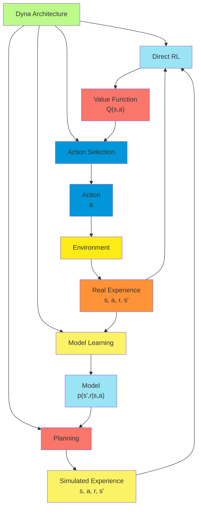

##### Dyna-Q Algorithm

Dyna-Q is a specific implementation of the Dyna architecture that uses Q-learning as its direct reinforcement learning
component. This algorithm provides a concrete realization of the Dyna principles, offering a practical approach to
integrated planning, acting, and learning.

###### Algorithm Description:

The Dyna-Q algorithm proceeds as follows:

1. Initialize Q(s,a) arbitrarily for all states and actions
2. Initialize model M(s,a) for all states and actions
3. For each episode:
    1. Initialize state S
    2. Loop for each step of episode:
        1. Choose action A from S using policy derived from Q (e.g., ε-greedy)
        2. Take action A, observe reward R and next state S'
        3. Direct RL Update
            - $Q(S,A) \leftarrow Q(S,A) + \alpha[R + \gamma\cdot\max_a Q(S',a) - Q(S,A)]$
        4. Model Update
            - $M(S,A) \leftarrow R, S'$ (store result of action A in state S)
        5. Planning (Repeat n times)
            1. Select previously observed state-action pair $(S_s, A_s)$ randomly
            2. Retrieve model prediction: $R_s, S'_s \leftarrow M(S_s, A_s)$
            3. $Q(S_s, A_s) \leftarrow Q(S_s, A_s) + \alpha[R_s + \gamma\cdot\max_a Q(S'_s,a) - Q(S_s, A_s)]$
        6. S ← S'
    3. Until S is terminal

**Key Components**:

1. **Q-learning Updates**: Both direct learning and planning use the standard Q-learning update rule, applying it to
   real and simulated experiences respectively.
2. **Model Representation**: The model M(s,a) stores observed transition information, typically including:
    - The observed next state S'
    - The observed reward R
    - In stochastic environments, it may store statistics about multiple observed outcomes
3. **Planning Step Selection**: The algorithm randomly selects previously experienced state-action pairs for planning
   updates. This simple strategy ensures broad coverage of the experienced state space.
4. **Parameter n**: The number of planning steps per real step, controlling the amount of computation devoted to
   planning.

**Implementation Considerations**:

1. **Model Initialization**: The model can be initialized with default transitions or as undefined until experiences
   occur.
2. **Planning with Unexplored Pairs**: Planning updates typically focus only on state-action pairs that have been
   experienced at least once.
3. **Stochastic Environments**: In stochastic environments, the model may need to:
    - Store multiple observed outcomes for each state-action pair
    - Select outcomes probabilistically during planning
    - Or maintain distribution statistics to generate samples
4. **Tabular Representation**: Dyna-Q in its basic form uses tabular representations for both the value function and
   model.
5. **Learning Rates**: The same learning rate α is typically used for both direct updates and planning updates, though
   they could be differentiated.

**Algorithmic Properties**:

1. **Computational Complexity**:
    - Time: O(n) per real step, where n is the number of planning updates
    - Space: O(|S|·|A|) for both the Q-table and model
2. **Convergence**: Under standard reinforcement learning conditions (sufficient exploration, appropriate learning
   rates), Dyna-Q converges to the optimal policy with probability 1.
3. **Efficiency Gain**: The computational efficiency gain of Dyna-Q increases with:
    - The accuracy of the learned model
    - The cost of real environment interaction
    - The complexity of value propagation through the state space

Dyna-Q provides a straightforward yet powerful implementation of integrated planning and learning, forming the
foundation for more sophisticated model-based reinforcement learning approaches.

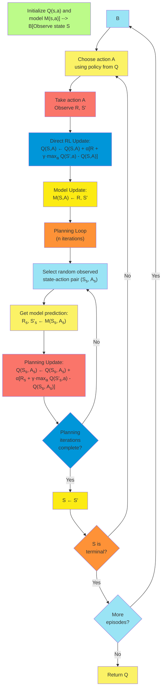

##### Performance Characteristics

Dyna-Q exhibits distinctive performance characteristics that stem from its integration of direct learning and
model-based planning. Understanding these characteristics helps in applying the algorithm effectively and recognizing
its strengths and limitations.

**Learning Speed**: Dyna-Q typically demonstrates significantly faster learning than pure model-free methods:

1. **Initial Learning Phase**:
    - Even with a small number of planning steps (e.g., n=5-10), Dyna-Q often learns several times faster than
      Q-learning
    - The advantage increases with the number of planning steps
    - Model inaccuracies have less impact during early learning when the value function is far from optimal
2. **Learning Curve Shape**:
    - Dyna-Q typically shows a steeper initial learning curve
    - The curve often exhibits small "jumps" when the model enables value information to propagate rapidly
3. **Asymptotic Performance**:
    - Eventually reaches the same optimal policy as Q-learning, assuming an accurate model
    - May converge faster to the optimal policy due to more efficient use of experience

**Computational Efficiency**: The computational characteristics of Dyna-Q reflect its dual learning approach:

1. **Time Complexity Trade-offs**:
    - Requires more computation per real step than model-free methods
    - Computation increases linearly with the number of planning steps
    - Trades increased computation for decreased environment interaction
2. **Sample Efficiency**:
    - Achieves higher sample efficiency (learning per real step) than model-free methods
    - The advantage increases in environments where real steps are expensive or time-consuming
3. **Memory Requirements**:
    - Requires additional memory to store the model
    - Tabular implementation: O(|S|·|A|) for both Q-table and model
    - Function approximation: Depends on the model representation complexity

**Planning Step Impact**: The number of planning steps n has a profound effect on performance:

1. **Performance vs. Planning Steps**:
    - Performance typically improves with more planning steps
    - The improvement follows a curve of diminishing returns
    - The optimal number of planning steps depends on model accuracy and problem structure
2. **Environment Complexity Effects**:
    - More complex environments (larger state spaces, longer horizons) typically benefit from more planning steps
    - Simple environments may see limited benefit beyond a small number of planning steps
3. **Computation vs. Performance Trade-off**:
    - A key design decision is determining the optimal n for a given computational budget
    - The "planning efficiency" (improvement per planning step) decreases with n

**Model Quality Effects**: The accuracy of the learned model significantly influences performance:

1. **Perfect Model**:
    - With a perfect model, performance improves monotonically with planning steps
    - Can achieve order-of-magnitude improvements over model-free methods
2. **Imperfect Model**:
    - Model errors can propagate through planning, potentially degrading performance
    - With highly inaccurate models, excessive planning may actually worsen performance
    - The sensitivity to model errors increases with the number of planning steps
3. **Stochastic Environments**:
    - Model learning is more challenging in stochastic environments
    - Performance advantage over model-free methods may be reduced but still significant

**State Visitation Distribution**: The distribution of states used for planning affects performance:

1. **Uniform Random Selection**:
    - Basic Dyna-Q uses uniform random selection from experienced states
    - Simple but potentially inefficient, especially in large state spaces
2. **Recency Bias**:
    - Prioritizing recently experienced states can improve performance
    - Particularly beneficial in non-stationary environments
3. **Learning Progress Bias**:
    - Prioritizing states with larger value changes (as in prioritized sweeping) can significantly improve efficiency

These performance characteristics make Dyna-Q a powerful and flexible algorithm that can be adapted to a wide range of
reinforcement learning problems.

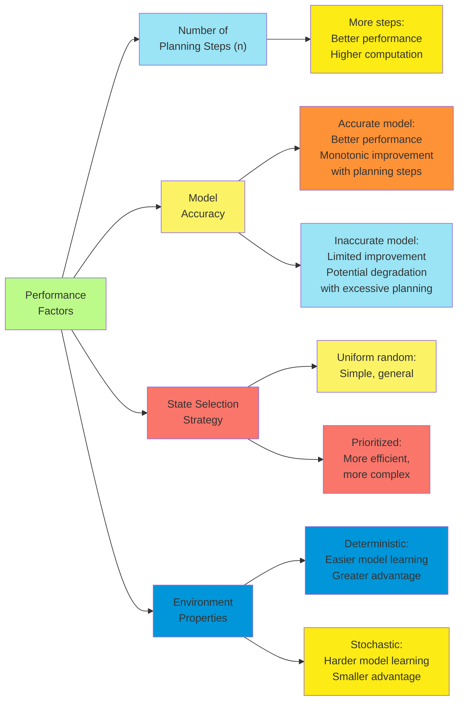

##### Maze Example

The maze environment provides a classic testbed for demonstrating the effectiveness of Dyna-Q. This gridworld problem
clearly illustrates how integrating planning with direct learning accelerates policy improvement.

**Environment Description**: The maze environment typically consists of:

1. **Grid Structure**: A 2D grid where each cell represents a state
2. **Obstacles**: Walls or barriers that restrict movement
3. **Start State**: The initial position of the agent
4. **Goal State**: The target location, typically providing a positive reward
5. **Actions**: Movement in four directions (up, down, left, right)
6. **Dynamics**: Deterministic transitions (actions reliably move the agent in the intended direction unless blocked)
7. **Rewards**: A small negative reward (-1) for each step and a positive reward (+10 or +100) for reaching the goal

**Experimental Setup**: A typical experimental configuration includes:

1. **Algorithm Variants**:
    - Q-learning (model-free baseline)
    - Dyna-Q with varying numbers of planning steps (n = 0, 5, 10, 50, etc.)
2. **Performance Metrics**:
    - Steps per episode (primary performance measure)
    - Cumulative reward
    - Computational time
3. **Parameter Settings**:
    - Learning rate α = 0.1
    - Discount factor γ = 0.95
    - Exploration rate ε = 0.1 (ε-greedy policy)

**Typical Results**: Maze experiments with Dyna-Q typically show:

1. **Learning Curves**:
    - Q-learning: Gradual improvement over many episodes
    - Dyna-Q (n=5): Significantly faster improvement
    - Dyna-Q (n=50): Very rapid convergence to near-optimal paths
2. **Planning Benefit**:
    - The performance advantage of Dyna-Q increases with the number of planning steps
    - Follows a law of diminishing returns (e.g., n=50 may not be 10 times better than n=5)
3. **Value Propagation**:
    - Q-learning: Value information propagates one step per real experience
    - Dyna-Q: Value information propagates multiple steps per real experience through planning
4. **Policy Visualization**:
    - Early episodes: Extensive exploration in all variants
    - Middle episodes: Dyna-Q variants find shorter paths more quickly
    - Later episodes: All methods eventually find optimal or near-optimal paths

**Specific Maze Scenarios**: Different maze configurations highlight different aspects of Dyna-Q's performance:

1. **Simple Maze**:
    - Short optimal path (10-20 steps)
    - Dyna-Q typically shows 3-5x faster learning than Q-learning
2. **Complex Maze**:
    - Longer optimal path (30+ steps)
    - Multiple possible routes with similar lengths
    - Dyna-Q's advantage increases, often showing 5-10x faster learning
3. **Maze with Bottlenecks**:
    - Narrow passages that must be traversed
    - Dyna-Q shows particular advantage in propagating value through these bottlenecks
4. **Changing Maze**:
    - Modifications to the maze structure during learning
    - Tests the algorithm's ability to adapt to environment changes (explored further in the next section)

**Insights from Maze Example**: The maze experiments illustrate several key principles:

1. **Value Propagation Efficiency**: Dyna-Q's planning enables rapid backward propagation of value information from the
   goal.
2. **Experience Reuse**: Each real experience influences multiple state-action values through planning.
3. **Exploration-Exploitation Balance**: Planning helps the agent exploit its current knowledge while real steps
   continue exploration.
4. **Computational Trade-offs**: The optimal number of planning steps depends on the maze complexity and computational
   constraints.

The maze example provides an intuitive demonstration of Dyna-Q's effectiveness and helps build understanding of how
integrated planning and learning accelerate reinforcement learning.

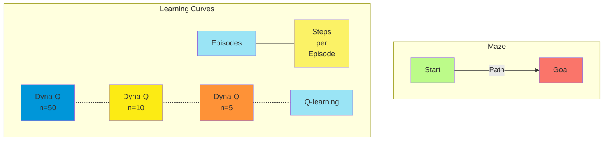

#### When the Model is Wrong

##### Changing Environments

Real-world environments rarely remain static over time. Changes in the environment dynamics present significant
challenges for model-based reinforcement learning methods like Dyna-Q, which rely on an accurate model to generate
useful simulated experiences. Understanding how to handle changing environments is crucial for developing robust and
adaptive agents.

**Types of Environmental Changes**: Environments can change in several ways, each presenting different challenges:

1. **Structural Changes**: Modifications to the structure of the environment
    - Opening or closing pathways (e.g., new doors in a maze)
    - Adding or removing obstacles
    - Changing the connectivity between states
2. **Reward Changes**: Alterations to the reward function
    - Shifting goal locations
    - Changing reward magnitudes
    - Introducing new reward sources or removing existing ones
3. **Transition Dynamics Changes**: Modifications to state transition probabilities
    - Increasing or decreasing stochasticity
    - Altering the effects of actions
    - Changing movement patterns or physics
4. **Cyclic Changes**: Predictable patterns of change that repeat over time
    - Day/night cycles affecting visibility or accessibility
    - Periodic availability of certain paths or resources

**Challenges for Model-Based Methods**: When environments change, model-based methods face several challenges:

1. **Model Obsolescence**: Previously learned models become inaccurate, potentially leading to:
    - Inefficient or impossible paths being planned
    - Overvaluation of states that are no longer valuable
    - Undervaluation of newly valuable states or actions
2. **Adaptation Rate**: The speed at which the model updates to reflect changes depends on:
    - How frequently changed states are visited
    - The learning rate for model updates
    - The exploration strategy
3. **Exploration-Exploitation Dilemma**: Changes create a renewed need for exploration
    - Continuing to exploit based on outdated models can be highly suboptimal
    - Detecting when to increase exploration becomes critical
4. **Planning Interference**: Excessive planning with an outdated model can actively interfere with adaptation
    - Reinforcing outdated value estimates
    - Counteracting the learning from new real experiences

**Detection Mechanisms**: Several approaches can help detect environmental changes:

1. **Prediction Error Monitoring**: Tracking the discrepancy between model predictions and actual observations
    - Sudden increases in prediction errors suggest environmental changes
    - Can trigger increased exploration or model reset
2. **Model Confidence Tracking**: Maintaining confidence estimates for different parts of the model
    - Reducing confidence after changes are detected
    - Weighting planning updates based on confidence
3. **Temporal Difference Monitoring**: Watching for systematic patterns in TD errors
    - Consistent TD errors in the same direction suggest model inaccuracy
    - Can help localize where changes have occurred

**Adaptation Strategies**: Several strategies help model-based methods adapt to changing environments:

1. **Recency-weighted Model Updates**: Giving greater weight to recent experiences
    - Exponential decay of old information
    - Adjustable decay rate based on detected change frequency
2. **Targeted Exploration**: Directing exploration toward areas suspected of having changed
    - Temporarily increasing ε in ε-greedy policies for certain regions
    - Using uncertainty-based exploration bonuses
3. **Model Partitioning**: Maintaining separate models for different parts of the environment
    - Allows isolated updating of changed areas
    - Preserves accurate models for stable regions
4. **Adaptive Planning**: Adjusting the planning process based on model confidence
    - Reducing planning steps when model quality is suspect
    - Focusing planning on high-confidence regions
5. **Meta-learning**: Learning how environments typically change
    - Anticipating patterns of change
    - Preparing adaptive responses to common change types

The ability to handle changing environments is crucial for applying reinforcement learning in real-world scenarios where
static conditions are the exception rather than the rule.

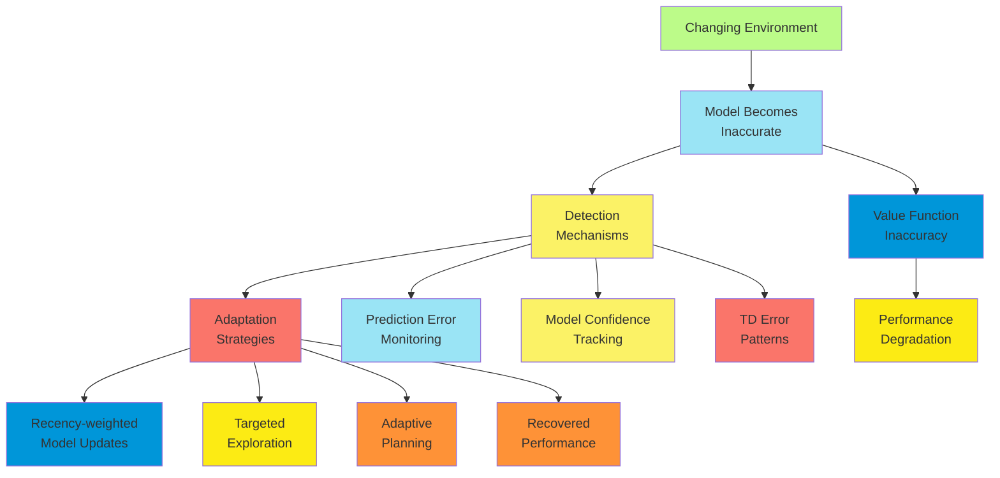

##### Model Inaccuracies

Model inaccuracies present a fundamental challenge for model-based reinforcement learning methods. Understanding the
sources, impacts, and mitigation strategies for model errors is essential for developing robust planning and learning
systems.

**Sources of Model Inaccuracies**: Model errors can arise from various sources:

1. **Limited Experience**: Insufficient samples to accurately estimate transition probabilities or rewards
    - Sparse visitation of certain states
    - Rare stochastic outcomes not yet observed
2. **Function Approximation Errors**: Inaccuracies introduced by approximate model representations
    - Oversimplification of complex dynamics
    - Generalization errors across similar states
3. **Non-stationarity**: Changes in the environment dynamics over time
    - Gradual drift in transition probabilities
    - Abrupt changes in environment structure
4. **Partial Observability**: Incomplete state information leading to apparently non-Markovian dynamics
    - Hidden variables affecting transitions
    - Aliasing of distinct states
5. **Representational Limitations**: Inability of the model structure to capture true environment dynamics
    - Limitations in representing complex distributions
    - Difficulty modeling long-range dependencies

**Impact on Planning Performance**: Model inaccuracies affect planning in several ways:

1. **Value Propagation Errors**: Inaccurate models propagate errors through the value function
    - Initial errors become amplified through planning iterations
    - Can lead to completely incorrect value estimates
2. **Misguided Exploration**: Planning with inaccurate models may direct exploration toward unpromising areas
    - Overestimation of uncertain or novel states
    - Pursuit of phantom rewards or shortcuts
3. **Confidence Calibration**: Difficulty in determining how much to trust model-based updates
    - Overconfidence in incorrect models
    - Underutilization of accurate model components
4. **Computational Inefficiency**: Resources wasted on planning with inaccurate models
    - Planning steps based on incorrect transitions
    - Value updates that must later be corrected

**Measuring Model Quality**: Several approaches can assess model accuracy:

1. **Prediction Error**: The discrepancy between predicted and actual next states/rewards
    - Mean squared error for rewards
    - Distributional metrics for state transitions
2. **Value Estimation Error**: Comparing value estimates from model-based planning vs. direct learning
    - Divergence suggests model inaccuracies
    - Consistency provides confidence in the model
3. **Cross-validation**: Testing model predictions on held-out data
    - Reveals generalization errors
    - Helps detect overfitting to specific trajectories
4. **Uncertainty Estimation**: Quantifying confidence in model predictions
    - Bayesian approaches to model uncertainty
    - Ensemble methods capturing prediction variance

**Mitigation Strategies**: Several techniques can help address model inaccuracies:

1. **Uncertainty-aware Planning**: Incorporating model uncertainty into planning
    - Pessimistic planning in uncertain regions
    - Risk-sensitive optimization
2. **Model Regularization**: Preventing overfitting in model learning
    - Smoothing techniques for transition probabilities
    - Prior knowledge incorporation
3. **Ensemble Methods**: Using multiple models for prediction
    - Majority voting or weighted averaging
    - Disagreement as an uncertainty metric
4. **Limited Planning Horizon**: Restricting planning depth when model quality is suspect
    - Shorter planning horizons where uncertainty compounds less
    - Dynamic adjustment based on model confidence
5. **Hybrid Approaches**: Combining model-based and model-free methods
    - Using model-free updates when model confidence is low
    - Gradually increasing model reliance as model improves

Understanding and addressing model inaccuracies remains one of the central challenges in model-based reinforcement
learning, requiring sophisticated approaches to balance the benefits of planning against the risks of propagating
errors.

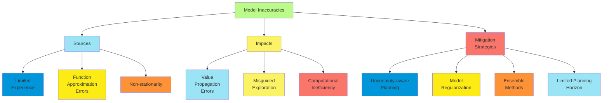

##### Exploration Bonuses

Exploration bonuses represent a powerful technique for addressing the exploration-exploitation dilemma in reinforcement
learning, particularly in the context of model-based methods. These bonuses modify the reward function to encourage
exploration of states or actions with potential information value.

**Core Concept**: Exploration bonuses augment the environment's reward signal with additional rewards that incentivize
exploration:

$$\tilde{R}(s,a) = R(s,a) + \beta \cdot B(s,a)$$

where:

- $\tilde{R}(s,a)$ is the augmented reward
- $R(s,a)$ is the original environment reward
- $B(s,a)$ is the exploration bonus
- $\beta$ is a coefficient controlling the bonus magnitude

**Types of Exploration Bonuses**: Several formulations of exploration bonuses exist:

1. **Count-based Bonuses**: Reward visiting infrequently visited states or taking rare actions
   $$B(s,a) = \frac{1}{\sqrt{N(s,a)}}$$ where $N(s,a)$ is the number of times state-action pair $(s,a)$ has been visited
2. **Recency-based Bonuses**: Encourage revisiting states that haven't been visited recently
   $$B(s,a) = \sqrt{\tau - \text{last}(s,a)}$$ where $\text{last}(s,a)$ is the time step when $(s,a)$ was last visited
   and $\tau$ is the current time step
3. **Uncertainty-based Bonuses**: Reward visiting states with uncertain values or model predictions
   $$B(s,a) = \sigma(s,a)$$ where $\sigma(s,a)$ represents the uncertainty in the value or model prediction
4. **Novelty-based Bonuses**: Reward experiencing transitions that differ from expectations
   $$B(s,a) = ||\hat{s}' - s'||$$ where $\hat{s}'$ is the predicted next state and $s'$ is the actual next state

**Benefits in Model-based RL**: Exploration bonuses are particularly valuable in model-based reinforcement learning for
several reasons:

1. **Model Improvement**: Encourage visits to states where the model needs improvement
2. **Adaptation to Changes**: Promote re-exploration of areas where the environment may have changed
3. **Planning Guidance**: Direct planning toward informative regions of the state space
4. **Efficiency**: Often more efficient than purely random exploration strategies

**Implementation in Dyna Framework**: Exploration bonuses can be incorporated into Dyna-style algorithms in multiple
ways:

1. **Real Experience Bonuses**: Add bonuses to rewards obtained from real environment interactions
    - Updates Q-values directly with the augmented rewards
    - Affects both learning and behavior
2. **Planning Bonuses**: Add bonuses during model-based planning steps
    - Can use different bonus structures for real vs. simulated experience
    - Allows separate control of exploration in actual behavior vs. planning
3. **Model-based Bonuses**: Use the model itself to determine where exploration would be valuable
    - Target states with high model uncertainty
    - Focus exploration on areas where model improvement would be most beneficial

**Theoretical Properties**: Exploration bonuses have important theoretical properties:

1. **Optimism in the Face of Uncertainty**: Many bonus formulations implement the principle of optimism, encouraging
   exploration of uncertain areas
2. **PAC Guarantees**: Certain bonus schemes provide Probably Approximately Correct guarantees on finding near-optimal
   policies
3. **Asymptotic Convergence**: As state-action pairs are visited infinitely often, bonuses approach zero, ensuring
   convergence to the optimal policy for the true reward function
4. **Regret Bounds**: Some bonus formulations provide theoretical bounds on cumulative regret during learning

**Practical Considerations**: Several practical issues arise when implementing exploration bonuses:

1. **Bonus Scaling**: The coefficient $\beta$ must be carefully tuned
    - Too large: Excessive exploration at the expense of exploitation
    - Too small: Insufficient exploration to improve the model
2. **Decay Schedule**: Many implementations gradually reduce bonus magnitude over time
    - Allows more exploration early in learning
    - Transitions to exploitation as the model improves
3. **State Space Coverage**: In large state spaces, even with bonuses, complete coverage may be impractical
    - Generalization across similar states becomes important
    - Structured exploration approaches may be necessary
4. **Computational Overhead**: Some bonus calculations add significant computation
    - Count-based methods require tracking visit counts
    - Uncertainty-based methods may require complex uncertainty estimation

Exploration bonuses provide a principled approach to balancing exploration and exploitation in reinforcement learning,
particularly valuable when dealing with model inaccuracies or changing environments.

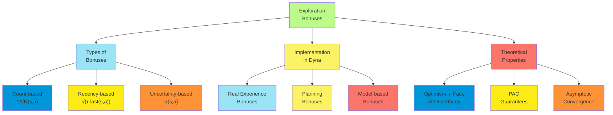

##### Dyna-Q+ Algorithm

Dyna-Q+ is an enhanced version of the Dyna-Q algorithm specifically designed to handle changing environments and
encourage exploration of states that haven't been visited recently. This algorithm addresses a key limitation of the
original Dyna-Q: its potential inability to adapt quickly to environmental changes.

**Algorithm Enhancements**: Dyna-Q+ introduces two key modifications to the standard Dyna-Q algorithm:

1. **Exploration Bonus**: Adds a time-based exploration bonus to both real and simulated experiences
    - Rewards taking actions in states that haven't been visited recently
    - Encourages re-exploration of previously known areas
2. **Model Staleness Tracking**: Keeps track of how long ago each state-action pair was actually experienced
    - Used to compute the exploration bonus
    - Helps identify potentially outdated model information

###### Algorithm Description

The Dyna-Q+ algorithm proceeds as follows:

1. Initialize Q(s,a) arbitrarily for all states and actions
2. Initialize model M(s,a) for all states and actions
3. Initialize τ(s,a) = 0 for all states and actions (time since last visit)
4. Set current time t = 0
5. For each episode:
    1. Initialize state S
    2. Loop for each step of episode:
        1. t = t + 1 (increment time)
        2. Choose action A from S using policy derived from Q (e.g., ε-greedy)
        3. Take action A, observe reward R and next state S'
        4. Direct RL Update with Bonus
            - Exploration bonus: $b = \kappa \cdot \sqrt{\tau(S,A)}$
            - Augmented reward: $\tilde{R} = R + b$
            - $Q(S,A) \leftarrow Q(S,A) + \alpha[\tilde{R} + \gamma\cdot\max_a Q(S',a) - Q(S,A)]$
        5. Model Update
            - $M(S,A) \leftarrow R, S'$ (store result of action A in state S)
            - $\tau(S,A) = 0$ (reset time since last visit)
        6. Planning (Repeat n times)
            1. Select previously observed state-action pair $(S_s, A_s)$ randomly
            2. Retrieve model prediction: $R_s, S'_s \leftarrow M(S_s, A_s)$
            3. Planning Update with Bonus
                - Exploration bonus: $b = \kappa \cdot \sqrt{\tau(S_s,A_s)}$
                - Augmented reward: $\tilde{R}_s = R_s + b$
                - $Q(S_s, A_s) \leftarrow Q(S_s, A_s) + \alpha[\tilde{R}_s + \gamma\cdot\max_a Q(S'_s,a) - Q(S_s, A_s)]$
        7. S ← S'
        8. Update Time Since Last Visit
            - For all state-action pairs (s,a): $\tau(s,a) = \tau(s,a) + 1$
    3. Until S is terminal

**Key Parameters**:

1. **Bonus Coefficient (κ)**: Controls the strength of the exploration incentive
    - Typical values range from 0.1 to 1.0
    - Higher values encourage more aggressive re-exploration
2. **Planning Steps (n)**: Number of model-based updates per real step
    - As in standard Dyna-Q
    - Affects the balance between learning from real vs. simulated experience
3. **Learning Rate (α)**: Controls how quickly value estimates are updated
    - Same considerations as in standard Q-learning and Dyna-Q

**Theoretical Properties**: Dyna-Q+ possesses several important theoretical properties:

1. **Adaptivity**: Guaranteed to eventually adapt to environmental changes, provided they are experienced
2. **Optimality**: Converges to the optimal policy in stationary environments
3. **Exploration Efficiency**: More efficient exploration than random exploration strategies

**Performance Characteristics**: Dyna-Q+ demonstrates distinctive performance in various scenarios:

1. **Static Environments**:
    - Performs similarly to standard Dyna-Q
    - May explore more broadly due to exploration bonuses
2. **Environments with Shortcuts**:
    - Discovers newly available shortcuts much faster than Dyna-Q
    - Exploration bonuses drive re-exploration of previously known areas
3. **Environments with Blockages**:
    - Adapts more quickly to blocked pathways
    - Finds alternative routes with less performance degradation
4. **Gradually Changing Environments**:
    - Maintains performance despite slow environmental drift
    - Continuously updates the model through targeted exploration

The Dyna-Q+ algorithm demonstrates how relatively simple modifications to address model staleness and encourage
re-exploration can significantly improve performance in non-stationary environments, a common challenge in real-world
reinforcement learning applications.

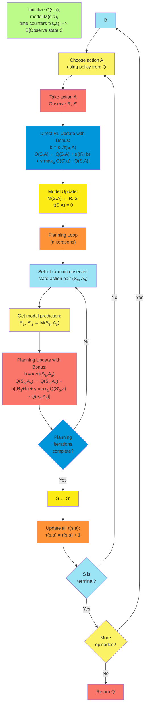

#### Prioritized Sweeping

##### Efficient State Selection

Prioritized sweeping represents a significant enhancement to basic Dyna-style planning by focusing computational
resources on the most promising updates. Rather than selecting states randomly for planning updates, prioritized
sweeping directs attention to states where value changes are likely to be largest, dramatically improving planning
efficiency.

**Core Concept**: The fundamental insight of prioritized sweeping is that not all planning updates are equally useful:

1. **Value Propagation**: When a state's value changes significantly, this change should be propagated to predecessor
   states that lead to it
2. **Update Priority**: The priority of updating a state should be proportional to the expected magnitude of its value
   change
3. **Computational Focus**: Limited computational resources should be directed to high-priority updates

**Priority Measure**: Prioritized sweeping uses a measure of expected value change to prioritize updates:

$$\text{priority}(s,a) = |\text{expected update}| = |r + \gamma \max_{a'} Q(s',a') - Q(s,a)|$$

This measure represents the absolute value of the TD error that would result from updating the state-action pair (s,a).
Larger expected updates receive higher priority.

**Priority Queue**: A priority queue data structure maintains the order of state-action pairs waiting for updates:

1. **Queue Operations**:
    - Insert(item, priority): Add a state-action pair with its priority
    - PopMax(): Remove and return the highest-priority state-action pair
    - Update(item, priority): Change the priority of an existing item
2. **Implementation Options**:
    - Binary heap: O(log n) insertion and removal
    - Fibonacci heap: O(1) insertion, O(log n) removal
    - Bucket queue: Approximate priorities with discrete buckets
3. **Queue Management**:
    - Queue capacity may be limited for computational efficiency
    - Low-priority items may be discarded when the queue is full
    - Priorities may be updated when new information becomes available

**Efficient Backwards Model**: To effectively implement prioritized sweeping, an additional model component is needed:

$$\text{Predecessors}(s',a') = {(s,a) : T(s,a,s') > 0}$$

This component stores the set of state-action pairs that can lead to a given state. It enables efficient backward search
for states affected by value changes.

**Computational Advantages**: The prioritized approach offers several efficiency benefits:

1. **Focused Computation**: Computational resources are directed where they will have the greatest impact
2. **Rapid Value Propagation**: Value information propagates quickly through the state space
3. **Early Termination**: Planning can be stopped at any time with the assurance that the most important updates have
   been performed
4. **Adaptive Computation**: The amount of computation naturally scales with the magnitude of value changes

**State Selection Strategy**: The complete state selection strategy in prioritized sweeping includes:

1. **Initial Priority Assignment**: After real environment steps, assign priority to the experienced state-action pair
2. **Priority Propagation**: When updating a state-action pair, assign priorities to its predecessors based on the
   magnitude of the update
3. **Priority Thresholding**: Only add states to the queue if their priority exceeds a minimum threshold
4. **Queue Processing**: Continue performing updates in priority order until computational budget is exhausted

This approach ensures that computation is focused where it will have the greatest impact on the value function and
resulting policy.

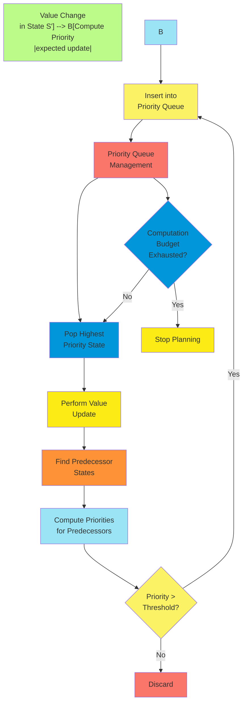

##### Backward Focusing

Backward focusing is a key principle in prioritized sweeping that dramatically improves planning efficiency by
propagating value changes backward through the state space. This approach leverages the structure of the Bellman
equation to focus computation on states where updates will have meaningful impact.

**Value Propagation Mechanics**: To understand backward focusing, consider how value information propagates in
reinforcement learning:

1. **Forward Value Flow**: In typical experience, rewards flow forward temporally:
    - Agent takes action a in state s
    - Observes reward r and next state s'
    - Updates value of (s,a) based on r and V(s')
2. **Backward Update Propagation**: Changes in value propagate backward through the state space:
    - When V(s') changes significantly
    - All states that can lead to s' may need updating
    - These updates may then trigger further backward propagation

**Bellman Equation Structure**: The Bellman equation forms the foundation for backward focusing:

$$Q(s,a) = \sum_{s',r} p(s',r|s,a)[r + \gamma \max_{a'} Q(s',a')]$$

This equation shows that the value of a state-action pair (s,a) depends directly on the values of successor states s'.
When a successor state's value changes, the values of all state-action pairs that can lead to it may need updating.

**Predecessor Tracking**: Efficient backward focusing requires maintaining a predecessor model:

$$\text{Predecessors}(s') = {(s,a) : p(s'|s,a) > 0}$$

This model stores, for each state s', the set of state-action pairs (s,a) that have positive probability of
transitioning to s'. The model enables quick identification of which states might need updating when a state's value
changes.

**Backward Focusing Process**: The process of backward focusing follows these steps:

1. **Value Change Detection**: Identify a state s' whose value has changed significantly
2. **Predecessor Identification**: Use the predecessor model to find all (s,a) pairs that could lead to s'
3. **Update Priority Computation**: Calculate the expected update magnitude for each predecessor
4. **Priority Queue Insertion**: Add predecessors to the priority queue with appropriate priorities
5. **Recursive Propagation**: When updating a predecessor, repeat the process for its predecessors

**Efficiency Advantages**: Backward focusing provides several computational advantages:

1. **Focused Propagation**: Value changes propagate precisely to affected states
2. **Computational Savings**: States unaffected by value changes are not updated needlessly
3. **Rapid Convergence**: Value information flows efficiently through the state space
4. **Path-relevant Updates**: Updates naturally focus on states along promising or changing paths

**Backward vs. Forward Planning**: Backward focusing can be contrasted with forward planning approaches:

1. **Forward Planning**: Starts from current state, considers possible future trajectories
    - Advantages: Focuses on relevant states for current policy
    - Limitations: May not efficiently propagate reward changes backward
2. **Backward Focusing**: Starts from states with value changes, works backward
    - Advantages: Efficiently propagates value changes through state space
    - Limitations: Requires maintaining predecessor model

**Implementation Considerations**: Several factors affect the implementation of backward focusing:

1. **Predecessor Model Size**: Can grow large in environments with many states
2. **Update Thresholds**: Small thresholds capture minor changes but increase computation
3. **Propagation Depth**: How many "layers" backward to propagate updates
4. **Stochastic Transitions**: May require tracking multiple predecessors with different probabilities

The backward focusing approach enables prioritized sweeping to achieve dramatic efficiency improvements over random
state selection, making it practical to perform planning in larger state spaces where random updates would be
prohibitively inefficient.


The backward focusing mechanism in prioritized sweeping creates a recursive process that efficiently propagates value
information through the state space, concentrating computational resources precisely where they will have the greatest
impact on improving the value function.

##### Implementation Details

Effective implementation of prioritized sweeping requires careful attention to several technical details. Understanding
these implementation considerations is essential for achieving the full benefits of the algorithm.

**Complete Algorithm Description**: A comprehensive implementation of prioritized sweeping includes:

1. Initialize Q(s,a) arbitrarily for all states and actions

2. Initialize model M(s,a) and predecessor sets Predecessors(s') for all states

3. Initialize priority queue PQ to empty

4. For each episode: a. Initialize state S b. Loop for each step of episode: i. Choose action A from S using policy
   derived from Q (e.g., ε-greedy) ii. Take action A, observe reward R and next state S'

    iii. **Model Update**: - M(S,A) ← R, S' (store result of action A in state S) - Ensure (S,A) is added to
    Predecessors(S') if not already there

    iv. **Compute Priority**: - p = |R + γ·max<sub>a</sub> Q(S',a) - Q(S,A)| - If p > θ (threshold), insert (S,A) into
    PQ with priority p

    v. **Planning Loop**: Repeat for n iterations or until PQ is empty: 1. If PQ is empty, break 2. (S<sub>p</sub>,
    A<sub>p</sub>) ← PQ.PopMax() (remove highest-priority item) 3. R<sub>p</sub>, S'<sub>p</sub> ← M(S<sub>p</sub>,
    A<sub>p</sub>) (retrieve model prediction) 4. **Update Value**: - Q(S<sub>p</sub>, A<sub>p</sub>) ← Q(S<sub>p</sub>,
    A<sub>p</sub>) + α[R<sub>p</sub> + γ·max<sub>a</sub> Q(S'<sub>p</sub>,a) - Q(S<sub>p</sub>, A<sub>p</sub>)]

    ```
       5. **Propagate to Predecessors**:
          - For each (S<sub>pre</sub>, A<sub>pre</sub>) in Predecessors(S<sub>p</sub>):
            - R<sub>pre</sub>, S'<sub>pre</sub> ← M(S<sub>pre</sub>, A<sub>pre</sub>) (verify S'<sub>pre</sub> = S<sub>p</sub>)
            - p = |R<sub>pre</sub> + γ·max<sub>a</sub> Q(S<sub>p</sub>,a) - Q(S<sub>pre</sub>, A<sub>pre</sub>)|
            - If p > θ, insert/update (S<sub>pre</sub>, A<sub>pre</sub>) in PQ with priority p
    ```

    vi. S ← S' c. Until S is terminal

**Priority Queue Implementation**: The priority queue is a critical component requiring efficient implementation:

1. **Data Structure Options**:
    - Binary heap: Balanced tree offering O(log n) operations
    - Fibonacci heap: Theoretical advantage for priority updates
    - Bucket-based queue: Approximates priorities with discrete buckets
2. **Operation Requirements**:
    - Insert: Add new items with priorities
    - PopMax: Remove and return highest-priority item
    - Update: Change priority of existing items (or insert if not present)
    - Contains: Check if an item is already in the queue
3. **Practical Considerations**:
    - Fixed-capacity implementations may discard low-priority items when full
    - Efficiency often depends on expected queue size
    - Some implementations merge items with similar priorities into buckets

**Predecessor Model Tracking**: Maintaining an efficient predecessor model involves several considerations:

1. **Data Structure**:
    - Hash table mapping states to sets of predecessor state-action pairs
    - Sparse representation for environments with local transitions
    - Potential for approximate methods in very large state spaces
2. **Update Timing**:
    - Predecessors added when transitions are observed
    - May need periodic cleanup to remove obsolete predecessors in changing environments
3. **Memory Optimization**:
    - For deterministic environments, store only one predecessor per next-state
    - Compress or hash state representations to reduce memory footprint
    - Consider approximate methods for very large state spaces

**Threshold Management**: The priority threshold θ significantly affects performance:

1. **Fixed Thresholds**:
    - Simple implementation: constant threshold throughout learning
    - Typical values range from 0.01 to 0.1 times the maximum reward magnitude
2. **Adaptive Thresholds**:
    - Scale with maximum observed priority
    - Adjust based on queue size or computational resources
    - May decrease over time as value function converges
3. **Computational Implications**:
    - Lower thresholds: More updates, potentially greater accuracy
    - Higher thresholds: Fewer updates, potentially faster execution
    - Trade-off between computation and value function accuracy

**Stochastic Environment Handling**: Additional considerations for stochastic environments:

1. **Expected Update Calculation**:
    - For stochastic models, compute expected update across possible next states
    - May require maintaining distributions or samples of observed transitions
2. **Predecessor Probabilities**:
    - Might weight predecessor priorities by transition probabilities
    - Could store only predecessors above probability threshold
3. **Sampling Approaches**:
    - May use sampled transitions rather than full expectations
    - Can combine with experience replay for improved efficiency

These implementation details significantly impact the performance of prioritized sweeping, balancing computational
efficiency with effective value propagation through the state space.

```mermaid
flowchart TD
    A[Prioritized Sweeping<br>Implementation] --> B[Priority Queue<br>Management]
    A --> C[Predecessor Model<br>Tracking]
    A --> D[Threshold<br>Selection]
    A --> E[Stochastic Environment<br>Handling]

    B --> B1["Queue Data Structure<br>(Binary Heap, Fibonacci Heap)"]
    B --> B2["Queue Operations<br>(Insert, PopMax, Update)"]
    B --> B3["Capacity Management<br>(Fixed or Dynamic)"]

    C --> C1["Data Structure<br>(Hash Tables, Sparse Matrices)"]
    C --> C2["Update Mechanism<br>(Add on Observation)"]
    C --> C3["Memory Optimization<br>(Compression, Hashing)"]

    D --> D1["Fixed Threshold<br>(0.01-0.1 × Reward Scale)"]
    D --> D2["Adaptive Threshold<br>(Based on Resources)"]
    D --> D3["Threshold Impact<br>(Computation vs. Accuracy)"]

    E --> E1["Expected Updates<br>(Weighted by Probabilities)"]
    E --> E2["Sampling Approaches<br>(Monte Carlo Estimates)"]
    E --> E3["Transition Distribution<br>Maintenance"]

    style A fill:#BCFB89
    style B fill:#9AE4F5
    style C fill:#FBF266
    style D fill:#FA756A
    style E fill:#0096D9
    style B1 fill:#FCEB14
    style B2 fill:#FE9237
    style B3 fill:#9AE4F5
    style C1 fill:#FBF266
    style C2 fill:#FA756A
    style C3 fill:#0096D9
    style D1 fill:#FCEB14
    style D2 fill:#FE9237
    style D3 fill:#9AE4F5
    style E1 fill:#FBF266
    style E2 fill:#FA756A
    style E3 fill:#0096D9
```

##### Performance Advantages

Prioritized sweeping offers substantial performance advantages over standard Dyna-style planning with random state
selection. These advantages make it a preferred approach for many reinforcement learning applications, particularly
those with larger state spaces or limited computational resources.

**Computational Efficiency**: Prioritized sweeping dramatically improves computational efficiency:

1. **Update Significance**: By focusing on high-magnitude updates, each computation has greater impact on value function
   quality
    - Random updates often modify values by small amounts
    - Prioritized updates target states with largest potential changes
2. **Quantitative Improvement**: Empirical studies show orders of magnitude improvement
    - May achieve equivalent performance with 1/10th to 1/100th the number of updates
    - Particularly significant in environments with sparse rewards or long action sequences
3. **Anytime Operation**: Provides useful results even when computation is interrupted
    - Most important updates performed first
    - Graceful degradation with reduced computational budget

**Value Propagation Speed**: The rate at which value information propagates through the state space is greatly
accelerated:

1. **Backward Chaining Effect**: Value changes efficiently propagate upstream to predecessor states
    - Follows causal chains naturally
    - Focuses computation along relevant pathways
2. **Reward Propagation**: Information about rewards propagates much faster
    - Newly discovered rewards trigger focused backward updates
    - Creates efficient "wavefront" of updates spreading from reward locations
3. **Convergence Rate**: Achieves approximate convergence with far fewer updates
    - Often approaches good policies with logarithmic rather than linear scaling
    - Particularly beneficial in environments with long solution paths

**Comparative Performance**: Prioritized sweeping consistently outperforms alternative approaches:

1. **Vs. Standard Dyna**: Typically 10-100x more efficient for equivalent performance
    - Larger advantages in environments with longer action sequences
    - Greater advantages as state space size increases
2. **Vs. Model-free Methods**: Often 100-1000x more sample-efficient
    - Combines model-based efficiency with prioritized computation
    - Particularly dramatic in environments with delayed rewards
3. **Scaling Behavior**: Advantageous scaling properties with problem size
    - Random selection: Performance degrades rapidly with state space size
    - Prioritized sweeping: Degrades more gracefully by focusing on relevant states

**Environmental Factors**: The advantage of prioritized sweeping varies with environment properties:

1. **State Space Size**: Advantage increases with larger state spaces
    - Random selection becomes increasingly inefficient
    - Focused updates maintain effectiveness
2. **Reward Structure**: Greatest advantage with sparse or delayed rewards
    - Efficiently propagates information from reward locations
    - Creates "wavefronts" of updates spreading from rewards
3. **Solution Path Length**: Advantage increases with longer solution paths
    - Value information must propagate farther
    - Focused propagation maintains efficiency over distance
4. **Stochasticity**: Maintains advantage in stochastic environments
    - Requires managing more predecessors
    - May need more updates for convergence but still maintains efficiency advantage

**Practical Implications**: The performance advantages translate to several practical benefits:

1. **Resource Allocation**: Can achieve good performance with limited computational resources
2. **Real-time Applications**: Enables more responsive planning in time-sensitive scenarios
3. **Larger Problems**: Makes planning practical for problems that would be intractable with random selection
4. **Hybrid Systems**: Effectively combines with other techniques like function approximation

Prioritized sweeping represents one of the most significant algorithmic improvements in model-based reinforcement
learning, demonstrating how intelligent allocation of computational resources can dramatically enhance learning and
planning performance.

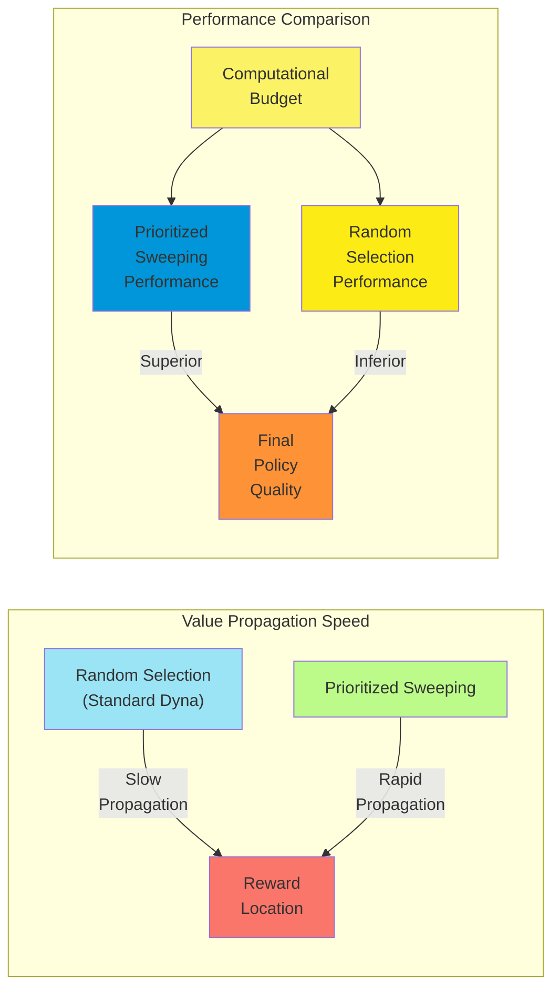

#### Expected vs. Sample Updates

##### Computational Trade-offs

The distinction between expected updates and sample updates represents a fundamental trade-off in reinforcement learning
algorithms. Each approach offers different computational characteristics that significantly impact algorithm performance
and applicability.

**Fundamental Distinction**: The core difference between these update types lies in how they handle the expectation over
next states and rewards:

1. **Expected Updates**: Compute the exact expected value by considering all possible next states and rewards along with
   their probabilities $$Q(s,a) \leftarrow \sum_{s',r} p(s',r|s,a)[r + \gamma \max_{a'} Q(s',a')]$$
2. **Sample Updates**: Use a single sample of next state and reward to approximate the expectation
   $$Q(s,a) \leftarrow Q(s,a) + \alpha[r + \gamma \max_{a'} Q(s',a') - Q(s,a)]$$

**Computational Requirements**: The computational costs of these approaches differ substantially:

1. **Expected Updates**:
    - Time Complexity: O(|S|) per update (must consider all possible next states)
    - Requires full knowledge of transition probabilities
    - Computation increases with environment stochasticity
    - Memory requirements include storing full transition model
2. **Sample Updates**:
    - Time Complexity: O(1) per update (processes only one next state)
    - Works with sampled transitions, no probability knowledge required
    - Computation constant regardless of environment stochasticity
    - Lower memory requirements for model representation

**Update Quality**: The quality of the updates also differs:

1. **Expected Updates**:
    - Exact calculation of expected value (no sampling error)
    - Lower variance in value estimates
    - More accurate for a single update
    - More sample-efficient (extracts maximum information from model)
2. **Sample Updates**:
    - Approximate calculation with sampling error
    - Higher variance in value estimates
    - Less accurate for a single update
    - Less sample-efficient (ignores full distribution information)

**Computational Trade-off Factors**: Several factors influence the optimal choice between expected and sample updates:

1. **State Space Size**:
    - Large state spaces favor sample updates due to computational complexity
    - Expected updates become impractical when the branching factor is high
2. **Transition Stochasticity**:
    - Highly stochastic transitions increase the cost of expected updates
    - With near-deterministic transitions, the approaches become more similar
3. **Computational Budget**:
    - Limited computation favors sample updates (more updates with less computation)
    - Abundant computation may favor expected updates (higher quality per update)
4. **Model Accuracy**:
    - Accurate models favor expected updates (leveraging full model information)
    - Approximate models may not benefit as much from expected calculation

**Hybrid Approaches**: Various hybrid strategies attempt to balance these trade-offs:

1. **Limited Expectation**: Compute expectation over only the most probable next states
2. **Weighted Sampling**: Sample multiple next states with importance weighting
3. **Adaptive Selection**: Use expected updates for critical states, sample updates elsewhere
4. **Parallel Computation**: Leverage parallel hardware to compute expected updates more efficiently

Understanding these computational trade-offs helps in selecting the appropriate update strategy for specific
reinforcement learning applications, considering available computational resources and the characteristics of the
environment being modeled.

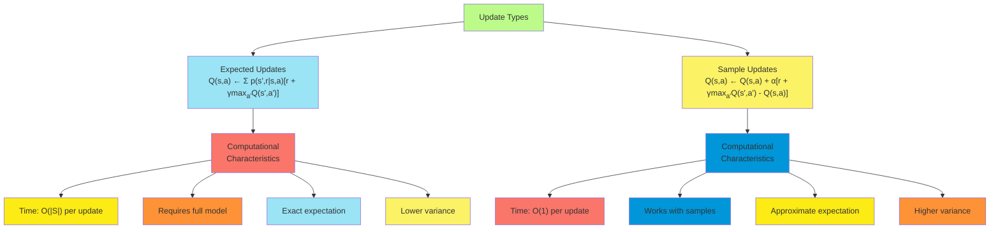

##### Relative Advantages

The choice between expected and sample updates involves trading off various advantages and disadvantages. Understanding
these relative advantages helps in selecting the most appropriate approach for specific reinforcement learning problems.

**Expected Updates Advantages**: Expected updates offer several key benefits:

1. **Statistical Efficiency**:
    - Extracts maximum information from the model
    - Provides exact expected value calculation
    - Eliminates sampling variance in the update
2. **Convergence Properties**:
    - Typically faster asymptotic convergence rate
    - More stable learning trajectories
    - Less susceptible to stochasticity in the environment
3. **Value Accuracy**:
    - More accurate value estimates for a given number of updates
    - Particularly valuable in high-stakes decision scenarios
    - Beneficial for comparing closely-valued alternatives
4. **Policy Evaluation**:
    - Especially efficient for policy evaluation tasks
    - Provides faster convergence to the true value function
    - More reliable for comparing different policies

**Sample Updates Advantages**: Sample updates provide different advantages:

1. **Computational Efficiency**:
    - Much lower computational cost per update
    - Can perform many more updates with the same computational budget
    - Scales better to large state spaces
2. **Model-Free Compatibility**:
    - Directly compatible with model-free learning
    - Easier transition between real and simulated experience
    - Same update rule for both direct RL and planning
3. **Partial Models**:
    - Works with incomplete or approximate models
    - Doesn't require full probability distributions
    - Can operate with generative models that only provide samples
4. **Function Approximation**:
    - More naturally compatible with function approximation
    - Avoids summing over all states when using approximate value functions
    - Standard in deep reinforcement learning implementations

**Environment-Dependent Advantages**: The relative advantages also depend on environment characteristics:

1. **Deterministic Environments**:
    - Advantages of expected updates diminish
    - Sample updates become nearly equivalent in performance
    - Computational efficiency of sample updates prevails
2. **Highly Stochastic Environments**:
    - Expected updates provide greater stability
    - Sample updates require more samples to overcome variance
    - Trade-off shifts toward expected updates despite higher computation
3. **Large State Spaces**:
    - Sample updates become increasingly advantageous
    - Expected updates may become computationally prohibitive
    - Hybrid approaches may be optimal
4. **Sparse Transitions**:
    - When transitions only lead to a few possible next states
    - Expected updates become more computationally feasible
    - Advantage shifts toward expected updates

**Problem Phase Advantages**: The optimal approach may vary depending on the learning phase:

1. **Early Learning**:
    - Sample updates allow broad exploration of value space
    - Computational efficiency enables more updates
    - Crude approximations sufficient for initial learning
2. **Fine-Tuning**:
    - Expected updates provide more precise value estimates
    - Lower variance helps in distinguishing between similar values
    - Worth additional computation for final policy quality
3. **Critical States**:
    - Expected updates valuable for important decision points
    - Sample updates sufficient for routine states
    - Suggests state-dependent adaptive approaches

Understanding these relative advantages enables algorithm designers to make informed choices about update mechanisms,
potentially including hybrid approaches that leverage the strengths of both methods in different contexts.

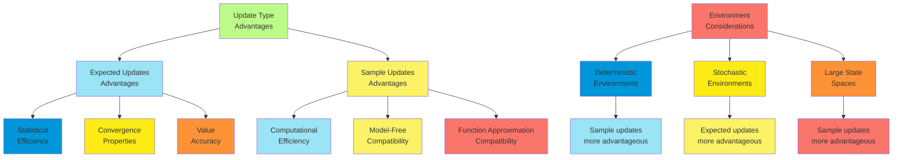

##### Empirical Comparisons

Empirical studies comparing expected and sample updates provide valuable insights into their practical performance
across different reinforcement learning scenarios. These comparisons help bridge the gap between theoretical
considerations and real-world algorithm selection.

**Controlled Studies**: Controlled experimental comparisons reveal several consistent patterns:

1. **Computation-Normalized Performance**:
    - When normalized by computational operations (not updates), sample updates often perform better
    - For equivalent computation time, sample updates typically achieve better policies
    - The performance gap increases with state space size
2. **Sample Efficiency**:
    - Expected updates show superior sample efficiency (performance per environmental sample)
    - Particularly evident in data-limited scenarios
    - Advantage diminishes with abundant data
3. **Convergence Behavior**:
    - Expected updates typically show smoother convergence curves
    - Sample updates exhibit higher variance in learning trajectories
    - Both eventually converge to similar final performance with sufficient updates
4. **Stochasticity Impact**:
    - Advantage of expected updates increases with environment stochasticity
    - In near-deterministic environments, sample updates perform comparably
    - Critical threshold where expected updates become worth the computation

**Benchmark Environments**: Performance across standard reinforcement learning benchmarks:

1. **Grid World Problems**:
    - Small grids (e.g., 10×10): Expected updates often superior
    - Large grids (e.g., 100×100): Sample updates typically superior
    - Stochastic grids: Expected updates maintain advantage longer with scale
2. **Control Problems**:
    - Cart-pole: Sample updates typically sufficient
    - Mountain car: Mixed results depending on discretization
    - Acrobot: Sample updates generally superior due to state space size
3. **Game Environments**:
    - Backgammon: Expected updates valuable due to stochastic transitions
    - Chess/Go: Sample updates necessary due to enormous branching factor
    - Simple card games: Expected updates often beneficial

**Scaling Behavior**: Empirical scaling trends with problem size:

1. **State Space Scaling**:
    - Expected updates: Performance degrades rapidly with state space size
    - Sample updates: More gradual performance degradation
    - Crossover point depends on environment characteristics
2. **Stochasticity Scaling**:
    - Expected updates: Performance relatively stable with increasing stochasticity
    - Sample updates: Performance degrades with increasing stochasticity
    - Trade-off shifts toward expected updates as stochasticity increases
3. **Computational Budget Scaling**:
    - Limited budget: Sample updates typically superior
    - Expanding budget: Expected updates become competitive
    - Very large budget: Expected updates may become superior

**Hybrid Methods Performance**: Empirical results for hybrid approaches:

1. **Limited Expectation Methods**:
    - Often provide excellent compromise between methods
    - Computing expectation over top-k transitions captures most benefits
    - Particularly effective in environments with "fat-tailed" transition distributions
2. **State-Dependent Selection**:
    - Adaptive approaches that select update type based on state characteristics
    - Can outperform either pure approach
    - Computational overhead of decision process may be a factor
3. **Mixture Strategies**:
    - Alternating between update types can be effective
    - Ratios of 80% sample to 20% expected often work well
    - Particularly valuable in anytime settings with variable computation

These empirical findings provide practical guidance for algorithm selection and highlight the importance of considering
the specific characteristics of the reinforcement learning problem at hand when choosing between expected and sample
updates.

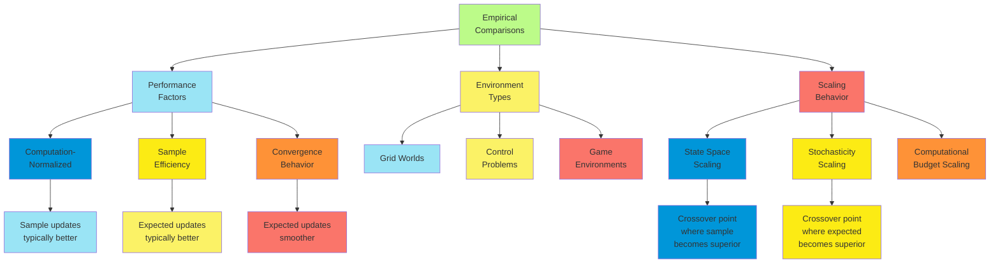

##### Application Guidelines

Based on theoretical understanding and empirical evidence, several practical guidelines emerge for choosing between
expected and sample updates in reinforcement learning applications. These guidelines help practitioners make informed
decisions that balance computational efficiency with learning performance.

**Problem Characteristic Assessment**: Begin by assessing key characteristics of the reinforcement learning problem:

1. **State Space Size**:
    - Small (|S| < 1,000): Expected updates may be practical
    - Medium (1,000 < |S| < 100,000): Consider hybrid approaches
    - Large (|S| > 100,000): Sample updates typically necessary
2. **Stochasticity Level**:
    - Deterministic: Sample updates sufficient (one sample captures full distribution)
    - Mildly stochastic: Sample updates with multiple samples per state
    - Highly stochastic: Expected updates if computationally feasible
3. **Transition Sparsity**:
    - Dense (many possible next states): Sample updates more appropriate
    - Sparse (few possible next states): Expected updates become more practical
    - Very sparse (1-3 next states): Expected updates likely superior
4. **Computational Constraints**:
    - Severely limited: Sample updates only
    - Moderate: Hybrid or adaptive approaches
    - Abundant: Consider expected updates for critical states

**Decision Framework**: A structured decision process for selecting the update approach:

1. **If state space is very small AND transitions are known**:
    - Use expected updates for maximum sample efficiency
    - Example: Small grid worlds, simple games
2. **If state space is very large OR model is generative only**:
    - Use sample updates for computational feasibility
    - Example: Visual domains, continuous control problems
3. **If sample collection is expensive BUT computation is cheap**:
    - Prefer expected updates to extract maximum information from samples
    - Example: Robotics, industrial control systems
4. **If computation is limited BUT samples are abundant**:
    - Prefer sample updates to maximize updates per computation
    - Example: Simulated environments, video games
5. **If accuracy requirements are high**:
    - Consider expected updates at least for critical states
    - Example: Safety-critical applications, medical decisions

**Hybrid Strategy Guidelines**: For scenarios where hybrid approaches are appropriate:

1. **Limited Expectation Approach**:
    - Compute expectation over top-k transitions (typically k=3-5)
    - Especially effective when transition probabilities follow power law
2. **State-Importance Weighting**:
    - Use expected updates for states with high value or visitation frequency
    - Use sample updates for less important states
3. **Adaptive Computation Allocation**:
    - Begin with sample updates during early exploration
    - Transition to expected updates for fine-tuning
    - Adjust balance based on observed performance improvements
4. **Uncertainty-Based Selection**:
    - Use expected updates where value uncertainty is high
    - Use sample updates where values are more certain
    - Can be implemented with upper confidence bound methods

**Implementation Recommendations**: Practical implementation advice based on update choice:

1. **For Expected Updates**:
    - Cache transition probabilities and next-state values where possible
    - Consider parallel computation for independent next states
    - Implement sparse representations for transition matrices
2. **For Sample Updates**:
    - Use higher learning rates initially then decay
    - Consider averaging over multiple samples when affordable
    - Implement variance reduction techniques like control variates
3. **For Hybrid Approaches**:
    - Maintain flexibility to adjust the balance based on performance
    - Monitor computational cost vs. performance improvement
    - Consider meta-learning the optimal mix for the specific problem

Following these application guidelines helps practitioners select the most appropriate update mechanism for their
specific reinforcement learning problem, balancing theoretical considerations with practical constraints.

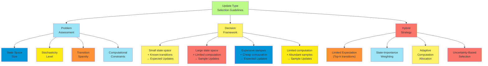

These application guidelines provide a structured approach to selecting the appropriate update mechanism for
reinforcement learning problems, helping balance theoretical performance with practical implementation considerations.

#### Trajectory Sampling

##### State Distribution for Updates

The distribution of states used for updates in planning algorithms significantly impacts efficiency and performance.
Trajectory sampling represents an approach that focuses planning updates on states that are likely to be encountered
under the current policy, rather than attempting to update all states uniformly.

**The State Distribution Problem**: In large state spaces, it becomes impractical to update all states with equal
frequency:

1. **Uniform State Distribution**:
    - Treats all states equally
    - Wastes computation on irrelevant or unreachable states
    - Becomes increasingly inefficient as state space grows
2. **Relevant State Distribution**:
    - Focuses computation on states that matter for current policy
    - Requires identifying which states are most relevant
    - Changes dynamically as the policy improves

**Trajectory Sampling Concept**: Trajectory sampling addresses this challenge by:

1. **Policy-Based Sampling**: Generating state sequences by following the current policy
2. **Natural Relevance**: States that appear frequently in trajectories receive more updates
3. **Dynamic Adaptation**: As the policy changes, the state distribution automatically adjusts

**Mathematical Formulation**: Trajectory sampling can be formalized using state visitation distributions:

$$d^\pi(s) = \lim_{t \rightarrow \infty} P(S_t = s | \pi)$$

This distribution represents the probability of being in state $s$ when following policy $\pi$ for a long time.
Trajectory sampling naturally approximates this distribution through simulation.

**State Sampling Mechanisms**: Several approaches exist for generating state samples for planning:

1. **On-policy Trajectory Sampling**:
    - Generate trajectories by following current policy $\pi$
    - Update states encountered along these trajectories
    - Natural focus on relevant states
2. **Starting State Distribution**:
    - Begin trajectories from meaningful starting states
    - May use environment's natural starting distribution
    - Can be modified to emphasize certain regions
3. **Recency-Weighted Sampling**:
    - Sample more frequently from recently visited states
    - Combines trajectory structure with recency bias
    - Useful for non-stationary environments
4. **Reward-Weighted Sampling**:
    - Emphasize trajectories that achieved higher rewards
    - Creates focus on successful paths
    - May use techniques like importance sampling

**Efficiency Benefits**: Trajectory sampling provides several efficiency advantages:

1. **Computational Focus**: Directs computation to states that impact policy performance
2. **Automatic Prioritization**: States visited more frequently receive more updates
3. **Scaling Properties**: Remains effective even in very large state spaces
4. **Dynamic Adaptation**: Naturally adapts as policy and value function evolve

**Contrasting with Random Sampling**: Trajectory sampling differs fundamentally from random state selection:

1. **State Relevance**: Focuses on actually encountered states versus any state
2. **Structure Preservation**: Maintains the sequential nature of the problem
3. **Policy Dependence**: Distribution changes automatically with the policy
4. **Computational Scaling**: Effectively handles much larger state spaces

Understanding how the state distribution affects planning performance is crucial for developing efficient reinforcement
learning algorithms, particularly in large or complex environments where comprehensive updates are impractical.

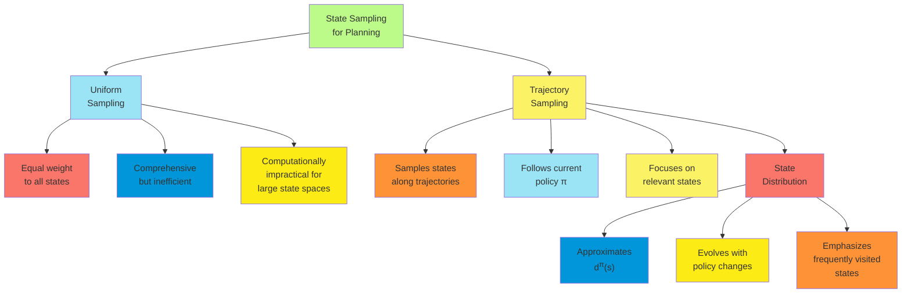

##### On-policy Distribution

The on-policy state distribution represents a fundamental concept in trajectory sampling, focusing planning on states
that are actually encountered when following the current policy. This approach allows reinforcement learning algorithms
to allocate computational resources efficiently, particularly in large state spaces.

**Definition and Properties**: The on-policy distribution has several important characteristics:

1. **Formal Definition**: $$d^\pi(s) = \lim_{t \rightarrow \infty} P(S_t = s | \pi)$$ This represents the probability of
   being in state $s$ when following policy $\pi$ for a long time.
2. **Markov Chain Perspective**:
    - Following policy $\pi$ induces a Markov chain over states
    - The on-policy distribution is the stationary distribution of this chain
    - For ergodic MDPs, this distribution exists and is unique
3. **Relationship to Performance**:
    - States with high $d^\pi(s)$ contribute more to overall performance
    - Improving value estimates for these states has greater impact
    - Natural alignment with performance-relevant computations

**Sampling from the On-policy Distribution**: Several methods exist for generating samples according to the on-policy
distribution:

1. **Direct Simulation**:
    - Follow the current policy from a starting state
    - Record states encountered along the trajectory
    - Continue until sufficient samples are obtained
2. **Continuing Environments**:
    - Maintain a single ongoing trajectory
    - Update the policy periodically
    - Sample states directly from the continuing trajectory
3. **Episodic Environments**:
    - Generate complete episodes following $\pi$
    - Sample states from these episodes
    - May weight earlier or later states differently
4. **Starting State Selection**:
    - Selection of starting states affects early distribution
    - With long trajectories, effect of starting distribution diminishes
    - May use environment's natural starting distribution or modified version

**Mathematical Properties**: The on-policy distribution has important mathematical characteristics:

1. **Decomposition of Expected Return**: $$J(\pi) = \sum_s d^\pi(s) \sum_a \pi(a|s) \sum_{s',r} p(s',r|s,a) r$$ This
   shows how the expected return depends on the on-policy distribution.
2. **Policy Gradient Relationship**:
    - Policy gradient methods often use $d^\pi(s)$ in their derivation
    - Natural alignment with policy improvement objectives
3. **Weighted Importance**:
    - States with higher $d^\pi(s)$ contribute proportionally more to performance
    - Computational resources allocated according to this natural weighting

**Adaptation with Policy Changes**: As the policy improves, the on-policy distribution changes:

1. **Distribution Shift**:
    - Better policies focus on more rewarding state trajectories
    - Distribution automatically shifts to emphasize these states
    - Creates a natural curriculum of increasingly relevant states
2. **Exploration-Exploitation Balance**:
    - More exploratory policies have broader distributions
    - More exploitative policies have more focused distributions
    - Exploration parameters affect distributional breadth
3. **Convergence Behavior**:
    - As policy approaches optimality, distribution stabilizes
    - Focus narrows to states relevant for optimal performance
    - Creates efficient computational allocation in late learning

The on-policy distribution provides a natural and efficient focus for planning updates, aligning computational effort
with the states that matter most for current policy performance.

```mermaid
flowchart TD
    A["On-policy<br>Distribution<br>d<sup>π</sup>(s)] --> B[Generation<br>Methods"]
    A --> C[Mathematical<br>Properties]
    A --> D[Policy<br>Dependence]

    B --> B1["Direct<br>Simulation"]
    B --> B2["Continuing<br>Trajectories"]
    B --> B3["Episodic<br>Sampling"]

    C --> C1["Stationary Distribution<br>of Policy Markov Chain"]
    C --> C2["Relates to<br>Expected Return"]
    C --> C3["Weighs States by<br>Visitation Frequency"]

    D --> D1["Shifts as Policy<br>Improves"]
    D --> D2["Exploratory Policies:<br>Broader Distribution"]
    D --> D3["Optimal Policy:<br>Focused Distribution"]

    style A fill:#BCFB89
    style B fill:#9AE4F5
    style C fill:#FBF266
    style D fill:#FA756A
    style B1 fill:#0096D9
    style B2 fill:#FCEB14
    style B3 fill:#FE9237
    style C1 fill:#9AE4F5
    style C2 fill:#FBF266
    style C3 fill:#FA756A
    style D1 fill:#0096D9
    style D2 fill:#FCEB14
    style D3 fill:#FE9237
```

##### Efficiency Considerations

Trajectory sampling introduces important efficiency considerations that significantly impact the performance of planning
algorithms. Understanding these factors helps in designing and implementing effective reinforcement learning systems
that make optimal use of available computational resources.

**Computational Efficiency**: Trajectory sampling offers substantial computational advantages:

1. **Selective Computation**:
    - Updates focused on states that matter for policy performance
    - Avoids wasting computation on irrelevant or unreachable states
    - Creates natural computational prioritization
2. **Scaling with State Space Size**:
    - Computational requirements scale with trajectory length, not state space size
    - Remains effective even in extremely large state spaces
    - Critical advantage for complex environments
3. **Update Density**:
    - States along common trajectories receive more frequent updates
    - Creates higher update density in policy-relevant regions
    - Automatically balances breadth vs. depth of planning

**Sample Complexity**: Trajectory sampling has implications for sample efficiency:

1. **Sample Reuse**:
    - Each trajectory provides updates for multiple states
    - Sequential structure allows information propagation along paths
    - Efficiently reuses experience for multiple updates
2. **Exploration-Exploitation Balance**:
    - More exploratory policies generate broader sample coverage
    - More exploitative policies focus samples on promising regions
    - Balance affects sampling efficiency
3. **Diminishing Returns**:
    - Initial sampling of common trajectories provides large performance gains
    - Additional sampling of same trajectories yields diminishing returns
    - Suggests adaptive approaches that vary exploration

**Implementation Considerations**: Several practical implementation factors affect efficiency:

1. **Trajectory Length**:
    - Longer trajectories require more computation but explore more broadly
    - Shorter trajectories focus more intensely on immediate consequences
    - Optimal length depends on problem horizon and discount factor
2. **Update Frequency**:
    - States may be updated each time they are encountered
    - Alternatively, updates may be performed periodically
    - Trade-off between update frequency and computational cost
3. **Starting State Selection**:
    - Distribution of starting states affects overall coverage
    - Strategic selection can improve exploration efficiency
    - May combine random starts with policy-based continuation
4. **Adaptive Approaches**:
    - Vary trajectory parameters based on learning progress
    - More exploration early, more exploitation later
    - Can significantly improve overall efficiency

**Memory Efficiency**: Trajectory sampling has important memory implications:

1. **State Representation**:
    - Need only represent states actually encountered
    - Can use sparse or approximate representations
    - Significant memory savings in large state spaces
2. **Experience Storage**:
    - May store trajectories for replay
    - Selective storage focusing on informative transitions
    - Potential for experience compression
3. **Model Representation**:
    - Model may focus on transitions along common trajectories
    - Sparse or structured model representations
    - Prioritize modeling accuracy for frequently encountered transitions

**Algorithm-Specific Efficiency**: Different planning algorithms leverage trajectory sampling in specific ways:

1. **Dyna with Trajectory Sampling**:
    - Generate model updates from on-policy trajectories
    - Plan using states from similar trajectories
    - Integrates naturally with exploration bonuses
2. **Prioritized Sweeping with Trajectories**:
    - Initialize priority queue with trajectory states
    - Propagate updates backward through trajectories
    - Natural integration of priority and relevance
3. **Real-time Dynamic Programming**:
    - Updates states along actual or simulated trajectories
    - Combines recency and relevance naturally
    - Discussed in more detail in following sections

These efficiency considerations make trajectory sampling a powerful approach for scaling reinforcement learning to
complex environments with large state spaces.

```mermaid
flowchart TD
    A[Trajectory Sampling<br>Efficiency] --> B[Computational<br>Advantages]
    A --> C[Implementation<br>Factors]
    A --> D[Memory<br>Considerations]

    B --> B1["Selective focus<br>on relevant states"]
    B --> B2["Scales with trajectory<br>length, not state space"]
    B --> B3["Higher update density<br>in common regions"]

    C --> C1["Trajectory<br>Length"]
    C --> C2["Update<br>Frequency"]
    C --> C3["Starting State<br>Selection"]
    C --> C4["Adaptive<br>Exploration"]

    D --> D1["Sparse state<br>representation"]
    D --> D2["Selective experience<br>storage"]
    D --> D3["Focused model<br>representation"]

    style A fill:#BCFB89
    style B fill:#9AE4F5
    style C fill:#FBF266
    style D fill:#FA756A
    style B1 fill:#0096D9
    style B2 fill:#FCEB14
    style B3 fill:#FE9237
    style C1 fill:#9AE4F5
    style C2 fill:#FBF266
    style C3 fill:#FA756A
    style C4 fill:#0096D9
    style D1 fill:#FCEB14
    style D2 fill:#FE9237
    style D3 fill:#9AE4F5
```

##### Empirical Results

Empirical studies of trajectory sampling provide valuable insights into its practical benefits and limitations across
various reinforcement learning domains. These results help guide implementation decisions and understand when trajectory
sampling is most advantageous.

**Comparative Performance**: Studies comparing trajectory sampling with uniform state sampling reveal:

1. **Large State Spaces**:
    - Trajectory sampling shows dramatic advantages in large domains
    - Performance gap widens as state space increases
    - Uniform sampling becomes completely impractical beyond certain sizes
2. **Sparse Reward Environments**:
    - Trajectory sampling more effectively propagates sparse rewards
    - Focuses computation along promising paths once discovered
    - Creates more efficient "reward propagation wavefronts"
3. **Complex Path Problems**:
    - Environments requiring long action sequences
    - Trajectory sampling maintains path-relevant states in focus
    - Uniform sampling dilutes computation across irrelevant states

**Scaling Behavior**: Empirical scaling results show distinctive patterns:

1. **Computation vs. Performance**:
    - Trajectory sampling: Near-linear improvement with computation
    - Uniform sampling: Sub-linear (often logarithmic) improvement
    - Gap increases with problem size and complexity
2. **State Space Size Impact**:
    - Trajectory sampling: Performance relatively stable with increasing state space
    - Uniform sampling: Performance degrades rapidly with larger state spaces
    - Critical for applications in high-dimensional domains
3. **Sample Complexity**:
    - Trajectory sampling: Often achieves good performance with O(n) samples
    - Uniform sampling: May require O(n²) or worse
    - Particularly evident in maze-like environments with long paths

**Environmental Factors**: The advantage of trajectory sampling varies with environment characteristics:

1. **Environment Structure**:
    - Highly structured environments (e.g., mazes): Large advantage for trajectory sampling
    - Uniform connectivity (e.g., grid with no walls): Smaller but still significant advantage
    - Bottleneck states: Trajectory sampling naturally focuses on critical junctures
2. **Transition Stochasticity**:
    - Deterministic: Strong advantage for trajectory sampling
    - Moderately stochastic: Maintains advantage but requires longer trajectories
    - Highly stochastic: Advantage decreases as paths become less consistent
3. **Reward Distribution**:
    - Sparse rewards: Substantial advantage for trajectory sampling
    - Dense rewards: Smaller but still significant advantage
    - Terminal-only rewards: Dramatic advantage in longer episodes

**Implementation Variations**: Studies of different implementation approaches show:

1. **Trajectory Length**:
    - Longer trajectories: Better exploration of consequence chains
    - Shorter trajectories: More focused updates in familiar regions
    - Optimal length often correlates with problem horizon
2. **Starting State Selection**:
    - Environment start states: Natural alignment with task
    - Random start states: Better coverage but potentially less relevant
    - Hybrid approaches: Often provide best overall performance
3. **Update Frequency**:
    - Every-visit updates: Maximum information extraction
    - First-visit only: Reduces update correlation
    - Adaptive frequency: Can optimize computation-performance trade-off

**Benchmark Results**: Performance on specific reinforcement learning benchmarks:

1. **Grid World Domains**:
    - Trajectory sampling consistently outperforms uniform
    - Advantage increases with grid size and complexity
    - Particularly evident in mazes with narrow solutions
2. **Control Problems**:
    - Cart-pole: Moderate advantage for trajectory sampling
    - Mountain car: Significant advantage, especially with sparse rewards
    - Acrobot: Large advantage due to complex dynamics and delayed rewards
3. **Game Environments**:
    - Backgammon: Trajectory sampling focuses on likely game positions
    - Chess/Go: Essential for managing enormous state spaces
    - Game trees: Natural alignment with game progression

These empirical results establish trajectory sampling as a critical technique for scaling reinforcement learning to
complex environments with large state spaces, providing strong evidence for its practical advantage over uniform state
sampling approaches.

```mermaid
flowchart TD
    A[Empirical Results<br>Trajectory Sampling] --> B[Performance<br>Comparison]
    A --> C[Scaling<br>Behavior]
    A --> D[Environmental<br>Factors]

    B --> B1["Large State Spaces:<br>Major Advantage"]
    B --> B2["Sparse Rewards:<br>Efficient Propagation"]
    B --> B3["Complex Paths:<br>Maintains Focus"]

    C --> C1["Near-Linear Performance<br>Improvement"]
    C --> C2["Stable with Increasing<br>State Space Size"]
    C --> C3["Lower Sample<br>Complexity"]

    D --> D1["Structured Environments:<br>Larger Advantage"]
    D --> D2["Deterministic Transitions:<br>Stronger Benefit"]
    D --> D3["Sparse Rewards:<br>Critical Advantage"]

    style A fill:#BCFB89
    style B fill:#9AE4F5
    style C fill:#FBF266
    style D fill:#FA756A
    style B1 fill:#0096D9
    style B2 fill:#FCEB14
    style B3 fill:#FE9237
    style C1 fill:#9AE4F5
    style C2 fill:#FBF266
    style C3 fill:#FA756A
    style D1 fill:#0096D9
    style D2 fill:#FCEB14
    style D3 fill:#FE9237
```

#### Real-time Dynamic Programming

##### RTDP Algorithm

Real-Time Dynamic Programming (RTDP) represents a powerful integration of trajectory sampling with dynamic programming
principles. This algorithm focuses computational resources on the states most relevant to the agent's current situation,
making it particularly effective for large state spaces where comprehensive updates are impractical.

**Core Concept**: RTDP combines several key ideas:

1. **Selective Value Iteration**: Applies dynamic programming updates only to states encountered along trajectories
2. **On-policy Sampling**: Generates trajectories by following the greedy policy with respect to current value estimates
3. **Anytime Operation**: Produces useful policies at any point during computation
4. **Focused Computation**: Concentrates updates on states relevant to achieving goals from the current state

**Algorithm Description**: The RTDP algorithm proceeds as follows:

1. Initialize value function V(s) for all states (typically optimistically for exploration)
2. Repeat: a. Start from initial state s₀ b. While not at a terminal state: i. Select action a = argmax<sub>a</sub>
   [r(s, a) + γ·∑<sub>s'</sub> p(s'|s,a)·V(s')] ii. Update V(s) ← max<sub>a</sub> [r(s, a) + γ·∑<sub>s'</sub>
   p(s'|s,a)·V(s')] iii. Execute action a, observe next state s' iv. s ← s' c. Until convergence criterion is met or
   computation budget exhausted

**Key Properties**: RTDP has several distinctive characteristics:

1. **Asynchronous Updates**: Unlike standard value iteration, RTDP updates states asynchronously along trajectories
2. **Greedy Action Selection**: Uses the current value function to select actions greedily
3. **Trial-based Structure**: Organizes computation into complete trajectories or "trials"
4. **Focused Value Propagation**: Value information propagates efficiently along likely paths

**Optimistic Initialization**: RTDP typically uses optimistic initialization of the value function:

1. **Exploration Encouragement**: Optimistic values encourage exploration of unfamiliar states
2. **Convergence Direction**: Values can only decrease during updates (under appropriate conditions)
3. **Implementation**: Often initializes to estimated upper bounds on optimal values

**Convergence Properties**: RTDP has strong theoretical convergence guarantees:

1. **Asymptotic Convergence**: Under appropriate conditions, RTDP converges to the optimal value function for all
   relevant states
2. **Relevant State Coverage**: Focuses convergence on states reachable from the start state under the optimal policy
3. **Bounded Bellman Residual**: The maximum Bellman error for relevant states approaches zero

**Variations and Extensions**: Several important variations of the basic RTDP algorithm exist:

1. **Bounded RTDP (BRTDP)**:
    - Maintains both upper and lower bounds on state values
    - Focuses updates on states with large bound gaps
    - Provides formal convergence criteria
2. **Labeled RTDP (LRTDP)**:
    - Labels states as "solved" when their values are sufficiently accurate
    - Avoids unnecessary updates to solved states
    - Accelerates convergence in many domains
3. **Focused RTDP**:
    - Selects actions partially based on uncertainty reduction
    - Balances exploitation and exploration
    - Often combined with bound-based approaches

RTDP represents a powerful approach for handling large state spaces efficiently, combining the mathematical foundation
of dynamic programming with the practical focus of trajectory sampling.

```mermaid
flowchart TD
    A["Initialize V(s)<br>optimistically] --> B[Start from<br>initial state s₀"]
    B --> C["Select greedy action<br>a = argmax<sub>a</sub> Q(s,a)"]
    C --> D["Update value:<br>V(s) ← max<sub>a</sub> Q(s,a)"]
    D --> E[Execute action a<br>observe next state s']
    E --> F{Is s'<br>terminal?}
    F -->|No| G[s ← s']
    G --> C
    F -->|Yes| H{Convergence<br>or budget<br>exhausted?}
    H -->|No| B
    H -->|Yes| I[Return V]

    style A fill:#BCFB89
    style B fill:#9AE4F5
    style C fill:#FBF266
    style D fill:#FA756A
    style E fill:#0096D9
    style F fill:#FCEB14
    style G fill:#FE9237
    style H fill:#9AE4F5
    style I fill:#FBF266
```

##### On-policy Trajectory Sampling

In Real-Time Dynamic Programming (RTDP), on-policy trajectory sampling plays a central role in focusing computation
efficiently. This approach ensures that planning resources are allocated to states that are most likely to be
encountered when following the current greedy policy.

**On-policy Sampling Mechanism**: RTDP implements on-policy trajectory sampling through:

1. **Greedy Action Selection**:
    - At each state, select action a = argmax<sub>a</sub> [r(s, a) + γ·∑<sub>s'</sub> p(s'|s,a)·V(s')]
    - Represents the current best policy based on value estimates
    - Creates trajectories that follow the evolving policy
2. **Model-Based Simulation**:
    - Uses the environment model to simulate transitions
    - May use expected or sample-based updates
    - Enables planning without actual environment interaction
3. **Complete Trajectories**:
    - Follows each trajectory until reaching a terminal state
    - Ensures value information propagates completely through relevant paths
    - Creates natural "trials" or episodes for planning

**Dynamically Evolving Focus**: The on-policy sampling creates a dynamic computational focus:

1. **Policy-driven State Distribution**:
    - As value function improves, the policy changes
    - Changed policy leads to different trajectory distributions
    - Computational focus automatically shifts to newly relevant states
2. **Implicit Prioritization**:
    - States along common trajectories receive more updates
    - Naturally prioritizes states based on their relevance to current policy
    - Creates efficient allocation of computation without explicit priorities
3. **Exploration-Exploitation Balance**:
    - Optimistic initialization encourages exploration
    - Greedy action selection promotes exploitation
    - Balance shifts toward exploitation as values become more accurate

**Advantages in RTDP Context**: On-policy trajectory sampling provides several benefits specific to RTDP:

1. **Connection to Final Policy**:
    - States updated are precisely those that matter for the evolving policy
    - Creates natural alignment between planning and execution
    - Avoids wasted computation on irrelevant states
2. **Goal-directed Focus**:
    - Trajectories naturally focus on paths toward goals
    - Value information propagates efficiently along goal-directed paths
    - Creates "wavefront" of value propagation from goals to starting states
3. **Anytime Properties**:
    - Even with partial computation, updated states are those needed for execution
    - Provides useful policies at any point during computation
    - Graceful performance degradation with limited planning time

**Impact on Convergence**: The on-policy sampling approach affects RTDP's convergence characteristics:

1. **Selective Convergence**:
    - Values converge for states relevant to optimal policy
    - May never update irrelevant or unreachable states
    - Creates efficient focus on the "relevant state space"
2. **Convergence Rate**:
    - Faster convergence for frequently visited states
    - Natural correlation between state importance and update frequency
    - Theoretical convergence guarantees for all relevant states
3. **Asymptotic Behavior**:
    - As policy approaches optimality, trajectory distribution stabilizes
    - Creates increasingly focused computation in late stages
    - Efficiently refines values along optimal paths

The on-policy trajectory sampling mechanism in RTDP creates a powerful synergy between planning and execution, naturally
focusing computational resources on states that matter most for performance.

```mermaid
flowchart TD
    A[On-policy<br>Trajectory Sampling<br>in RTDP] --> B[Generation<br>Mechanism]
    A --> C[Evolving<br>Focus]
    A --> D[Convergence<br>Impact]

    B --> B1["Greedy Action<br>Selection"]
    B --> B2["Model-Based<br>Simulation"]
    B --> B3["Complete<br>Trajectories"]

    C --> C1["Policy-driven<br>State Distribution"]
    C --> C2["Implicit<br>Prioritization"]
    C --> C3["Exploration-Exploitation<br>Balance"]

    D --> D1["Selective State<br>Convergence"]
    D --> D2["Frequency-based<br>Convergence Rate"]
    D --> D3["Focus on<br>Relevant States"]

    style A fill:#BCFB89
    style B fill:#9AE4F5
    style C fill:#FBF266
    style D fill:#FA756A
    style B1 fill:#0096D9
    style B2 fill:#FCEB14
    style B3 fill:#FE9237
    style C1 fill:#9AE4F5
    style C2 fill:#FBF266
    style C3 fill:#FA756A
    style D1 fill:#0096D9
    style D2 fill:#FCEB14
    style D3 fill:#FE9237
```

##### Convergence Properties

Real-Time Dynamic Programming (RTDP) possesses important theoretical convergence properties that establish its
mathematical foundation and explain its practical effectiveness in large state spaces. Understanding these properties
helps in applying RTDP effectively and interpreting its behavior.

**Asymptotic Convergence**: Under appropriate conditions, RTDP converges to the optimal value function:

1. **Convergence Theorem**:
    - For all states s reachable from initial states under the optimal policy
    - V(s) converges to V\*(s) with probability 1
    - Requires: admissible initial values, proper problem formulation
2. **Convergence Scope**:
    - Focuses on the "relevant state space"
    - May not update or converge for irrelevant states
    - Efficient focus on states that matter for performance
3. **Rate of Convergence**:
    - Faster convergence for frequently visited states
    - Slower convergence for states visited rarely
    - Naturally aligns convergence rate with state importance

**Conditions for Convergence**: Several conditions affect RTDP's convergence:

1. **Admissible Initialization**:

    - Initial values must be optimistic (V(s) ≥ V\*(s))
    - Ensures monotonic convergence from above
    - Essential for exploration and convergence guarantees

2. **Exploration Requirements**:

    - All relevant states must be visited infinitely often
    - Guaranteed by greedy action selection with optimistic initialization
    - Exploration becomes increasingly focused as learning progresses

3. **Problem Characteristics**:

    - Finite state and action spaces

    - Well-defined goal states or proper cost formulation

    - Bounded rewards

    - Discounted reward formulation (γ < 1) or absorbing goal states

**Convergence Metrics**: Several metrics help assess RTDP's convergence:

1. **Bellman Residual**:
    - Measures the maximum difference between successive value updates
    - Converges to zero for all relevant states
    - Often used as a practical stopping criterion
2. **Value Function Stability**:
    - The change in value estimates between trials
    - Decreasing changes indicate approaching convergence
    - May stabilize unevenly across the state space
3. **Policy Stability**:
    - Frequency of policy changes during learning
    - Convergence leads to stable greedy policy
    - Often stabilizes before complete value convergence

**Convergence Acceleration Techniques**: Several approaches can accelerate RTDP's convergence:

1. **Bounded RTDP**:
    - Maintains upper and lower bounds on state values
    - Prioritizes states with large bound gaps
    - Provides formal convergence criteria
2. **Labeled RTDP**:
    - Labels states as "solved" when values are near-optimal
    - Skips solved states in future trajectories
    - Provides significant computational savings
3. **State Aggregation**:
    - Groups similar states for faster information propagation
    - Updates multiple states simultaneously
    - Creates coarse-to-fine convergence pattern

**Partial Convergence Properties**: RTDP has important partial convergence characteristics:

1. **Anytime Behavior**:
    - Provides useful policies before full convergence
    - Prioritizes states relevant to current execution
    - Graceful performance with limited computation
2. **Policy Quality Improvement**:
    - Policy quality improves monotonically with computation
    - Early computation provides largest performance gains
    - Follows law of diminishing returns
3. **State-dependent Convergence**:
    - States closer to goals typically converge faster
    - States along optimal paths converge before alternatives
    - Creates "wavefront" of convergence sweeping backward from goals

These convergence properties make RTDP particularly valuable for large problems where complete convergence may be
impractical, but good performance is needed with limited computational resources.

```mermaid
flowchart TD
    A[RTDP Convergence<br>Properties] --> B[Asymptotic<br>Convergence]
    A --> C[Convergence<br>Conditions]
    A --> D[Acceleration<br>Techniques]

    B --> B1["V(s) → V*(s)<br>for relevant states"]
    B --> B2["Selective state<br>convergence"]
    B --> B3["Visit-frequency<br>dependent rate"]

    C --> C1["Admissible<br>initialization"]
    C --> C2["Sufficient<br>exploration"]
    C --> C3["Problem<br>formulation"]

    D --> D1["Bounded RTDP<br>(dual bounds)"]
    D --> D2["Labeled RTDP<br>(solved states)"]
    D --> D3["State<br>aggregation"]

    style A fill:#BCFB89
    style B fill:#9AE4F5
    style C fill:#FBF266
    style D fill:#FA756A
    style B1 fill:#0096D9
    style B2 fill:#FCEB14
    style B3 fill:#FE9237
    style C1 fill:#9AE4F5
    style C2 fill:#FBF266
    style C3 fill:#FA756A
    style D1 fill:#0096D9
    style D2 fill:#FCEB14
    style D3 fill:#FE9237
```

##### Example Applications

Real-Time Dynamic Programming (RTDP) has been successfully applied to a wide range of reinforcement learning problems,
demonstrating its practical utility across diverse domains. These applications highlight RTDP's strengths in handling
large state spaces with selective computation.

**Navigation and Path Planning**: RTDP has shown strong performance in navigation domains:

1. **Robot Navigation**:
    - Efficiently plans paths through complex environments
    - Focuses computation on relevant navigation corridors
    - Adapts quickly to changing goal locations
    - Handles large, continuous state spaces through discretization
2. **Maze and Grid Environments**:
    - Classic testbeds demonstrating RTDP's efficiency
    - Shows dramatic computational savings over uniform planning
    - Particularly effective in mazes with narrow solution paths
    - Visualizes the "wavefront" of value propagation from goals
3. **Route Planning**:
    - Traffic-aware navigation planning
    - Focuses on relevant routes while ignoring irrelevant road segments
    - Adapts to changing traffic conditions
    - Handles uncertainty in travel times

**Game Playing**: RTDP and its variants have been applied to various games:

1. **Deterministic Games**:
    - Chess endgames: Efficiently learns optimal strategies
    - Go positions: Selectively expands relevant move sequences
    - Puzzle games: Focuses on promising solution paths
2. **Stochastic Games**:
    - Backgammon: Handles probabilistic outcomes effectively
    - Poker: Manages large state spaces with selective sampling
    - Risk-style games: Balances between different possible outcomes
3. **Real-time Strategy**:
    - Unit management in RTS games
    - Resource allocation with time constraints
    - Adaptive response to opponent strategies

**Resource Management**: Applications involving allocation of limited resources:

1. **Inventory Management**:
    - Optimizes ordering policies in supply chains
    - Focuses on commonly encountered inventory states
    - Handles stochastic demand patterns
2. **Power Grid Management**:
    - Load balancing across power generation sources
    - Contingency planning for equipment failures
    - Adaptation to varying supply and demand conditions
3. **Network Routing**:
    - Packet routing in communication networks
    - Congestion management with varying traffic
    - Efficient use of limited bandwidth resources

**Autonomous Systems**: RTDP has been applied to various autonomous system problems:

1. **Autonomous Vehicles**:
    - Decision making for self-driving cars
    - Selective consideration of relevant traffic scenarios
    - Real-time adaptation to changing road conditions
2. **Mars Rover Planning**:
    - Energy-efficient path planning
    - Goal-directed exploration
    - Handling uncertain terrain conditions
3. **Unmanned Aerial Vehicles**:
    - Mission planning with fuel constraints
    - Adaptive routing in changing wind conditions
    - Target tracking and interception

**Implementation Insights**: These applications reveal several practical insights:

1. **State Representation**:
    - Factored state representations often improve efficiency
    - Continuous states typically require discretization
    - Feature-based representations enable generalization
2. **Problem Scale**:
    - RTDP shows greatest advantage in large problems
    - Performance gap vs. uniform planning increases with state space size
    - Enables planning in domains too large for traditional methods
3. **Computational Requirements**:
    - Most applications show good performance with limited computation
    - Anytime property allows adaptation to available computational resources
    - Often achieves 90%+ of optimal performance with 1-10% of full planning computation
4. **Adaptation to Uncertainty**:
    - Effectively handles stochastic transitions
    - Robust to modeling errors through continuous replanning
    - Gracefully manages partial observability in many cases

These diverse applications demonstrate RTDP's versatility and effectiveness across problem domains, particularly in
situations with large state spaces where selective, focused computation provides significant advantages.

```mermaid
flowchart TD
    A[RTDP Applications] --> B[Navigation<br>& Path Planning]
    A --> C[Game<br>Playing]
    A --> D[Resource<br>Management]
    A --> E[Autonomous<br>Systems]

    B --> B1["Robot<br>Navigation"]
    B --> B2["Maze<br>Environments"]
    B --> B3["Route<br>Planning"]

    C --> C1["Deterministic<br>Games"]
    C --> C2["Stochastic<br>Games"]
    C --> C3["Real-time<br>Strategy"]

    D --> D1["Inventory<br>Management"]
    D --> D2["Power Grid<br>Management"]
    D --> D3["Network<br>Routing"]

    E --> E1["Autonomous<br>Vehicles"]
    E --> E2["Mars Rover<br>Planning"]
    E --> E3["Unmanned<br>Aerial Vehicles"]

    style A fill:#BCFB89
    style B fill:#9AE4F5
    style C fill:#FBF266
    style D fill:#FA756A
    style E fill:#0096D9
    style B1 fill:#FCEB14
    style B2 fill:#FE9237
    style B3 fill:#9AE4F5
    style C1 fill:#FBF266
    style C2 fill:#FA756A
    style C3 fill:#0096D9
    style D1 fill:#FCEB14
    style D2 fill:#FE9237
    style D3 fill:#9AE4F5
    style E1 fill:#FBF266
    style E2 fill:#FA756A
    style E3 fill:#0096D9
```

#### Planning at Decision Time

##### Decision-time vs. Background Planning

Reinforcement learning systems can employ planning at different times during the learning and decision-making process.
The distinction between decision-time planning and background planning represents a fundamental design choice with
important implications for system performance and responsiveness.

**Decision-time Planning**: Decision-time planning (also called online planning) conducts focused planning immediately
before action selection:

1. **Core Approach**:
    - Planning is triggered when a decision is needed
    - Focused specifically on the current state
    - Limited by real-time constraints
    - Results in immediate action selection
2. **Key Characteristics**:
    - State-specific: Tailored to current situation
    - Time-constrained: Must complete within action decision deadline
    - Forward-focused: Typically looks ahead from current state
    - Adaptable: Responds to current observations
3. **Typical Methods**:
    - Lookahead search (e.g., minimax, expectimax)
    - Monte Carlo Tree Search
    - Rollout algorithms
    - Heuristic search

**Background Planning**: Background planning (also called offline planning) continuously improves value functions or
policies independent of immediate decision needs:

1. **Core Approach**:
    - Planning occurs continuously as a background process
    - Updates global value function or policy
    - Not tied to specific decision points
    - Gradually improves overall policy quality
2. **Key Characteristics**:
    - Comprehensive: Updates values across state space
    - Ongoing: Continues between decision points
    - Cumulative: Builds knowledge over time
    - Resource-adaptable: Uses whatever computation is available
3. **Typical Methods**:
    - Dyna-style algorithms
    - Prioritized sweeping
    - Experience replay
    - Value iteration in background

**Comparative Advantages**: Each approach offers distinct benefits:

1. **Decision-time Planning Advantages**:
    - Focused on immediately relevant states
    - Adapts quickly to unexpected situations
    - Makes best use of current observations
    - Often works with simpler models
2. **Background Planning Advantages**:
    - More computationally efficient across episodes
    - Builds comprehensive value function
    - Amortizes planning cost across multiple decisions
    - Often achieves better asymptotic performance

**Hybrid Approaches**: Many systems combine both planning types:

1. **Complementary Roles**:
    - Background planning builds general knowledge
    - Decision-time planning refines specific decisions
    - Creates multi-level planning architecture
2. **Resource Allocation**:
    - Background planning uses idle computation
    - Decision-time planning uses dedicated resources
    - Dynamic allocation based on criticality
3. **Implementation Patterns**:
    - Pre-computed value functions guide decision-time search
    - Background planning focuses on observed weaknesses
    - Decision-time insights inform background planning priorities

**Factors Affecting Choice**: Several factors influence which approach is more appropriate:

1. **Environment Dynamics**:
    - Static environments: Background planning more efficient
    - Dynamic environments: Decision-time planning more adaptive
    - Predictable changes: Hybrid approaches often optimal
2. **Decision Time Constraints**:
    - Tight time constraints: Reliance on background planning
    - Flexible timing: More decision-time planning
    - Variable constraints: Adaptive hybrid approaches
3. **Problem Complexity**:
    - Large state spaces: Background planning for general regions
    - Complex state spaces: Decision-time planning for specific situations
    - Hierarchical complexity: Multi-level planning approaches

Understanding the relationship between these planning approaches helps in designing reinforcement learning systems that
make effective use of available computational resources while meeting decision time requirements.

```mermaid
flowchart TD
    A[Planning Approaches] --> B[Decision-time<br>Planning]
    A --> C[Background<br>Planning]

    B --> B1["Focused on<br>current state"]
    B --> B2["Time-constrained<br>computation"]
    B --> B3["Forward-looking<br>search"]

    C --> C1["State space<br>sweeping"]
    C --> C2["Continuous<br>improvement"]
    C --> C3["Global value<br>function"]

    A --> D[Hybrid<br>Approaches]
    D --> D1["Background builds<br>general knowledge"]
    D --> D2["Decision-time refines<br>specific choices"]
    D --> D3["Resource allocation<br>between methods"]

    style A fill:#BCFB89
    style B fill:#9AE4F5
    style C fill:#FBF266
    style D fill:#FA756A
    style B1 fill:#0096D9
    style B2 fill:#FCEB14
    style B3 fill:#FE9237
    style C1 fill:#9AE4F5
    style C2 fill:#FBF266
    style C3 fill:#FA756A
    style D1 fill:#0096D9
    style D2 fill:#FCEB14
    style D3 fill:#FE9237
```

##### Computational Considerations

Decision-time planning and background planning involve different computational considerations that significantly impact
their implementation and performance. Understanding these considerations helps in designing efficient reinforcement
learning systems that make optimal use of available computational resources.

**Decision-time Planning Computation**: Decision-time planning faces specific computational challenges:

1. **Real-time Constraints**:
    - Hard deadlines for action selection
    - Fixed computational budget per decision
    - Need for interruptible algorithms
    - Anytime properties essential
2. **Search Depth Management**:
    - Limited look-ahead due to time constraints
    - Exponential growth of search space with depth
    - Need for effective depth cutoff strategies
    - Importance of good evaluation functions
3. **State-Specific Focus**:
    - Computation concentrated on current state
    - Forward expansion from current situation
    - Selective branch expansion
    - Reuse of previous search results when possible
4. **Memory Requirements**:
    - Typically lower memory requirements
    - Temporary search structures
    - Focused representation of relevant state space
    - Search tree/graph grows with computation time

**Background Planning Computation**: Background planning has different computational characteristics:

1. **Resource Utilization**:
    - Uses available computation between decisions
    - Potentially unlimited computation time
    - Efficient use of idle processing capacity
    - Computation independent of decision timing
2. **Comprehensive Coverage**:
    - Updates across state space
    - Prioritization of important states
    - Systematic or prioritized sweeping
    - Gradual improvement of global value function
3. **Convergence Focus**:
    - Emphasis on asymptotic performance
    - Bellman error minimization
    - Value propagation through state space
    - Eventual convergence to optimal values
4. **Memory Requirements**:
    - Higher memory requirements
    - Complete value function representation
    - Model storage for planning
    - Potentially large data structures for prioritization

**Algorithmic Efficiency**: Several factors affect computational efficiency:

1. **Update Selection Strategies**:
    - Random: Simple but inefficient
    - Prioritized: Better but more complex
    - Trajectory-based: Natural focus on relevant states
    - Informed by policy: Concentrates on useful regions
2. **Computation vs. Memory Trade-offs**:
    - Time-space trade-offs in algorithm design
    - Caching vs. recomputation decisions
    - Representation granularity choices
    - Hierarchical abstractions
3. **Parallelization Opportunities**:
    - Decision-time: Parallel search of different branches
    - Background: Parallel updates of different states
    - Hybrid: Different planning processes in parallel
    - GPU acceleration potential

**Implementation Considerations**: Practical implementation involves several design choices:

1. **Algorithm Termination**:
    - Decision-time: Time limit or confidence threshold
    - Background: Bellman error threshold or resource availability
    - Hybrid: Dynamic allocation based on performance improvement
2. **Model Representation**:
    - Compact vs. accessible representations
    - Generative vs. distribution models
    - Approximate vs. exact models
    - Factored vs. flat representations
3. **Value Function Representation**:
    - Tabular vs. function approximation
    - Sparse representations for large spaces
    - Hierarchical value decomposition
    - Uncertainty-aware representations
4. **Computation Scheduling**:
    - Fixed vs. adaptive computation allocation
    - Interleaving of planning and action
    - Planning during environmental delays
    - Meta-level control of planning resources

These computational considerations significantly impact the performance and applicability of different planning
approaches, influencing system design decisions based on available resources and problem characteristics.

```mermaid
flowchart TD
    A[Computational<br>Considerations] --> B[Decision-time<br>Planning]
    A --> C[Background<br>Planning]
    A --> D[Common<br>Factors]

    B --> B1["Real-time<br>Constraints"]
    B --> B2["Search Depth<br>Management"]
    B --> B3["State-specific<br>Focus"]

    C --> C1["Resource<br>Utilization"]
    C --> C2["Comprehensive<br>Coverage"]
    C --> C3["Convergence<br>Focus"]

    D --> D1["Algorithm<br>Efficiency"]
    D --> D2["Representation<br>Choices"]
    D --> D3["Parallelization<br>Opportunities"]
    D --> D4["Memory<br>Requirements"]

    style A fill:#BCFB89
    style B fill:#9AE4F5
    style C fill:#FBF266
    style D fill:#FA756A
    style B1 fill:#0096D9
    style B2 fill:#FCEB14
    style B3 fill:#FE9237
    style C1 fill:#9AE4F5
    style C2 fill:#FBF266
    style C3 fill:#FA756A
    style D1 fill:#0096D9
    style D2 fill:#FCEB14
    style D3 fill:#FE9237
    style D4 fill:#9AE4F5
```

##### Implementation Approaches

A variety of implementation approaches exist for both decision-time and background planning, each with distinct
characteristics and suitability for different reinforcement learning problems. Understanding these approaches helps in
selecting and adapting appropriate planning methods for specific applications.

**Decision-time Planning Implementations**: Several approaches implement the decision-time planning paradigm:

1. **Depth-Limited Search**:
    - Forward search from current state to limited depth
    - Value estimation at frontier using heuristic or learned values
    - Minimax/expectimax for adversarial or stochastic settings
    - Variants: alpha-beta pruning, principal variation search
2. **Monte Carlo Tree Search (MCTS)**:
    - Selective tree expansion based on sampling
    - Balances exploration and exploitation in search
    - Anytime operation with graceful quality scaling
    - Variants: UCT, PUCT, information-theoretic approaches
3. **Rollout Methods**:
    - Simulate trajectories from current state using base policy
    - Average returns to estimate action values
    - Computationally simpler than full tree search
    - Variants: truncated rollouts, controlled sampling
4. **Heuristic Search**:
    - Best-first search guided by heuristic function
    - A\* and variants for deterministic settings
    - LAO\* and other algorithms for stochastic domains
    - Variants: weighted heuristics, bidirectional search

**Background Planning Implementations**: Background planning can be implemented through various approaches:

1. **Dyna Architecture**:
    - Alternates between real experience, model learning, and planning
    - Updates value function from both real and simulated experience
    - Model continuously refined from actual experience
    - Variants: Dyna-Q, Dyna-Q+, prioritized Dyna
2. **Prioritized Sweeping**:
    - Prioritizes states for updates based on expected value change
    - Efficiently propagates value changes through state space
    - Backward-focusing using predecessor model
    - Variants: prioritized memory-based sweeping, focused sweeping
3. **Experience Replay**:
    - Stores and reuses past experiences
    - Breaks temporal correlations in updates
    - Enables efficient use of rare experiences
    - Variants: prioritized replay, hindsight replay
4. **Policy Iteration Methods**:
    - Alternates policy evaluation and improvement
    - May use approximate or partial policy evaluation
    - Efficient for problems with stable policies
    - Variants: modified policy iteration, asynchronous methods

**Hybrid Implementation Approaches**: Several methods combine aspects of both planning types:

1. **Value-Guided Search**:
    - Background learning of value function
    - Decision-time search guided by learned values
    - Combines global knowledge with focused computation
    - Examples: TD learning with MCTS, value-aware A\*
2. **Policy Distillation**:
    - Background planning to develop strong search-based policy
    - Distillation into reactive policy for fast decisions
    - Amortizes search computation across many situations
    - Examples: AlphaZero approach, expert iteration
3. **Hierarchical Planning**:
    - Background planning for high-level policy/values
    - Decision-time planning for low-level details
    - Multi-level modeling and search
    - Examples: hierarchical RL with options, abstract MCTS
4. **Metareasoning Approaches**:
    - Adaptive allocation of computation
    - Planning about when/how to plan
    - Cost-benefit analysis of planning operations
    - Examples: rational metareasoning, bounded optimality

**Implementation Details**: Several technical aspects affect implementation effectiveness:

1. **Model Implementation**:
    - Sample models vs. distribution models
    - Learned vs. provided models
    - Factored vs. monolithic representations
    - Handling of uncertainty and approximation
2. **Value Function Representation**:
    - Tabular storage for small problems
    - Function approximation for large spaces
    - Uncertainty and confidence estimates
    - Hierarchical or factored representations
3. **Priority Mechanisms**:
    - Priority queues for background planning
    - UCB formulas for MCTS node selection
    - Heuristic functions for search algorithms
    - Intrinsic motivation for exploration
4. **Computational Management**:
    - Anytime algorithms for decision-time constraints
    - Interruptible background planning
    - Parallel implementation strategies
    - GPU acceleration techniques

These diverse implementation approaches provide a rich toolkit for addressing planning challenges in reinforcement
learning, with selection guided by problem characteristics, computational resources, and performance requirements.

```mermaid
flowchart TD
    A[Planning<br>Implementations] --> B[Decision-time<br>Planning]
    A --> C[Background<br>Planning]
    A --> D[Hybrid<br>Approaches]

    B --> B1["Depth-Limited<br>Search"]
    B --> B2["Monte Carlo<br>Tree Search"]
    B --> B3["Rollout<br>Methods"]
    B --> B4["Heuristic<br>Search"]

    C --> C1["Dyna<br>Architecture"]
    C --> C2["Prioritized<br>Sweeping"]
    C --> C3["Experience<br>Replay"]
    C --> C4["Policy Iteration<br>Methods"]

    D --> D1["Value-Guided<br>Search"]
    D --> D2["Policy<br>Distillation"]
    D --> D3["Hierarchical<br>Planning"]
    D --> D4["Metareasoning<br>Approaches"]

    style A fill:#BCFB89
    style B fill:#9AE4F5
    style C fill:#FBF266
    style D fill:#FA756A
    style B1 fill:#0096D9
    style B2 fill:#FCEB14
    style B3 fill:#FE9237
    style B4 fill:#9AE4F5
    style C1 fill:#FBF266
    style C2 fill:#FA756A
    style C3 fill:#0096D9
    style C4 fill:#FCEB14
    style D1 fill:#FE9237
    style D2 fill:#9AE4F5
    style D3 fill:#FBF266
    style D4 fill:#FA756A
```

#### Heuristic Search

##### State-space Planning

State-space planning represents a fundamental approach to decision-making in reinforcement learning, focusing on
explicitly reasoning about states, actions, and their consequences. This approach leverages the structure of the state
space to efficiently search for optimal or near-optimal policies.

**Core Concept**: State-space planning involves:

1. **Explicit State Representation**:
    - States capture all relevant information for decision-making
    - State transitions model environmental dynamics
    - Actions map states to subsequent states
    - Rewards define desirability of transitions
2. **Forward or Backward Planning**:
    - Forward planning: Starts from current state, projects forward
    - Backward planning: Starts from goal states, works backward
    - Bidirectional: Combines both approaches
    - Focused on finding paths through state space
3. **Search Structure**:
    - Explicit exploration of state-action sequences
    - Construction of search trees or graphs
    - Evaluation of alternative action sequences
    - Selection of optimal or near-optimal paths

**Relation to Reinforcement Learning**: State-space planning connects to reinforcement learning in several ways:

1. **Model-Based RL Connection**:
    - State-space planning requires a model of transitions
    - Model can be learned through experience
    - Planning leverages model to simulate experience
    - Integration through frameworks like Dyna
2. **Value Function Role**:
    - Value functions guide search through state space
    - Planning can improve value function estimates
    - Value functions provide heuristics for search
    - Symbiotic relationship between learning and planning
3. **Policy Improvement**:
    - Planning identifies improved action sequences
    - Policy updated based on planning results
    - Planning depth affects policy quality
    - Trade-off between planning depth and breadth

**Search Space Structure**: The structure of the search space significantly impacts planning:

1. **Branching Factor**:
    - Number of actions available in each state
    - Exponential impact on search space size
    - Critical factor in computational requirements
    - Methods to manage: pruning, selective expansion
2. **State Space Topology**:
    - Connectivity patterns between states
    - Presence of bottleneck states
    - Dead-end or irreversible states
    - Plateau regions with similar values
3. **Goal Structure**:
    - Single vs. multiple goal states
    - Distance/steps to goals
    - Density of goals in state space
    - Subgoal identification

**Algorithm Categories**: Several categories of algorithms implement state-space planning:

1. **Uninformed Search**:
    - Breadth-first search: Complete, optimal for unit costs
    - Depth-first search: Memory efficient, non-optimal
    - Uniform-cost search: Optimal for varied costs
    - Limited by lack of problem-specific knowledge
2. **Informed (Heuristic) Search**:
    - Best-first search: Guided by heuristic function
    - A\* search: Optimal with admissible heuristics
    - Greedy best-first: Efficient but non-optimal
    - Uses problem knowledge to guide search
3. **Stochastic Search**:
    - LAO*: A* extension for stochastic domains
    - RTDP: Real-time dynamic programming
    - Expectimax: Handles probabilistic transitions
    - Considers multiple possible outcomes
4. **Sampling-Based Approaches**:
    - MCTS: Builds partial tree through sampling
    - Rapidly-exploring Random Trees (RRTs)
    - Probabilistic roadmaps
    - Effective for very large state spaces

State-space planning provides a powerful framework for decision-making in reinforcement learning, particularly valuable
when a model of the environment is available or can be learned, and when focused computation on the current decision is
beneficial.

```mermaid
flowchart TD
    A[State-space<br>Planning] --> B[Core<br>Elements]
    A --> C[Search Space<br>Structure]
    A --> D[Algorithm<br>Categories]

    B --> B1["Explicit State<br>Representation"]
    B --> B2["State<br>Transitions"]
    B --> B3["Action<br>Sequences"]
    B --> B4["Path<br>Evaluation"]

    C --> C1["Branching<br>Factor"]
    C --> C2["State Space<br>Topology"]
    C --> C3["Goal<br>Structure"]

    D --> D1["Uninformed<br>Search"]
    D --> D2["Informed<br>(Heuristic) Search"]
    D --> D3["Stochastic<br>Search"]
    D --> D4["Sampling-Based<br>Approaches"]

    style A fill:#BCFB89
    style B fill:#9AE4F5
    style C fill:#FBF266
    style D fill:#FA756A
    style B1 fill:#0096D9
    style B2 fill:#FCEB14
    style B3 fill:#FE9237
    style B4 fill:#9AE4F5
    style C1 fill:#FBF266
    style C2 fill:#FA756A
    style C3 fill:#0096D9
    style D1 fill:#FCEB14
    style D2 fill:#FE9237
    style D3 fill:#9AE4F5
    style D4 fill:#FBF266
```

##### Lookahead Search

Lookahead search is a fundamental decision-time planning technique that evaluates potential action sequences by
projecting forward from the current state. This approach enables agents to anticipate the consequences of their actions
before committing to them, often leading to better decisions than purely reactive policies.

**Basic Mechanics**: Lookahead search operates through several key processes:

1. **Forward Projection**:
    - Starts from current state s
    - Considers available actions a
    - Projects each action's consequences using model
    - Builds a tree of possible future states
2. **Tree Expansion**:
    - Expands nodes selectively based on promise
    - May use depth-first, breadth-first, or best-first strategies
    - Continues until computational budget exhausted
    - Balances breadth vs. depth of search
3. **Leaf Evaluation**:
    - Estimates value of leaf nodes
    - May use learned value function
    - May use domain-specific heuristics
    - Quality affects overall search performance
4. **Value Backup**:
    - Propagates values upward from leaves to root
    - Computes expected values for stochastic transitions
    - Identifies optimal action at root node
    - May use minimax, expectimax, or other backup rules

**Formulation for MDPs**: In the context of Markov Decision Processes, lookahead search can be formalized as:

1. **d-Step Lookahead**:
    - Explicitly computes values for all trajectories of depth d
    - For each action a at current state s: $$Q_d(s,a) = \sum_{s',r} p(s',r|s,a) [r + \gamma V_{d-1}(s')]$$
    - Selects action maximizing Q_d(s,a)
    - Trades off accuracy vs. computation with depth d
2. **Value Function Role**:
    - Terminal evaluation: V(s) used at leaf nodes
    - Guides expansion: Focus on promising subtrees
    - Reduces depth requirements: Better evaluation allows shallower search
    - Improves with learning: Search quality grows with value function accuracy

**Search Control Strategies**: Several techniques improve search efficiency:

1. **Selective Expansion**:
    - Best-first expansion based on node promise
    - UCB for balancing exploration vs. exploitation
    - Beam search to maintain limited set of candidates
    - Information-theoretic approaches to reduce uncertainty
2. **Pruning Techniques**:
    - Alpha-beta pruning for adversarial search
    - Futility pruning for low-potential branches
    - Transposition tables to avoid redundant subtrees
    - Forward pruning based on action filtering
3. **Progressive Deepening**:
    - Iteratively increases search depth
    - Provides anytime behavior
    - Reuses computations from previous iterations
    - Allows graceful handling of time constraints
4. **Sampling Approaches**:
    - Sparse sampling of possible trajectories
    - Concentration on most promising paths
    - Stochastic tree expansion
    - Adaptive sampling based on value uncertainty

**Advantages and Limitations**: Lookahead search offers distinct benefits and challenges:

1. **Advantages**:
    - Makes high-quality decisions in complex environments
    - Adapts to current situation specifics
    - Compensates for imperfect value functions
    - Works with approximate or learned models
2. **Limitations**:
    - Computational cost grows exponentially with depth
    - Requires accurate environment model
    - Quality depends on evaluation function accuracy
    - Performance constrained by real-time requirements

**Implementation Variations**: Several variations exist for different problem types:

1. **Deterministic Planning**:
    - A\* search with admissible heuristics
    - Depth-first search with iterative deepening
    - Bidirectional search meeting in the middle
    - Pattern database heuristics
2. **Stochastic Planning**:
    - Expectimax search for probabilistic transitions
    - Chance nodes representing stochastic outcomes
    - Monte Carlo sampling for high branching factor
    - Risk-aware evaluation for critical applications
3. **Adversarial Planning**:
    - Minimax search for two-player zero-sum games
    - Alpha-beta pruning for efficiency
    - Expectiminimax for games with chance elements
    - Multi-agent search for team-based scenarios

Lookahead search provides a powerful approach to decision-time planning, balancing the need for forward projection
against computational constraints to improve decision quality beyond what purely reactive policies can achieve.

```mermaid
flowchart TD
    A[Lookahead<br>Search] --> B[Basic<br>Mechanics]
    A --> C[Search Control<br>Strategies]
    A --> D[Implementation<br>Variations]

    B --> B1["Forward<br>Projection"]
    B --> B2["Tree<br>Expansion"]
    B --> B3["Leaf<br>Evaluation"]
    B --> B4["Value<br>Backup"]

    C --> C1["Selective<br>Expansion"]
    C --> C2["Pruning<br>Techniques"]
    C --> C3["Progressive<br>Deepening"]
    C --> C4["Sampling<br>Approaches"]

    D --> D1["Deterministic<br>Planning"]
    D --> D2["Stochastic<br>Planning"]
    D --> D3["Adversarial<br>Planning"]

    style A fill:#BCFB89
    style B fill:#9AE4F5
    style C fill:#FBF266
    style D fill:#FA756A
    style B1 fill:#0096D9
    style B2 fill:#FCEB14
    style B3 fill:#FE9237
    style B4 fill:#9AE4F5
    style C1 fill:#FBF266
    style C2 fill:#FA756A
    style C3 fill:#0096D9
    style C4 fill:#FCEB14
    style D1 fill:#FE9237
    style D2 fill:#9AE4F5
    style D3 fill:#FBF266
```

##### Depth of Search

The depth of lookahead search represents a critical parameter that significantly impacts both decision quality and
computational requirements. Understanding the implications of search depth helps in designing effective decision-time
planning algorithms that make optimal use of available computational resources.

**Impact of Search Depth**: Search depth affects performance in several ways:

1. **Decision Quality**:
    - Deeper search generally improves decision quality
    - Allows anticipation of long-term consequences
    - Helps identify delayed rewards and penalties
    - Enables multi-step planning around obstacles
2. **Computational Complexity**:
    - Complexity grows exponentially with depth (O(b^d))
    - Branching factor b: Number of actions per state
    - Depth d: Number of steps looked ahead
    - Creates practical limits on feasible depth
3. **Horizon Effects**:
    - Limited depth creates "horizon effects"
    - Problems where critical events occur just beyond search depth
    - May lead to shortsighted decisions
    - Can be mitigated with good evaluation functions
4. **Convergence to Optimal Decisions**:
    - Infinite-depth search converges to optimal policy
    - Practical depth requirements depend on problem structure
    - Some problems require minimal depth, others much deeper
    - Problem-specific "effective horizon" concept

**Depth Selection Strategies**: Several approaches exist for determining appropriate search depth:

1. **Fixed Depth**:
    - Simplest approach: constant lookahead depth
    - Set based on available computation
    - Predictable computational requirements
    - May be inefficient in varying situations
2. **Adaptive Depth**:
    - Varies depth based on state characteristics
    - Deeper search in critical or uncertain situations
    - Shallower search when decisions are clear
    - Requires meta-level decision making
3. **Iterative Deepening**:
    - Progressively increases depth until time runs out
    - Provides anytime behavior
    - Reuses computations from shallower searches
    - Returns best solution found within time constraints
4. **Variable-Depth Search**:
    - Extends some branches deeper than others
    - Focuses depth on promising or critical paths
    - Quiescence search to resolve tactical situations
    - Singular extensions for forced sequences

**Value Function Interaction**: Search depth interacts with value function quality:

1. **Perfect Value Function**:
    - One-step lookahead sufficient with perfect values
    - Optimal decisions without deep search
    - Ideal but unrealistic in complex domains
2. **Approximate Value Functions**:
    - Deeper search compensates for approximation errors
    - Trade-off between value accuracy and search depth
    - Learning improves value function, reducing needed depth
    - Synergy between learning and planning
3. **Value Gradient**:
    - Search depth needed relates to value function gradient
    - Flat value regions require deeper search
    - Steep value gradients allow shallower search
    - Problem-specific characteristics matter

**Domain-Specific Considerations**: Required search depth varies by domain:

1. **Tactical Domains**:
    - Chess, Go, etc.: Require substantial depth
    - Critical turning points often deep in search tree
    - Pattern recognition can reduce needed depth
    - Typically 10-20+ plies in competitive play
2. **Planning Domains**:
    - Route planning, scheduling: Moderate depth
    - Sequential resource allocation decisions
    - Needed depth correlates with plan length
    - Typically 5-15 steps forward
3. **Control Domains**:
    - Robot motion, vehicle control: Often shallow depth
    - Physical continuity creates smooth value gradients
    - Model predictive control typically uses 5-10 steps
    - Receding horizon approach common
4. **Strategic Domains**:
    - Complex strategies, management: Variable depth
    - May combine shallow technical search with deeper strategic evaluation
    - Hierarchical search approaches common
    - Abstract planning at higher levels

Understanding the relationship between search depth, computational resources, and decision quality enables the
development of effective planning algorithms that achieve the best possible performance within practical constraints.

```mermaid
flowchart TD
    A[Search<br>Depth] --> B[Impact on<br>Performance]
    A --> C[Depth Selection<br>Strategies]
    A --> D[Domain-Specific<br>Considerations]

    B --> B1["Decision<br>Quality"]
    B --> B2["Computational<br>Complexity"]
    B --> B3["Horizon<br>Effects"]

    C --> C1["Fixed<br>Depth"]
    C --> C2["Adaptive<br>Depth"]
    C --> C3["Iterative<br>Deepening"]
    C --> C4["Variable-Depth<br>Search"]

    D --> D1["Tactical<br>Domains"]
    D --> D2["Planning<br>Domains"]
    D --> D3["Control<br>Domains"]
    D --> D4["Strategic<br>Domains"]

    style A fill:#BCFB89
    style B fill:#9AE4F5
    style C fill:#FBF266
    style D fill:#FA756A
    style B1 fill:#0096D9
    style B2 fill:#FCEB14
    style B3 fill:#FE9237
    style C1 fill:#9AE4F5
    style C2 fill:#FBF266
    style C3 fill:#FA756A
    style C4 fill:#0096D9
    style D1 fill:#FCEB14
    style D2 fill:#FE9237
    style D3 fill:#9AE4F5
    style D4 fill:#FBF266
```

##### Value Function Role

Value functions play a crucial role in heuristic search for reinforcement learning, creating a symbiotic relationship
between learning and planning. Understanding this relationship helps in designing systems that effectively combine
learned values with lookahead search.

**Fundamental Roles**: Value functions serve multiple purposes in heuristic search:

1. **Leaf Evaluation**:
    - Provides estimates for unexpanded leaf nodes
    - Bounds necessary search depth
    - Influences quality of backed-up values
    - Crucial for effective limited-depth search
2. **Search Guidance**:
    - Directs expansion toward promising branches
    - Prioritizes nodes for best-first search
    - Prunes unpromising subtrees
    - Focuses computation on relevant regions
3. **Depth Reduction**:
    - Accurate values reduce required search depth
    - Perfect value function makes one-step search optimal
    - Trade-off between value accuracy and search depth
    - Computational efficiency through shallow search
4. **Computational Efficiency**:
    - Reduces effective branching factor
    - Enables deeper search within same computation budget
    - Creates focused beam of most promising paths
    - Allows real-time performance in complex domains

**Value Function Properties**: Several properties affect a value function's effectiveness for search:

1. **Accuracy**:
    - Overall correctness of value estimates
    - Proximity to true expected returns
    - Monotonically improves with learning
    - Critical for search quality
2. **Relative Accuracy**:
    - Correct relative ranking of states/actions
    - May guide search effectively despite absolute errors
    - Preserves optimal action selection
    - Often easier to achieve than absolute accuracy
3. **Admissibility**:
    - Never overestimates true value (for maximization)
    - Guarantees optimality in some search algorithms (A\*)
    - Conservative estimates for safety-critical domains
    - Trade-off with search efficiency
4. **Consistency (Monotonicity)**:
    - Difference between values respects true distances
    - Enables more efficient search algorithms
    - Reduces node re-expansions
    - Stronger property than admissibility

**Learning and Search Integration**: Value functions create bidirectional benefits between learning and search:

1. **Learning Improves Search**:
    - Better value functions enable shallower search
    - More accurate guidance reduces wasteful expansion
    - Learning captures long-term consequences beyond search horizon
    - Increasingly effective search as learning progresses
2. **Search Improves Learning**:
    - Search results provide better targets for learning
    - More accurate value estimates through lookahead
    - Search identifies value function weaknesses
    - Corrective feedback for value function approximation
3. **Bootstrapped Learning**:
    - Search results bootstrap value function updates
    - TD learning from search-backed values
    - Propagates information farther than single-step updates
    - Accelerates learning convergence
4. **Virtuous Cycle**:
    - Mutual reinforcement between learning and search
    - Search depth can decrease as learning improves
    - Computational resources shift from search to learning
    - Increasingly efficient decision-making

**Practical Implementation**: Several implementation approaches leverage value functions in search:

1. **Value Function Approximation**:
    - Neural networks, linear approximators, etc.
    - Generalization across similar states
    - Handles large or continuous state spaces
    - Enables search in complex domains
2. **Multi-step Returns**:
    - Combines partial search with value estimates
    - n-step returns bridge planning and learning
    - Adjustable based on available computation
    - Balances immediate accuracy with long-term value
3. **Value-aware Search Algorithms**:
    - MCTS guided by value networks
    - Alpha-beta search with evaluated positions
    - LAO\* with heuristic evaluation
    - Real-time A\* with learned heuristics
4. **Confidence-based Approaches**:
    - Deeper search where value function is uncertain
    - Uncertainty estimation for value functions
    - Exploration focused on high-uncertainty regions
    - Adaptive search depth based on confidence

The synergy between value functions and heuristic search enables reinforcement learning systems to make high-quality
decisions that combine the generalization of learned values with the precision of explicit lookahead.

```mermaid
flowchart TD
    A[Value Function<br>Role] --> B[Fundamental<br>Roles]
    A --> C[Value Function<br>Properties]
    A --> D[Learning-Search<br>Integration]

    B --> B1["Leaf<br>Evaluation"]
    B --> B2["Search<br>Guidance"]
    B --> B3["Depth<br>Reduction"]
    B --> B4["Computational<br>Efficiency"]

    C --> C1["Accuracy"]
    C --> C2["Relative<br>Accuracy"]
    C --> C3["Admissibility"]
    C --> C4["Consistency"]

    D --> D1["Learning<br>Improves Search"]
    D --> D2["Search<br>Improves Learning"]
    D --> D3["Bootstrapped<br>Learning"]
    D --> D4["Virtuous<br>Cycle"]

    style A fill:#BCFB89
    style B fill:#9AE4F5
    style C fill:#FBF266
    style D fill:#FA756A
    style B1 fill:#0096D9
    style B2 fill:#FCEB14
    style B3 fill:#FE9237
    style B4 fill:#9AE4F5
    style C1 fill:#FBF266
    style C2 fill:#FA756A
    style C3 fill:#0096D9
    style C4 fill:#FCEB14
    style D1 fill:#FE9237
    style D2 fill:#9AE4F5
    style D3 fill:#FBF266
    style D4 fill:#FA756A
```

#### Rollout Algorithms

##### Algorithm Description

Rollout algorithms represent a computationally efficient approach to decision-time planning, using simulation to
evaluate actions without constructing complete search trees. This method provides a practical balance between
computational simplicity and decision quality.

**Core Concept**: The fundamental approach of rollout algorithms:

1. **Basic Mechanism**:
    - Start from current state s
    - For each available action a:
        - Execute a in state s
        - Follow a fixed "rollout policy" (base policy) from resulting state until termination or horizon
        - Compute return/value estimate for this trajectory
    - Select action with best average return across rollouts
2. **Monte Carlo Estimation**:
    - Estimates action values through sampling
    - Multiple trajectories per action for stochastic environments
    - Averages returns to approximate expected value
    - Quality improves with more rollouts
3. **Base Policy Role**:
    - Fixed policy used after initial action
    - Often simpler or computationally cheaper than optimal
    - Could be heuristic, learned, or random
    - Quality affects rollout estimates

**Formal Definition**: Rollout algorithms can be formalized as:

1. **Action Value Estimation**:
    - For current state s, each action a:
      $$Q^{\text{rollout}}(s,a) = \mathbb{E}[R_{t+1} + \gamma R_{t+2} + \gamma^2 R_{t+3} + ... | S_t = s, A_t = a, \pi_{\text{base}}]$$
    - Expectation taken over trajectories following base policy $\pi_{\text{base}}$ after action a
    - Approximated by averaging over multiple simulated trajectories
2. **Action Selection**:
    - Choose action with highest estimated value: $$a^* = \arg\max_a Q^{\text{rollout}}(s,a)$$
    - Execute only the first action, then replan
    - "Receding horizon" approach

**Algorithm Steps**: The complete rollout algorithm:

1. Input: Current state s, model, base policy $\pi_{\text{base}}$, horizon H, number of rollouts N
2. For each action a in A(s): a. Initialize total return: TotalReturn(a) = 0 b. For i = 1 to N (number of rollouts): i.
   Set s' to the state resulting from taking action a in state s ii. Simulate trajectory from s' following
   $\pi_{\text{base}}$ for H steps or until termination iii. Compute return G for this trajectory iv. TotalReturn(a) +=
   G c. Q(s,a) = TotalReturn(a) / N
3. Return $a^* = \arg\max_a Q(s,a)$

**Computational Characteristics**: Rollout algorithms have distinct computational properties:

1. **Computational Complexity**:
    - O(A × N × H) where:
        - A: Number of actions
        - N: Number of rollouts per action
        - H: Rollout horizon
    - Linear in all parameters (vs. exponential for full tree search)
    - Adjustable based on available computation
2. **Anytime Property**:
    - Quality improves with more rollouts
    - Can be stopped at any time with valid results
    - Graceful degradation with limited computation
    - Natural parallelization opportunities
3. **Memory Requirements**:
    - Minimal storage needs
    - No explicit tree representation
    - Only need current estimates for each action
    - Constant memory regardless of problem size
4. **Implementation Simplicity**:
    - Conceptually straightforward
    - Easy to implement and debug
    - Few hyperparameters
    - Works with black-box simulators

Rollout algorithms provide a practical approach to decision-time planning, offering significant improvements over purely
reactive policies while avoiding the computational complexity of full tree search methods.

```mermaid
flowchart TD
    A[Rollout<br>Algorithm] --> B[Current State s]
    B --> C["For each action a in A(s)"]
    C --> D["Perform N rollouts"]
    D --> E["Execute a"]
    E --> F["Follow base policy<br>for H steps or<br>until termination"]
    F --> G["Compute return G"]
    G --> H["Aggregate returns<br>for action a"]
    D --> I{All N rollouts<br>complete?}
    I -->|No| E
    I -->|Yes| J["Calculate Q(s,a)<br>= average return"]
    C --> K{All actions<br>evaluated?}
    K -->|No| C
    K -->|Yes| L["Select action with<br>highest average return"]

    style A fill:#BCFB89
    style B fill:#9AE4F5
    style C fill:#FBF266
    style D fill:#FA756A
    style E fill:#0096D9
    style F fill:#FCEB14
    style G fill:#FE9237
    style H fill:#9AE4F5
    style I fill:#FBF266
    style J fill:#FA756A
    style K fill:#0096D9
    style L fill:#FCEB14
```

##### Policy Improvement Property

Rollout algorithms possess a powerful theoretical property: they are guaranteed to improve upon the base policy under
certain conditions. This policy improvement property provides a formal foundation for the effectiveness of rollout
methods in practice.

**Basic Improvement Guarantees**: Rollout algorithms offer provable policy improvement:

1. **Fundamental Guarantee**:
    - For any base policy $\pi_{\text{base}}$
    - The rollout policy $\pi_{\text{rollout}}$ performs at least as well as $\pi_{\text{base}}$
    - Formally: $v_{\pi_{\text{rollout}}}(s) \geq v_{\pi_{\text{base}}}(s)$ for all states s
    - Often achieves strictly better performance in practice
2. **Theoretical Conditions**:
    - Requires exact action value estimation (infinite rollouts)
    - Assumes accurate environment model
    - Needs sufficient rollout horizon
    - No function approximation errors
3. **Practical Implications**:
    - Even with approximate rollouts, tends to improve policy
    - Better base policies lead to better rollout policies
    - Creates "policy iteration at decision time"
    - Enables progressive improvement through nested rollouts

**Mathematical Foundation**: The policy improvement theorem underpins the guarantees:

1. **Policy Comparison Theorem**:
    - If $Q^{\pi}(s,\pi'(s)) \geq V^{\pi}(s)$ for all states s
    - Then $V^{\pi'}(s) \geq V^{\pi}(s)$ for all states s
    - Where $\pi'$ is the new policy and $\pi$ is the old policy
2. **Rollout Connection**:
    - Rollout estimates $Q^{\pi_{\text{base}}}(s,a)$ for all actions a
    - Selects $\pi_{\text{rollout}}(s) = \arg\max_a Q^{\pi_{\text{base}}}(s,a)$
    - By definition, $Q^{\pi_{\text{base}}}(s,\pi_{\text{rollout}}(s)) \geq V^{\pi_{\text{base}}}(s)$
    - Therefore, $V^{\pi_{\text{rollout}}}(s) \geq V^{\pi_{\text{base}}}(s)$
3. **Improvement Magnitude**:
    - Larger improvement when base policy is far from optimal
    - Improvement diminishes as base policy approaches optimality
    - Typically greatest for crucial decision points
    - Formal bounds depend on specific problem structure

**Recursive Rollout**: The improvement property enables recursive enhancement:

1. **Nested Rollout**:
    - Use rollout policy as new base policy
    - Apply rollout algorithm again
    - Creates sequence of increasingly better policies
    - Converges toward optimal policy with sufficient nesting
2. **Computational Trade-offs**:
    - Each nesting level increases computation significantly
    - Diminishing returns for additional levels
    - First level typically provides largest improvement
    - Practical implementations often use 1-2 levels

**Approximation Effects**: In practice, several factors affect the improvement guarantee:

1. **Finite Rollouts**:
    - Monte Carlo error from limited samples
    - Estimate variance depends on environment stochasticity
    - More rollouts reduce estimation error
    - Improvement guarantee becomes probabilistic
2. **Limited Horizon**:
    - Truncated rollouts introduce bias
    - Terminal value estimates affect quality
    - Longer horizons improve accuracy
    - Problem-specific effective horizon
3. **Model Inaccuracies**:
    - Errors in transition or reward modeling
    - Can undermine improvement guarantees
    - Robustness depends on error magnitude
    - Critical in learned model settings

Understanding the policy improvement property provides theoretical confidence in rollout algorithms while guiding
practical implementation decisions to maximize performance benefits.

```mermaid
flowchart TD
    A[Policy Improvement<br>Property] --> B[Basic<br>Guarantee]
    A --> C[Mathematical<br>Foundation]
    A --> D[Recursive<br>Rollout]

    B --> B1["Performance at least<br>as good as base policy"]
    B --> B2["Exact estimation<br>requirements"]
    B --> B3["Practical approximate<br>improvement"]

    C --> C1["Policy Comparison<br>Theorem"]
    C --> C2["Q-value<br>Maximization"]
    C --> C3["Formal<br>Proof"]

    D --> D1["Nested<br>Improvement"]
    D --> D2["Convergence<br>Toward Optimal"]
    D --> D3["Computational<br>Trade-offs"]

    style A fill:#BCFB89
    style B fill:#9AE4F5
    style C fill:#FBF266
    style D fill:#FA756A
    style B1 fill:#0096D9
    style B2 fill:#FCEB14
    style B3 fill:#FE9237
    style C1 fill:#9AE4F5
    style C2 fill:#FBF266
    style C3 fill:#FA756A
    style D1 fill:#0096D9
    style D2 fill:#FCEB14
    style D3 fill:#FE9237
```

##### Implementation Considerations

Implementing rollout algorithms effectively requires attention to several practical considerations that significantly
impact performance. These implementation choices help balance computational efficiency with decision quality.

**Rollout Policy Selection**: The choice of base policy is critical:

1. **Policy Quality Trade-offs**:
    - Better base policies generally produce better rollout policies
    - More sophisticated policies increase computational cost
    - Simple policies allow more rollouts in same computation budget
    - Optimal balance depends on problem characteristics
2. **Common Base Policy Types**:
    - Random Policy: Simplest, requires most rollouts
    - Heuristic Policy: Domain-specific rules, moderate computation
    - Learned Policy: Trained offline, typically high quality
    - Approximate Value-Greedy: Based on learned value function
3. **Adaptive Approaches**:
    - Multiple base policies with different complexity
    - Adaptive selection based on available computation
    - Different policies for different game phases or problem regions
    - Meta-learning for policy selection

**Rollout Execution**: Several factors affect rollout implementation:

1. **Horizon Selection**:
    - Fixed horizon: Consistent computation, potential bias
    - Episode termination: Variable computation, more accurate
    - Adaptive horizon: Based on state characteristics or uncertainty
    - Discounted importance: Longer horizons for critical decisions
2. **Number of Rollouts**:
    - More rollouts reduce estimation variance
    - Allocation strategies for computation budget:
        - Uniform: Same number for all actions
        - Adaptive: More rollouts for promising actions
        - Progressive: Initial allocation with refinement
3. **Termination Criteria**:
    - Fixed rollout count
    - Confidence bounds on value estimates
    - Value difference between best actions
    - Computational budget exhaustion
4. **Variance Reduction Techniques**:
    - Common random numbers across action evaluation
    - Control variates using value functions
    - Importance sampling for rare events
    - Stratified sampling of stochastic outcomes

**Implementation Optimizations**: Several techniques improve computational efficiency:

1. **Parallelization**:
    - Rollouts naturally parallelizable
    - Actions evaluated in parallel
    - Multiple trajectories simulated simultaneously
    - GPU acceleration for batch simulation
2. **Early Termination**:
    - Pruning clearly inferior actions
    - Statistical tests for action dominance
    - Multi-armed bandit algorithms for allocation
    - Progressive widening of action consideration
3. **Caching and Reuse**:
    - Storing previously computed trajectories
    - Reusing computations across decision steps
    - Incremental updates with small state changes
    - Amortizing computation across similar states
4. **State Abstraction**:
    - Simulating with simplified state representations
    - Feature-based aggregation of similar states
    - Hierarchical rollouts at different abstraction levels
    - Detail refinement for critical decision points

**Extensions and Enhancements**: Several extensions improve basic rollout algorithms:

1. **Rollout with Value Functions**:
    - Truncated rollouts with value function estimates
    - Hybrid approaches combining rollouts and value estimates
    - Bootstrap from learned value function
    - Continuous refinement of value estimates from rollouts
2. **Adaptive Rollout Depth**:
    - Varying simulation depth based on state criticality
    - Deeper rollouts for uncertain situations
    - Shallower rollouts for clear decisions
    - Meta-control of simulation parameters
3. **Iterated Rollout**:
    - Using rollout policy as new base policy
    - Multiple iterations of policy improvement
    - Computational focus on most important decisions
    - Convergence toward optimal with sufficient computation
4. **Policy Distillation**:
    - Learning compact policy from rollout results
    - Amortizing rollout computation across many states
    - Fast execution at decision time
    - Continuous improvement through iterative distillation

These implementation considerations significantly impact the practical effectiveness of rollout algorithms, allowing
practitioners to adapt the approach to specific problem requirements and computational constraints.

```mermaid
flowchart TD
    A[Implementation<br>Considerations] --> B[Rollout Policy<br>Selection]
    A --> C[Rollout<br>Execution]
    A --> D[Implementation<br>Optimizations]

    B --> B1["Base Policy<br>Quality"]
    B --> B2["Computational<br>Cost"]
    B --> B3["Policy<br>Types"]

    C --> C1["Horizon<br>Selection"]
    C --> C2["Number of<br>Rollouts"]
    C --> C3["Termination<br>Criteria"]
    C --> C4["Variance<br>Reduction"]

    D --> D1["Parallelization"]
    D --> D2["Early<br>Termination"]
    D --> D3["Caching and<br>Reuse"]
    D --> D4["State<br>Abstraction"]

    style A fill:#BCFB89
    style B fill:#9AE4F5
    style C fill:#FBF266
    style D fill:#FA756A
    style B1 fill:#0096D9
    style B2 fill:#FCEB14
    style B3 fill:#FE9237
    style C1 fill:#9AE4F5
    style C2 fill:#FBF266
    style C3 fill:#FA756A
    style C4 fill:#0096D9
    style D1 fill:#FCEB14
    style D2 fill:#FE9237
    style D3 fill:#9AE4F5
    style D4 fill:#FBF266
```

##### Examples and Applications

Rollout algorithms have been successfully applied across numerous domains, demonstrating their practical effectiveness
for decision-time planning. These applications illustrate both the versatility of the approach and domain-specific
implementation considerations.

**Game Playing**: Rollout algorithms have shown strong results in various games:

1. **Board Games**:
    - Backgammon: Early successful application with significant performance gains
    - Go: Used in combination with MCTS in pre-AlphaGo systems
    - Chess: Selective search extension in tactical positions
    - Checkers: Enhanced existing evaluation functions
2. **Card Games**:
    - Bridge: Bidding and play decisions with imperfect information
    - Poker: Stochastic outcomes and opponent modeling
    - Solitaire games: Planning with hidden information
    - Trading card games: Complex interaction dynamics
3. **Video Games**:
    - Real-time strategy games: Unit control and resource management
    - Turn-based strategy: Tactical decision-making
    - Role-playing games: Combat optimization
    - Racing games: Path planning and opponent prediction

**Robotics and Control**: Rollout algorithms provide practical planning for various control problems:

1. **Motion Planning**:
    - Robot navigation in complex environments
    - Manipulation tasks with dynamic constraints
    - Legged locomotion over varying terrain
    - Aerial vehicle path planning
2. **Control Systems**:
    - Model predictive control enhancement
    - Adaptive control with uncertainty
    - Non-linear system control
    - Fault-tolerant control systems
3. **Multi-agent Coordination**:
    - Swarm robotics behavior optimization
    - Formation control and maintenance
    - Task allocation across robot teams
    - Collision avoidance in shared spaces

**Resource Allocation**: Rollout algorithms effectively handle resource allocation problems:

1. **Scheduling Problems**:
    - Job shop scheduling with dynamic arrivals
    - Production planning and sequencing
    - Project management resource allocation
    - Real-time scheduling adjustments
2. **Logistics and Transportation**:
    - Vehicle routing with time windows
    - Dynamic fleet management
    - Package delivery optimization
    - Traffic management systems
3. **Network Management**:
    - Telecommunications bandwidth allocation
    - Data center resource management
    - Power grid load balancing
    - Cloud computing resource allocation

**Healthcare Applications**: Healthcare domains benefit from rollout planning:

1. **Treatment Planning**:
    - Cancer radiation therapy scheduling
    - Personalized treatment regimen selection
    - Drug dosage optimization
    - Chronic disease management
2. **Resource Management**:
    - Hospital bed allocation
    - Operating room scheduling
    - Staff assignment optimization
    - Emergency response planning
3. **Clinical Decision Support**:
    - Diagnostic testing sequencing
    - Critical care intervention planning
    - Mental health treatment planning
    - Epidemic response strategy

**Implementation Insights**: These applications reveal several practical insights:

1. **Domain-Specific Base Policies**:
    - Domain knowledge significantly enhances performance
    - Heuristics developed by experts provide strong starting points
    - Learned policies can capture complex patterns
    - Hybrid approaches often most effective
2. **Simulation Fidelity Trade-offs**:
    - Simplified models enable more rollouts
    - Complex models provide more accurate evaluation
    - Application-specific balance required
    - Adaptive fidelity based on decision importance
3. **Real-time Constraints**:
    - Variable computation allocation based on decision criticality
    - Anytime property crucial for time-sensitive applications
    - Graceful degradation with limited computation
    - Parallelization for performance improvement
4. **Uncertainty Handling**:
    - Stochastic rollouts capture outcome variability
    - Risk-aware evaluation for critical applications
    - Robust policies for worst-case scenarios
    - Adaptive sampling for rare event inclusion

These diverse applications demonstrate the practical utility of rollout algorithms across problem domains, particularly
in situations requiring effective decision-making with limited computational resources.

```mermaid
flowchart TD
    A[Rollout Algorithm<br>Applications] --> B[Game<br>Playing]
    A --> C[Robotics &<br>Control]
    A --> D[Resource<br>Allocation]
    A --> E[Healthcare<br>Applications]

    B --> B1["Board<br>Games"]
    B --> B2["Card<br>Games"]
    B --> B3["Video<br>Games"]

    C --> C1["Motion<br>Planning"]
    C --> C2["Control<br>Systems"]
    C --> C3["Multi-agent<br>Coordination"]

    D --> D1["Scheduling<br>Problems"]
    D --> D2["Logistics &<br>Transportation"]
    D --> D3["Network<br>Management"]

    E --> E1["Treatment<br>Planning"]
    E --> E2["Resource<br>Management"]
    E --> E3["Clinical Decision<br>Support"]

    style A fill:#BCFB89
    style B fill:#9AE4F5
    style C fill:#FBF266
    style D fill:#FA756A
    style E fill:#0096D9
    style B1 fill:#FCEB14
    style B2 fill:#FE9237
    style B3 fill:#9AE4F5
    style C1 fill:#FBF266
    style C2 fill:#FA756A
    style C3 fill:#0096D9
    style D1 fill:#FCEB14
    style D2 fill:#FE9237
    style D3 fill:#9AE4F5
    style E1 fill:#FBF266
    style E2 fill:#FA756A
    style E3 fill:#0096D9
```

#### Monte Carlo Tree Search

##### MCTS Algorithm Components

Monte Carlo Tree Search (MCTS) represents a powerful decision-time planning algorithm that selectively expands a search
tree guided by sampling. This approach combines the exploration-exploitation balance of bandit algorithms with
tree-based planning, creating an effective method for large state spaces.

**Core Framework**: MCTS consists of four primary phases executed iteratively:

1. **Selection**:
    - Start from root node (current state)
    - Traverse tree using selection policy
    - Balance exploitation (choosing nodes with high value) and exploration (visiting under-explored nodes)
    - Continue until reaching a node with unexpanded children or a leaf
2. **Expansion**:
    - Create one or more child nodes for selected node
    - Add new nodes to the tree
    - Initialize statistics for new nodes
    - May use progressive widening for large/continuous action spaces
3. **Simulation (Rollout)**:
    - From newly expanded node, simulate trajectory to terminal state or horizon
    - Use fast rollout policy (often simpler than tree policy)
    - Obtain reward/return from simulation
    - May use domain-specific heuristics or learned policies
4. **Backpropagation**:
    - Update statistics for all nodes traversed in selection phase
    - Propagate simulation result back up the tree
    - Update visit counts and value estimates
    - Influences future selections

**Algorithmic Structure**: The complete MCTS algorithm:

1. Initialize root node representing current state
2. While computational budget remains: a. **Selection**: Traverse tree from root using tree policy b. **Expansion**: Add
   one or more child nodes c. **Simulation**: Perform rollout from new node d. **Backpropagation**: Update statistics
   along selection path
3. Return best action according to decision criterion

**Node Statistics**: Each node in the tree maintains several statistics:

1. **Visit Count (N)**:
    - Number of times node has been traversed
    - Increases with each backpropagation through node
    - Measures exploration level
    - Used in selection formula
2. **Value Estimate (Q)**:
    - Average or total return from simulations through node
    - Updated during backpropagation
    - Represents estimated node quality
    - Increasingly accurate with more visits
3. **Additional Statistics** (algorithm variants):
    - Variance estimates
    - Upper/lower bounds
    - Progressive widening counts
    - Action priors from heuristics or learned functions

**Selection Policies**: Various policies can guide the selection phase:

1. **UCT (Upper Confidence Bounds for Trees)**:
    - Most common selection mechanism
    - Balances exploitation and exploration
    - Selects action a from state s according to:
      $$a^* = \arg\max_a \left[ Q(s,a) + C \sqrt{\frac{\ln{N(s)}}{N(s,a)}} \right]$$
    - C parameter controls exploration-exploitation trade-off
2. **PUCT (Predictor + UCT)**:
    - Incorporates prior probabilities
    - Used in AlphaGo/AlphaZero
    - Formula includes policy prior term
    - Guides search toward promising actions early
3. **Variants**:
    - UCB1-Tuned: Accounts for reward variance
    - Thompson Sampling: Probabilistic action selection
    - Information-Theoretic: Maximizes information gain
    - Exploration constants that decay with node depth

MCTS provides a flexible framework that can be adapted to various domains and enhanced with domain-specific knowledge,
learning components, or specialized selection strategies.

```mermaid
flowchart TD
    A[Monte Carlo<br>Tree Search] --> B[Selection]
    B --> C[Expansion]
    C --> D["Simulation<br>(Rollout)"]
    D --> E[Backpropagation]
    E -->|Next<br>Iteration| B

    B --> B1["Traverse tree using<br>selection policy<br>(e.g., UCT)"]
    B --> B2["Balance exploration<br>and exploitation"]

    C --> C1["Create child node(s)"]
    C --> C2["Initialize statistics"]

    D --> D1["Simulate to terminal<br>state or horizon"]
    D --> D2["Using rollout policy"]

    E --> E1["Update statistics<br>along path"]
    E --> E2["Propagate simulation<br>result up tree"]

    style A fill:#BCFB89
    style B fill:#9AE4F5
    style C fill:#FBF266
    style D fill:#FA756A
    style E fill:#0096D9
    style B1 fill:#FCEB14
    style B2 fill:#FE9237
    style C1 fill:#9AE4F5
    style C2 fill:#FBF266
    style D1 fill:#FA756A
    style D2 fill:#0096D9
    style E1 fill:#FCEB14
    style E2 fill:#FE9237
```

##### UCT Selection Strategy

The Upper Confidence Bounds applied to Trees (UCT) selection strategy represents a cornerstone of Monte Carlo Tree
Search, providing an effective mechanism for balancing exploration and exploitation during the tree traversal process.
Understanding UCT is crucial for implementing and optimizing MCTS algorithms.

**Fundamental Principle**: UCT applies the Upper Confidence Bound (UCB1) algorithm from multi-armed bandits to tree
search:

1. **Core Formula**: $$a^* = \arg\max_a \left[ Q(s,a) + C \sqrt{\frac{\ln{N(s)}}{N(s,a)}} \right]$$

    Where:

    - $Q(s,a)$: Value estimate (exploitation term)
    - $N(s)$: Visit count of parent node
    - $N(s,a)$: Visit count for action a from state s
    - $C$: Exploration parameter (typically $C \approx \sqrt{2}$)

2. **Term Interpretation**:

    - First term: Exploitation (prefer actions with high estimated value)
    - Second term: Exploration (prefer less-visited actions)
    - Balance shifts toward exploitation as visits increase
    - Initial focus on exploration with few visits

3. **Theoretical Foundation**:

    - Based on Chernoff-Hoeffding bounds
    - Addresses the exploration-exploitation dilemma
    - Asymptotically optimal regret guarantees
    - Converges to optimal solution with sufficient samples

**Parameter Tuning**: The exploration parameter C significantly affects performance:

1. **Standard Value**:
    - $C = \sqrt{2}$ derived from multi-armed bandit theory
    - Optimal for rewards in [0,1] range
2. **Domain-Specific Tuning**:
    - Higher values increase exploration
    - Lower values favor exploitation
    - Optimal setting depends on:
        - Reward scale and variance
        - Tree depth and branching factor
        - Available computational budget
3. **Adaptive Approaches**:
    - Decay C with node depth
    - Increase C for nodes with high variance
    - Domain-specific formulas
    - Meta-parameter optimization

**UCT in Tree Traversal**: The UCT selection process guides tree traversal:

1. **Node Selection Procedure**:
    - At each node, select action with highest UCT value
    - Traverse to resulting child node
    - Repeat until reaching unvisited action or leaf node
    - Creates path focusing on promising but under-explored branches
2. **Initialization Considerations**:
    - Undefined UCT value for unvisited actions (N(s,a)=0)
    - Common approach: Try each action once before applying UCT
    - Alternative: Initialize with optimistic values
    - May use prior knowledge to guide initial exploration
3. **Convergence Properties**:
    - With infinite samples, converges to optimal solution
    - Exponentially reduces probability of selecting suboptimal actions
    - Concentrates sampling on critical paths
    - Asymptotic guarantees in appropriate settings

**Enhanced UCT Variants**: Several variations improve upon the basic UCT formula:

1. **UCB1-Tuned**:
    - Incorporates reward variance estimates
    - Adapts exploration to action uncertainty
    - Formula includes variance term
    - More efficient in problems with varying action volatility
2. **Rapid Action Value Estimation (RAVE)**:
    - Uses "all-moves-as-first" heuristic
    - Shares information between related nodes
    - Improves early convergence
    - Particularly effective in games like Go
3. **PUCT (Predictor + UCT)**:
    - Incorporates prior probabilities P(s,a):
      $$a^* = \arg\max_a \left[ Q(s,a) + C \cdot P(s,a) \cdot \frac{\sqrt{N(s)}}{1+N(s,a)} \right]$$
    - Used in AlphaGo/AlphaZero
    - Guides search using learned policy
    - Especially effective with neural network priors
4. **Bayesian UCT**:
    - Uses Bayesian approach to value estimation
    - Maintains probability distributions over values
    - More principled uncertainty handling
    - Computationally more intensive

The UCT selection strategy forms the core of most MCTS implementations, with its effectiveness and adaptability making
it suitable for a wide range of decision problems with large state spaces.

```mermaid
flowchart TD
    A[UCT Selection<br>Strategy] --> B[Core<br>Formula]
    A --> C[Parameter<br>Tuning]
    A --> D[Enhanced<br>Variants]

    B --> B1["Q(s,a) + C √(ln N(s)/N(s,a))"]
    B --> B2["Exploitation<br>Term"]
    B --> B3["Exploration<br>Term"]

    C --> C1["Standard: C = √2"]
    C --> C2["Domain-specific<br>Adjustment"]
    C --> C3["Adaptive<br>Parameters"]

    D --> D1["UCB1-Tuned"]
    D --> D2["RAVE"]
    D --> D3["PUCT"]
    D --> D4["Bayesian UCT"]

    style A fill:#BCFB89
    style B fill:#9AE4F5
    style C fill:#FBF266
    style D fill:#FA756A
    style B1 fill:#0096D9
    style B2 fill:#FCEB14
    style B3 fill:#FE9237
    style C1 fill:#9AE4F5
    style C2 fill:#FBF266
    style C3 fill:#FA756A
    style D1 fill:#0096D9
    style D2 fill:#FCEB14
    style D3 fill:#FE9237
    style D4 fill:#9AE4F5
```

##### Applications in Game Playing

Monte Carlo Tree Search has revolutionized computer game playing, achieving breakthrough results across numerous games
that were previously challenging for artificial intelligence. These applications demonstrate MCTS's effectiveness in
large state spaces with complex strategy requirements.

**Board Games Success**: MCTS has transformed computer performance in many board games:

1. **Go**:
    - Revolutionary advancement beyond previous approaches
    - First program (MoGo) to defeat professional players on small boards
    - Critical component in AlphaGo's historic victory
    - Effectively handles the enormous branching factor (~250)
    - Selective tree growth focuses on promising variations
2. **Chess**:
    - Competitive with traditional alpha-beta search
    - More selective exploration of critical lines
    - Less reliance on handcrafted evaluation
    - Strong performance with limited domain knowledge
    - Particularly effective with neural network guidance (AlphaZero)
3. **Othello/Reversi**:
    - Outperforms traditional approaches
    - Captures subtle positional concepts
    - Handles strategic complexity effectively
    - Better long-term planning
4. **Other Traditional Games**:
    - Backgammon: Handles stochasticity naturally
    - Shogi: Addresses complex tactical interactions
    - Chinese Checkers: Manages multi-player dynamics
    - Connect Four: Perfect play through MCTS analysis

**Video Game Applications**: MCTS has been successfully applied to various video games:

1. **Real-time Strategy Games**:
    - StarCraft: Unit control and strategic decisions
    - Age of Empires: Resource management and army composition
    - MCTS handles hierarchical decision-making
    - Effective with partial observability
2. **General Video Game Playing**:
    - GVGAI competition: Playing diverse games with same algorithm
    - Adaptability to different game mechanics
    - No game-specific knowledge required
    - Handles varied reward structures
3. **Racing Games**:
    - Track navigation and opponent avoidance
    - Real-time planning with physics constraints
    - Adaptive driving strategies
    - Balancing speed and safety
4. **Puzzle Games**:
    - Sokoban: Complex motion planning
    - Tetris: Piece placement optimization
    - Rolling horizon MCTS for continuously changing states
    - Planning with time constraints

**Implementation Adaptations**: Game-specific MCTS implementations include several adaptations:

1. **Game-specific Enhancements**:
    - Pattern-based rollout policies in Go
    - Opening book integration in Chess
    - Endgame solvers in Checkers
    - Custom node expansion in combinatorial games
2. **Search Control Parameters**:
    - Game-specific exploration constants
    - Dynamic time allocation based on position complexity
    - Adaptive simulation counts
    - Position-dependent search depth
3. **Knowledge Integration**:
    - Expert features in node evaluation
    - Neural networks for position evaluation (AlphaZero approach)
    - Learned rollout policies
    - Opening heuristics and endgame databases
4. **Multi-player Adaptations**:
    - Max^n variants for multiplayer games
    - Paranoid algorithm for adversarial settings
    - Coalition detection in political games
    - Handling shifting alliances

**Performance Characteristics**: Several patterns emerge across game applications:

1. **Strengths**:
    - Superior performance in games with high branching factors
    - Less reliance on domain-specific evaluation functions
    - Graceful degradation with limited computation
    - Effective handling of stochastic elements
2. **Limitations**:
    - Tactical weakness without domain knowledge
    - Challenges with sparse rewards
    - Computational demands for games with deep tactics
    - Horizon effects without appropriate value functions
3. **Hybridization Trends**:
    - Combining MCTS with neural networks (AlphaZero approach)
    - Integrating traditional search at leaf nodes
    - Hierarchical MCTS for multi-level decision making
    - Portfolio approaches selecting between MCTS and other algorithms

These game playing applications have not only produced strong game-playing systems but have also driven algorithmic
innovations that extend to other reinforcement learning domains.

```mermaid
flowchart TD
    A[MCTS Game<br>Applications] --> B[Board<br>Games]
    A --> C[Video<br>Games]
    A --> D[Implementation<br>Adaptations]

    B --> B1["Go"]
    B --> B2["Chess"]
    B --> B3["Othello/Reversi"]
    B --> B4["Other Traditional<br>Games"]

    C --> C1["Real-time<br>Strategy"]
    C --> C2["General Video<br>Game Playing"]
    C --> C3["Racing<br>Games"]
    C --> C4["Puzzle<br>Games"]

    D --> D1["Game-specific<br>Enhancements"]
    D --> D2["Search Control<br>Parameters"]
    D --> D3["Knowledge<br>Integration"]
    D --> D4["Multi-player<br>Adaptations"]

    style A fill:#BCFB89
    style B fill:#9AE4F5
    style C fill:#FBF266
    style D fill:#FA756A
    style B1 fill:#0096D9
    style B2 fill:#FCEB14
    style B3 fill:#FE9237
    style B4 fill:#9AE4F5
    style C1 fill:#FBF266
    style C2 fill:#FA756A
    style C3 fill:#0096D9
    style C4 fill:#FCEB14
    style D1 fill:#FE9237
    style D2 fill:#9AE4F5
    style D3 fill:#FBF266
    style D4 fill:#FA756A
```

##### AlphaGo Connection

The connection between Monte Carlo Tree Search and AlphaGo represents a landmark in artificial intelligence,
demonstrating how MCTS can be integrated with deep learning to achieve breakthrough performance in challenging domains.
This integration has influenced reinforcement learning approaches far beyond the game of Go.

**Core MCTS Role in AlphaGo**: MCTS formed a central component in AlphaGo's architecture:

1. **Tree Search Framework**:
    - MCTS provided the overall planning algorithm structure
    - Selective tree expansion focused computation on promising variations
    - Handled Go's enormous branching factor (~250 legal moves)
    - Balanced exploration and exploitation in search
2. **Enhanced Selection Policy**:
    - Used PUCT (Predictor + UCT) formula:
      $$a^* = \arg\max_a \left[ Q(s,a) + c \cdot P(s,a) \cdot \frac{\large \sqrt{\sum_b N(s,b)}}{1+N(s,a)} \right]$$
    - $P(s,a)$: Prior probability from policy network
    - Guided search toward promising moves early
    - Combined network evaluation with traditional MCTS
3. **Neural Network Integration**:
    - Policy network guided tree exploration
    - Value network replaced random rollouts
    - Dramatically improved evaluation quality
    - Reduced need for complete simulations

**AlphaGo Versions and Evolution**: The integration of MCTS evolved across AlphaGo versions:

1. **Original AlphaGo**:
    - Combined MCTS with neural networks
    - Still used traditional rollouts alongside value network
    - Supervised learning for initial policy
    - Reinforcement learning to improve policy and value networks
2. **AlphaGo Zero**:
    - Eliminated hand-crafted features
    - Removed traditional rollouts entirely
    - Used only value network for position evaluation
    - Self-play reinforcement learning from scratch
    - Simplified but more powerful MCTS implementation
3. **AlphaZero**:
    - Generalized approach to multiple games (Chess, Shogi, Go)
    - Same algorithm across different domains
    - No domain-specific features or human examples
    - Further refinement of MCTS integration

**Technical Integration Details**: The specific mechanics of neural network integration with MCTS:

1. **Tree Policy**:
    - Neural policy network provides action priors P(s,a)
    - Guides initial exploration toward promising moves
    - Dramatically improves early search efficiency
    - Increasingly outweighed by search statistics as tree grows
2. **Position Evaluation**:
    - Value network estimates position value v(s)
    - Replaces traditional simulation phase
    - Much more accurate than random rollouts
    - Single forward pass vs. many simulations
3. **Training Methodology**:
    - MCTS produces improved policy targets
    - Self-play generates training data
    - Networks trained to predict MCTS action probabilities
    - Value network trained to predict game outcomes
    - Iterative improvement cycle
4. **Computational Efficiency**:
    - Neural networks run on specialized hardware (TPUs)
    - Batched evaluations for efficiency
    - Asynchronous MCTS for improved parallelization
    - Search results cached and reused

**Broader Impact and Principles**: The AlphaGo approach established several important principles:

1. **Learning-Planning Synergy**:
    - Learning improves planning efficiency
    - Planning improves learning targets
    - Virtuous cycle of mutual enhancement
    - Combines statistical learning with explicit lookahead
2. **Self-play Reinforcement Learning**:
    - Environment created through self-competition
    - Continuous generation of training data
    - Curriculum of increasing difficulty
    - No human examples or domain knowledge needed
3. **Generalization to Other Domains**:
    - Applied successfully to Chess, Shogi, protein folding (AlphaFold)
    - Template for combining search and learning
    - Zero-shot transfer between similar domains
    - Scaled to increasingly complex problems
4. **Architectural Blueprint**:
    - General pattern: RL + MCTS + deep networks
    - Applicable beyond games to other planning domains
    - Balance between model-free and model-based approaches
    - Framework for decision-making with lookahead

The AlphaGo connection demonstrates how MCTS can be transformed from a standalone algorithm into a powerful component of
integrated AI systems that combine search, planning, and learning.

```mermaid
flowchart TD
    A[AlphaGo<br>Architecture] --> B[MCTS<br>Component]
    A --> C[Neural Network<br>Components]
    A --> D[Integration<br>Approach]

    B --> B1["Tree Search<br>Framework"]
    B --> B2["PUCT Selection<br>Formula"]
    B --> B3["Selective<br>Expansion"]

    C --> C1["Policy<br>Network"]
    C --> C2["Value<br>Network"]
    C --> C3["Network<br>Training"]

    D --> D1["Networks Guide<br>Tree Search"]
    D --> D2["MCTS Generates<br>Training Targets"]
    D --> D3["Self-Play<br>Improvement Cycle"]
    D --> D4["Search Replaces<br>Rollouts"]

    style A fill:#BCFB89
    style B fill:#9AE4F5
    style C fill:#FBF266
    style D fill:#FA756A
    style B1 fill:#0096D9
    style B2 fill:#FCEB14
    style B3 fill:#FE9237
    style C1 fill:#9AE4F5
    style C2 fill:#FBF266
    style C3 fill:#FA756A
    style D1 fill:#0096D9
    style D2 fill:#FCEB14
    style D3 fill:#FE9237
    style D4 fill:#9AE4F5
```

### Summary of Planning and Learning with Tabular Methods

The integration of planning and learning represents a powerful paradigm in reinforcement learning, combining the
efficiency of model-based approaches with the adaptability of direct learning from experience. This chapter has explored
various approaches to this integration, highlighting the complementary nature of planning and learning processes.

**Key Concepts and Methods**:

1. **Models and Planning**:
    - Distribution models provide complete probability information
    - Sample models generate individual outcomes for planning
    - Planning uses these models to simulate experience
    - Different computational trade-offs between approaches
2. **Dyna Architecture**:
    - Integrates direct RL, model learning, and planning
    - Uses actual experience for both value updates and model improvement
    - Planning performed with simulated experiences from model
    - Accelerates learning through more efficient use of experience
3. **Model Accuracy Considerations**:
    - Performance degrades with model inaccuracies
    - Exploration bonuses help adaptation to changing environments
    - Dyna-Q+ adds time-based exploration incentives
    - Balances exploiting current knowledge with exploring changes
4. **Prioritized Sweeping**:
    - Focuses planning updates on states with potential for large value changes
    - Uses backward model to identify predecessor states for updates
    - Dramatically improves computational efficiency
    - Propagates value changes effectively through state space
5. **Expected vs. Sample Updates**:
    - Expected updates compute full expectations over possible outcomes
    - Sample updates use individual outcome samples
    - Trade-off between update quality and computational efficiency
    - Selection depends on state space size and transition complexity
6. **Trajectory Sampling**:
    - Focuses planning on states likely to be visited under current policy
    - Provides efficient allocation of computational resources
    - Scales better to large state spaces than uniform sampling
    - Natural alignment with states relevant to performance
7. **Real-time Dynamic Programming**:
    - Combines trajectory sampling with dynamic programming
    - Updates states along trajectories from current state
    - Asynchronous value updates with on-policy focus
    - Selective convergence to optimal values on relevant states
8. **Decision-time Planning**:
    - Planning performed at time of action selection
    - Focused on current state rather than global value function
    - Includes lookahead search, rollout methods, and MCTS
    - Complements background planning approaches
9. **Heuristic Search**:
    - Uses value function to guide and limit search depth
    - Combines learned values with explicit lookahead
    - Creates synergy between learning and planning
    - Particularly valuable with approximate value functions
10. **Rollout Algorithms**:
    - Evaluates actions through simulation with fixed policy
    - Guaranteed to improve upon base policy
    - Computationally efficient approach to decision-time planning
    - Applicable across various domains with appropriate base policies
11. **Monte Carlo Tree Search**:
    - Selectively grows search tree guided by sampling
    - UCT selection balances exploration and exploitation
    - Highly effective in large state spaces
    - Successful integration with deep learning in systems like AlphaGo

**Practical Considerations**:

1. **Computational Trade-offs**:
    - Background vs. decision-time planning allocation
    - Depth vs. breadth of planning
    - Expected vs. sample updates
    - State selection strategies
2. **Model Learning**:
    - Learning models from experience
    - Handling uncertainty in model predictions
    - Adaptation to changing environments
    - Model representation choices
3. **Integration Approaches**:
    - Using learning to improve planning efficiency
    - Using planning to generate better learning targets
    - Balancing direct and simulated experience
    - Hybrid architectures combining multiple methods
4. **Scalability Strategies**:
    - Selective computation allocation
    - Approximation techniques for large spaces
    - Hierarchical planning approaches
    - Parallel and distributed implementations

The integration of planning and learning represents one of the most promising directions in reinforcement learning,
combining the complementary strengths of model-free and model-based approaches to achieve both sample efficiency and
computational practicality across a wide range of complex problems.

##### Dyna-Q Algorithm
