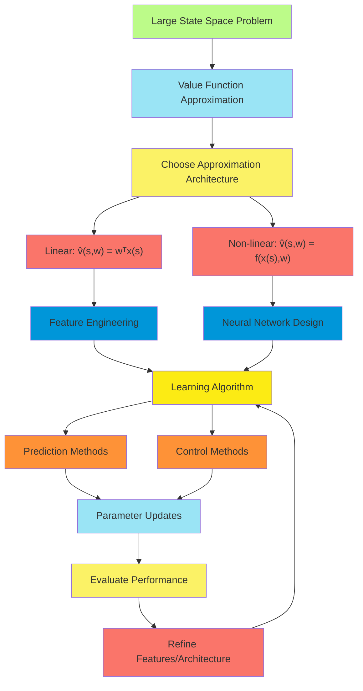
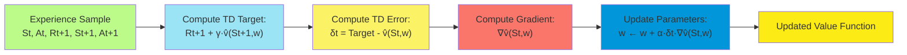
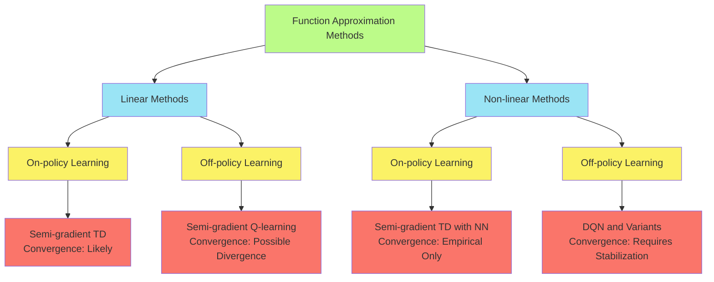
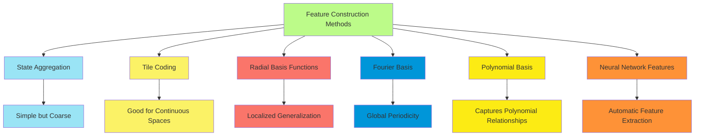
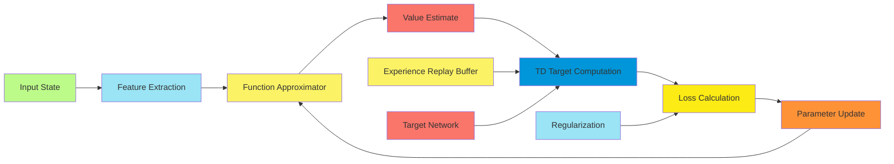
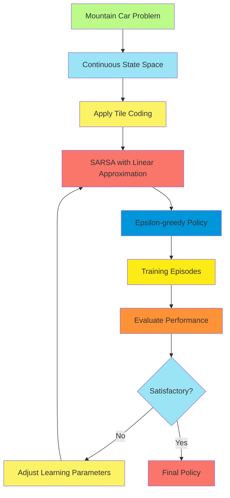

# C-8: Function Approximation in Reinforcement Learning

1. Value Function Approximation

    - The Need for Approximation in Large State Spaces
    - Parameterized Value Functions
    - Feature Vectors and Linear Value Functions
    - Non-linear Approximation Methods
    - Prediction vs. Control with Approximation

2. Gradient-Descent Methods
    - Stochastic Gradient Descent (SGD)
    - The Mean Squared Value Error (VE)
    - The Gradient and Semi-Gradient Methods
    - Linear Methods with SGD
    - Convergence Guarantees

#### Value Function Approximation

##### The Need for Approximation in Large State Spaces

In classical reinforcement learning methods, we maintain a separate value for each state or state-action pair. This
approach becomes impractical when dealing with large or continuous state spaces. Consider the following situations:

- A robot navigating in continuous 3D space has infinitely many possible states
- A game with $10^{20}$ possible states would require more memory than physically available
- Many real-world problems have state spaces that grow exponentially with the number of state variables (the "curse of
  dimensionality")

This necessitates approximation techniques that can generalize across similar states and provide reasonable value
estimates for states never encountered during training.

The fundamental shift is from a tabular representation (one entry per state) to a parameterized function:

$\hat{v}(s,\mathbf{w}) \approx v_{\pi}(s)$ or $\hat{q}(s,a,\mathbf{w}) \approx q_{\pi}(s,a)$

Where $\mathbf{w}$ is a weight vector with dimensions much smaller than the number of states.

##### Parameterized Value Functions

A parameterized value function $\hat{v}(s,\mathbf{w})$ approximates the true value function $v_{\pi}(s)$ using a
parameter vector $\mathbf{w}$. The key advantage is that the number of parameters can be significantly smaller than the
number of states.

The objective becomes finding the parameter vector $\mathbf{w}$ that makes $\hat{v}(s,\mathbf{w})$ as close as possible
to $v_{\pi}(s)$ across all states, weighted by how frequently we encounter them.

This approach offers several benefits:

- Generalization to unseen states
- Memory efficiency
- Potential for better performance through generalization
- Ability to handle continuous state spaces

##### Feature Vectors and Linear Value Functions

The most straightforward approximation method uses linear combinations of features:

$\hat{v}(s,\mathbf{w}) = \mathbf{w}^T\mathbf{x}(s) = \sum_{i=1}^{d}w_i x_i(s)$

Where:

- $\mathbf{x}(s)$ is a feature vector for state $s$
- $x_i(s)$ represents the $i$-th feature of state $s$
- $\mathbf{w}$ is the weight vector being learned
- $d$ is the number of features (and weights)

Features extract relevant information from states, enabling generalization. Good feature design is crucial for effective
approximation. Common feature types include:

1. **State aggregation**: Group similar states together, treating them as identical
2. **Tile coding/CMAC**: Overlay multiple tilings of the state space, each offset from the others
3. **Radial basis functions**: Gaussian functions centered at various points in state space
4. **Fourier basis**: Sinusoidal functions of various frequencies
5. **Polynomial basis**: Powers of state variables

The linear approximation architecture is favored for several reasons:

- Computationally efficient
- Often sufficient for good performance
- Relatively simple to analyze theoretically
- Guaranteed convergence under certain conditions

For action-value functions, we can use a similar approach:

$\hat{q}(s,a,\mathbf{w}) = \mathbf{w}^T\mathbf{x}(s,a)$

Where $\mathbf{x}(s,a)$ is a feature vector for the state-action pair.

##### Non-linear Approximation Methods

While linear methods are mathematically convenient, many complex problems require non-linear approximation. The value
function becomes:

$\hat{v}(s,\mathbf{w}) = f(\mathbf{x}(s), \mathbf{w})$

Where $f$ is a non-linear function. Common non-linear approaches include:

1. **Neural networks**: Multi-layer perceptrons that can represent complex non-linear functions
2. **Decision trees**: Hierarchical partitioning of the state space
3. **Support vector machines**: Kernel-based methods for non-linear classification/regression
4. **Nearest neighbor methods**: Value prediction based on similar observed states

Neural networks are particularly popular due to their flexibility and powerful function approximation capabilities. A
simple neural network architecture for value approximation might be:

- Input layer: Features of the state
- Hidden layer(s): Non-linear transformations (e.g., with ReLU or tanh activations)
- Output layer: Predicted value (single output for $\hat{v}$, multiple outputs for $\hat{q}$ with discrete actions)

The challenge with non-linear methods is that they can be:

- More prone to divergence or instability
- Computationally expensive to train
- Difficult to analyze theoretically
- Subject to local optima

##### Prediction vs. Control with Approximation

The distinction between prediction (evaluating a fixed policy) and control (finding an optimal policy) becomes more
significant with function approximation.

**Prediction with approximation**:

- Goal: Learn $\hat{v}(s,\mathbf{w}) \approx v_{\pi}(s)$ for a fixed policy $\pi$
- Methods: TD learning, Monte Carlo, etc., adapted to update parameters rather than table entries
- Relatively stable, with convergence guarantees for linear approximation

**Control with approximation**:

- Goal: Learn $\hat{q}(s,a,\mathbf{w}) \approx q_*(s,a)$ while improving the policy
- Methods: Q-learning, SARSA, actor-critic with function approximation
- More challenging theoretically, with fewer convergence guarantees
- Prone to instability due to the moving target problem (policy improvement changes the target function)

A significant challenge in control with function approximation is the potentially destabilizing interaction between
approximation errors and policy improvement. This is particularly problematic for off-policy methods like Q-learning.

#### Gradient-Descent Methods

##### Stochastic Gradient Descent (SGD)

Gradient descent is a fundamental optimization technique for finding parameters that minimize a loss function. In
reinforcement learning, we use stochastic gradient descent (SGD) to incrementally update the parameter vector
$\mathbf{w}$ based on individual samples rather than the entire dataset.

The general update rule for SGD is:

$\mathbf{w}_{t+1} = \mathbf{w}_t - \alpha \nabla J(\mathbf{w}_t)$

Where:

- $\alpha$ is the learning rate
- $\nabla J(\mathbf{w}_t)$ is the gradient of the objective function $J$ with respect to $\mathbf{w}$
- The negative sign indicates we're moving in the direction of steepest descent

In RL, the objective function is typically a measure of prediction error, and we update parameters after each
observation or a small batch of observations.

##### The Mean Squared Value Error (VE)

The most common objective function for value function approximation is the Mean Squared Value Error (VE):

$\text{VE}(\mathbf{w}) = \sum_{s \in \mathcal{S}} \mu(s) [v_{\pi}(s) - \hat{v}(s, \mathbf{w})]^2$

Where:

- $\mu(s)$ is a distribution over states, often representing the frequency of visiting each state
- $v_{\pi}(s)$ is the true value of state $s$ under policy $\pi$
- $\hat{v}(s, \mathbf{w})$ is the approximated value

The gradient of VE with respect to $\mathbf{w}$ is:

$\nabla \text{VE}(\mathbf{w}) = -2 \sum_{s \in \mathcal{S}} \mu(s) [v_{\pi}(s) - \hat{v}(s, \mathbf{w})] \nabla \hat{v}(s, \mathbf{w})$

For linear approximation, $\nabla \hat{v}(s, \mathbf{w}) = \mathbf{x}(s)$, which simplifies the gradient calculation.

The challenge is that we don't know the true values $v_{\pi}(s)$. Instead, we use targets derived from experience, such
as Monte Carlo returns or TD targets.

##### The Gradient and Semi-Gradient Methods

**True Gradient Methods**: Use the actual gradient of the objective function. For instance, with Monte Carlo methods, we
can use the observed return $G_t$ as an unbiased sample of $v_{\pi}(S_t)$:

$\mathbf{w}_{t+1} = \mathbf{w}_t + \alpha [G_t - \hat{v}(S_t, \mathbf{w}_t)] \nabla \hat{v}(S_t, \mathbf{w}_t)$

**Semi-Gradient Methods**: Use bootstrapping (estimates of other states' values), which makes the target dependent on
the current parameters:

$\mathbf{w}*{t+1} = \mathbf{w}\*t + \alpha [R\*{t+1} + \gamma \hat{v}(S*{t+1}, \mathbf{w}_t) - \hat{v}(S_t, \mathbf{w}_t)] \nabla \hat{v}(S_t, \mathbf{w}_t)$

This is no longer a true gradient method because the target $R_{t+1} + \gamma \hat{v}(S_{t+1}, \mathbf{w}_t)$ depends on
$\mathbf{w}_t$. However, we treat it as if it were independent when computing the gradient, hence "semi-gradient."

Semi-gradient methods often converge faster than true gradient methods but may be less stable and have different
convergence properties.

The key semi-gradient TD(0) update rule is:

$\mathbf{w}*{t+1} = \mathbf{w}\*t + \alpha [R\*{t+1} + \gamma \hat{v}(S*{t+1}, \mathbf{w}_t) - \hat{v}(S_t, \mathbf{w}_t)] \nabla \hat{v}(S_t, \mathbf{w}_t)$

For control problems, the semi-gradient SARSA update is:

$\mathbf{w}*{t+1} = \mathbf{w}\*t + \alpha [R\*{t+1} + \gamma \hat{q}(S*{t+1}, A_{t+1}, \mathbf{w}_t) - \hat{q}(S_t, A_t, \mathbf{w}_t)] \nabla \hat{q}(S_t, A_t, \mathbf{w}_t)$

##### Linear Methods with SGD

For linear value function approximation:

$\hat{v}(s, \mathbf{w}) = \mathbf{w}^T \mathbf{x}(s) = \sum_{i=1}^{d} w_i x_i(s)$

The gradient is simply the feature vector:

$\nabla \hat{v}(s, \mathbf{w}) = \mathbf{x}(s)$

This simplifies the semi-gradient TD(0) update to:

$\mathbf{w}_{t+1} = \mathbf{w}*t + \alpha [R*{t+1} + \gamma \mathbf{w}*t^T \mathbf{x}(S*{t+1}) - \mathbf{w}_t^T \mathbf{x}(S_t)] \mathbf{x}(S_t)$

For action-value functions, the update becomes:

$\mathbf{w}*{t+1} = \mathbf{w}\*t + \alpha [R\*{t+1} + \gamma \mathbf{w}\*t^T \mathbf{x}(S\*{t+1}, A*{t+1}) - \mathbf{w}_t^T \mathbf{x}(S_t, A_t)] \mathbf{x}(S_t, A_t)$

Linear methods have several advantages:

- Computationally efficient (updates are $O(d)$ where $d$ is the number of features)
- Relatively simple to implement
- Well-understood convergence properties
- Often perform well in practice with good feature representations

##### Convergence Guarantees

The convergence properties of gradient-based methods with function approximation are more complex than for tabular
methods:

**Prediction (Policy Evaluation)**:

- Monte Carlo with linear approximation: Converges to a local optimum of the VE.
- TD(0) with linear approximation: Converges to a solution that minimizes the projected Bellman error, but not
  necessarily the VE.
- TD(λ) with linear approximation: Converges to a point between the Monte Carlo and TD(0) solutions, depending on λ.

**Control**:

- On-policy methods (SARSA) with linear approximation: Can converge under certain conditions.
- Off-policy methods (Q-learning) with function approximation: May diverge even with linear approximation.

The "deadly triad" in reinforcement learning refers to the combination of three elements that can lead to instability:

1. Function approximation
2. Bootstrapping (as in TD methods)
3. Off-policy learning

When all three are present, convergence guarantees are generally weaker or non-existent.

Several techniques have been developed to improve stability and convergence:

- Experience replay: Breaking temporal correlations in the data
- Target networks: Reducing the moving target problem
- Gradient clipping: Preventing large parameter updates
- Batch normalization: Stabilizing the distribution of neural network activations
- Double Q-learning: Reducing maximization bias

Let's delve deeper into some key mathematical aspects of these methods:

For linear function approximation with features $\mathbf{x}(s)$, the semi-gradient TD(0) update can be written as:

$\Delta \mathbf{w} = \alpha \delta_t \mathbf{x}(S_t)$

Where $\delta_t = R_{t+1} + \gamma \mathbf{w}^T \mathbf{x}(S_{t+1}) - \mathbf{w}^T \mathbf{x}(S_t)$ is the TD error.

Under certain conditions, this update converges to a fixed point $\mathbf{w}_{\text{TD}}$ that satisfies:

$\mathbb{E}[\delta_t \mathbf{x}(S_t)] = \mathbf{0}$

This fixed point minimizes the projected Bellman error, which is different from the VE that Monte Carlo methods
minimize.

For more complex approximators like neural networks, the update direction becomes:

$\nabla \hat{v}(s, \mathbf{w}) = \frac{\partial \hat{v}(s, \mathbf{w})}{\partial \mathbf{w}}$

Which requires backpropagation to compute efficiently for multi-layer networks.

Understanding these mathematical foundations is crucial for developing stable and effective reinforcement learning
algorithms with function approximation.

#### Feature Construction

Feature construction is a critical aspect of function approximation that significantly impacts performance.
Well-designed features capture relevant patterns in the state space and enable effective generalization.

##### Feature Types and Selection

Several approaches exist for constructing features:

1. **Hand-engineered features**: Domain-specific knowledge is used to design features that capture relevant aspects of
   the state space.

2. **State aggregation**: The simplest form of feature construction where similar states are grouped together:
   $x_i(s) = 1$ if $s$ belongs to the $i$-th group, and $0$ otherwise.

3. **Tile coding**: A method that divides the state space into overlapping tilings. Each tiling is offset slightly from
   the others:

    $\hat{v}(s, \mathbf{w}) = \sum_{i=1}^{n} w_i \cdot \mathbb{I}(s \in \text{tile}_i)$

    Where $\mathbb{I}$ is the indicator function. Tile coding creates a coarse discretization while maintaining the
    ability to generalize.

4. **Radial basis functions (RBFs)**: Create features based on the distance to prototype states:

    $x_i(s) = \exp\left(-\frac{|s - c_i|^2}{2\sigma_i^2}\right)$

    Where $c_i$ is the center of the $i$-th RBF and $\sigma_i$ controls its width.

5. **Fourier basis**: Represents the value function using sinusoidal functions:

    $x_i(s) = \cos(\pi \mathbf{c}_i \cdot s)$

    Where $\mathbf{c}_i$ is a coefficient vector determining the frequency in each dimension.

6. **Polynomial basis**: Represents the value function using powers of state variables:

    $x_{ij}(s) = s_i^j$

    Where $s_i$ is the $i$-th component of state $s$, and $j$ is the power.

##### Automatic Feature Learning

Modern approaches often learn features automatically rather than designing them manually:

1. **Deep neural networks**: Learn hierarchical features automatically through multiple layers:
    - Early layers capture basic patterns
    - Later layers combine these into more complex features
    - The final layer produces value predictions
2. **Representation learning**: Methods specifically designed to learn good state representations:
    - Autoencoders: Learn compressed representations by reconstructing inputs
    - Contrastive learning: Learn representations that distinguish similar from dissimilar states
    - Auxiliary tasks: Learn representations by predicting additional aspects of the environment
3. **Feature selection methods**: Algorithms that automatically select the most relevant features:
    - Regularization methods (L1, L2): Encourage sparse or small weight vectors
    - Incremental feature dependency discovery: Add features based on their expected contribution

#### Advanced Approximation Techniques

##### Batch Methods vs. Online Methods

Function approximation methods can be categorized as batch or online:

1. **Online methods**: Update parameters after each experience:
    - Computationally efficient
    - Can adapt quickly to non-stationary environments
    - Potentially less stable
2. **Batch methods**: Update parameters after collecting a batch of experiences:
    - More stable learning
    - Better utilization of experience
    - Computationally more intensive

Least Squares Temporal Difference (LSTD) is a prominent batch method that directly computes the fixed point of TD
learning:

$\mathbf{w} = (\mathbf{X}^T(\mathbf{X} - \gamma\mathbf{P}\mathbf{X}))^{-1}\mathbf{X}^T\mathbf{R}$

Where:

- $\mathbf{X}$ is a matrix of feature vectors for visited states
- $\mathbf{P}$ represents transitions between states
- $\mathbf{R}$ is the vector of rewards

##### Experience Replay

Experience replay stores past experiences and reuses them for training:

1. Collect experiences $(s, a, r, s')$ and store in a replay buffer
2. Periodically sample random batches from the buffer
3. Update parameters using these experiences

Benefits include:

- Breaking temporal correlations in the data
- More efficient use of experience
- Improved stability through randomization

The Deep Q-Network (DQN) algorithm popularized experience replay for deep reinforcement learning.

##### Target Networks

Target networks address the moving target problem in TD learning:

1. Maintain two networks:

    - The online network (updated regularly)
    - The target network (updated less frequently)

2. Use the target network for computing TD targets:

    $\delta_t = R_{t+1} + \gamma \max_a \hat{q}(S_{t+1}, a, \mathbf{w}^-) - \hat{q}(S_t, A_t, \mathbf{w})$

    Where $\mathbf{w}^-$ are the parameters of the target network.

3. Periodically update the target network by copying parameters from the online network.

This approach stabilizes learning by reducing the correlation between the current parameters and the target.

#### Practical Considerations and Implementations

##### Regularization in Function Approximation

Regularization techniques prevent overfitting and improve generalization:

1. **L2 regularization**: Penalizes large weights:
   $J_{\text{reg}}(\mathbf{w}) = J(\mathbf{w}) + \frac{\lambda}{2}|\mathbf{w}|_2^2$
2. **L1 regularization**: Encourages sparse solutions:
   $J_{\text{reg}}(\mathbf{w}) = J(\mathbf{w}) + \lambda|\mathbf{w}|_1$
3. **Dropout**: Randomly deactivates neurons during training to prevent co-adaptation
4. **Early stopping**: Terminates training when performance on a validation set starts decreasing

##### Hyperparameter Selection

Key hyperparameters in function approximation include:

1. **Learning rate ($\alpha$)**: Controls the step size in gradient descent
    - Too high: Unstable learning
    - Too low: Slow convergence
    - Adaptive methods (RMSProp, Adam) can help
2. **Feature count and type**: Trade-off between expressiveness and complexity
    - More features: Better approximation but higher variance
    - Fewer features: Lower variance but potentially higher bias
3. **Regularization parameters**: Control the strength of regularization
4. **Network architecture** (for neural networks):
    - Layer count and width
    - Activation functions
    - Initialization methods

#### Theoretical Analysis and Insights

##### Convergence Properties of Various Methods

Understanding convergence properties helps in algorithm selection:

1. **Linear TD(0) with on-policy sampling**:
    - Converges with probability 1 under decreasing learning rates
    - Converges to a different solution than Monte Carlo methods
    - Minimizes the projected Bellman error
2. **Q-learning with linear approximation**:
    - May diverge even with simple examples
    - The deadly triad (function approximation, bootstrapping, off-policy learning) creates instability
3. **Non-linear function approximation**:
    - Few theoretical guarantees
    - Empirical success with stabilization techniques
    - DQN and its variants have shown practical convergence

##### The Projected Bellman Equation

The TD fixed point with linear function approximation satisfies the projected Bellman equation:

$\Phi\mathbf{w} = \Pi \mathcal{T}(\Phi\mathbf{w})$

Where:

- $\Phi$ is the feature matrix
- $\Pi$ is the projection operator onto the space spanned by the features
- $\mathcal{T}$ is the Bellman operator

This equation highlights that TD methods minimize the projected Bellman error rather than the true Bellman error, which
explains some of their behavior.

#### Applications and Advanced Topics

##### Continuous Actions

Function approximation is particularly important for continuous action spaces:

1. **Policy gradient methods**: Learn a parameterized policy directly:
   $\pi(a|s, \theta) = \mathcal{N}(\mu(s, \theta), \sigma(s, \theta))$
2. **Deterministic policy gradient (DPG)**: Learn a deterministic policy: $\pi(s, \theta) = \mu(s, \theta)$
3. **Actor-critic methods**: Combine value function and policy approximation:
    - Actor: Updates policy parameters
    - Critic: Estimates value function

##### Deep Reinforcement Learning with Function Approximation

Deep reinforcement learning combines deep neural networks with RL algorithms:

1. **Deep Q-Network (DQN)**:
    - Neural network approximates Q-values
    - Experience replay and target networks for stability
2. **Deep Deterministic Policy Gradient (DDPG)**:
    - Actor-critic architecture for continuous control
    - Off-policy learning with deterministic policy
3. **Proximal Policy Optimization (PPO)**:
    - Constrains policy updates to improve stability
    - On-policy learning with function approximation

##### State Representation Learning

Learning good state representations is a growing research area:

1. **Feature extraction from raw inputs**:
    - Convolutional neural networks for images
    - Recurrent neural networks for sequences
2. **State abstraction**:
    - Identify relevant features while ignoring irrelevant ones
    - Learn representations that capture the structure of the environment
3. **Model-based representation learning**:
    - Learn representations that enable predicting future states and rewards
    - Explicitly model environment dynamics

#### Case Study: Mountain Car with Function Approximation

The Mountain Car problem involves a car in a valley that must reach the top of a hill. The state space is continuous
(position and velocity), making it suitable for function approximation.

Let's consider a solution using tile coding and semi-gradient SARSA:

1. **State representation**:
    - Position: $[-1.2, 0.6]$
    - Velocity: $[-0.07, 0.07]$
2. **Tile coding**:
    - 8 tilings, each with $8 \times 8$ tiles
    - Total of 512 binary features
3. **Action space**:
    - Three discrete actions: accelerate left, no action, accelerate right
4. **Semi-gradient SARSA update**:
   $\mathbf{w}*{t+1} = \mathbf{w}\*t + \alpha [R\*{t+1} + \gamma \hat{q}(S*{t+1}, A_{t+1}, \mathbf{w}_t) - \hat{q}(S_t, A_t, \mathbf{w}_t)] \nabla \hat{q}(S_t, A_t, \mathbf{w}_t)$
5. **Performance**:
    - Learns effective policies after a few hundred episodes
    - Generalizes well across the continuous state space
    - Much more efficient than discretizing the state space

#### Summary and Key Takeaways

Function approximation is essential for scaling reinforcement learning to complex, high-dimensional, or continuous
domains:

1. **Value function approximation** enables generalization across states and handles large state spaces.
2. **Linear methods** provide a good balance of simplicity, computational efficiency, and theoretical guarantees.
3. **Non-linear methods** (especially neural networks) offer more expressive power but may be less stable.
4. **Gradient-descent methods** provide a principled approach to learning parameters.
5. **Semi-gradient methods** are often preferred for their efficiency, despite weaker theoretical guarantees.
6. **The deadly triad** (function approximation, bootstrapping, off-policy learning) can cause instability.
7. **Stabilization techniques** like experience replay and target networks are crucial for complex approximators.
8. **Feature selection and construction** significantly impact performance and should be designed carefully.
9. **Convergence guarantees** are stronger for on-policy methods with linear approximation.
10. **Deep reinforcement learning** combines neural networks with RL algorithms for end-to-end learning.

Function approximation has enabled reinforcement learning to solve increasingly complex problems, from game playing to
robotics, and remains an active area of research with many open questions and opportunities for innovation.
