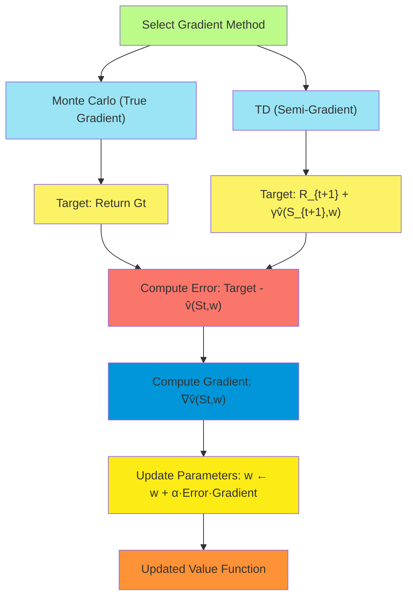
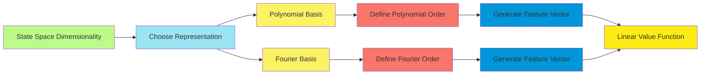
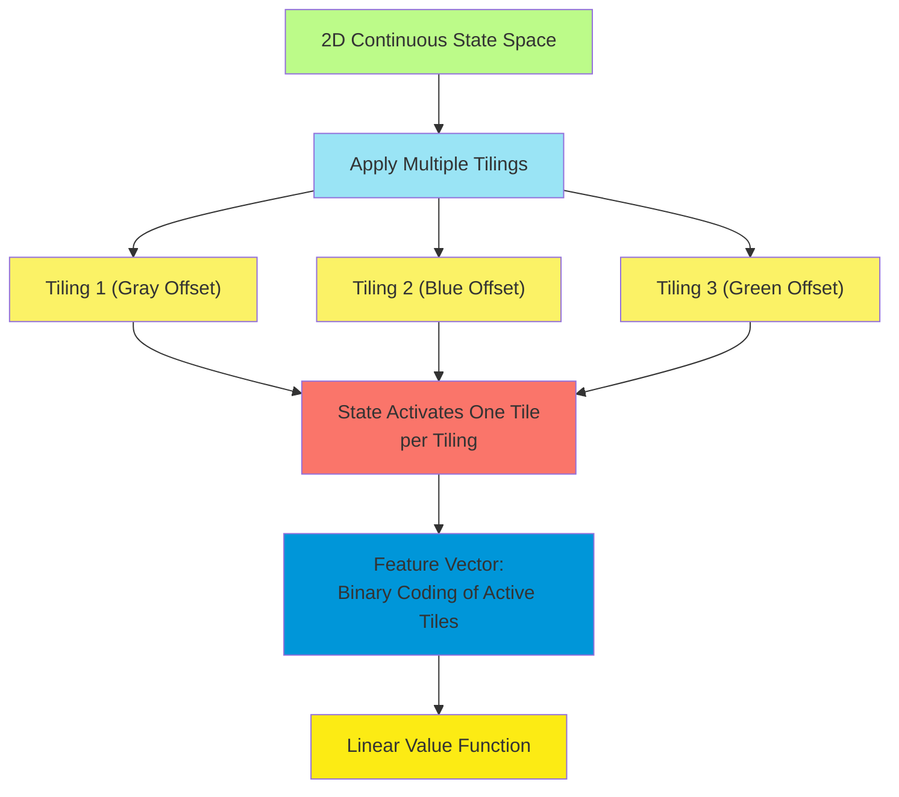
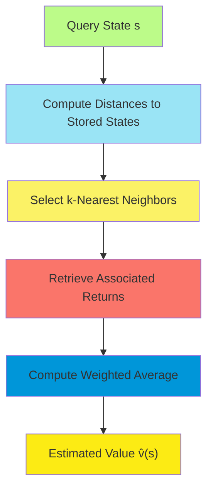
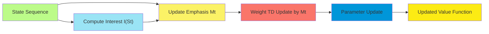

# C-9: On-policy Prediction with Approximation

1. Value-Function Approximation

    - The Prediction Objective (VE)
    - Stochastic-Gradient and Semi-Gradient Methods
    - Linear Methods
    - Feature Construction for Linear Methods

2. Feature Construction Techniques

    - Polynomials and Fourier Basis
    - Coarse Coding
    - Tile Coding
    - Radial Basis Functions
    - Step-Size Parameters for SGD

3. Memory-based Function Approximation
    - Nearest Neighbor Methods
    - Kernel-based Function Approximation
    - Interest and Emphasis in On-policy Learning

#### Value-Function Approximation

##### The Prediction Objective (VE)

In reinforcement learning, the fundamental goal of prediction is to estimate the value function $v_\pi(s)$ for a given
policy $\pi$. When dealing with large or continuous state spaces, exact representation becomes impossible, necessitating
function approximation.

The standard objective for prediction is to minimize the Mean Squared Value Error (VE):

$\text{VE}(\mathbf{w}) = \sum_{s \in \mathcal{S}} \mu(s) [v_\pi(s) - \hat{v}(s, \mathbf{w})]^2$

This equation represents the weighted average of the squared differences between the true value function $v_\pi(s)$ and
our approximation $\hat{v}(s, \mathbf{w})$ across all states. The weighting function $\mu(s)$ determines the importance
of accuracy in different states and is typically set to the on-policy state distribution, representing the proportion of
time spent in each state under policy $\pi$.

The VE objective has several important properties:

1. It measures the overall quality of our approximation across the state space
2. It weights states according to how frequently they are visited, focusing learning on relevant regions
3. It has a unique global minimum when using linear function approximation with linearly independent features

The challenge lies in minimizing VE without knowing the true values $v_\pi(s)$. Instead, we must use samples of
experience to estimate these values and guide our updates.

##### Stochastic-Gradient and Semi-Gradient Methods

To minimize the VE objective, we employ gradient-based optimization methods. The gradient of VE with respect to the
parameter vector $\mathbf{w}$ is:

$\nabla \text{VE}(\mathbf{w}) = \sum_{s \in \mathcal{S}} \mu(s) [v_\pi(s) - \hat{v}(s, \mathbf{w})] \nabla \hat{v}(s, \mathbf{w})$

In classic stochastic gradient descent (SGD), we sample states according to $\mu(s)$ and update parameters in the
direction of the negative gradient:

$\mathbf{w}_{t+1} = \mathbf{w}*t + \alpha [v*\pi(S_t) - \hat{v}(S_t, \mathbf{w}_t)] \nabla \hat{v}(S_t, \mathbf{w}_t)$

However, we don't know the true value $v_\pi(S_t)$. Instead, we use different targets depending on the method:

1. **Monte Carlo methods** use the return $G_t$ as the target:
   $\mathbf{w}_{t+1} = \mathbf{w}_t + \alpha [G_t - \hat{v}(S_t, \mathbf{w}_t)] \nabla \hat{v}(S_t, \mathbf{w}_t)$

    This is a true SGD method since $G_t$ is an unbiased sample of $v_\pi(S_t)$.

2. **Temporal Difference methods** use bootstrapped targets:
   $\mathbf{w}*{t+1} = \mathbf{w}\*t + \alpha [R\*{t+1} + \gamma \hat{v}(S*{t+1}, \mathbf{w}_t) - \hat{v}(S_t, \mathbf{w}_t)] \nabla \hat{v}(S_t, \mathbf{w}_t)$

    This is called a semi-gradient method because the target $R_{t+1} + \gamma \hat{v}(S_{t+1}, \mathbf{w}_t)$ depends
    on the current parameters $\mathbf{w}_t$, but we treat it as fixed when computing the gradient.

The semi-gradient TD(0) update can be written compactly as:

$\mathbf{w}_{t+1} = \mathbf{w}_t + \alpha \delta_t \nabla \hat{v}(S_t, \mathbf{w}_t)$

Where $\delta_t = R_{t+1} + \gamma \hat{v}(S_{t+1}, \mathbf{w}_t) - \hat{v}(S_t, \mathbf{w}_t)$ is the TD error.

Semi-gradient methods are not guaranteed to converge to the minimum of VE. Instead, they converge to a different fixed
point that minimizes a related objective called the projected Bellman error. Despite this theoretical limitation,
semi-gradient methods often work well in practice and learn faster than true gradient methods.

##### Linear Methods

Linear value function approximation is particularly important in reinforcement learning due to its simplicity,
computational efficiency, and theoretical guarantees. The approximation takes the form:

$\hat{v}(s, \mathbf{w}) = \mathbf{w}^T \mathbf{x}(s) = \sum_{i=1}^d w_i x_i(s)$

Where:

- $\mathbf{x}(s)$ is a feature vector for state $s$
- $x_i(s)$ is the $i$-th feature value for state $s$
- $\mathbf{w}$ is the weight vector
- $d$ is the number of features

For linear methods, the gradient with respect to parameters is simply the feature vector:

$\nabla \hat{v}(s, \mathbf{w}) = \mathbf{x}(s)$

This simplifies the semi-gradient TD(0) update to:

$\mathbf{w}_{t+1} = \mathbf{w}_t + \alpha \delta_t \mathbf{x}(S_t)$

Where $\delta_t = R_{t+1} + \gamma \mathbf{w}*t^T \mathbf{x}(S*{t+1}) - \mathbf{w}_t^T \mathbf{x}(S_t)$.

Linear methods have several important properties:

1. **Efficiency**: Updates require only $O(d)$ operations, where $d$ is the number of features.

2. **Convergence**: Linear semi-gradient TD(0) is guaranteed to converge under standard stochastic approximation
   conditions (decreasing step sizes, bounded features).

3. **Fixed point**: The parameters converge to a fixed point $\mathbf{w}*{\text{TD}}$ that satisfies:
   $\mathbf{w}*{\text{TD}} = \mathbf{w}_{\text{TD}} + \mathbb{E}[\delta_t \mathbf{x}(S_t)] = \mathbf{0}$

    This represents the solution to the projected Bellman equation.

4. **VE bound**: While not minimizing VE directly, the fixed point solution has a bound on its VE that depends on how
   well the true value function can be approximated in the space of representable functions.

Despite their simplicity, linear methods can be remarkably effective when combined with good feature representations.
The "kernel trick" also allows linear methods to implicitly work in high-dimensional feature spaces, giving them
considerable flexibility.

##### Feature Construction for Linear Methods

The performance of linear methods depends critically on the choice of features. Good features should:

1. Be informative about state value
2. Allow generalization across similar states
3. Be computationally efficient to compute
4. Have adequate representational capacity for the target function

Several approaches to feature construction are commonly used:

1. **State aggregation**: The simplest approach where similar states are grouped together. $x_i(s) = 1$ if $s \in$ group
   $i$, and $0$ otherwise.
2. **Handcrafted features**: Domain-specific knowledge is used to design relevant features. For example, distance to
   goal, relative positions, or energy levels.
3. **Basis functions**: Mathematical functions that transform raw state variables. Examples include polynomials, Fourier
   basis functions, and radial basis functions.
4. **Tile coding**: A method that creates binary features through multiple overlapping tilings.

The choice of feature representation involves trade-offs between:

- Expressiveness (ability to represent complex functions)
- Generalization (ability to make good predictions for unseen states)
- Computational efficiency (time and memory requirements)
- Learning efficiency (sample complexity and convergence speed)

#### Feature Construction Techniques

##### Polynomials and Fourier Basis

**Polynomial Basis**:

Polynomial features represent the value function as a polynomial of the state variables:

$\hat{v}(s, \mathbf{w}) = w_0 + \sum_{i=1}^n w_i s_i + \sum_{i=1}^n \sum_{j=i}^n w_{ij} s_i s_j + \sum_{i=1}^n \sum_{j=i}^n \sum_{k=j}^n w_{ijk} s_i s_j s_k + \ldots$

For a $d$-dimensional state space, a complete polynomial of degree $p$ has $\binom{d+p}{p}$ terms.

For example, in a 2D state space $(s_1, s_2)$, quadratic features would include:

- Constant: $1$
- Linear: $s_1, s_2$
- Quadratic: $s_1^2, s_1 s_2, s_2^2$

Advantages of polynomial features include:

- Simple to implement
- Interpretable (weights correspond to polynomial coefficients)
- Can approximate any continuous function to arbitrary precision (given sufficient degree)

Disadvantages include:

- Exponential growth in feature count with state dimension and polynomial degree
- Poor extrapolation beyond the training region
- Numerical instability with high-degree polynomials

**Fourier Basis**:

Fourier basis functions use sinusoidal features to represent periodic patterns in the value function:

$x_\mathbf{c}(s) = \cos(\pi \mathbf{c} \cdot s)$

Where $\mathbf{c}$ is a vector of integer coefficients determining the frequency in each dimension.

For a $d$-dimensional state with order $n$, the feature vector includes all combinations of frequencies up to $n$ in
each dimension, resulting in $(n+1)^d$ features.

For example, a 1D state with order 3 would have features:
$\cos(0 \cdot \pi s), \cos(1 \cdot \pi s), \cos(2 \cdot \pi s), \cos(3 \cdot \pi s)$

Advantages of Fourier basis include:

- Well-founded in approximation theory
- Good at capturing periodic patterns
- Relatively compact representation for smooth functions
- Orthogonal basis functions (helpful for convergence)

Disadvantages include:

- Exponential growth in feature count with state dimension
- Less intuitive interpretation than polynomials
- Requires normalization of state variables to $[0,1]$

##### Coarse Coding

Coarse coding is a feature construction method that represents states using overlapping receptive fields. Each feature
is associated with a region of the state space:

$x_i(s) = 1$ if $s$ falls within the receptive field of feature $i$, and $0$ otherwise.

The key characteristics of coarse coding are:

1. **Overlapping regions**: Each state typically activates multiple features, allowing generalization.
2. **Region size**: Larger regions provide more generalization but less precision.
3. **Region density**: More regions provide better resolution but require more parameters.

Coarse coding has the following properties:

- States that are close in the input space will have similar feature representations
- The degree of generalization depends on the size of the receptive fields
- The representational capacity depends on the number and arrangement of receptive fields
- Computational efficiency is high, as only a small fraction of features are active for any state

Coarse coding provides a natural way to control the trade-off between generalization and discrimination. It works well
for low-dimensional continuous state spaces but becomes less effective in high dimensions due to the curse of
dimensionality.

##### Tile Coding

Tile coding (also known as CMAC, Cerebellar Model Articulation Controller) is a specific form of coarse coding that uses
a systematic arrangement of receptive fields called tiles. The key elements are:

1. **Tilings**: The state space is covered by several overlapping grids (tilings).
2. **Offset**: Each tiling is offset slightly from the others.
3. **Binary features**: Each tile corresponds to one binary feature.

For a state $s$, the feature vector has a 1 for each tile that contains $s$ (typically one tile per tiling) and 0
elsewhere.

Mathematically, for a state $s$ and tiling $i$ with offset $o_i$ and tile width $w$:

$\text{tileIndex}_{i}(s) = \lfloor (s + o_i) / w \rfloor$

$x_{i,j}(s) = 1$ if $j = \text{tileIndex}_i(s)$, and $0$ otherwise.

Tile coding has several advantages:

1. **Efficient computation**: Finding active tiles is an $O(1)$ operation.
2. **Controlled generalization**: The tile width determines the generalization extent.
3. **Memory efficiency**: Only a small number of features are active for any state.
4. **Resolution control**: More tilings provide finer resolution without increasing generalization.

The approximation accuracy depends on:

- Number of tilings: More tilings give better resolution
- Tile width: Smaller tiles give more precision but less generalization
- Offset pattern: Determines how tiles from different tilings overlap

A common implementation uses hashing to reduce memory requirements when many tiles would be needed:

$\text{featureIndex}(i, j) = \text{hash}(i, j) \mod m$

Where $m$ is the desired number of features, and the hash function maps tile indices to feature indices.

##### Radial Basis Functions

Radial Basis Functions (RBFs) are another approach to feature construction that creates features based on the distance
to prototype points:

$x_i(s) = \exp\left(-\frac{|s - c_i|^2}{2\sigma_i^2}\right)$

Where:

- $c_i$ is the center of the $i$-th RBF
- $\sigma_i$ is the width parameter controlling the extent of generalization
- $|s - c_i|$ is the distance between state $s$ and center $c_i$

RBFs have the following properties:

1. **Localized response**: Each RBF responds most strongly to states near its center.
2. **Continuous features**: Unlike tile coding, RBFs produce continuous feature values.
3. **Smooth generalization**: The activation gradually decreases with distance.
4. **Configurable width**: The parameter $\sigma_i$ controls the extent of generalization.

The centers and widths of RBFs can be:

- Arranged in a regular grid
- Placed based on observed state distribution
- Optimized as part of the learning process

RBFs provide good approximation properties and can represent any continuous function to arbitrary precision with enough
basis functions. However, they suffer from the curse of dimensionality in high-dimensional spaces.

##### Step-Size Parameters for SGD

Selecting appropriate step-size parameters (learning rates) is crucial for the performance of gradient-descent methods.
Several considerations guide this choice:

1. **Theoretical convergence requirements**:
    - Decreasing step sizes that satisfy $\sum_t \alpha_t = \infty$ and $\sum_t \alpha_t^2 < \infty$
    - Common schedule: $\alpha_t = \alpha_0 / (t + t_0)$, where $\alpha_0$ and $t_0$ are tuning parameters
2. **Constant step size**:
    - Often used in practice for non-stationary problems
    - Allows continuous adaptation to changing conditions
    - Typically set to $\alpha \approx 0.1 / \mathbb{E}[\text{number of active features}]$
3. **Feature-dependent step sizes**:
    - Different step sizes for different parameters
    - Normalized by feature frequency: $\alpha_i \propto 1/\sqrt{\sum_t x_i(S_t)^2}$
    - RMSProp, Adam, and other adaptive methods fall into this category
4. **Tile coding specific**:
    - With $n$ tilings, a common choice is $\alpha = 1/n$
    - Each state activates $n$ features, making the effective step size approximately constant

The optimal step size involves a trade-off:

- Larger values allow faster learning
- Smaller values provide more stability
- Intermediate values often yield the best performance

In practice, step-size selection often requires tuning through experimentation.

#### Memory-based Function Approximation

##### Nearest Neighbor Methods

Memory-based methods store experiences and compute value estimates based on similarities to stored examples. Nearest
neighbor methods are the simplest form:

$\hat{v}(s, \mathcal{D}) = \frac{1}{k} \sum_{i=1}^k G_i$

Where:

- $\mathcal{D} = {(S_i, G_i)}$ is the dataset of stored states and returns
- The sum is over the $k$ stored states closest to $s$

The similarity metric is typically based on Euclidean distance or other problem-specific distance measures.

Variants include:

- **1-nearest neighbor**: Use only the closest stored state
- **k-nearest neighbor**: Average over $k$ closest states
- **Weighted average**: Weight by inverse distance or other similarity metrics

Nearest neighbor methods have several properties:

1. **No training phase**: Values are computed on demand.
2. **Memory intensive**: Requires storing all experiences.
3. **Computation at query time**: Finding nearest neighbors can be expensive.
4. **Guaranteed convergence**: With infinite data, approaches optimal solution.
5. **No function class restrictions**: Can represent any value function.

The performance of nearest neighbor methods depends critically on:

- The distance metric used to measure similarity
- The number of neighbors $k$ considered
- The distribution and density of stored examples

##### Kernel-based Function Approximation

Kernel-based methods extend nearest neighbor approaches by using kernel functions to weight the contribution of stored
examples:

$\hat{v}(s, \mathcal{D}) = \frac{\sum_{i=1}^n K(s, S_i) G_i}{\sum_{i=1}^n K(s, S_i)}$

Where:

- $K(s, S_i)$ is a kernel function measuring similarity between states
- $\mathcal{D} = {(S_i, G_i)}$ is the dataset of stored states and returns

Common kernel functions include:

- Gaussian kernel: $K(s, s') = \exp(-\frac{|s-s'|^2}{2\sigma^2})$
- Epanechnikov kernel: $K(s, s') = \max(0, 1-\frac{|s-s'|^2}{\sigma^2})$
- Tricube kernel: $K(s, s') = (1-\frac{|s-s'|^3}{\sigma^3})^3 \cdot \mathbb{I}(|s-s'| \leq \sigma)$

Kernel regression has several advantages:

1. **Smooth interpolation**: Provides gradual blending between stored examples
2. **Locality control**: The kernel bandwidth $\sigma$ controls the extent of generalization
3. **Weighted influence**: Closer examples have greater influence on the prediction
4. **Theoretical foundation**: Well-studied in statistical learning theory

The bandwidth parameter $\sigma$ is crucial:

- Too small: Overfitting, poor generalization
- Too large: Oversmoothing, inability to capture local patterns
- Optimal: Balances bias and variance

Kernel-based methods can be computationally intensive for large datasets. Approximation techniques such as sparse kernel
methods or local weighted regression can mitigate this issue.

##### Interest and Emphasis in On-policy Learning

In many practical situations, prediction accuracy is more important for some states than others. This leads to the
concepts of interest and emphasis in on-policy learning:

1. **Interest** $I(s)$: A function indicating the degree to which we care about the accuracy of prediction in state $s$.
    - $I(s) \in [0, 1]$
    - $I(s) = 0$: No interest in state $s$
    - $I(s) = 1$: Full interest in state $s$
2. **Emphasis** $M_t$: A scalar multiplier applied to the update at time $t$.
    - For TD learning: $M_t = I(S_t) + \gamma \lambda M_{t-1}$
    - Initial value: $M_0 = I(S_0)$

The emphasized semi-gradient TD update becomes:

$\mathbf{w}_{t+1} = \mathbf{w}_t + \alpha M_t \delta_t \nabla \hat{v}(S_t, \mathbf{w}_t)$

This approach has several advantages:

1. **Focused learning**: Computational resources are directed toward states of interest
2. **Stability improvement**: Reduces the impact of unimportant states on learning
3. **Policy evaluation flexibility**: Allows accurate evaluation in specific regions

Examples of interest functions include:

- Indicator for goal-relevant states
- Probability of being in a decision state
- Curiosity-driven measures of state novelty or uncertainty

Interest and emphasis mechanisms connect to importance sampling and off-policy learning, providing a bridge between
on-policy and off-policy methods.

#### Advanced Considerations and Extensions

##### Convergence Properties

The convergence of on-policy prediction methods with function approximation varies:

1. **Monte Carlo with linear approximation**:
    - Converges to a global optimum of VE
    - Guaranteed with decreasing step sizes that satisfy standard conditions
    - Relatively slow convergence due to high variance
2. **TD(0) with linear approximation**:
    - Converges to a fixed point, not necessarily the VE minimum
    - Fixed point minimizes the projected Bellman error
    - Faster convergence than Monte Carlo, but potentially to a different solution
3. **TD(λ) with linear approximation**:
    - Interpolates between TD(0) and Monte Carlo as λ varies from 0 to 1
    - Combines bootstrapping (efficiency) with longer-term returns (reduced bias)
    - Parameter λ controls the trade-off between bias and variance
4. **Non-linear function approximation**:
    - No general convergence guarantees for TD methods
    - Monte Carlo methods may converge to local optima
    - Stability can be improved through careful algorithm design and hyperparameter tuning

The bias-variance trade-off is central to understanding these methods:

- Monte Carlo methods have no bias but high variance
- TD methods have some bias but lower variance
- The optimal balance depends on the problem and available data

##### Batch Learning and Experience Replay

Batch learning methods process multiple experiences simultaneously:

1. **Least Squares Temporal Difference (LSTD)**:
    - Directly computes the fixed point of TD learning
    - No step size parameter, eliminating a source of instability
    - Computational complexity $O(d^2)$ where $d$ is the number of features
2. **Experience replay**:
    - Stores experiences in a buffer
    - Randomly samples and reuses past experiences
    - Breaks temporal correlations, improving stability
    - Combines online learning with efficient use of experience
3. **Fitted value iteration**:
    - Alternates between gathering experience and batch updates
    - Can use any supervised learning algorithm as a subroutine
    - Potentially more stable than pure online learning

These methods offer improved data efficiency and stability at the cost of increased computational complexity and memory
requirements.

##### Practical Implementations and Case Studies

Several classic problems illustrate on-policy prediction with function approximation:

1. **Mountain Car**:
    - Continuous 2D state space (position and velocity)
    - Discrete actions (accelerate left, right, or none)
    - Sparse reward (only at goal)
    - Effective with tile coding and semi-gradient SARSA
2. **Cart-Pole Balancing**:
    - 4D state space (position, velocity, angle, angular velocity)
    - Linear function approximation with polynomial features works well
    - Demonstrates the importance of good feature selection
3. **Acrobot**:
    - 6D state space (angles and angular velocities of two joints)
    - Challenging dynamics requiring good approximation
    - RBFs and tile coding both effective with proper tuning

Key implementation considerations across these problems include:

- Feature normalization
- Step-size adaptation
- Feature selection and engineering
- Balancing computational efficiency and approximation quality

#### Summary and Key Takeaways

On-policy prediction with function approximation involves several key elements:

1. **Value Function Approximation**:
    - Enables handling large and continuous state spaces
    - Requires defining an objective function (typically VE)
    - Employs gradient-based methods for parameter optimization
2. **Approximation Techniques**:
    - Linear methods provide theoretical guarantees and computational efficiency
    - Feature construction critically influences performance
    - Various techniques (polynomials, Fourier basis, tile coding, RBFs) offer different trade-offs
3. **Learning Algorithms**:
    - Semi-gradient TD methods balance efficiency and stability
    - Monte Carlo methods provide unbiased estimates at the cost of higher variance
    - Step-size selection significantly impacts learning performance
4. **Memory-based Methods**:
    - Nearest neighbor and kernel-based approaches offer flexibility
    - No explicit training phase, but computationally intensive at query time
    - Interest and emphasis mechanisms focus learning on important states

The choice of function approximation technique and learning algorithm depends on:

- Problem characteristics (size, continuity, dynamics)
- Computational constraints (memory, processing power)
- Desired properties (accuracy, stability, interpretability)

Understanding these trade-offs enables selecting appropriate methods for specific reinforcement learning problems and
effectively implementing on-policy prediction with function approximation.
