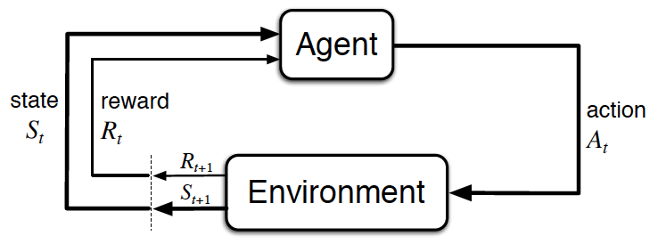
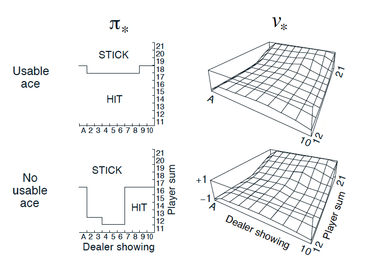

# Reinforcement Learning Lecture Notes: From Basics to Advanced

## Part 1: Understanding the Basics

### What is Reinforcement Learning?

Think of training a pet dog. When the dog does something good, you give it a treat. When it does something wrong, you
don't. Over time, the dog learns what actions lead to treats. This is exactly how reinforcement learning works in AI!
The AI (like our dog) learns by trying things out and getting rewards for good actions.

### Real-World Examples:

1. Video game AI learning to win games
2. Robot learning to walk
3. Self-driving cars learning to navigate
4. Chess programs learning winning strategies

### Basic Components:

1. Agent = The learner (like our dog)
2. Environment = The world around the agent
3. State = Current situation
4. Action = What the agent can do
5. Reward = Feedback for actions

## Part 2: Mathematical Foundation

### Basic Notation:

- State: $s_t$ (at time t)
- Action: $a_t$
- Reward: $r_t$
- Policy: $\pi$ (strategy for choosing actions)

### The Learning Process:

1. Agent observes state $s_t$
2. Takes action $a_t$
3. Gets reward $r_t$
4. Moves to new state $s_{t+1}$

### Value Functions

1. State-Value Function (how good is a state):
   $V_\pi(s) = E_\pi[\sum_{k=0}^{\infty} \gamma^k r_{t+k+1}|s_t=s]$

2. Action-Value Function (how good is an action in a state):
   $Q_\pi(s,a) = E_\pi[\sum_{k=0}^{\infty} \gamma^k r_{t+k+1}|s_t=s,a_t=a]$

## Part 3: Core Concepts

### Markov Decision Process (MDP)

- Formal way to describe the RL problem
- Components: $(S, A, P, R, \gamma)$
    - S: Set of states
    - A: Set of actions
    - P: Transition probability
    - R: Reward function
    - γ: Discount factor

### Bellman Equation

The fundamental equation:
$V_\pi(s) = \sum_a \pi(a|s)\sum_{s',r} p(s',r|s,a)[r + \gamma V_\pi(s')]$

## Part 4: Learning Algorithms

### 1. Q-Learning

Basic update rule:
$Q(s_t,a_t) \leftarrow Q(s_t,a_t) + \alpha[r_t + \gamma \max_a Q(s_{t+1},a) - Q(s_t,a_t)]$

### 2. SARSA

Update rule:
$Q(s_t,a_t) \leftarrow Q(s_t,a_t) + \alpha[r_t + \gamma Q(s_{t+1},a_{t+1}) - Q(s_t,a_t)]$

## Part 5: Advanced Topics

### Deep Reinforcement Learning

Combining neural networks with RL:

1. DQN (Deep Q-Network)
2. Policy Gradients:
   $\nabla J(\theta) = E_{\pi_\theta}[\nabla_\theta \log \pi_\theta(a|s)Q^{\pi_\theta}(s,a)]$

### Actor-Critic Methods

Combines:

- Actor: Learns policy $\pi_\theta(a|s)$
- Critic: Learns value function $V_w(s)$

### Practical Applications:

1. **Game Playing**
    - State: Game position
    - Actions: Possible moves
    - Reward: Win/Lose/Points

2. **Robotics**
    - State: Joint positions, sensor readings
    - Actions: Motor commands
    - Reward: Task completion metrics

## Part 6: Implementation Considerations

### Common Challenges:

1. Exploration vs Exploitation
2. Credit Assignment
3. Sample Efficiency
4. Stability

### Best Practices:

1. Start simple
2. Use appropriate reward design
3. Consider environment complexity
4. Handle continuous spaces carefully

<br>


<br>


A reward function for training a robot to walk using Reinforcement Learning. Let me break down each
component:

The overall reward function is:
$r = min(v_x, v_{max}) - 0.005(v_y^2 + v_z^2) - 0.05y^2 - 0.02||u||^2 + 0.02$

There are 4 main desired behaviors being encouraged:

1. **Walk Fast**

- Represented by $min(v_x, v_{max})$
- Rewards the robot for moving forward (x-direction) up to a maximum velocity
- "Proportional to the robot's forward velocity"

2. **Walk Forward**

- Penalizes sideways and vertical motion with $-0.005(v_y^2 + v_z^2)$
- Penalizes deviation from center with $-0.05y^2$
- Wants robot to walk straight ahead without swaying or bouncing

3. **Walk Smoothly**

- The term $-0.02||u||^2$ penalizes large torques
- Encourages smooth, efficient movements
- Discourages jerky or unstable motions

4. **Walk for as long as possible**

- The constant term +0.02 provides a small positive reward for each timestep
- Encourages the robot to maintain balance and keep walking
- "Constant reward for not falling"

This is a well-designed reward function because it:

- Has clear objectives
- Balances multiple competing goals
- Uses negative penalties to discourage unwanted behaviors
- Includes both instantaneous feedback (velocity) and long-term goals (staying upright)
- Has carefully tuned coefficients to weight different objectives appropriately

The design demonstrates key principles of reward shaping in RL, where you need to carefully specify what behaviors you
want while avoiding unintended consequences in the learning process.

# Returns in Reinforcement Learning

## 1. Basic Understanding

### What is a Return?

A return is the total reward an agent receives over time. Think of it like:

- Playing a video game and adding up all points you get
- Investing money and calculating total profits over years
- A robot learning to walk and summing up all rewards from start to finish

## 2. Types of Returns

### 2.1 Cumulative Return (Simple Sum)

The simple sum of all rewards:

$G_t = R_{t+1} + R_{t+2} + R_{t+3} + ... + R_T$

Where:

- $G_t$ is the return at time t
- $R_t$ is the reward at time t
- T is the final time step

**Example:**
If rewards are [1, 2, 3, 4]:
$G_1 = 1 + 2 + 3 + 4 = 10$

### 2.2 Discounted Return

Future rewards are worth less than immediate rewards:

$G_t = R_{t+1} + \gamma R_{t+2} + \gamma^2 R_{t+3} + ... = \sum_{k=0}^{\infty} \gamma^k R_{t+k+1}$

Where:

- $\gamma$ is the discount factor (0 ≤ γ ≤ 1)
- $\gamma^k$ reduces future rewards

**Example:**
With γ = 0.9 and rewards [1, 2, 3, 4]:
$G_1 = 1 + (0.9 × 2) + (0.9^2 × 3) + (0.9^3 × 4)$
$G_1 = 1 + 1.8 + 2.43 + 2.916 = 8.146$

## 3. Why Use Discounted Returns?

### Advantages:

1. **Uncertainty**: Future rewards are less certain
2. **Immediate Focus**: Encourages quick solutions
3. **Mathematical Convenience**: Helps with infinite horizons
4. **Real-world Similarity**: Models real economic decisions

### Different γ Values:

- γ = 0: Only cares about immediate reward
- γ = 1: All rewards equally important
- γ = 0.9: Common choice balancing present and future

## 4. Practical Applications

### Example: Robot Navigation

```textmate
Immediate reward (reach goal): +10
Each step penalty: -1

Without discount (γ = 1):
- Long path (10 steps): 10 - 10 = 0
- Short path (5 steps): 10 - 5 = 5

With discount (γ = 0.9):
- Long path: 10γ¹⁰ - (1 + γ + γ² + ... + γ⁹)
- Short path: 10γ⁵ - (1 + γ + γ² + γ³ + γ⁴)
```

## 5. Mathematical Properties

### 5.1 Finite Horizon

When there's a clear end time T:
$G_t = \sum_{k=0}^{T-t} \gamma^k R_{t+k+1}$

### 5.2 Infinite Horizon

When there's no clear end:
$G_t = \sum_{k=0}^{\infty} \gamma^k R_{t+k+1}$

### 5.3 Recursive Relationship

Important property:
$G_t = R_{t+1} + \gamma G_{t+1}$

## 6. Implementation Considerations

### Key Points:

1. Choose γ based on task requirements
2. Consider time horizon (finite vs infinite)
3. Balance immediate vs future rewards
4. Account for computational limitations

# Lecture Notes: Markov Decision Process (MDP)

## 1. Basic Understanding

### What is MDP?

An MDP is a mathematical framework for modeling decision-making in situations where outcomes are partly random and
partly under the control of a decision-maker. It's named after Andrey Markov.

### Key Property: The Markov Property

"The future depends only on the present, not on the past"

Mathematically:
$P(s_{t+1}|s_t, a_t) = P(s_{t+1}|s_t, a_t, s_{t-1}, a_{t-1},...,s_0, a_0)$

## 2. Components of MDP

### Formal Definition:

An MDP is defined by a tuple $(S, A, P, R, \gamma)$ where:

1. **States (S)**:
    - Set of all possible states
    - Example: Positions in a game, robot configurations

2. **Actions (A)**:
    - Set of all possible actions
    - Example: Move left/right, apply force

3. **Transition Probability (P)**:
    - $P(s'|s,a)$ = probability of reaching state s' from state s with action a
    - Mathematically: $P: S × A × S → [0,1]$

4. **Reward Function (R)**:
    - $R(s,a,s')$ = immediate reward for transition from s to s' with action a
    - Mathematically: $R: S × A × S → \mathbb{R}$

5. **Discount Factor (γ)**:
    - $\gamma \in [0,1]$
    - Balances immediate vs future rewards

## 3. Decision Making in MDPs

### 3.1 Policy

- A policy π defines behavior of the agent
- Can be:
    - Deterministic: $\pi(s) → a$
    - Stochastic: $\pi(a|s)$ = probability of taking action a in state s

### 3.2 Value Functions

**State-Value Function:**
$V_\pi(s) = E_\pi[\sum_{k=0}^{\infty} \gamma^k R_{t+k+1}|S_t=s]$

**Action-Value Function:**
$Q_\pi(s,a) = E_\pi[\sum_{k=0}^{\infty} \gamma^k R_{t+k+1}|S_t=s,A_t=a]$

## 4. Solving MDPs

### 4.1 Bellman Equations

**Bellman Expectation Equation:**
$V_\pi(s) = \sum_a \pi(a|s)\sum_{s'} P(s'|s,a)[R(s,a,s') + \gamma V_\pi(s')]$

**Bellman Optimality Equation:**
$V_*(s) = \max_a\sum_{s'} P(s'|s,a)[R(s,a,s') + \gamma V_*(s')]$

### 4.2 Solution Methods

1. **Dynamic Programming**
    - Value Iteration
    - Policy Iteration

2. **Model-Free Methods**
    - Q-Learning
    - SARSA

## 5. Example: Grid World MDP

```textmate
States: Grid cells
Actions: Up, Down, Left, Right
Transitions: 80% intended direction, 20% random
Rewards: -1 per step, +10 goal, -10 trap
```

## 6. Practical Considerations

### 6.1 Challenges

1. State Space Size
2. Partial Observability
3. Continuous States/Actions
4. Model Uncertainty

### 6.2 Applications

1. Robotics
2. Game AI
3. Resource Management
4. Healthcare Decisions

## 7. Extensions

### 7.1 Partially Observable MDPs (POMDPs)

- Agent cannot directly observe state
- Must maintain belief state

### 7.2 Continuous MDPs

- Infinite state/action spaces
- Requires function approximation

## 8. Key Takeaways

1. MDPs provide framework for sequential decision making
2. Markov property simplifies analysis
3. Solutions balance immediate vs future rewards
4. Various methods exist for finding optimal policies

# Notes:

- In general, the state space 𝒮 is the set of all nonterminal states.
- In continuing tasks (like the recycling task detailed in the video), this is equivalent to the set of all states.
- In episodic tasks, we use 𝒮⁺ to refer to the set of all states, including terminal states.
- The action space 𝒜 is the set of possible actions available to the agent.
- In the event that there are some states where only a subset of the actions are available, we can also use 𝒜(s) to
  refer to the set of actions available in state s ∈ 𝒮.

### One-Step Dynamics: State transitions and rewards for robot battery states with actions

<br>


<br>


At an arbitrary time step t, the agent-environment interaction has evolved as a sequence of states, actions, and rewards

$(S_0, A_0, R_1, S_1, A_1, ..., R_{t-1}, S_{t-1}, A_{t-1}, R_t, S_t, A_t)$.

When the environment responds to the agent at time step t + 1, it considers only the state and action at the previous
time step $(S_t, A_t)$.

In particular, it does not care what state was presented to the agent more than one step prior. (In other words, the
environment does not consider any of $S_0,...,S_{t-1}$.)

And, it does not look at the actions that the agent took prior to the last one. (In other words, the environment does
not consider any of $A_0,...,A_{t-1}$.)

Furthermore, how well the agent is doing, or how much reward it is collecting, has no effect on how the environment
chooses to respond to the agent. (In other words, the environment does not consider any of $R_0,...,R_t$.)

Because of this, we can completely define how the environment decides the state and reward by specifying

$p(s',r|s,a) \doteq \mathbb{P}(S_{t+1} = s', R_{t+1} = r|S_t = s, A_t = a)$

for each possible s', r, s, and a. These conditional probabilities are said to specify the one-step dynamics of the
environment.


<br>


<br>

# The Setting, Revisited

• The reinforcement learning (RL) framework is characterized by an agent learning to interact with its environment.
• At each time step, the agent receives the environment's state (the environment presents a situation to the agent), and
the agent must choose an appropriate action in response. One time step later, the agent receives a reward (the
environment indicates whether the agent has responded appropriately to the state) and a new state.
• All agents have the goal to maximize expected cumulative reward, or the expected sum of rewards attained over all time
steps.

# Episodic vs. Continuing Tasks

• A task is an instance of the reinforcement learning (RL) problem.
• Continuing tasks are tasks that continue forever, without end.
• Episodic tasks are tasks with a well-defined starting and ending point.

- In this case, we refer to a complete sequence of interaction, from start to finish, as an episode.
  • Episodic tasks come to an end whenever the agent reaches a terminal state.

# The Reward Hypothesis

• Reward Hypothesis: all goals can be framed as the maximization of (expected) cumulative reward.

# Goals and Rewards

(Please see Part 1 and Part 2 to review an example of how to specify the reward signal in a real-world problem.)

# Cumulative Reward

• The return at time step t is $G_t = R_{t+1} + R_{t+2} + R_{t+3} + ...$
• The agent selects actions with the goal of maximizing expected (discounted) return.
(Note: discounting is covered in the next concept.)

# Discounted Return

• The discounted return at time step t is $G_t = R_{t+1} + \gamma R_{t+2} + \gamma^2 R_{t+3} + ...$
• The discount rate γ is something that you set to refine the goal that you have for the agent.
• It must satisfy 0 ≤ γ ≤ 1.
• If γ = 0, the agent only cares about the most immediate reward.
• If γ = 1, the return is not discounted.
• For larger values of γ, the agent cares more about the distant future. Smaller values of γ result in more extreme
discounting, where - in the most extreme case - agent only cares about the most immediate reward.

# MDPs and One-Step Dynamics

• The state space 𝒮 is the set of all (nonterminal) states.
• In episodic tasks, we use 𝒮⁺ to refer to the set of all states, including terminal states.
• The action space 𝒜 is the set of possible actions. (Alternatively, 𝒜(s) refers to the set of possible actions
available in state s ∈ 𝒮)
• (Please see Part 2 to review how to specify the reward signal in the recycling robot example.)
• The one-step dynamics of the environment determine how the environment decides the state and reward at every time
step. The dynamics can be defined by specifying p(s', r|s, a) = ℙ(St+1 = s', Rt+1 = r|St = s, At = a) for each possible
s', r, s, and a.
• A (finite) Markov Decision Process (MDP) is defined by:

- a (finite) set of states 𝒮 or 𝒮⁺ (in the case of an episodic task)
- a (finite) set of actions 𝒜
- a set of rewards ℛ
- the one-step dynamics of the environment
- the discount rate γ ∈ [0,1]

# The RL Framework Solution

### State-Value Functions & Bellman Equations

## 1. State-Value Function Under a Policy

### Definition

The state-value function $v_π(s)$ for a policy π is the expected return when starting in state s and following policy π
thereafter:

$v_π(s) \doteq E_π[G_t|S_t=s]$
$= E_π[\sum_{k=0}^{\infty} \gamma^k R_{t+k+1}|S_t=s]$

Where:

- $G_t$ is the return
- γ is the discount factor
- π is the policy being evaluated

## 2. Bellman Equation for $v_π$

### Basic Form

$v_π(s) = \sum_a π(a|s) \sum_{s',r} p(s',r|s,a)[r + \gamma v_π(s')]$

### Components Breakdown:

1. $π(a|s)$: Probability of taking action a in state s
2. $p(s',r|s,a)$: Probability of transition to s' with reward r
3. $r$: Immediate reward
4. $\gamma v_π(s')$: Discounted value of next state

## 3. Bellman Optimality Equation

### For Optimal State-Value Function

$v_*(s) = \max_a \sum_{s',r} p(s',r|s,a)[r + \gamma v_*(s')]$

### For Optimal Action-Value Function

$q_*(s,a) = \sum_{s',r} p(s',r|s,a)[r + \gamma \max_{a'} q_*(s',a')]$

## 4. Key Properties

### Recursive Nature

- Current value depends on future values
- Forms a system of equations
- Solution gives optimal values

### Policy Improvement

Better policy π' can be found by:
$π'(s) = \arg\max_a \sum_{s',r} p(s',r|s,a)[r + \gamma v_π(s')]$

## 5. Practical Applications

### Value Iteration

1. Initialize $v(s)$ arbitrarily
2. Update:
   $v(s) \leftarrow \max_a \sum_{s',r} p(s',r|s,a)[r + \gamma v(s')]$

### Policy Iteration

1. Policy Evaluation: Compute $v_π$
2. Policy Improvement: Update π
3. Repeat until convergence

## 6. Example: Grid World

```textmate
Initial State:
[ 0  0  0 ]
[ 0  x  0 ]
[ 0  0  G ]

Where:
- G: Goal state
- x: Obstacle
- 0: Empty cells
```

Value function might look like:

```textmate
[ 0.5  0.7  0.9 ]
[ 0.3   x   1.0 ]
[ 0.1  0.8  G   ]
```

## 7. Relationship to Dynamic Programming

### Steps:

1. Break down problem into subproblems
2. Store solutions to subproblems
3. Use stored solutions to solve larger problems

## 8. Important Considerations

### Computational Challenges:

1. Large state spaces
2. Continuous states/actions
3. Unknown transition probabilities
4. Exploration vs exploitation

### Practical Solutions:

1. Function approximation
2. Sample-based methods
3. Model-free learning
4. Temporal difference learning

# Bellman Equations in Grid World and MDPs

In this gridworld example, once the agent selects an action,
• it always moves in the chosen direction (contrasting general MDPs where the agent doesn't always have complete control
over what the next state will be), and
• the reward can be predicted with complete certainty (contrasting general MDPs where the reward is a random draw from a
probability distribution).

In this simple example, we saw that the value of any state can be calculated as the sum of the immediate reward and
the (discounted) value of the next state.

Alexis mentioned that for a general MDP, we have to instead work in terms of an expectation, since it's not often the
case that the immediate reward and next state can be predicted with certainty. Indeed, we saw in an earlier lesson that
the reward and next state are chosen according to the one-step dynamics of the MDP. In this case, where the reward r and
next state s' are drawn from a (conditional) probability distribution p(s',r|s,a), the Bellman Expectation Equation (for
vπ) expresses the value of any state s in terms of the expected immediate reward and the expected value of the next
state:

$v_π(s) = E_π[R_{t+1} + \gamma v_π(S_{t+1})|S_t = s]$

# Calculating the Expectation

In the event that the agent's policy π is deterministic, the agent selects action π(s) when in state s, and the Bellman
Expectation Equation can be rewritten as the sum over two variables (s' and r):

$v_π(s) = \sum_{s'∈S^+,r∈R} p(s',r|s,π(s))(r + \gamma v_π(s'))$

In this case, we multiply the sum of the reward and discounted value of the next state $(r + \gamma v_π(s'))$ by its
corresponding probability $p(s',r|s,π(s))$ and sum over all possibilities to yield the expected value.

If the agent's policy π is stochastic, the agent selects action a with probability π(a|s) when in state s, and the
Bellman Expectation Equation can be rewritten as the sum over three variables (s', r, and a):

$v_π(s) = \sum_{s'∈S^+,r∈R,a∈A(s)} π(a|s)p(s',r|s,a)(r + \gamma v_π(s'))$

In this case, we multiply the sum of the reward and discounted value of the next state $(r + \gamma v_π(s'))$ by its
corresponding probability $π(a|s)p(s',r|s,a)$ and sum over all possibilities to yield the expected value.

# There are 3 more Bellman Equations!

In this video, you learned about one Bellman equation, but there are 3 more, for a total of 4 Bellman equations.

All of the Bellman equations attest to the fact that value functions satisfy recursive relationships.

For instance, the Bellman Expectation Equation (for vπ) shows that it is possible to relate the value of a state to the
values of all of its possible successor states.

After finishing this lesson, you are encouraged to read about the remaining three Bellman equations in sections 3.5 and
3.6 of the textbook. The Bellman equations are incredibly useful to the theory of MDPs.

Let me break this down systematically.

# Background

This is a Markov Decision Process (MDP) problem with 9 states (S₁ to S₉), where S₉ is a terminal state. The problem
features:

1. **State Space**: S⁺ = {s₁, s₂, ..., s₉}
2. **Deterministic Policy (π)** given as:
    - π(s₁) = right
    - π(s₂) = right
    - π(s₃) = down
    - π(s₄) = up
    - π(s₅) = right
    - π(s₆) = down
    - π(s₇) = right
    - π(s₈) = right

3. **Rewards**: Shown on transitions in the diagram
    - Most transitions have R = -1 or R = -3
    - Transitions to S₉ have R = 5
    - v_π(s₉) = 0 (terminal state)

4. **Discount Factor**: γ = 1

# Questions and Solutions

## Question 1: What is v_π(s₄)?

**Answer**: 1

**Explanation**:

- From s₄, the policy dictates moving up
- Following the policy: s₄ → s₁ → s₂ → s₃ → s₆ → s₉
- Calculating value:
    - R = -1 (s₄ to s₁)
    - R = -1 (s₁ to s₂)
    - R = -1 (s₂ to s₃)
    - R = -1 (s₃ to s₆)
    - R = 5 (s₆ to s₉)
- Total: -1 + -1 + -1 + -1 + 5 = 1

## Question 2: What is v_π(s₁)?

**Answer**: 2

**Explanation**:

- From s₁, following policy: s₁ → s₂ → s₃ → s₆ → s₉
- Calculating value:
    - R = -1 (s₁ to s₂)
    - R = -1 (s₂ to s₃)
    - R = -1 (s₃ to s₆)
    - R = 5 (s₆ to s₉)
- Total: -1 + -1 + -1 + 5 = 2

Ah, let me help solve Question 3 more systematically using the Bellman Equation.

# Question 3: Which statements are true?

Let's check each statement using the Bellman Equation:

1. v_π(s₆) = -1 + v_π(s₅)
    - Following policy: s₆ → s₉ with R = 5
    - v_π(s₆) = 5 + v_π(s₉) = 5 + 0 = 5
    - This equation is false

2. v_π(s₇) = -3 + v_π(s₈)
    - Following policy: s₇ → s₈ with R = -3
    - v_π(s₇) = -3 + v_π(s₈)
    - v_π(s₈) = -3 + v_π(s₉) = -3
    - Therefore v_π(s₇) = -3 + (-3) = -6
    - This equation is TRUE!

3. v_π(s₁) = -1 + v_π(s₂)
    - Following policy: s₁ → s₂ with R = -1
    - From earlier calculation, v_π(s₁) = 2
    - This equation is TRUE!
    - Because v_π(s₂) = 3 (you get -1, -1, 5 from s₂ → s₃ → s₆ → s₉)
    - So -1 + v_π(s₂) = -1 + 3 = 2 = v_π(s₁)

4. v_π(s₄) = -3 + v_π(s₇)
    - This is not true because policy from s₄ is "up" not down

5. v_π(s₈) = -3 + v_π(s₉)
   ❌ FALSE because:

While s₈ does transition to s₉, the reward is 5, not -3
The equation doesn't match the actual transition dynamics

**Correct Answer**: Statements (2), (3), and (5) are true.

The key is to verify each equation using:

1. The policy-dictated transitions
2. The rewards shown in the diagram
3. The Bellman equation: v_π(s) = R + v_π(s') where s' is the next state following the policy
4. The known values we calculated earlier

Checking with the Bellman equation shows that statements 2, 3, and 5 are consistent with the state-value function and
the transition dynamics of the MDP.

# Optimality in Reinforcement Learning

## 1. Basic Understanding

Optimality in RL refers to achieving the best possible behavior (policy) that maximizes the expected cumulative reward.

### Key Components:

1. **Optimal Value Function (V\*)**
    - Maximum value achievable for each state
    - $V*(s) = \max_\pi V^\pi(s)$ for all s ∈ S

2. **Optimal Action-Value Function (Q\*)**
    - Maximum value achievable for each state-action pair
    - $Q*(s,a) = \max_\pi Q^\pi(s,a)$ for all s ∈ S, a ∈ A

3. **Optimal Policy (π\*)**
    - Policy that achieves the optimal value
    - $\pi*(s) = \arg\max_a Q*(s,a)$

## 2. Bellman Optimality Equations

# State-Value and Action-Value Functions

## State-Value Function (Think of it as "Location Rating")

### What is it?

Imagine you're playing a game of chess. The state-value function is like a score that tells you "how good is my current
position on the board?"

### Real-World Example

- Think of house prices:
    - A house in a good neighborhood (state) has high value
    - The value represents how good it is to be in that location
    - It considers all possible future outcomes from that position

### Key Points

- Only looks at where you are
- Considers long-term benefits
- Based on your overall strategy (policy)

## Action-Value Function (Think of it as "Move Rating")

### What is it?

Using the chess example again, the action-value function tells you "how good is it to make this specific move from my
current position?"

### Real-World Example

- Think of choosing routes while driving:
    - At an intersection (state), you have options to turn left, right, or go straight (actions)
    - Each choice has a different value based on traffic, distance, etc.
    - You want to know the value of each possible move

### Key Points

- Looks at both where you are AND what you're thinking of doing
- Helps directly choose actions
- More detailed than state-value

## Simple Comparison

Think of a GPS Navigation System:

| State-Value (Where you are)                | Action-Value (What move to make)                     |
|--------------------------------------------|------------------------------------------------------|
| "You're in downtown"                       | "Turn left at the next intersection"                 |
| "You're on the highway"                    | "Take exit 34 in 2 miles"                            |
| Tells you how good your location is        | Tells you what specific action to take               |
| Like knowing you're in a good neighborhood | Like knowing which house to buy in that neighborhood |
| General assessment                         | Specific recommendation                              |
| Helps understand situation                 | Helps make decisions                                 |
| Like checking your position                | Like planning your next move                         |

## When to Use Each?

### Use State-Value When:

- You want to understand how good a situation is
- You're evaluating your overall position
- You have a specific strategy in mind

### Use Action-Value When:

- You need to make specific decisions
- You want to compare different options
- You're learning what actions work best

Think of it this way:

- State-Value is like knowing your bank balance
- Action-Value is like knowing what you should buy with that money

### State-Value Function

$V*(s) = \max_a \sum_{s',r} p(s',r|s,a)[r + \gamma V*(s')]$

### Action-Value Function

$Q*(s,a) = \sum_{s',r} p(s',r|s,a)[r + \gamma \max_{a'} Q*(s',a')]$

## 3. Properties of Optimal Policies

1. **Multiple Optimal Policies**
    - Can have multiple policies achieving V*
    - All optimal policies achieve same optimal value

2. **Deterministic Nature**
    - At least one optimal policy is deterministic
    - No need for randomization if you know optimal values

## 4. Methods to Find Optimal Policies

### Dynamic Programming Methods:

1. **Value Iteration**
   ```textmate
   Initialize V(s) arbitrarily
   Repeat:
       For each s:
           V(s) ← max_a Σ p(s'|s,a)[r + γV(s')]
   ```

2. **Policy Iteration**
   ```textmate
   Initialize π arbitrarily
   Repeat:
       Policy Evaluation: compute V_π
       Policy Improvement: π'(s) ← arg max_a Q(s,a)
   ```

### Model-Free Methods:

1. Q-Learning
2. SARSA
3. Actor-Critic

## 5. Challenges in Finding Optimality

1. **Curse of Dimensionality**
    - State space too large
    - Action space too large

2. **Exploration vs Exploitation**
    - Need to explore to find optimal policy
    - Need to exploit known good actions

3. **Function Approximation**
    - Cannot store all values exactly
    - Need to generalize

## 6. Practical Considerations

### Approximations:

1. Near-optimal policies
2. Local optima
3. Satisficing solutions

### Trade-offs:

1. Computation time vs optimality
2. Memory usage vs accuracy
3. Exploration vs exploitation

## 7. Example

Consider a simple grid world:

```textmate
[ S ][ ][ ]
[ ][ ][ ]
[ ][ ][ G ]
```

Optimal policy might look like:

```textmate
[→][→][↓]
[↓][↘][↓]
[→][→][G]
```

# Action-Value Functions (Q-Functions) in Reinforcement Learning

## 1. Basic Definition

The action-value function (Q-function) measures the expected return starting from state s, taking action a, and then
following policy π:

$Q_π(s,a) = E_π[G_t|S_t=s, A_t=a]$
$= E_π[\sum_{k=0}^{\infty} \gamma^k R_{t+k+1}|S_t=s, A_t=a]$

## 2. Key Properties

### Relationship with State-Value Function:

$V_π(s) = \sum_a π(a|s)Q_π(s,a)$

### Optimal Q-Function:

$Q*(s,a) = \max_π Q_π(s,a)$

## 3. Bellman Equations for Q-Functions

### Bellman Expectation Equation:

$Q_π(s,a) = \sum_{s',r} p(s',r|s,a)[r + \gamma \sum_{a'} π(a'|s')Q_π(s',a')]$

### Bellman Optimality Equation:

$Q*(s,a) = \sum_{s',r} p(s',r|s,a)[r + \gamma \max_{a'} Q*(s',a')]$

## 4. Advantages of Q-Functions

1. **Direct Action Selection**
    - Can choose actions without knowing model
    - $a* = \arg\max_a Q*(s,a)$

2. **Model-Free Learning**
    - Don't need transition probabilities
    - Learn directly from experience

3. **Policy Derivation**
    - Optimal policy derived directly:
    - $π*(s) = \arg\max_a Q*(s,a)$

## 5. Q-Learning Example

Consider a simple grid world with Q-values:

```textmate
State A: 
Q(A, right) = 1.0
Q(A, down) = 0.5

State B:
Q(B, right) = 0.8
Q(B, down) = 1.2
```

Best action in:

- State A: go right
- State B: go down

## 6. Practical Applications

### 1. Q-Table

For discrete state-action spaces:

```textmate
Q = {
    (state1, action1): value1,
    (state1, action2): value2,
    ...
}
```

### 2. Deep Q-Networks

For continuous/large spaces:

```textmate
Q(s,a) = NeuralNetwork(state, action)
```

## 7. Important Considerations

### 1. Initialization

- Can start with arbitrary values
- Optimistic initialization encourages exploration

### 2. Updates

Basic Q-learning update:
$Q(s,a) ← Q(s,a) + α[r + \gamma \max_{a'} Q(s',a') - Q(s,a)]$

### 3. Exploration Strategies

- ε-greedy: With probability ε, choose random action
- Softmax: Choose actions based on relative Q-values
- UCB: Consider uncertainty in Q-value estimates

## 8. Relationship to Other Concepts

### Value Functions:

$V_π(s) = \max_a Q_π(s,a)$ for optimal policy

### Policy Improvement:

New policy: $π'(s) = \arg\max_a Q_π(s,a)$

### Advantage Function:

$A_π(s,a) = Q_π(s,a) - V_π(s)$

# State-Value and Action-Value Functions in RL

## Detailed Explanation

### State-Value Function (vπ)

- Denoted as vπ(s)
- Represents the expected return starting from state s
- Formula: vπ(s) = Eπ[Gt | St = s]
- Evaluates how good it is to be in a state following policy π

### Action-Value Function (qπ)

- Denoted as qπ(s,a)
- Represents the expected return starting from state s, taking action a
- Formula: qπ(s,a) = Eπ[Gt | St = s, At = a]
- Evaluates how good it is to take a specific action in a state following policy π

## Comparison Table

| Aspect                    | State-Value Function (vπ)                         | Action-Value Function (qπ)                                |
|---------------------------|---------------------------------------------------|-----------------------------------------------------------|
| **Input**                 | State only (s)                                    | State and action pair (s,a)                               |
| **Output**                | Value of being in state s                         | Value of taking action a in state s                       |
| **Policy Dependence**     | Values based on following policy π                | Values based on taking action a then following policy π   |
| **Usage**                 | Better for policy evaluation                      | Better for action selection                               |
| **Information Required**  | Needs model or policy for action selection        | Can select actions directly                               |
| **Main Application**      | Model-based methods                               | Model-free methods                                        |
| **Memory Requirements**   | Stores                                            | S                                                         | values | Stores |S|×|A| values |
| **Decision Making**       | Needs additional computation for action selection | Direct action selection possible                          |
| **Bellman Equation Form** | vπ(s) = Σa π(a\|s) qπ(s,a)                        | qπ(s,a) = Σs',r p(s',r\|s,a)[r + γΣa' π(a'\|s')qπ(s',a')] |
| **Optimal Form**          | v*(s) = maxa q*(s,a)                              | q*(s,a) = Σs',r p(s',r\|s,a)[r + γ maxa' q*(s',a')]       |

## Key Relationships

1. State-value can be derived from action-values:
    - vπ(s) = Σa π(a|s)qπ(s,a)

2. Action-value can often lead directly to action selection:
    - a* = argmaxa qπ(s,a)

## Common Use Cases

- **State-Value Function**:
    - Policy evaluation
    - Value iteration
    - Model-based planning

- **Action-Value Function**:
    - Q-learning
    - SARSA
    - Direct policy improvement

<br>


<br>

### Optimal Policies

# Optimal Action-Value Function and Policy in MDPs

If the state space 𝒮 and action space 𝒜 are finite, we can represent the optimal action-value function q* in a table,
where we have one entry for each possible environment state s ∈ 𝒮 and action a ∈ 𝒜.

The value for a particular state-action pair s, a is the expected return if the agent starts in state s, takes action a,
and then henceforth follows the optimal policy π*.

We have populated some values for a hypothetical Markov decision process (MDP) (where 𝒮 = {s₁, s₂, s₃} and 𝒜 = {a₁, a₂,
a₃}) below.

## First Optimal Action-Value Table (q*):

|    | a₁ | a₂ | a₃ |
|----|----|----|----|
| s₁ | 1  | 2  | -3 |
| s₂ | -2 | 1  | 3  |
| s₃ | 4  | 4  | -5 |

## Same Table with Best Actions Highlighted:

|    | a₁  | a₂  | a₃  |
|----|-----|-----|-----|
| s₁ | 1   | (2) | -3  |
| s₂ | -2  | 1   | (3) |
| s₃ | (4) | (4) | -5  |

## New MDP Question Table:

|    | a₁ | a₂ | a₃ |
|----|----|----|----|
| s₁ | 1  | 3  | 4  |
| s₂ | 2  | 2  | 1  |
| s₃ | 3  | 1  | 1  |

The optimal policy π* must satisfy:

- π*(s₁) = a₂ (or, equivalently, π*(a₂|s₁) = 1)
- π*(s₂) = a₃ (or, equivalently, π*(a₃|s₂) = 1)

For state s₃, with a₁, a₂ ∈ arg max_a∈A(s₃) q*(s₃, a):

- π*(a₁|s₃) = p
- π*(a₂|s₃) = q
- π*(a₃|s₃) = 0

where p, q ≥ 0, and p + q = 1

You learned that once the agent has determined the optimal action-value function q*, it can quickly obtain an optimal
policy π* by setting π*(s) = arg max_a∈A(s) q*(s,a) for all s ∈ 𝒮.

### Quiz

|    | a₁ | a₂ | a₃ |
|----|----|----|----|
| s₁ | 1  | 3  | 4  |
| s₂ | 2  | 2  | 1  |
| s₃ | 3  | 1  | 1  |

Let's analyze each option:

1. "The agent always selects action a₁ in state s₁"

- FALSE: In s₁, a₃ has highest value (4) > a₁ (1)

2. "The agent always selects action a₃ in state s₁"

- TRUE: In s₁, value for a₃ (4) is highest among all actions

3. "The agent is free to select either action a₁ or action a₂ in state s₂"

CORRECT because:
In s₂: both a₁ and a₂ have value 2 (highest)
When multiple actions have equal highest values, the agent can choose either
This is an example of a case where multiple optimal actions exist

4. "The agent must select action a₃ in state s₂"

- FALSE: In s₂, a₃ (1) has lowest value

5. "The agent must select action a₁ in state s₃"

- TRUE: In s₃, a₁ (3) has highest value

6. "The agent is free to select either action a₂ or a₃ in state s₃"

- FALSE: Both have value 1, less than a₁'s value of 3

**Answer**: Options 2 and 5 are correct because:

- For s₁: Must choose a₃ (value 4)
- For s₂: Must choose either a₁ or a₂ (both value 2)
- For s₃: Must choose a₁ (value 3)

Since the question asks for "a potential optimal policy", we need statements that are consistent with the optimal policy
derived from the action-value function using π*(s) = arg max_a∈A(s) q*(s,a).

### Summary

# Policies

- A **deterministic policy** is a mapping π : 𝒮 → 𝒜. For each state s ∈ 𝒮, it yields the action a ∈ 𝒜 that the agent
  will choose while in state s.

- A **stochastic policy** is a mapping π : 𝒮 × 𝒜 → [0,1]. For each state s ∈ 𝒮 and action a ∈ 𝒜, it yields the
  probability π(a|s) that the agent chooses action a while in state s.

# State-Value Functions

- The **state-value function** for a policy π is denoted vπ. For each state s ∈ 𝒮, it yields the expected return if the
  agent starts in state s and then uses the policy to choose its actions for all time steps. That is, vπ(s) =
  𝔼π[Gt|St = s]. We refer to vπ(s) as the value of state s under policy π.

- The notation 𝔼π[·] is borrowed from the suggested textbook, where 𝔼π[·] is defined as the expected value of a random
  variable, given that the agent follows policy π.

# Bellman Equations

- The **Bellman expectation equation** for vπ is:
  vπ(s) = 𝔼π[Rt+1 + γvπ(St+1)|St = s].

# Optimality

- A policy π' is defined to be better than or equal to a policy π if and only if vπ'(s) ≥ vπ(s) for all s ∈ 𝒮.

- An **optimal policy** π* satisfies π* ≥ π for all policies π. An optimal policy is guaranteed to exist but may not be
  unique.

- All optimal policies have the same state-value function v*, called the **optimal state-value function**.

# Action-Value Functions

- The **action-value function** for a policy π is denoted qπ. For each state s ∈ 𝒮 and action a ∈ 𝒜, it yields the
  expected return if the agent starts in state s, takes action a, and then follows the policy for all future time steps.
  That is, qπ(s,a) = 𝔼π[Gt|St = s, At = a]. We refer to qπ(s,a) as the value of taking action a in state s under a
  policy π (or alternatively as the value of the state-action pair s,a).

- All optimal policies have the same action-value function q*, called the **optimal action-value function**.

# Optimal Policies

- Once the agent determines the optimal action-value function q*, it can quickly obtain an optimal policy π* by setting
  π*(s) = arg maxa∈A(s) q*(s,a).

# Monte Carlo Methods

In the lesson The RL Framework: The Problem, you learned how to take a real-world problem and specify it in the language
of reinforcement learning. In order to rigorously define a reinforcement learning task, we generally use a Markov
Decision Process (MDP) to model the environment. The MDP specifies the rules that the environment uses to respond to the
agent's actions, including how much reward to give to the agent in response to its behavior. The agent's goal is to
learn how to play by the rules of the environment, in order to maximize reward.


<br>



<br>

Next, in the lesson "The RL Framework: The Solution", you learned how to specify a solution to the reinforcement
learning problem. In particular, the optimal policy π* specifies - for each environment state - how the agent should
select an action towards its goal of maximizing reward. You learned that the agent could structure its search for an
optimal policy by first estimating the* optimal action-value function *q*; then, once q* is known, π* is quickly
obtained.

Before continuing with this lesson, please take the time to review your notes, to ensure that the terminology from the
previous two lessons is familiar to you. In particular, you should peruse the summary page at the end of the lesson The
RL Framework: The Problem, and the page at the end of The RL Framework: The Solution to ensure that the listed concepts
are familiar.

# Monte Carlo Methods in Reinforcement Learning

## 1. Basic Concept

Think of Monte Carlo methods like learning to play basketball by playing full games and only analyzing your performance
after each complete game. Instead of trying to understand every single moment during the game, you wait until the game
is over and then look at what worked and what didn't. In reinforcement learning, Monte Carlo methods work the same way –
they learn from complete experiences (episodes) rather than step-by-step predictions. For example, if a robot is
learning to navigate a maze, it would complete entire runs through the maze, look at the total reward it got (like how
quickly it found the exit), and then adjust its strategy based on the complete experience. The key idea is "learn from
actual experience" rather than trying to predict what might happen next. It's like learning by doing and then reflecting
on the entire experience, rather than trying to figure things out at each step. This makes Monte Carlo methods
particularly good for situations where you can easily try things multiple times (like games or simulations) but maybe
not so great for situations where each attempt is very costly or time-consuming.

Monte Carlo (MC) methods solve the reinforcement learning problem based on averaging sample returns. They:

- Learn from complete episodes of experience
- Don't require model of environment
- Learn from actual experience or simulated experience

## 2. Key Characteristics

### 2.1 Episode-Based Learning

- Only works for episodic tasks
- Learns from complete episodes
- No bootstrapping (unlike TD methods)

### 2.2 Sample Returns

$G_t = R_{t+1} + \gamma R_{t+2} + \gamma^2 R_{t+3} + ... + \gamma^{T-t-1}R_T$

## 3. Types of Monte Carlo Methods

### 3.1 First-Visit MC

```textmate
def first_visit_mc(episodes):
    V(s) = []  # empty list for each state
    Returns(s) = []  # empty list for returns

    for episode in episodes:
        G = 0
        for t in reversed(range(len(episode))):
            G = γ * G + R[t + 1]
            if first_visit(S[t]):
                Returns(S[t]).append(G)
                V(S[t]) = average(Returns(S[t]))
```

### 3.2 Every-Visit MC

- Similar to first-visit
- Considers every visit to a state
- Updates value function for every occurrence

## 4. MC Policy Evaluation

### Steps:

1. Generate episodes using policy π
2. For each state in episodes:
    - Calculate actual returns
    - Average returns to estimate value

### Formula:

$V_π(s) ≈ average(Returns(s))$

## 5. MC Control

### 5.1 Policy Improvement

- Uses action-value function Q(s,a)
- Updates policy to be greedy with respect to Q

### 5.2 Exploration Methods

1. Exploring Starts
2. ε-greedy policies
3. Off-policy learning

## 6. Advantages and Disadvantages

### Advantages:

1. No bootstrapping
2. Works well with episodic tasks
3. Can focus on important states
4. Model-free learning
5. Low bias

### Disadvantages:

1. High variance
2. Only works for episodic tasks
3. Needs complete episodes
4. Can be slower than TD methods

## 7. Practical Implementation

### Basic Algorithm:

```textmate
# Monte Carlo Control
def mc_control(num_episodes):
    Q = initialize_q_table()
    policy = initialize_policy()

    for episode in range(num_episodes):
        # Generate episode
        states, actions, rewards = generate_episode(policy)
        G = 0

        # For each step in episode
        for t in reversed(range(len(states))):
            G = rewards[t] + γ * G

            # Update Q-value
            s, a = states[t], actions[t]
            Q[s][a] = Q[s][a] + α * (G - Q[s][a])

            # Update policy
            policy[s] = argmax(Q[s])
```

## 8. Common Applications

1. **Game Playing**
    - Backgammon
    - Go
    - Poker

2. **Simulation-Based Planning**
    - Robot navigation
    - Resource allocation

## 9. Advanced Topics

### 9.1 Off-Policy Learning

- Learning from data collected by different policy
- Importance sampling
- Coverage ratio

### 9.2 Variance Reduction

- Baseline subtraction
- Control variates
- Advantage functions

## 10. Best Practices

1. **Episode Generation**
    - Ensure sufficient exploration
    - Maintain episode diversity
    - Consider episode length

2. **Value Updates**
    - Use appropriate learning rates
    - Consider incremental updates
    - Monitor convergence

# Question:

Which of the following describes the Monte Carlo approach discussed in the video?

# Analysis of Options:

1. ❌ "After each time step, the agent will select a different action."

- Incorrect because Monte Carlo methods don't change actions at each step
- They work with complete episodes, not individual steps
- This sounds more like a random exploration strategy

2. ❌ "For the first episode, the agent selects the first action at every time step. For the second episode, it selects a
   different action, and so on."

- Incorrect because it suggests a systematic, sequential exploration
- Monte Carlo doesn't require such rigid action selection
- This would be too restrictive and wouldn't allow proper policy evaluation

3. ✅ "When the agent has a policy in mind, it follows the policy to collect a lot of episodes. Then, for each state, to
   figure out which action is best, the agent can look for which action tended to result in the most cumulative reward."

- Correct because:
    - Follows complete episodes using a policy
    - Collects multiple episodes for better estimation
    - Evaluates actions based on cumulative rewards
    - Uses averaging over many experiences
    - Matches Monte Carlo's key principle of learning from complete experiences

4. ❌ "When the agent has a policy in mind, it follows the policy to collect a single episode. The agent uses the episode
   to tell if the policy is good or bad by looking at the cumulative reward received by the agent."

- Incorrect because:
    - Single episode isn't enough for Monte Carlo
    - Need multiple episodes for reliable estimates
    - Doesn't account for variance in outcomes

# Why Option 3 is Correct:

The key aspects of Monte Carlo methods it captures:

1. Uses complete episodes
2. Collects multiple experiences
3. Evaluates based on actual returns
4. Focuses on cumulative rewards
5. Uses averaging over many episodes

This matches the fundamental Monte Carlo approach of learning from complete experiences and averaging over multiple
episodes to find optimal actions.

# Q-Table in Reinforcement Learning

Think of a Q-table as a cheat sheet for making decisions. Just like how you might have a shopping list that tells you
what to buy at each store, a Q-table tells an AI agent what action to take in each situation. For example, if you're
teaching a robot to play Pac-Man, the Q-table would be like a big lookup table showing for each position (state) whether
it's better to go up, down, left, or right (actions) based on previous experiences.

## Detailed Lecture Notes

### 1. Structure of Q-Table

```textmate
Q-Table Format:
         Action1  Action2  Action3
State1    0.1     0.4      0.2
State2    0.3     0.1      0.5
State3    0.2     0.6      0.1
```

### 2. Mathematical Representation

- Q(s,a): Value of taking action 'a' in state 's'
- Formula: Q(s,a) ← Q(s,a) + α[R + γ max Q(s',a') - Q(s,a)]
    - α: Learning rate
    - γ: Discount factor
    - R: Reward
    - s': Next state

### 3. Key Components

#### 3.1 Initialization

```textmate
Q_table = np.zeros([n_states, n_actions])
# or
Q_table = np.random.random([n_states, n_actions])
```

#### 3.2 Update Process

1. Observe current state
2. Choose action (using policy)
3. Get reward and next state
4. Update Q-value
5. Move to next state

### 4. Example Implementation

```textmate
def update_q_table(state, action, reward, next_state):
    old_value = Q_table[state, action]
    next_max = np.max(Q_table[next_state])

    # Q-learning formula
    new_value = (1 - alpha) * old_value + alpha * (reward + gamma * next_max)
    Q_table[state, action] = new_value
```

### 5. Practical Considerations

#### 5.1 Advantages

- Simple to understand and implement
- Works well for small discrete spaces
- Provides clear action selection

#### 5.2 Limitations

- Doesn't scale well to large state spaces
- Cannot handle continuous states/actions
- Requires lots of memory for big problems

### 6. Common Applications

1. **Grid World Navigation**
    - States: Grid positions
    - Actions: Up, Down, Left, Right

2. **Simple Games**
    - States: Game situations
    - Actions: Possible moves

### 7. Best Practices

1. **Initialization**
    - Consider optimistic initialization
    - Use small random values

2. **Memory Management**
    - Use sparse matrices for large spaces
    - Consider state aggregation

3. **Learning Process**
    - Start with high exploration rate
    - Gradually reduce learning rate

### 8. Extensions and Improvements

1. **Double Q-Learning**
    - Reduces overestimation
    - Uses two Q-tables

2. **Prioritized Experience**
    - Updates important state-actions more frequently
    - Improves learning efficiency

## Practice Exercise

Create a simple Q-table for a 2×2 grid world:

```textmate
states = 4  # 2×2 grid
actions = 4  # Up, Down, Left, Right
Q = np.zeros((states, actions))
```

# Question:

Which of the following is true? (Select all that apply.)

# Analysis:

1. ✅ "If the agent follows a policy for many episodes, we can use the results to directly estimate the action-value
   function corresponding to the same policy."

- CORRECT because:
    - Monte Carlo methods learn from complete episodes
    - Multiple episodes provide data to estimate action values
    - Direct estimation from actual experience
    - Follows the fundamental principle of Monte Carlo evaluation

2. ❌ "If the agent knows the equiprobable random policy, we can use it to directly estimate the optimal policy."

- INCORRECT because:
    - Random policy doesn't guarantee finding optimal policy
    - Need exploration and exploitation
    - Optimal policy requires learning from best actions, not just random ones

3. ✅ "The Q-table is used to estimate the action-value function."

- CORRECT because:
    - Q-table stores Q(s,a) values
    - Each entry represents estimated value of state-action pairs
    - Q-table is literally the data structure that holds the action-value function
    - Used for looking up and updating action values

4. ❌ "The action-value function is used to estimate the Q-table."

- INCORRECT because:
    - This reverses the relationship
    - Q-table implements/represents the action-value function
    - Action-value function is what we're trying to learn, not what we use to learn

# Key Concepts:

1. Q-tables are tools to represent action-value functions
2. Multiple episodes provide data for accurate estimation
3. Random policies alone don't lead to optimal policies
4. The relationship between Q-tables and action-value functions is one of implementation, not estimation

# MC Prediction

So far in this lesson, we have discussed how the agent can take a bad policy, like the equiprobable random policy, use
it to collect some episodes, and then consolidate the results to arrive at a better policy.

In the video in the previous concept, you saw that estimating the action-value function with a Q-table is an important
intermediate step. We also refer to this as the prediction problem.

**Prediction Problem**: Given a policy, how might the agent estimate the value function for that policy?

We've been specifically interested in the action-value function, but the prediction problem also refers to approaches
that can be used to estimate the state-value function. We refer to Monte Carlo (MC) approaches to the prediction problem
as MC prediction methods.

## Pseudocode

As you have learned in the videos, in the algorithm for MC prediction, we begin by collecting many episodes with the
policy. Then, we note that each entry in the Q-table corresponds to a particular state and action. To populate an entry,
we use the return that followed when the agent was in that state, and chose the action. In the event that the agent has
selected the same action many times from the same state, we need only average the returns.

Before we dig into the pseudocode, we note that there are two different versions of MC prediction, depending on how you
decide to treat the special case where - in a single episode - the same action is selected from the same state many
times.

[Video transcript content]

As discussed in the video, we define every occurrence of a state in an episode as a visit to that state-action pair.
And, in the event that a state-action pair is visited more than once in an episode, we have two options.

**Option 1: Every-visit MC Prediction**
Average the returns following all visits to each state-action pair, in all episodes.

**Option 2: First-visit MC Prediction**
For each episode, we only consider the first visit to the state-action pair. The pseudocode for this option can be found
below.

[Algorithm 9: First-Visit MC Prediction reference]

Don't let this pseudocode scare you! The main idea is quite simple. There are three relevant tables:

- Q - Q-table, with a row for each state and a column for each action. The entry corresponding to state s and action a
  is denoted Q(s,a).
- N - table that keeps track of the number of first visits we have made to each state-action pair.
- returns_sum - table that keeps track of the sum of the rewards obtained after first visits to each state-action pair.

In the algorithm, the number of episodes the agent collects is equal to num_episodes. After each episode, N and
returns_sum are updated to store the information contained in the episode. Then, after all of the episodes have been
collected and the values in N and returns_sum have been finalized, we quickly obtain the final estimate for Q.

Soon, you'll have the chance to implement this algorithm yourself!

You will apply your code to OpenAI Gym's BlackJack environment. Note that in the game of BlackJack, first-visit and
every-visit MC return identical results!

## First-visit or Every-visit?

Both the first-visit and every-visit method are guaranteed to converge to the true action-value function, as the number
of visits to each state-action pair approaches infinity. (So, in other words, as long as the agent gets enough
experience with each state-action pair, the value function estimate will be pretty close to the true value.) In the case
of first-visit MC, convergence follows from the Law of Large Numbers, and the details are covered in section 5.1 of the
textbook.

If you are interested in learning more about the difference between first-visit and every-visit MC methods, you are
encouraged to read Section 3 of this paper. The results are summarized in Section 3.6. The authors show:

- Every-visit MC is biased, whereas first-visit MC is unbiased (see Theorems 6 and 7).
- Initially, every-visit MC has lower mean squared error (MSE), but as more episodes are collected, first-visit MC
  attains better MSE (see Corollary 9a and 10a, and Figure 4).

### Blackjack

```textmate
    """Simple blackjack environment

    Blackjack is a card game where the goal is to obtain cards that sum to as
    near as possible to 21 without going over.  They're playing against a fixed
    dealer.
    Face cards (Jack, Queen, King) have point value 10.
    Aces can either count as 11 or 1, and it's called 'usable' at 11.
    This game is placed with an infinite deck (or with replacement).
    The game starts with each (player and dealer) having one face up and one
    face down card.

    The player can request additional cards (hit=1) until they decide to stop
    (stick=0) or exceed 21 (bust).

    After the player sticks, the dealer reveals their facedown card, and draws
    until their sum is 17 or greater.  If the dealer goes bust the player wins.

    If neither player nor dealer busts, the outcome (win, lose, draw) is
    decided by whose sum is closer to 21.  The reward for winning is +1,
    drawing is 0, and losing is -1.

    The observation of a 3-tuple of: the players current sum,
    the dealer's one showing card (1-10 where 1 is ace),
    and whether or not the player holds a usable ace (0 or 1).

    This environment corresponds to the version of the blackjack problem
    described in Example 5.1 in Reinforcement Learning: An Introduction
    by Sutton and Barto (1998).
    http://incompleteideas.net/sutton/book/the-book.html
    """
```

# Note

In the video above, you learned about ε-greedy policies.

You can think of the agent who follows an ε-greedy policy as always having a (potentially unfair) coin at its disposal,
with probability ε of landing heads. After observing a state, the agent flips the coin.

• If the coin lands tails (so, with probability 1 - ε), the agent selects the greedy action.

• If the coin lands heads (so, with probability ε), the agent selects an action uniformly at random from the set of
available (non-greedy AND greedy) actions.

In order to construct a policy π that is ε-greedy with respect to the current action-value function estimate Q, we will
set

π(a|s) ← {
1 - ε + ε/|𝒜(s)| if a maximizes Q(s,a)
ε/|𝒜(s)| else
}

for each s ∈ 𝒮 and a ∈ 𝒜(s).

Mathematically, 𝒜(s) is the set of all possible actions at state s (which may be 'up', 'down','right', 'left' for
example), and |𝒜(s)| the number of possible actions (including the optimal one!). The reason why we include an extra
term ε/|𝒜(s)| for the optimal action is because the sum of all the probabilities needs to be 1. If we sum over the
probabilities of performing non-optimal actions, we will get (|𝒜(s)| - 1) × ε/|𝒜(s)|, and adding this to 1 - ε + ε/|𝒜(
s)| gives one.

Note that ε must always be a value between 0 and 1, inclusive (that is, ε ∈ [0,1]). We also assumed that there is only
one optimal action. However, the formula can be easily expanded to account for cases where there are multiple actions
with the highest expected reward.

# Lecture Note: Epsilon-Greedy Policies

## Basic Concept

An ε-greedy policy balances exploration and exploitation in reinforcement learning by introducing randomness into action
selection.

## How It Works

1. **Coin Flip Analogy**:
    - Agent has a coin with probability ε of landing heads
    - Flips coin after observing each state

2. **Action Selection**:
    - Tails (1-ε probability): Choose best known action (exploitation)
    - Heads (ε probability): Choose random action (exploration)

## Mathematical Formulation

For policy π at state s taking action a:

π(a|s) = {

- 1 - ε + ε/|𝒜(s)| for optimal action
- ε/|𝒜(s)| for other actions

Where:

- |𝒜(s)| = number of possible actions
- ε ∈ [0,1]

## Key Properties

1. **Exploration Rate**:
    - ε = 0: Pure exploitation (greedy)
    - ε = 1: Pure exploration (random)
    - 0 < ε < 1: Balance between both

2. **Probability Sum**:
    - Total probability sums to 1
    - Non-optimal actions: (|𝒜(s)| - 1) × ε/|𝒜(s)|
    - Optimal action: 1 - ε + ε/|𝒜(s)|

3. **Advantages**:
    - Simple to implement
    - Guarantees exploration
    - Can be adjusted over time

4. **Common Values**:
    - ε = 0.1 (10% exploration)
    - ε = 0.01 (1% exploration)
    - Can be decreased over time

### Question about ε-greedy policies

# Question 1

"Which of the values for epsilon yields an epsilon-greedy policy that is guaranteed to always select the greedy action?"

Answer: Option 1 (epsilon = 0) is correct ✓

Explanation:

- When ε = 0:
    - Probability of greedy action = 1 - 0 + 0/|𝒜(s)| = 1
    - Probability of non-greedy actions = 0/|𝒜(s)| = 0
- This means it will always select the greedy action (pure exploitation)
- No randomness/exploration occurs

# Question 2

"Which values for epsilon yields an epsilon-greedy policy that is guaranteed to always select a non-greedy action?"

Answer: Option 5 (This is a trick question! None of the values satisfy this requirement)

Explanation:

- Even with ε = 1 (most exploratory), there's still a chance of selecting the greedy action
- The greedy action is included in the random selection pool
- No ε value can guarantee only non-greedy actions

# Question 3

"Which values yields a policy equivalent to equiprobable random policy?"

Answer: Option 4 (epsilon = 1)

Explanation:

- When ε = 1, always selects randomly from all actions with equal probability
- Each action has probability 1/|𝒜(s)|
- This makes it equivalent to equiprobable random policy

# Question 4

"Which values gives possibility of selecting greedy action, but might select non-greedy action instead?"

Answer: Options 2, 3, and 4 (epsilon = 0.3, 0.5, and 1) are correct ✓

Explanation:

- For ε > 0 (0.3, 0.5, 1):
    - All actions (greedy and non-greedy) have nonzero probability
    - Greedy action: 1 - ε + ε/|𝒜(s)|
    - Non-greedy actions: ε/|𝒜(s)|
- ε = 0 is excluded because it only allows greedy actions
- All these values (0.3, 0.5, 1) ensure both types of actions can be selected

The key is that any ε > 0 gives all actions some probability of being selected, while still maintaining the possibility
of selecting the greedy action.

### Monte Carlo Control

So far, you have learned how the agent can take a policy π, use it to interact with the environment for many episodes,
and then use the results to estimate the action-value function qπ with a Q-table.

Then, once the Q-table closely approximates the action-value function qπ, the agent can construct the policy π' that is
ε-greedy with respect to the Q-table, which will yield a policy that is better than the original policy π.

Furthermore, if the agent alternates between these two steps, with:

• Step 1: using the policy π to construct the Q-table, and

• Step 2: improving the policy by changing it to be ε-greedy with respect to the Q-table (π' ← ε-greedy(Q), π ← π'),

we will eventually obtain the optimal policy π*.

Since this algorithm is a solution for the control problem (defined below), we call it a Monte Carlo control method.

we will eventually obtain the optimal policy π∗

Since this algorithm is a solution for the control problem (defined below), we call it a Monte Carlo control method.

Control Problem: Estimate the optimal policy.

It is common to refer to Step 1 as policy evaluation, since it is used to determine the action-value function of the
policy. Likewise, since Step 2 is used to improve the policy, we also refer to it as a policy improvement step.

So, using this new terminology, we can summarize what we've learned to say that our Monte Carlo control method
alternates between policy evaluation and policy improvement steps to recover the optimal policy π∗

The Road Ahead
You now have a working algorithm for Monte Carlo control! So, what's to come?

In the next concept (Exploration vs. Exploitation), you will learn more about how to set the value of ϵ-greedy policies
in the policy improvement step. Then, you will learn about two improvements that you can make to the policy evaluation
step in your control algorithm.

In the Incremental Mean concept, you will learn how to update the policy after every episode (instead of waiting to
update the policy until after the values of the Q-table have fully converged from many episodes).
In the Constant-alpha concept, you will learn how to train the agent to leverage its most recent experience more
effectively.
Finally, to conclude the lesson, you will write your own algorithm for Monte Carlo control to solve OpenAI Gym's
Blackjack environment, to put your new knowledge to practice!

# Exploration-Exploitation Dilemma in Reinforcement Learning

## Simple Explanation

Think of the exploration-exploitation dilemma like trying new restaurants: Do you go to your favorite restaurant (
exploitation) or try a new one that might be better (exploration)? In RL, agents face this same challenge: should they
stick with actions they know work well, or explore new actions that might be even better?

## Key Components

### 1. The Dilemma Explained

- **Exploitation**: Using known good actions
    - Based on past experience
    - Maximizes immediate rewards
    - Risk: Might miss better options

- **Exploration**: Trying new actions
    - Discovers unknown possibilities
    - Could find better strategies
    - Risk: Might waste time on poor options

### 2. ε-Greedy Solution

- Uses parameter ε to balance exploration and exploitation
- When ε = 1: Complete exploration (random actions)
- When ε = 0: Complete exploitation (greedy actions)
- Typical strategy: Start high, decrease over time

### 3. Implementation Strategy

1. **Early Stages**:
    - High ε value (near 1)
    - Favors exploration
    - Builds knowledge base

2. **Later Stages**:
    - Lower ε value
    - Favors exploitation
    - Uses learned knowledge

### 4. GLIE (Greedy in the Limit with Infinite Exploration)

Two key conditions:

1. All state-action pairs must be visited infinitely often
2. Policy must converge to greedy policy

## Practical Applications

### 1. OpenAI Gym Examples

- FrozenLake-v0: Needs 0.78 average reward
- Solutions ranked by episodes needed
- Balance affects learning speed

### 2. Setting ε Values

- **Theory**: Gradually decay to zero
    - Example: ε = 1/i (where i is time step)

- **Practice**: Often better to:
    - Use fixed ε
    - Decay to small positive number (e.g., 0.1)
    - Example from DQN: Linear decay from 1.0 to 0.1 over first million frames

## Best Practices

1. Start with high exploration (ε close to 1)
2. Gradually reduce exploration
3. Maintain some minimal exploration
4. Adjust based on specific problem

## Key Takeaways

1. Can't always act greedily (pure exploitation)
2. Need balance between exploring and exploiting
3. Strategy depends on specific environment
4. Practical implementation often differs from theory

# Greedy in the Limit with Infinite Exploration (GLIE)

In order to guarantee that MC control converges to the optimal policy π*, we need to ensure that two conditions are met.
We refer to these conditions as Greedy in the Limit with Infinite Exploration (GLIE). In particular, if:

• every state-action pair s, a (for all s ∈ 𝒮 and a ∈ 𝒜(s)) is visited infinitely many times, and

• the policy converges to a policy that is greedy with respect to the action-value function estimate Q,

then MC control is guaranteed to converge to the optimal policy (in the limit as the algorithm is run for infinitely
many episodes). These conditions ensure that:

• the agent continues to explore for all time steps, and

• the agent gradually exploits more (and explores less).

One way to satisfy these conditions is to modify the value of ε when specifying an ε-greedy policy. In particular, let
εᵢ correspond to the i-th time step. Then, both of these conditions are met if:

• εᵢ > 0 for all time steps i, and

• εᵢ decays to zero in the limit as the time step i approaches infinity (that is, limᵢ→∞ εᵢ = 0).

For example, to ensure convergence to the optimal policy, we could set εᵢ = 1/i. (You are encouraged to verify that εᵢ >
0 for all i, and limᵢ→∞ εᵢ = 0.)

### Pseudocode

The pseudocode can be found below.

<br>


<br>

There are two relevant tables:

1. Q - Q-table, with a row for each state and a column for each action. The entry corresponding to state s and action a
   is denoted Q(s,a).
2. N - table that keeps track of the number of first visits we have made to each state-action pair.

The number of episodes the agent collects is equal to num_episodes.

The algorithm proceeds by looping over the following steps:

1. Step 1: The policy π is improved to be ϵ-greedy with respect to Q, and the agent uses π to collect an episode.
2. Step 2: N is updated to count the total number of first visits to each state action pair.
3. Step 3: The estimates in Q are updated to take into account the most recent information.

In this way, the agent is able to improve the policy after every episode!

### Constant-alpha

# Understanding Constant-alpha (α) in RL

Constant-alpha is a learning rate parameter that determines how much new information overrides old information in the
Q-table updates. Think of it like adjusting how much weight you give to new experiences versus historical knowledge.

Key aspects:

1. Controls learning speed and stability
2. Must be between 0 and 1
3. Balances new vs old information
4. Critical for convergence

Now, the exact OCR from the images:

# Setting the Value of α

Recall the update equation that we use to amend the values in the Q-table:

Q(Sₜ, Aₜ) ← Q(Sₜ, Aₜ) + α(Gₜ - Q(Sₜ, Aₜ))

To examine how to set the the value of α in more detail, we will slightly rewrite the equation as follows:

Q(Sₜ, Aₜ) ← (1 - α)Q(Sₜ, Aₜ) + αGₜ

Here are some guiding principles that will help you to set the value of α when implementing constant-α MC control:

• You should always set the value for α to a number greater than zero and less than (or equal to) one.
• If α = 0, then the action-value function estimate is never updated by the agent.
• If α = 1, then the final value estimate for each state-action pair is always equal to the last return that was
experienced by the agent (after visiting the pair).

• Smaller values for α encourage the agent to consider a longer history of returns when calculating the action-value
function estimate. Increasing the value of α ensures that the agent focuses more on the most recently sampled returns.

**Important Note**: When implementing constant-α MC control, you must be careful to not set the value of α too close to

1. This is because very large values can keep the algorithm from converging to the optimal policy π*. However, you must
   also be careful to not set the value of α too low, as this can result in an agent who learns too slowly. The best
   value
   of α for your implementation will greatly depend on your environment and is best gauged through trial-and-error.

### Summary

**Optimal Policy and State-Value Function in Blackjack** (Sutton and Barto, 2017)


<br>



<br>

### Monte Carlo Methods

**Monte Carlo Methods**  
Even though the underlying problem involves a great degree of randomness, useful information can be inferred by
collecting many samples. The equiprobable random policy is a stochastic policy where the agent randomly selects from the
set of available actions in each state, with each action having an equal probability.

### MC Prediction

Algorithms that solve the prediction problem determine the value function \(v_\pi\) (or \(q_\pi\)) corresponding to a
policy \(π\). For finite Markov Decision Processes (MDPs), we can estimate the action-value function \(q_\pi\) in a
table known as a Q-table. This table has one row for each state and one column for each action. The entry in the
\(s\)-th row and \(a\)-th column contains the agent's estimate for expected return that is likely to follow if the agent
starts in state \(s\), selects action \(a\), and then henceforth follows the policy \(π\).

Each occurrence of the state-action pair \(s, a\) (\(s \in S, a \in A\)) in an episode is called a visit to \(s, a\).

There are two types of MC prediction methods (for estimating \(q_\pi\)):

1. **First-visit MC** estimates \(q_\pi(s, a)\) as the average of the returns following only the first visits to \(s,
   a\) (it ignores returns associated with later visits).
2. **Every-visit MC** estimates \(q_\pi(s, a)\) as the average of the returns following all visits to \(s, a\).

### Greedy Policies

A policy is greedy with respect to an action-value function estimate \(Q\) if, for every state \(s \in S\), it selects
an action \(a \in A(s)\) such that \(a = \arg\max_{a \in A(s)} Q(s, a)\). The selected action is referred to as the
greedy action.

For a finite MDP, the action-value function estimate is represented in a Q-table. To get the greedy action(s), for each
row in the table, we need only select the action(s) corresponding to the column(s) that maximize the row.

### Epsilon-Greedy Policies

A policy is \(ϵ\)-greedy with respect to an action-value function estimate \(Q\) if:

- With probability \(1 - ϵ\), the agent selects the greedy action.
- With probability \(ϵ\), the agent selects an action uniformly at random from the set of available (non-greedy AND
  greedy) actions.

### MC Control

Algorithms designed to solve the control problem determine the optimal policy \(π^*\) from interaction with the
environment. The Monte Carlo control method uses alternating rounds of policy evaluation and improvement to recover the
optimal policy.

### Exploration vs. Exploitation

All reinforcement learning agents face the Exploration-Exploitation Dilemma, balancing optimal behavior based on current
knowledge (exploitation) with the need to acquire knowledge to improve judgment (exploration).

For MC control to converge to the optimal policy, the Greedy in the Limit with Infinite Exploration (GLIE) conditions
must be met:

- Every state-action pair \(s, a\) (for all \(s \in S\) and \(a \in A(s)\)) is visited infinitely many times.
- The policy converges to a policy that is greedy with respect to the action-value function estimate \(Q\).

### Incremental Mean

In this concept, we amend the policy evaluation step to update the Q-table after every episode of interaction.

### Constant-alpha

This concept derives the algorithm for constant-\(α\) MC control, which uses a constant step-size parameter \(α\). The
step-size parameter \(α\) must satisfy \(0 < α ≤ 1\). Higher values of \(α\) result in faster learning, but if \(α\) is
too high, it may prevent MC control from converging to \(π^*\).

––––––––––––––––––––––––––––––––––––––––––––––––––––––––––––––––––––––––––––––––––––––––––––––––––––––––––––––––––––––––––––––––––––––––––––––––––––

<br>


<br>
––––––––––––––––––––––––––––––––––––––––––––––––––––––––––––––––––––––––––––––––––––––––––––––––––––––––––––––––––––––––––––––––––––––––––––––––––––

[//]: # (Image References)

[image1]: https://user-images.githubusercontent.com/10624937/42135602-b0335606-7d12-11e8-8689-dd1cf9fa11a9.gif "Trained Agents"

[image2]: https://user-images.githubusercontent.com/10624937/42386929-76f671f0-8106-11e8-9376-f17da2ae852e.png "Kernel"

# Value-Based Methods

![Trained Agents][image1]

This repository contains material related to Udacity's Value-based Methods course.

## Table of Contents

### Tutorials

The tutorials lead you through implementing various algorithms in reinforcement learning. All of the code is in
PyTorch (v0.4) and Python 3.

* [Deep Q-Network](https://github.com/udacity/Value-based-methods/tree/main/dqn): Explore how to use a Deep Q-Network (
  DQN) to navigate a space vehicle without crashing.

### Labs / Projects

The labs and projects can be found below. All of the projects use rich simulation environments
from [Unity ML-Agents](https://github.com/Unity-Technologies/ml-agents).

* [Navigation](https://github.com/udacity/Value-based-methods/tree/main/p1_navigation): In the first project, you will
  train an agent to collect yellow bananas while avoiding blue bananas.

### Resources

* [Cheatsheet](https://github.com/udacity/Value-based-methods/tree/main/cheatsheet): You are encouraged to
  use [this PDF file](https://github.com/udacity/Value-based-methods/blob/main/cheatsheet/cheatsheet.pdf) to guide your
  study of reinforcement learning.

## OpenAI Gym Benchmarks

### Box2d

- `LunarLander-v2`
  with [Deep Q-Networks (DQN)](https://github.com/udacity/Value-based-methods/blob/main/dqn/solution/Deep_Q_Network_Solution.ipynb) |
  solved in 1504 episodes

## Dependencies

To set up your python environment to run the code in this repository, follow the instructions below.

1. Create (and activate) a new environment with Python 3.6.

    - __Linux__ or __Mac__:
   ```bash
   conda create --name drlnd python=3.6
   source activate drlnd
   ```
    - __Windows__:
   ```bash
   conda create --name drlnd python=3.6 
   activate drlnd
   ```

2. Follow the instructions in [this repository](https://github.com/openai/gym) to perform a minimal install of OpenAI
   gym.
    - Install the **box2d** environment group by following the instructions [here](https://github.com/openai/gym#box2d).

3. Clone the repository (if you haven't already!), and navigate to the `python/` folder. Then, install several
   dependencies.

```bash
git clone https://github.com/udacity/Value-based-methods.git
cd Value-based-methods/python
pip install .
```

4. Create an [IPython kernel](http://ipython.readthedocs.io/en/stable/install/kernel_install.html) for the `drlnd`
   environment.

```bash
python -m ipykernel install --user --name drlnd --display-name "drlnd"
```

5. Before running code in a notebook, change the kernel to match the `drlnd` environment by using the drop-down `Kernel`
   menu.

![Kernel][image2]

## Want to learn more?

<p align="center">Come learn with us in the <a href="https://www.udacity.com/course/deep-reinforcement-learning-nanodegree--nd893">Deep Reinforcement Learning Nanodegree</a> program at Udacity!</p>

<p align="center"><a href="https://www.udacity.com/course/deep-reinforcement-learning-nanodegree--nd893">
 </a>
</p>
