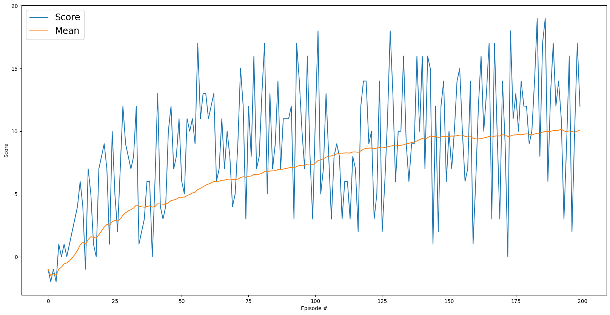

# Project 1: Navigation

## Description of the Implementation

### Algorithm Selection and Architecture

#### Choice of Algorithm

I implemented a Deep Q-Network (DQN), a groundbreaking reinforcement learning algorithm that combines Q-learning with deep neural networks to handle complex state spaces. DQN learns by approximating a value function that predicts the expected cumulative reward for each action in a given state. The "deep" aspect comes from using neural networks to learn this mapping, allowing the agent to generalize across similar situations, while the Q-learning component provides the framework for learning optimal actions through trial and error. This combination enables DQN to learn directly from high-dimensional sensory inputs and make decisions that maximize long-term rewards, making it particularly effective for tasks like our navigation challenge.

The selection of DQN was based on several key factors:

1. **Discrete Action Space**: DQN is particularly well-suited for environments with discrete action spaces, like our navigation task where the agent must choose between four distinct actions (forward, backward, left, right).

2. **Q-Learning Foundation**: DQN extends traditional Q-learning by using a neural network to approximate the Q-function. The Q-function Q(s,a) represents the expected cumulative reward starting from state s, taking action a, and following the optimal policy thereafter:

   Q(s,a) = E[R₁ + γR₂ + γ²R₃ + ... | s₀=s, a₀=a]

   where γ is the discount factor and Rₜ represents rewards at each timestep.

3. **Key Innovations**:
   - **Experience Replay**: Stores transitions (s, a, r, s') in a replay buffer and samples randomly for training, breaking harmful correlations in sequential experiences:
     ```
     D = {(s₁,a₁,r₁,s'₁), ..., (sₙ,aₙ,rₙ,s'ₙ)}
     ```

   - **Fixed Q-Targets**: Uses two networks (local and target) to reduce overestimation bias:
     ```
     L = E[(r + γ max_a' Q_target(s',a') - Q_local(s,a))²]
     ```
     where Q_target is periodically updated with Q_local's weights.

4. **Learning Process**:
   - The Bellman equation provides the foundation for updates:
     ```
     Q*(s,a) = E[r + γ max_a' Q*(s',a')]
     ```
   - The network minimizes the temporal difference (TD) error:
     ```
     δ = r + γ max_a' Q(s',a') - Q(s,a)
     ```

5. **Network Updates**:
   - Soft updates are used for the target network:
     ```
     θ_target = τθ_local + (1-τ)θ_target
     ```
     where τ is the soft update parameter (TAU = 1e-2 in our implementation)

This theoretical foundation, combined with practical innovations like experience replay and fixed Q-targets, makes DQN particularly effective for our navigation task, where the agent needs to learn optimal behavior from high-dimensional sensory inputs.

#### Network Architecture

The implementation offers two network architectures based on the configuration (USE_DUELING_NETWORK flag):

1. **Standard DQN Network** (when USE_DUELING_NETWORK = False):
   - Input Layer: Accepts state vector
   - Hidden Layers: [128, 64] nodes with ReLU activation
   - Output Layer: Action size nodes (Q-values for each action)

2. **Dueling Network** (when USE_DUELING_NETWORK = True):
   - Input Layer: Accepts state vector
   - Feature Layer: Common layer for both streams
   - Advantage Stream:
     - Hidden Layers: [128, 64] nodes with ReLU activation
     - Output: Action-dependent advantage values
   - State Value Stream:
     - Hidden Layers: [64, 32] nodes with ReLU activation
     - Output: Single state value
   - Output Layer: Combines advantage and state value streams

The implementation uses the Dueling Network architecture by default (USE_DUELING_NETWORK = True), which separates the estimation of state value and action advantages for better performance.

### Hyperparameters

The training process utilized the following hyperparameters:
- Episodes: 200
- Max timesteps per episode: 300
- Starting epsilon: 0.10
- Minimum epsilon: 0.01
- Epsilon decay: 0.987
- Learning rate: Started at ~0.000227, decaying to ~0.000107

### Training Results

The training showed consistent improvement over time:
- Episode 100: 
  - Average Score: 7.34
  - Epsilon: 0.0270
  - Learning Rate: 0.000227
- Episode 200:
  - Average Score: 10.10
  - Epsilon: 0.0100
  - Learning Rate: 0.000107

The reward graph shows both individual episode scores and the moving average:


### Future Improvements

To enhance the model's performance, several approaches could be explored:
1. Extend training duration beyond 200 episodes to reach the target score of 13.0
2. Experiment with different network architectures (varying layer sizes and depths)
3. Implement advanced DQN variants such as Double DQN or Dueling DQN
4. Fine-tune hyperparameters, particularly the learning rate decay and epsilon decay rates
5. Add prioritized experience replay to potentially speed up learning